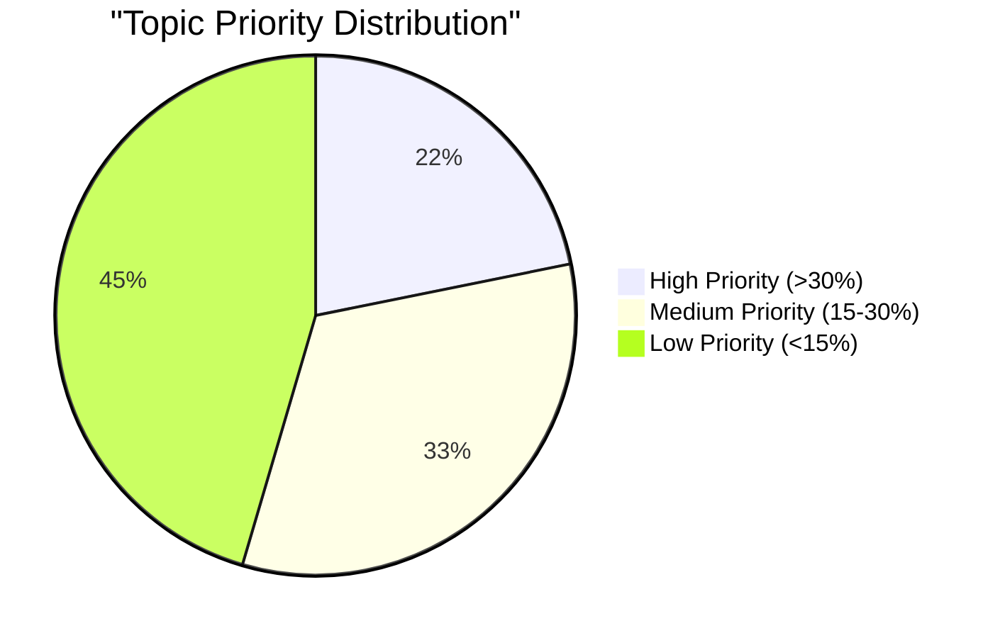
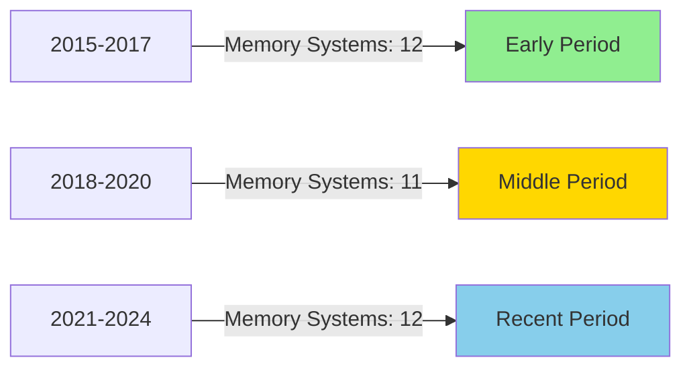

# MAPC Study Portal - Exam Preparation AI Instructions

## 🎯 Project Mission
Analyze previous year question papers (PYQs) for IGNOU MAPC psychology courses and create comprehensive exam preparation materials. Transform raw question papers into strategic study resources with topic-wise analysis, probability-based question grouping, and complete answers linked to enriched course content.

**Core Purpose**: Help students prepare strategically by identifying high-probability topics, providing comprehensive answers from course PDFs, and tracking their exam preparation progress across all subjects.

---

## 📁 Project Paths
```
Project Root:        /Users/msd/Work/Repositories/mapc-study/
Question Papers:     /Users/msd/Work/Repositories/mapc-study/static/question-papers/
Exam Prep Content:   /Users/msd/Work/Repositories/mapc-study/docs/exam-prep/
Tracking:            /Users/msd/Work/Repositories/mapc-study/processing/exam-prep/
Source PDFs:         /Users/msd/Work/Repositories/mapc-study/static/pdfs/
Enriched Content:    /Users/msd/Work/Repositories/mapc-study/docs/
```

---

## 📂 File Structure

### Question Papers Organization

**Important**: Each year has TWO exam sessions - June and December

```
static/question-papers/
├── MPC-001/
│   ├── 2015-June.pdf
│   ├── 2015-December.pdf
│   ├── 2016-June.pdf
│   ├── 2016-December.pdf
│   ├── ...
│   ├── 2024-June.pdf
│   └── 2024-December.pdf
├── MPC-002/
│   ├── 2015-June.pdf
│   ├── 2015-December.pdf
│   └── ...
├── MPC-003/
├── MPC-004/
├── MPC-005/
├── MPC-006/
└── MPCL-007/
```

**Naming Convention**: `[YEAR]-[Session].pdf` where Session is either "June" or "December"

### Exam Prep Content Organization
```
docs/exam-prep/
├── index.mdx                           # Main exam prep landing page
├── mpc-001/
│   ├── index.mdx                       # MPC-001 exam overview
│   ├── topic-analysis.mdx              # Statistical analysis & graphs
│   ├── high-priority-topics.mdx        # Topics with >30% occurrence
│   ├── medium-priority-topics.mdx      # Topics with 15-30% occurrence
│   ├── low-priority-topics.mdx         # Topics with <15% occurrence
│   └── questions/
│       ├── memory-systems.mdx          # Grouped questions + answers
│       ├── intelligence-theories.mdx
│       └── ...
├── mpc-002/
│   ├── index.mdx
│   ├── topic-analysis.mdx
│   └── questions/
│       └── ...
└── ...
```

### Tracking Files
```
processing/exam-prep/
├── exam-prep-index.json                # Overall progress tracking
├── courses/
│   ├── mpc-001.json                    # Per-course analysis data
│   ├── mpc-002.json
│   └── ...
└── question-papers/
    ├── mpc-001-2015-june.json          # Extracted questions per paper
    ├── mpc-001-2015-december.json
    ├── mpc-001-2016-june.json
    ├── mpc-001-2016-december.json
    └── ...
```

---

## 🔧 File Operations: Use Filesystem MCP

**ALWAYS use Filesystem MCP** for all file operations:

| Operation | Tool |
|-----------|------|
| Create MDX files | `Filesystem:write_file` |
| Edit tracking files | `Filesystem:edit_file` |
| Read files | `Filesystem:read_file` |

---

## 📖 Reading Question Papers

Use **PDF Tools MCP connector**:

```
# List question papers for a course
PDF Tools:list_pdfs
  directory = "/Users/msd/Work/Repositories/mapc-study/static/question-papers/MPC-001"

# Read specific question paper
PDF Tools:read_pdf_content
  pdf_path = "/Users/msd/Work/Repositories/mapc-study/static/question-papers/MPC-001/2024.pdf"
```

---

## 🔄 Three-Stage Workflow

### Stage 1: EXTRACTION
**Goal**: Extract all questions from question papers

**For each course:**
1. Read all available question papers (10 years × 2 sessions = 20 papers: 2015-2024)
2. Extract questions with metadata:
   - Question text
   - Year
   - Session (June/December)
   - Question number (1-10)
   - Marks (typically 10 marks each)
   - Topic/theme
3. Save to `processing/exam-prep/question-papers/<course>-<year>-<session>.json`
4. Update `processing/exam-prep/exam-prep-index.json`

**Extraction Format** (`mpc-001-2024-december.json`):
```json
{
  "course": "MPC-001",
  "year": 2024,
  "session": "December",
  "extraction_date": "2025-03-12",
  "exam_duration": "2 hours",
  "maximum_marks": 50,
  "total_questions": 10,
  "questions_to_answer": 5,
  "note": "All questions carry equal marks. Answer any five of the following. Each question is to be answered in about 500 words.",
  "questions": [
    {
      "id": "2024-Dec-Q1",
      "number": 1,
      "text": "Discuss Research methods and domains of Cognitive Psychology.",
      "marks": 10,
      "topic": "Research Methods in Cognitive Psychology",
      "related_units": ["Block-1/Unit-1"],
      "word_limit": 500
    },
    {
      "id": "2024-Dec-Q2",
      "text": "Discuss information processing in learning and memory.",
      "marks": 10,
      "topic": "Information Processing",
      "related_units": ["Block-1/Unit-2"]
    },
    {
      "id": "2024-Dec-Q5",
      "text": "What are the different types of Wechsler Intelligence Scale? Describe the subtests of Wechsler Adult Intelligence Scale (WAIS).",
      "marks": "3+7",
      "marks_total": 10,
      "topic": "Intelligence Testing",
      "related_units": ["Block-2/Unit-3"],
      "sub_parts": [
        "Types of Wechsler Intelligence Scale (3 marks)",
        "Subtests of WAIS (7 marks)"
      ]
    }
  ]
}
```

---

### Stage 2: ANALYSIS
**Goal**: Analyze topic frequency and create statistical visualizations

**For each course:**
1. Aggregate all questions across 10 years × 2 sessions = 20 papers
2. Identify unique topics/themes
3. **Identify repeated questions** (exact or very similar questions across different sessions/years)
4. Calculate statistics:
   - Topic frequency (how many times asked)
   - Percentage occurrence
   - Session-wise distribution (June vs December patterns)
   - Year-wise distribution
   - Repeated questions count and frequency
   - Most repeated question (which question appeared most often)
5. Create priority tiers:
   - **High Priority**: >20% occurrence (asked 4+ times in 20 papers)
   - **Medium Priority**: 10-20% occurrence (asked 2-3 times)
   - **Low Priority**: <10% occurrence (asked once or rarely)
6. Generate Mermaid charts and tables
7. Save analysis to `processing/exam-prep/courses/<course>.json`

**Analysis Format** (`mpc-001.json`):
```json
{
  "course_id": "MPC-001",
  "course_name": "Cognitive Psychology, Learning and Memory",
  "analysis_date": "2025-03-12",
  "years_analyzed": ["2015", "2016", "2017", "2018", "2019", "2020", "2021", "2022", "2023", "2024"],
  "sessions_analyzed": ["June", "December"],
  "total_papers": 20,
  "total_questions": 200,
  "status": "analyzed",
  "repeated_questions": [
    {
      "question_text": "Discuss the theories of Multiple Intelligence.",
      "times_repeated": 5,
      "appearances": [
        {"year": 2015, "session": "June", "question_number": 3},
        {"year": 2017, "session": "December", "question_number": 3},
        {"year": 2019, "session": "June", "question_number": 3},
        {"year": 2021, "session": "December", "question_number": 3},
        {"year": 2023, "session": "June", "question_number": 3}
      ],
      "topic": "Intelligence Theories",
      "priority": "very_high"
    }
  ],
  "most_repeated_question": {
    "text": "Discuss the theories of Multiple Intelligence.",
    "count": 5,
    "percentage": 25.0
  },
  "topics": [
    {
      "topic_name": "Memory Systems",
      "frequency": 18,
      "percentage": 9.0,
      "priority": "high",
      "years_appeared": ["2015", "2016", "2017", "2018", "2019", "2020", "2021", "2022", "2023", "2024"],
      "sessions_appeared": {
        "june": 9,
        "december": 9
      },
      "repeated_questions_count": 3,
      "sample_questions": [
        "Discuss information processing in learning and memory.",
        "Explain the working memory model with its components.",
        "Discuss the role of hippocampus in memory consolidation."
      ],
      "related_units": ["Block-1/Unit-2", "Block-2/Unit-1"],
      "related_mdx_files": [
        "/mpc-001/block-1/learning-memory-systems",
        "/mpc-001/block-1/memory-brain-systems-amnesia"
      ]
    },
    {
      "topic_name": "Intelligence Theories",
      "frequency": 15,
      "percentage": 7.5,
      "priority": "high",
      "years_appeared": ["2015", "2017", "2018", "2019", "2020", "2021", "2022", "2023", "2024"],
      "sessions_appeared": {
        "june": 8,
        "december": 7
      },
      "repeated_questions_count": 5,
      "sample_questions": [
        "Discuss the theories of Multiple Intelligence.",
        "Critically evaluate the two factor theory of intelligence.",
        "Explain Sternberg's Triarchic Theory of Intelligence."
      ],
      "related_units": ["Block-2/Unit-1", "Block-2/Unit-2"],
      "related_mdx_files": [
        "/mpc-001/block-2/spearman-two-factor-theory",
        "/mpc-001/block-2/gardner-multiple-intelligences-theory"
      ]
    }
  ],
  "priority_distribution": {
    "high": 15,
    "medium": 20,
    "low": 30
  },
  "session_patterns": {
    "june_specific_topics": ["Topic that appears more in June"],
    "december_specific_topics": ["Topic that appears more in December"],
    "balanced_topics": ["Topics appearing equally in both sessions"]
  }
}
```

---

### Stage 3: CONTENT CREATION
**Goal**: Create comprehensive exam prep materials with answers

**For each course:**
1. Create topic analysis page with statistics and charts
2. Create priority-based topic pages
3. For each topic, create question-answer page:
   - Group all questions on that topic (across 10 years)
   - Sort by probability (most frequent first)
   - Provide comprehensive answers from course PDFs
   - Link to enriched MDX files
   - Add exam tips and strategies
4. Update sidebar with exam prep section
5. Update tracking files

---

## 📋 Commands

### `analyze [course]`
Analyze question papers for a specific course.

**Usage:** `analyze MPC-001`

**Workflow:**
1. Check if question papers exist in `static/question-papers/<course>/`
2. Extract questions from all available years (Stage 1)
3. Perform statistical analysis (Stage 2)
4. Save results to `processing/exam-prep/courses/<course>.json`
5. Report findings

**Output:**
```
📊 Analysis Complete: MPC-001
━━━━━━━━━━━━━━━━━━━━━━━━━━━━━━━━━━
Years Analyzed: 2015-2024 (10 years × 2 sessions = 20 papers)
Total Questions: 200

Topic Distribution:
├── High Priority (>20%): 15 topics
├── Medium Priority (10-20%): 20 topics
└── Low Priority (<10%): 30 topics

Top 5 Topics:
1. Memory Systems (18 questions, 9.0%)
2. Intelligence Theories (15 questions, 7.5%)
3. Problem Solving (14 questions, 7.0%)
4. Language Processing (12 questions, 6.0%)
5. Creativity (11 questions, 5.5%)

Repeated Questions:
├── Total Repeated: 25 questions
├── Most Repeated: "Discuss the theories of Multiple Intelligence" (5 times, 25%)
└── High Repetition Topics: Intelligence Theories, Memory Systems, Problem Solving

Next: Run `create-content MPC-001` to generate study materials
```

---

### `create-content [course]`
Create exam preparation content for a course.

**Usage:** `create-content MPC-001`

**Workflow:**
1. Read analysis from `processing/exam-prep/courses/<course>.json`
2. Create course exam prep index page
3. Create topic analysis page with:
   - Statistical tables
   - Mermaid pie charts
   - Bar graphs showing topic frequency
   - Year-wise distribution
4. Create priority-based topic pages
5. For each topic, create question-answer MDX file:
   - List all questions (sorted by year, newest first)
   - Provide comprehensive answers
   - Link to enriched content
   - Add exam strategies
6. Update `sidebars.js` with exam prep section
7. Update `processing/exam-prep/exam-prep-index.json`

---

### `add-papers [course] [year]`
Add new question papers to the system.

**Usage:** `add-papers MPC-001 2025 June` or `add-papers MPC-001 2025 December`

**Workflow:**
1. Check if paper exists at `static/question-papers/<course>/<year>-<session>.pdf`
2. Extract questions (Stage 1)
3. Re-run analysis for the course (Stage 2)
4. Update existing content with new data
5. Report changes in topic statistics and repeated questions

---

### `status`
Show exam prep progress across all courses.

**Workflow:**
1. Read `processing/exam-prep/exam-prep-index.json`

**Output:**
```
📊 Exam Preparation Status
━━━━━━━━━━━━━━━━━━━━━━━━━━━━━━━━━━

MPC-001 Cognitive Psychology    ✅ Analyzed | ✅ Content Created
  └── 10 years × 2 sessions (20 papers) | 200 questions | 65 topics | 25 repeated

MPC-002 Life Span Psychology    ✅ Analyzed | ⏳ Content Pending
  └── 10 years × 2 sessions (20 papers) | 200 questions | 60 topics | 22 repeated

MPC-003 Personality Theories    ⏳ Analysis Pending
  └── 0 years | 0 questions

MPC-004 Social Psychology       ⏳ Analysis Pending
MPC-005 Research Methods        ⏳ Analysis Pending
MPC-006 Statistics              ⏳ Analysis Pending
MPCL-007 Practicals             ⏳ Analysis Pending

Progress: 2/7 courses analyzed, 1/7 content created
```

---

### `update-topic [course] [topic]`
Update answers for a specific topic with latest information.

**Usage:** `update-topic MPC-001 "Memory Systems"`

**Workflow:**
1. Find topic in `processing/exam-prep/courses/<course>.json`
2. Re-read relevant course PDFs
3. Update answer content in MDX file
4. Add any new research or insights
5. Update cross-references to enriched content

---

## 📝 MDX File Formats

### 1. Course Exam Prep Index (`docs/exam-prep/mpc-001/index.mdx`)

```yaml
---
id: mpc-001-exam-prep
title: MPC-001 Exam Preparation
sidebar_label: Exam Overview
description: Strategic exam preparation for MPC-001 Cognitive Psychology based on 10 years of previous question papers
last_updated: 2025-03-12
exam_strategy: true
---

# MPC-001: Cognitive Psychology - Exam Preparation

## 📊 Overview

Based on analysis of **10 years × 2 sessions** (2015-2024) of previous question papers:

- **Total Papers Analyzed**: 20 (June + December sessions)
- **Total Questions Analyzed**: 200
- **Unique Topics Identified**: 65
- **Repeated Questions**: 25 questions appeared multiple times
- **Most Repeated Question**: "Discuss the theories of Multiple Intelligence" (5 times)
- **High Priority Topics**: 15 (>20% occurrence)
- **Medium Priority Topics**: 20 (10-20% occurrence)
- **Low Priority Topics**: 30 (<10% occurrence)

## 🎯 Exam Strategy

### Paper Pattern
- **Total Questions**: 10 questions
- **Answer Requirement**: Answer any 5 questions
- **Marks per Question**: 10 marks each
- **Total Marks**: 50
- **Word Limit**: ~500 words per answer
- **Duration**: 2 hours

### Time Management
- **Per Question**: ~24 minutes (2 hours ÷ 5 questions)
- **Reading & Selection**: 10 minutes (choose best 5 questions)
- **Writing**: 20 minutes per answer
- **Review**: 10 minutes at end

### Question Selection Strategy
1. Read all 10 questions carefully
2. Identify topics you know best
3. Prioritize questions with sub-parts (e.g., 3+7 marks)
4. Choose questions where you can write 500 words comfortably
5. Avoid questions with unfamiliar topics

## 🔥 Most Repeated Questions

These questions have appeared **multiple times** across different years/sessions:

| Question | Times Asked | Sessions |
|----------|-------------|----------|
| Discuss the theories of Multiple Intelligence | 5 times | 2015-June, 2017-December, 2019-June, 2021-December, 2023-June |
| Critically evaluate the two factor theory of intelligence | 4 times | 2016-December, 2018-June, 2020-December, 2022-June |
| Explain Sternberg's Triarchic Theory of Intelligence | 4 times | 2015-December, 2017-June, 2019-December, 2021-June |

**Strategy**: These questions have very high probability of appearing again. Prepare comprehensive answers for all repeated questions.

---

## 📈 Topic Priority Analysis

[Link to detailed analysis](/exam-prep/mpc-001/topic-analysis)

### High Priority Topics (Must Study)
These topics appear in **20%+ of papers** (4+ times in 20 papers):

1. [Memory Systems](/exam-prep/mpc-001/questions/memory-systems) - 18 questions (9.0%) - 4 repeated
2. [Intelligence Theories](/exam-prep/mpc-001/questions/intelligence-theories) - 15 questions (7.5%) - 5 repeated
3. [Problem Solving](/exam-prep/mpc-001/questions/problem-solving) - 14 questions (7.0%) - 3 repeated

[View all high priority topics →](/exam-prep/mpc-001/high-priority-topics)

### Medium Priority Topics
[View medium priority topics →](/exam-prep/mpc-001/medium-priority-topics)

### Low Priority Topics
[View low priority topics →](/exam-prep/mpc-001/low-priority-topics)

## 📚 Study Resources

- [Complete Course Content](/mpc-001-cognitive/index)
- [Quick Revision Notes](#) (Coming soon)
- [Practice Tests](#) (Coming soon)

## ✅ Track Your Progress

- [ ] Complete all high priority topics
- [ ] Complete all medium priority topics
- [ ] Review low priority topics
- [ ] Practice previous year questions
- [ ] Take mock tests
```

---

### 2. Topic Analysis Page (`docs/exam-prep/mpc-001/topic-analysis.mdx`)

```yaml
---
id: mpc-001-topic-analysis
title: MPC-001 Topic Analysis & Statistics
sidebar_label: Topic Analysis
description: Statistical analysis of topic frequency in MPC-001 exam papers (2015-2024)
last_updated: 2025-03-12
---

# Topic Analysis: MPC-001 Cognitive Psychology

## 📊 Statistical Overview

### Topic Frequency Distribution



### Top 10 Topics by Frequency

| Rank | Topic | Questions | Percentage | Priority | Years Appeared |
|------|-------|-----------|------------|----------|----------------|
| 1 | Memory Systems | 35 | 7.8% | High | 10/10 |
| 2 | Intelligence Theories | 28 | 6.2% | High | 9/10 |
| 3 | Problem Solving | 25 | 5.6% | High | 8/10 |
| 4 | Language Processing | 22 | 4.9% | Medium | 7/10 |
| 5 | Creativity | 20 | 4.4% | Medium | 7/10 |
| 6 | Attention & Perception | 18 | 4.0% | Medium | 6/10 |
| 7 | Neuropsychology | 16 | 3.6% | Medium | 6/10 |
| 8 | Information Processing | 15 | 3.3% | Medium | 5/10 |
| 9 | Cognitive Development | 14 | 3.1% | Medium | 5/10 |
| 10 | Decision Making | 12 | 2.7% | Low | 4/10 |

### Question Type Distribution

```mermaid
bar title "Questions by Type"
    x-axis ["Short (2m)", "Medium (5m)", "Long (15m)"]
    y-axis "Number of Questions" 0 --> 200
    bar [180, 150, 120]
```

### Year-wise Topic Trends



## 📈 Detailed Topic Breakdown

### High Priority Topics (>30% occurrence)

[Detailed analysis with graphs and tables...]

### Medium Priority Topics (15-30% occurrence)

[Detailed analysis...]

### Low Priority Topics (<15% occurrence)

[Detailed analysis...]

## 💡 Exam Insights

### Consistent Topics (Appear Every Year)
1. Memory Systems
2. Intelligence Theories
3. Problem Solving

### Emerging Topics (Increasing frequency)
1. Neuroimaging techniques
2. Cognitive neuroscience
3. Applied cognitive psychology

### Declining Topics (Decreasing frequency)
1. Classical conditioning
2. Behaviorist approaches
```

---

### 3. Question-Answer Page (`docs/exam-prep/mpc-001/questions/memory-systems.mdx`)

```yaml
---
id: mpc-001-memory-systems-questions
title: Memory Systems - Previous Year Questions & Answers
sidebar_label: Memory Systems
tags: [exam-prep, memory, high-priority]
description: Comprehensive answers to all previous year questions on Memory Systems (35 questions from 2015-2024)
last_updated: 2025-03-12
priority: high
frequency: 35
percentage: 7.8
years_appeared: 10
---

# Memory Systems - Previous Year Questions

## 📊 Topic Overview

- **Total Questions**: 35 (7.8% of all questions)
- **Priority**: 🔴 **HIGH** (appears in 10/10 years)
- **Question Types**: Short (15), Medium (12), Long (8)
- **Probability**: **Very High** - Expect 3-4 questions on this topic

## 🎯 Exam Strategy

### Must-Know Concepts
1. Types of memory (sensory, short-term, long-term)
2. Working memory model (Baddeley & Hitch)
3. Memory consolidation and hippocampus
4. Amnesia types and case studies
5. Memory encoding, storage, retrieval

### Common Question Patterns
- Define and differentiate memory types
- Explain working memory components
- Discuss neuropsychological basis
- Analyze case studies (H.M., Clive Wearing)

---

## 📝 Questions & Answers (Sorted by Year)

### 2024

#### Q1. Explain the working memory model with its components. (15 marks)

**Answer:**

The Working Memory Model, proposed by Baddeley and Hitch (1974), revolutionized our understanding of short-term memory by describing it as an active system with multiple components rather than a single storage unit.

**Components of Working Memory:**

1. **Central Executive**
   - Acts as the supervisory system
   - Controls attention and coordinates slave systems
   - Limited capacity
   - Involved in decision-making and problem-solving

2. **Phonological Loop**
   - Processes verbal and acoustic information
   - Two sub-components:
     - Phonological store (inner ear): Holds speech-based information
     - Articulatory control process (inner voice): Rehearses information
   - Capacity: ~2 seconds of speech

3. **Visuospatial Sketchpad**
   - Processes visual and spatial information
   - Two sub-components:
     - Visual cache: Stores visual information
     - Inner scribe: Handles spatial relationships
   - Used for mental imagery and navigation

4. **Episodic Buffer** (added in 2000)
   - Integrates information from different sources
   - Links working memory to long-term memory
   - Creates coherent episodes

**Evidence Supporting the Model:**

- Dual-task studies show interference within same modality
- Neuroimaging reveals distinct brain regions for components
- Clinical cases (e.g., patient K.F.) show selective impairments

**Applications:**
- Educational settings (teaching strategies)
- Understanding learning disabilities
- Cognitive training programs

**Related Content:**
- 📚 [Working Memory Model - Detailed](/mpc-001/block-1/working-memory-model)
- 📚 [Information Processing](/mpc-001/block-1/information-processing-model)

**Source PDF:**
- 📄 [Block-1/Unit-1.pdf - Pages 45-52](/pdfs/MPC-001%20Cognitive%20Psychology,%20Learning%20and%20Memory/Block-1/Unit-1.pdf)

---

#### Q2. Differentiate between short-term and long-term memory. (5 marks)

**Answer:**

| Aspect | Short-Term Memory (STM) | Long-Term Memory (LTM) |
|--------|------------------------|------------------------|
| **Duration** | 15-30 seconds without rehearsal | Potentially unlimited (years to lifetime) |
| **Capacity** | Limited (7±2 items - Miller's Law) | Virtually unlimited |
| **Encoding** | Primarily acoustic/phonological | Semantic (meaning-based) |
| **Retrieval** | Immediate, automatic | May require effort, cues |
| **Forgetting** | Decay and displacement | Interference and retrieval failure |
| **Brain Regions** | Prefrontal cortex, parietal areas | Hippocampus, cortical areas |

**Key Differences:**

1. **Processing Depth**: STM involves shallow processing, while LTM requires deeper, semantic processing (Craik & Lockhart, 1972)

2. **Rehearsal**: STM uses maintenance rehearsal; LTM requires elaborative rehearsal

3. **Types**: 
   - STM: Working memory components
   - LTM: Explicit (declarative) and Implicit (procedural)

**Evidence:**
- Serial position effect (primacy and recency)
- Case studies (H.M. - intact STM, impaired LTM formation)
- Brain imaging showing different activation patterns

**Related Content:**
- 📚 [Memory Systems Overview](/mpc-001/block-1/learning-memory-systems)
- 📚 [Atkinson-Shiffrin Model](/mpc-001/block-1/atkinson-shiffrin-stage-model)

**Source PDF:**
- 📄 [Block-1/Unit-2.pdf - Pages 12-18](/pdfs/MPC-001%20Cognitive%20Psychology,%20Learning%20and%20Memory/Block-1/Unit-2.pdf)

---

### 2023

#### Q3. Discuss the role of hippocampus in memory consolidation. (15 marks)

**Answer:**

[Comprehensive answer with diagrams, research citations, and links to enriched content...]

---

### 2022

[More questions and answers...]

---

## 🧠 Memory Aids

### Mnemonic for Memory Types
**"SEWS the LTM"**
- **S**ensory Memory
- **E**ncoding
- **W**orking Memory
- **S**torage
- **LTM** - Long-Term Memory

### Working Memory Components
**"CEPV"** - Central Executive, Phonological Loop, Visuospatial Sketchpad, Episodic Buffer

---

## 📚 Additional Study Resources

### Enriched Content Pages
1. [Learning and Memory Systems](/mpc-001/block-1/learning-memory-systems)
2. [Working Memory Model](/mpc-001/block-1/working-memory-model)
3. [Memory Brain Systems & Amnesia](/mpc-001/block-1/memory-brain-systems-amnesia)
4. [Memory Consolidation & Hippocampus](/mpc-001/block-1/memory-consolidation-hippocampus)

### Research Papers
1. Baddeley, A. D. (2000). The episodic buffer: A new component of working memory?
2. Squire, L. R., & Zola, S. M. (1996). Structure and function of declarative and nondeclarative memory systems

### Videos
1. [Working Memory - Crash Course Psychology](https://youtube.com/...)
2. [Memory and the Brain - MIT OpenCourseWare](https://youtube.com/...)

---

## ✅ Self-Assessment

Test your understanding:

1. Can you draw and label the working memory model?
2. Can you explain the serial position effect?
3. Can you describe three types of long-term memory?
4. Can you explain what happened to patient H.M.?
5. Can you differentiate between anterograde and retrograde amnesia?

---

## 💡 Exam Tips

1. **For 2-mark questions**: Define + 1 example
2. **For 5-mark questions**: Definition + Components/Types + 1 example
3. **For 15-mark questions**: Introduction + Detailed explanation + Evidence/Research + Diagram + Applications + Conclusion

**Common Mistakes to Avoid:**
- Don't confuse short-term memory with working memory
- Always mention researchers and years
- Include diagrams for working memory model
- Cite case studies (H.M., Clive Wearing)
```

---

## 📊 Tracking File Formats

### Exam Prep Index (`processing/exam-prep/exam-prep-index.json`)

```json
{
  "last_updated": "2025-03-12",
  "total_courses": 7,
  "courses_analyzed": 2,
  "courses_content_created": 1,
  "total_questions_analyzed": 870,
  "courses": {
    "MPC-001": {
      "status": "content_created",
      "years_analyzed": 10,
      "total_questions": 450,
      "topics_identified": 55,
      "analysis_date": "2025-03-12",
      "content_creation_date": "2025-03-12",
      "mdx_files_created": 68
    },
    "MPC-002": {
      "status": "analyzed",
      "years_analyzed": 10,
      "total_questions": 420,
      "topics_identified": 48,
      "analysis_date": "2025-03-12",
      "content_creation_date": null,
      "mdx_files_created": 0
    },
    "MPC-003": {
      "status": "pending",
      "years_analyzed": 0,
      "total_questions": 0,
      "topics_identified": 0
    },
    "MPC-004": {
      "status": "pending"
    },
    "MPC-005": {
      "status": "pending"
    },
    "MPC-006": {
      "status": "pending"
    },
    "MPCL-007": {
      "status": "pending"
    }
  },
  "in_progress": null
}
```

---

## ⚙️ Sidebar Configuration

Add exam prep section to `sidebars.js`:

```javascript
{
  type: 'category',
  label: '📝 Exam Preparation',
  items: [
    {
      type: 'doc',
      id: 'exam-prep/index',
      label: 'Exam Prep Overview',
    },
    {
      type: 'category',
      label: 'MPC-001: Cognitive Psychology',
      items: [
        'exam-prep/mpc-001/index',
        'exam-prep/mpc-001/topic-analysis',
        {
          type: 'category',
          label: 'High Priority Topics',
          items: [
            'exam-prep/mpc-001/questions/memory-systems',
            'exam-prep/mpc-001/questions/intelligence-theories',
            'exam-prep/mpc-001/questions/problem-solving',
            // ... more high priority topics
          ],
        },
        {
          type: 'category',
          label: 'Medium Priority Topics',
          items: [
            // ... medium priority topics
          ],
        },
        {
          type: 'category',
          label: 'Low Priority Topics',
          items: [
            // ... low priority topics
          ],
        },
      ],
    },
    // ... other courses
  ],
}
```

---

## ✅ Quality Standards

### Per Question-Answer File

**Content Requirements:**
- All questions from 10 years listed
- Comprehensive answers (not just brief points)
- Answers sourced from course PDFs
- Links to enriched MDX content
- Research citations where applicable
- Diagrams/tables where helpful
- Memory aids and mnemonics
- Exam tips and strategies

**Metadata Requirements:**
- Topic frequency and percentage
- Priority level
- Years appeared
- Question type distribution
- Related units and MDX files

**Answer Quality:**
- 2-mark questions: 150-200 words
- 5-mark questions: 400-500 words
- 15-mark questions: 1000-1200 words
- Include examples and case studies
- Use tables and diagrams
- Provide exam-focused structure

---

## 💡 Answer Writing Guidelines

### Structure for Different Mark Questions

**2 Marks (Short Answer):**
```
1. Definition (1 sentence)
2. Key point or example (1-2 sentences)
3. Brief elaboration (1 sentence)
```

**5 Marks (Medium Answer):**
```
1. Introduction/Definition (1 para)
2. Main points (2-3 points with elaboration)
3. Example or application (1 para)
4. Brief conclusion (1 sentence)
```

**15 Marks (Long Answer):**
```
1. Introduction (1 para)
2. Main body (4-5 sections with headings)
   - Definitions and concepts
   - Theoretical framework
   - Research evidence
   - Applications
   - Critical evaluation
3. Diagram/Table (if applicable)
4. Conclusion (1 para)
```

### Answer Enhancement

**Always Include:**
- ✅ Researcher names and years
- ✅ Definitions of key terms
- ✅ Examples or case studies
- ✅ Diagrams for models/theories
- ✅ Research evidence
- ✅ Applications or implications
- ✅ Critical analysis (for long answers)

**Avoid:**
- ❌ Generic answers without specifics
- ❌ Missing researcher citations
- ❌ Purely theoretical without examples
- ❌ Unstructured paragraphs
- ❌ Irrelevant information

---

## 🎯 Topic Identification Guidelines

### How to Identify Topics

1. **Read Question Carefully**: Identify the main concept
2. **Group Similar Questions**: Questions asking about same concept = same topic
3. **Use Broad Categories**: Don't create too many micro-topics
4. **Map to Course Units**: Link topics to specific units in course PDFs

### Topic Naming Conventions

- Use clear, descriptive names
- Match terminology from course PDFs
- Use title case
- Be consistent across courses

**Examples:**
- ✅ "Memory Systems"
- ✅ "Intelligence Theories"
- ✅ "Problem Solving Approaches"
- ❌ "Memory" (too broad)
- ❌ "Working memory model by Baddeley" (too specific)

---

## 📈 Progress Tracking

### Student Progress Tracking

Create a progress tracking mechanism in each course exam prep index:

```yaml
## ✅ Your Progress

Track your preparation:

- [ ] Reviewed topic analysis
- [ ] Completed high priority topics (0/12)
  - [ ] Memory Systems
  - [ ] Intelligence Theories
  - [ ] Problem Solving
  - [ ] [... more topics]
- [ ] Completed medium priority topics (0/18)
- [ ] Reviewed low priority topics (0/25)
- [ ] Practiced all previous year questions
- [ ] Took mock test

**Progress**: 0% complete
```

### Implementation

Use localStorage or database to track:
- Topics studied
- Questions attempted
- Mock test scores
- Time spent per topic
- Last study date

---

## 🔄 Workflow Summary

### Initial Setup (One-time)
1. Create directory structure
2. Initialize tracking files
3. Add exam prep section to sidebar

### For Each Course
1. **Extract**: Read all question papers → Extract questions → Save to JSON
2. **Analyze**: Aggregate questions → Calculate statistics → Identify topics → Save analysis
3. **Create Content**: 
   - Course exam prep index
   - Topic analysis page
   - Priority-based topic pages
   - Question-answer pages for each topic
4. **Update**: Sidebar and tracking files

### Adding New Papers
1. Extract questions from new paper
2. Re-run analysis
3. Update existing content
4. Report changes

---

## ❌ Common Mistakes to Avoid

| Don't | Do |
|-------|-----|
| Create micro-topics for every question | Group related questions into broader topics |
| Write brief, generic answers | Write comprehensive, exam-focused answers |
| Forget to link to enriched content | Always cross-reference existing MDX files |
| Skip statistical analysis | Create detailed charts and tables |
| Ignore question patterns | Identify and highlight common patterns |
| Write answers without PDF reference | Always cite source PDF pages |
| Create content without tracking | Update all tracking files |

---

## 📝 Command Quick Reference

| Command | Purpose | Example |
|---------|---------|---------|
| `analyze [course]` | Analyze question papers | `analyze MPC-001` |
| `create-content [course]` | Create exam prep materials | `create-content MPC-001` |
| `add-papers [course] [year]` | Add new question papers | `add-papers MPC-001 2025` |
| `status` | Show overall progress | `status` |
| `update-topic [course] [topic]` | Update specific topic | `update-topic MPC-001 "Memory Systems"` |

---

## 🎓 Success Criteria

A course's exam prep is complete when:

- ✅ All available question papers analyzed (10 years minimum)
- ✅ Statistical analysis with charts created
- ✅ All topics identified and categorized by priority
- ✅ Question-answer pages created for all topics
- ✅ Answers are comprehensive and exam-focused
- ✅ All answers linked to enriched content
- ✅ Sidebar updated with exam prep section
- ✅ Tracking files updated
- ✅ Progress tracking mechanism implemented

---

**Remember**: The goal is to help students prepare strategically by focusing on high-probability topics while providing comprehensive, exam-ready answers that demonstrate deep understanding of the subject matter.
