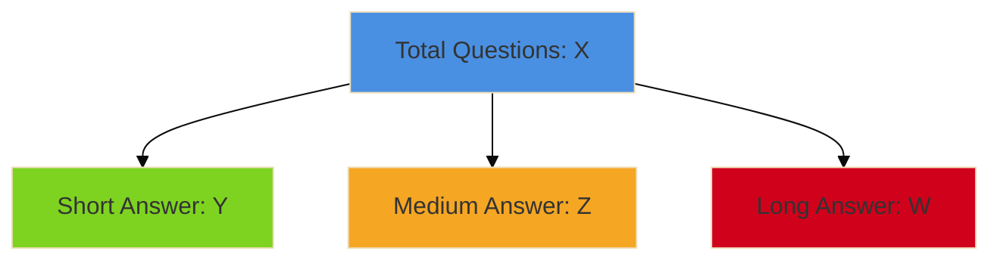
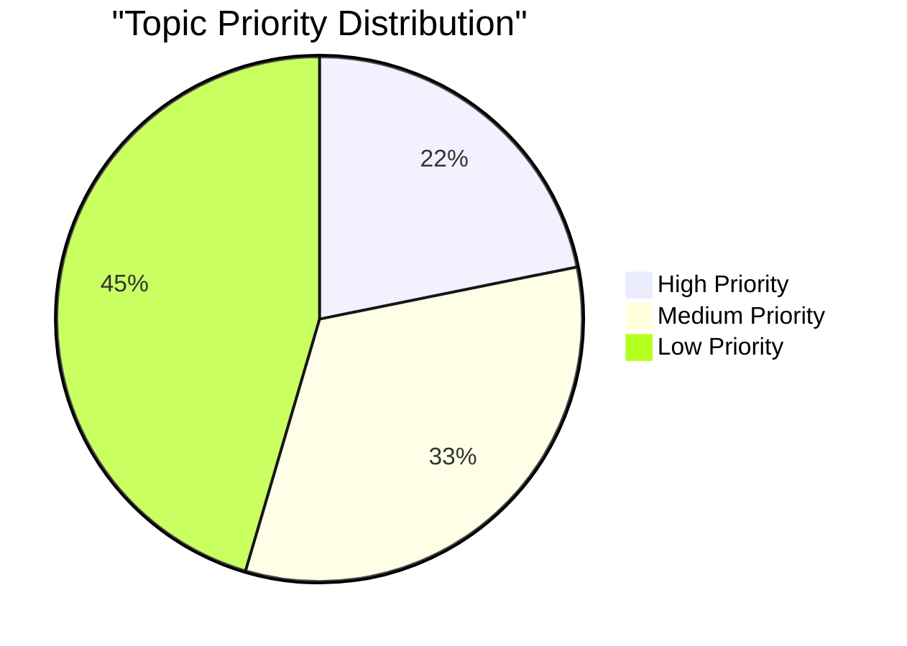
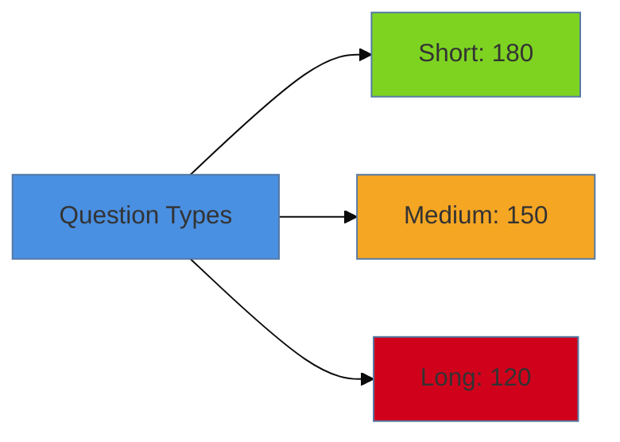
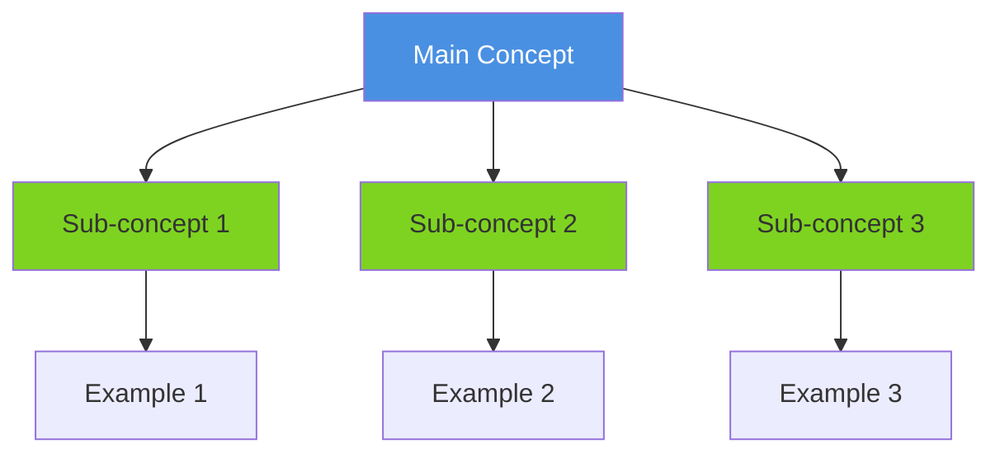
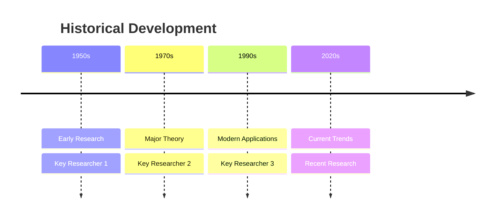

# Exam Preparation - MDX Templates

This file contains ready-to-use templates for creating exam preparation content.

---

## Template 1: Course Exam Prep Index

**Filename**: `docs/exam-prep/[course-id]/index.mdx`  
**Example**: `docs/exam-prep/mpc-001/index.mdx`

```mdx
---
id: [course-id]-exam-prep
title: [Course Code] Exam Preparation
sidebar_label: Exam Overview
description: Strategic exam preparation for [Course Code] [Course Name] based on [X] years of previous question papers
last_updated: YYYY-MM-DD
exam_strategy: true
---

# [Course Code]: [Course Name] - Exam Preparation

## 📊 Overview

Based on analysis of **[X] years × 2 sessions** ([Start Year]-[End Year]) of previous question papers:

- **Total Papers Analyzed**: [X × 2] (June + December sessions)
- **Total Questions Analyzed**: [Number]
- **Unique Topics Identified**: [Number]
- **Repeated Questions**: [Number] questions appeared multiple times
- **Most Repeated Question**: "[Question text]" ([X] times)
- **High Priority Topics**: [Number] (>20% occurrence)
- **Medium Priority Topics**: [Number] (10-20% occurrence)
- **Low Priority Topics**: [Number] (<10% occurrence)

## 🎯 Exam Strategy

### Paper Pattern
- **Total Questions**: 10 questions
- **Answer Requirement**: Answer any 5 questions
- **Marks per Question**: 10 marks each
- **Total Marks**: 50
- **Word Limit**: ~500 words per answer
- **Duration**: 2 hours

### Time Management
- **Per Question**: ~24 minutes (2 hours ÷ 5 questions)
- **Reading & Selection**: 10 minutes (choose best 5 questions)
- **Writing**: 20 minutes per answer
- **Review**: 10 minutes at end

### Question Selection Strategy
1. Read all 10 questions carefully
2. Identify topics you know best
3. Prioritize questions with sub-parts (e.g., 3+7 marks)
4. Choose questions where you can write 500 words comfortably
5. Avoid questions with unfamiliar topics

## 🔥 Most Repeated Questions

These questions have appeared **multiple times** across different years/sessions:

| Question | Times Asked | Sessions |
|----------|-------------|----------|
| [Question 1] | [X] times | [List of year-session] |
| [Question 2] | [X] times | [List of year-session] |
| [Question 3] | [X] times | [List of year-session] |

**Strategy**: These questions have very high probability of appearing again. Prepare comprehensive answers for all repeated questions.

---

## 📈 Topic Priority Analysis

[Link to detailed analysis](/exam-prep/[course-id]/topic-analysis)

### High Priority Topics (Must Study)
These topics appear in **20%+ of papers** (4+ times in 20 papers):

1. [Topic Name 1](/exam-prep/[course-id]/questions/[topic-slug-1]) - [X] questions ([Y]%) - [Z] repeated
2. [Topic Name 2](/exam-prep/[course-id]/questions/[topic-slug-2]) - [X] questions ([Y]%) - [Z] repeated
3. [Topic Name 3](/exam-prep/[course-id]/questions/[topic-slug-3]) - [X] questions ([Y]%) - [Z] repeated

[View all high priority topics →](/exam-prep/[course-id]/high-priority-topics)

### Medium Priority Topics
[View medium priority topics →](/exam-prep/[course-id]/medium-priority-topics)

### Low Priority Topics
[View low priority topics →](/exam-prep/[course-id]/low-priority-topics)

## 📚 Study Resources

- [Complete Course Content](/[course-id]/index)
- Quick Revision Notes (Coming soon)
- Practice Tests (Coming soon)

## ✅ Track Your Progress

- [ ] Complete all high priority topics
- [ ] Complete all medium priority topics
- [ ] Review low priority topics
- [ ] Practice previous year questions
- [ ] Take mock tests

**Progress**: 0% complete
```

---

## Template 2: Topic Analysis Page

**Filename**: `docs/exam-prep/[course-id]/topic-analysis.mdx`

```mdx
---
id: [course-id]-topic-analysis
title: [Course Code] Topic Analysis & Statistics
sidebar_label: Topic Analysis
description: Statistical analysis of topic frequency in [Course Code] exam papers ([Start Year]-[End Year])
last_updated: YYYY-MM-DD
---

# Topic Analysis: [Course Code] [Course Name]

## 📊 Statistical Overview

### Topic Frequency Distribution


### Top 10 Topics by Frequency

| Rank | Topic | Questions | Percentage | Priority | Papers Appeared | Repeated |
|------|-------|-----------|------------|----------|-----------------|----------|
| 1 | [Topic 1] | [X] | [Y]% | High | [Z]/20 | [R] times |
| 2 | [Topic 2] | [X] | [Y]% | High | [Z]/20 | [R] times |
| 3 | [Topic 3] | [X] | [Y]% | High | [Z]/20 | [R] times |
| 4 | [Topic 4] | [X] | [Y]% | Medium | [Z]/20 | [R] times |
| 5 | [Topic 5] | [X] | [Y]% | Medium | [Z]/20 | [R] times |
| 6 | [Topic 6] | [X] | [Y]% | Medium | [Z]/20 | [R] times |
| 7 | [Topic 7] | [X] | [Y]% | Medium | [Z]/20 | [R] times |
| 8 | [Topic 8] | [X] | [Y]% | Medium | [Z]/20 | [R] times |
| 9 | [Topic 9] | [X] | [Y]% | Medium | [Z]/20 | [R] times |
| 10 | [Topic 10] | [X] | [Y]% | Low | [Z]/20 | [R] times |

### Question Type Distribution



### Most Repeated Questions

| Rank | Question | Times Repeated | Sessions | Topic |
|------|----------|----------------|----------|-------|
| 1 | [Question text] | [X] | [List] | [Topic] |
| 2 | [Question text] | [X] | [List] | [Topic] |
| 3 | [Question text] | [X] | [List] | [Topic] |

### Session-wise Analysis

| Session | Total Papers | Questions | High Priority | Medium Priority | Low Priority |
|---------|--------------|-----------|---------------|-----------------|--------------|
| June | 10 | 100 | [X] | [Y] | [Z] |
| December | 10 | 100 | [X] | [Y] | [Z] |

### Year-wise Trend Analysis

| Year | Sessions | Total Questions | High Priority Topics | Medium Priority | Low Priority |
|------|----------|----------------|---------------------|-----------------|--------------|
| [Year] | [X] | [Y] | [Z] | [W] |
| [Year] | [X] | [Y] | [Z] | [W] |
| [Year] | [X] | [Y] | [Z] | [W] |

## 📈 Detailed Topic Breakdown

### High Priority Topics (>30% occurrence)

[List all high priority topics with detailed statistics]

### Medium Priority Topics (15-30% occurrence)

[List all medium priority topics]

### Low Priority Topics (<15% occurrence)

[List all low priority topics]

## 💡 Exam Insights

### Consistent Topics (Appear Every Year)
1. [Topic 1]
2. [Topic 2]
3. [Topic 3]

### Emerging Topics (Increasing frequency)
1. [Topic 1]
2. [Topic 2]
3. [Topic 3]

### Declining Topics (Decreasing frequency)
1. [Topic 1]
2. [Topic 2]
```

---

## Template 3: Question-Answer Page

**Filename**: `docs/exam-prep/[course-id]/questions/[topic-slug].mdx`

```mdx
---
id: [course-id]-[topic-slug]-questions
title: [Topic Name] - Previous Year Questions & Answers
sidebar_label: [Topic Name]
tags: [exam-prep, [tag1], [tag2], [priority]-priority]
description: Comprehensive answers to all previous year questions on [Topic Name] ([X] questions from [Start Year]-[End Year])
last_updated: YYYY-MM-DD
priority: [high/medium/low]
frequency: [X]
percentage: [Y]
years_appeared: [Z]
---

# [Topic Name] - Previous Year Questions

## 📊 Topic Overview

- **Total Questions**: [X] ([Y]% of all questions)
- **Priority**: [🔴 HIGH / 🟡 MEDIUM / 🟢 LOW]
- **Papers Appeared**: [X]/20 papers
- **Repeated Questions**: [X] questions asked multiple times
- **Session Distribution**: June ([X]), December ([Y])
- **Probability**: [Very High/High/Medium/Low] - Expect [X-Y] questions on this topic

## 🎯 Exam Strategy

### Must-Know Concepts
1. [Concept 1]
2. [Concept 2]
3. [Concept 3]
4. [Concept 4]
5. [Concept 5]

### Common Question Patterns
- [Pattern 1]
- [Pattern 2]
- [Pattern 3]

---

## 🔥 Repeated Questions (Highest Priority)

### Q1. [Question Text] - **REPEATED [X] TIMES**

**Appeared in:**
- [Year]-[Session]
- [Year]-[Session]
- [Year]-[Session]

**Answer:**

[Comprehensive answer...]

---

## 📝 All Questions (Sorted by Session)

### [Year]-[Session]

#### Q1. [Question Text] (10 marks)

**Answer:**

[Comprehensive answer following the mark-wise structure]

**Key Points:**
- [Point 1]
- [Point 2]
- [Point 3]

**Related Content:**
- 📚 [Related Topic 1](/[course-id]/[block]/[file])
- 📚 [Related Topic 2](/[course-id]/[block]/[file])

**Source PDF:**
- 📄 [Block-X/Unit-Y.pdf - Pages XX-YY](/pdfs/[Course Name]/Block-X/Unit-Y.pdf)

---

#### Q2. [Question Text] ([X] marks)

**Answer:**

[Answer content...]

---

### [Previous Year]

[More questions...]

---

## 🧠 Memory Aids

### Mnemonic for [Concept]
**"[Mnemonic]"**
- [Explanation]

### Key Formula/Framework
```
[Formula or framework visualization]
```

---

## 📚 Additional Study Resources

### Enriched Content Pages
1. [Link to related enriched content 1]
2. [Link to related enriched content 2]
3. [Link to related enriched content 3]

### Research Papers
1. [Author, Year. Title]
2. [Author, Year. Title]

### Videos
1. [Video Title - Source](URL)
2. [Video Title - Source](URL)

---

## ✅ Self-Assessment

Test your understanding:

1. [Question 1]
2. [Question 2]
3. [Question 3]
4. [Question 4]
5. [Question 5]

---

## 💡 Exam Tips

1. **For 2-mark questions**: [Tip]
2. **For 5-mark questions**: [Tip]
3. **For 15-mark questions**: [Tip]

**Common Mistakes to Avoid:**
- [Mistake 1]
- [Mistake 2]
- [Mistake 3]
```

---

## Template 4: Priority Topics List Page

**Filename**: `docs/exam-prep/[course-id]/high-priority-topics.mdx`

```mdx
---
id: [course-id]-high-priority-topics
title: [Course Code] High Priority Topics
sidebar_label: High Priority Topics
description: Topics with >30% occurrence in [Course Code] exam papers - Must study for exam success
last_updated: YYYY-MM-DD
---

# High Priority Topics - [Course Code]

## 🔴 Must Study Topics (>30% occurrence)

These topics appear in **more than 30%** of exam papers. Mastering these topics is essential for exam success.

### Topic List

| # | Topic | Questions | % | Years | Question Types | Study Status |
|---|-------|-----------|---|-------|----------------|--------------|
| 1 | [Topic 1](/exam-prep/[course-id]/questions/[slug-1]) | [X] | [Y]% | [Z]/10 | S:[A] M:[B] L:[C] | [ ] |
| 2 | [Topic 2](/exam-prep/[course-id]/questions/[slug-2]) | [X] | [Y]% | [Z]/10 | S:[A] M:[B] L:[C] | [ ] |
| 3 | [Topic 3](/exam-prep/[course-id]/questions/[slug-3]) | [X] | [Y]% | [Z]/10 | S:[A] M:[B] L:[C] | [ ] |

**Legend**: S = Short (2m), M = Medium (5m), L = Long (15m)

---

## 📖 Detailed Topic Breakdown

### 1. [Topic Name 1]

**Statistics:**
- Frequency: [X] questions ([Y]%)
- Years appeared: [List years]
- Question distribution: Short ([X]), Medium ([Y]), Long ([Z])

**Why it's important:**
[Brief explanation of why this topic is frequently asked]

**What to study:**
- [Key concept 1]
- [Key concept 2]
- [Key concept 3]

**Resources:**
- [Questions & Answers](/exam-prep/[course-id]/questions/[slug])
- [Enriched Content](/[course-id]/[block]/[file])

---

### 2. [Topic Name 2]

[Similar structure...]

---

## 🎯 Study Plan

### Week 1-2: Foundation Topics
- [ ] [Topic 1]
- [ ] [Topic 2]

### Week 3-4: Advanced Topics
- [ ] [Topic 3]
- [ ] [Topic 4]

### Week 5: Revision
- [ ] Review all high priority topics
- [ ] Practice previous year questions

---

## ✅ Progress Tracking

**Topics Completed**: 0/[X]  
**Progress**: 0%

Update your progress as you complete each topic!
```

---

## Answer Structure Guidelines

### 10-Mark Answer Structure (500 words)

For MAPC exams, ALL questions are 10 marks each with ~500 word limit:

```
Introduction (75-100 words)
- Definition of key terms
- Context and importance
- Brief overview of what will be discussed

Main Body (300-350 words)
- Point 1 with detailed elaboration (75-100 words)
  - Explanation
  - Example or research evidence
- Point 2 with detailed elaboration (75-100 words)
  - Explanation
  - Example or research evidence
- Point 3 with detailed elaboration (75-100 words)
  - Explanation
  - Example or research evidence
- Point 4 (if applicable) (50-75 words)

Conclusion (75-100 words)
- Summary of key points
- Practical applications or implications
- Contemporary relevance
```

### For Questions with Sub-parts (e.g., 3+7 marks)

```
Introduction (100-150 words)
- Definition and context
- Importance of the topic
- Brief overview of what will be discussed

Section 1: [Heading] (200-250 words)
- Detailed explanation
- Sub-points
- Examples

Section 2: [Heading] (200-250 words)
- Detailed explanation
- Sub-points
- Examples

Section 3: [Heading] (200-250 words)
- Research evidence
- Theories or models
- Diagram if applicable

Section 4: [Heading] (150-200 words)
- Applications
- Critical evaluation
- Contemporary perspectives

Conclusion (100-150 words)
- Summary of key points
- Significance
- Future directions or implications
```

---

## Mermaid Diagram Examples

### Pie Chart for Topic Distribution


### Bar Chart for Question Types


### Flowchart for Concept Explanation


### Timeline for Historical Development


---

## Table Examples

### Comparison Table
```markdown
| Aspect | Concept A | Concept B |
|--------|-----------|-----------|
| Definition | ... | ... |
| Key Features | ... | ... |
| Applications | ... | ... |
| Strengths | ... | ... |
| Limitations | ... | ... |
```

### Statistical Table
```markdown
| Topic | 2015 | 2016 | 2017 | 2018 | 2019 | 2020 | 2021 | 2022 | 2023 | 2024 | Total |
|-------|------|------|------|------|------|------|------|------|------|------|-------|
| Topic 1 | 3 | 4 | 3 | 4 | 3 | 4 | 3 | 4 | 3 | 4 | 35 |
| Topic 2 | 2 | 3 | 2 | 3 | 3 | 3 | 3 | 3 | 3 | 3 | 28 |
```

---

## Checklist for Quality Control

Before marking a course's exam prep as complete, verify:

- [ ] All question papers extracted (minimum 10 years)
- [ ] All questions categorized by topic
- [ ] Statistical analysis completed with charts
- [ ] All high priority topics have question-answer pages
- [ ] All medium priority topics have question-answer pages
- [ ] All low priority topics documented
- [ ] All answers are comprehensive and exam-focused
- [ ] All answers cite source PDFs with page numbers
- [ ] All answers link to enriched content
- [ ] Memory aids included for complex topics
- [ ] Self-assessment questions added
- [ ] Exam tips and strategies provided
- [ ] Sidebar updated with exam prep section
- [ ] Tracking files updated
- [ ] Progress tracking mechanism implemented
