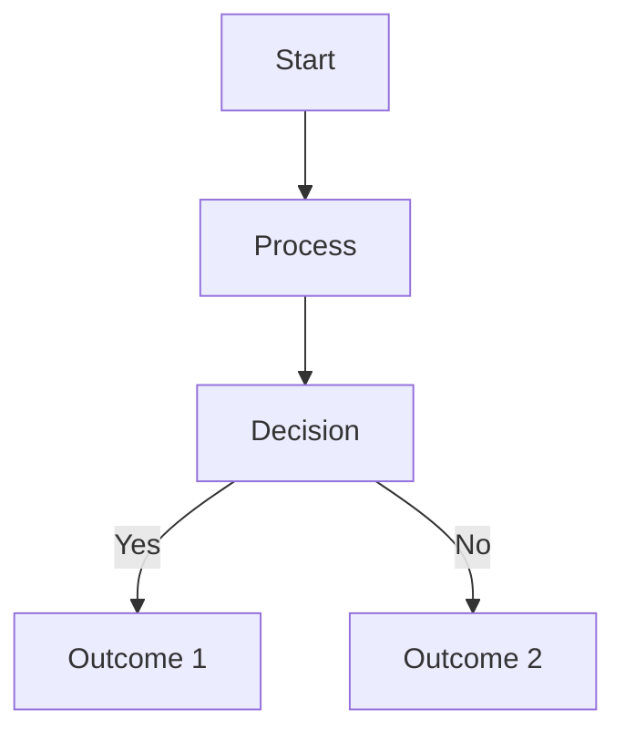

# MDX Content Template

## Standard MDX Format for Study Materials

### File Naming Convention
- Format: `XX-topic-name.mdx`
- Example: `01-introduction-cognitive-psychology.mdx`
- Use kebab-case
- Number by logical flow, not PDF order

### Complete MDX Template

```mdx
---
id: unique-identifier
title: Complete Title for SEO and Navigation
sidebar_label: Short Sidebar Title
tags: [psychology, cognitive, attention, memory]
keywords: [keyword1, keyword2, keyword3]
description: Brief description for SEO (max 160 characters)
draft: false
last_updated: 2024-12-12
estimated_time: 25 min
difficulty: intermediate
exam_importance: high
---

import Tabs from '@theme/Tabs';
import TabItem from '@theme/TabItem';
import Admonition from '@theme/Admonition';

# [Main Topic Title]

<div className="reading-time">
📚 **Estimated Reading Time**: X minutes | 🎯 **Exam Importance**: High/Medium/Low
</div>

## Overview

[2-3 sentences introducing the topic with a hook or real-world connection]

:::tip Real-World Connection
[Relatable example or application of this concept]
:::

## 🧠 Core Concepts

### [Concept 1 Name]

[Clear explanation in 2-3 paragraphs]

<Tabs>
<TabItem value="theory" label="Theory" default>

[Theoretical explanation]

> 📖 **Reference**: [Block-X/Unit-Y.pdf, Pages A-B]

</TabItem>
<TabItem value="example" label="Example">

[Practical example]

</TabItem>
<TabItem value="application" label="Application">

[Real-world application]

</TabItem>
</Tabs>

:::note Key Insight
[Important point to remember]
:::

### [Concept 2 Name]

[Explanation with visual aid if applicable]



> 📖 **Reference**: [Block-X/Unit-Y.pdf, Pages C-D]

## 🔬 Research & Evidence

### Classic Studies

| Study | Year | Key Finding | Impact |
|-------|------|------------|---------|
| [Researcher] | YYYY | [Finding] | [Impact on field] |

### Recent Developments (2020-2024)

- **[Recent Study 1]**: [Brief description] [Link](URL)
- **[Recent Study 2]**: [Brief description] [Link](URL)

## 💡 Clinical Applications

### In Practice

1. **[Application 1]**
   - Context: [Where/when used]
   - Method: [How it's applied]
   - Outcome: [Expected results]

2. **[Application 2]**
   - [Details]

:::warning Common Misconception
[Address a common misunderstanding]
:::

## 🎯 Exam Focus Points

<details>
<summary><b>High-Yield Topics for Exams</b></summary>

1. **[Topic 1]**: [Why important]
2. **[Topic 2]**: [Key points to remember]
3. **[Topic 3]**: [Common exam questions]

</details>

## 📚 Study Resources

### Essential Videos
- 🎥 [Video Title 1](YouTube URL) - Duration
- 🎥 [Video Title 2](YouTube URL) - Duration

### Recommended Reading
- 📄 [Wikipedia: Topic](URL)
- 📄 [Research Paper](DOI URL)
- 📄 [Educational Resource](URL)

### Memory Aids

#### Mnemonic
**[ACRONYM]** - [What each letter stands for]

#### Quick Formula
```
[Concept] = [Component 1] + [Component 2] + [Component 3]
```

## 🧪 Self-Assessment

### Quick Check Questions
1. [Question 1]?
2. [Question 2]?
3. [Question 3]?

<details>
<summary>Answers</summary>

1. [Answer 1]
2. [Answer 2]
3. [Answer 3]

</details>

## 🔗 Related Topics

### Prerequisites
- 📌 [Previous Topic](../path/to/topic)
- 📌 [Foundation Concept](../path/to/concept)

### Next Steps
- ➡️ [Next Topic](../path/to/next)
- ➡️ [Advanced Concept](../path/to/advanced)

### Cross-Course Connections
- 🔄 [Related in MPC-002](../../mpc-002/topic)
- 🔄 [Applied in MPC-005](../../mpc-005/topic)

## 📝 Summary

:::info Key Takeaways
- ✅ [Main point 1]
- ✅ [Main point 2]
- ✅ [Main point 3]
- ✅ [Main point 4]
:::

---

### 📚 Source Materials
**PDFs Processed**: 
- ✅ [MPC-XXX/Block-X/Unit-Y.pdf](/static/pdfs/MPC-XXX/Block-X/Unit-Y.pdf) - Pages A-B
- ✅ [MPC-XXX/Block-X/Unit-Z.pdf](/static/pdfs/MPC-XXX/Block-X/Unit-Z.pdf) - Pages C-D (supplementary)

**External Sources Used**:
- [Number] Wikipedia articles
- [Number] Research papers
- [Number] Educational videos
- [Number] Clinical resources

---

*Last Updated: [Date] | Next Review: [Date]*  
*Enrichment Level: ⭐⭐⭐⭐⭐*
```

## Component Examples

### Admonition Types
```mdx
:::note
General information
:::

:::tip
Helpful suggestion
:::

:::info
Important information
:::

:::warning
Caution or common mistake
:::

:::danger
Critical warning
:::
```

### Interactive Elements
```mdx
<Quiz question="What is...?" 
      options={["A", "B", "C", "D"]} 
      correct={1}
      explanation="Because..." />

<Flashcard front="Term" back="Definition" />

<InteractiveDemo type="attention-filter" />
```

### Tables
```mdx
| Header 1 | Header 2 | Header 3 |
|----------|----------|----------|
| Data 1   | Data 2   | Data 3   |
```

### Code Blocks
```mdx
```python
# For statistics examples
import numpy as np
mean = np.mean(data)
```
