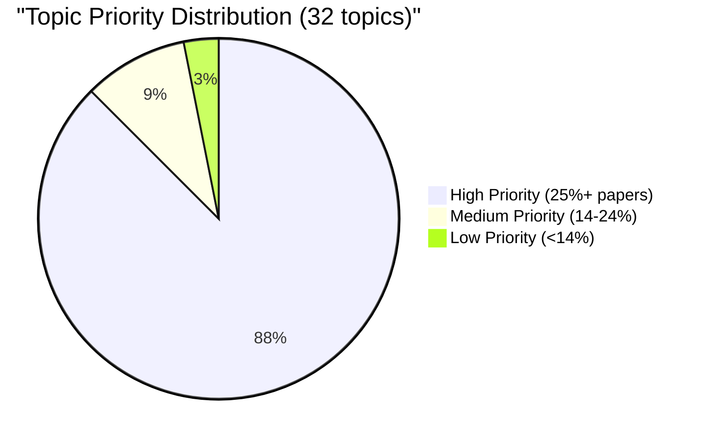
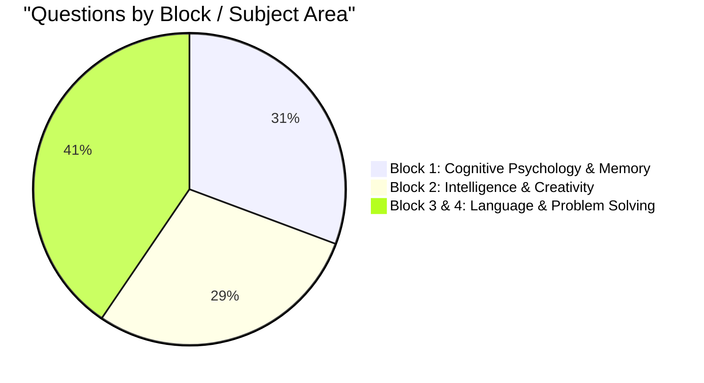
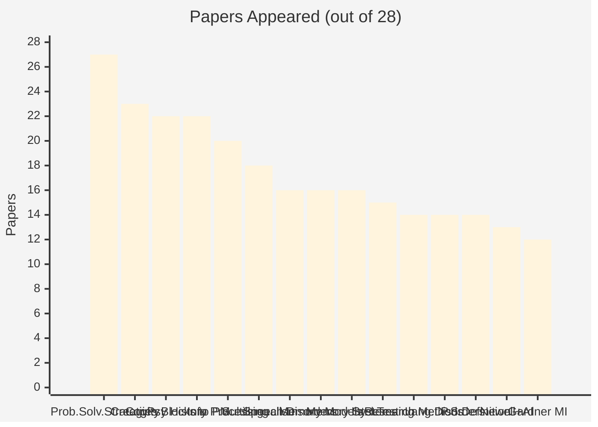

# Topic Analysis: MPC-001 Cognitive Psychology, Learning and Memory

## 📊 Statistical Overview

**Papers Analyzed**: 28 (2011–2024, June & December sessions)  
**Total Questions**: 316  
**Unique Topics**: 32  

---

## Top 10 Topics by Frequency

| Rank | Topic | Papers Appeared | % of Papers | Times in Exam | Priority |
|------|-------|-----------------|-------------|---------------|----------|
| 1 | Problem Solving Strategies & Techniques | 27 | 96.4% | 29 | 🔴 High |
| 2 | Creativity — Meaning, Aspects & Stages | 23 | 82.1% | 24 | 🔴 High |
| 3 | Cognitive Psychology — History & Definition | 22 | 78.6% | 22 | 🔴 High |
| 4 | Blocks to Problem Solving | 22 | 78.6% | 22 | 🔴 High |
| 5 | Information Processing | 20 | 71.4% | 20 | 🔴 High |
| 6 | Multilingualism | 18 | 64.3% | 18 | 🔴 High |
| 7 | Speech Disorders | 16 | 57.1% | 16 | 🔴 High |
| 8 | Memory Models | 16 | 57.1% | 16 | 🔴 High |
| 9 | Memory Systems (STM, LTM) | 16 | 57.1% | 16 | 🔴 High |
| 10 | Intelligence Testing & Measurement | 15 | 53.6% | 16 | 🔴 High |

---

## Topic Frequency Distribution

---

## Block-wise Topic Distribution

---

## Top 15 Topics — Horizontal Bar View

---

## Most Repeated Questions

| Rank | Question Theme | Repetitions | % of Papers | Topic |
|------|---------------|-------------|-------------|-------|
| 1 | Blocks to Problem Solving (all types) | 13 | 46.4% | Problem Solving |
| 2 | Creativity — Meaning, Aspects & Stages | 12 | 42.9% | Creativity |
| 3 | Multilingualism (meaning, types, thinking) | 13 | 46.4% | Language |
| 4 | Cognitive Psychology — History/Definition | 12 | 42.9% | Cognitive Psych |
| 5 | Problem Solving — Strategies & Techniques | 11 | 39.3% | Problem Solving |
| 6 | Language Acquisition (behaviourist/innateness) | 10 | 35.7% | Language |
| 7 | Neuropsychology of Learning & Memory | 9 | 32.1% | Memory |
| 8 | Spearman's Two-Factor Theory | 9 | 32.1% | Intelligence |
| 9 | Intelligence Testing & Measurement | 11 | 39.3% | Intelligence |
| 10 | PASS Theory of Intelligence | 8 | 28.6% | Intelligence |
| 11 | Guilford's Structure of Intellect | 6 | 21.4% | Intelligence |
| 12 | Levels of Processing (Craik & Lockhart) | 6 | 21.4% | Memory |
| 13 | Gardner's Multiple Intelligences | 6 | 21.4% | Intelligence |
| 14 | Memory Models (Atkinson-Shiffrin, Waugh-Norman) | 7 | 25.0% | Memory |
| 15 | Speech Disorders (Aphasia, Apraxia) | 8+ | 28.6%+ | Language |

---

## Session-Wise Analysis

| Session | Papers | Observations |
|---------|--------|--------------|
| June | 14 | Slightly heavier on Research Methods, PASS Theory, Sternberg |
| December | 14 | Slightly heavier on Levels of Processing, Key Issues in Cog Psych |
| Both equally | — | Creativity, Problem Solving, Memory, most Language topics |

:::tip Session Pattern
There is **no major June vs December divergence**. Prepare all high-priority topics regardless of session.
:::

---

## Year-wise Coverage (selected topics)

| Topic | 2011 | 2012 | 2013 | 2014 | 2015 | 2016 | 2017 | 2018 | 2019 | 2020 | 2021 | 2022 | 2023 | 2024 |
|-------|------|------|------|------|------|------|------|------|------|------|------|------|------|------|
| Prob. Solv. Strategies | ✅ | ✅ | ✅ | ✅ | ✅ | ✅ | ✅ | ✅ | ✅ | ✅ | ✅ | ✅ | ✅ | ✅ |
| Blocks to Prob Solv | ✅ | ✅ | ✅ | ✅ | ✅ | ✅ | ✅ | ✅ | ✅ | ✅ | ✅ | ✅ | ✅ | ✅ |
| Creativity | ✅ | ✅ | ✅ | ✅ | ✅ | — | ✅ | — | ✅ | ✅ | ✅ | ✅ | ✅ | ✅ |
| Cog Psych History | ✅ | ✅ | ✅ | ✅ | — | ✅ | ✅ | ✅ | ✅ | ✅ | ✅ | ✅ | ✅ | ✅ |
| Memory Models | ✅ | ✅ | ✅ | ✅ | — | — | ✅ | ✅ | — | ✅ | ✅ | ✅ | — | ✅ |
| Intelligence Testing | ✅ | ✅ | ✅ | — | ✅ | ✅ | — | — | — | — | ✅ | — | ✅ | ✅ |
| Multilingualism | ✅ | ✅ | ✅ | ✅ | ✅ | — | ✅ | ✅ | ✅ | — | — | ✅ | ✅ | ✅ |
| Language Acquisition | ✅ | ✅ | ✅ | ✅ | ✅ | — | ✅ | — | ✅ | — | ✅ | — | ✅ | ✅ |
| Speech Disorders | ✅ | — | ✅ | ✅ | ✅ | ✅ | ✅ | — | — | ✅ | ✅ | — | ✅ | ✅ |
| PASS Theory | ✅ | — | ✅ | ✅ | ✅ | — | ✅ | — | — | — | — | ✅ | ✅ | — |

---

## Block-by-Block Coverage Summary

### Block 1: Cognitive Psychology & Memory
| Topic | Papers | % |
|-------|--------|---|
| Cognitive Psychology — History & Definition | 22 | 78.6% |
| Information Processing | 20 | 71.4% |
| Research Methods | 14 | 50.0% |
| Memory Models (Atkinson-Shiffrin, Waugh-Norman) | 16 | 57.1% |
| Memory Systems (STM, LTM, Sensory) | 16 | 57.1% |
| Neuropsychology of Learning & Memory | 17 | 60.7% |
| Key Issues in Cognitive Psychology | 12 | 42.9% |
| Levels of Processing Model | 7 | 25.0% |

### Block 2: Intelligence & Creativity
| Topic | Papers | % |
|-------|--------|---|
| Creativity — Meaning, Aspects & Stages | 23 | 82.1% |
| Intelligence Testing & Measurement | 15 | 53.6% |
| Gardner's Multiple Intelligences | 12 | 42.9% |
| Spearman's Two-Factor Theory | 11 | 39.3% |
| PASS Theory of Intelligence | 10 | 35.7% |
| Creativity–Intelligence Relationship | 9 | 32.1% |
| Investment & Confluence Theory of Creativity | 8 | 28.6% |
| Guilford's Structure of Intellect | 8 | 28.6% |
| Sternberg's Triarchic Theory | 7 | 25.0% |
| Intelligence Theories — Factor Theories | 9 | 32.1% |

### Block 3 & 4: Language & Problem Solving
| Topic | Papers | % |
|-------|--------|---|
| Problem Solving Strategies & Techniques | 27 | 96.4% |
| Blocks to Problem Solving | 22 | 78.6% |
| Multilingualism | 18 | 64.3% |
| Language Acquisition | 17 | 60.7% |
| Speech Disorders | 16 | 57.1% |
| Language Disorders & Aphasia | 14 | 50.0% |
| Problem Solving — Definition & Types | 14 | 50.0% |
| Problem Solving — Newell's Approach & AI | 13 | 46.4% |
| Language Structure & Functions | 11 | 39.3% |
| Innateness Theory of Language | 7 | 25.0% |

---

## 💡 Exam Insights

### Topics That Appear EVERY Year (Study First)
1. **Problem Solving Strategies & Techniques** — 27/28 papers
2. **Blocks to Problem Solving** — appeared every year since 2012
3. **Creativity** — appeared in 23/28 papers, every year except 2016
4. **Cognitive Psychology History/Definition** — appeared every year

### Topics With Increasing Frequency (2019–2024)
- Multilingualism and language-thinking relationship
- Neuropsychology of memory (hippocampus, consolidation)
- Cognitive Psychology history and key issues
- Alfred Binet and history of intelligence measurement

### Topics With Occasional Gaps
- PASS Theory (not asked 2016, 2018–2021, 2024)
- Sternberg's Triarchic Theory (not asked every year)
- Levels of Processing (irregular — but when asked, full 10-mark question)

---

## 🎯 Strategic Study Recommendations

### If you have 4 weeks
**Week 1**: Block 4 — Problem Solving (all 5 topics, highest frequency)  
**Week 2**: Block 2 — Intelligence & Creativity (all 8 topics)  
**Week 3**: Block 3 & 4 — Language (all 7 topics)  
**Week 4**: Block 1 — Memory & Cognitive Psychology (all 8 topics) + revision  

### If you have 2 weeks
**Week 1**: Top 15 highest-frequency topics (covering ~85% of exam content)  
**Week 2**: Remaining high-priority topics + revision of repeated questions  

### If you have 3 days
Focus exclusively on the **Top 10 Most Repeated Question Themes** — these alone cover enough material to attempt all required questions in most papers.
