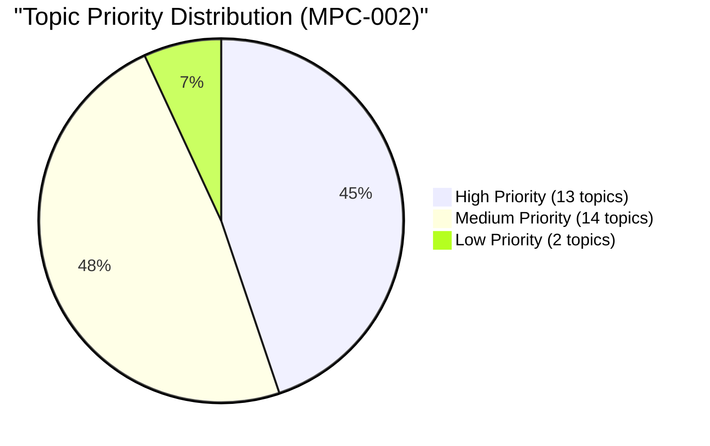

# Topic Analysis: MPC-002 Life Span Psychology

## 📊 Statistical Overview

### Papers Analyzed

- **Years**: 2011–2024 (14 years)
- **Sessions per year**: June + December
- **Total papers**: 27 successfully analyzed (2023-June was an unreadable image-only scan)
- **Total questions extracted**: 316

### Exam Format Change (Important!)

```
Pre-2015 Format:
  10 questions → Answer any 5 → 10 marks each → 50 marks total

2015–2024 Format:
  Section A: 4 questions → Answer 2 → 10 marks each (450 words)  = 20 marks
  Section B: 5 questions → Answer 4 → 6 marks each (250 words)   = 24 marks
  Section C: 3 questions → Answer 2 → 3 marks each (100 words)   = 6 marks
  Total: 50 marks
```

---

## 🎯 Topic Priority Distribution



---

## 📈 Top 13 Topics by Frequency

| Rank | Topic | Questions | % | Papers (of 27) | Repeated Q's | Priority |
|------|-------|-----------|---|----------------|--------------|----------|
| 1 | Adolescence | 38 | 12.0% | 25 | 8 | 🔴 High |
| 2 | Piaget's Cognitive Development | 32 | 10.1% | 24 | 6 | 🔴 High |
| 3 | Identity Development in Adolescence | 28 | 8.9% | 22 | 15 | 🔴 High |
| 4 | Prenatal Development | 22 | 7.0% | 18 | 4 | 🔴 High |
| 5 | Moral Development | 22 | 7.0% | 18 | 9 | 🔴 High |
| 6 | Ageing and Late Adulthood | 22 | 7.0% | 18 | 8 | 🔴 High |
| 7 | Infancy | 20 | 6.3% | 16 | 8 | 🔴 High |
| 8 | Psychosocial Development in Late Adulthood | 20 | 6.3% | 17 | 8 | 🔴 High |
| 9 | Learning Disability | 18 | 5.7% | 15 | 5 | 🔴 High |
| 10 | Issues in Lifespan Development | 18 | 5.7% | 14 | 4 | 🔴 High |
| 11 | Information Processing Approach | 16 | 5.1% | 14 | 7 | 🔴 High |
| 12 | Middle Adulthood | 16 | 5.1% | 14 | 4 | 🔴 High |
| 13 | Early Childhood | 16 | 5.1% | 13 | 3 | 🔴 High |

---

## 🔥 Most Repeated Questions (by Appearance Count)

| Rank | Question Cluster | Times Appeared | % of Papers | Topic |
|------|-----------------|----------------|-------------|-------|
| 1 | Identity crisis & Marcia's identity statuses | **15** | 55.6% | Identity Development |
| 2 | Psychosocial changes in late adulthood / old age | **8** | 29.6% | Psychosocial Late Adulthood |
| 3 | Issues & challenges of ageing / late adulthood | **8** | 29.6% | Ageing & Late Adulthood |
| 4 | Characteristics & hazards of infancy | **8** | 29.6% | Infancy |
| 5 | Challenges of adolescence | **8** | 29.6% | Adolescence |
| 6 | Information processing approach (adolescence) | **7** | 25.9% | Information Processing |
| 7 | Piaget's & Kohlberg's theories of moral development | **7+** | 25.9% | Moral Development |

---

## 🗓️ Year-wise Topic Appearance Trends

| Topic | 2011 | 2012 | 2013 | 2014 | 2015 | 2016 | 2017 | 2018 | 2019 | 2020 | 2021 | 2022 | 2023 | 2024 |
|-------|------|------|------|------|------|------|------|------|------|------|------|------|------|------|
| Adolescence | ✓ | ✓ | ✓ | ✓ | ✓ | ✓ | ✓ | ✓ | ✓ | ✓ | ✓ | ✓ | ✓ | ✓ |
| Identity/Marcia | ✓ | ✓ | ✓ | ✓ | ✓ | ✓ | ✓ | ✓ | ✓ | ✓ | ✓ | ✓ | ✓ | ✓ |
| Piaget Cognitive | ✓ | ✓ | ✓ | ✓ | ✓ | ✓ | ✓ | ✓ | ✓ | ✓ | ✓ | ✓ | ✓ | ✓ |
| Moral Development | ✓ | ✓ | ✓ | ✓ | ✓ | ✓ | — | ✓ | — | ✓ | ✓ | — | ✓ | ✓ |
| Prenatal | ✓ | ✓ | ✓ | ✓ | ✓ | ✓ | ✓ | ✓ | ✓ | ✓ | — | ✓ | — | ✓ |
| Infancy | ✓ | ✓ | ✓ | ✓ | ✓ | ✓ | — | ✓ | ✓ | ✓ | — | ✓ | ✓ | — |
| Late Adulthood | ✓ | ✓ | ✓ | ✓ | ✓ | ✓ | ✓ | ✓ | ✓ | ✓ | ✓ | ✓ | ✓ | ✓ |
| Info Processing | ✓ | ✓ | ✓ | — | ✓ | — | — | — | ✓ | ✓ | ✓ | ✓ | — | ✓ |
| Learning Disability | — | ✓ | ✓ | ✓ | ✓ | ✓ | ✓ | ✓ | ✓ | — | ✓ | ✓ | ✓ | ✓ |

---

## 📅 Session-wise Analysis

| Session | Papers | Key Favoured Topics |
|---------|--------|---------------------|
| **December** | 14 | Psychosocial changes in old age, Infancy characteristics, Cognitive changes in old age |
| **June** | 13 | Prenatal development, Information processing, Adolescence challenges |
| **Both equally** | — | Identity/Marcia, Moral development, Learning disability, Piaget's cognitive development |

---

## 📊 Medium Priority Topics (Frequency 8–14 questions)

| Topic | Questions | % | Papers | Priority |
|-------|-----------|---|--------|----------|
| [Cognitive Development in Adulthood](/exam-prep/mpc-002/questions/mpc-002-cognitive-development-adulthood) | 16 | 5.1% | 13 | 🟡 Medium |
| [Language Development](/exam-prep/mpc-002/questions/mpc-002-language-development) | 16 | 5.1% | 13 | 🟡 Medium |
| [Theories of Lifespan Development](/exam-prep/mpc-002/questions/mpc-002-theories-lifespan-development) | 14 | 4.4% | 12 | 🟡 Medium |
| [Research Methods in Lifespan](/exam-prep/mpc-002/questions/mpc-002-research-methods-lifespan) | 14 | 4.4% | 12 | 🟡 Medium |
| [Psychosocial Development in Adulthood](/exam-prep/mpc-002/questions/mpc-002-psychosocial-development-adulthood) | 14 | 4.4% | 12 | 🟡 Medium |
| [Motor Development](/exam-prep/mpc-002/questions/mpc-002-motor-development) | 14 | 4.4% | 11 | 🟡 Medium |
| [Growth and Development](/exam-prep/mpc-002/questions/mpc-002-growth-and-development) | 12 | 3.8% | 10 | 🟡 Medium |
| [Social Development](/exam-prep/mpc-002/questions/mpc-002-social-development) | 12 | 3.8% | 10 | 🟡 Medium |
| [Family Life Cycle](/exam-prep/mpc-002/questions/mpc-002-family-life-cycle) | 10 | 3.2% | 9 | 🟡 Medium |
| [Intellectual Disability](/exam-prep/mpc-002/questions/mpc-002-intellectual-disability) | 10 | 3.2% | 9 | 🟡 Medium |
| [Self-Concept and Self-Esteem](/exam-prep/mpc-002/questions/mpc-002-self-concept-self-esteem) | 10 | 3.2% | 9 | 🟡 Medium |
| [School Skills](/exam-prep/mpc-002/questions/mpc-002-school-skills) | 10 | 3.2% | 9 | 🟡 Medium |
| [Exceptional Children](/exam-prep/mpc-002/questions/mpc-002-exceptional-children) | 8 | 2.5% | 7 | 🟡 Medium |
| [Cognitive Development in Late Adulthood](/exam-prep/mpc-002/questions/mpc-002-cognitive-development-late-adulthood) | 8 | 2.5% | 7 | 🟡 Medium |

---

## 💡 Key Exam Insights

### Topics That Appear Every Single Year (2015–2024)
These topics have appeared in every year since 2015 — guaranteed to be in your exam:
1. **Adolescence** (challenges, sexuality, identity)
2. **Identity Development / Marcia's statuses**
3. **Late Adulthood** (psychosocial changes, ageing)
4. **Piaget's Cognitive Development** (middle childhood or adolescence)

### High-Probability Section C Short Notes
These topics frequently appear as short notes — prepare 100-word answers for each:
1. Identity crisis / Marcia's identity statuses
2. Types of attachment patterns
3. Retirement and leisure
4. Ego integrity vs despair
5. Obstacles in studying lifespan development
6. Characteristics of learning disability
7. Gifted and talented children

### Topics More Common in Section B (6-mark / 250 words)
- Motor development
- Language development
- Early childhood hazards
- Cognitive changes in adulthood
- Information processing

### Topics More Common in Section A (10-mark / 450 words)
- Identity development / Marcia
- Piaget's cognitive development
- Moral development (Piaget + Kohlberg)
- Psychosocial changes in late adulthood
- Prenatal development
- Issues in lifespan development
