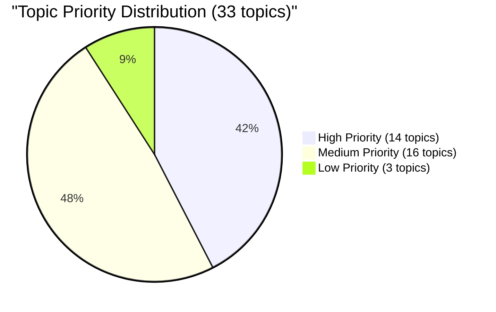
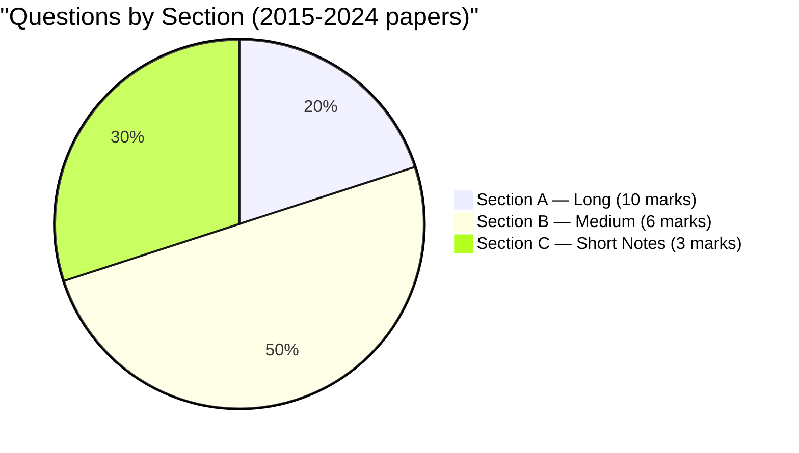

# Topic Analysis: MPC-003 Personality — Theories and Assessment

## 📊 Statistical Overview

**Papers Analyzed**: 27 (2011–2024, both sessions; 2012-June missing)  
**Total Questions**: ~225  
**Unique Topics**: 33

### Topic Priority Distribution

---

## 🏆 Top 14 Topics by Frequency

| Rank | Topic | Freq | % | Priority | Papers |
|------|-------|------|---|----------|--------|
| 1 | Behavioural Assessment | 18 | 8.0% | 🔴 High | 10/14 yrs |
| 2 | Social Learning Theory (Bandura) | 17 | 7.6% | 🔴 High | 11/14 yrs |
| 3 | Allport's Theory of Personality | 16 | 7.1% | 🔴 High | 12/14 yrs |
| 4 | Projective Techniques | 16 | 7.1% | 🔴 High | 10/14 yrs |
| 5 | Personality: Definition & Determinants | 15 | 6.7% | 🔴 High | 11/14 yrs |
| 6 | Eysenck's Theory | 14 | 6.2% | 🔴 High | 10/14 yrs |
| 7 | Cattell's Trait Theory | 14 | 6.2% | 🔴 High | 11/14 yrs |
| 8 | Classical Conditioning / Pavlov | 14 | 6.2% | 🔴 High | 9/14 yrs |
| 9 | Freud's Psychoanalytic Theory | 13 | 5.8% | 🔴 High | 9/14 yrs |
| 10 | Five Factor Model (Big Five) | 12 | 5.3% | 🔴 High | 9/14 yrs |
| 11 | Maslow's Hierarchy / Humanistic Theory | 12 | 5.3% | 🔴 High | 12/14 yrs |
| 12 | Rogers' Theory of Personality | 10 | 4.4% | 🔴 High | 7/14 yrs |
| 13 | Personality Assessment: Meaning & Purpose | 10 | 4.4% | 🔴 High | 9/14 yrs |
| 14 | Self-Report Inventories | 10 | 4.4% | 🔴 High | 10/14 yrs |

---

## 🔁 Most Repeated Questions

| Rank | Question Theme | Times | % of Papers |
|------|---------------|-------|-------------|
| 1 | Behavioural Assessment characteristics/assumptions/advantages/limitations | **13** | 48.1% |
| 2 | Bandura's Social Learning Theory | **12** | 44.4% |
| 3 | Allport's traits / proprium / functional autonomy / mature personality | **12** | 44.4% |
| 4 | Define Personality + Biological/Psychological factors | **11** | 40.7% |
| 5 | Projective Techniques (classification, strengths, weaknesses) | **11** | 40.7% |
| 6 | Eysenck's Type/Trait Hierarchy | **10** | 37.0% |
| 7 | Cattell's categories of traits / formula for personality | **10** | 37.0% |
| 8 | Classical Conditioning principles (Pavlov) | **10** | 37.0% |
| 9 | Big Five / Five Factor Model | **9** | 33.3% |
| 10 | Freud's Psychoanalytic Theory / Psychosexual Stages | **9** | 33.3% |

---

## 📐 Section-wise Distribution (2015–2024 format)

| Section | Role | Most Common Topics |
|---------|------|-------------------|
| **Section A** | Deep conceptual — 450 words | Bandura, Allport, Eysenck, Freud, Behavioural Assessment, Projective Techniques |
| **Section B** | Applied/analytical — 250 words | Cattell, Guilford, Classical Conditioning, Rogers, Sullivan, Case Study, Interview, Maslow |
| **Section C** | Definitions/brief notes — 100 words | TAT, Defense Mechanisms, Big Five, MMPI, Reciprocal Determinism, Introvert vs Extrovert |

---

## 📅 Year-wise Topic Coverage

| Year | Section A Themes | Section B Themes | Notable |
|------|-----------------|-----------------|---------|
| 2024 Jun | Big Five, Sullivan, Pavlov, Allport | Neurophysiological basis, Assessment criteria, Inkblot, Observational learning, Maslow | — |
| 2024 Dec | Personality+Psych factors, Behavioural Assessment, Social-cognitive theory, Eysenck | Cattell, Freud structural model, Maslow, Rorschach, Projective techniques | — |
| 2023 Jun | Physiological factors, Bandura, Type theories, History of assessment | Nature-nurture, Sullivan epochs, Schedules reinforcement, Proprium, Reliability/validity | — |
| 2023 Dec | Personality+Bio factors, Cattell, Bandura self-system, Allport | Eysenck hierarchy, Self-report tests, Case study, Nomothetic/idiographic, Classical conditioning | — |
| 2022 Jun | Nature-nurture, Rogers, Freud, Behavioural Assessment | Environmental factors, Classical Conditioning, Allport mature adult, Projective techniques, Self-report | — |
| 2022 Dec | Guilford, Skinner, Neurophysiological basis, Assessment meaning | Psychological factors, Self-actualisers, Allport traits, Modelling, Inkblot types | — |
| 2021 Jun | Type vs Trait + Guilford, Pavlov, Big Five + BFI, Behavioural Assessment | Environmental factors, Freud stages, Rogers, Proprium, Reliability/validity | — |
| 2021 Dec | Eysenck hierarchy, Bandura, Cattell, Projective Techniques | Nature-nurture, Operant/schedules, Maslow, Sheldon+Ayurvedic, TAT | — |
| 2020 Jun | Factors influencing personality, Humanistic theory, Case study, Assessment meaning | Guilford, Self-system+self-efficacy, Basic anxiety+neurotic needs, Projective techniques, Apperception | — |
| 2020 Dec | Projective Techniques, Rogers (critical), Behavioural Assessment, Self-report inventories | Cattell, Classical conditioning, Allport functional autonomy, Neurophysiological basis, Interview | — |
| 2019 Jun | Projective Techniques, Allport trait, Sullivan, Eysenck | Horney neurotic needs, Behavioural assessment, Self-report faking, Standardisation, Classical conditioning | — |
| 2019 Dec | Bio+Psych factors, Bandura, Case study, Behavioural assessment types | Guilford, Freud structural, Cattell categories, NEO-PI, Projective classification | — |
| 2018 Jun | Personality+determinants, Freud, Cattell, Testing criteria | Nomothetic vs idiographic, Schedules reinforcement, Self-actualisers, Proprium, Faking in inventories | — |
| 2018 Dec | Bio+Psych factors, Horney, Allport functional autonomy, Projective techniques | Guilford, Sullivan epochs, Observational learning, Type theory, Case study | — |
| 2017 Jun | Eysenck, Bandura, Allport functional autonomy, Observation+situational tests | Social acceptance+genes, Neurotic needs, Projective techniques, NEO-PI | — |
| 2017 Dec | Allport trait approach, Freud stages, Neurophysiological basis, Self-report+faking | Big Five, Sullivan personification+epochs, Observational learning, Behavioural assessment, Interview | — |
| 2016 Jun | Big Five, Pavlov, Allport proprium+traits, Self-report tests | Body build+homeostasis, Observational learning, Maslow, Cattell categories, Interview | — |
| 2016 Dec | Bio+Psych factors, Bandura, Neuropsychological basis, Behavioural assessment | Cattell, Projective techniques, Operant+schedules, Testing/measurement, Case study | — |
| 2015 Jun | Personality+issues, Horney social foundation, Traits+personal dispositions, Self-report | Environmental factors, Big Five, Freud stages, Schedules reinforcement, Behavioural assessment | — |
| 2015 Dec | Personality+genes, Bandura, Eysenck, Projective techniques | Psychological factors, Guilford, Defense mechanisms, Maslow, Behavioural assessment types | — |

---

## 💡 Exam Insights

### Topics Appearing in Every Year (2015–2024)
- Behavioural Assessment (in some form — Section A or B)
- Allport OR Cattell (at least one per paper)
- Bandura's Social Learning Theory
- Projective Techniques

### Safe Bets for Section A
Prepare full 450-word answers for: **Bandura**, **Allport**, **Eysenck**, **Freud**, **Behavioural Assessment**, **Projective Techniques**. At least 2 of these will appear in Section A of any given paper.

### Safe Bets for Section B
Prepare 250-word answers for: **Cattell**, **Guilford**, **Classical Conditioning**, **Maslow**, **Case Study Method**, **Interview Method**, **Schedules of Reinforcement**.

### Safe Bets for Section C
Always prepare: **TAT**, **Defense Mechanisms**, **Big Five/NEO-PI**, **Reciprocal Determinism/Self-Efficacy**, **Introvert vs Extrovert**, **MMPI**.
