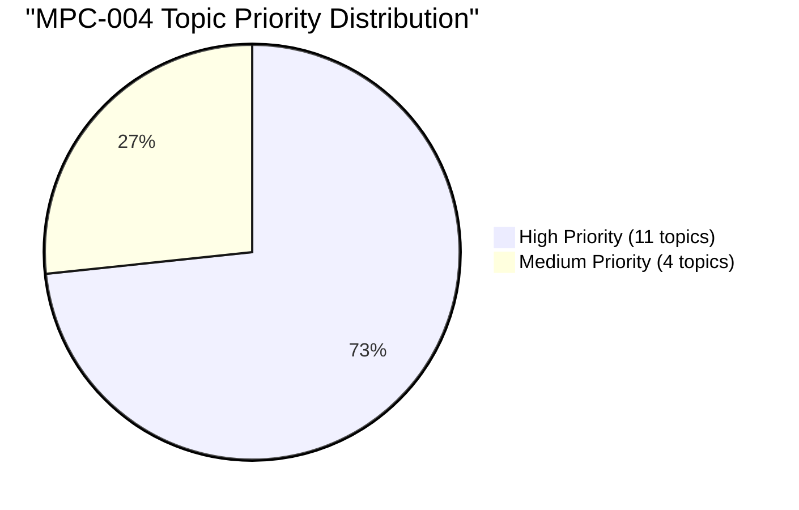

# Topic Analysis: MPC-004 Advanced Social Psychology

## 📊 Statistical Overview

**Papers Analyzed**: 28 (2011–2024, June + December)
**Total Questions**: ~280
**Unique Topics**: 15

### Topic Priority Distribution

### Top 10 Topics by Total Appearances

| Rank | Topic | Total Appearances | % of Questions | Priority |
|------|-------|-------------------|----------------|----------|
| 1 | Prejudice and Discrimination | 36 | 12.9% | 🔴 High |
| 2 | Group Dynamics | 30 | 10.7% | 🔴 High |
| 3 | Attitudes | 29 | 10.4% | 🔴 High |
| 4 | Research Methods | 23 | 8.2% | 🔴 High |
| 5 | Conformity and Obedience | 25 | 8.9% | 🔴 High |
| 6 | Person Perception and Attribution | 21 | 7.5% | 🔴 High |
| 7 | Aggression | 21 | 7.5% | 🔴 High |
| 8 | Social Conflict | 20 | 7.1% | 🔴 High |
| 9 | Interpersonal Attraction | 20 | 7.1% | 🔴 High |
| 10 | Pro-social Behaviour | 19 | 6.8% | 🔴 High |

### Section-wise Breakdown (2015–2024 format)

| Topic | Sec A (10m) | Sec B (6m) | Sec C (3m) | Total |
|-------|------------|-----------|-----------|-------|
| Prejudice and Discrimination | 18 | 12 | 6 | 36 |
| Group Dynamics | 14 | 12 | 4 | 30 |
| Attitudes | 16 | 10 | 3 | 29 |
| Conformity and Obedience | 14 | 6 | 5 | 25 |
| Research Methods | 10 | 8 | 5 | 23 |
| Person Perception and Attribution | 10 | 7 | 4 | 21 |
| Aggression | 12 | 6 | 3 | 21 |
| Social Conflict | 12 | 6 | 2 | 20 |
| Interpersonal Attraction | 10 | 8 | 2 | 20 |
| Pro-social Behaviour | 12 | 4 | 3 | 19 |
| Collective and Crowd Behaviour | 10 | 4 | 2 | 16 |
| Cooperation and Competition | 6 | 8 | 1 | 15 |
| Self-Perception | 4 | 8 | 2 | 14 |
| Social Identity | 4 | 4 | 5 | 13 |
| Nature, Scope and History | 8 | 3 | 1 | 12 |

---

## 🔁 Most Repeated Questions

| Rank | Question | Times Repeated | Topic |
|------|----------|----------------|-------|
| 1 | Methods of reducing prejudice and discrimination | 14 | Prejudice and Discrimination |
| 2 | Group definition, characteristics, types and rules | 14 | Group Dynamics |
| 3 | Factors affecting attitude formation | 13 | Attitudes |
| 4 | Nature/forms of social conflict and conflict resolution | 12 | Social Conflict |
| 5 | Conformity / Asch's study / factors increasing conformity | 11 | Conformity and Obedience |
| 6 | Interpersonal attraction and factors affecting it | 11 | Interpersonal Attraction |
| 7 | Theories of aggression / nature and causes | 11 | Aggression |
| 8 | Concept, importance and role of group dynamics | 10 | Group Dynamics |
| 9 | Pro-social behaviour / theories / helping behaviour | 10 | Pro-social Behaviour |
| 10 | Errors in attribution / attribution theory | 10 | Person Perception and Attribution |

---

## 🗓️ Session-wise Patterns

### December-Heavier Topics
These topics appear more frequently in December exams:
- **Social Conflict** — conflict and resolution questions peak in December
- **Conformity and Obedience** — Milgram/Asch questions favour December
- **Attitudes** — attitude change/formation questions more common in December

### June-Heavier Topics
- **Pro-social Behaviour** — helping behaviour and altruism questions more in June
- **Aggression** — theories of aggression appear more in June
- **Collective and Crowd Behaviour** — crowd theories peak in June

### Balanced Topics (Appear Equally in Both Sessions)
- Prejudice and Discrimination
- Group Dynamics
- Research Methods
- Interpersonal Attraction
- Person Perception and Attribution

---

## 💡 Exam Insights

### Topics Appearing in Every Year (2011–2024)
1. Prejudice and Discrimination
2. Group Dynamics
3. Attitudes
4. Social Conflict
5. Research Methods in Social Psychology

### Safest Bets for Section A
Based on 14-year analysis, these topics appear as 10-mark questions most consistently:
1. Prejudice and Discrimination (methods of reducing)
2. Group characteristics, types and formation
3. Conformity/Obedience (Asch/Milgram)
4. Theories of Aggression
5. Interpersonal Attraction factors

### Safest Bets for Section B (6-mark)
1. Attribution errors / attribution theory
2. Cooperation vs Competition
3. Bem's self-perception theory
4. Ethical issues in research
5. Crowd behaviour theories

### Safest Short Notes (Section C)
1. Stereotypes
2. Social identity
3. Types of groups
4. Obedience
5. Altruism
