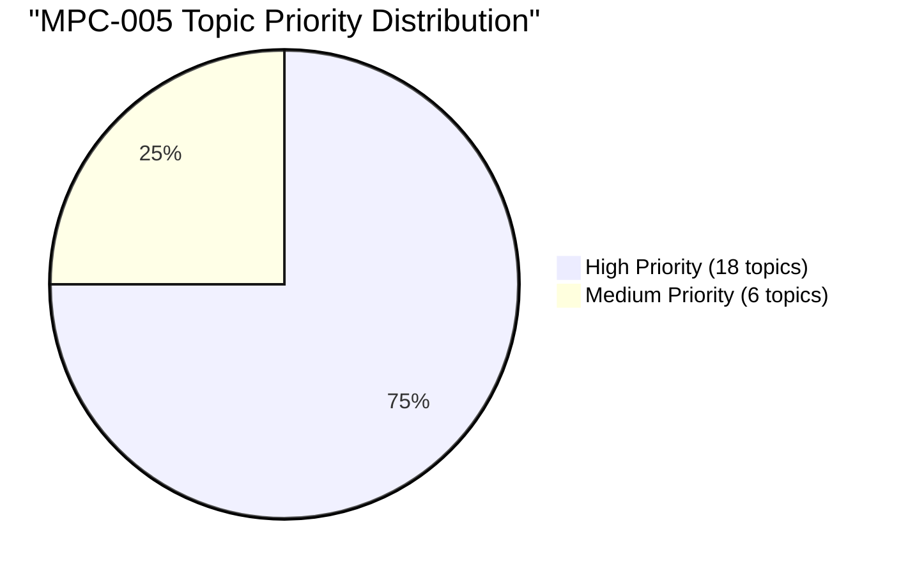

# Topic Analysis: MPC-005 Research Methods in Psychology

## 📊 Statistical Overview

**Papers Analyzed**: 28 (2011–2024, June + December)
**Total Questions**: ~280
**Unique Topics**: 24

### Topic Priority Distribution

### All Topics by Frequency (Papers Appeared)

| Rank | Topic | Papers | % | Sec A | Sec B | Sec C | Priority |
|------|-------|--------|---|-------|-------|-------|----------|
| 1 | Discourse Analysis | 18 | 64.3% | 8 | 7 | 3 | 🔴 High |
| 2 | Factorial Design | 17 | 60.7% | 10 | 5 | 2 | 🔴 High |
| 3 | Ethnography | 15 | 53.6% | 3 | 6 | 6 | 🔴 High |
| 4 | Validity | 16 | 57.1% | 5 | 9 | 2 | 🔴 High |
| 5 | Quasi-Experimental Design | 16 | 57.1% | 8 | 7 | 1 | 🔴 High |
| 6 | Survey Research | 16 | 57.1% | 8 | 6 | 2 | 🔴 High |
| 7 | Qualitative Research | 16 | 57.1% | 8 | 6 | 2 | 🔴 High |
| 8 | Grounded Theory | 16 | 57.1% | 10 | 4 | 2 | 🔴 High |
| 9 | Qualitative Research Report | 14 | 50.0% | 7 | 5 | 2 | 🔴 High |
| 10 | Experimental Research Design | 13 | 46.4% | 8 | 4 | 1 | 🔴 High |
| 11 | Correlational Research Design | 13 | 46.4% | 6 | 5 | 2 | 🔴 High |
| 12 | Reliability | 12 | 42.9% | 7 | 4 | 1 | 🔴 High |
| 13 | Sampling Methods | 12 | 42.9% | 6 | 5 | 1 | 🔴 High |
| 14 | Variables and Constructs | 12 | 42.9% | 5 | 6 | 1 | 🔴 High |
| 15 | Ex-Post Facto Research | 12 | 42.9% | 7 | 3 | 2 | 🔴 High |
| 16 | Qualities of Good Research | 12 | 42.9% | 3 | 3 | 6 | 🔴 High |
| 17 | Research Process | 10 | 35.7% | 9 | 1 | 0 | 🔴 High |
| 18 | Case Study | 10 | 35.7% | 4 | 3 | 3 | 🔴 High |
| 19 | Causal-Comparative Design | 9 | 32.1% | 3 | 5 | 1 | 🟡 Medium |
| 20 | Hypothesis | 8 | 28.6% | 3 | 4 | 1 | 🟡 Medium |
| 21 | Field Experiment | 8 | 28.6% | 4 | 2 | 2 | 🟡 Medium |
| 22 | Research Design (general) | 7 | 25.0% | 4 | 3 | 0 | 🟡 Medium |
| 23 | Content Analysis | 7 | 25.0% | 1 | 2 | 4 | 🟡 Medium |
| 24 | Research Biases | 5 | 17.9% | 2 | 1 | 2 | 🟡 Medium |

---

## 🔁 Most Repeated Questions

| Rank | Question | Times | Topic |
|------|----------|-------|-------|
| 1 | Approaches/steps in Discourse Analysis | 12 | Discourse Analysis |
| 2 | Goals, steps and coding in Grounded Theory | 12 | Grounded Theory |
| 3 | Types of Quasi-Experimental Design | 12 | Quasi-Experimental Design |
| 4 | Types and definition of Factorial Design | 11 | Factorial Design |
| 5 | Threats to internal/external validity | 11 | Validity |
| 6 | Steps in research process | 10 | Research Process |
| 7 | Methods of estimating reliability | 10 | Reliability |
| 8 | Types and methods of survey research | 10 | Survey Research |
| 9 | Evaluating/reporting qualitative data | 10 | Qualitative Research Report |
| 10 | Ex-post facto — concept, characteristics, steps | 9 | Ex-Post Facto Research |

---

## 🗓️ Session-wise Patterns

### June-Heavier Topics
- **Reliability** — methods of estimating reliability appear almost exclusively in June
- **Survey Research** — slightly more June appearances
- **Grounded Theory** — slightly more June

### December-Heavier Topics
- **Validity** — threats to internal validity heavily skewed to December (11 of 16 appearances)
- **Quasi-Experimental Design** — strongly December-dominant (12 of 16)
- **Research Process** — mostly December (7 of 10)

### Balanced Topics
- Factorial Design, Qualitative Research, Ethnography, Variables & Constructs

---

## 💡 Exam Insights

### Safe Section A Pairs (Most likely combinations)
- **June**: Grounded Theory + Factorial Design / Reliability + Survey Research
- **December**: Discourse Analysis + Quasi-Experimental Design / Validity + Research Process

### Safest Section B Bets
1. Validity (threats to external validity)
2. Variables and Constructs
3. Ethnography types and assumptions
4. Correlational vs Causal-Comparative
5. Hypothesis formulation

### Safest Section C Short Notes
1. Qualities of good research
2. Ethnography types
3. Content analysis
4. Ex-post facto (short)
5. Variables types
