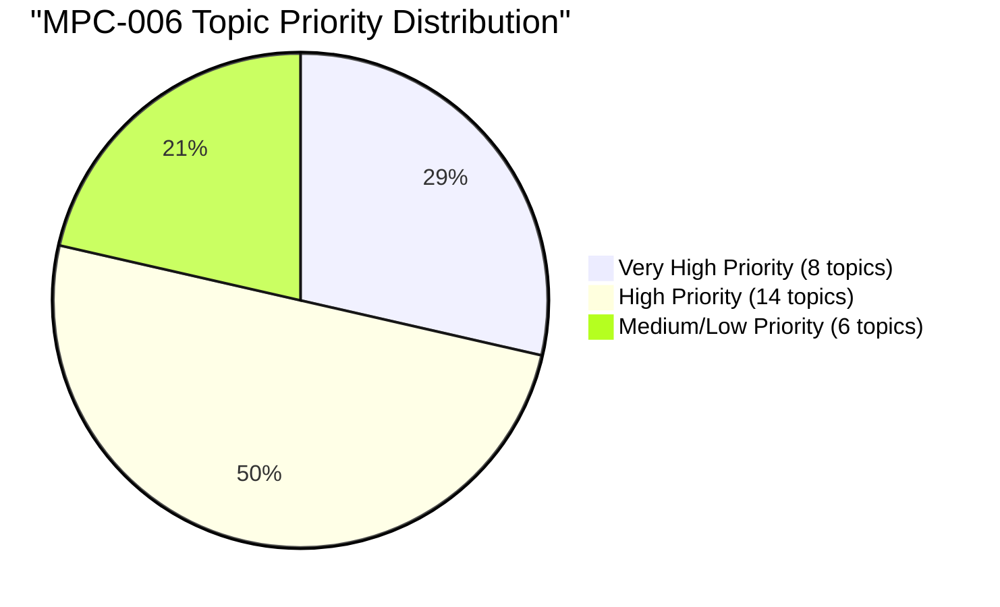

# Topic Analysis: MPC-006 Statistics in Psychology

## 📊 Statistical Overview

**Papers Analyzed**: 27 (2011–2024, June + December; 2019-December missing)  
**Total Questions**: ~225  
**Unique Topics**: 28

### Topic Priority Distribution

### All Topics by Frequency (Papers Appeared)

| Rank | Topic | Papers | % | Sec A | Sec B | Sec C | Priority |
|------|-------|--------|---|-------|-------|-------|----------|
| 1 | Parametric vs Non-parametric Statistics | 27 | 100.0% | 20 | 5 | 2 | 🔴 Very High |
| 2 | One-Way ANOVA | 22 | 81.5% | 20 | 2 | 0 | 🔴 Very High |
| 3 | Chi-Square Test | 22 | 81.5% | 8 | 12 | 2 | 🔴 Very High |
| 4 | Normal Distribution & NPC | 22 | 81.5% | 12 | 8 | 2 | 🔴 Very High |
| 5 | Hypothesis Testing | 20 | 74.1% | 10 | 8 | 2 | 🔴 Very High |
| 6 | Mann-Whitney U Test | 20 | 74.1% | 4 | 14 | 2 | 🔴 Very High |
| 7 | Spearman's Rank Correlation | 19 | 70.4% | 14 | 4 | 1 | 🔴 Very High |
| 8 | Regression Analysis | 18 | 66.7% | 12 | 5 | 1 | 🔴 Very High |
| 9 | Divergence from Normality | 16 | 59.3% | 8 | 6 | 2 | 🟠 High |
| 10 | Two-Way ANOVA | 14 | 51.9% | 2 | 10 | 2 | 🟠 High |
| 11 | Type I & Type II Errors | 13 | 48.1% | 3 | 4 | 6 | 🟠 High |
| 12 | Kendall's Tau Correlation | 12 | 44.4% | 6 | 5 | 1 | 🟠 High |
| 13 | Levels of Measurement | 12 | 44.4% | 2 | 8 | 2 | 🟠 High |
| 14 | Pearson's Product Moment Correlation | 12 | 44.4% | 10 | 2 | 0 | 🟠 High |
| 15 | Standard Error | 12 | 44.4% | 2 | 7 | 3 | 🟠 High |
| 16 | Central Tendency & Dispersion | 12 | 44.4% | 6 | 5 | 1 | 🟠 High |
| 17 | Data Organisation & Frequency Distribution | 12 | 44.4% | 6 | 5 | 1 | 🟠 High |
| 18 | Point Biserial & Phi Coefficient | 11 | 40.7% | 6 | 4 | 1 | 🟠 High |
| 19 | Partial & Part Correlation | 11 | 40.7% | 5 | 5 | 1 | 🟠 High |
| 20 | t-Test | 10 | 37.0% | 8 | 2 | 0 | 🟠 High |
| 21 | Biserial & Tetrachoric Correlation | 9 | 33.3% | 2 | 4 | 3 | 🟠 High |
| 22 | Kruskal-Wallis ANOVA | 9 | 33.3% | 1 | 4 | 4 | 🟠 High |
| 23 | Level of Significance | 9 | 33.3% | 3 | 2 | 4 | 🟡 Medium |
| 24 | Wilcoxon Signed Rank Test | 8 | 29.6% | 1 | 4 | 3 | 🟡 Medium |
| 25 | Multiple Regression & Correlation | 8 | 29.6% | 2 | 2 | 4 | 🟡 Medium |
| 26 | Variance | 7 | 25.9% | 2 | 2 | 3 | 🟡 Medium |
| 27 | Linear & Non-linear Relationship | 7 | 25.9% | 3 | 2 | 2 | 🟡 Medium |
| 28 | Skewness & Kurtosis | 7 | 25.9% | 1 | 2 | 4 | 🟡 Medium |

---

## 🔁 Most Repeated Questions

| Rank | Question | Times | Topic |
|------|----------|-------|-------|
| 1 | Parametric vs non-parametric — assumptions, adv, disadv | 20 | Parametric/Non-parametric |
| 2 | Compute one-way ANOVA for given data | 18 | One-Way ANOVA |
| 3 | Compute Chi-square for given data | 18 | Chi-Square |
| 4 | Compute Mann-Whitney U for given data | 15 | Mann-Whitney U |
| 5 | Compute Spearman's Rho for given data | 14 | Spearman's Rho |
| 6 | Explain/discuss normal probability curve and properties | 16 | Normal Distribution |
| 7 | Hypothesis testing — steps and errors | 14 | Hypothesis Testing |
| 8 | Compute regression equation | 12 | Regression |
| 9 | Describe divergence from normality (skewness, kurtosis) | 10 | Divergence |
| 10 | Compute Kendall's Tau for given data | 9 | Kendall's Tau |

---

## 🗓️ Section-wise Topic Map

### Section A Topics (10 marks — computation or long conceptual)
These topics dominate Section A. Expect **1 computation + 1 conceptual** every paper:

**Computation (Section A):**
- One-Way ANOVA (virtually every paper)
- Spearman's Rho (2 of every 3 papers)
- Regression equation (2 of every 3 papers)
- Pearson's r (mostly older papers, occasionally post-2015)
- t-Test (occasional)

**Conceptual (Section A):**
- Parametric vs Non-parametric (every single paper)
- Normal Probability Curve (very frequent)
- Hypothesis Testing (very frequent)
- Divergence from Normality (frequent)
- Descriptive Statistics / Data Organisation (moderate)

### Section B Topics (6 marks — medium computation or conceptual)
- **Computation**: Mann-Whitney U (nearly every paper), Chi-square (most papers), Kendall's Tau (frequent)
- **Conceptual**: Two-way ANOVA/interactional effect, Levels of measurement, Standard error, Point biserial & phi, Partial correlation, Kruskal-Wallis, Biserial & tetrachoric

### Section C Topics (3 marks — short notes)
Rotating short notes (write 4–5 key points):
- Type I and Type II errors (very frequent)
- Level of significance (frequent)
- Degrees of freedom (occasional)
- Kurtosis / Skewness (frequent)
- Standard error (occasional)
- Partial correlation (occasional)
- Wilcoxon test (occasional)
- Histogram / scatter plot (occasional)

---

## 💡 Exam Insights

### Guaranteed Questions (Appear Every Year)
1. **Parametric vs Non-parametric** — in some form, every single paper
2. **One-Way ANOVA computation** — almost every Section A
3. **Chi-square computation** — almost every paper (Section A or B)
4. **Normal Probability Curve** — properties or applications, every year

### Safe Section A Strategy
- Always be ready to answer: **Parametric/Non-parametric** (conceptual) + **ANOVA** (computation)
- Backup conceptual: Normal curve, Hypothesis testing, Divergence from normality
- Backup computation: Spearman's Rho, Regression equation

### Safe Section B Strategy
- **Mann-Whitney U** computation (nearly certain)
- **Two-way ANOVA / interactional effect** (reliable)
- **Levels of measurement** (reliable)
- 4th choice: Kruskal-Wallis, Standard error, or Point biserial

### Safest Section C Short Notes
1. Type I and Type II errors
2. Level of significance
3. Kurtosis (or skewness)
4. Degrees of freedom
