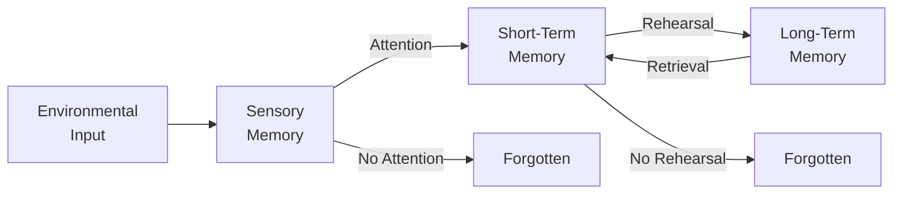
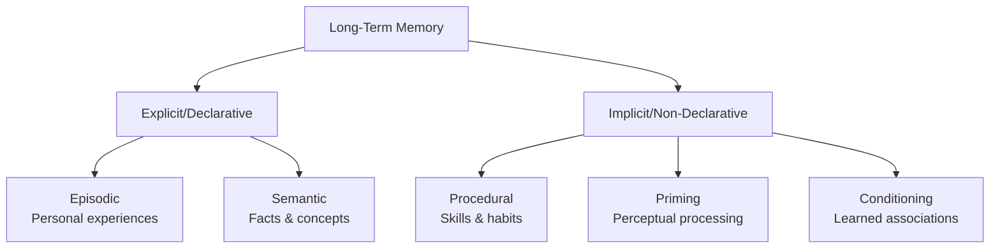

# The Information Processing Model of Memory

## Overview

Have you ever wondered how your brain turns a fleeting sensory experience – the smell of your grandmother's cooking or a professor's lecture – into a lasting memory you can retrieve years later? 🧠

The **information processing model** provides a powerful framework for understanding this remarkable feat. Just as a computer takes in data, processes it, and stores it for later use, your mind follows a similar sequence of operations to create, maintain, and access memories.

This approach, pioneered by cognitive psychologists in the 1960s, revolutionized how we understand human memory and learning – and it has profound implications for how you study and retain information!

> 📖 **Reference**: [MPC-001 Block-1/Unit-2.pdf, Pages 21-25]

## The Computer Metaphor

### Mind as Information Processor

The information processing approach views the human mind as analogous to a computer:

| Computer | Human Mind |
|----------|------------|
| Input devices (keyboard, mouse) | Sensory organs (eyes, ears, skin) |
| RAM (temporary storage) | Short-term/Working memory |
| Hard drive (permanent storage) | Long-term memory |
| CPU (central processing) | Attention and cognitive processing |
| Output (display, print) | Behavior, speech, actions |

> 💡 **Key Insight**: Like a computer, your brain receives input (sensory information), processes it through various stages, stores it for future use, and retrieves it when needed. However, unlike computers, human memory is reconstructive and susceptible to distortion.

### Three Core Processes

Memory involves three fundamental operations:

1. **Encoding** 📥
   - Converting sensory input into a form the brain can store
   - Like converting a document to a saveable file format
   - Types: visual, acoustic, and semantic encoding

2. **Storage** 💾
   - Maintaining encoded information over time
   - Like saving a file to your hard drive
   - Involves consolidation and organization

3. **Retrieval** 📤
   - Accessing and using stored information when needed
   - Like opening a saved file
   - Methods: recall, recognition, and relearning

> 📖 **Reference**: [MPC-001 Block-1/Unit-2.pdf, Pages 22-24]

## The Atkinson-Shiffrin Model (1968)

### The Multi-Store Model

American psychologists **Richard Atkinson** and **Richard Shiffrin** proposed the most influential information processing model of memory in 1968. Their "multi-store model" describes memory as flowing through three distinct storage systems:

### 1. Sensory Memory (SM)

The first stage captures raw sensory information from the environment:

**Characteristics:**
- **Duration**: Extremely brief (0.5-3 seconds)
- **Capacity**: Large but unprocessed
- **Encoding**: Modality-specific (visual, auditory, etc.)

**Types of Sensory Memory:**

| Type | Modality | Duration | Example |
|------|----------|----------|---------|
| **Iconic Memory** | Visual | ~0.5 seconds | Seeing a sparkler trail in the dark |
| **Echoic Memory** | Auditory | ~2-3 seconds | Hearing someone's words echo briefly |
| **Haptic Memory** | Touch | ~2 seconds | Feeling a texture after touch |

> 💡 **Real-world Example**: When someone says something and you reply "What?" but then immediately realize what they said – that's your echoic memory briefly holding their words!

**Key Studies:**
- **George Sperling (1960)**: Demonstrated iconic memory lasts about 1/3 second using partial report technique
- Showed that sensory memory has large capacity but rapid decay

> 📖 **Reference**: [MPC-001 Block-1/Unit-2.pdf, Pages 25-27]

### 2. Short-Term Memory (STM)

Information that receives **attention** moves from sensory memory to short-term memory:

**Characteristics:**
- **Duration**: 15-30 seconds without rehearsal
- **Capacity**: 7±2 items (Miller's Magic Number, 1956)
- **Encoding**: Primarily acoustic (sound-based)

**Key Processes in STM:**

1. **Maintenance Rehearsal**: Simple repetition to keep information active
   - Example: Repeating a phone number until you dial it
   
2. **Chunking**: Grouping information into meaningful units
   - Example: Remembering "FBI-CIA-USA" as 3 chunks instead of 9 letters

3. **Transfer to LTM**: Through elaborative rehearsal and meaningful processing

> 💡 **Study Tip**: Don't just repeat information – chunk it and connect it to things you already know! This dramatically improves retention.

> 📖 **Reference**: [MPC-001 Block-1/Unit-2.pdf, Pages 27-30]

### 3. Long-Term Memory (LTM)

Information that undergoes sufficient processing enters long-term memory:

**Characteristics:**
- **Duration**: Potentially unlimited (days to lifetime)
- **Capacity**: Virtually unlimited
- **Encoding**: Primarily semantic (meaning-based)

**Types of Long-Term Memory:**

| Type | Description | Example |
|------|-------------|---------|
| **Episodic** | Personal experiences and events | Your first day of college |
| **Semantic** | General knowledge and facts | Knowing that Delhi is India's capital |
| **Procedural** | Skills and "how to" knowledge | Riding a bicycle |
| **Priming** | Unconscious activation | Faster word recognition after exposure |

> 📖 **Reference**: [MPC-001 Block-1/Unit-2.pdf, Pages 30-33]

## Control Processes

Atkinson and Shiffrin identified several **control processes** that manage information flow:

### Attention
- Acts as a filter selecting what enters STM
- Determines which sensory information gets processed further

### Rehearsal
- **Maintenance Rehearsal**: Keeps information in STM through repetition
- **Elaborative Rehearsal**: Creates connections to existing knowledge, facilitating LTM transfer

### Encoding Strategies
- Mnemonics, visualization, organization
- Methods to enhance memory encoding

### Retrieval Strategies
- Cues, context recreation, systematic search
- Methods to access stored information

## Strengths of the Model

✅ **Influential Framework**: Shaped decades of memory research

✅ **Intuitive Structure**: Easy to understand and apply

✅ **Research Support**: Multiple studies support the distinction between memory stores

✅ **Clinical Applications**: Helps explain memory deficits in various conditions

✅ **Practical Utility**: Informs educational and study strategies

## Limitations and Criticisms

⚠️ **Oversimplification**: Memory is more complex than three discrete stores

⚠️ **Rehearsal Not Always Necessary**: Some memories form without conscious rehearsal (flashbulb memories)

⚠️ **Passive View**: Doesn't capture the active, reconstructive nature of memory

⚠️ **STM Underspecified**: Later research showed STM has multiple components

⚠️ **Serial Processing**: Suggests one-way flow, but evidence shows parallel processing and feedback loops

> 📖 **Reference**: [MPC-001 Block-1/Unit-2.pdf, Pages 34-36]

## Modern Developments

The Atkinson-Shiffrin model laid the groundwork for more sophisticated theories:

1. **Working Memory Model** (Baddeley & Hitch, 1974)
   - Replaced the simple STM with a multi-component working memory system
   - [See: Working Memory Model topic]

2. **Levels of Processing** (Craik & Lockhart, 1972)
   - Emphasized depth of processing over separate stores
   - [See: Levels of Processing topic]

3. **Connectionist Models**
   - View memory as networks of interconnected nodes
   - More biologically plausible

## Practical Applications

### For Students 📚

| Strategy | How It Uses the Model |
|----------|----------------------|
| **Active Reading** | Enhances encoding through deeper processing |
| **Spaced Repetition** | Strengthens LTM through distributed rehearsal |
| **Chunking** | Overcomes STM limitations |
| **Mnemonics** | Creates retrieval cues for LTM |
| **Self-Testing** | Practices retrieval, strengthening memory traces |

### For Educators 👨‍🏫

- Present information in manageable chunks
- Allow time for rehearsal and processing
- Use multiple encoding modalities (visual, auditory, kinesthetic)
- Connect new information to prior knowledge
- Provide retrieval practice opportunities

### For Clinicians 🏥

- Assess which memory system is impaired
- Design targeted rehabilitation strategies
- Understand patient limitations and capabilities

## Study Resources

### Videos

- 🎥 [How We Make Memories - Crash Course Psychology #13](https://www.youtube.com/watch?v=bSycdIx-C48) - Excellent overview of memory formation and the Atkinson-Shiffrin model
- 🎥 [Remembering and Forgetting - Crash Course Psychology #14](https://www.youtube.com/watch?v=HVWbrNls-Kw) - Covers retrieval and forgetting
- 🎥 [Memory - Crash Course Study Skills #3](https://www.youtube.com/watch?v=SZbdK9e9bxs) - Practical applications for students

### Additional Reading

- 📚 [Wikipedia: Atkinson-Shiffrin Memory Model](https://en.wikipedia.org/wiki/Atkinson–Shiffrin_memory_model) - Comprehensive overview
- 📚 [Simply Psychology: Multi-Store Model](https://www.simplypsychology.org/multi-store.html) - Clear explanation with diagrams
- 📚 [LibreTexts: Information Processing Theory](https://socialsci.libretexts.org/Bookshelves/Early_Childhood_Education/Child_Growth_and_Development_(Paris_Ricardo_Rymond_and_Johnson)/14:_Adolescence_-_Cognitive_Development/14.04:_Information_Processing_Theory-_Memory_Encoding_and_Storage) - Academic but accessible

### Research Papers

- 📄 Atkinson, R. C., & Shiffrin, R. M. (1968). Human memory: A proposed system and its control processes. *Psychology of Learning and Motivation, 2*, 89-195.
- 📄 Shiffrin, R. M., & Atkinson, R. C. (1969). Storage and retrieval processes in long-term memory. *Psychological Review, 76*(2), 179-193.

### Memory Aids

**Mnemonic for the Three Stores**: **SeSHoLo**
- **Se**nsory → **Sh**ort-term → **Lo**ng-term

**Remember Encoding Types**:
- **VAS** = Visual, Acoustic, Semantic (from shallow to deep)

**Miller's Magic Number**: "7 deadly sins, 7 days a week, 7±2 items in STM"

## Self-Assessment Questions

1. **Compare and contrast** the three memory stores in the Atkinson-Shiffrin model. What are the key differences in capacity, duration, and encoding?

2. **Explain** why attention is considered a "gateway" to memory formation in the information processing model.

3. **Analyze** the role of rehearsal in the transfer of information from STM to LTM. What are the limitations of this explanation?

4. **Apply** the information processing model to explain why you might forget where you put your keys.

5. **Evaluate** the strengths and limitations of the computer metaphor for understanding human memory.

6. **Design** a study strategy for an exam based on the principles of the information processing model.

## Summary

✅ The **information processing model** views the mind as a system that encodes, stores, and retrieves information

✅ **Three core processes**: Encoding (input), Storage (maintenance), Retrieval (output)

✅ The **Atkinson-Shiffrin model (1968)** proposes three memory stores: Sensory, Short-term, and Long-term

✅ **Sensory memory** holds raw input briefly (~0.5-3 seconds)

✅ **Short-term memory** has limited capacity (7±2 items) and duration (~15-30 seconds)

✅ **Long-term memory** has virtually unlimited capacity and duration

✅ **Control processes** (attention, rehearsal, encoding/retrieval strategies) manage information flow

✅ The model is influential but has limitations addressed by later theories

✅ Practical applications for students, educators, and clinicians

---
**Source PDFs**: 
- 📄 [MPC-001 Block-1/Unit-2.pdf - Pages 21-36](/pdfs/MPC-001%20Cognitive%20Psychology,%20Learning%20and%20Memory/Block-1/Unit-2.pdf)
