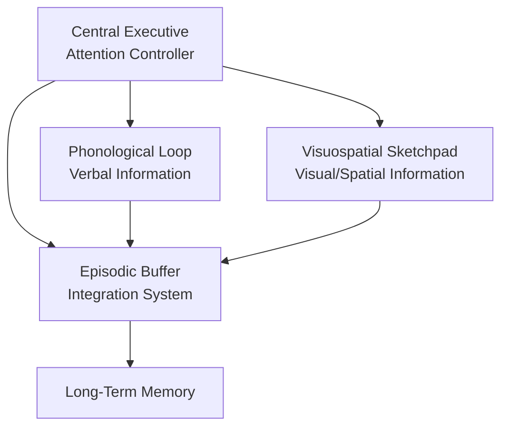
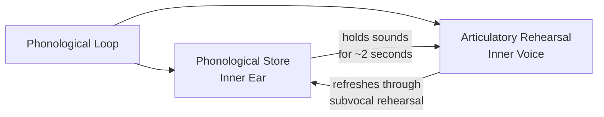

# Baddeley's Working Memory Model

## Overview

Have you ever tried to remember a phone number while simultaneously searching for a pen to write it down? Or followed complex driving directions while also keeping track of road signs? 🧠

These everyday tasks reveal something important: **short-term memory isn't just a passive storage box** – it's an active workspace where multiple cognitive processes operate simultaneously.

In 1974, British psychologists **Alan Baddeley** and **Graham Hitch** proposed the **Working Memory Model** as a replacement for the simple short-term memory store in the Atkinson-Shiffrin model. Their model explains how we can hold and manipulate multiple types of information at once.

> 📖 **Reference**: [MPC-001 Block-1/Unit-2.pdf, Pages 37-42]

## From STM to Working Memory

### Why Working Memory?

The classic Atkinson-Shiffrin model treated short-term memory (STM) as a single, unified store. But research revealed problems:

**Evidence Against Simple STM:**
- People can perform two memory tasks simultaneously if they use different modalities (e.g., verbal + visual)
- Brain damage can impair verbal STM while leaving visual STM intact (or vice versa)
- Simple rehearsal doesn't always lead to learning

Baddeley and Hitch's experiments showed that even when STM was "full" (participants rehearsed digits), they could still reason and comprehend language fairly well. This suggested STM has **separate components** for different types of information.

> 💡 **Key Insight**: Working memory is not just about **storage** – it's about **active manipulation** of information for complex cognitive tasks like reasoning, learning, and comprehension.

## The Four-Component Model



### 1. The Central Executive 🎯

**The "Boss" of Working Memory**

The central executive is the most important but least understood component. It's an **attentional control system** that:

**Functions:**
- **Directs attention** to relevant information
- **Coordinates** the slave systems (phonological loop & visuospatial sketchpad)
- **Switches focus** between tasks
- **Inhibits** irrelevant information
- **Retrieves information** from long-term memory

**Characteristics:**
- Limited capacity
- Modality-free (handles all types of information)
- Cannot store information itself
- Most affected by cognitive load

**Real-world Example:**
When you're studying while your roommate has the TV on, your central executive helps you:
- Focus on your textbook (attention)
- Ignore the TV sounds (inhibition)
- Switch to check your phone briefly and return to studying (task-switching)
- Pull relevant concepts from past classes (LTM retrieval)

> 📖 **Reference**: [MPC-001 Block-1/Unit-2.pdf, Pages 38-39]

### 2. The Phonological Loop 🔊

**The "Inner Voice and Inner Ear"**

The phonological loop is specialized for **verbal and acoustic information**. It has two sub-components:



**Sub-components:**

| Component | Function | Analogy |
|-----------|----------|---------|
| **Phonological Store** | Holds speech-based sounds for ~1-2 seconds | Your "inner ear" |
| **Articulatory Rehearsal Process** | Refreshes information through silent repetition | Your "inner voice" |

**Evidence for the Phonological Loop:**

1. **Phonological Similarity Effect**
   - Harder to remember similar-sounding words (cat, mat, hat) than dissimilar words
   - Shows acoustic coding in the loop

2. **Word Length Effect**
   - Harder to remember long words than short words
   - Because long words take longer to rehearse
   - Memory span = what you can say in ~2 seconds

3. **Articulatory Suppression**
   - Repeating "the, the, the..." disrupts verbal memory
   - Blocks the articulatory rehearsal process

**Practical Implications:**
- Essential for language learning
- Important for reading comprehension
- Supports vocabulary acquisition in children
- Involved in mental arithmetic

> 💡 **Study Tip**: When studying, don't just read silently – engage your phonological loop by reading aloud or subvocalizing key concepts!

> 📖 **Reference**: [MPC-001 Block-1/Unit-2.pdf, Pages 39-40]

### 3. The Visuospatial Sketchpad 👁️

**The "Mind's Eye"**

The visuospatial sketchpad handles **visual and spatial information**:

**Functions:**
- Creating and manipulating mental images
- Navigating your environment
- Understanding spatial relationships
- Processing visual features (color, shape, size)

**Possible Sub-components (Logie, 1995):**

| Component | Function | Example |
|-----------|----------|---------|
| **Visual Cache** | Stores visual features (form, color) | Remembering what your car looks like |
| **Inner Scribe** | Handles spatial/movement information | Mentally rotating an object |

**Evidence for the Visuospatial Sketchpad:**

1. **Visual vs. Verbal Dual-Task Studies**
   - Visual tasks interfere with each other
   - Verbal tasks interfere with each other
   - But visual and verbal tasks can be done together relatively well

2. **Selective Interference**
   - Tracking a moving light disrupts spatial memory
   - But doesn't affect verbal memory

3. **Individual Differences**
   - Some people are "visualizers" (prefer mental imagery)
   - Others are "verbalizers" (prefer inner speech)

**Practical Implications:**
- Important for architects, engineers, surgeons
- Essential for reading maps and wayfinding
- Supports geometry and spatial reasoning
- Used in sports for movement planning

> 💡 **Study Tip**: Create mental images and diagrams to engage your visuospatial sketchpad alongside verbal learning!

> 📖 **Reference**: [MPC-001 Block-1/Unit-2.pdf, Pages 40-41]

### 4. The Episodic Buffer 📦

**The "Integration Hub" (Added in 2000)**

Baddeley added the episodic buffer 25 years after the original model to address some limitations:

**Why Was It Needed?**
- The original model couldn't explain how verbal and visual information are combined
- Couldn't explain chunking (combining separate items into meaningful units)
- Couldn't account for binding of information from different sources

**Functions:**
- **Integrates** information from the phonological loop, visuospatial sketchpad, and LTM
- **Binds** different types of information into coherent episodes
- **Provides temporary storage** for integrated information
- **Enables conscious awareness** of working memory contents

**Characteristics:**
- Limited capacity (~4 chunks)
- Uses a multi-dimensional code
- Controlled by the central executive
- Links working memory to long-term memory

**Example:**
When you imagine "a yellow elephant juggling blue balls":
- Visuospatial sketchpad: Creates the visual image
- Phonological loop: Holds the verbal description
- Episodic buffer: **Binds** these into one coherent scene
- LTM: Provides knowledge about elephants, juggling, colors

> 📖 **Reference**: [MPC-001 Block-1/Unit-2.pdf, Pages 41-42]

## Working Memory in Action

### How the Components Work Together

**Example: Following a Cooking Recipe**

```
Chef: "First, sauté the onions until golden, then add the tomatoes
       and simmer for 10 minutes while stirring occasionally."
```

| Component | Role |
|-----------|------|
| **Phonological Loop** | Holds the verbal instructions temporarily |
| **Visuospatial Sketchpad** | Visualizes the cooking steps, ingredients, pan position |
| **Central Executive** | Coordinates attention between timing, stirring, and next steps |
| **Episodic Buffer** | Integrates verbal instructions with visual images and prior cooking knowledge |

### Capacity Limits and Cognitive Load

Each component has limited capacity. When one system is overloaded, performance suffers:

**Cognitive Overload Examples:**
- Trying to navigate by GPS while having a complex phone conversation (both use phonological loop)
- Parallel parking while visualizing tomorrow's presentation (both use visuospatial sketchpad)
- Managing multiple competing demands at work (central executive exhaustion)

## Evidence Supporting the Model

### Neuroimaging Studies

Brain imaging has identified distinct brain regions for each component:

| Component | Brain Regions |
|-----------|---------------|
| **Central Executive** | Prefrontal cortex (especially dorsolateral) |
| **Phonological Loop** | Left hemisphere language areas (Broca's, Wernicke's) |
| **Visuospatial Sketchpad** | Right hemisphere, occipital and parietal lobes |
| **Episodic Buffer** | Hippocampus (for LTM binding), frontal regions |

### Neuropsychological Cases

- **Patient PV**: Impaired phonological loop but intact visuospatial sketchpad
- **Patient LH**: Impaired visuospatial processing with preserved verbal abilities
- These dissociations support separate systems

### Dual-Task Studies

When two tasks compete for the same component, performance drops significantly. When they use different components, parallel processing is possible.

## Strengths and Limitations

### Strengths ✅

- **Explains multitasking**: How we handle multiple types of information
- **Research support**: Extensive experimental and neuroimaging evidence
- **Clinical utility**: Helps understand learning disabilities, ADHD, and memory disorders
- **Practical applications**: Informs education, interface design, cognitive training

### Limitations ⚠️

- **Central executive vague**: Not well-specified; "homunculus" problem
- **Oversimplification**: Real cognitive processing may be more fluid
- **Individual differences**: Doesn't fully explain why working memory varies between people
- **Capacity debates**: Exact limits still disputed

## Practical Applications

### For Students 📚

**Optimize Your Working Memory:**

1. **Reduce extraneous load**
   - Study in quiet environments
   - Turn off notifications
   - Minimize multitasking

2. **Use multiple modalities**
   - Combine verbal explanations with diagrams
   - Say key concepts aloud while visualizing them

3. **Chunk information**
   - Group related concepts together
   - Create meaningful abbreviations

4. **External memory aids**
   - Take notes to offload information
   - Use concept maps and flowcharts

### For Educators 👨‍🏫

**Design Working-Memory-Friendly Instruction:**

| Strategy | Rationale |
|----------|-----------|
| Present verbal and visual simultaneously | Uses both slave systems efficiently |
| Avoid redundant information | Prevents unnecessary cognitive load |
| Scaffold complex tasks | Reduces central executive demands |
| Provide worked examples | Reduces cognitive load for novices |
| Allow note-taking | Offloads working memory |

### For Clinicians 🏥

**Implications for Assessment and Intervention:**

- **ADHD**: Often shows central executive deficits
- **Dyslexia**: Frequently involves phonological loop problems
- **Developmental coordination disorder**: May involve visuospatial deficits
- **Working memory training**: Targeted interventions for specific components

## Recent Research (2020-2024)

### Working Memory Training

Recent meta-analyses have examined whether working memory training transfers to other cognitive abilities. Findings suggest:
- Training improves performance on trained tasks
- Near transfer to similar tasks is possible
- Far transfer to general intelligence remains controversial

### Working Memory and Technology

Research on "cognitive offloading" examines how smartphones and digital tools affect working memory:
- External devices can extend cognitive capacity
- But may also lead to reduced internal memory use
- Implications for learning and cognitive development

## Study Resources

### Videos

- 🎥 [Working Memory - Simply Psychology](https://www.youtube.com/watch?v=y8VJoCX7A0I) - Clear visual explanation
- 🎥 [Baddeley's Model of Working Memory](https://www.youtube.com/watch?v=9F8JNqZZlMc) - Detailed walkthrough
- 🎥 [How We Make Memories - Crash Course Psychology #13](https://www.youtube.com/watch?v=bSycdIx-C48) - Working memory section at 4:24

### Additional Reading

- 📚 [Wikipedia: Baddeley's Model of Working Memory](https://en.wikipedia.org/wiki/Baddeley%27s_model_of_working_memory) - Comprehensive overview
- 📚 [Simply Psychology: Working Memory Model](https://www.simplypsychology.org/working-memory.html) - Clear explanations with visuals
- 📚 [PsychStory: Working Memory Model](https://www.psychstory.co.uk/memory/the-working-model-of-memory) - In-depth component analysis

### Research Papers

- 📄 Baddeley, A. D., & Hitch, G. (1974). Working memory. In G. H. Bower (Ed.), *The psychology of learning and motivation* (Vol. 8, pp. 47-89). Academic Press.
- 📄 Baddeley, A. (2000). The episodic buffer: A new component of working memory? *Trends in Cognitive Sciences, 4*(11), 417-423.
- 📄 Baddeley, A. (2003). Working memory: Looking back and looking forward. *Nature Reviews Neuroscience, 4*(10), 829-839.

### Memory Aids

**Remember the 4 Components with "CPEV":**
- **C**entral Executive (the boss)
- **P**honological Loop (sounds)
- **E**pisodic Buffer (integration)
- **V**isuospatial Sketchpad (images)

**Phonological Loop Rhyme:**
"The inner ear hears, the inner voice repeats,
Together they make memory complete!"

**Visualize the Model:**
Imagine the central executive as a CEO at a desk, with two secretaries (phonological loop & visuospatial sketchpad) and a filing cabinet (episodic buffer) that connects to a massive archive (LTM).

## Self-Assessment Questions

1. **Explain** why Baddeley and Hitch proposed the working memory model as an alternative to the simple short-term memory concept.

2. **Describe** the functions of each of the four components of working memory. How do they interact?

3. **Predict** what type of errors would result from damage to the phonological loop versus the visuospatial sketchpad.

4. **Analyze** why it's difficult to have a complex phone conversation while driving in an unfamiliar city. Which working memory components are involved?

5. **Evaluate** the evidence supporting the working memory model. What are its main strengths and limitations?

6. **Design** a study strategy that effectively utilizes all components of working memory.

## Summary

✅ **Working memory** replaces the simple STM concept with an active, multi-component system

✅ The **Central Executive** controls attention and coordinates other components

✅ The **Phonological Loop** handles verbal/acoustic information (inner ear + inner voice)

✅ The **Visuospatial Sketchpad** processes visual and spatial information (mind's eye)

✅ The **Episodic Buffer** (added 2000) integrates information and links to LTM

✅ Each component has **limited capacity** – overload causes performance decline

✅ **Neuroimaging** and **neuropsychological** evidence support separate systems

✅ Practical applications in **education, clinical work**, and **everyday life**

✅ The model continues to evolve with new research findings

---
**Source PDFs**: 
- 📄 [MPC-001 Block-1/Unit-2.pdf - Pages 37-45](/pdfs/MPC-001%20Cognitive%20Psychology,%20Learning%20and%20Memory/Block-1/Unit-2.pdf)
