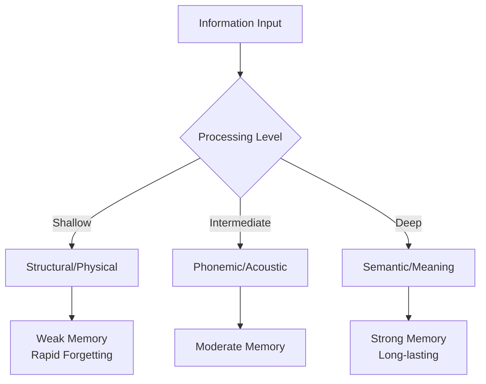

# Levels of Processing Theory

## Overview

Why do you remember some things effortlessly while others slip away almost immediately? Is it just about how many times you repeat something – or is there something more? 🤔

In 1972, cognitive psychologists **Fergus Craik** and **Robert Lockhart** proposed a revolutionary idea: **it's not about where information is stored, but how deeply it's processed that determines memory.**

Their **Levels of Processing (LOP) framework** shifted focus from memory *structures* to memory *processes*, offering powerful insights for anyone wanting to learn more effectively.

> 📖 **Reference**: [MPC-001 Block-1/Unit-2.pdf, Pages 46-50]

## The Central Idea

### Depth Over Storage

While the Atkinson-Shiffrin model emphasized separate memory stores, Craik and Lockhart proposed that:

> 💡 **Key Principle**: Memory is a **byproduct of processing**. The deeper you process information, the more likely you are to remember it.

There aren't necessarily separate "boxes" for short-term and long-term memory. Instead, memory traces vary in their **depth** and **elaboration**:

- **Shallow processing** → Weak, fragile memory traces
- **Deep processing** → Strong, durable memory traces

## The Three Levels

### 1. Structural/Visual Processing (Shallow) 👁️

**Processing based on physical features**

At the shallowest level, you process only the **physical appearance** of stimuli:

**Examples:**
- Is the word in CAPITAL letters or lowercase?
- What color is the text?
- How many letters does the word have?
- Is the font bold or italic?

**Result:** Quick encoding but weak memory trace that decays rapidly.

### 2. Phonemic/Acoustic Processing (Intermediate) 🔊

**Processing based on sound**

At this intermediate level, you process the **sound** of information:

**Examples:**
- Does "CAT" rhyme with "HAT"?
- Does the word start with the sound "B"?
- How many syllables does the word have?

**Result:** Better than structural, but still relatively shallow processing.

### 3. Semantic Processing (Deep) 💭

**Processing based on meaning**

At the deepest level, you process the **meaning and significance** of information:

**Examples:**
- Does "apple" fit in the sentence: "She bit into the juicy ___"?
- Is a "whale" bigger than a "dog"?
- How does this concept relate to what you already know?
- What are real-life examples of this principle?

**Result:** Strong, durable memory trace that persists over time.

> 📖 **Reference**: [MPC-001 Block-1/Unit-2.pdf, Pages 46-48]

## The Classic Experiment: Craik & Tulving (1975)

### Method

Participants were shown 60 words and asked one of three types of questions:

| Processing Level | Question Type | Example Question |
|-----------------|---------------|------------------|
| **Structural** | Physical appearance | "Is the word in capital letters?" |
| **Phonemic** | Sound | "Does the word rhyme with TRAIN?" |
| **Semantic** | Meaning | "Would the word fit in: 'He met a ___ in the street'?" |

After the questions (which participants thought was the main task), they were given a **surprise memory test** – they had to identify which words they had seen from a larger list.

### Key Results

| Processing Level | Recognition Rate |
|-----------------|------------------|
| Structural (shallow) | ~15% |
| Phonemic (intermediate) | ~35% |
| Semantic (deep) | ~70% |

**Conclusion:** Words processed semantically were remembered approximately **4 times better** than words processed structurally!

> 💡 **Critical Finding**: Participants weren't told to memorize anything – better memory was a **natural byproduct** of deeper processing.

> 📖 **Reference**: [MPC-001 Block-1/Unit-2.pdf, Pages 48-49]

## Why Does Deep Processing Work?

### 1. Elaboration

Deep processing involves **elaboration** – connecting new information to existing knowledge:

**Example:** 
Learning that "the hippocampus is important for memory" is stronger if you connect it to:
- Its seahorse-like shape (hippos = horse, kampos = sea monster)
- Patient H.M. who couldn't form new memories after hippocampus removal
- Your own experience of trying to remember

### 2. Distinctiveness

Deeply processed information becomes more **distinctive** – it stands out from other memories:

**Example:**
- Shallow: "CHAIR" – just letters on a page
- Deep: Imagining YOUR favorite chair, its comfort, where it sits in your room

### 3. Self-Reference Effect

Processing information in relation to yourself creates especially strong memories:

**Example:**
"Does the word 'honest' describe you?" → Better memory than "Does 'honest' describe Mother Teresa?"

## Elaborative vs. Maintenance Rehearsal

The LOP framework distinguishes between two types of rehearsal:

| Rehearsal Type | Description | Example | Memory Outcome |
|----------------|-------------|---------|----------------|
| **Maintenance** | Simple repetition | Repeating "555-1234" until dialing | Keeps info in STM; minimal LTM transfer |
| **Elaborative** | Meaningful processing | "555-1234 = all 5s, then 1-2-3-4 counting" | Strong LTM encoding |

> 💡 **Study Implication**: Simply rereading your notes is maintenance rehearsal. Asking "why?" and "how does this connect?" is elaborative rehearsal.

## Strengths of the LOP Framework

### ✅ Practical Utility
Directly applicable to improving study strategies

### ✅ Research Support
Robust findings replicated across many studies

### ✅ Emphasis on Process
Shifts focus from passive storage to active processing

### ✅ Self-Reference Effect
Explains why personal relevance enhances memory

### ✅ Ecological Validity
Applies to real-world learning situations

## Limitations and Criticisms

### ⚠️ Circular Definition
**Problem:** How do we know processing was "deep"? Because it led to better memory. How do we know it will lead to better memory? Because processing was deep.

**Response:** Independent measures of processing depth can be used (e.g., brain activity, processing time).

### ⚠️ Overemphasis on Encoding
**Problem:** Focuses mainly on encoding; retrieval conditions also matter greatly.

**Response:** This led to the **Encoding Specificity Principle** – memory is best when retrieval context matches encoding context.

### ⚠️ Transfer-Appropriate Processing
**Problem:** "Deep" processing isn't always best. Sometimes shallow processing is more effective.

**Example:** If tested on physical features of words, structural processing may be better than semantic processing!

**Key Principle:** The best processing matches the **type of test** you'll face.

### ⚠️ Processing Time Confound
**Problem:** Deep processing takes longer – is it depth or time that matters?

**Response:** Studies show that even when time is controlled, depth matters. But the relationship is complex.

> 📖 **Reference**: [MPC-001 Block-1/Unit-2.pdf, Pages 49-50]

## Modern Developments

### 1. Encoding Specificity Principle (Tulving)

Memory is best when the context at **retrieval** matches the context at **encoding**:

- Study with music → Test with same music = better performance
- Learn in a specific room → Recall better in that room

### 2. Transfer-Appropriate Processing (Morris et al., 1977)

The most effective processing depends on how you'll be tested:

| If You'll Be Tested On... | Best Encoding Strategy |
|--------------------------|----------------------|
| Meaning/concepts | Semantic processing |
| Sound patterns | Phonemic processing |
| Visual recognition | Structural processing |

### 3. Generation Effect

Information you **generate yourself** is remembered better than information you simply receive.

**Example:** 
- Reading: "OPPOSITES: hot – cold" → Moderate memory
- Generating: "OPPOSITES: hot – ?" (you fill in: cold) → Better memory

## Practical Applications

### For Students 📚

**Apply LOP to Your Studies:**

| Instead of... | Try... | Processing Level |
|---------------|--------|-----------------|
| Rereading notes | Explaining concepts aloud | Semantic |
| Highlighting text | Writing questions in margins | Elaborative |
| Copying definitions | Creating your own examples | Self-reference |
| Passive listening | Connecting to prior knowledge | Semantic |
| Memorizing facts | Asking "why?" and "so what?" | Deep |

**The SQ3R Method (Applies LOP):**
1. **Survey** – Get overview (structural)
2. **Question** – Create questions (semantic preparation)
3. **Read** – Read actively for answers (semantic)
4. **Recite** – Explain in own words (elaborative)
5. **Review** – Connect to other knowledge (deep integration)

### For Educators 👨‍🏫

| Shallow Activities (Avoid) | Deep Activities (Encourage) |
|---------------------------|---------------------------|
| Copy notes from board | Generate own summaries |
| Define vocabulary | Use words in original sentences |
| List facts | Explain cause-effect relationships |
| Memorize formulas | Apply formulas to real problems |
| Read passively | Teach concepts to peers |

### For Everyday Life 🌍

**Remembering Names:**
- Shallow: Looking at the name tag
- Intermediate: Rhyming (Gary = scary)
- Deep: "Gary reminds me of my uncle Gary who also loves fishing"

**Remembering to Take Medication:**
- Shallow: Just looking at the pill bottle
- Deep: Connecting it to a meaningful routine ("With my morning coffee, I take my health pill")

## Study Resources

### Videos

- 🎥 [Levels of Processing - Simply Psychology](https://www.youtube.com/watch?v=Ln1kYEQaHw0) - Clear explanation with examples
- 🎥 [How We Make Memories - Crash Course Psychology #13](https://www.youtube.com/watch?v=bSycdIx-C48) - Section on shallow vs. deep processing at 7:28
- 🎥 [Study Skills: Memory (Crash Course)](https://www.youtube.com/watch?v=SZbdK9e9bxs) - Practical applications

### Additional Reading

- 📚 [Wikipedia: Levels of Processing Model](https://en.wikipedia.org/wiki/Levels_of_processing_model) - Comprehensive overview
- 📚 [Simply Psychology: Levels of Processing](https://www.simplypsychology.org/levelsofprocessing.html) - Clear explanation with research details
- 📚 [Explorable: Levels of Processing Effect](https://explorable.com/levels-of-processing) - Student-friendly summary

### Research Papers

- 📄 Craik, F. I. M., & Lockhart, R. S. (1972). Levels of processing: A framework for memory research. *Journal of Verbal Learning and Verbal Behavior, 11*, 671-684.
- 📄 Craik, F. I. M., & Tulving, E. (1975). Depth of processing and the retention of words in episodic memory. *Journal of Experimental Psychology: General, 104*, 268-294.

### Memory Aids

**Remember the Three Levels with "SSS":**
- **S**tructural (What does it look like?)
- **S**ound (What does it sound like?)
- **S**emantic (What does it mean?)

**Processing Depth Rhyme:**
"If it's just on the page, it won't engage,
But meaning makes memories last through the age!"

**Study Strategy Mnemonic - "DEEP":**
- **D**efine in your own words
- **E**xplain to someone else
- **E**xemplify with personal examples
- **P**ractice retrieval

## Self-Assessment Questions

1. **Explain** the main claim of the Levels of Processing framework. How does it differ from the Atkinson-Shiffrin model?

2. **Describe** the three levels of processing with examples for each. Which leads to the best memory and why?

3. **Analyze** the Craik and Tulving (1975) experiment. What were the key findings, and why was the memory test a "surprise"?

4. **Distinguish** between maintenance rehearsal and elaborative rehearsal. Give examples of each in a study context.

5. **Evaluate** the LOP framework. What are its strengths and limitations?

6. **Apply** the LOP framework to design a study strategy for learning psychology terminology.

7. **Predict** what would happen if a student only highlighted their textbook without any other processing. Explain using LOP principles.

## Summary

✅ **Levels of Processing (LOP)** theory proposes that memory depends on **how deeply** information is processed, not just where it's stored

✅ **Three levels**: Structural (shallow), Phonemic (intermediate), Semantic (deep)

✅ **Craik & Tulving (1975)** showed semantic processing leads to ~4x better memory than structural processing

✅ Deep processing works through **elaboration** and **distinctiveness**

✅ **Maintenance rehearsal** (repetition) is less effective than **elaborative rehearsal** (meaningful processing)

✅ **Limitations**: Circularity problem, ignores retrieval, transfer-appropriate processing

✅ **Practical applications**: Study actively, create connections, use self-reference, generate your own examples

✅ The key message: **Don't just repeat – relate, elaborate, and create meaning!**

---
**Source PDFs**: 
- 📄 [MPC-001 Block-1/Unit-2.pdf - Pages 46-52](/pdfs/MPC-001%20Cognitive%20Psychology,%20Learning%20and%20Memory/Block-1/Unit-2.pdf)
