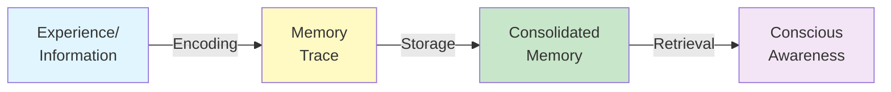
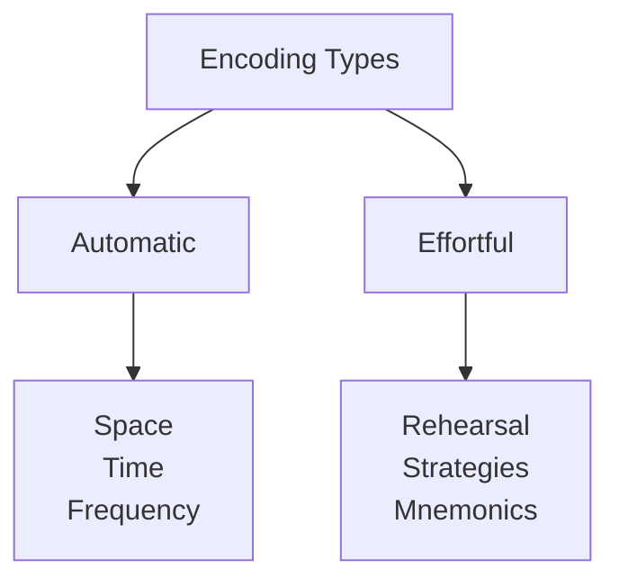
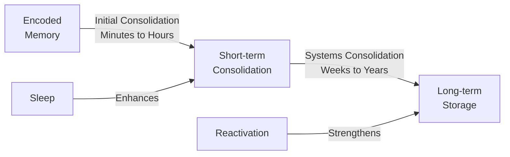
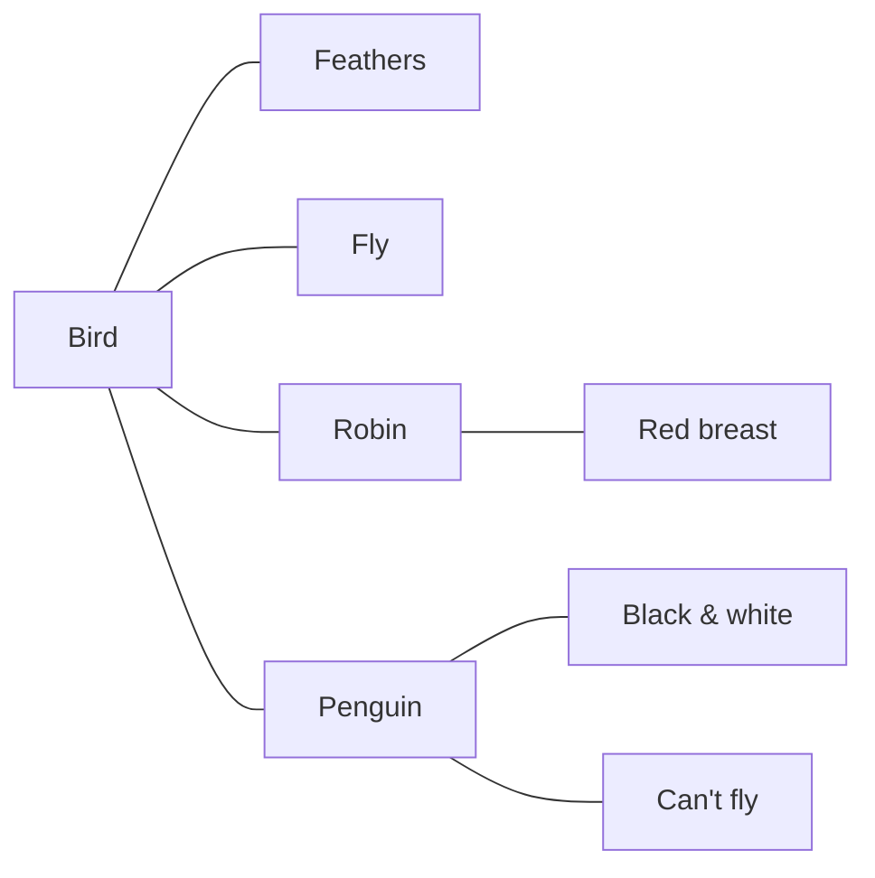
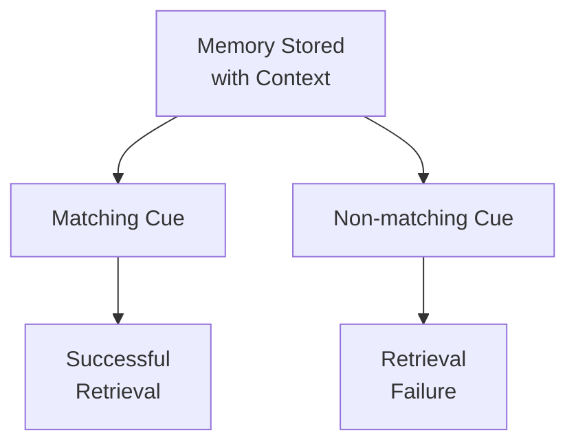

# Encoding, Storage, and Retrieval Processes

## Overview

Think of your favorite memory – maybe a birthday party, your first day of school, or a special moment with a loved one. How did that experience become a lasting memory you can access years later? 🎂

The journey from experience to memory involves three essential processes: **encoding** (getting information in), **storage** (keeping it over time), and **retrieval** (getting it back out). Understanding these processes reveals both the remarkable capabilities and surprising limitations of human memory.

> 📖 **Reference**: [MPC-001 Block-1/Unit-2.pdf, Pages 53-60]

## The Memory Process Flow



Each process can fail, leading to different types of "memory failures":

| Process | Failure Results In |
|---------|-------------------|
| **Encoding** | Never learned in the first place |
| **Storage** | Information decays or interfered with |
| **Retrieval** | "Tip of the tongue" – it's there but can't access it |

## Encoding: Getting Information In

### What is Encoding?

**Encoding** is the process of transforming sensory information into a form that can be stored in memory. Think of it like converting a document into a saveable file format.

### Types of Encoding



#### 1. Automatic Processing

Information encoded **without conscious effort or awareness**:

- **Spatial information**: Where you parked your car
- **Temporal information**: What you had for breakfast today
- **Frequency**: How often you've seen someone
- **Routine activities**: Walking, driving familiar routes

> 💡 **Example**: You automatically encode that you sat next to someone with red hair in class – no conscious effort required.

#### 2. Effortful Processing

Information that requires **conscious attention and deliberate effort**:

- Studying for an exam
- Learning a new language
- Memorizing a phone number
- Mastering a musical piece

> 💡 **Note**: With enough practice, effortful processes can become automatic (like reading for skilled readers).

### Encoding Modalities

How is information coded in memory?

| Modality | Description | Example | Memory Store |
|----------|-------------|---------|--------------|
| **Visual** | Appearance, images | What a face looks like | Strong in sensory memory |
| **Acoustic** | Sound, phonological | How a name sounds | Dominant in STM |
| **Semantic** | Meaning, concepts | What a word means | Dominant in LTM |

**The Shift from Acoustic to Semantic:**
- Short-term memory relies heavily on **acoustic** encoding (confusion between similar-sounding words)
- Long-term memory relies heavily on **semantic** encoding (confusion between similar-meaning words)

### Factors Affecting Encoding

#### 1. Attention
The gateway to encoding – what you don't attend to, you don't encode.

**Selective Attention Experiment (Cherry, 1953):**
Participants wearing headphones heard different messages in each ear. They could only report what was in the attended ear.

#### 2. Spacing Effect
**Distributed practice** (spaced over time) produces better encoding than **massed practice** (cramming).

| Practice Type | Example | Retention |
|---------------|---------|-----------|
| **Massed** | 4 hours of study in one sitting | Poor |
| **Distributed** | 1 hour across 4 different days | Excellent |

#### 3. Generation Effect
Generating information yourself leads to better encoding than passively receiving it.

**Example:** 
- Passive: Reading "The answer is PARIS"
- Active: Completing "The capital of France is P___S"

#### 4. Self-Reference Effect
Relating information to yourself enhances encoding.

**Example:**
"Does the word 'creative' describe YOU?" → Better memory than "Does 'creative' describe someone else?"

> 📖 **Reference**: [MPC-001 Block-1/Unit-2.pdf, Pages 53-56]

## Storage: Keeping Information Over Time

### What is Storage?

**Storage** is the maintenance of encoded information over time. Unlike computer storage, human memory storage is dynamic and reconstructive.

### Memory Consolidation

After encoding, memories undergo **consolidation** – a process that stabilizes and strengthens memory traces:



**Role of Sleep in Consolidation:**
- Memory traces are reactivated during sleep
- REM sleep may be especially important for procedural memories
- Deep sleep (slow-wave) important for declarative memories
- Sleep deprivation impairs memory consolidation

### Memory Organization

Long-term memories are organized for efficient retrieval:

#### 1. Semantic Networks

Concepts are stored as nodes connected by associations:



#### 2. Schemas

Organized knowledge structures that help us understand and predict:

- **Restaurant schema**: Menu, ordering, eating, paying
- **Birthday party schema**: Cake, presents, singing

> 💡 **Implication**: New information is easier to store if it fits existing schemas.

#### 3. Hierarchical Organization

Information organized from general to specific:

```
Animals
├── Mammals
│   ├── Dogs
│   │   ├── Labrador
│   │   └── Poodle
│   └── Cats
└── Birds
    ├── Robins
    └── Eagles
```

### Forgetting from Storage

#### 1. Decay Theory

Memory traces fade over time without use (like footprints in sand).

**Ebbinghaus Forgetting Curve (1885):**
- Rapid forgetting in first hours
- Then gradual leveling off
- After 3 days, you retain about what you'll retain for years

#### 2. Interference Theory

Other memories interfere with storage:

| Type | Description | Example |
|------|-------------|---------|
| **Proactive** | OLD memories interfere with NEW | Old phone number interferes with new one |
| **Retroactive** | NEW memories interfere with OLD | New address makes you forget old one |

> 📖 **Reference**: [MPC-001 Block-1/Unit-2.pdf, Pages 56-58]

## Retrieval: Getting Information Out

### What is Retrieval?

**Retrieval** is accessing stored information and bringing it to conscious awareness. It's like searching for and opening a file on your computer – except human memory is much more complex.

### Types of Retrieval

#### 1. Recall

**Generating** information from memory without cues.

- **Free Recall**: "Name all the U.S. states you can remember"
- **Serial Recall**: "Recite the alphabet in order"
- **Cued Recall**: "The capital of France is ___"

**Recall requires more effort** – you must generate the memory.

#### 2. Recognition

**Identifying** previously encountered information from options.

- Multiple-choice tests
- "Have you seen this person before?"
- "Is this the song that was playing?"

**Recognition is generally easier** – you just need to match to memory.

#### 3. Relearning

**Savings** in time/effort when learning something again.

**Example:** Whitney studied Spanish in high school but forgot much of it. When relearning as an adult, she learns faster than complete beginners – demonstrating **savings**.

**Relearning reveals memory** that can't be accessed through recall or recognition.

### Retrieval Cues

**Retrieval cues** are stimuli that help trigger memory access:



**Types of Retrieval Cues:**

| Cue Type | Example |
|----------|---------|
| **Semantic** | Word meaning triggers related concepts |
| **Phonemic** | Sound triggers similar-sounding words |
| **Visual** | Image triggers associated memories |
| **Contextual** | Location triggers memories formed there |
| **Emotional** | Mood triggers mood-congruent memories |

### Encoding Specificity Principle

**Tulving's Principle**: Memory is best when retrieval conditions **match** encoding conditions.

#### Context-Dependent Memory

Physical environment affects retrieval:

**Godden & Baddeley (1975) Study:**
- Divers learned words underwater or on land
- Tested underwater or on land
- **Best recall**: Same context for learning and testing

#### State-Dependent Memory

Internal state affects retrieval:

- Information learned while caffeinated → Better recalled while caffeinated
- Information learned while sad → Better recalled when sad again

#### Mood-Congruent Memory

Current mood affects what we retrieve:

- Happy mood → Easier to recall happy memories
- Sad mood → Easier to recall sad memories

> 📖 **Reference**: [MPC-001 Block-1/Unit-2.pdf, Pages 58-60]

### Serial Position Effect

When recalling a list, position matters:

```
Items:  1   2   3   4   5   6   7   8   9   10
Recall: High Low Low Low Low Low Low Low Medium High
        ↑                                        ↑
    Primacy                                   Recency
     Effect                                   Effect
```

| Effect | Explanation | Memory System |
|--------|-------------|---------------|
| **Primacy** | First items rehearsed more, transferred to LTM | Long-term memory |
| **Recency** | Last items still in STM | Short-term memory |

## The Tip-of-the-Tongue Phenomenon

A retrieval failure where you **know** you know something but can't access it:

**Characteristics:**
- Partial information available (first letter, number of syllables)
- Strong feeling of knowing (FOK)
- Often resolved suddenly or with a cue

**What it reveals:**
- Memories aren't "all or nothing"
- Retrieval is a process that can partially succeed
- The information is stored but temporarily inaccessible

## Practical Applications

### Improving Encoding 📥

1. **Pay Attention**: Eliminate distractions during study
2. **Process Deeply**: Ask "why" and "how" questions
3. **Generate**: Create your own examples and explanations
4. **Self-Reference**: Connect material to your own life
5. **Space Your Practice**: Distribute learning over time

### Strengthening Storage 💾

1. **Sleep Well**: Consolidation happens during sleep
2. **Review Regularly**: Prevent decay with periodic retrieval
3. **Organize**: Create schemas and hierarchies
4. **Minimize Interference**: Space out similar material
5. **Overlearn**: Continue practicing beyond initial mastery

### Optimizing Retrieval 📤

1. **Practice Retrieval**: Test yourself, don't just review
2. **Use Multiple Cues**: Create diverse retrieval pathways
3. **Recreate Context**: Study in similar conditions to testing
4. **Prime Your Memory**: Activate related concepts before retrieval
5. **Wait Before Checking**: Give retrieval attempt time to work

## Study Resources

### Videos

- 🎥 [How We Make Memories - Crash Course Psychology #13](https://www.youtube.com/watch?v=bSycdIx-C48) - Encoding and storage explained
- 🎥 [Remembering and Forgetting - Crash Course Psychology #14](https://www.youtube.com/watch?v=HVWbrNls-Kw) - Retrieval and forgetting
- 🎥 [Memory Study Skills - Crash Course](https://www.youtube.com/watch?v=SZbdK9e9bxs) - Practical applications

### Additional Reading

- 📚 [Wikipedia: Encoding (Memory)](https://en.wikipedia.org/wiki/Encoding_(memory)) - Detailed overview
- 📚 [Simply Psychology: Memory](https://www.simplypsychology.org/memory.html) - All three processes explained
- 📚 [LibreTexts: Memory Encoding and Storage](https://socialsci.libretexts.org/Bookshelves/Early_Childhood_Education/Child_Growth_and_Development_(Paris_Ricardo_Rymond_and_Johnson)/14:_Adolescence_-_Cognitive_Development/14.04:_Information_Processing_Theory-_Memory_Encoding_and_Storage) - Academic but accessible

### Research Papers

- 📄 Tulving, E. (1983). *Elements of Episodic Memory*. Oxford University Press.
- 📄 Godden, D. R., & Baddeley, A. D. (1975). Context-dependent memory in two natural environments. *British Journal of Psychology, 66*, 325-331.

### Memory Aids

**Remember the Three Processes with "ESR":**
- **E**ncoding (Getting it IN)
- **S**torage (Keeping it SAFE)
- **R**etrieval (Getting it OUT)

**Encoding Mnemonic - "SAGE":**
- **S**pacing (distribute practice)
- **A**ttention (focus on material)
- **G**eneration (create your own content)
- **E**laboration (connect to existing knowledge)

**Retrieval Rhyme:**
"Recall is hard, recognition's easier,
Relearning shows what's left to seize here!"

## Self-Assessment Questions

1. **Define** encoding, storage, and retrieval. How are these processes interdependent?

2. **Compare and contrast** automatic and effortful processing. Give examples of each.

3. **Explain** the encoding specificity principle. How does it apply to studying for exams?

4. **Distinguish** between proactive and retroactive interference with examples.

5. **Analyze** the serial position effect. What does it reveal about different memory systems?

6. **Apply** your knowledge of these processes to explain the "tip-of-the-tongue" phenomenon.

7. **Design** a study strategy that optimizes encoding, storage, and retrieval.

## Summary

✅ **Encoding** transforms sensory input into storable memory traces

✅ Two types: **Automatic** (unconscious) and **Effortful** (deliberate)

✅ **Encoding factors**: Attention, spacing, generation, self-reference, depth

✅ **Storage** maintains information over time through consolidation

✅ Organization (schemas, hierarchies, networks) aids storage

✅ **Forgetting** can result from decay or interference

✅ **Retrieval** accesses stored information via recall, recognition, or relearning

✅ **Retrieval cues** and **context matching** enhance retrieval success

✅ **Encoding specificity**: Matching encoding and retrieval conditions improves memory

✅ Practical applications: Space practice, process deeply, test yourself, use multiple cues

---
**Source PDFs**: 
- 📄 [MPC-001 Block-1/Unit-2.pdf - Pages 53-62](/pdfs/MPC-001%20Cognitive%20Psychology,%20Learning%20and%20Memory/Block-1/Unit-2.pdf)
