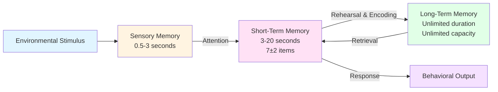

# Learning and Memory Systems

> "The mechanisms of learning and memory are at the essence of how the brain works." — Brown

## Introduction

Memory is fundamental to human existence. Without it, you couldn't understand these words, recognize familiar faces, or even maintain a sense of self. Every skill you've mastered, every fact you've learned, every experience you treasure - all depend on your brain's remarkable capacity to learn and remember.

But here's what makes memory fascinating: it's not a single system, but rather multiple specialized systems working together. Think of it like a factory with different departments - each handling specific types of information in unique ways.

## What is Learning?

Learning is the process of acquiring new knowledge, behaviors, skills, values, or understanding. Benjamin Bloom (1965) identified three essential domains of learning:

### The Three Domains of Learning

**1. Cognitive Domain** 🧠
- Involves mental skills like thinking, reasoning, and problem-solving
- Examples: calculating equations, analyzing literature, memorizing facts
- Focus: Knowledge acquisition and intellectual development

**2. Psychomotor Domain** 🏃
- Involves physical skills and coordination
- Examples: riding a bike, playing piano, performing surgery
- Focus: Physical movement and manipulation

**3. Affective Domain** ❤️
- Involves emotions, attitudes, and values
- Examples: appreciating art, developing empathy, forming preferences
- Focus: Feelings and emotional responses

### Learning is Integrated

These domains don't work in isolation. Consider learning to play chess:
- **Cognitive**: You learn the rules, strategies, and patterns
- **Psychomotor**: You learn to physically move the pieces correctly
- **Affective**: You develop appreciation for the game and its history

This integration makes learning a rich, multifaceted experience that engages your whole being.

## The Three Memory Systems

Your memory operates through three distinct storage systems, each with its own characteristics, capacity, and duration. Understanding these systems is crucial for effective learning.

### 1. Sensory Memory: The Gateway

**What It Does:**
Sensory memory is your brain's initial processing system - it captures raw sensory information from your environment for a split second.

**Key Characteristics:**
- **Duration**: Less than 0.5 seconds for vision; about 3 seconds for hearing
- **Capacity**: Enormous - captures everything your senses detect
- **Function**: Acts as a buffer while your brain decides what deserves attention

**How It Works:**
Think about looking at a sparkler on the Fourth of July. Even after you close your eyes, you briefly "see" the light trail. That's sensory memory - specifically, iconic memory (visual). When someone says something and you ask "What?" but then realize you heard them, that's echoic memory (auditory).

**The Critical Role of Attention:**
Only information you pay attention to moves from sensory to short-term memory. This is why two people can experience the same event but remember it differently - they attended to different details.

**💡 Practical Application:**
When studying, eliminate distractions. Your sensory memory is constantly bombarded with information, but only what you consciously attend to will move forward in the memory process.

### 2. Short-Term Memory (STM): The Mental Workspace

**What It Does:**
Short-term memory (also called working memory) is your brain's "scratch pad" - it temporarily holds information you're actively thinking about or using right now.

**Key Characteristics:**
- **Duration**: 3-20 seconds without rehearsal
- **Capacity**: Limited to about 5-9 items (Miller's Magic Number: 7±2)
- **Vulnerability**: Easily disrupted by distractions or interference
- **Primary loss mechanism**: Decay (information simply fades away)

#### Miller's Magic Number: 7±2

In his groundbreaking 1956 paper, psychologist George Miller discovered that humans can typically hold between 5 and 9 items in short-term memory at one time - averaging about 7 items.

**Important Clarification:**
Miller later emphasized that 7±2 applies to "chunks" of information, not individual bits. A chunk is any meaningful unit of information. For example:
- Individual letters: Y-O-U-R-B-R-A-I-N (9 items - difficult to remember)
- Chunked into words: YOUR BRAIN (2 chunks - easy to remember)

**Modern Research Updates:**
Contemporary research suggests the actual number may be closer to 4±1 chunks, especially for complex information. However, Miller's work fundamentally changed how we understand memory capacity.

#### The Three Operations of STM

**1. Iconic Memory** 👁️
- Holds visual images
- Very brief (milliseconds)
- Example: Reading text - you hold the visual shape of words momentarily

**2. Acoustic Memory** 👂
- Holds sounds and spoken information
- Slightly longer than iconic memory
- Example: Phone numbers are often remembered acoustically (you "hear" them in your mind)

**3. Working Memory** 🔄
- The active processing component
- Manipulates and organizes information
- Essential for reasoning and decision-making

**💡 The Phone Number Test:**
Try this: Have someone tell you a phone number. You'll likely repeat it mentally until you can write it down or dial it. That's working memory in action - you're actively maintaining information for immediate use, not trying to remember it forever.

#### Overcoming STM Limitations: Chunking

Since STM is limited, how can we work with larger amounts of information? The answer is **chunking** - grouping individual items into larger, meaningful units.

**Examples of Chunking in Action:**

1. **Phone Numbers:**
   - Without chunking: 5551234567 (10 items)
   - With chunking: 555-123-4567 (3 chunks)

2. **Social Security Numbers:**
   - Without chunking: 123456789 (9 items)
   - With chunking: 123-45-6789 (3 chunks)

3. **Language Learning:**
   - Beginners: Process individual sounds
   - Intermediate: Chunk sounds into words
   - Advanced: Chunk words into phrases and sentences

**Why Chunking Works:**
Chunking reduces the number of items STM needs to track by creating hierarchical structures. Each chunk can contain multiple pieces of information, dramatically expanding effective capacity.

> 📖 **Reference**: [Block-1/Unit-2.pdf, Pages 20-22]

### 3. Long-Term Memory (LTM): The Permanent Archive

**What It Does:**
Long-term memory is your brain's vast storage system for knowledge, experiences, and skills that persist over time.

**Key Characteristics:**
- **Duration**: Can last a lifetime
- **Capacity**: Theoretically unlimited
- **Organization**: Stored based on meaning and importance, not chronologically
- **Encoding**: Requires consolidation - transferring information from STM

#### How Information Reaches LTM

The journey from short-term to long-term memory isn't automatic. It requires **encoding** or **consolidation** - organizing and integrating new information with existing knowledge.

**Key Factors for Successful Encoding:**

1. **Meaningfulness**
   - Information connected to existing knowledge is more likely to be retained
   - Emotional content enhances encoding

2. **Rehearsal**
   - Not just repetition, but *elaborative rehearsal*
   - Making connections, finding patterns, creating associations

3. **Organization**
   - Structured information is easier to encode
   - Chunking helps here too!

#### Schemas: The Building Blocks of LTM

Your long-term memory is organized into **schemas** - mental frameworks that represent knowledge about the world.

**What Schemas Do:**
- Organize related information together
- Help you interpret new experiences
- Guide attention to relevant information
- Allow quick pattern recognition

**Example of Schemas in Action:**
You have a "restaurant schema" that includes: entering, being seated, ordering, eating, paying. When you visit a new restaurant, this schema helps you know what to do without explicit instructions.

**Schemas and Learning:**
- **Existing schemas** help you learn related information faster
- **New information** can modify existing schemas
- **Conflicting information** may require creating new schemas or updating old ones

#### The Power of LTM

Long-term memory influences everything you do:

**Top-Down Processing:**
Your stored knowledge shapes how you perceive and interpret new information. This is why:
- Experts see patterns novices miss
- Your expectations influence what you notice
- Past experiences color present perceptions

**Transfer of Learning:**
Information in LTM can be applied to new situations. The better organized your LTM, the more easily you can transfer knowledge across contexts.

**💡 Study Strategy:**
To move information into LTM effectively:
1. Make it meaningful (connect to existing knowledge)
2. Organize it (create structure and patterns)
3. Rehearse it elaborately (don't just repeat - think deeply)
4. Space it out (distributed practice beats cramming)
5. Test yourself (retrieval practice strengthens memory)

> 📖 **Reference**: [Block-1/Unit-2.pdf, Pages 21-24]

## The Memory Formation Process

## Research & Recent Findings

### The Evolution of Memory Models

Recent research has refined our understanding of memory systems:

- **Working Memory Models**: Contemporary theories propose multiple components within working memory, including a central executive, phonological loop, and visuospatial sketchpad (Baddeley's model)

- **Consolidation Research**: Modern neuroscience shows that memory consolidation continues during sleep, with different sleep stages supporting different types of memory

- **Capacity Debates**: While Miller's 7±2 remains influential, research by Nelson Cowan (2001) suggests working memory capacity may be closer to 4 chunks for complex information

### Clinical Implications

Understanding memory systems helps explain:
- **Amnesia**: Damage to specific brain regions affects particular memory systems
- **Learning Disabilities**: May involve deficits in specific memory processes
- **Age-Related Changes**: Different memory systems age at different rates
- **Therapeutic Interventions**: Memory training can improve specific aspects of memory function

## Study Resources

### Educational Videos
- [MIT OpenCourseWare: Memory I](https://ocw.mit.edu/courses/9-00sc-introduction-to-psychology-fall-2011/resources/lecture-10-memory-i/) - Prof. John Gabrieli's comprehensive lecture on memory systems
- [Crash Course Psychology #13: How We Make Memories](https://www.youtube.com/watch?v=bSycdIx-C48) - Accessible overview of memory formation and types

### Additional Reading
- [Wikipedia: The Magical Number Seven, Plus or Minus Two](https://en.wikipedia.org/wiki/The_Magical_Number_Seven,_Plus_or_Minus_Two) - Deep dive into Miller's influential research
- [Information Processing Theory - Simply Psychology](https://www.simplypsychology.org/information-processing.html) - Clear explanations with examples
- [Short-Term Memory in Psychology](https://www.simplypsychology.org/short-term-memory.html) - Updated research on STM and working memory

### Memory Aids

**Mnemonic for Memory Systems:**
**SEL** - Sensory, Episodic, Long-term (though technically S-S-L for Sensory-Short-Long!)

**Remember the Durations:**
- Sensory: Less than 1 second (blink and it's gone!)
- Short-term: Seconds to 20 seconds (time to say a sentence)
- Long-term: Minutes to lifetime (your life story)

**Miller's Number Reminder:**
Hold up both hands (10 fingers) then fold down 3 (leaving 7) - that's the average STM capacity!

## Self-Assessment

Test your understanding:

1. **Scenario Analysis**: You're reading this text. Identify which memory system is active when:
   - Your eyes scan across the words
   - You think about what a sentence means
   - You remember a related concept from a previous unit

2. **Application Question**: How would you use chunking to memorize this sequence: FBICIAIBMNYC?

3. **Critical Thinking**: Why might emotional events be remembered more vividly than neutral ones? Which aspects of the memory system contribute to this?

4. **Real-World Connection**: Think of something you learned recently. Can you trace its path through the three memory systems?

## Summary

**Key Takeaways:**

✅ **Learning** involves three domains: cognitive (thinking), psychomotor (physical), and affective (emotional)

✅ **Sensory Memory** briefly captures all sensory information; attention determines what moves forward

✅ **Short-Term Memory** has limited capacity (7±2 chunks) and duration (seconds), but can be enhanced through chunking

✅ **Long-Term Memory** has unlimited capacity and duration; information is organized into schemas based on meaning

✅ **Encoding** is the critical process of transferring information from STM to LTM through meaningful organization and rehearsal

✅ **Schemas** are mental frameworks that organize knowledge and guide perception and learning

✅ **Working Memory** is the active processing component that manipulates information across memory systems

✅ **Chunking** is a powerful strategy to overcome STM limitations by grouping information into meaningful units

---

**Source PDFs**: 
- 📄 [Block-1/Unit-2.pdf - Pages 19-24](/pdfs/MPC-001%20Cognitive%20Psychology,%20Learning%20and%20Memory/Block-1/Unit-2.pdf)
- 📚 MPC-001 Cognitive Psychology, Learning and Memory

**Next Topic**: [Information Processing Theory and Models](/docs/mpc-001/block-1/information-processing-theory)
