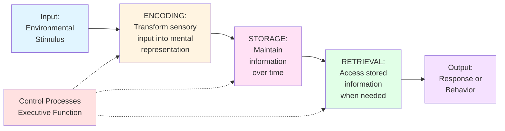

# Information Processing Theory and Models

## Overview

Imagine your brain as a sophisticated information processing system - constantly taking in data from the environment, organizing it, storing it, and retrieving it when needed. This is the essence of **Information Processing Theory (IPT)**, one of the most influential frameworks in cognitive psychology.

Developed in the 1940s and 1950s during the "cognitive revolution," information processing theory emerged alongside the development of computers. The computer provided a powerful metaphor for understanding human cognition: just as computers process data through input, processing, storage, and output, so too does the human mind handle information.

## The Computer Metaphor 🖥️

### How It Works

The comparison between human cognition and computer systems is more than just an analogy - it's a functional framework:

| Computer System | Human Cognitive System |
|----------------|------------------------|
| Input devices (keyboard, mouse) | Sensory organs (eyes, ears, etc.) |
| Processing unit (CPU) | Working memory & executive functions |
| RAM (temporary storage) | Short-term/working memory |
| Hard drive (permanent storage) | Long-term memory |
| Programs & algorithms | Mental processes & strategies |
| Output (screen, printer) | Behavior & responses |

### The Value of This Metaphor

While no analogy is perfect, the computer metaphor helps us understand:
- **Sequential processing**: Information flows through stages
- **Capacity limitations**: Systems have finite resources
- **Storage organization**: Information must be structured for efficient retrieval
- **Active processing**: Systems don't passively receive - they actively manipulate information

### Beyond the Metaphor

However, human cognition is far more complex than any computer:
- We process information in **parallel** (many things at once) as well as sequentially
- Our processing is influenced by **emotions** and **motivations**
- We can be **creative** and generate novel solutions
- Our system is **plastic** - it physically changes through experience

> 💡 **Remember**: The computer metaphor is a tool for understanding, not a literal description of how the brain works.

## Core Principles of Information Processing

### 1. Limited Capacity

**The Bottleneck Effect:**
The human information processing system has significant capacity constraints at various points. Think of it like a highway with occasional narrow tunnels - traffic flows smoothly until it hits these bottlenecks.

**Key Limitations:**
- **Sensory Register**: Can capture vast amounts, but only briefly
- **Attention**: Can focus on limited items simultaneously  
- **Working Memory**: The critical bottleneck (7±2 chunks)
- **Processing Speed**: How quickly we can manipulate information

**Why This Matters:**
Understanding capacity limits helps explain:
- Why multitasking is often ineffective
- Why we need to chunk information
- Why learning takes time and repetition
- Why some tasks become automatic with practice

**Practical Implication:**
When designing learning experiences or presenting information, respect these capacity limits. Overloading any stage of processing leads to information loss.

> 📖 **Reference**: [Block-1/Unit-2.pdf, Pages 22-23]

### 2. Executive Control

**The "CEO" of Your Mind:**
Your cognitive system needs a control mechanism - often called the **executive function** or **central executive** - to oversee operations.

**What Executive Control Does:**
- **Directs attention**: Decides what to focus on
- **Monitors progress**: Checks if current strategies are working
- **Switches tasks**: Shifts between different activities
- **Inhibits responses**: Suppresses inappropriate reactions
- **Plans actions**: Sequences steps toward goals

**The Cost of Control:**
Executive functions consume processing capacity. This is why:
- New or difficult tasks require more mental effort
- Familiar tasks become "automatic" and require less executive oversight
- Decision fatigue is real - making many decisions depletes executive resources

**Development Across the Lifespan:**
Executive functions mature slowly (into early adulthood) and can decline with age or brain injury, affecting learning and behavior.

### 3. Two-Way Information Flow

**Bottom-Up vs. Top-Down Processing:**

One of IPT's key insights is that information doesn't flow in just one direction. Your brain constantly integrates two streams of processing:

**Bottom-Up Processing** ⬆️
- **Definition**: Processing driven by incoming sensory data
- **Direction**: From senses → brain (specific → general)
- **Example**: When you see an unfamiliar object, you start with basic features (colors, shapes, edges) and build up to recognition
- **Analogous to**: Inductive reasoning (specific instances → general conclusion)

**Top-Down Processing** ⬇️
- **Definition**: Processing driven by existing knowledge and expectations
- **Direction**: From brain → interpretation (general → specific)
- **Example**: You recognize a friend's face instantly because you expect to see them in that location
- **Analogous to**: Deductive reasoning (general principle → specific application)

**Why Both Matter:**

Most real-world perception and cognition involve continuous interaction between these processes. Consider reading:
- **Bottom-up**: You process the visual features of letters and words
- **Top-down**: Your knowledge of language helps you predict upcoming words and fill in missing letters

**A Classic Demonstration:**
Look at this triangle:
```
    PARIS
   IN THE
 THE SPRING
```
Did you notice both instances of "THE"? Most people miss one because top-down processing (expecting standard phrasing) overrides bottom-up information (the actual text).

### 4. Biological Predispositions

**Nature's Head Start:**

Humans aren't blank slates - we're genetically prepared to process certain types of information in specific ways.

**Examples of Innate Processing:**
- **Face Recognition**: Infants preferentially attend to face-like patterns from birth
- **Language Acquisition**: All humans follow similar language development patterns regardless of culture
- **Emotion Recognition**: Basic emotional expressions are understood across cultures
- **Number Sense**: Even infants show rudimentary numerical abilities

**Why This Matters for Learning:**
- Some things are easier to learn because we're biologically prepared for them
- Building on innate capacities can facilitate learning
- Some difficulties may arise from working against biological predispositions

> 📖 **Reference**: [Block-1/Unit-2.pdf, Page 23]

## The Cognitive Information Processing (CIP) Model

### The Classic Three-Stage Model

The CIP model breaks down information processing into three fundamental stages:



### 1. Encoding: Getting Information In

**What It Is:**
Encoding transforms physical stimuli into mental representations your brain can work with. It's like translating a foreign language into your native tongue.

**Types of Encoding:**

**Visual Encoding** 👁️
- Creating mental images
- Processing spatial relationships
- Remembering faces and places
- Example: Picturing your childhood home

**Acoustic Encoding** 👂
- Processing sounds and rhythms
- Verbal information often encoded acoustically
- Example: Remembering a phone number by how it "sounds"

**Semantic Encoding** 🧠
- Processing meaning and concepts
- Most powerful form for long-term retention
- Example: Understanding this paragraph, not just reading words

**Levels of Processing:**
Research shows that **deeper processing** (focusing on meaning) leads to better retention than **shallow processing** (focusing on surface features).

### 2. Storage: Keeping Information Available

**What It Is:**
Storage maintains information over time in a format that allows future retrieval.

**Storage Systems:**
Remember the three memory systems from our previous topic? They represent different storage mechanisms:
- **Sensory Store**: Very brief, high capacity
- **Short-Term Store**: Limited duration and capacity
- **Long-Term Store**: Potentially permanent, unlimited capacity

**Organization in Storage:**
Information isn't just dumped randomly into storage. It's organized through:
- **Clustering**: Grouping similar items together
- **Hierarchies**: Creating nested categories
- **Schemas**: Building framework structures
- **Networks**: Connecting related concepts

**The Importance of Organization:**
Well-organized information is easier to:
- Store efficiently
- Retrieve quickly
- Apply flexibly
- Update when needed

### 3. Retrieval: Getting Information Out

**What It Is:**
Retrieval is accessing stored information and bringing it back into conscious awareness (working memory).

**Types of Retrieval:**

**Recall** 🎯
- Generating information from memory without cues
- Most difficult form of retrieval
- Example: "What did you eat for breakfast last Tuesday?"

**Recognition** ✓
- Identifying previously encountered information
- Easier than recall (multiple-choice vs. essay questions)
- Example: "Was this person at the party last week?"

**Relearning** 🔄
- Learning information again more quickly than initially
- Shows information is still "there" even if not accessible
- Example: Picking up a language studied years ago

**Factors Affecting Retrieval:**
- **Context**: Retrieving is easier in the same environment as encoding
- **State**: Your emotional/physical state affects retrieval
- **Cues**: Reminders or associations trigger retrieval
- **Interference**: Other information can block retrieval

> 📖 **Reference**: [Block-1/Unit-2.pdf, Pages 24-25]

## Development of Information Processing

### How Processing Changes with Age

Information processing capabilities aren't static - they develop throughout life:

### In Infancy (0-2 years)

**Key Developments:**
- **Sensory Processing**: Increasingly sophisticated sensory discrimination
- **Attention**: Growing ability to sustain attention
- **Object Permanence**: Understanding that objects exist when not visible (around 7 months)
- **Simple Memory**: Can reproduce basic action sequences

**Example:**
By 13 months, infants can imitate three-act sequences (like: put ball in cup, shake cup, dump ball out). This shows developing encoding and storage capacities.

### In Early Childhood (2-7 years)

**Key Developments:**
- **Working Memory**: Capacity increases from ~2 items to ~5 items
- **Language**: Dramatically expands encoding and retrieval abilities
- **Autobiographical Memory**: Begin forming lasting personal memories
- **Simple Strategies**: Start using basic memory strategies (with prompting)

**Example:**
A 4-year-old can remember and describe what happened at their birthday party - showing episodic memory formation.

### In Middle Childhood (7-12 years)

**Key Developments:**
- **Strategy Use**: Spontaneously use rehearsal and organization
- **Metacognition**: Awareness of own thinking and memory processes
- **Processing Capacity**: Continues to increase
- **Knowledge Base**: Growing expertise in specific domains

**Example:**
When asked to remember a list, 9-year-olds will spontaneously rehearse items, while 5-year-olds typically won't unless instructed.

### In Adolescence and Adulthood

**Key Developments:**
- **Executive Functions**: Mature in early adulthood (early 20s)
- **Processing Speed**: Peaks in early adulthood
- **Expert Knowledge**: Developed in areas of focus
- **Strategic Flexibility**: Can adaptively select strategies

**Non-Linear Development:**
Development isn't smooth or linear. Children often:
- Show regression before progress
- Use strategies inconsistently
- Take time to perfect newly acquired skills
- Benefit from appropriate support and scaffolding

> 📖 **Reference**: [Block-1/Unit-2.pdf, Pages 25-26]

## Practical Applications

### For Students

**Optimize Your Encoding:**
1. **Make it meaningful**: Connect new information to what you already know
2. **Use multiple formats**: Combine visual, verbal, and hands-on learning
3. **Elaborate**: Don't just repeat - explain, apply, teach others
4. **Space it out**: Distributed practice beats cramming

**Enhance Your Storage:**
1. **Organize actively**: Create outlines, concept maps, hierarchies
2. **Use schemas**: Build frameworks for related information
3. **Create associations**: Link new information to existing knowledge
4. **Review strategically**: Revisit information at increasing intervals

**Improve Your Retrieval:**
1. **Practice retrieval**: Test yourself regularly (don't just reread)
2. **Vary contexts**: Study in different locations and situations
3. **Use retrieval cues**: Create memorable associations and mnemonics
4. **Teach others**: Explaining requires robust retrieval

### For Educators

**Respect Capacity Limits:**
- Present information in manageable chunks
- Allow processing time between concepts
- Provide organizational frameworks
- Reduce extraneous cognitive load

**Support Executive Functions:**
- Teach strategies explicitly
- Model thinking processes
- Provide scaffolding for complex tasks
- Gradually release responsibility

**Engage Multiple Processes:**
- Use both bottom-up and top-down activities
- Incorporate multiple sensory modalities
- Build on students' existing knowledge
- Create meaningful, relevant contexts

## Recent Research

### Modern Perspectives on IPT (2020-2024)

Recent research has expanded and refined information processing theory:

**Cognitive Load Theory:**
Educational psychologist John Sweller's work demonstrates how instructional design can optimize limited working memory capacity. Recent applications include:
- AI-assisted learning environments
- Adaptive educational software
- Multimedia learning design

**Neural Correlates:**
Modern neuroimaging reveals the brain networks involved in:
- Encoding new memories (hippocampus, prefrontal cortex)
- Working memory operations (prefrontal and parietal regions)
- Long-term storage (distributed across cortex)
- Retrieval processes (prefrontal cortex, medial temporal lobe)

**Individual Differences:**
Research increasingly recognizes that:
- Working memory capacity varies significantly between individuals
- Processing speed differences affect learning
- Prior knowledge dramatically impacts new learning
- Cultural factors shape information processing strategies

## Study Resources

### Educational Videos
- [MIT OpenCourseWare: Introduction to Psychology](https://ocw.mit.edu/courses/9-00sc-introduction-to-psychology-fall-2011/) - Comprehensive course including lectures on memory and cognition
- [MIT OpenCourseWare: Cognitive Processes](https://ocw.mit.edu/courses/9-65-cognitive-processes-spring-2004/) - Advanced course on human information processing

### Additional Reading
- [Information Processing Theory - Psychology Fanatic](https://psychologyfanatic.com/information-processing-theory/) - 2024 updated overview
- [Information Processing Theory - Wikipedia](https://en.wikipedia.org/wiki/Information_processing_theory) - Comprehensive background and history
- [Frontiers: Insights into Conscious Cognitive Information Processing](https://www.frontiersin.org/journals/behavioral-neuroscience/articles/10.3389/fnbeh.2024.1443161/full) - 2024 research on conscious processing

### Memory Aids

**Remember the Three Stages:**
**ERS** - Encoding, Retrieval, Storage (or think: **E**nter, **R**emember, **S**tore)

**The 4 Principles:**
**LCEB** - Limited capacity, Control needed, Exchange (two-way flow), Biological predispositions
(Think: "Learning Constantly Enhances Brain")

**Processing Levels:**
**Shallow to Deep**: **Surface** → **Sound** → **Sense** (meaning)

## Self-Assessment

### Check Your Understanding

1. **Conceptual**: Explain how the computer metaphor helps us understand human cognition. What are its limitations?

2. **Application**: You're teaching someone to play guitar. How would you apply information processing principles to optimize their learning?

3. **Analysis**: Why does testing yourself (retrieval practice) lead to better learning than simply rereading material?

4. **Synthesis**: Design a study strategy for this course that incorporates information processing principles. Include encoding, storage, and retrieval considerations.

### Real-World Scenario

**Scenario**: Maria is preparing for an important presentation. She has 50 slides with dense information. Using information processing principles:
- What challenges will her audience face?
- How should she modify her presentation?
- What strategies can she use to help her audience remember key points?

## Summary

**Essential Concepts:**

✅ **Information Processing Theory** compares human cognition to computer processing: input → processing → storage → output

✅ **Four Core Principles**: Limited capacity, executive control, two-way information flow, biological predispositions

✅ **The CIP Model** involves three stages: encoding (getting information in), storage (maintaining information), and retrieval (accessing information)

✅ **Encoding** transforms sensory input into mental representations; deeper (semantic) encoding leads to better retention

✅ **Storage** organizes information in sensory, short-term, and long-term systems with different characteristics

✅ **Retrieval** accesses stored information through recall, recognition, or relearning

✅ **Development** of information processing continues throughout childhood and into early adulthood

✅ **Bottom-up processing** works from sensory data to perception; **top-down processing** uses knowledge to interpret sensory input

✅ **Executive functions** oversee and control information processing, consuming processing resources

✅ **Practical applications** include optimizing learning through strategic encoding, organized storage, and effective retrieval practice

---

**Source PDFs**: 
- 📄 [Block-1/Unit-2.pdf - Pages 22-27](/pdfs/MPC-001%20Cognitive%20Psychology,%20Learning%20and%20Memory/Block-1/Unit-2.pdf)
- 📚 MPC-001 Cognitive Psychology, Learning and Memory

**Related Topics**: 
- [Learning and Memory Systems](/docs/mpc-001/block-1/learning-memory-systems)
- [Bloom's Taxonomy and Sternberg's Theory](/docs/mpc-001/block-1/bloom-sternberg-theories)
