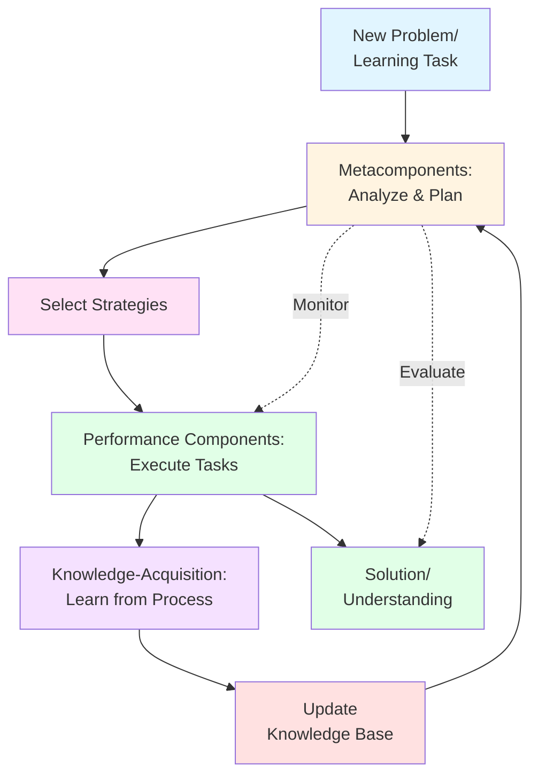

# Bloom's Taxonomy and Sternberg's Information Processing Theory

## Introduction

How do we move from simply remembering facts to creating new knowledge? How can we assess whether students are truly learning at deeper levels? These questions led Benjamin Bloom and his colleagues to develop one of the most influential frameworks in education: **Bloom's Taxonomy**.

Similarly, how do different aspects of intelligence contribute to learning and problem-solving? Robert Sternberg's information processing approach provides answers by breaking intelligence into distinct but interconnected components.

Together, these frameworks provide powerful tools for understanding, facilitating, and assessing learning.

## Bloom's Taxonomy: A Hierarchy of Thinking

### Origins and Purpose

In 1956, a team led by Benjamin Bloom published the *Taxonomy of Educational Objectives*, creating a systematic classification of educational goals. Their aim was to:
- Provide a common language for educators
- Structure learning objectives from simple to complex
- Guide curriculum development and assessment
- Promote higher-order thinking skills

**Why "Taxonomy"?**
A taxonomy is a classification system (like biological classification). Bloom's Taxonomy classifies cognitive skills into hierarchical levels, each more complex than the one before.

### The Original Framework (1956)

The original taxonomy proposed six levels:

1. **Knowledge** - Recall facts and basic concepts
2. **Comprehension** - Explain ideas or concepts
3. **Application** - Use information in new situations
4. **Analysis** - Draw connections among ideas
5. **Synthesis** - Justify a stand or decision
6. **Evaluation** - Produce new or original work

### The Revised Taxonomy (2001)

In 2001, Anderson and Krathwohl revised Bloom's Taxonomy with important changes:

**Key Revisions:**
- Changed from **nouns** to **verbs** (emphasizing action and process)
- Reordered the top two levels (Synthesis → Creation moved to highest)
- Added a **Knowledge Dimension** alongside the Cognitive Process Dimension

## The Six Cognitive Levels (Revised)

Let's explore each level in depth, from simplest to most complex:

### 1. Remember 🔍

**Definition:**
Retrieve relevant knowledge from long-term memory.

**What It Involves:**
- **Recognizing**: Identifying information when presented
- **Recalling**: Retrieving information from memory

**Key Verbs:**
Define, identify, list, name, recognize, recall, retrieve, state, match, label

**Examples:**
- Name the three types of memory systems
- List the stages of information processing
- Identify Miller's Magic Number
- Recall the definition of chunking

**Why It Matters:**
While often viewed as "low-level," remembering is foundational. You can't apply what you don't remember. However, education shouldn't stop here.

**Teaching Applications:**
- Flashcards for terminology
- Quizzes on facts and definitions
- Matching exercises
- Fill-in-the-blank questions

### 2. Understand 💡

**Definition:**
Construct meaning from oral, written, and graphic messages.

**What It Involves:**
- **Interpreting**: Converting information between formats
- **Exemplifying**: Finding examples of concepts
- **Classifying**: Determining categories
- **Summarizing**: Abstracting general themes
- **Inferring**: Drawing logical conclusions
- **Comparing**: Detecting similarities and differences
- **Explaining**: Constructing cause-and-effect models

**Key Verbs:**
Interpret, exemplify, classify, summarize, infer, compare, explain, paraphrase, discuss, illustrate

**Examples:**
- Explain why chunking helps memory
- Compare sensory memory and short-term memory
- Summarize the key principles of information processing
- Classify different types of encoding

**The Critical Difference:**
Understanding means you can explain concepts in your own words, not just repeat what you've heard.

**Teaching Applications:**
- Concept maps
- Summarization exercises
- Comparison charts
- Explanation activities

> 📖 **Reference**: [Block-1/Unit-2.pdf, Pages 26-27]

### 3. Apply 🔧

**Definition:**
Use procedures to perform tasks or solve problems.

**What It Involves:**
- **Executing**: Using a procedure in a familiar situation
- **Implementing**: Using a procedure in an unfamiliar situation

**Key Verbs:**
Execute, implement, use, demonstrate, solve, apply, show, complete, modify

**Examples:**
- Use Miller's principles to improve your study habits
- Apply chunking to memorize a complex formula
- Demonstrate effective encoding strategies while learning new material
- Implement spaced practice in your study schedule

**The Practical Level:**
This is where knowledge becomes useful. Can you actually do something with what you know?

**Teaching Applications:**
- Problem-solving tasks
- Real-world applications
- Case studies
- Skill demonstrations

### 4. Analyze 🔬

**Definition:**
Break material into constituent parts and determine how parts relate to one another and to an overall structure.

**What It Involves:**
- **Differentiating**: Distinguishing relevant from irrelevant parts
- **Organizing**: Determining how elements fit together
- **Attributing**: Determining point of view, biases, or intentions

**Key Verbs:**
Differentiate, organize, attribute, analyze, compare, contrast, distinguish, examine, categorize, investigate

**Examples:**
- Analyze how the three memory systems work together
- Differentiate between bottom-up and top-down processing
- Examine the relationship between working memory capacity and learning
- Compare and contrast Bloom's and Sternberg's approaches

**Going Deeper:**
Analysis requires understanding relationships and structures, not just individual pieces.

**Teaching Applications:**
- Comparative analyses
- Cause-and-effect diagrams
- Research critique
- Structure/function analysis

### 5. Evaluate ⚖️

**Definition:**
Make judgments based on criteria and standards.

**What It Involves:**
- **Checking**: Testing for inconsistencies or fallacies
- **Critiquing**: Judging based on criteria and standards

**Key Verbs:**
Check, critique, evaluate, judge, assess, verify, justify, argue, defend, support

**Examples:**
- Evaluate the effectiveness of different memory strategies for specific learning goals
- Critique a study method based on information processing principles
- Judge whether a teaching approach aligns with cognitive development
- Assess the strengths and limitations of the computer metaphor

**Critical Thinking:**
Evaluation requires not just opinions, but reasoned judgments based on explicit criteria.

**Teaching Applications:**
- Peer review
- Criteria-based assessment
- Debate and argumentation
- Evidence evaluation

### 6. Create 🎨

**Definition:**
Put elements together to form a coherent or functional whole; reorganize elements into a new pattern or structure.

**What It Involves:**
- **Generating**: Coming up with alternative hypotheses
- **Planning**: Devising procedures to accomplish tasks
- **Producing**: Creating a product

**Key Verbs:**
Create, design, construct, plan, produce, invent, devise, formulate, compose, develop

**Examples:**
- Design a memory training program based on information processing principles
- Create a new mnemonic system for learning complex material
- Develop a study guide that integrates multiple cognitive levels
- Compose an original research proposal investigating memory

**The Pinnacle:**
Creating represents the highest level of cognitive work - producing something new and original.

**Teaching Applications:**
- Original research projects
- Design challenges
- Creative productions
- Innovation tasks

## The Knowledge Dimension

Anderson and Krathwohl added a second dimension to complement the cognitive processes:

### Types of Knowledge

**1. Factual Knowledge**
- Basic elements (terminology, specific details)
- Example: Definition of sensory memory

**2. Conceptual Knowledge**
- Interrelationships among basic elements
- Example: How memory systems interact

**3. Procedural Knowledge**
- How to do something
- Example: Steps to apply chunking strategy

**4. Metacognitive Knowledge**
- Awareness of one's own cognition
- Example: Knowing which study strategies work best for you

## The Two-Dimensional Framework

These dimensions create a matrix:

|   | Remember | Understand | Apply | Analyze | Evaluate | Create |
|---|----------|------------|-------|---------|----------|--------|
| **Factual** | Recall facts | Explain facts | Use facts | Categorize facts | Judge fact accuracy | Generate new facts |
| **Conceptual** | Recognize concepts | Explain concepts | Apply concepts | Analyze relationships | Critique theories | Design new models |
| **Procedural** | Recall procedures | Describe procedures | Execute procedures | Analyze procedures | Evaluate methods | Develop procedures |
| **Metacognitive** | Recall strategies | Explain strategies | Use strategies | Analyze own thinking | Judge own work | Create learning plans |

This framework helps educators design more targeted learning experiences and assessments.

> 📖 **Reference**: [Block-1/Unit-2.pdf, Pages 26-27]

## Practical Applications of Bloom's Taxonomy

### For Designing Learning Objectives

**Poor Learning Objective:**
"Students will learn about memory."
*Too vague - what level of learning?*

**Better Learning Objectives:**
- **Remember**: Students will **list** the three types of memory systems
- **Understand**: Students will **explain** how information flows through memory systems
- **Apply**: Students will **demonstrate** effective encoding strategies
- **Analyze**: Students will **compare** different memory models
- **Evaluate**: Students will **critique** a memory improvement program
- **Create**: Students will **design** an original study plan using cognitive principles

### For Self-Assessment

Use Bloom's levels to check your understanding:

**After learning a topic, ask yourself:**
1. Can I **define** key terms? (Remember)
2. Can I **explain** this to someone else? (Understand)
3. Can I **use** this in a new situation? (Apply)
4. Can I **analyze** how different parts relate? (Analyze)
5. Can I **evaluate** competing explanations? (Evaluate)
6. Can I **create** something new with this knowledge? (Create)

If you can't do higher levels, return to lower levels for foundation-building.

### For Creating Better Assessments

**Instead of:** "What is sensory memory?"
**Try:** 
- "Compare sensory and short-term memory" (Analyze)
- "Design an experiment to test sensory memory duration" (Create)
- "Evaluate which memory strategy would work best for learning a foreign language" (Evaluate)

## Sternberg's Information Processing Theory

### The Triarchic Theory of Intelligence

While Bloom focused on educational objectives, Robert Sternberg (1988) developed a comprehensive theory of intelligence as information processing.

**Key Features:**
- **Continuous Development**: No discrete stages; progress is from novice to expert
- **Applies Across Lifespan**: Same principles govern child and adult learning
- **Skill-Based**: Emphasizes the processes of intelligence, not static abilities

### The Three Components of Intelligence

#### 1. Metacomponents 🎯

**Definition:**
Executive processes that plan, monitor, and evaluate problem-solving.

**What They Do:**
- **Identify the problem**: What exactly needs to be solved?
- **Select strategies**: Which approach should I use?
- **Allocate resources**: How much time/effort per task?
- **Monitor progress**: Is my strategy working?
- **Evaluate outcomes**: Did I succeed? What can I improve?

**Example:**
When studying this unit:
- Metacomponents help you realize you're struggling with Bloom's Taxonomy
- Decide to create a concept map
- Allocate extra time to this topic
- Monitor whether the concept map helps
- Evaluate your final understanding

**Why They're "Meta":**
They're components *about* components - thinking about thinking.

#### 2. Performance Components ⚙️

**Definition:**
Processes that actually execute the tasks planned by metacomponents.

**What They Do:**
- **Encode information**: Identify relevant features
- **Infer relationships**: Discover connections
- **Map relations**: Apply relationships to new domains
- **Apply rules**: Use knowledge to generate responses
- **Compare options**: Evaluate different solutions
- **Justify choices**: Explain selected responses

**Example:**
When answering an exam question:
- Encode the question (what's being asked?)
- Infer what knowledge is needed
- Map course concepts to the question
- Apply relevant theories
- Compare possible answers
- Justify your final choice

**The "Doing" Components:**
While metacomponents plan and oversee, performance components actually perform the cognitive work.

#### 3. Knowledge-Acquisition Components 📚

**Definition:**
Processes used to learn new information and solve problems.

**What They Do:**
- **Selective encoding**: Distinguish relevant from irrelevant information
- **Selective combination**: Integrate separate pieces of information
- **Selective comparison**: Relate new information to existing knowledge

**Example:**
When learning about memory systems:
- Selective encoding: Focus on key characteristics, not every detail
- Selective combination: Connect information about all three systems
- Selective comparison: Link to what you already know about learning

**Learning to Learn:**
These components improve with practice, making you a more efficient learner over time.

### How the Three Components Work Together



### The Three Subtheories

Sternberg's complete triarchic theory extends beyond components:

**1. Componential Subtheory**
- The three components described above
- Focuses on internal mental processes

**2. Experiential Subtheory**
- How experience affects intelligence
- Novelty and automatization
- Insight and creativity

**3. Contextual Subtheory**
- Intelligence in real-world contexts
- Adaptation, selection, and shaping of environments
- Practical intelligence

### Implications for Learning

**From Sternberg's Theory:**

**1. Feedback Matters**
- All three components improve through feedback
- Social interaction supports cognitive development
- Cultural context shapes how intelligence develops

**2. Development is Continuous**
- Expertise develops gradually
- Same processes operate at all ages
- Practice and experience drive improvement

**3. Intelligence is Multifaceted**
- Different components can be strengths or weaknesses
- Balanced development across components is ideal
- Context determines which components matter most

**4. Learning Can Be Taught**
- Metacognitive strategies can be explicitly taught
- Performance improves with practice
- Knowledge-acquisition skills transfer across domains

## Comparing the Frameworks

### Similarities

Both Bloom and Sternberg:
- Emphasize **hierarchical complexity** in cognitive processing
- Recognize **multiple levels or components** of thinking
- Provide frameworks for **educational practice**
- Support **higher-order thinking** as an educational goal

### Differences

| Aspect | Bloom's Taxonomy | Sternberg's Theory |
|--------|-----------------|-------------------|
| **Focus** | Educational objectives | Intelligence and problem-solving |
| **Structure** | Six discrete levels | Three interacting components |
| **Development** | Hierarchical progression | Continuous, expertise-based |
| **Application** | Curriculum and assessment | Learning and adaptation |
| **Scope** | Cognitive domain (mainly) | Multiple contexts and types |

### Complementary Use

These frameworks work together:
- **Bloom** helps structure learning objectives and assessments
- **Sternberg** helps understand the processes underlying learning
- Together, they provide a comprehensive approach to education

## Study Resources

### Educational Videos
- [Bloom's Taxonomy Explained](https://www.youtube.com/results?search_query=bloom%27s+taxonomy+explained) - Multiple accessible explanations
- [Simply Psychology: Bloom's Taxonomy](https://www.simplypsychology.org/blooms-taxonomy.html) - Clear visual guides

### Additional Reading
- [Bloom's Taxonomy - Wikipedia](https://en.wikipedia.org/wiki/Bloom's_taxonomy) - Comprehensive overview with history
- [University of Waterloo: Bloom's Taxonomy](https://uwaterloo.ca/centre-for-teaching-excellence/catalogs/tip-sheets/blooms-taxonomy) - Practical teaching applications
- [Revised Bloom's Taxonomy - Colorado College](https://www.coloradocollege.edu/other/assessment/how-to-assess-learning/learning-outcomes/blooms-revised-taxonomy.html) - Detailed verb lists
- [Britannica: Bloom's Taxonomy](https://www.britannica.com/topic/Blooms-taxonomy) - Academic treatment

### Memory Aids

**Remember Bloom's Levels (Revised):**
**RUAAE-C** or create a sentence:
"**R**emember **U**ncle **A**lways **A**nalyzed **E**verything, **C**reatively"

Or use a pyramid visual:
```
        CREATE
      EVALUATE
      ANALYZE
      APPLY
    UNDERSTAND
     REMEMBER
```

**Sternberg's Components:**
**MeP-KA** = **Me**ta, **P**erformance, **K**nowledge-**A**cquisition
Think: "**Me** **P**erforming, **K**nowing **A**ll"

## Self-Assessment

### Application Questions

1. **Bloom's Application**: Take any topic from this course. Write one learning objective for each of the six cognitive levels.

2. **Sternberg's Components**: Describe a recent problem you solved. Identify which of Sternberg's components you used and how.

3. **Integration**: How might a teacher use both Bloom's and Sternberg's frameworks together to support student learning?

4. **Self-Analysis**: Using Bloom's Taxonomy, at what level are you currently processing the material in this unit? What would it take to reach a higher level?

### Critical Thinking

**Scenario**: A student can define all the terms in a chapter (Remember level) but struggles to apply the concepts to solve problems. 

Using both frameworks:
- What might Bloom's Taxonomy suggest about the problem?
- What would Sternberg's theory add to the analysis?
- What instructional strategies would you recommend?

## Summary

**Essential Concepts:**

✅ **Bloom's Taxonomy** organizes cognitive skills into six hierarchical levels: Remember, Understand, Apply, Analyze, Evaluate, Create

✅ **The Revised Taxonomy (2001)** emphasizes active processes (verbs) and adds a Knowledge Dimension with four types: Factual, Conceptual, Procedural, and Metacognitive

✅ **Lower-Order Thinking** (Remember, Understand, Apply) builds foundational knowledge and basic skills

✅ **Higher-Order Thinking** (Analyze, Evaluate, Create) involves complex cognitive processing and deeper understanding

✅ **Sternberg's Theory** proposes three components of intelligence: Metacomponents (executive processes), Performance components (task execution), and Knowledge-acquisition components (learning processes)

✅ **Metacomponents** provide executive control - planning, monitoring, and evaluating cognitive activities

✅ **Performance Components** carry out the actual cognitive work identified by metacomponents

✅ **Knowledge-Acquisition Components** facilitate learning through selective encoding, combination, and comparison

✅ **Both frameworks** emphasize progression from simple to complex cognitive processing

✅ **Practical applications** include designing learning objectives, creating assessments, structuring curriculum, and supporting cognitive development

✅ **Integration** of both frameworks provides comprehensive understanding of learning and can guide educational practice effectively

---

**Source PDFs**: 
- 📄 [Block-1/Unit-2.pdf - Pages 26-30](/pdfs/MPC-001%20Cognitive%20Psychology,%20Learning%20and%20Memory/Block-1/Unit-2.pdf)
- 📚 MPC-001 Cognitive Psychology, Learning and Memory

**Related Topics**: 
- [Learning and Memory Systems](/docs/mpc-001/block-1/learning-memory-systems)
- [Information Processing Theory](/docs/mpc-001/block-1/information-processing-theory)
- [Cognitive Psychology Introduction](/docs/mpc-001/block-1/cognitive-psychology-introduction)
