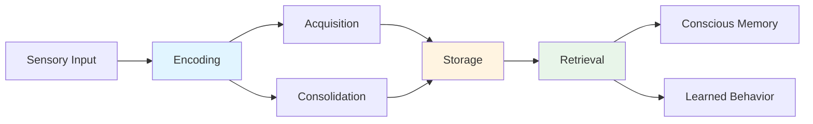
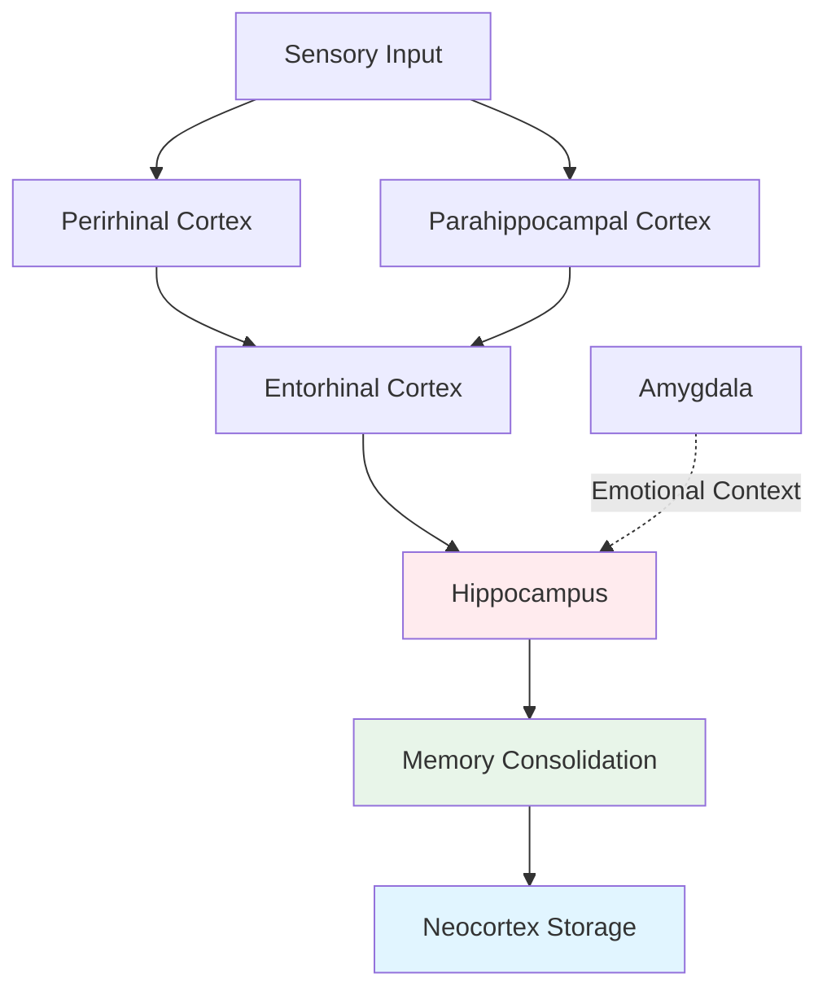

# Memory and Brain Systems: Understanding Amnesia

## Overview

Imagine waking up every day unable to remember what happened yesterday, unable to recognize people you met just hours ago, yet still remembering your childhood perfectly. This was the reality for one of the most studied patients in neuroscience history—a man known as H.M. His tragic condition revolutionized our understanding of how the brain creates and stores memories.

The study of amnesia—the loss of memory due to brain damage—has been instrumental in mapping the neural architecture of human memory. Like detectives solving a mystery, neuroscientists have used cases of memory loss to piece together how different brain regions contribute to our ability to learn and remember.

> 📖 **Reference**: Unit-3, Pages 31-36

## The Relationship Between Learning and Memory

### Defining the Connection

**Learning** is the process of acquiring new information, while **memory** refers to the persistence of that learning in a state that can be revealed later. Think of learning as writing in a notebook and memory as the ink that keeps those words readable over time.

Learning doesn't always require conscious effort. You can learn and improve simply through repeated exposure. For example, you recognize your friend's face better after seeing them multiple times without deliberately trying to memorize their features.

### The Three Stages of Memory Processing

Memory formation involves three hypothetical stages:

1. **Encoding** - Processing incoming information
   - **Acquisition**: Registering inputs through sensory systems
   - **Consolidation**: Strengthening the representation over time

2. **Storage** - Creating and maintaining permanent records
   - The result of successful acquisition and consolidation

3. **Retrieval** - Accessing stored information
   - Creating conscious representations
   - Executing learned behaviors



## Brain Surgery and the Discovery of Memory Systems

### The Era of Experimental Neurosurgery

In the late 1940s and early 1950s, neurosurgeons performed various procedures to treat neurological and psychiatric diseases:

- **Prefrontal lobotomy**: Removing or disconnecting prefrontal cortex
- **Corpus callosotomy**: Sectioning the corpus callosum
- **Amygdalotomies**: Removing the amygdala
- **Temporal lobe resection**: Removing temporal lobe tissue

While often controversial, these procedures accidentally revealed fundamental principles of brain organization—particularly regarding memory.

### William Scoville's Breakthrough Observation

In 1953, neurosurgeon William Scoville reported a startling finding after performing bilateral medial temporal lobe surgery:

> "Bilateral resection... has resulted in no marked physiologic or behavioural changes with the one exception of a very grave, recent memory loss, so severe as to prevent the patient from remembering the locations of the rooms in which he lives, the names of his close associates, or even the way to the toilet."

Working with psychologist Brenda Milner, Scoville examined ten patients and discovered a crucial pattern: **the severity of amnesia correlated with how much medial temporal lobe tissue was removed**, particularly affecting areas posterior to the amygdala.

## The Case of H.M.: The Most Famous Patient in Neuroscience

### Before Surgery: Living with Severe Epilepsy

H.M. was a young man who suffered from increasingly severe epilepsy during his teenage years. Traditional medications proved ineffective as his seizures worsened into his twenties. Desperate for relief, he agreed to experimental surgery.

**The Surgical Decision**: Neurosurgeons knew that many seizures originated in the medial temporal lobe. The radical treatment plan involved bilateral removal of this region—a procedure called temporal lobectomy.

### After Surgery: A New Kind of Problem

The surgery succeeded in reducing H.M.'s epilepsy, but physicians soon noticed troubling changes:

**Timeline Discovery**:
- Surgery performed: September 1953
- H.M.'s age at surgery: 27 years old
- Testing date: April 1955
- H.M.'s reported age: 27 (still!)

H.M. couldn't remember meeting people minutes after they left the room. He was profoundly amnesic—but not in the way movies depict amnesia.

### What H.M. Could and Couldn't Do

| Preserved Abilities | Lost Abilities |
|-------------------|----------------|
| ✅ Above-normal intelligence | ❌ Forming new long-term memories |
| ✅ Normal perception | ❌ Remembering recent events |
| ✅ Intact language skills | ❌ Learning new names and faces |
| ✅ Unchanged personality | ❌ Remembering what he did today |
| ✅ Normal short-term memory | ❌ Creating lasting episodic memories |
| ✅ Memories from before surgery | ❌ Consolidating new information |

**Critical Finding**: H.M. developed **severe anterograde amnesia**—the inability to form new long-term memories—while maintaining normal short-term memory and older memories.

### What H.M.'s Daily Life Was Like

Imagine reading this article and, five minutes after finishing it, having no memory that you ever read it. That was H.M.'s reality. He lived in a perpetual present, unable to form new memories that would last beyond a few minutes. Yet he could discuss his childhood, remember skills he learned before surgery, and even learn new motor skills (though he wouldn't remember learning them).

> 📖 **Reference**: Unit-3, Pages 33-34

## The Medial Temporal Lobe: Memory's Critical Hub

### Anatomical Components

The medial temporal lobe includes several key structures:

1. **Hippocampus** - Critical for memory formation
2. **Amygdala** - Processes emotional memories
3. **Entorhinal cortex** - Gateway to hippocampus
4. **Parahippocampal cortex** - Processes spatial context
5. **Perirhinal cortex** - Processes object information



### The Case of Patient R.B.: Isolating the Hippocampus

While H.M.'s surgery removed extensive medial temporal lobe tissue, another patient—R.B.—provided even more specific evidence:

**R.B.'s Story**:
- Developed amnesia after reduced blood flow during bypass surgery
- Dense anterograde amnesia similar to H.M.
- Retrograde amnesia extending 1-2 years back
- Brain donated after death for study

**Crucial Discovery**: R.B.'s damage was restricted to **CA1 pyramidal cells in the hippocampus**—no other damage was found.

**Implication**: The hippocampus alone is sufficient to cause severe anterograde amnesia, confirming its critical role in forming new long-term memories.

## Understanding Different Types of Amnesia

### Anterograde Amnesia

**Definition**: Inability to form new memories after brain damage

**Characteristics**:
- Can't learn new information
- Short-term memory intact
- Old memories preserved
- Living in perpetual present

**Real-world Impact**: Can't remember:
- Conversations from earlier today
- Where you parked your car
- People you met yesterday
- What you ate for lunch

### Retrograde Amnesia

**Definition**: Loss of memories from before brain damage

**Characteristics**:
- Temporally graded (recent memories more affected)
- Distant memories often preserved
- Usually extends back 1-5 years
- Rarely affects entire lifetime

**Pattern**: The "gradient" effect means memories from years ago are safer than memories from months ago.

### Why Both Types Matter

The pattern of both types of amnesia tells us:
1. **Hippocampus creates memories** but doesn't permanently store them
2. **Old memories are stored elsewhere** in the brain (likely neocortex)
3. **Recent memories need hippocampus** more than old memories
4. **Consolidation takes time**—months to years

## Diencephalic Amnesia: Another Route to Memory Loss

### Alcoholic Korsakoff's Syndrome

Not all amnesia comes from temporal lobe damage. Russian psychiatrist Sergei Korsakoff identified a different pattern:

**Cause**: Chronic alcoholism → Vitamin deficiencies (especially thiamine) → Brain damage

**Affected Structures**:
- Dorsomedial nucleus of thalamus
- Mammillary bodies
- Other midline diencephalic structures

**Symptoms**:
- Anterograde amnesia
- Retrograde amnesia
- Sometimes confabulation (making up false memories)
- Executive function problems

### Why This Matters

Different brain regions causing similar amnesia suggests:
- Memory systems involve networks, not single structures
- Multiple pathways can disrupt memory formation
- The thalamus and hippocampus work together in memory circuits

## Clinical and Research Applications

### Advancing Neuroimaging

Modern MRI technology has allowed researchers to:
- Re-examine H.M.'s brain with unprecedented detail
- Confirm extent of surgical damage
- Identify preserved and damaged structures
- Correlate anatomy with specific memory deficits

### Improving Surgical Outcomes

Understanding H.M.'s case has led to:
- More selective epilepsy surgeries
- Preservation of critical memory structures
- Better prediction of post-surgical outcomes
- One-sided rather than bilateral procedures when possible

### Developing Therapeutic Interventions

Knowledge from amnesia research guides:
- Rehabilitation strategies
- Memory prosthetics
- Pharmacological interventions
- Early intervention for neurodegenerative diseases

## Study Resources

### 🎥 Videos

- [MIT OpenCourseWare: The Biology of Memory](https://www.youtube.com/watch?v=k3rP3BywS4k) - Neural basis of memory systems
- [Crash Course Psychology: Memory](https://www.youtube.com/watch?v=bSycdIx-C48) - Overview of memory types and brain regions
- [TED-Ed: What Happens When You Remove the Hippocampus?](https://www.youtube.com/watch?v=8pv6BQmP29w) - H.M.'s story explained

### 📚 Additional Reading

- [Wikipedia: Amnesia](https://en.wikipedia.org/wiki/Amnesia) - Comprehensive overview of amnesia types
- [Wikipedia: Hippocampus](https://en.wikipedia.org/wiki/Hippocampus) - Structure and function
- [Wikipedia: Henry Molaison (H.M.)](https://en.wikipedia.org/wiki/Henry_Molaison) - Complete case history
- [Nature Reviews Neuroscience: Memory consolidation (2024)](https://www.nature.com/articles/s41583-024-00789-3) - Recent advances in understanding consolidation
- [Trends in Cognitive Sciences: Hippocampal memory formation (2023)](https://www.cell.com/trends/cognitive-sciences/fulltext/S1364-6613(23)00234-5) - Current theories

### 🧠 Memory Aids

**Mnemonic for Medial Temporal Lobe Structures**: **"H-E-P-A"**
- **H**ippocampus - Creates memories
- **E**ntorhinal cortex - Gateway to hippocampus
- **P**erihinal cortex - Object processing
- **A**mygdala - Emotional memories

**Key Concept Formula**:
```
Hippocampus Damage = Anterograde Amnesia
Extensive Temporal Damage = Anterograde + Severe Retrograde
Intact Hippocampus = Normal Memory Formation
```

## 🎯 Self-Assessment

1. **Application**: If you met someone with amnesia who couldn't remember conversations from 5 minutes ago but could remember their childhood perfectly, which type of amnesia do they have? What does this tell you about where their brain damage likely is?

2. **Critical Thinking**: Why do you think H.M. could still learn new motor skills (like mirror drawing) even though he couldn't remember learning them? What does this suggest about different types of memory?

3. **Real-World Connection**: How has understanding amnesia changed the way neurosurgeons approach epilepsy treatment today? What precautions do they take?

4. **Analysis**: Explain why R.B.'s case was actually more informative scientifically than H.M.'s case, even though H.M. is more famous.

## Summary

Key takeaways about memory and brain systems:

- **Memory formation requires the hippocampus**, but long-term storage happens elsewhere in the brain
- **Different types of amnesia** (anterograde vs. retrograde) reveal different aspects of memory processing
- **H.M.'s case revolutionized neuroscience** by demonstrating that memory is not a single system but involves specific brain structures
- **The medial temporal lobe** is critical for converting short-term memories into long-term memories
- **Amnesia studies** have practical applications in surgery, rehabilitation, and treatment of memory disorders

The study of amnesia demonstrates how tragedy can illuminate understanding. Through careful study of patients like H.M., neuroscientists have mapped the geography of memory in the human brain, leading to better treatments and deeper insights into what makes us who we are.

---

**Source PDFs**: 
- 📄 [Block-1/Unit-3.pdf - Pages 31-36](/pdfs/MPC-001%20Cognitive%20Psychology,%20Learning%20and%20Memory/Block-1/Unit-3.pdf)
- 📚 MPC-001 Cognitive Psychology, Learning and Memory
