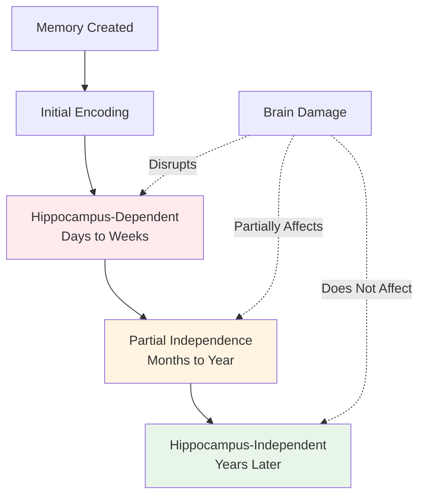
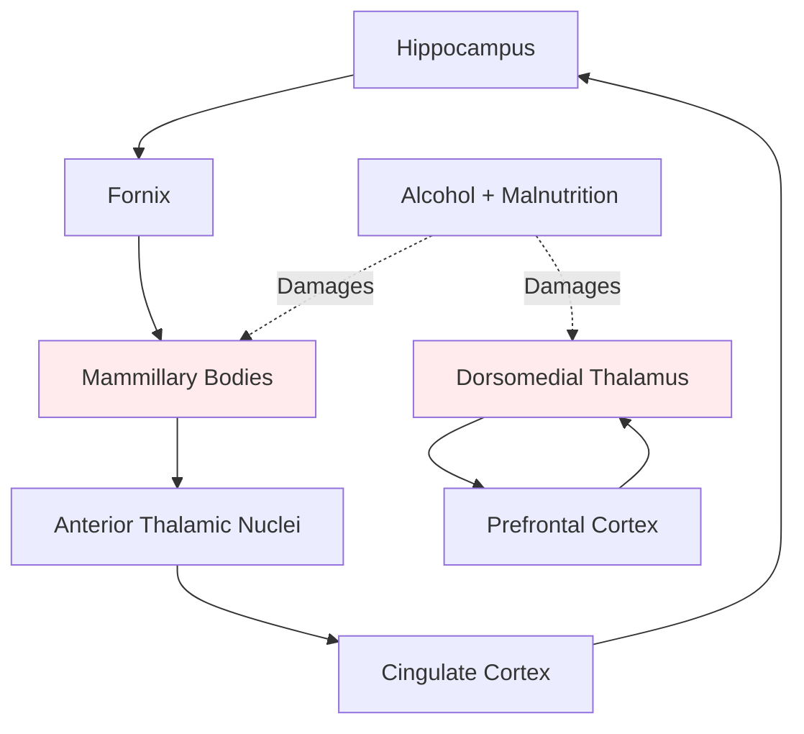

# Memory Consolidation and the Hippocampus

## Overview

Think of memory consolidation like letting concrete harden. When you first pour concrete, it's wet and malleable—easy to reshape or destroy. But over time, it solidifies into a permanent, stable structure. Your memories work similarly: they start fragile and gradually become fixed in your brain through a process called **consolidation**.

But here's the fascinating part: the hippocampus doesn't store your memories permanently. Instead, it acts like a construction coordinator, overseeing the building process while the actual storage happens elsewhere—in your neocortex. Understanding this process reveals why some memories fade quickly while others last a lifetime.

> 📖 **Reference**: Unit-3, Pages 35-37

## What Is Memory Consolidation?

### The Concept of Consolidation

**Consolidation** refers to the biological changes that transform temporary, fragile memories into stable, long-term memories. This isn't an instantaneous process—it unfolds over days, weeks, months, and even years.

**Historical Context**: The concept of consolidation has been around for over a century, but modern neuroscience has revealed its biological mechanisms.

### Why Consolidation Matters

Consider these everyday experiences:
- You remember events from this morning less clearly than events from last year
- Newly learned information is easily disrupted (someone interrupts you mid-task)
- Older memories feel more "solid" and permanent
- Sleep helps cement what you learned during the day

All of these phenomena relate to consolidation—the process of making memories stick.

## The Temporal Gradient: A Key Clue

### Understanding Retrograde Amnesia Patterns

One of the most important discoveries about consolidation comes from studying **retrograde amnesia**—the loss of memories from before brain damage.

**Critical Observation**: When the medial temporal lobe is damaged:
- Memories from years ago → **Preserved**
- Memories from months ago → **Somewhat affected**
- Memories from weeks ago → **Often lost**
- Memories from days ago → **Usually lost**

This pattern is called a **temporal gradient**—recent memories are more vulnerable than distant ones.

### What the Temporal Gradient Tells Us

The temporal gradient reveals three crucial facts:

1. **The hippocampus doesn't store long-term memories** (otherwise all memories would be lost)
2. **The hippocampus is critical during consolidation** (recent memories are most affected)
3. **Consolidation takes time** (the gradient extends months to years)

## The Hippocampus as Memory Coordinator

### Not a Storage Warehouse

Think of the hippocampus like a construction foreman who oversees building a house but doesn't live in it. The hippocampus:
- Coordinates the consolidation process
- Helps organize incoming information
- Facilitates connections between neocortical regions
- Eventually becomes unnecessary once memories are consolidated

### The Neocortex as Permanent Storage

The actual "filing cabinets" of your memories are distributed throughout the neocortex:
- Visual memories → Visual cortex
- Auditory memories → Auditory cortex
- Spatial memories → Parietal cortex
- Conceptual knowledge → Temporal and frontal cortex

**Key Principle**: Memories are stored near the regions that originally processed the information.

### How Consolidation Works: The Leading Theory

The **Standard Consolidation Theory** proposes:

**Stage 1: Initial Encoding (Minutes to Hours)**
- Hippocampus receives information from sensory cortex
- Creates temporary "index" linking cortical representations
- Memory is hippocampus-dependent

**Stage 2: Intermediate Consolidation (Days to Weeks)**
- Hippocampus replays memories during sleep and rest
- Strengthens connections between cortical regions
- Memory still partially dependent on hippocampus

**Stage 3: System Consolidation (Months to Years)**
- Direct cortical connections become strong enough
- Memory becomes independent of hippocampus
- Hippocampus no longer needed for retrieval

## Sleep and Memory Consolidation

### The Overnight Transformation

Research has revealed that **sleep plays a critical role in consolidation**:

**During Sleep**:
- Hippocampus "replays" recent experiences
- Neural patterns from waking hours are reactivated
- Connections between cortical neurons strengthen
- Memories transfer from hippocampus to neocortex

### Types of Sleep and Memory

Different sleep stages support different types of consolidation:

| Sleep Stage | Type of Memory | Process |
|-------------|---------------|---------|
| REM Sleep | Procedural, emotional | Integration with existing knowledge |
| Slow-Wave Sleep | Declarative, facts | Hippocampal-cortical transfer |
| Stage 2 Sleep | Motor skills | Sequence consolidation |

**Practical Implication**: This is why "sleeping on it" actually helps you remember better!

## Korsakoff's Syndrome: Another Window into Memory

### A Different Path to Amnesia

While H.M.'s amnesia came from temporal lobe damage, there's another route to memory loss—damage to the **diencephalon**, the brain's central core.

### The Story of Sergei Korsakoff

In the late 19th century, Russian psychiatrist Sergei Korsakoff described a devastating syndrome in chronic alcoholics:

**Chain of Events**:
1. Chronic alcohol abuse
2. Poor nutrition (alcoholics often don't eat properly)
3. Thiamine (Vitamin B1) deficiency
4. Brain damage to diencephalic structures
5. Severe amnesia

### What Gets Damaged in Korsakoff's Syndrome

**Primary Structures Affected**:
- **Dorsomedial nucleus of thalamus** - Critical for memory circuits
- **Mammillary bodies** - Connect hippocampus to other brain regions
- Other midline diencephalic areas

### Symptoms of Korsakoff's Syndrome

**Memory Problems**:
- Severe anterograde amnesia (can't form new memories)
- Extensive retrograde amnesia (can extend back decades)
- Relatively preserved procedural memory
- Normal short-term memory

**Additional Symptoms**:
- **Confabulation** - Making up false memories to fill gaps (often unconsciously)
- Executive function deficits
- Apathy and lack of initiative
- Sometimes peripheral neuropathy

### Why the Diencephalon Matters for Memory

The diencephalon is crucial because it's part of the **Papez circuit**—a loop connecting:
- Hippocampus → Fornix → Mammillary bodies → Thalamus → Cingulate cortex → back to Hippocampus

**Breaking this circuit anywhere** disrupts memory formation, explaining why both temporal lobe damage (H.M.) and diencephalic damage (Korsakoff's) cause amnesia.

## Comparing Memory Systems and Their Vulnerabilities

### Where Different Amnesias Strike

| Damage Location | Example Cause | Key Features | Temporal Gradient |
|----------------|---------------|--------------|-------------------|
| Medial temporal lobe | Surgery, stroke | Severe anterograde; limited retrograde | Yes, steep |
| Hippocampus only | Anoxia (R.B.) | Severe anterograde; minimal retrograde | Yes, mild |
| Diencephalon | Korsakoff's | Severe anterograde; extensive retrograde | Yes, extended |
| Anterior temporal cortex | Encephalitis | Severe retrograde; variable anterograde | Yes, very extensive |

## Clinical and Practical Applications

### Preventing Korsakoff's Syndrome

The tragedy of Korsakoff's is that **it's preventable**:

**Early Intervention**:
- Thiamine supplementation for heavy drinkers
- Nutritional support
- Alcohol addiction treatment
- Public health education

**Treatment Considerations**:
- Once established, Korsakoff's is largely irreversible
- Thiamine can prevent progression
- Rehabilitation focuses on compensatory strategies

### Enhancing Normal Consolidation

Understanding consolidation suggests ways to improve memory:

**Practical Strategies**:
1. **Sleep after learning** - Allows consolidation to occur
2. **Spaced repetition** - Strengthens consolidation over time
3. **Testing yourself** - Reactivates and strengthens memories
4. **Meaningful connections** - Facilitates cortical integration
5. **Avoid interference** - Give memories time to consolidate

## Study Resources

### 🎥 Videos

- [MIT OpenCourseWare: Sleep and Memory Consolidation](https://www.youtube.com/watch?v=YOJhvAx8TrI) - How sleep transforms memories
- [Crash Course Psychology: Sleep and Dreams](https://www.youtube.com/watch?v=9VZq7gnVgxI) - Role of sleep in memory
- [Neuroscience: Memory Consolidation Explained](https://www.youtube.com/watch?v=6qGliI-4Arc) - Molecular mechanisms

### 📚 Additional Reading

- [Wikipedia: Memory consolidation](https://en.wikipedia.org/wiki/Memory_consolidation) - Comprehensive overview
- [Wikipedia: Papez circuit](https://en.wikipedia.org/wiki/Papez_circuit) - Memory circuit anatomy
- [Wikipedia: Korsakoff syndrome](https://en.wikipedia.org/wiki/Korsakoff_syndrome) - Clinical presentation
- [Nature Neuroscience: Sleep-dependent memory consolidation (2024)](https://www.nature.com/articles/s41593-024-01587-4) - Latest research
- [Current Biology: Systems consolidation (2023)](https://www.cell.com/current-biology/fulltext/S0960-9822(23)01234-7) - Recent theories

### 🧠 Memory Aids

**Mnemonic for Consolidation Stages**: **"SIS"**
- **S**ynaptic consolidation (hours)
- **I**ntermediate phase (days)
- **S**ystems consolidation (months-years)

**Remember Korsakoff's Triad**: **"MAD"**
- **M**ammillary body damage
- **A**mnesia (anterograde and retrograde)
- **D**orsomedial thalamus damage

## 🎯 Self-Assessment

1. **Concept Check**: Explain why H.M. could remember his childhood but not what he ate for breakfast. Use the concept of consolidation in your answer.

2. **Application**: A patient has damage to their mammillary bodies. What type of amnesia would you expect them to have? Why?

3. **Critical Thinking**: Why do you think sleep deprivation impairs memory formation? Connect this to what you know about consolidation.

4. **Real-World Problem**: Design a study schedule that takes advantage of consolidation principles. How would you space your learning sessions?

## Summary

Key takeaways about memory consolidation:

- **Consolidation transforms temporary memories into permanent ones** through biological changes over time
- **The hippocampus coordinates consolidation** but doesn't permanently store memories
- **Temporal gradients in amnesia** reveal that consolidation takes months to years
- **The neocortex is the ultimate storage site** for long-term declarative memories
- **Sleep plays a critical role** in consolidating recently learned information
- **Korsakoff's syndrome demonstrates** that diencephalic structures are also essential for memory
- **Different brain regions** can cause amnesia when damaged, but show different patterns

The process of consolidation reveals that memory is not a simple recording device but a dynamic system that transforms and reorganizes information over time.

---

**Source PDFs**: 
- 📄 [Block-1/Unit-3.pdf - Pages 35-37](/pdfs/MPC-001%20Cognitive%20Psychology,%20Learning%20and%20Memory/Block-1/Unit-3.pdf)
- 📚 MPC-001 Cognitive Psychology, Learning and Memory
