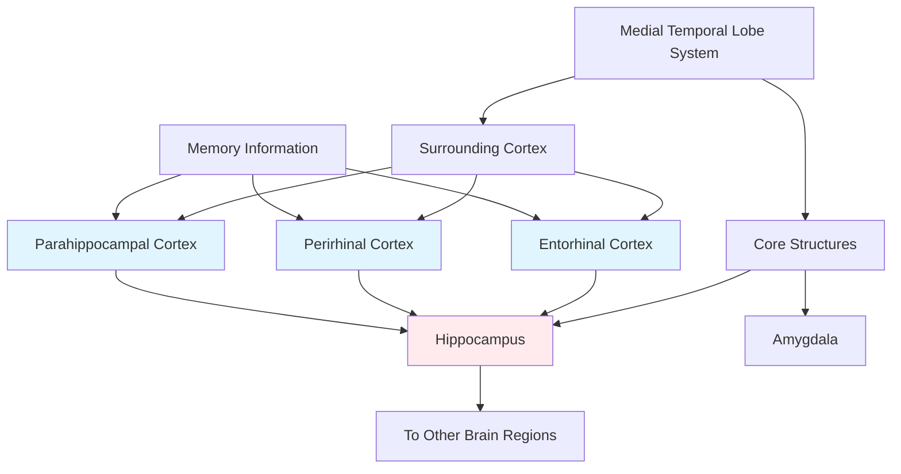

# Temporal Lobe Memory Systems and Animal Models

## Overview

Imagine you're a detective trying to understand how a complex machine works, but you can only examine it when parts are broken. This is essentially what neuroscientists do when studying memory—they piece together how the brain works by examining what happens when different parts are damaged.

While the medial temporal lobe (especially the hippocampus) is crucial for forming new memories, other temporal regions play equally important roles in memory storage and retrieval. Through creative studies using monkey models, researchers have mapped out a sophisticated network of memory systems that would be impossible to study through human patients alone.

> 📖 **Reference**: Unit-3, Pages 36-38

## The Anterior and Lateral Temporal Lobes

### Beyond the Hippocampus

While we've learned that the hippocampus helps create memories and the neocortex stores them long-term, an important question remains: **where exactly in the cortex are memories stored, and how are they retrieved?**

The **anterior temporal lobe** (near the temporal pole) and **lateral temporal neocortex** have emerged as critical players in these processes.

### A Different Pattern of Amnesia

**Key Observation**: Damage to the lateral cortex of the anterior temporal lobe causes:
- **Severe retrograde amnesia** - Loss of old memories
- Variable or intact anterograde memory - Can sometimes form new memories
- Extensive temporal reach - May extend back decades or entire lifetime

This is strikingly different from hippocampal damage patterns!

### What Causes Anterior Temporal Damage?

**Common Causes**:

1. **Herpes Simplex Encephalitis**
   - Viral infection targets temporal lobes
   - Often bilateral damage
   - Rapid onset with fever and confusion
   - Can cause devastating memory loss

2. **Alzheimer's Disease**
   - Progressive neurodegeneration
   - Starts in medial, spreads to lateral temporal cortex
   - Gradual worsening of retrograde amnesia
   - Eventually affects all memory types

3. **Traumatic Brain Injury**
   - Focal damage to temporal poles
   - Variable extent of retrograde loss
   - Sometimes called "isolated retrograde amnesia"

### Isolated Retrograde Amnesia: A Puzzling Phenomenon

Some patients develop **isolated retrograde amnesia**—they lose old memories but can form new ones perfectly well.

**Characteristics**:
- Dense loss of past memories
- Normal ability to learn new information
- Anterior temporal lobe damage
- Preserved hippocampal function

**What This Tells Us**:
- Anterior temporal regions are NOT essential for acquiring new memories
- They ARE essential for retrieving old memories
- Suggests these regions may be where memories are stored OR
- These regions provide critical retrieval mechanisms

## Animal Models: Why We Need Them

### The Challenge of Studying Human Memory

**Limitations of Human Studies**:
- Can't perform controlled experiments
- Damage is rarely selective
- Individual differences complicate interpretation
- Can't study cellular mechanisms directly
- Ethical constraints prevent invasive studies

**What Animal Models Offer**:
- Precise, controlled lesions
- Systematic manipulation of variables
- Access to cellular and molecular mechanisms
- Large sample sizes
- Cross-species comparisons

### Choosing the Right Animal Model

Different species reveal different aspects of memory:

| Species | Advantages | What They Teach Us |
|---------|-----------|-------------------|
| **Monkeys** | Similar brain structure to humans | Systems-level organization |
| **Rats** | Well-studied, flexible behavior | Spatial memory, navigation |
| **Mice** | Genetic manipulation | Molecular mechanisms |
| **Sea slugs (Aplysia)** | Simple nervous system | Basic learning principles |
| **Fruit flies** | Fast generation time | Genetic basis of memory |

**For Understanding Human Memory Systems**: Monkeys are the most valuable due to brain similarity.

## Groundbreaking Monkey Memory Research

### The Initial Puzzle: Does the Amygdala Matter?

In early work by Mortimer Mishkin (1978) at NIMH, a surprising finding emerged:

**Experimental Design**:
- Created surgical lesions in monkey medial temporal lobes
- Three groups: Hippocampus only, Amygdala only, or Both
- Tested on memory tasks
- Measured impairment severity

**Initial Results**:
- Hippocampus alone: Mild impairment
- Amygdala alone: Mild impairment  
- Both together: Severe impairment

**Conclusion (seemingly)**: Both hippocampus AND amygdala needed for memory!

**The Problem**: This didn't fit with human amnesia data. Patient R.B. had severe amnesia with hippocampal damage but intact amygdala!

### Stuart Zola's Crucial Refinement

Stuart Zola and colleagues (1993) at UC San Diego realized the problem: **earlier lesions weren't selective enough**.

**Key Innovation**: They distinguished between:
- Core structures (hippocampus, amygdala)
- Surrounding cortex (entorhinal, perirhinal, parahippocampal)

### The Revised Understanding

**Zola's Findings**:

1. **Hippocampus + Amygdala lesions** with intact surrounding cortex → Moderate impairment

2. **Hippocampus + Amygdala lesions** with damaged surrounding cortex → Severe impairment

3. **Amygdala presence or absence** didn't affect outcome if surrounding cortex was considered

**Breakthrough Conclusion**: The amygdala is NOT part of the declarative memory system!

### Why Surrounding Cortex Matters So Much

The perirhinal, entorhinal, and parahippocampal cortices are crucial because they:

**Input Functions**:
- Receive processed sensory information
- Integrate visual, auditory, and somatosensory data
- Perform substantial processing themselves
- Channel information to hippocampus

**Output Functions**:
- Relay hippocampal outputs back to neocortex
- Help distribute consolidated memories
- Participate in retrieval processes

**Critical Insight**: The hippocampus can't function in isolation—it depends on these cortical connections.

### The Delayed Nonmatching-to-Sample Task

Understanding monkey memory research requires knowing their key behavioral test:

**How It Works**:
1. **Sample Phase**: Show monkey an object
2. **Delay**: Wait (seconds to minutes)
3. **Test Phase**: Show sample object + novel object
4. **Reward**: Monkey must choose novel object for reward

**What It Measures**:
- Recognition memory
- Effect of delay on memory
- Hippocampal system function

**Key Finding**: Memory deficits worsen as delay increases, showing these regions aren't needed for short-term memory.

## Reconciling Animal and Human Data

### The Convergent Evidence

**What Both Show**:
- Hippocampus critical for forming new memories
- Surrounding cortex equally important
- Damage to input/output pathways disrupts memory
- Short-term memory preserved after damage
- Amygdala not essential for declarative memory

### Patient R.B. Makes Perfect Sense

R.B.'s severe amnesia from hippocampus-only damage now fits because:
- His hippocampus couldn't process information properly
- Even though surrounding cortex was intact, the "hub" was broken
- It's like having roads (cortex) but destroying the central station (hippocampus)

### What About the Amygdala?

If the amygdala isn't crucial for declarative memory, what DOES it do?

**Amygdala's Real Role**:
- Processes emotional aspects of memories
- Enhances memory for emotional events
- Modulates consolidation based on arousal
- Critical for fear conditioning
- Influences what we pay attention to

**Clinical Example**: Patients with amygdala damage can remember events but lack emotional coloring of those memories.

## Study Resources

### 🎥 Videos

- [MIT OpenCourseWare: Animal Models in Neuroscience](https://www.youtube.com/watch?v=_FazXwYJXzY) - Why we use animal models
- [Comparative Memory Systems](https://www.youtube.com/watch?v=kWk3U3aG4dI) - Cross-species memory research
- [Monkey Memory Studies](https://www.youtube.com/watch?v=8k4GzvRmcC8) - Classic experiments explained

### 📚 Additional Reading

- [Wikipedia: Perirhinal cortex](https://en.wikipedia.org/wiki/Perirhinal_cortex) - Structure and function
- [Wikipedia: Animal models of memory](https://en.wikipedia.org/wiki/Animal_models_of_memory) - Overview of research
- [Wikipedia: Delayed matching-to-sample](https://en.wikipedia.org/wiki/Delayed_matching-to-sample) - Behavioral testing
- [Current Opinion in Neurobiology: Temporal lobe memory systems (2024)](https://www.cell.com/current-opinion/neurobiology) - Recent advances
- [Neuron: Perirhinal cortex in recognition memory (2023)](https://www.cell.com/neuron/fulltext/S0896-6273(23)00789-2) - Latest research

### 🧠 Memory Aids

**Mnemonic for Temporal Lobe Memory Regions**: **"MAP"**
- **M**edial - Memory formation (hippocampus)
- **A**nterior - Memory retrieval
- **P**erirhinal/Parahippocampal - Processing and connections

**Remember Surrounding Cortex**: **"PEP"**
- **P**erirhinal
- **E**ntorhinal
- **P**arahippocampal

## 🎯 Self-Assessment

1. **Analysis**: Why did early studies incorrectly conclude that the amygdala was essential for memory? What did later research reveal?

2. **Application**: A monkey has damage to its perirhinal and parahippocampal cortex but intact hippocampus. Predict its performance on the delayed nonmatching-to-sample task.

3. **Critical Thinking**: Why are monkey models particularly valuable for studying memory compared to rats or mice? What are their limitations compared to human studies?

4. **Synthesis**: How do findings from anterior temporal lobe damage (severe retrograde amnesia) complement findings from medial temporal lobe damage (severe anterograde amnesia)?

## Summary

Key takeaways about temporal lobe memory systems and animal models:

- **Anterior and lateral temporal regions** play crucial roles in memory storage and retrieval
- **Animal models, especially monkeys**, provide essential insights impossible to gain from human studies alone
- **The amygdala is not essential for declarative memory** but modulates emotional aspects
- **Surrounding cortex** (perirhinal, entorhinal, parahippocampal) is as important as the hippocampus itself
- **Different temporal regions** show different amnesia patterns when damaged
- **Convergent evidence** from humans and animals strengthens our theories

The combination of human patient studies and controlled animal experiments has revealed a nuanced picture of memory systems—one where multiple temporal lobe regions work together in a sophisticated network to create, store, and retrieve our memories.

---

**Source PDFs**: 
- 📄 [Block-1/Unit-3.pdf - Pages 36-38](/pdfs/MPC-001%20Cognitive%20Psychology,%20Learning%20and%20Memory/Block-1/Unit-3.pdf)
- 📚 MPC-001 Cognitive Psychology, Learning and Memory
