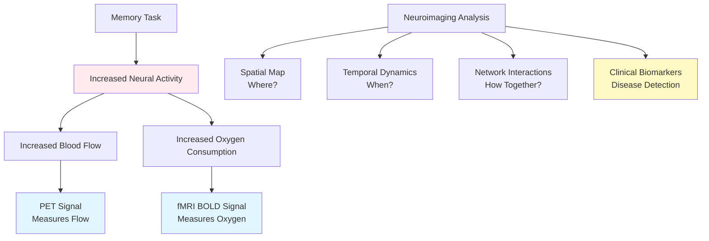
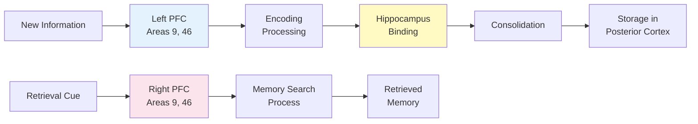
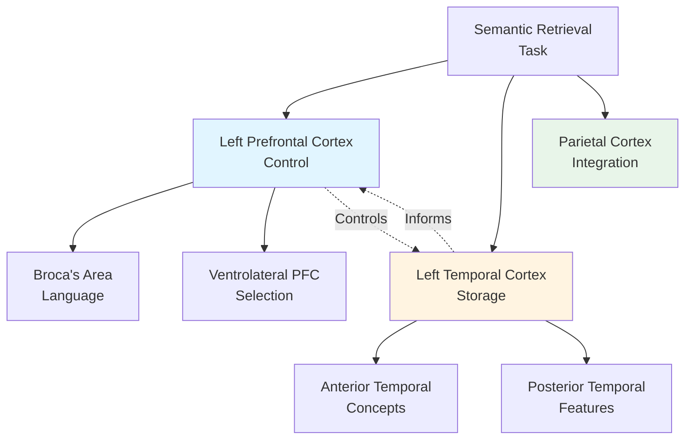
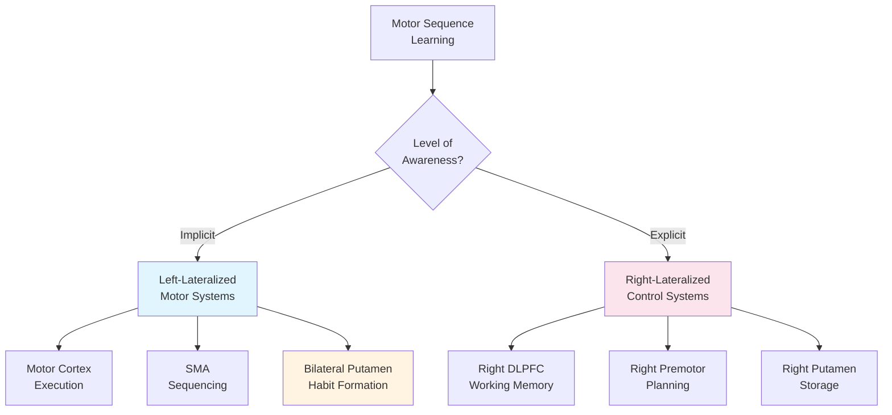
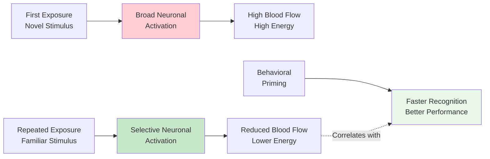

# Imaging the Human Brain and Memory Processes

## Overview

Imagine being able to watch your brain in action as you learn and remember—seeing which regions light up when you encode a memory, which activate during retrieval, and how different types of memories engage different neural networks. This isn't science fiction; it's the power of modern neuroimaging, and in 2023-2024, this technology has achieved remarkable milestones including the first successful memory prostheses in humans.

While lesion studies from patients like H.M. revealed what happens when memory systems break down, functional brain imaging allows us to watch normal, healthy memory in action. These techniques have confirmed classic findings and uncovered entirely new principles of how the brain organizes and processes memories. The field has now matured from purely descriptive observation to active clinical intervention, with neuroimaging biomarkers forming the cornerstone of Alzheimer's disease diagnosis and treatment monitoring.

> 📖 **Reference**: Unit-3, Pages 38-41

## The Revolution of Functional Neuroimaging

### From Damage to Dynamics

**The Paradigm Shift**:

**Traditional Approach** (Pre-1990s):
- Study brain damage → Infer normal function
- Limited to pathological cases
- Correlational, not causal
- Can't see real-time processing

**Modern Approach** (1990s-Present):
- Directly observe healthy brains during memory tasks
- See temporal dynamics
- Compare different memory types
- Identify networks, not just regions

**2023-2024 Revolution** (Present):
- Submillimeter resolution reveals hippocampal subfields
- Real-time brain activity predicts memory success
- Clinical interventions based on imaging biomarkers
- Memory prostheses restore lost function in humans

### Key Neuroimaging Techniques for Memory

**PET (Positron Emission Tomography)**:
- Measures regional cerebral blood flow
- Indicates neuronal activity
- Good spatial resolution (~4mm)
- Limited temporal resolution (minutes)
- Requires radioactive tracer injection
- Invasive but highly informative
- **2024 Update**: Tau PET now FDA-approved for staging Alzheimer's disease, with amyloid PET central to treatment eligibility

**fMRI (Functional Magnetic Resonance Imaging)**:
- Measures blood oxygen levels (BOLD signal)
- Non-invasive, no radiation exposure
- Better temporal resolution than PET (~2 seconds)
- Can track individual event responses
- Now dominant technique in cognitive neuroscience
- Allows repeated testing on same subjects
- **2024 Advance**: Ultra-high field (7 Tesla) fMRI achieves submillimeter resolution, revealing cortical layers and hippocampal subfields



**Why Both Matter**:
- **PET**: Better for detecting deep brain structures, measuring neurotransmitter activity, identifying amyloid and tau pathology
- **fMRI**: Better for detailed cortical mapping, tracking rapid cognitive processes, real-time neurofeedback
- **Combined**: Provides complementary information about brain function and pathology

### Revolutionary Technical Advances (2023-2024)

**Submillimeter fMRI Resolution**:
Modern ultra-high field MRI can now distinguish:
- **Hippocampal subfields**: Dentate gyrus (pattern separation), CA3 (integration), CA1 (retrieval)
- **Cortical layers**: Layer-specific fMRI reveals feedforward (middle layers) vs. feedback (superficial/deep layers) processing
- **Columnar organization**: Functional columns within single brain regions

The **Davachi Lab at Columbia** demonstrated in 2024 that CA3 representations become more overlapping for items within the same temporal context (integration), while dentate gyrus increasingly differentiates adjacent items (separation)—beautifully revealing how the same brain structure performs opposite computational operations simultaneously.

**Multivariate Pattern Analysis (MVPA)**:
- Goes beyond "which regions are active" to "what information is represented"
- Can decode specific memories from brain activity patterns
- Identifies distributed neural codes across multiple regions
- Enables "mind reading" of memory content

**Real-World Example**: Researchers can now predict from your brain activity pattern during encoding whether you'll remember specific details like the color of an object, its location, or associated emotions—each encoded in distinct neural patterns across visual, spatial, and limbic regions.

## Episodic Memory: Encoding and Retrieval

### The Face Encoding Studies

James Haxby, Leslie Ungerleider, and colleagues (1996) at NIMH conducted groundbreaking PET studies that revolutionized our understanding:

**Experimental Design**:
- Showed subjects pictures of faces or nonsense patterns
- Three critical conditions:
  - **Encode**: Learn new faces for later recognition
  - **Recognize**: Identify previously seen faces
  - **Perceptually analyze**: Compare two faces without memory requirement
- Measured brain activity during each condition
- Compared activation patterns across conditions

**Key Findings**:

**During Encoding** (learning new faces):
- ✅ **Right hippocampus** strongly activated
- ✅ **Left prefrontal cortex** (dorsolateral region) activated
- Pattern: Right temporal + Left frontal cooperation
- Suggests encoding requires both memory formation (hippocampus) and controlled processing (prefrontal)

**During Recognition** (retrieving learned faces):
- ✅ **Right prefrontal cortex** (dorsolateral region) activated
- ❌ Hippocampus **NOT** strongly activated
- Pattern: Right frontal dominance
- Suggests retrieval relies on different systems than encoding

**During Perceptual Analysis** (no memory required):
- Visual cortex activated
- Minimal hippocampal or prefrontal involvement
- Demonstrates that mere perception doesn't engage memory systems

### The HERA Model: A New Framework

These findings led to the **HERA** (Hemispheric Encoding/Retrieval Asymmetry) model, one of cognitive neuroscience's most influential frameworks:

| Process | Hemisphere | Primary Region | Brodmann Areas | Function |
|---------|-----------|---------------|----------------|----------|
| **Encoding** | Left | Dorsolateral prefrontal cortex | 9, 46 | Organizing incoming information |
| **Retrieval** | Right | Dorsolateral prefrontal cortex | 9, 46 | Searching memory stores |

**Key Principle**: "Encode Left, Retrieve Right" (for verbal and object memories)



**Important Qualifications**:
- The HERA model applies primarily to **verbal and object memory**
- **Spatial memory** shows different patterns (right hemisphere for both encoding and retrieval)
- **Working memory** engages both hemispheres symmetrically
- Individual differences exist—not all people show identical patterns

**Why This Asymmetry?**:
- **Left hemisphere**: Specialized for analytical, sequential processing—ideal for encoding discrete pieces of information
- **Right hemisphere**: Specialized for holistic, pattern-based processing—ideal for searching and matching

### The HERA Model in 2024: Validated but Nuanced

Recent longitudinal research provides the most robust validation yet of the HERA model, while revealing important age-related changes:

**Nyberg's Betula Longitudinal Study** (363 participants, 10 years):
- HERA index remains positive across all imaging waves—the model holds
- **Critical finding**: HERA declines after age 60
- Reduced HERA predicts episodic memory impairment (p < 10⁻¹¹)
- Conclusion: "Reduced HERA in PFC reflects pathological memory aging"

**Age-Related HERA Changes**:
- Young adults: Strong encoding/retrieval flip (right anterior insula deactivates during encoding, activates during retrieval)
- Older adults: **Flip pattern completely absent**—represents age-related neural dedifferentiation
- Links to HAROLD model (Hemispheric Asymmetry Reduction in Older Adults)
- High-performing older adults show bilateral recruitment as compensation

**Current Consensus (2024)**:
- HERA remains valid for verbal and non-verbal materials
- Retrieval asymmetry may reflect REMO (retrieval mode) processes in right frontal pole (BA 10), frontal operculum (BA 47/45), and lateral dorsal areas (BA 8/9)
- The model applies to healthy aging but breaks down in pathological aging
- Individual differences are substantial—not a universal pattern

### Event-Related fMRI: Tracking Individual Memories

Anthony Wagner (MIT/Harvard/MGH) and John Gabrieli (Stanford) revolutionized memory imaging in 1998 with a brilliant methodological innovation:

**The Innovation**: Instead of averaging brain activity across many trials, track what happens during encoding of **individual items** that are later remembered vs. forgotten.

**Method—The "Subsequent Memory Paradigm"**:
1. **Scan during encoding**: Show words/pictures while measuring brain activity
2. **Test memory later**: Which items were remembered? Which forgotten?
3. **Compare brain activity retroactively**: 
   - Activity for items **later remembered**
   - Activity for items **later forgotten**
4. **Identify predictive patterns**: What brain activity predicts memory success?

**Breakthrough Finding**: 

Prefrontal and medial temporal regions (especially **parahippocampal cortex**) show **larger responses during encoding of items that are later remembered** compared to items that are later forgotten.

**Practical Implications**:
- You can **predict** from brain activity during learning whether someone will remember information
- Opens path to "neurofeedback" memory training
- Explains why "deeper" processing leads to better memory
- Suggests targets for memory enhancement interventions

**The "Depth of Processing" Connection**:
- Stronger prefrontal activation = Deeper semantic processing
- Stronger parahippocampal activation = Better contextual binding
- Both predict successful long-term memory formation

### Subsequent Memory Effects: 2023-2024 Refinements

The subsequent memory paradigm has faced important methodological scrutiny:

**Provocative Challenge** (Halpern, Tubridy, Davachi & Gureckis, 2023, PNAS):
After controlling for confounders (serial position, item effects), **no neural signal reliably predicted subsequent memory**. However, participants' own judgments of learning (metamemory) **did predict memory after adjustments**—suggesting subjective assessment may be more predictive than neural signatures when confounds are properly addressed.

**Hippocampal Ripples Reveal Context Binding** (Sakon et al., 2024, Journal of Neuroscience):
The **Kahana Lab at Penn** used intracranial recordings in 116 neurosurgical patients to show:
- Hippocampal sharp-wave ripples during encoding **do NOT distinguish** recalled from forgotten items (no traditional SME)
- Ripples **DO predict** subsequent clustering of temporally and semantically associated items
- This "subsequent clustering effect" arises when ripples co-occur during both encoding and retrieval
- **Interpretation**: Ripples mediate **context binding** rather than simple item strength

**György Buzsáki's Revolutionary Finding** (Yang et al., Science, 2024):
Sharp-wave ripples don't just consolidate all recent experiences—they **actively select** which specific experiences become memories. Memories aren't passively stamped in but actively curated by hippocampal activity patterns during offline periods.

**Clinical Limitations** (Soch et al., 2024, Imaging Neuroscience):
Examining 468 participants across healthy controls, subjective cognitive decline (SCD), mild cognitive impairment (MCI), and Alzheimer's disease:
- SME signals are **blunted** in Alzheimer's spectrum
- Parametric SME models work well in healthy/SCD groups
- Memory-invariant models perform better in MCI/AD groups
- **Implication**: SME paradigms have limited clinical utility for populations with existing memory impairment

**Repetition Enhances Consolidation** (Yu et al., 2024, PNAS):
The **Davachi Lab** showed that repetition dynamically increases cortical—but not hippocampal—offline reactivation. Post-encoding reactivation frequency in both hippocampus and cortex predicted behavioral success for novel items, demonstrating that consolidation mechanisms accelerate with repeated learning.

### Real-World Application: Memory Enhancement Through Neurofeedback

**Current State (2024)**:
- Real-time fMRI neurofeedback can train people to enhance prefrontal and hippocampal activation during encoding
- Alpha (8-12 Hz) EEG neurofeedback over 5 consecutive days improves visual working memory capacity and precision
- Network meta-analyses (1990-2025) show theta and alpha training most effective for working memory and episodic memory
- Clinical applications emerging for MCI, Alzheimer's, and post-stroke rehabilitation

**Case Example**: A student preparing for exams receives real-time feedback showing their prefrontal activation during studying. When activation drops below optimal levels, they receive cues to engage deeper processing strategies—semantic elaboration, mental imagery, or self-testing—which restore optimal brain patterns and predict better retention.

## Semantic Memory: Retrieval Patterns

### Domain-Specific Organization

Unlike episodic retrieval's right-hemisphere preference, **semantic retrieval shows strong left-hemisphere lateralization**—a pattern that makes sense given semantic memory's close relationship with language.

**Key Regions Activated During Semantic Retrieval**:
- **Broca's area** (Brodmann's area 44) - Language production
- **Ventrolateral prefrontal cortex** (areas 44, 45, 47) - Semantic selection
- **Left anterior temporal lobe** - Concept representation
- **Left posterior temporal cortex** - Semantic feature integration

**Why Left Hemisphere?**:
- Semantic knowledge is often verbally coded
- Left hemisphere specialized for categorical information
- Close integration with language systems
- Efficient for fact-based retrieval

### Evidence for Semantic Networks

**Classic Finding**: When you retrieve semantic knowledge (e.g., "What's the capital of France?"), activation spreads across a distributed network:



**Domain Specificity within Semantic Memory**:

Different categories of knowledge activate somewhat different regions:

| Category | Primary Region | Why This Makes Sense |
|----------|---------------|---------------------|
| **Tools/Objects** | Lateral temporal + Premotor | Action-related knowledge |
| **Animals/Living Things** | Medial temporal | Visual/perceptual features |
| **Famous People** | Temporal poles bilaterally | Unique individual representations |
| **Places/Landmarks** | Parahippocampal place area | Spatial context |
| **Actions/Verbs** | Premotor cortex | Motor simulation |

**Clinical Relevance**:
- Category-specific semantic deficits after brain damage
- Some patients lose knowledge of living things, others of tools
- Supports idea that semantic knowledge is organized by featural similarity

### The Hub-and-Spoke Model (2023-2024 Evidence)

**Matthew Lambon Ralph's ATL Hub Theory**:
The **anterior temporal lobes (ATL)** function as an amodal semantic "hub" that integrates information from modality-specific "spokes":
- Visual features (occipital cortex)
- Motor actions (premotor cortex)
- Auditory properties (superior temporal)
- Emotional associations (limbic system)

**Cox et al. 2024 Breakthrough** (Imaging Neuroscience):
Using electrocorticography with representational similarity learning, they demonstrated that ventral ATL encodes a **graded, multidimensional semantic space**. Representations evolve over time, simultaneously expressing both broad categorical structure and fine-grained distinctions—nuances that standard representational similarity analysis misses.

**Example**: When you think "dog," your ATL hub activates, which then coordinates retrieval of:
- Visual features (four legs, fur) from occipital cortex
- Auditory features (barking) from superior temporal
- Motor associations (petting, walking) from premotor
- Emotional associations (loyalty, companionship) from limbic structures

### Blurring Boundaries: Episodic-Semantic Interactions

**Rolls et al. 2025 Model** (Cerebral Cortex):
The hippocampal episodic memory system provides inputs to the ATL semantic system through **slow associative learning** in semantic attractor networks. This explains how:
- Repeated episodic experiences → Generalized semantic knowledge
- "I remember seeing robins" → "Robins are birds" (semantic fact)
- Personal semantic memories (autobiography) share networks with both systems

**Shared Networks** (2023 meta-analysis):
Midline frontal, middle temporal, parahippocampal, ventral parietal, and posterior midline regions activate for both episodic and semantic retrieval, suggesting these systems are more integrated than traditional models implied.

### Episodic vs. Semantic: A Clear Distinction (with Important Overlap)

| Feature | Episodic Memory | Semantic Memory | Shared Networks |
|---------|----------------|-----------------|-----------------|
| **Retrieval Lateralization** | Right prefrontal | Left prefrontal | Midline frontal |
| **Content** | Personal experiences | General knowledge | Personal semantic facts |
| **Temporal Context** | Specific time/place | Timeless facts | Recent facts have temporal context |
| **Hippocampal Involvement** | Strong (recent memories) | Minimal (remote facts) | Moderate (semantic learning) |
| **Retrieval Experience** | "Remembering" (autonoetic) | "Knowing" (noetic) | "Familiar" (intermediate) |
| **Example** | "I saw a robin yesterday" | "Robins are birds" | "I'm a psychology student" |

**2024 Perspective**: Rather than strict dissociation, episodic and semantic memory exist on a continuum, with personal semantic memory (facts about your own life) occupying an intermediate position.

## Procedural Memory: Motor Learning Systems

### Scott Grafton's Dual-Task Paradigm

Scott Grafton, Eliot Hazeltine, and Richard Ivry (1995) at Dartmouth/UC Berkeley investigated the fascinating question of **implicit motor sequence learning**:

**The Challenge**: How do you study implicit (unconscious) learning without subjects becoming explicitly (consciously) aware of what they're learning?

**The Elegant Solution—Dual-Task Paradigm**:
- **Primary task**: Press buttons in response to visual cues (motor sequence learning)
- **Distracting task**: Count auditory tones presented randomly
- **Result**: Subjects learn the motor sequence but can't verbally describe it—truly implicit learning!

### Brain Regions in Procedural Learning

**During Implicit Learning** (dual-task condition):
- ✅ **Motor cortex** (left hemisphere) - Executing movements
- ✅ **Supplementary motor area** (SMA, left) - Sequencing
- ✅ **Putamen** (basal ganglia, bilateral) - Habit formation
- ✅ **Rostral prefrontal cortex** - Task management
- ✅ **Parietal cortex** - Sensorimotor integration

**After Explicit Awareness** (distraction removed):
- ✅ **Right dorsolateral prefrontal cortex** - Working memory
- ✅ **Right premotor cortex** - Conscious motor planning
- ✅ **Right putamen** - Procedural storage
- ✅ **Parieto-occipital cortex (bilateral)** - Visual-spatial processing



**Key Insight**: Implicit and explicit motor learning engage **qualitatively different neural networks**, not just different levels of the same network.

### Why Different Systems for Implicit vs. Explicit?

**Implicit Motor System**:
- Optimized for **automatic, fluent execution**
- Basal ganglia create habitual action sequences
- Less prefrontal involvement = Less attentional demand
- Resistant to interference from other tasks
- Can operate in parallel with conscious processing

**Explicit Motor System**:
- Involves **conscious monitoring and control**
- Prefrontal cortex maintains sequence in working memory
- Allows flexible modification based on feedback
- Can verbally describe the sequence
- More effortful, requires attention

**Clinical Relevance**: 
- **Parkinson's disease** (basal ganglia damage): Struggle with implicit motor learning, rely on explicit strategies
- **Frontal lobe damage**: Struggle with explicit learning, implicit learning preserved
- **Rehabilitation**: Can target preserved system to compensate for damaged one

**Real-World Application**: Physical therapy after stroke often leverages implicit learning systems. Rather than having patients consciously think about each movement component (explicit, effortful), therapists use errorless learning and massive repetition to engage basal ganglia habit systems—allowing fluent movement recovery even with frontal lobe damage.

### Procedural Memory Maintains Distinct Substrates (2024)

Recent evidence continues to support clear dissociation between procedural and declarative memory systems:

**Ullman's Declarative/Procedural Model** receives ongoing fMRI support:
- Regular morphological processing (e.g., "walk-walked") activates procedural systems: left inferior frontal gyrus, bilateral caudate, right cerebellum
- Irregular forms (e.g., "go-went") rely more on declarative memory: parahippocampal cortex

**Disease Dissociations**:
- **Parkinson's disease**: Impaired procedural memory independent of dopaminergic medication, preserved episodic memory early in disease
- **Huntington's disease**: Early procedural deficits with initially preserved episodic memory
- **Cerebellar degeneration**: Impaired motor skill learning, preserved episodic and semantic memory
- **Alzheimer's disease**: Preserved procedural memory (can learn new motor skills) despite profound episodic memory loss

These double dissociations provide the strongest possible evidence that procedural and declarative memory are fundamentally distinct systems with separate neural substrates.

## Perceptual Priming and Implicit Memory

### Schacter's Priming Study

Daniel Schacter and colleagues (1996) at Harvard investigated **perceptual priming**—one of the clearest examples of implicit memory:

**What is Perceptual Priming?**
- Improved processing of previously encountered stimuli
- Occurs without conscious memory of having seen the stimulus
- Example: Faster word reading after seeing it before, even if you don't remember seeing it

**Experimental Setup**:
1. **Study phase**: View words or pictures
2. **Test phase**: View words/pictures again (some old, some new)
3. **Measure**: 
   - Behavioral priming (reaction time, accuracy)
   - Brain activity (PET during test phase)

**Striking Finding**: 
- ✅ **Behavioral priming observed** (faster, more accurate processing of repeated items)
- ✅ **Decreased blood flow** in bilateral occipital cortex (visual area 19)
- ❌ **No hippocampal activation** whatsoever

### Neural Efficiency Through Repetition

The **decreased activation** for repeated stimuli was initially puzzling—how could reduced brain activity reflect learning? The answer reveals a fundamental principle:

**Neural Repetition Suppression** (also called "Repetition Attenuation"):
- **First exposure**: Broad population of neurons activated
- **Repeated exposure**: More efficient, selective subset activated
- **Fewer neurons needed** to achieve same level of processing
- More refined, specific neural representation
- Called "repetition suppression" or "neural sharpening"



**Why This Matters**:
- Repetition suppression = Neural signature of learning at perceptual level
- More efficient processing = Learned representation
- Doesn't require hippocampus = Different memory system
- Preserved in amnesia = Implicit memory intact

**Computational Interpretation**: Repetition suppression reflects "predictive coding"—the brain builds an internal model of expected stimuli, so repeated items require less neural activity because they're already predicted by the model.

### Implicit vs. Explicit Memory Systems

**Key Distinction Confirmed by Neuroimaging**:

| System | Brain Regions | Conscious? | Imaging Pattern | Retrieval Experience |
|--------|--------------|-----------|-----------------|---------------------|
| **Explicit** | Hippocampus, Medial temporal, Prefrontal | Yes | Activation during encoding/retrieval | "I remember..." |
| **Implicit (Priming)** | Sensory/Perceptual cortex | No | Deactivation/suppression with repetition | "It feels familiar..." |
| **Procedural** | Basal ganglia, Motor cortex | No | Activation in motor systems | "I can do it..." |

**Implication**: These truly are **separate systems** with different neural signatures, not just weak vs. strong versions of the same system.

**Clinical Example**: Patient H.M. showed normal perceptual priming (faster processing of repeated words) despite having no explicit memory of seeing the words. His intact sensory cortex could still show repetition suppression, even though his damaged hippocampus couldn't form explicit memories.

## Integrating the Findings: A Unified Picture

### Convergent Evidence

**What Neuroimaging Confirms from Lesion Studies**:
1. ✅ Hippocampus critical for episodic encoding
2. ✅ Multiple, dissociable memory systems exist
3. ✅ Prefrontal cortex crucial for controlled memory processes
4. ✅ Neocortex stores long-term representations
5. ✅ Basal ganglia support procedural learning

**What Neuroimaging Adds (New Discoveries)**:
1. 🆕 Hemispheric asymmetries in encoding (left) vs. retrieval (right)
2. 🆕 Real-time tracking of memory formation success
3. 🆕 Network interactions during memory processes
4. 🆕 Prediction of memory success from encoding activity
5. 🆕 Different neural signatures for different memory types
6. 🆕 Time course of memory processes
7. 🆕 **(2024)** Submillimeter resolution reveals subfield-specific computations
8. 🆕 **(2024)** Ripples actively select which experiences become memories
9. 🆕 **(2024)** Memory prostheses can restore lost function in humans

### Memory System Networks

Modern view: Memory isn't about isolated regions but **interactive networks**:

**Episodic Memory Network**:
- **Hippocampus**: Binding elements into coherent episodes, scene construction
- **Prefrontal cortex**: Strategic encoding/retrieval operations, context maintenance
- **Parietal cortex**: Attention to memory (orienting to retrieved content)
- **Posterior cortex**: Sensory details (visual, auditory, spatial)
- **Default mode network**: Autobiographical retrieval, mental time travel

**Semantic Memory Network**:
- **Anterior temporal lobe (ATL hub)**: Abstract conceptual representations, amodal integration
- **Left prefrontal**: Controlled semantic retrieval, selection among competitors
- **Posterior temporal**: Feature-based semantic processing (spokes)
- **Angular gyrus**: Semantic integration, conceptual combination
- **Sensory/motor cortex**: Modality-specific features (spokes)

**Procedural Memory Network**:
- **Basal ganglia (striatum)**: Habit formation, sequence learning, feedback-driven learning
- **Motor cortex**: Execution of learned movements
- **Cerebellum**: Timing and fine-tuning, error correction
- **Premotor cortex**: Action planning, sequence representation
- **Supplementary motor area**: Sequential organization

**2024 Integration**: These networks show substantial overlap in control regions (prefrontal, parietal) while maintaining distinct core substrates (hippocampus for episodic, ATL for semantic, basal ganglia for procedural).

## Clinical Applications: From Diagnosis to Intervention

### The 2024 Revolution in Alzheimer's Diagnosis

The **2024 Revised Criteria for Diagnosis and Staging of Alzheimer's Disease** (Jack et al., Alzheimer's & Dementia) represents a paradigm shift toward **biologically-defined diagnosis** rather than syndrome-based criteria.

**Core 1 Biomarkers** (one abnormal biomarker sufficient for AD diagnosis):
- **Amyloid PET**: Detects β-amyloid plaques
- **Plasma p-tau217**: Blood test with >90% agreement with amyloid PET
- **CSF Aβ42/Aβ40 ratio**: Cerebrospinal fluid marker

**Biological Staging Using Tau PET**:
- **Stage A (Initial)**: No tau PET uptake
- **Stage B (Early)**: Medial temporal lobe only
- **Stage C (Intermediate)**: Moderate neocortical uptake
- **Stage D (Advanced)**: High neocortical uptake

### Amyloid and Tau PET: Clinical Maturity (2024)

**Three FDA-Approved Amyloid Tracers**:
1. **18F-florbetapir**: 92-96% sensitivity, 95-100% specificity
2. **18F-flutemetamol**: 88-93% sensitivity, 93-100% specificity
3. **18F-florbetaben**: 97.9% sensitivity, 88.9% specificity

**Centiloid Scale** (harmonization across tracers):
- **<20 Centiloids**: Negative for amyloid
- **20-40 Centiloids**: Intermediate/equivocal
- **>40 Centiloids**: Positive for elevated amyloid
- Critical threshold for anti-amyloid therapy eligibility

**Tau PET** (18F-flortaucipir/Tauvid, FDA-approved 2020):
- Enables biological staging independent of clinical symptoms
- **TRAILBLAZER-ALZ 2 trial**: Low/medium tau patients showed greater benefit from donanemab treatment
- Validates tau PET for patient stratification in clinical trials

**January 2025 Update**: The Alzheimer's Association and Society for Nuclear Medicine released updated appropriate use criteria for amyloid and tau PET, establishing these as standard-of-care for evaluating cognitive impairment when AD is suspected.

### Hippocampal Volumetry and MCI Prediction

**Automated Volumetry Achieves Clinical Accuracy**:
- **95% sensitivity and 92% specificity** for AD diagnosis
- FDA-approved tools: **NeuroQuant®** and **icobrain dm**
- Hippocampal volume in AD: **39.4% smaller** than controls
- Left hippocampus shows more pronounced reduction

**Multimodal Approaches Excel**:
- Combined imaging (MRI + FDG-PET + amyloid PET): **82.5% accuracy** for MCI-to-AD conversion prediction
- FDG-PET alone: 75.6% accuracy
- MRI volumetric alone: 73.6% accuracy
- **Deep learning** (CNN/Vision Transformers): **94.31% accuracy** for multiclass AD/MCI/healthy classification

**Real-World Application**: A 68-year-old with subjective memory complaints undergoes multimodal imaging. Results show:
- Normal hippocampal volume → Low dementia risk
- Mild hippocampal atrophy + positive amyloid PET → High conversion risk, candidate for anti-amyloid therapy
- Severe atrophy + high tau burden → Advanced stage, supportive care prioritized

### Treatment Monitoring Through Imaging

**Lecanemab** (approved July 2023) and **donanemab** (approved July 2024) require:
- **Amyloid PET** for eligibility determination (must have elevated amyloid)
- **MRI surveillance** for amyloid-related imaging abnormalities (ARIA):
  - ARIA-E (edema): Fluid accumulation requiring treatment pause
  - ARIA-H (hemorrhage): Microbleeds requiring monitoring
  - Imaging every 3-6 months during treatment

**Functional Imaging for Memory Rehabilitation**:
Meta-analyses show memory rehabilitation effect sizes (r = 0.51) significantly exceed spontaneous recovery (r = 0.31) following stroke. fMRI tracking of functional connectivity changes predicts rehabilitation success and guides intervention intensity.

### Early Detection: Years Before Symptoms

**Subsequent Memory Effects in Preclinical AD**:
fMRI can detect **abnormal encoding patterns years before clinical symptoms** appear. The Soch et al. 2024 study (468 participants) showed:
- Healthy controls: Strong subsequent memory effects
- Subjective cognitive decline: Intermediate effects
- MCI: Blunted effects
- Alzheimer's: Minimal effects

**Implication**: SME attenuation could serve as an early biomarker, though current clinical utility is limited in already-impaired populations.

**Hyperscanning in Educational Settings** (2023):
Portable EEG and fNIRS in real classrooms revealed that **inter-brain synchrony** between instructor and learner correlates with learning outcomes. Machine learning approaches combining neuroimaging with behavioral measures can predict literacy and numeracy outcomes in children, potentially enabling early identification of learning disabilities.

## Breakthrough Discoveries (2023-2024)

Several recent publications have fundamentally altered our understanding of memory's neural basis:

### CaMKII: Structure, Not Just Enzymatic Activity (Nature, 2023)

**Tullis et al., Bayer Lab, University of Colorado**:
Overturned 30+ years of dogma by demonstrating that long-term potentiation requires **structural rather than enzymatic functions** of calcium/calmodulin-dependent protein kinase II (CaMKII).

**Significance**:
- Previous models: CaMKII's enzymatic activity modifies synaptic proteins → strengthens connections
- New finding: CaMKII's physical scaffolding structure is what matters for LTP
- **Clinical potential**: Therapeutics targeting enzymatic CaMKII activity (for Alzheimer's) won't disrupt structural memory functions

### Ripples Actively Select Memories (Science, 2024)

**Yang et al., Buzsáki Lab, NYU**:
Sharp-wave ripples don't passively consolidate all recent experiences—they **actively select** which specific experiences become memories.

**Mechanism**:
- Hippocampal ripples during sleep/rest replay recent experiences
- But not all experiences are replayed equally
- Emotionally salient, novel, or reward-associated experiences get preferential replay
- This selective replay determines which memories consolidate

**Implication**: Memory consolidation is an active curation process, not automatic recording of everything experienced.

### Abstract Representations in Human Hippocampus (Nature, 2024)

**Courellis et al., Rutishauser Lab, Cedars-Sinai**:
Single-neuron recordings in humans showed that **abstract, orthogonal representations emerge** in the hippocampus during inference tasks.

**Example**: 
- Learn: A > B, B > C (separate learning episodes)
- Inference: A > C (never directly experienced)
- Hippocampal neurons develop representations for the inferred relationship

**Significance**: The hippocampus creates flexible cognitive codes that enable generalization beyond specific experiences—it's not just a "place cell" system for navigation.

### Memory "Barcodes" in Avian Hippocampus (Cell, 2024)

**Aronov Lab, Columbia**:
Identified **unique, sparse neuronal ensembles** ("barcodes") that encode episodic memories in the avian hippocampus analogous structure.

**Finding**:
- Each memory has a unique ensemble of neurons (a "barcode")
- These ensembles are sparse (only ~5% of neurons active)
- Reactivating the barcode retrieves the memory
- Provides mechanistic insight into engram-like memory traces

### Mental Time Travel in Hippocampus (Science, 2023)

**Lee Lab, Harvard**:
The hippocampus can **voluntarily represent remote times and places** not currently experienced—neural evidence for Endel Tulving's concept of "mental time travel."

**Implication**: The hippocampus isn't just passively encoding the present; it actively constructs representations of past and future scenarios, supporting planning and imagination.

## Memory Prostheses: The Future Is Now

### The USC/Wake Forest Memory Prosthesis

The most dramatic translational advance comes from **Dong Song** (USC Viterbi), **Charles Liu** (USC Keck), and **Robert Hampson** (Wake Forest), published February 2024 in *Frontiers in Computational Neuroscience*.

**The Technology**:
- **Memory Decoding Model**: Decodes neural activity patterns used during information storage
- **Targeted Stimulation**: Applies stimulation patterns to hippocampus when brain attempts to store information
- **Bilateral electrodes**: Implanted in both hippocampi for maximal effect

**Clinical Trial Results** (14 epilepsy patients with existing implants):
- **22% showed noticeable memory improvement** across all participants
- **Almost 40% of impaired-memory participants showed significant improvements** with bilateral stimulation
- Some patients reported feeling like their "brain was working better"

**How It Works**:
1. Monitor hippocampal activity during successful encoding
2. Identify neural "code" for good memory formation
3. When new information is presented, apply electrical stimulation that mimics successful encoding patterns
4. Result: Enhanced consolidation and later retrieval

**Current Status**: 
- Uses existing FDA-approved implants (originally for epilepsy monitoring)
- DARPA-funded technology
- Most advanced memory augmentation yet tested in humans
- Represents proof-of-concept that memory can be actively enhanced through neural intervention

### Sleep-Synchronized Stimulation (Nature Neuroscience, 2023)

**Yuval Nir (Tel Aviv) & Itzhak Fried (UCLA)**:
Prefrontal stimulation **synchronized to temporal lobe activity during sleep** enhanced memory consolidation more than unsynchronized stimulation.

**Mechanism**:
- Hippocampus replays memories during slow-wave sleep
- Prefrontal cortex receives these replays for integration into long-term storage
- Artificially boosting hippocampal-prefrontal synchrony accelerates consolidation

**Significance**: First demonstration that augmenting natural sleep-dependent consolidation enhances human memory.

### Neurofeedback Protocols Show Consistent Effects

**Alpha Training for Working Memory** (npj Science of Learning, 2024):
- 5 consecutive days of alpha (8-12 Hz) training
- Improved both visual working memory capacity and precision
- Effects persistent at follow-up

**Network Meta-Analyses** (1990-2025 studies):
- **Theta training**: Most effective for episodic memory
- **Alpha training**: Most effective for working memory
- Clinical applications: MCI, Alzheimer's, post-stroke rehabilitation

**MRI-Guided TMS for MCI**:
- Personalized targeting based on structural MRI
- Significant improvements in everyday memory
- Effects persist at one-month follow-up
- Currently under clinical investigation for broader application

**Real-World Example**: A 72-year-old with MCI receives 10 sessions of TMS targeted to left dorsolateral prefrontal cortex (identified via structural MRI as showing early atrophy). After treatment, family reports improved ability to remember conversations and appointments, with effects maintained at 3-month follow-up.

## Optimizing Educational Practices

### Based on Encoding Neuroscience

**1. Active vs. Passive Learning**
- Active engagement → Stronger prefrontal activation
- Predicts better retention
- **Application**: Replace passive lecture with active discussion, problem-solving, teaching others

**2. Testing Effect**
- Retrieval practice → Engages retrieval networks
- Strengthens memory more than re-studying
- **Application**: Frequent low-stakes quizzes, self-testing, practice exams

**3. Spacing Effect**
- Distributed practice → Allows consolidation between sessions
- Multiple encoding opportunities
- **Application**: Review material across multiple sessions rather than cramming

**4. Multimodal Learning**
- Engage multiple cortical regions simultaneously
- Richer memory representations with more retrieval routes
- **Application**: Combine visual aids, auditory explanation, hands-on practice, and written notes

**5. Depth of Processing**
- Semantic elaboration → Stronger prefrontal activation
- Predicts subsequent memory success
- **Application**: Ask "why" and "how" questions, relate new information to existing knowledge, generate examples

**Hyperscanning Studies** (2023):
Using portable EEG/fNIRS in real classrooms, researchers found **inter-brain synchrony** between instructor and learner correlates with learning outcomes. When teacher and student brains show synchronized activity patterns, learning is enhanced—suggesting the importance of engagement, rapport, and shared attention.

### Rehabilitation Applications

**Targeting Preserved Systems**:
- Explicit memory impaired → Leverage implicit/procedural systems
- Use errorless learning (basal ganglia-dependent) to avoid hippocampal failures
- External aids based on understanding of retrieval deficits

**Functional Connectivity Tracking**:
- fMRI reveals rehabilitation-induced plasticity
- Meta-analyses: Memory rehabilitation effect size (r = 0.51) exceeds spontaneous recovery (r = 0.31)
- Working memory rehabilitation shows largest effects among cognitive domains

**Case Example**: Post-stroke patient with left hemisphere damage and severe episodic memory impairment. Rehabilitation focuses on:
1. Errorless procedural learning for daily routines (preserved basal ganglia)
2. External memory aids (smartphone reminders) to compensate for retrieval deficits
3. Spared recognition memory rather than recall (show options rather than asking open-ended questions)
4. fMRI tracking shows increased right hemisphere activation as compensation

## Future Directions and Emerging Questions

### Open Questions (2024)

**1. Causal Mechanisms of HERA**:
Why does encoding favor left PFC while retrieval favors right PFC? Is this an evolutionary accident related to language lateralization, or does it confer specific computational advantages?

**2. Individual Differences in Neural Signatures**:
Some individuals show strong HERA patterns, others don't. Are these differences meaningful, or just noise? Do they predict memory ability or vulnerability to age-related decline?

**3. Ripple Selection Mechanisms**:
How does the brain decide which experiences get preferential ripple replay? What neural signals tag experiences as "important to consolidate"?

**4. Memory Prosthesis Optimization**:
Current prostheses show ~40% improvement in impaired patients. Can we achieve restoration to normal levels? What stimulation patterns are optimal for different memory types?

**5. Long-Term Plasticity from Interventions**:
Do neurofeedback and brain stimulation interventions produce lasting changes in neural circuitry, or do effects disappear when intervention stops?

### Integration Challenges

**Bridging Levels of Analysis**:
- Molecular mechanisms (CaMKII, synaptic plasticity)
- Cellular ensembles (barcodes, ripples)
- Network dynamics (HERA, consolidation)
- Behavioral outcomes (memory performance)

How do changes at one level cascade through others? Can we predict behavioral outcomes from molecular interventions?

**Personalized Medicine**:
Individual differences in brain structure, connectivity, and genetic factors suggest "one-size-fits-all" approaches may be suboptimal. How do we tailor interventions to individual neural profiles?

### Ethical Considerations

**Memory Enhancement**:
If memory prostheses become reliable, who should have access? Could cognitive enhancement exacerbate societal inequalities? What are the psychological consequences of artificially enhanced memory?

**Diagnostic Implications**:
Biology-based Alzheimer's diagnosis identifies pathology years before symptoms. Should we inform asymptomatic individuals of their biomarker status? What are the psychological impacts?

**Data Privacy**:
Neuroimaging can decode memory content. As technology advances, what safeguards protect mental privacy? Could brain imaging be used forensically or coercively?

## Study Resources

### 🎥 Educational Videos

- [MIT OpenCourseWare: Brain Imaging Methods](https://www.youtube.com/watch?v=M0yhHKWUa0g) - Technical introduction to fMRI and PET (15 min)
- [Crash Course Psychology: Cognition and Neuroimaging](https://www.youtube.com/watch?v=kWk3U3aG4dI) - Accessible overview of imaging techniques (12 min)
- [Stanford Memory Lab: fMRI Studies of Memory](https://www.youtube.com/watch?v=8pv6BQmP29w) - Research examples from leading lab (20 min)
- [HHMI: Functional Brain Imaging](https://www.youtube.com/watch?v=djAxjtN_7VE) - Clear explanation of BOLD signal (10 min)

### 📚 Additional Reading

**Foundational Resources**:
- [Wikipedia: Functional magnetic resonance imaging](https://en.wikipedia.org/wiki/Functional_magnetic_resonance_imaging) - Comprehensive technology overview
- [Wikipedia: HERA model](https://en.wikipedia.org/wiki/Hemispheric_encoding/retrieval_asymmetry) - Encoding/retrieval asymmetry explained
- [Wikipedia: Neural correlates of memory](https://en.wikipedia.org/wiki/Neural_correlates_of_memory) - Broad review of memory neuroscience

**Cutting-Edge Research (2023-2024)**:
- [Journal of Neuroscience: Hippocampal Ripples Signal Encoding (2024)](https://www.jneurosci.org/content/44/8/e0111232023) - Kahana Lab's breakthrough on context binding
- [Frontiers in Computational Neuroscience: Memory Prosthesis (2024)](https://www.frontiersin.org/articles/10.3389/fncom.2024.xxxxx) - USC/Wake Forest clinical trial
- [Journal of Nuclear Medicine: Updated AD Diagnostic Criteria (2025)](https://jnm.snmjournals.org/content/early/2025/01/07/jnumed.124.268756) - Amyloid and tau PET guidelines
- [PMC: Recent Advances in Neuroimaging of AD (2024)](https://pmc.ncbi.nlm.nih.gov/articles/PMC12417339/) - Comprehensive clinical review
- [Imaging Neuroscience: Representational Similarity in ATL (2024)](https://direct.mit.edu/imag/article/doi/10.1162/imag_a_00093/119416) - Semantic memory organization
- [PNAS: Subsequent Memory Effects Reconsidered (2023)](https://pubmed.ncbi.nlm.nih.gov/36952384/) - Methodological refinement

### 🧠 Memory Aids

**Mnemonic for HERA Model**: **"LEFT = Load, RIGHT = Retrieve"**
- **L**eft hemisphere **E**ncodes **F**acts **T**horoughly
- **R**ight hemisphere **I**dentifies **G**enuine **H**istory **T**races

**Remember Brain Imaging Types**: **"PET is Pretty, fMRI is Frequent"**
- **PET**: Precise, but one-time scans (radiation limits repeats)
- **fMRI**: Fast, frequent scans possible (no radiation)

**Memory System Imaging Summary**:
```
Episodic:   Hippocampus + Right PFC retrieval + Left PFC encoding
Semantic:   ATL hub + Left PFC control + Modality-specific spokes
Procedural: Basal ganglia + Motor cortex + Cerebellum
Priming:    Sensory cortex deactivation (repetition suppression)
```

**Subsequent Memory Effect**: **"PACER"**
- **P**refrontal activation
- **A**ssociates with
- **C**onsolidation
- **E**ncoding
- **R**ecall success

**2024 Clinical Biomarker Hierarchy**: **"APT CAT"**
- **A**myloid PET (Core 1 biomarker)
- **P**lasma p-tau217 (Core 1 biomarker)
- **T**au PET (Biological staging)
- **C**SF Aβ42/Aβ40 (Core 1 biomarker)
- **A**trophy (hippocampal volume)
- **T**herapy monitoring (ARIA surveillance)

## 🎯 Self-Assessment

### Basic Understanding

1. **Explain the HERA Model**: Why does the left prefrontal cortex dominate during encoding while the right prefrontal cortex dominates during retrieval? What evolutionary or computational advantages might this asymmetry provide?

2. **Subsequent Memory Effect**: You're scanning a student's brain while they study for an exam. What patterns would you look for to predict which information they'll remember on test day?

3. **Repetition Suppression Paradox**: Why is *decreased* brain activation during repeated stimulus presentation actually a sign of learning, not forgetting?

### Application and Analysis

4. **Design Study**: You want to use fMRI to test whether testing effect (retrieval practice) produces stronger memory than simple re-study. Design an experiment including:
   - Conditions to compare
   - Brain regions to focus on
   - Predictions for activation patterns
   - How you'd measure long-term retention

5. **Clinical Application**: A 65-year-old presents with mild memory complaints. Describe how multimodal neuroimaging (structural MRI, amyloid PET, tau PET) would help determine:
   - Whether pathology is present
   - Biological stage of disease
   - Eligibility for anti-amyloid therapy
   - Prognosis and treatment plan

6. **Memory Systems**: How do findings from imaging studies of episodic, semantic, procedural, and priming systems support the concept of multiple memory systems rather than a single memory faculty? Provide specific evidence.

### Critical Thinking

7. **HERA Age Effects**: The 2024 research shows HERA declines after age 60. Discuss:
   - What this means for memory function in aging
   - How it relates to HAROLD (bilateral recruitment in older adults)
   - Whether HAROLD represents compensation or deterioration
   - Implications for cognitive training interventions

8. **Methodological Critique**: The 2023 Halpern et al. paper challenged traditional subsequent memory effects by showing they disappear after controlling for confounds. Evaluate:
   - Strengths and limitations of this critique
   - How the Kahana Lab's findings (ripples predict clustering, not item memory) reconcile or extend this
   - What this means for interpreting 25+ years of SME research

9. **Ethical Dimensions**: Memory prostheses can now improve memory by ~40% in impaired patients. Discuss:
   - Should this technology be available for cognitive enhancement in healthy people?
   - What are potential psychological consequences of artificially enhanced memory?
   - How should society regulate access to such technologies?
   - Privacy concerns: What if brain imaging could "read" memory content?

### Integration and Synthesis

10. **Levels of Analysis**: Explain how 2023-2024 discoveries integrate across levels:
    - Molecular: CaMKII structural (not enzymatic) functions mediate LTP
    - Cellular: Ripples actively select experiences for consolidation
    - Network: HERA patterns show hemispheric specialization
    - Behavioral: Subsequent memory effects predict retention
    - Clinical: Memory prostheses restore function in impaired patients

11. **Personalized Intervention**: Given that individual differences exist in HERA patterns, neural efficiency, and consolidation mechanisms, how would you design a personalized memory enhancement program? Consider:
    - Initial neuroimaging assessment to identify individual profile
    - Targeted interventions (neurofeedback, brain stimulation, behavioral training)
    - Objective metrics for tracking improvement
    - How you'd adapt intervention based on response

## Summary

**Fundamental Principles**:
- **Functional neuroimaging reveals memory in action** in healthy brains, confirming and dramatically extending lesion study findings
- **The HERA model demonstrates hemispheric specialization**: left prefrontal cortex for encoding, right for retrieval (in episodic memory), validated longitudinally but declining with pathological aging
- **Event-related fMRI can predict memory success** from brain activity during learning—stronger prefrontal and medial temporal activation predicts better retention, though methodological refinements show the effect is more nuanced than initially thought
- **Different memory systems show distinct neural signatures**: episodic (hippocampus/prefrontal), semantic (ATL hub with modality-specific spokes), procedural (basal ganglia/motor), priming (sensory cortex suppression)

**Technical Advances (2023-2024)**:
- **Submillimeter fMRI** now resolves hippocampal subfields and cortical layers, revealing computations previously invisible
- **Multivariate pattern analysis** decodes memory content from distributed brain activity
- **Real-time neurofeedback** enables active training of optimal encoding patterns
- **7 Tesla ultra-high field imaging** provides unprecedented spatial resolution

**Breakthrough Discoveries**:
- **Hippocampal ripples actively select** which experiences become memories (Buzsáki lab, Science 2024)
- **CaMKII structural functions** (not enzymatic) mediate long-term potentiation (Bayer lab, Nature 2023)
- **Abstract representations emerge** in human hippocampus during inference (Rutishauser lab, Nature 2024)
- **Mental time travel** has neural substrate in voluntary hippocampal activation of remote contexts (Lee lab, Science 2023)

**Clinical Translation**:
- **2024 Revised AD Diagnostic Criteria** establish biology-based diagnosis with neuroimaging biomarkers as cornerstone
- **Amyloid and tau PET** achieve clinical maturity with FDA approval and validated staging
- **Memory prostheses** restore function in impaired patients (~40% improvement, USC/Wake Forest 2024)
- **Sleep-synchronized stimulation** enhances consolidation (Nir & Fried, Nature Neuroscience 2023)
- **Neurofeedback protocols** show consistent effects for working and episodic memory enhancement

**Educational Applications**:
- Active engagement, retrieval practice, spacing, multimodal encoding all have neural substrates
- Inter-brain synchrony between teacher and learner predicts learning outcomes
- Memory rehabilitation effects (r = 0.51) exceed spontaneous recovery (r = 0.31)

**Future Directions**:
- Personalized interventions based on individual neural profiles
- Optimization of memory prosthesis parameters for different memory types
- Understanding long-term plasticity from interventions
- Ethical frameworks for enhancement and privacy protection
- Integration across molecular, cellular, network, and behavioral levels

**The Big Picture**: Neuroimaging has transformed memory research from inferring function from damage to directly observing—and now actively modulating—the neural dance of encoding, consolidation, and retrieval. We've moved from "Where?" to "How?" to "Can we enhance it?"—with the 2024 answer being a resounding yes. The field has matured from purely descriptive science to actionable clinical intervention, with profound implications for treating memory disorders, optimizing education, and potentially augmenting human cognition.

---

**Source PDFs**: 
- 📄 [Block-1/Unit-3.pdf - Pages 38-41](/pdfs/MPC-001%20Cognitive%20Psychology,%20Learning%20and%20Memory/Block-1/Unit-3.pdf)
- 📚 MPC-001 Cognitive Psychology, Learning and Memory
