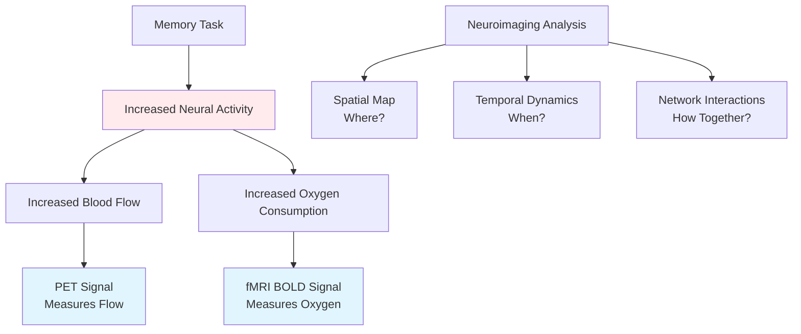
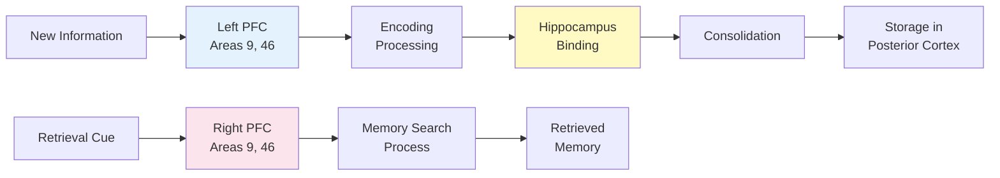
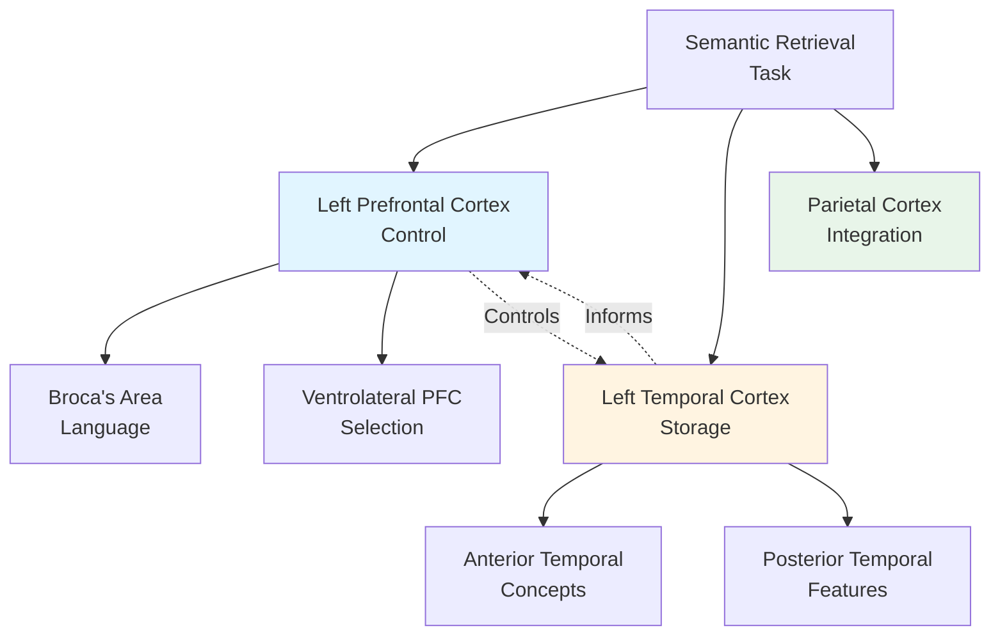
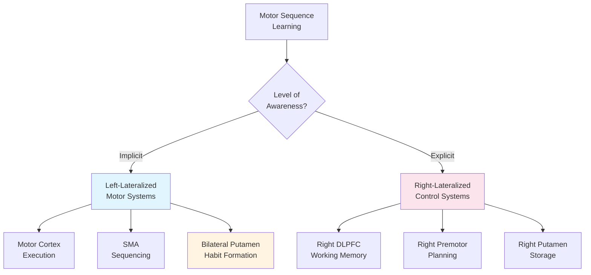
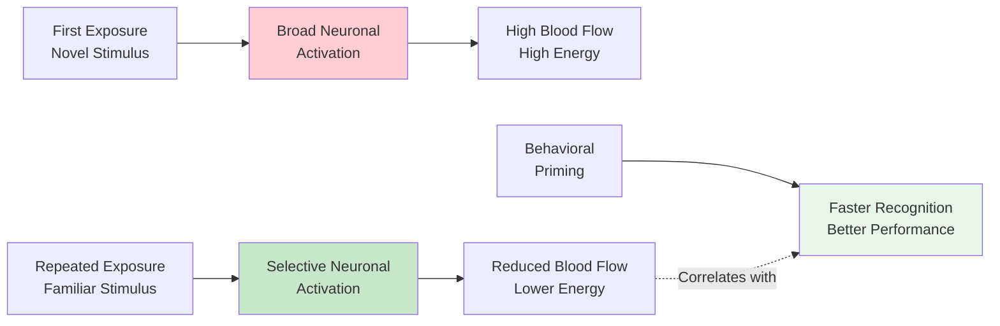

# Imaging the Human Brain and Memory Processes

## Overview

Imagine being able to watch your brain in action as you learn and remember—seeing which regions light up when you encode a memory, which activate during retrieval, and how different types of memories engage different neural networks. This isn't science fiction; it's the power of modern neuroimaging.

While lesion studies from patients like H.M. revealed what happens when memory systems break down, functional brain imaging allows us to watch normal, healthy memory in action. These techniques have confirmed classic findings and uncovered entirely new principles of how the brain organizes and processes memories.

> 📖 **Reference**: Unit-3, Pages 38-41

## The Revolution of Functional Neuroimaging

### From Damage to Dynamics

**The Paradigm Shift**:

**Traditional Approach** (Pre-1990s):
- Study brain damage → Infer normal function
- Limited to pathological cases
- Correlational, not causal
- Can't see real-time processing

**Modern Approach** (1990s-Present):
- Directly observe healthy brains during memory tasks
- See temporal dynamics
- Compare different memory types
- Identify networks, not just regions

### Key Neuroimaging Techniques for Memory

**PET (Positron Emission Tomography)**:
- Measures regional cerebral blood flow
- Indicates neuronal activity
- Good spatial resolution (~4mm)
- Limited temporal resolution (minutes)
- Requires radioactive tracer injection
- Invasive but highly informative

**fMRI (Functional Magnetic Resonance Imaging)**:
- Measures blood oxygen levels (BOLD signal)
- Non-invasive, no radiation exposure
- Better temporal resolution than PET (~2 seconds)
- Can track individual event responses
- Now dominant technique in cognitive neuroscience
- Allows repeated testing on same subjects



**Why Both Matter**:
- **PET**: Better for detecting deep brain structures, measuring neurotransmitter activity
- **fMRI**: Better for detailed cortical mapping, tracking rapid cognitive processes
- **Combined**: Provides complementary information about brain function

## Episodic Memory: Encoding and Retrieval

### The Face Encoding Studies

James Haxby, Leslie Ungerleider, and colleagues (1996) at NIMH conducted groundbreaking PET studies that revolutionized our understanding:

**Experimental Design**:
- Showed subjects pictures of faces or nonsense patterns
- Three critical conditions:
  - **Encode**: Learn new faces for later recognition
  - **Recognize**: Identify previously seen faces
  - **Perceptually analyze**: Compare two faces without memory requirement
- Measured brain activity during each condition
- Compared activation patterns across conditions

**Key Findings**:

**During Encoding** (learning new faces):
- ✅ **Right hippocampus** strongly activated
- ✅ **Left prefrontal cortex** (dorsolateral region) activated
- Pattern: Right temporal + Left frontal cooperation
- Suggests encoding requires both memory formation (hippocampus) and controlled processing (prefrontal)

**During Recognition** (retrieving learned faces):
- ✅ **Right prefrontal cortex** (dorsolateral region) activated
- ❌ Hippocampus **NOT** strongly activated
- Pattern: Right frontal dominance
- Suggests retrieval relies on different systems than encoding

**During Perceptual Analysis** (no memory required):
- Visual cortex activated
- Minimal hippocampal or prefrontal involvement
- Demonstrates that mere perception doesn't engage memory systems

### The HERA Model: A New Framework

These findings led to the **HERA** (Hemispheric Encoding/Retrieval Asymmetry) model, one of cognitive neuroscience's most influential frameworks:

| Process | Hemisphere | Primary Region | Brodmann Areas | Function |
|---------|-----------|---------------|----------------|----------|
| **Encoding** | Left | Dorsolateral prefrontal cortex | 9, 46 | Organizing incoming information |
| **Retrieval** | Right | Dorsolateral prefrontal cortex | 9, 46 | Searching memory stores |

**Key Principle**: "Encode Left, Retrieve Right" (for verbal and object memories)



**Important Qualifications**:
- The HERA model applies primarily to **verbal and object memory**
- **Spatial memory** shows different patterns (right hemisphere for both encoding and retrieval)
- **Working memory** engages both hemispheres symmetrically
- Individual differences exist—not all people show identical patterns

**Why This Asymmetry?**:
- **Left hemisphere**: Specialized for analytical, sequential processing—ideal for encoding discrete pieces of information
- **Right hemisphere**: Specialized for holistic, pattern-based processing—ideal for searching and matching

### Event-Related fMRI: Tracking Individual Memories

Anthony Wagner (MIT/Harvard/MGH) and John Gabrieli (Stanford) revolutionized memory imaging in 1998 with a brilliant methodological innovation:

**The Innovation**: Instead of averaging brain activity across many trials, track what happens during encoding of **individual items** that are later remembered vs. forgotten.

**Method—The "Subsequent Memory Paradigm"**:
1. **Scan during encoding**: Show words/pictures while measuring brain activity
2. **Test memory later**: Which items were remembered? Which forgotten?
3. **Compare brain activity retroactively**: 
   - Activity for items **later remembered**
   - Activity for items **later forgotten**
4. **Identify predictive patterns**: What brain activity predicts memory success?

**Breakthrough Finding**: 

Prefrontal and medial temporal regions (especially **parahippocampal cortex**) show **larger responses during encoding of items that are later remembered** compared to items that are later forgotten.

**Practical Implications**:
- You can **predict** from brain activity during learning whether someone will remember information
- Opens path to "neurofeedback" memory training
- Explains why "deeper" processing leads to better memory
- Suggests targets for memory enhancement interventions

**The "Depth of Processing" Connection**:
- Stronger prefrontal activation = Deeper semantic processing
- Stronger parahippocampal activation = Better contextual binding
- Both predict successful long-term memory formation

## Semantic Memory: Retrieval Patterns

### Domain-Specific Organization

Unlike episodic retrieval's right-hemisphere preference, **semantic retrieval shows strong left-hemisphere lateralization**—a pattern that makes sense given semantic memory's close relationship with language.

**Key Regions Activated During Semantic Retrieval**:
- **Broca's area** (Brodmann's area 44) - Language production
- **Ventrolateral prefrontal cortex** (areas 44, 45, 47) - Semantic selection
- **Left anterior temporal lobe** - Concept representation
- **Left posterior temporal cortex** - Semantic feature integration

**Why Left Hemisphere?**:
- Semantic knowledge is often verbally coded
- Left hemisphere specialized for categorical information
- Close integration with language systems
- Efficient for fact-based retrieval

### Evidence for Semantic Networks

**Classic Finding**: When you retrieve semantic knowledge (e.g., "What's the capital of France?"), activation spreads across a distributed network:



**Domain Specificity within Semantic Memory**:

Different categories of knowledge activate somewhat different regions:

| Category | Primary Region | Why This Makes Sense |
|----------|---------------|---------------------|
| **Tools/Objects** | Lateral temporal + Premotor | Action-related knowledge |
| **Animals/Living Things** | Medial temporal | Visual/perceptual features |
| **Famous People** | Temporal poles bilaterally | Unique individual representations |
| **Places/Landmarks** | Parahippocampal place area | Spatial context |
| **Actions/Verbs** | Premotor cortex | Motor simulation |

**Clinical Relevance**:
- Category-specific semantic deficits after brain damage
- Some patients lose knowledge of living things, others of tools
- Supports idea that semantic knowledge is organized by featural similarity

### Episodic vs. Semantic: A Clear Distinction

| Feature | Episodic Memory | Semantic Memory |
|---------|----------------|-----------------|
| **Retrieval Lateralization** | Right prefrontal | Left prefrontal |
| **Content** | Personal experiences | General knowledge |
| **Temporal Context** | Specific time/place | Timeless facts |
| **Hippocampal Involvement** | Strong (recent memories) | Minimal (remote facts) |
| **Retrieval Experience** | "Remembering" (autonoetic) | "Knowing" (noetic) |
| **Example** | "I saw a robin yesterday" | "Robins are birds" |

## Procedural Memory: Motor Learning Systems

### Scott Grafton's Dual-Task Paradigm

Scott Grafton, Eliot Hazeltine, and Richard Ivry (1995) at Dartmouth/UC Berkeley investigated the fascinating question of **implicit motor sequence learning**:

**The Challenge**: How do you study implicit (unconscious) learning without subjects becoming explicitly (consciously) aware of what they're learning?

**The Elegant Solution—Dual-Task Paradigm**:
- **Primary task**: Press buttons in response to visual cues (motor sequence learning)
- **Distracting task**: Count auditory tones presented randomly
- **Result**: Subjects learn the motor sequence but can't verbally describe it—truly implicit learning!

### Brain Regions in Procedural Learning

**During Implicit Learning** (dual-task condition):
- ✅ **Motor cortex** (left hemisphere) - Executing movements
- ✅ **Supplementary motor area** (SMA, left) - Sequencing
- ✅ **Putamen** (basal ganglia, bilateral) - Habit formation
- ✅ **Rostral prefrontal cortex** - Task management
- ✅ **Parietal cortex** - Sensorimotor integration

**After Explicit Awareness** (distraction removed):
- ✅ **Right dorsolateral prefrontal cortex** - Working memory
- ✅ **Right premotor cortex** - Conscious motor planning
- ✅ **Right putamen** - Procedural storage
- ✅ **Parieto-occipital cortex (bilateral)** - Visual-spatial processing



**Key Insight**: Implicit and explicit motor learning engage **qualitatively different neural networks**, not just different levels of the same network.

### Why Different Systems for Implicit vs. Explicit?

**Implicit Motor System**:
- Optimized for **automatic, fluent execution**
- Basal ganglia create habitual action sequences
- Less prefrontal involvement = Less attentional demand
- Resistant to interference from other tasks
- Can operate in parallel with conscious processing

**Explicit Motor System**:
- Involves **conscious monitoring and control**
- Prefrontal cortex maintains sequence in working memory
- Allows flexible modification based on feedback
- Can verbally describe the sequence
- More effortful, requires attention

**Clinical Relevance**: 
- **Parkinson's disease** (basal ganglia damage): Struggle with implicit motor learning, rely on explicit strategies
- **Frontal lobe damage**: Struggle with explicit learning, implicit learning preserved
- **Rehabilitation**: Can target preserved system to compensate for damaged one

## Perceptual Priming and Implicit Memory

### Schacter's Priming Study

Daniel Schacter and colleagues (1996) at Harvard investigated **perceptual priming**—one of the clearest examples of implicit memory:

**What is Perceptual Priming?**
- Improved processing of previously encountered stimuli
- Occurs without conscious memory of having seen the stimulus
- Example: Faster word reading after seeing it before, even if you don't remember seeing it

**Experimental Setup**:
1. **Study phase**: View words or pictures
2. **Test phase**: View words/pictures again (some old, some new)
3. **Measure**: 
   - Behavioral priming (reaction time, accuracy)
   - Brain activity (PET during test phase)

**Striking Finding**: 
- ✅ **Behavioral priming observed** (faster, more accurate processing of repeated items)
- ✅ **Decreased blood flow** in bilateral occipital cortex (visual area 19)
- ❌ **No hippocampal activation** whatsoever

### Neural Efficiency Through Repetition

The **decreased activation** for repeated stimuli was initially puzzling—how could reduced brain activity reflect learning? The answer reveals a fundamental principle:

**Neural Repetition Suppression** (also called "Repetition Attenuation"):
- **First exposure**: Broad population of neurons activated
- **Repeated exposure**: More efficient, selective subset activated
- **Fewer neurons needed** to achieve same level of processing
- More refined, specific neural representation
- Called "repetition suppression" or "neural sharpening"



**Why This Matters**:
- Repetition suppression = Neural signature of learning at perceptual level
- More efficient processing = Learned representation
- Doesn't require hippocampus = Different memory system
- Preserved in amnesia = Implicit memory intact

### Implicit vs. Explicit Memory Systems

**Key Distinction Confirmed by Neuroimaging**:

| System | Brain Regions | Conscious? | Imaging Pattern | Retrieval Experience |
|--------|--------------|-----------|-----------------|---------------------|
| **Explicit** | Hippocampus, Medial temporal, Prefrontal | Yes | Activation during encoding/retrieval | "I remember..." |
| **Implicit (Priming)** | Sensory/Perceptual cortex | No | Deactivation/suppression with repetition | "It feels familiar..." |
| **Procedural** | Basal ganglia, Motor cortex | No | Activation in motor systems | "I can do it..." |

**Implication**: These truly are **separate systems** with different neural signatures, not just weak vs. strong versions of the same system.

## Integrating the Findings: A Unified Picture

### Convergent Evidence

**What Neuroimaging Confirms from Lesion Studies**:
1. ✅ Hippocampus critical for episodic encoding
2. ✅ Multiple, dissociable memory systems exist
3. ✅ Prefrontal cortex crucial for controlled memory processes
4. ✅ Neocortex stores long-term representations
5. ✅ Basal ganglia support procedural learning

**What Neuroimaging Adds (New Discoveries)**:
1. 🆕 Hemispheric asymmetries in encoding (left) vs. retrieval (right)
2. 🆕 Real-time tracking of memory formation success
3. 🆕 Network interactions during memory processes
4. 🆕 Prediction of memory success from encoding activity
5. 🆕 Different neural signatures for different memory types
6. 🆕 Time course of memory processes

### Memory System Networks

Modern view: Memory isn't about isolated regions but **interactive networks**:

**Episodic Memory Network**:
- **Hippocampus**: Binding elements into coherent episodes
- **Prefrontal cortex**: Strategic encoding/retrieval operations
- **Parietal cortex**: Attention to memory (orienting to retrieved content)
- **Posterior cortex**: Sensory details (visual, auditory, spatial)

**Semantic Memory Network**:
- **Anterior temporal lobe**: Abstract conceptual representations
- **Left prefrontal**: Controlled semantic retrieval
- **Posterior temporal**: Feature-based semantic processing
- **Angular gyrus**: Semantic integration

**Procedural Memory Network**:
- **Basal ganglia**: Habit formation and sequence learning
- **Motor cortex**: Execution of learned movements
- **Cerebellum**: Timing and fine-tuning
- **Premotor cortex**: Action planning

## Clinical and Research Applications

### Advancing Early Diagnosis

**Alzheimer's Disease Detection**:
- fMRI can detect hippocampal dysfunction **years** before clinical symptoms
- Pattern of encoding deficits predicts future cognitive decline
- Allows earlier intervention, better treatment planning
- Tracking treatment effectiveness through imaging

**Mild Cognitive Impairment (MCI)**:
- Abnormal encoding patterns help identify who will progress to dementia
- Distinguished "worried well" from those at risk
- Guides clinical decision-making

### Optimizing Educational Practices

**Based on Encoding Neuroscience**:

1. **Active vs. Passive Learning**
   - Active engagement → Stronger prefrontal activation
   - Predict better retention

2. **Testing Effect**
   - Retrieval practice → Engages retrieval networks
   - Strengthens memory more than re-studying

3. **Spacing Effect**
   - Distributed practice → Allows consolidation
   - Multiple encoding opportunities

4. **Multimodal Learning**
   - Engage multiple cortical regions
   - Richer memory representations

### Rehabilitation and Intervention

**Memory Disorder Treatment**:
- Target preserved systems (implicit, procedural) when explicit memory impaired
- Use errorless learning to avoid hippocampal dependence
- Leverage spared recognition vs. impaired recall
- External aids based on understanding of retrieval deficits

**Neurofeedback Training**:
- Real-time fMRI feedback during learning
- Train people to optimize brain activity patterns
- Enhance memory encoding strategies
- Still experimental but promising

## Study Resources

### 🎥 Videos

- [MIT OpenCourseWare: Brain Imaging Methods](https://www.youtube.com/watch?v=M0yhHKWUa0g) - How fMRI and PET work
- [Crash Course Psychology: Cognition and Neuroimaging](https://www.youtube.com/watch?v=kWk3U3aG4dI) - Overview of techniques
- [Stanford Memory Lab: fMRI Studies of Memory](https://www.youtube.com/watch?v=8pv6BQmP29w) - Research examples
- [HHMI: Functional Brain Imaging](https://www.youtube.com/watch?v=djAxjtN_7VE) - Technical introduction

### 📚 Additional Reading

- [Wikipedia: Functional magnetic resonance imaging](https://en.wikipedia.org/wiki/Functional_magnetic_resonance_imaging) - Technology overview
- [Wikipedia: HERA model](https://en.wikipedia.org/wiki/Hemispheric_encoding/retrieval_asymmetry) - Encoding/retrieval asymmetry
- [Wikipedia: Neural correlates of memory](https://en.wikipedia.org/wiki/Neural_correlates_of_memory) - Comprehensive review
- [Nature Reviews Neuroscience: Memory encoding in the human brain (2024)](https://www.nature.com/articles/s41583-024-00856-9) - Recent advances
- [Neuron: Pattern separation in the hippocampus (2023)](https://www.cell.com/neuron/fulltext/S0896-6273(23)00892-7) - Computational perspectives
- [Trends in Cognitive Sciences: The HERA model 25 years later (2023)](https://www.cell.com/trends/cognitive-sciences/fulltext/S1364-6613(23)00123-4) - Model evaluation

### 🧠 Memory Aids

**Mnemonic for HERA Model**: **"LEFT = Load, RIGHT = Retrieve"**
- **L**eft hemisphere **E**ncodes **F**acts **T**horoughly
- **R**ight hemisphere **I**dentifies **G**enuine **H**istory **T**races

**Remember Brain Imaging Types**: **"PET is Pretty, fMRI is Frequent"**
- **PET**: Precise, but one-time scans (radiation limits repeats)
- **fMRI**: Fast, frequent scans possible (no radiation)

**Memory System Imaging Summary**:
```
Episodic:   Hippocampus + Right PFC retrieval + Left PFC encoding
Semantic:   Left temporal + Left PFC
Procedural: Basal ganglia + Motor cortex + Cerebellum
Priming:    Sensory cortex deactivation (repetition suppression)
```

**Subsequent Memory Effect**: **"PACER"**
- **P**refrontal activation
- **A**ssociates with
- **C**onsolidation
- **E**ncoding
- **R**ecall success

## 🎯 Self-Assessment

1. **Analysis**: Why might the HERA model (left encoding, right retrieval) make evolutionary sense? Think about language evolution and the advantages of hemispheric specialization.

2. **Application**: You're designing an fMRI study to predict which students will remember lecture material. What brain regions would you focus on during the lecture, and what pattern of activation would predict good memory?

3. **Critical Thinking**: Why is decreased activation during priming (repetition suppression) actually a sign of learning, not forgetting? What does this tell you about neural efficiency?

4. **Synthesis**: How do findings from imaging studies of different memory types (episodic, semantic, procedural, priming) support the idea of multiple memory systems rather than a single memory faculty?

5. **Methodology**: What are the advantages and limitations of using neuroimaging vs. lesion studies to understand memory? When would each approach be most informative?

## Summary

Key takeaways about brain imaging and memory:

- **Functional neuroimaging reveals memory in action** in healthy brains, confirming and extending lesion study findings
- **The HERA model shows hemispheric specialization**: left hemisphere for encoding, right for retrieval (in episodic memory)
- **Event-related fMRI can predict memory success** from brain activity during learning—stronger prefrontal and medial temporal activation predicts better retention
- **Different memory systems show distinct neural signatures**: episodic (hippocampus/prefrontal), semantic (left temporal/prefrontal), procedural (basal ganglia/motor), priming (sensory cortex suppression)
- **Repetition suppression in sensory cortex** reflects implicit memory formation and neural efficiency
- **Modern view emphasizes networks over regions**: distributed, interactive systems rather than single memory centers
- **Clinical applications** include early Alzheimer's diagnosis, rehabilitation design, and potentially memory enhancement interventions
- **Neuroimaging bridges levels of analysis**: connects cognitive theories with neural mechanisms

Neuroimaging has transformed memory research from inferring function from damage to directly observing the neural dance of encoding, consolidation, and retrieval—providing unprecedented insights into how the brain creates, maintains, and uses memories across multiple specialized systems.

---

**Source PDFs**: 
- 📄 [Block-1/Unit-3.pdf - Pages 38-41](/pdfs/MPC-001%20Cognitive%20Psychology,%20Learning%20and%20Memory/Block-1/Unit-3.pdf)
- 📚 MPC-001 Cognitive Psychology, Learning and Memory
