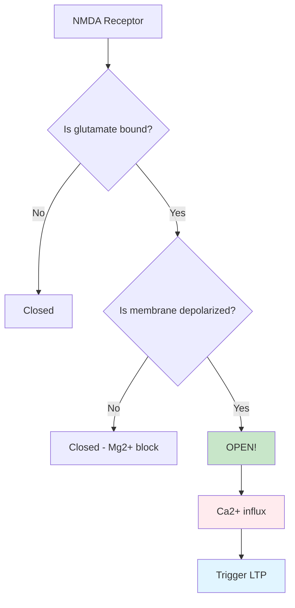

# Cellular and Molecular Bases of Learning and Memory

## Overview

We've explored memory from the perspective of brain regions and systems—the "geography" of memory. But how do neurons actually change to create lasting memories? What happens at the level of individual cells and molecules when you learn something new?

The answer lies in one of neuroscience's most profound discoveries: memories are the physical traces left by experience in the patterns of synaptic connections between neurons. Learning literally rewires your brain, strengthening some connections and weakening others.

> 📖 **Reference**: Unit-3, Pages 41-42

## Hebb's Law: The Foundation of Learning

### Donald Hebb's Revolutionary Insight

In 1949, Canadian psychologist **Donald Hebb** proposed what would become neuroscience's most influential learning principle:

> **"Cells that fire together, wire together"**

**Hebb's Original Formulation**:
"When an axon of cell A is near enough to excite cell B and repeatedly or persistently takes part in firing it, some growth process or metabolic change takes place in one or both cells such that A's efficiency, as one of the cells firing B, is increased."

### What Hebb's Law Means

**In Simple Terms**:
1. Neuron A sends a signal to Neuron B
2. Neuron B fires as a result
3. This happens repeatedly
4. The connection from A to B gets **stronger**
5. Future signals from A more easily activate B

**The Mechanism**:
- Timing matters: Pre- and post-synaptic activity must be correlated
- Repetition matters: Single occurrences produce weak changes
- Specificity matters: Only active synapses are strengthened

## Long-Term Potentiation (LTP): Hebb's Law in Action

### The Discovery

In 1973, **Terje Lømo and Tim Bliss** discovered a remarkable phenomenon in rabbit hippocampus:

**The Experiment**:
1. Stimulate a pathway to hippocampal neurons
2. Measure response strength
3. Apply intense, high-frequency stimulation
4. Measure response again

**The Result**: Synaptic responses were **dramatically strengthened** and remained strong for hours, days, or weeks!

### What is Long-Term Potentiation?

**Definition**: LTP is a long-lasting enhancement in signal transmission between two neurons that results from their simultaneous stimulation.

**Key Characteristics**:
- **Input-specific**: Only stimulated synapses are strengthened
- **Associative**: Weak and strong inputs can cooperate
- **Long-lasting**: Can persist for weeks or even months
- **Rapid onset**: Begins within seconds to minutes

### The Two Phases of LTP

**Early LTP (E-LTP)**: 
- Duration: 1-3 hours
- Mechanism: Modification of existing proteins
- No protein synthesis required
- Relatively fragile

**Late LTP (L-LTP)**:
- Duration: Hours to weeks
- Mechanism: New protein synthesis
- Structural changes in synapses
- More stable and permanent

**Practical Implication**: This parallels short-term vs. long-term memory formation!

## The NMDA Receptor: A Molecular Learning Machine

### The Coincidence Detector

The **NMDA receptor** is perhaps nature's most elegant solution to implementing Hebb's law at the molecular level. It's a "doubly-gated" receptor that requires **two conditions** to open:

**Condition 1**: Glutamate (neurotransmitter) must bind
- Released by presynaptic neuron
- Indicates "input arriving"

**Condition 2**: Postsynaptic membrane must be depolarized
- Removes magnesium block
- Indicates "postsynaptic neuron is active"

**Result**: Channel opens ONLY when pre- and post-synaptic neurons are active together—perfect for Hebbian learning!



### The Magnesium Block: Nature's AND Gate

**How It Works**:

**At Rest** (negative membrane potential):
- Mg²⁺ ion sits in NMDA receptor channel
- Blocks calcium entry even if glutamate binds
- Receptor is inactive

**During Depolarization** (positive membrane potential):
- Electrical repulsion pushes Mg²⁺ out
- Channel opens if glutamate is also bound
- Ca²⁺ flows into cell
- Triggers molecular cascade for LTP

**Why This Is Brilliant**:
- Acts as molecular "AND" gate
- Ensures both neurons are active
- Implements Hebb's law automatically
- No need for complex computation

### Glutamate Receptors: NMDA vs. Non-NMDA

| Feature | NMDA Receptors | Non-NMDA Receptors (AMPA) |
|---------|----------------|---------------------------|
| **Normal transmission** | Minor role | Major role |
| **Voltage-dependent** | Yes (Mg²⁺ block) | No |
| **Ca²⁺ permeability** | High | Low/None |
| **Role in LTP** | Induction | Expression |
| **Speed** | Slow | Fast |

**Division of Labor**:
- **AMPA receptors**: Handle routine synaptic transmission
- **NMDA receptors**: Detect learning opportunities and trigger plasticity

## Blocking LTP Blocks Learning

### The Critical Test

If LTP is really the mechanism for memory, then blocking it should prevent learning. Multiple experiments confirm this:

**Pharmacological Blockade**:
- **AP5 (2-amino-5-phosphonopentanoate)**: Blocks NMDA receptors
- **Effect**: Prevents LTP induction in hippocampus
- **Behavioral result**: Impairs spatial learning in mice

**Genetic Manipulations**:
- Knock out NMDA receptor genes in specific regions
- Result: Spatial memory deficits matching LTP impairment
- Normal synaptic transmission preserved

**Key Finding**: Blocking LTP specifically disrupts **new** learning while leaving established memories intact—just like hippocampal damage!

## The Molecular Cascade: From Calcium to Memory

### Immediate Signaling (Seconds to Minutes)

**Step 1: Calcium Entry**
- NMDA receptors open
- Ca²⁺ floods into postsynaptic neuron
- Acts as "second messenger"

**Step 2: Kinase Activation**
- Ca²⁺ activates multiple protein kinases:
  - **CaMKII** (calcium/calmodulin-dependent protein kinase II)
  - **PKC** (protein kinase C)
  - **PKA** (protein kinase A)

**Step 3: Receptor Modifications**
- Kinases phosphorylate AMPA receptors
- More AMPA receptors inserted into membrane
- Existing AMPA receptors become more effective
- **Result**: Stronger synaptic responses

### Gene Expression and Structural Changes (Hours to Days)

**Step 4: Gene Transcription**
- Kinases activate transcription factors (CREB, c-fos)
- New genes turned on
- Production of new proteins

**Step 5: Protein Synthesis**
- New proteins made in cell body
- Transported to active synapses
- Required for late LTP

**Step 6: Structural Remodeling**
- Growth of new dendritic spines
- Enlargement of existing spines
- Changes in presynaptic terminals
- Formation of new synaptic contacts

## Clinical and Practical Implications

### Memory Enhancement Strategies

**Based on LTP Mechanisms**:

1. **Optimize NMDA function**
   - Adequate magnesium levels
   - B-vitamins for neurotransmitter synthesis
   - Regular exercise (increases BDNF)

2. **Support protein synthesis**
   - Adequate sleep (when consolidation occurs)
   - Proper nutrition
   - Avoid alcohol (impairs protein synthesis)

3. **Enhance synaptic activity**
   - Active learning vs. passive
   - Spaced repetition
   - Testing effect

### Drug Development Targets

**Potential Memory Therapeutics**:
- NMDA receptor modulators
- AMPA receptor positive allosteric modulators
- Kinase enhancers
- CREB activation
- BDNF mimetics

## Study Resources

### 🎥 Videos

- [MIT OpenCourseWare: Synaptic Plasticity and Memory](https://www.youtube.com/watch?v=7j_8O3l0CRs) - Detailed LTP mechanisms
- [Crash Course: Neurons and Synapses](https://www.youtube.com/watch?v=ob5U8zPbAX4) - Foundation concepts
- [HHMI Biointeractive: Synaptic Plasticity](https://www.youtube.com/watch?v=SuGhrxljuxw) - Visual explanations

### 📚 Additional Reading

- [Wikipedia: Long-term potentiation](https://en.wikipedia.org/wiki/Long-term_potentiation)
- [Wikipedia: NMDA receptor](https://en.wikipedia.org/wiki/NMDA_receptor)
- [Wikipedia: Synaptic plasticity](https://en.wikipedia.org/wiki/Synaptic_plasticity)
- [Nature Reviews Neuroscience: Molecular mechanisms of LTP (2024)](https://www.nature.com/articles/s41583-024-00789-w)
- [Cell: Memory consolidation at the molecular level (2023)](https://www.cell.com/cell/fulltext/S0092-8674(23)01234-5)

### 🧠 Memory Aids

**Mnemonic for LTP Requirements**: **"FRED"**
- **F**requency (high-frequency stimulation)
- **R**epetition (repeated activation)
- **E**xcitation (strong enough signal)
- **D**epolarization (postsynaptic activity)

**NMDA Receptor Requirements**: **"Double G-D"**
- **G**lutamate bound
- **D**epolarization present
- Both needed to open (doubly-gated)

**Memory for Molecular Cascade**:
```
Ca²⁺ → Kinases → AMPA changes → Gene expression → Protein synthesis → Structural changes
(Seconds) (Minutes) (Hours) (Days) (Weeks+)
```

## 🎯 Self-Assessment

1. **Concept Integration**: Explain how Hebb's law, NMDA receptors, and LTP all relate to each other.

2. **Application**: Why does blocking protein synthesis prevent long-term memory but not short-term memory?

3. **Critical Analysis**: If LTP is the mechanism for memory, why do some memories last a lifetime when individual molecules only last weeks?

4. **Real-World Connection**: How might understanding LTP help develop treatments for Alzheimer's disease?

## Summary

Key takeaways about cellular mechanisms of memory:

- **Hebb's law** provides the framework: "cells that fire together, wire together"
- **Long-term potentiation (LTP)** is the leading cellular mechanism for memory
- **NMDA receptors** act as molecular coincidence detectors, implementing Hebbian learning
- **Blocking LTP prevents learning**, providing strong evidence for its role in memory
- **Early LTP** involves modification of existing proteins while **late LTP** requires new protein synthesis
- **Molecular cascades** create lasting synaptic changes from calcium entry through gene expression

Understanding memory at the cellular and molecular level reveals that learning literally changes the physical structure of your brain. Each experience you remember has left its trace in strengthened synapses, modified proteins, and altered neural circuits.

---

**Source PDFs**: 
- 📄 [Block-1/Unit-3.pdf - Pages 41-42](/pdfs/MPC-001%20Cognitive%20Psychology,%20Learning%20and%20Memory/Block-1/Unit-3.pdf)
- 📚 MPC-001 Cognitive Psychology, Learning and Memory
