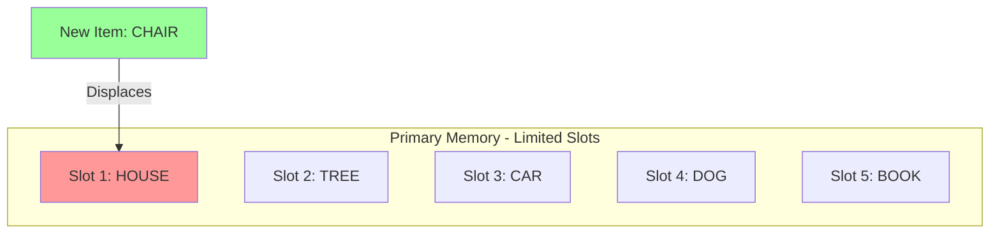
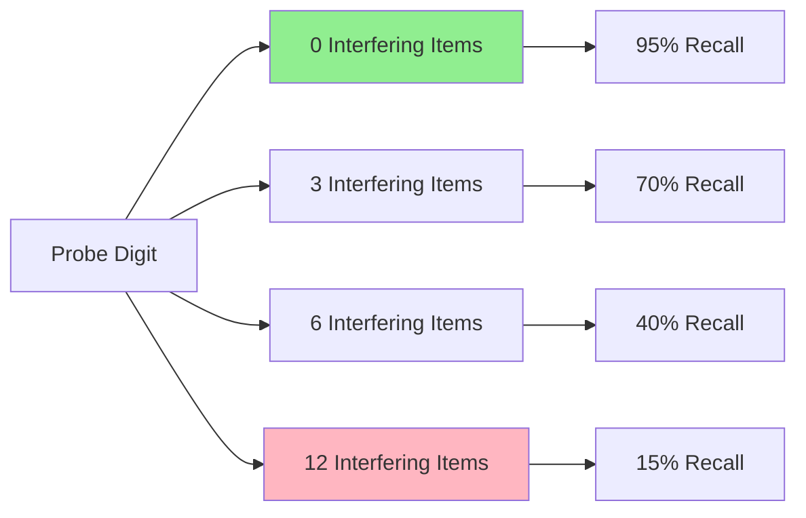

# Waugh and Norman's Dual Memory Model

## Introduction: A Foundational Model of Memory

In 1965, Nancy Waugh and Donald Norman published one of the most influential papers in cognitive psychology, introducing a formal dual-store model of human memory. Their work represented the first modern attempt to quantify the properties of short-term memory and laid the groundwork for virtually all contemporary theories of memory architecture.

Building on William James's 1890 philosophical distinction between "primary" and "secondary" memory, Waugh and Norman transformed these abstract concepts into testable scientific constructs. Their model introduced the now-familiar "boxes in the head" metaphor that would proliferate throughout cognitive psychology literature.

:::tip Key Innovation
What set Waugh and Norman apart from earlier theorists was their systematic attempt to **quantify** the properties of primary memory through rigorous experimentation, rather than relying solely on introspection or philosophical speculation.
:::

## The Dual-Store Architecture

### Primary Memory (PM)

Primary memory in Waugh and Norman's model serves as a limited-capacity, short-term storage system for verbal information. Think of it as a temporary holding area where information waits to be either transferred to more permanent storage or lost forever.

**Key Characteristics:**
- **Very limited capacity** - Can hold only a small number of items simultaneously
- **Verbal storage** - Primarily handles linguistic information
- **Verbatim recall** - Information is available for exact reproduction
- **Immediate accessibility** - No search process required
- **Rapid loss** - Information is quickly displaced by new items

**Real-World Example:** When someone tells you their phone number, you can repeat it back immediately with perfect accuracy. This verbatim recall demonstrates primary memory in action - the information is temporarily held in PM, available for immediate retrieval.

### Secondary Memory (SM)

Secondary memory represents a more permanent, long-term storage system with vastly greater capacity than primary memory.

**Key Characteristics:**
- **Large capacity** - Can store enormous amounts of information
- **Stable storage** - Information persists over extended periods
- **Requires rehearsal** - Transfer from PM typically requires active processing
- **Reconstructive recall** - May not preserve exact wording
- **Slower access** - Requires search and retrieval processes

## The Displacement Mechanism

One of Waugh and Norman's most important contributions was their theory of how information is lost from primary memory. Rather than simply fading away over time (decay), they proposed that old items are **displaced** by new ones once PM's limited capacity is exceeded.

:::info Displacement vs. Decay
This distinction is crucial: 
- **Decay theory** suggests memories fade passively over time
- **Displacement theory** proposes memories are actively pushed out by new information
:::

### The Vertical File Metaphor

Waugh and Norman conceptualized primary memory as similar to a vertical file cabinet with a fixed number of slots. When all slots are filled, new information must displace old information to enter storage. Once displaced, the old information is permanently lost from primary memory (though it may have been transferred to secondary memory through rehearsal).

## The Classic Experiment: Probe Digit Task

Waugh and Norman designed an elegant experiment to test whether forgetting in primary memory resulted from decay (time-based) or interference (item-based).

### Experimental Design

**Procedure:**
1. Participants heard lists of 16 digits
2. Presentation rate varied: either 1 digit per second OR 4 digits per second
3. After the list, a "probe digit" was presented
4. Participants had to recall the digit that followed the probe in the original sequence

**Critical Logic:**
- If **decay** causes forgetting → slower presentation should produce worse recall (more time for memories to fade)
- If **interference** causes forgetting → presentation rate shouldn't matter (same number of interfering items at both rates)

### Results

The data strongly supported the interference hypothesis:

| Presentation Rate | Items Between Probe and Recall | Recall Accuracy |
|------------------|-------------------------------|-----------------|
| 1 per second | Few interfering items | High |
| 1 per second | Many interfering items | Low |
| 4 per second | Few interfering items | High |
| 4 per second | Many interfering items | Low |

**Key Finding:** Recall accuracy depended primarily on the **number of intervening items**, not on the **time elapsed**. This demonstrated that interference, not decay, was the primary cause of forgetting in primary memory.

## The Role of Rehearsal

Waugh and Norman proposed that **rehearsal** serves as the critical mechanism for transferring information from primary to secondary memory. This concept has had profound implications for understanding memory and learning.

### Two Functions of Rehearsal

1. **Maintaining items in PM** - Repetition keeps information active in primary memory, preventing displacement
2. **Transferring to SM** - Repeated processing increases the probability of long-term storage

**Important Insight:** The same sentence you barely attended to moments ago can be recalled verbatim through PM, but recalling it hours later requires that you rehearsed it sufficiently to transfer it to SM.

## Modern Replication and Validation

Recent research has validated and extended Waugh and Norman's findings. A [2020 replication study](https://www.researchgate.net/publication/340741732_A_Replication_of_Waugh_and_Norman_1965_Primary_Memory_study) using larger sample sizes (addressing the original study's limitation of only 4 participants) confirmed the core findings:

:::note 2020 Replication Results
- Participants were more likely to recall digits followed by fewer interfering items
- Findings support interference theory over decay theory
- Suggests interference and decay may interact in complex ways
- Highlights importance of replication in psychological science
:::

The replication also raised important questions about the **interaction** between decay and interference, suggesting that the debate may not be as simple as choosing one mechanism over the other.

## Contemporary Perspective: Decay vs. Interference

While Waugh and Norman's work strongly supported interference, modern cognitive neuroscience recognizes that both mechanisms likely contribute to forgetting, though **interference plays a much larger role in short-term memory**.

### Current Evidence (2024)

Recent studies using neuroimaging and computational modeling suggest:

1. **Interference dominates in STM** - The vast majority of short-term forgetting results from interference between similar items
2. **Small time-based effects exist** - Very small decay effects can be detected, but they're overshadowed by interference
3. **Neural basis** - [fMRI studies](https://www.ncbi.nlm.nih.gov/pmc/articles/PMC3980403/) show decreased activation in posterior brain regions during longer delays, providing some neural evidence for decay
4. **Context matters** - The relative contribution of decay vs. interference depends on the specific memory task and materials

### Types of Interference

Modern research distinguishes between:

- **Proactive interference** - Old memories interfere with new learning
- **Retroactive interference** - New learning interferes with old memories
- **Output interference** - The act of retrieving some items interferes with retrieving others

## Practical Applications

Understanding Waugh and Norman's model has important real-world implications:

### Educational Settings

**Strategy: Minimize Interference**
- Space out learning of similar material
- Use distinctive encoding for easily confused items
- Reduce cognitive load by presenting information in smaller chunks
- Allow time for rehearsal before introducing new material

### Clinical Applications

**Assessment of Memory Deficits**
- The probe digit task and similar measures help identify specific memory impairments
- Distinguishing PM from SM dysfunction aids in diagnosis
- Understanding displacement helps explain why some patients lose recent memories first

### Everyday Memory

**Improving Daily Recall**
- Rehearse important information (phone numbers, directions) immediately
- Write things down before your PM slots fill up
- Recognize that your working memory has real, physical limitations
- Use external aids (phones, notes) to offload PM demands

## Limitations and Criticisms

Despite its influence, Waugh and Norman's model has important limitations:

1. **Oversimplification** - The model treats PM as a unitary system, when we now know it's more complex
2. **Verbal focus** - Limited discussion of visual or spatial memory
3. **Serial processing assumption** - Assumes sequential, stage-like processing that may not reflect reality
4. **Box metaphor** - The "boxes in the head" metaphor, while useful, is overly mechanical

## Historical Impact and Legacy

Waugh and Norman's 1965 paper fundamentally shaped how cognitive psychologists think about memory:

### Direct Influences
- Inspired Atkinson and Shiffrin's influential three-stage model (1968)
- Established experimental paradigms still used today
- Introduced quantitative approach to memory research
- Popularized the dual-store concept in cognitive psychology

### Conceptual Shifts
- Moved memory research from philosophy to experimental science
- Established interference as the dominant explanation for STM forgetting
- Demonstrated value of formal modeling in cognitive psychology
- Set standards for rigorous experimental design in memory research

---

## Self-Assessment Questions

1. **Conceptual Understanding**  
   Explain why Waugh and Norman's model predicted that presentation rate wouldn't affect recall if interference (rather than decay) causes forgetting in primary memory.

2. **Experimental Design**  
   Design a modified version of the probe digit task that could test whether visual information (not just verbal) follows the same displacement principles.

3. **Real-World Application**  
   A student is trying to memorize vocabulary for three different language classes. Using Waugh and Norman's principles, explain why this might be particularly difficult and suggest strategies to improve retention.

4. **Critical Thinking**  
   Why might Waugh and Norman's original study with only 4 participants still be considered scientifically valuable despite this limitation?

## Memory Aids

### **"DIPS" Mnemonic for Primary Memory**
- **D**isplacement (not decay) causes forgetting
- **I**nterference from new items
- **P**rimary memory = short-term
- **S**mall capacity, needs rehearsal

### Visual Metaphor
Think of primary memory as a busy restaurant hostess's notepad - she can remember a few names at a time, but once her list fills up, new arrivals push old names off the bottom of the page. The names don't fade away; they get actively displaced.

---

## Further Reading

### Foundational Papers
- [Waugh, N. C., & Norman, D. A. (1965). Primary memory. Psychological Review, 72(2), 89-104](https://psycnet.apa.org/record/1965-09429-001)
- [Norman, D. A. (1966). Acquisition and retention in short-term memory. Journal of Experimental Psychology, 72(3), 369-381](https://psycnet.apa.org/record/1966-12492-001)

### Modern Perspectives
- [Interference Theory - Wikipedia](https://en.wikipedia.org/wiki/Interference_theory) - Comprehensive overview of interference in memory
- [2024 Review: Interference Theory of Forgetting](https://www.longdom.org/open-access/interference-theory-of-forgetting-and-its-impact-on-memory-1101397.html) - Recent perspectives on interference effects

### Educational Resources
- [MIT OpenCourseWare: Memory I - Short Term Memory](https://ocw.mit.edu/courses/9-00sc-introduction-to-psychology-fall-2011/resources/short-term-memory/) - Prof. John Gabrieli's lecture on memory systems
- [Khan Academy: Decay and Interference](https://www.khanacademy.org/science/health-and-medicine/executive-systems-of-the-brain/memory-lesson/v/decay-and-interference) - Video explanation of forgetting mechanisms

### Recent Research
- [Neath, I., & Brown, G. D. (2012). Arguments against memory trace decay. Frontiers in Psychology](https://www.ncbi.nlm.nih.gov/pmc/articles/PMC3278777/) - Contemporary analysis of the decay debate
- [Jonides et al. (2008). In Search of Decay in Verbal Short-Term Memory](https://pmc.ncbi.nlm.nih.gov/articles/PMC3980403/) - Neural evidence for time-based effects

---

**Source PDF**: 
- 📄 [Block-1/Unit-4.pdf - Pages 44-46](/pdfs/MPC-001%20Cognitive%20Psychology,%20Learning%20and%20Memory/Block-1/Unit-4.pdf)
- 📚 MPC-001 Cognitive Psychology, Learning and Memory