# Atkinson-Shiffrin Three-Stage Model of Memory

## Introduction: The Modal Model That Changed Psychology

In 1968, Richard Atkinson and Richard Shiffrin published one of the most influential papers in the history of cognitive psychology: "Human Memory: A Proposed System and its Control Processes." Their **multi-store model** (also known as the **modal model** or **stage theory model**) revolutionized how psychologists understood memory by proposing that human memory consists of three distinct, sequential storage systems.

This model emerged during the cognitive revolution—a period when psychology was shifting away from behaviorism's focus on observable behavior toward understanding internal mental processes. Atkinson and Shiffrin synthesized decades of experimental findings into a coherent theoretical framework that remains foundational to memory research today.

:::tip Why "Modal" Model?
The term "modal model" reflects that this became the standard or default (mode) way psychologists conceptualized memory structure throughout the 1970s and 1980s.
:::

## The Three-Stage Architecture

### Stage 1: Sensory Memory (SM)

Sensory memory serves as the initial entry point for **all environmental information** captured by your five senses. Think of it as a vast but fleeting buffer that briefly holds raw sensory data before it either moves forward or disappears forever.

**Key Characteristics:**
- **Modality-specific stores** - Separate registers for each sense:
  - **Iconic memory** (visual) - lasts ~0.5 seconds
  - **Echoic memory** (auditory) - lasts ~2-4 seconds
  - Haptic, gustatory, olfactory (touch, taste, smell) - briefer still
- **Enormous capacity** - Can hold vast amounts of sensory information simultaneously
- **Very brief duration** - Information decays rapidly within milliseconds to seconds
- **Automatic encoding** - No conscious effort required; operates automatically
- **Pre-attentive** - Exists before conscious awareness or attention

**Real-World Example:** When someone reads you a phone number, the sounds linger in your echoic memory for a few seconds—just long enough for you to start writing it down. If you're distracted even briefly, that auditory trace vanishes completely.

:::info Sperling's Iconic Memory Experiment (1960)
George Sperling's classic study demonstrated that iconic memory has much greater capacity than we can consciously report. When shown a grid of letters for just 50 milliseconds, people could only report 4-5 letters. However, when cued to report a specific row immediately after presentation, participants demonstrated they had briefly stored ALL the letters—proving the capacity of sensory memory far exceeds what reaches conscious awareness.
:::

### Stage 2: Short-Term Memory (STM) / Working Memory

Short-term memory is where active, conscious processing occurs. This is the "work space" of cognition—where you hold and manipulate information you're currently thinking about.

**Key Characteristics:**
- **Limited capacity** - Can hold approximately **7±2 items** (Miller's magic number)
- **Brief duration** - Information lasts ~15-30 seconds without rehearsal
- **Active processing** - Requires conscious attention and effort
- **Primarily acoustic encoding** - Verbal information typically stored as sounds
- **Subject to interference** - New information can displace old information
- **Rehearsal extends duration** - Repetition keeps information active

**Types of Rehearsal:**

1. **Maintenance Rehearsal** - Simple repetition (e.g., repeating a phone number)
   - Keeps information in STM temporarily
   - Minimal transfer to LTM
   - Shallow processing

2. **Elaborative Rehearsal** - Meaningful processing (e.g., creating associations, using imagery)
   - More effective for LTM transfer
   - Deeper processing
   - Creates richer memory traces

**Capacity: The 7±2 Rule**

George Miller's (1956) research established that STM can hold about 5-9 discrete items, with 7 being average. This explains why phone numbers without area codes are 7 digits—within STM capacity. However, **chunking** can expand functional capacity by grouping items:

- Individual letters: C-I-A-F-B-I-I-R-S (9 items - difficult!)
- Chunked: CIA-FBI-IRS (3 items - easy!)

```mermaid
graph TB
    subgraph "Short-Term Memory Capacity"
        A[Individual Items: 7±2]
        B[Chunked Items: More Information]
        A --> C[Example: 8-0-5-3-9-4-2-7-6]
        B --> D[Example: 805-394-276<br/>3 chunks]
    end
    style A fill:#FFE4B5
    style B fill:#98FB98
```

**From STM to Working Memory: Baddeley's Refinement**

In 1974, Alan Baddeley and Graham Hitch challenged the simple "box" view of STM, proposing instead a complex **working memory** system with multiple components:

1. **Central Executive** - Attentional control system; coordinates other components
2. **Phonological Loop** - Holds verbal/acoustic information
3. **Visuospatial Sketchpad** - Maintains visual and spatial information
4. **Episodic Buffer** (added 2000) - Integrates information from different sources into coherent episodes

This working memory model has largely superseded the original STM concept in contemporary research.

### Stage 3: Long-Term Memory (LTM)

Long-term memory represents our permanent knowledge store—everything we know and remember beyond the immediate present.

**Key Characteristics:**
- **Unlimited capacity** - No known upper limit on storage
- **Extended duration** - Can store information for years or lifetime
- **Semantic encoding** - Primarily stores meaning rather than exact wording
- **Requires retrieval** - Information must be brought back into STM/working memory to be used
- **Resistant to interference** - More stable than STM once consolidated
- **Subject to forgetting** - Through retrieval failure, not necessarily trace decay

**Organization of Long-Term Memory**

LTM is not a single unified system but comprises distinct subsystems:

#### Declarative Memory (Explicit) - "Knowing That"
Memory for facts and events that can be consciously recalled and verbally described.

**1. Episodic Memory**
- Personal experiences and specific events
- Context-dependent (time and place)
- Autobiographical nature
- Examples: Your first day of college, what you had for breakfast yesterday

**2. Semantic Memory**
- General knowledge and facts
- Context-independent
- Conceptual understanding
- Examples: The capital of France, mathematical principles, vocabulary

#### Non-Declarative Memory (Implicit) - "Knowing How"
Memory expressed through performance rather than conscious recollection.

**3. Procedural Memory**
- Motor skills and habits
- Automatic execution
- Examples: Riding a bicycle, typing, tying shoes

**4. Other Implicit Forms**
- Priming effects
- Classical conditioning
- Perceptual learning

## Information Flow and Control Processes

### Attention: The Gateway to STM

**Attention** determines which sensory information enters STM. Without attention, sensory information simply decays and is lost. This explains the "cocktail party effect"—your ability to suddenly notice your name mentioned across a crowded room, even when you weren't consciously listening.

**Research Finding:** Studies show that approximately 90% of sensory information never reaches STM because we don't attend to it. Only about 10% receives enough attention to enter conscious processing.

### Rehearsal: The Path to LTM

Atkinson and Shiffrin proposed that information is transferred from STM to LTM primarily through **rehearsal**—the process of repeatedly attending to information while it's in STM.

**Key Principles:**
- More rehearsal → Stronger memory trace in LTM
- Elaborative rehearsal more effective than maintenance rehearsal
- Distributed practice (spaced repetition) superior to massed practice
- Meaningful organization enhances transfer

:::warning Critical Revision
Later research by Craik and Lockhart (1972) challenged the rehearsal-based transfer mechanism, showing that **depth of processing** matters more than amount of rehearsal. Simply repeating information (maintenance rehearsal) has minimal effect on LTM; what matters is how meaningfully you process it (elaborative rehearsal).
:::

### Retrieval: Accessing LTM

Information doesn't automatically flow from LTM back into consciousness. Instead, it must be actively **retrieved**—brought from LTM back into working memory where it can be used.

**Retrieval Processes:**
- **Recognition** - Identifying previously encountered information (easier)
- **Recall** - Reproducing information from memory (harder)
- **Relearning** - Learning information again (faster than initial learning)

**Retrieval Failure:** Forgetting from LTM often results not from lost information but from **retrieval failure**—the inability to access information that's actually still stored. The "tip-of-the-tongue" phenomenon demonstrates this vividly.

## Evidence Supporting the Model

### Serial Position Effect

One of the most powerful pieces of evidence for the three-stage model comes from **free recall** experiments where people try to remember a list of words in any order.

**The Pattern:**
- **Primacy effect** - Better recall of first items (transferred to LTM through rehearsal)
- **Recency effect** - Better recall of last items (still in STM)
- **Middle items** - Poorest recall (displaced from STM before LTM transfer)

**Critical Test:** When a 30-second delay is introduced before recall, the recency effect disappears (STM contents decay), but the primacy effect remains (information already in LTM persists).

### Neuropsychological Evidence

Patients with different types of brain damage show dissociations consistent with separate memory systems:

**Patient H.M. (1953)**
- Bilateral removal of hippocampus
- Severe anterograde amnesia (couldn't form new LTM)
- Normal STM capacity (could hold ~7 items)
- Intact procedural memory
- **Interpretation:** Hippocampus critical for STM→LTM transfer

**Patients with STM Deficits**
- Some stroke patients show impaired digit span (~2-3 items) 
- Relatively normal LTM function
- **Interpretation:** STM and LTM are dissociable systems

## Limitations and Criticisms

Despite its influence, the Atkinson-Shiffrin model has important limitations:

### 1. Oversimplification of Memory Structure

**Criticism:** Memory is more complex than three sequential boxes.

**Evidence:**
- STM is now understood as multi-component working memory
- LTM comprises multiple distinct systems
- Information can enter LTM without passing through STM (e.g., implicit learning)

### 2. Rehearsal Assumption

**Criticism:** Rehearsal is neither necessary nor sufficient for LTM formation.

**Evidence:**
- Craik & Lockhart's levels-of-processing framework showed depth matters more than repetition
- Many things enter LTM without deliberate rehearsal
- Simple repetition often produces weak LTM traces

### 3. Passive Storage Metaphor

**Criticism:** The "boxes" metaphor implies passive storage rather than active processing.

**Evidence:**
- Working memory research emphasizes active manipulation, not just storage
- LTM involves constructive processes, not passive recording
- Memory is better understood through processing operations than storage locations

### 4. Unidirectional Flow

**Criticism:** Information doesn't always flow sequentially from SM → STM → LTM.

**Evidence:**
- LTM knowledge affects what enters STM (top-down processing)
- Some information bypasses STM (implicit learning)
- Retrieval brings LTM back to STM

## Contemporary Relevance and Legacy

Despite its limitations, the Atkinson-Shiffrin model remains profoundly influential:

### Enduring Contributions

1. **Established multi-store framework** - Foundation for all subsequent memory models
2. **Inspired decades of research** - Sparked countless studies testing and refining the model
3. **Clinical applications** - Memory assessments still distinguish STM from LTM function
4. **Educational implications** - Informs teaching strategies about rehearsal and attention

### Modern Extensions

**Working Memory Model (Baddeley & Hitch, 1974)** - Replaced simple STM with complex working memory system

**Multiple Memory Systems** - Recognition of parallel memory systems rather than single LTM

**Connectionist Models** - Neural network approaches that preserve functional distinctions while rejecting box metaphor

:::note 50-Year Anniversary
In 2019, the journal *Memory & Cognition* published a special issue celebrating 50 years of research sparked by Atkinson and Shiffrin's 1968 paper. The model's core insights remain central to cognitive psychology despite significant refinements and extensions.
:::

## Practical Applications

### Educational Strategies

**Based on the Model:**
1. **Capture Attention** - Use novelty, relevance, emotion to move information from SM to STM
2. **Manage Cognitive Load** - Respect the 7±2 limit when presenting information
3. **Encourage Elaborative Rehearsal** - Promote meaningful processing, not rote repetition
4. **Use Chunking** - Group related information to maximize STM capacity
5. **Distribute Practice** - Space repetitions over time to strengthen LTM
6. **Support Retrieval** - Provide cues and practice retrieving information

### Clinical Assessment

Memory clinicians use tasks targeting different stages to identify specific deficits:
- **Digit span** - Assesses STM capacity
- **Delayed recall** - Tests LTM formation
- **Recognition vs. recall** - Distinguishes storage from retrieval problems
- **Serial position curves** - Reveals which memory system is impaired

### Everyday Memory Tips

**Improving Information Retention:**
1. **Pay attention** - Eliminate distractions when encoding important information
2. **Rehearse meaningfully** - Create associations rather than mindlessly repeating
3. **Use multiple codes** - Combine verbal and visual encoding
4. **Test yourself** - Retrieval practice strengthens memory
5. **Space your study** - Distributed practice beats cramming
6. **Sleep** - Consolidation occurs during sleep

---

## Self-Assessment Questions

1. **Conceptual Understanding**  
   Explain why introducing a delay between learning and recall eliminates the recency effect but not the primacy effect. What does this tell us about memory systems?

2. **Application**  
   A student is trying to memorize 20 Spanish vocabulary words. Using the Atkinson-Shiffrin model, design an optimal study strategy explaining how each component would be utilized.

3. **Critical Analysis**  
   The model proposes that all information must pass through STM to reach LTM. Provide evidence both supporting and challenging this claim.

4. **Real-World Connection**  
   Describe a personal experience where you noticed the serial position effect. How might understanding this effect help you in practical situations?

5. **Model Comparison**  
   How does Baddeley's working memory model improve upon the original conception of short-term memory in the Atkinson-Shiffrin framework?

## Memory Aids

### **"S-S-L" Mnemonic for Memory Stages**
- **S**ensory memory: Snapshot (brief, vast, decays quickly)
- **S**hort-term memory: Scratch pad (limited, active, rehearsable)
- **L**ong-term memory: Library (unlimited, permanent, organized)

### Key Numbers to Remember
- **Sensory memory**: 0.5-2 seconds
- **STM capacity**: 7±2 items
- **STM duration**: 15-30 seconds without rehearsal
- **LTM**: Unlimited capacity, potentially permanent duration

### Visual Metaphor
Think of memory like a restaurant:
- **Sensory memory** = Front window display (you see everything briefly as you pass)
- **Short-term memory** = Dining table (limited seats, current customers, turnover)
- **Long-term memory** = Recipe book (unlimited recipes stored permanently)

---

## Further Reading

### Foundational Papers
- [Atkinson, R. C., & Shiffrin, R. M. (1968). Human memory: A proposed system and its control processes](https://www.semanticscholar.org/paper/Human-memory%3A-A-proposed-system-and-its-control-Atkinson-Shiffrin/21d56e5eca5d84ba6d3f90e96e962a0866e72b6a) - The original paper that started it all
- [Miller, G. A. (1956). The magical number seven, plus or minus two](https://psycnet.apa.org/record/1957-02914-001) - Classic paper on STM capacity

### Modern Reviews
- [Multi-Store Model of Memory - Simply Psychology](https://www.simplypsychology.org/multi-store.html) - Accessible overview with empirical evidence
- [Atkinson-Shiffrin Memory Model - Wikipedia](https://en.wikipedia.org/wiki/Atkinson–Shiffrin_memory_model) - Comprehensive historical and theoretical context

### Working Memory Extensions
- [Baddeley's Model of Working Memory - Wikipedia](https://en.wikipedia.org/wiki/Baddeley's_model_of_working_memory) - How STM evolved into working memory
- [Hitch, G. J., Allen, R. J., & Baddeley, A. D. (2024). The multicomponent model of working memory fifty years on](https://journals.sagepub.com/doi/full/10.1177/17470218241290909) - Recent comprehensive review

### Educational Applications
- [Understanding the Atkinson-Shiffrin Memory Model - Psych Central](https://psychcentral.com/health/atkinson-and-shiffrin-model) - Clinical and practical perspectives
- [Multi-Store Model: Foundation for Learning](https://www.earlyyears.tv/multi-store-model-of-memory/) - Applications to education and child development

### Educational Videos
- [MIT OpenCourseWare: Memory I - Short Term Memory](https://ocw.mit.edu/courses/9-00sc-introduction-to-psychology-fall-2011/resources/short-term-memory/) - Prof. John Gabrieli's lecture on memory systems
- [MIT OpenCourseWare: Memory Discussion](https://ocw.mit.edu/courses/9-00sc-introduction-to-psychology-fall-2011/pages/memory-ii/discussion-memory/) - Interactive discussion of memory concepts

### Academic Resources
- [StatPearls: Explicit Memory Physiology](https://www.ncbi.nlm.nih.gov/books/NBK554551/) - Medical perspective on declarative memory systems
- [Working Memory Research - PubMed](https://pmc.ncbi.nlm.nih.gov/articles/PMC3664921/) - Current neuroscience of memory systems

---

**Source PDF**: 
- 📄 [Block-1/Unit-4.pdf - Pages 46-48](/pdfs/MPC-001%20Cognitive%20Psychology,%20Learning%20and%20Memory/Block-1/Unit-4.pdf)
- 📚 MPC-001 Cognitive Psychology, Learning and Memory