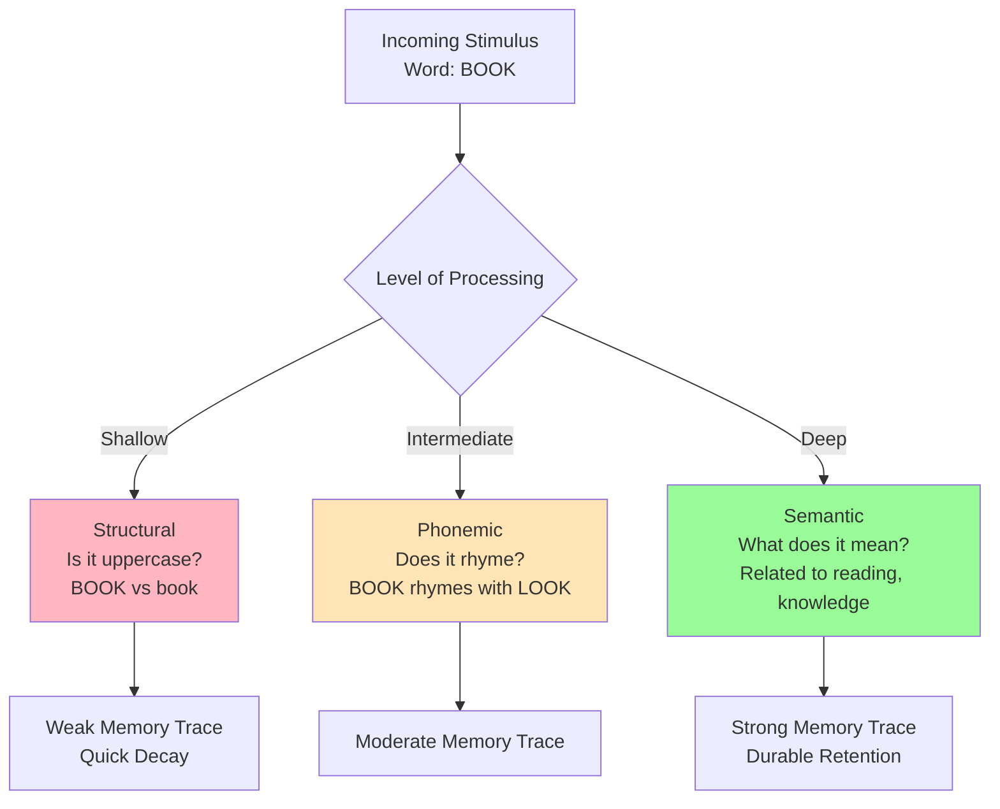
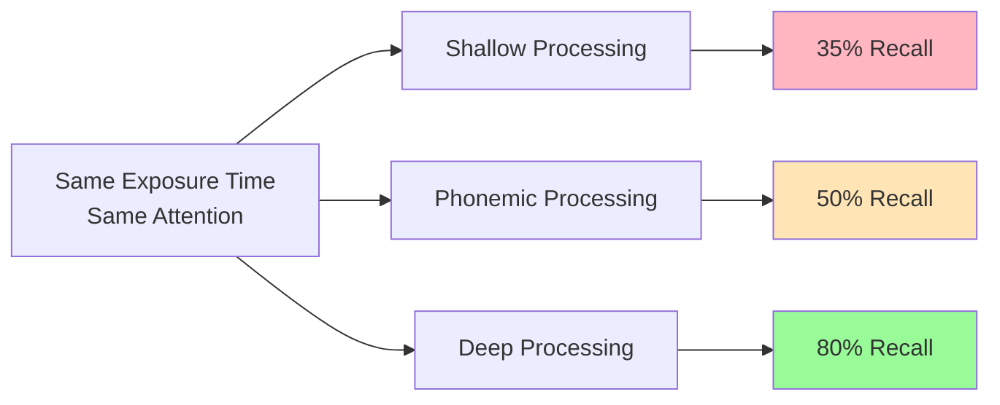

# Levels of Processing Theory: Craik and Lockhart

## Introduction: A Processing Revolution

In 1972, Fergus Craik and Robert Lockhart published a revolutionary paper that fundamentally challenged how psychologists thought about memory. Rather than viewing memory in terms of structural "boxes" (sensory, short-term, long-term), they proposed that **what matters is how deeply you process information**—not which memory store it enters.

Their **levels-of-processing (LOP) framework** shifted the entire field's focus from memory structures to memory processes, arguing that **memory is simply a by-product of perceptual analysis**. The deeper and more meaningful your processing, the more durable your memory trace.

:::tip Paradigm Shift
This was a direct challenge to Atkinson-Shiffrin's stage model. Craik and Lockhart argued: "Don't ask WHERE information is stored—ask HOW DEEPLY it was processed!"
:::

## The Core Principle: Depth Determines Durability

**Central Thesis:** Memory trace strength is determined by the **depth of processing** during encoding, not by which memory system processes it or how long it's rehearsed.

**Key Concepts:**

1. **Shallow Processing** 
   - Surface features: physical characteristics, sounds
   - Structural/phonemic analysis
   - Weak, fragile memory traces
   - Rapid decay

2. **Deep Processing**
   - Semantic analysis: meaning, associations, elaboration
   - Integration with existing knowledge
   - Strong, durable memory traces
   - Enhanced retention

## The Three Levels of Processing

### Level 1: Structural (Visual) Processing
**Focus:** Physical/perceptual features

**Examples:**
- Is this word in UPPERCASE or lowercase?
- What font is this written in?
- How many letters does it contain?

**Memory Outcome:** Poorest retention; superficial trace

**Real-World:** Glancing at a poster—you might remember seeing it but not what it said

### Level 2: Phonemic (Acoustic) Processing
**Focus:** Sound characteristics

**Examples:**
- Does this word rhyme with "cat"?
- How many syllables does it have?
- Does it sound similar to another word?

**Memory Outcome:** Moderate retention; better than structural

**Real-World:** Hearing a song on the radio—you remember the melody but not necessarily the lyrics

### Level 3: Semantic (Meaning-Based) Processing
**Focus:** Meaning, associations, relationships

**Examples:**
- What does this word mean?
- How does it relate to your personal experience?
- Can you use it in a meaningful sentence?

**Memory Outcome:** Best retention; deep, elaborate trace

**Real-World:** Discussing a concept with someone—actively engaging with meaning creates lasting memory

## The Classic Experiments

### Craik and Tulving (1975): The Orientation Task Experiment

**Design:** Participants saw words and answered questions at different processing levels

**Three Conditions:**

1. **Shallow (Structural):** "Is the word in capital letters?"
   - Example: TABLE - "Yes/No"

2. **Intermediate (Phonemic):** "Does the word rhyme with WEIGHT?"
   - Example: CRATE - "Yes/No"

3. **Deep (Semantic):** "Would the word fit in this sentence: 'He met a _______ in the street'?"
   - Example: FRIEND - "Yes/No"

**Results:**

| Processing Level | Recognition Accuracy |
|-----------------|---------------------|
| Structural | ~35% |
| Phonemic | ~50% |
| Semantic | ~80% |

**Key Finding:** Words processed semantically were recalled **more than twice as well** as those processed structurally, despite identical exposure time and attention.

## Why Depth Matters: Elaboration and Distinctiveness

### Elaboration
**Definition:** The extent to which new information is linked to existing knowledge structures

**Mechanism:**
- Creates multiple retrieval pathways
- Builds rich associative networks
- Integrates with semantic memory
- Provides more "hooks" for recall

**Example:** 
- Shallow: "The word 'elephant' has 8 letters"
- Deep: "Elephants are highly intelligent mammals with exceptional memories, living in matriarchal societies—like how my grandmother was the family matriarch"

### Distinctiveness
**Definition:** How unique or different a memory trace is from other traces

**Mechanism:**
- Reduces interference from similar memories
- Creates unique encoding context
- Makes information "stand out"
- Easier to discriminate during retrieval

**Example:**
- Generic: "Photosynthesis converts sunlight to energy"
- Distinctive: "Photosynthesis is like plants having their own solar panels—they're the original green energy!"

## Maintenance vs. Elaborative Rehearsal

**Critical Distinction:** Craik and Lockhart distinguished between two types of rehearsal—revolutionizing our understanding of how repetition affects memory.

### Maintenance Rehearsal (Type I)
- **What:** Simple repetition without elaboration
- **Example:** Repeating a phone number over and over
- **Effect:** Maintains information in STM temporarily
- **LTM Transfer:** Minimal—doesn't create deep processing
- **Why:** No semantic analysis; stays at shallow level

### Elaborative Rehearsal (Type II)
- **What:** Processing meaning and creating associations
- **Example:** Connecting phone number to meaningful dates or patterns
- **Effect:** Creates durable LTM traces
- **LTM Transfer:** Highly effective
- **Why:** Engages semantic processing; creates elaborated trace

:::warning Important Implication
This explained a puzzle in Atkinson-Shiffrin's model: Sometimes items are rehearsed extensively but still not remembered. The answer: **Type of rehearsal matters more than amount!**
:::

## Challenging the "Boxes in the Head"

Craik and Lockhart's framework fundamentally rejected the structural approach:

**Old View (Structural Models):**
- Memory consists of separate stores (SM, STM, LTM)
- Information moves between stores through rehearsal
- Storage location determines retention
- Focus: WHERE is information stored?

**New View (Levels of Processing):**
- Memory is a continuum of processing depth
- No clear boundaries between "stores"
- Encoding operations determine retention
- Focus: HOW is information processed?

**Revolutionary Claims:**
1. STM and LTM may be the same system operating at different depths
2. Rehearsal doesn't automatically transfer to LTM—only deep processing does
3. Memory is a by-product of perception, not a separate system
4. Processing operations matter more than structural locations

## Evidence and Extensions

### Neuroimaging Support (Modern Research)

Recent brain imaging studies (fMRI, PET) have validated depth-of-processing effects:

**Findings:**
- **Shallow processing** activates primarily visual/auditory cortex
- **Deep processing** activates extensive semantic networks including:
  - Left prefrontal cortex (semantic analysis)
  - Left inferior temporal regions (meaning extraction)
  - Hippocampus (memory formation)
  - Broader bilateral activation patterns

**Interpretation:** Deeper processing literally engages more brain regions, creating a richer neural trace

### The Self-Reference Effect

Rogers, Kuiper, and Kirker (1977) extended LOP theory with a powerful discovery:

**The Effect:** Processing information in relation to oneself produces the **deepest level** of processing and **best recall**.

**Experimental Conditions:**

1. **Structural:** "Is this word in capital letters?"
2. **Phonemic:** "Does this word rhyme with ___?"
3. **Semantic:** "Does this word mean the same as ___?"
4. **Self-Reference:** "Does this word describe you?"

**Results:** Self-reference produced even better recall than standard semantic processing!

**Why It Works:**
- Self-concept is extensively elaborated in memory
- Creates highly distinctive, personally relevant encoding
- Activates rich associative network (the "narcissistic trait")
- Emotional engagement enhances consolidation

**Practical Application:** Study material by asking "How does this relate to me?" or "When have I experienced this?"

## Criticisms and Limitations

Despite its influence, LOP theory has faced valid criticisms:

### 1. Circular Reasoning Problem

**Criticism:** The theory seems circular—how do we measure "depth"?

**The Issue:**
- Deep processing = better memory
- Better memory = evidence of deep processing
- How do we independently measure depth?

**Response:** Craik acknowledged this, suggesting depth correlates with:
- Processing time
- Elaboration extent  
- Number of semantic associations
- Brain activation patterns

### 2. Descriptive, Not Explanatory

**Criticism:** The theory describes what happens but doesn't explain **why** deep processing produces better memory.

**Evidence:** Later research showed the mechanisms:
- Elaboration creates multiple retrieval cues
- Distinctiveness reduces interference
- Semantic integration activates broader neural networks

### 3. Exceptions to the Rule

**Problem:** Some findings don't fit the depth hypothesis:

- **Motor Learning:** Repetition (shallow) works better than semantic analysis
- **Perceptual Learning:** Practice with physical features improves retention
- **Implicit Memory:** Shallow processing can produce strong priming effects

**Interpretation:** LOP primarily applies to **explicit verbal memory**, not all memory types

### 4. Transfer-Appropriate Processing

**Challenge:** Retrieval success depends on **match between encoding and retrieval** as much as processing depth.

**Example:**
- Studied words semantically (deep)
- Tested with rhyme recognition (phonemic)
- Performance worse than expected

**Conclusion:** Optimal encoding depends on anticipated retrieval demands

## Educational Applications: The Depth Principle

LOP theory transformed educational practice by highlighting the importance of meaningful processing:

### Effective Study Strategies

**DON'T:**
- ❌ Highlight passively
- ❌ Reread without engagement
- ❌ Copy notes verbatim
- ❌ Cram with rote repetition

**DO:**
- ✅ Generate examples and applications
- ✅ Create concept maps connecting ideas
- ✅ Teach material to someone else
- ✅ Ask yourself "why" and "how" questions
- ✅ Relate concepts to personal experience
- ✅ Create meaningful mnemonic associations

### Classroom Implications

**For Teachers:**
1. Design activities requiring semantic processing
2. Encourage students to elaborate and make connections
3. Use meaningful examples over abstract definitions
4. Promote self-reference through personal application
5. Test understanding, not just recognition

**For Students:**
1. Don't confuse familiarity with understanding
2. Process meaning, not just words
3. Create your own examples
4. Connect new knowledge to what you already know
5. Space practice over time for deeper consolidation

## Legacy and Impact

### Enduring Contributions

1. **Shifted Focus to Processing**
   - From structures to operations
   - From passive storage to active encoding
   - From quantity of rehearsal to quality of processing

2. **Influenced Subsequent Models**
   - Working memory research
   - Constructive memory theories
   - Encoding-retrieval interaction frameworks

3. **Practical Applications**
   - Study skill development
   - Memory training programs
   - Educational curriculum design
   - Clinical memory rehabilitation

### Integration with Modern Theories

Contemporary memory research incorporates LOP insights while addressing limitations:

- **Transfer-Appropriate Processing:** Matches encoding to retrieval demands
- **Encoding Specificity:** Context-dependent memory effects
- **Constructive Processes:** Memory as active reconstruction
- **Neural Network Models:** Distributed activation patterns

:::note 50+ Years Later
Craik himself (2002, 2021) has continued developing LOP theory, addressing criticisms and integrating neuroimaging findings. The core insight—that processing depth matters—remains central to cognitive psychology.
:::

---

## Self-Assessment Questions

1. **Conceptual Understanding**  
   Explain why simply repeating information many times (maintenance rehearsal) often fails to produce strong long-term memory, using the levels-of-processing framework.

2. **Experimental Design**  
   Design an experiment to test whether visual (images) or verbal (words) information benefits more from deep processing. What would your predictions be and why?

3. **Critical Analysis**  
   The levels-of-processing theory has been criticized as circular. Explain this criticism and evaluate whether it fundamentally undermines the theory's value.

4. **Real-World Application**  
   You need to memorize 30 psychology terms for an exam. Using LOP principles, create a study plan that maximizes retention. Justify each strategy.

5. **Theory Integration**  
   How does the self-reference effect extend and enhance the basic levels-of-processing framework? What does it suggest about optimal encoding strategies?

## Memory Aids

### **"SPS" Mnemonic for Levels**
- **S**tructural: Surface features (appearance)
- **P**honemic: Pronunciation (sound)
- **S**emantic: Significance (meaning)

### Depth Ladder
Think of processing as climbing a ladder:
- **Bottom Rung:** What does it LOOK like? (structural)
- **Middle Rung:** What does it SOUND like? (phonemic)  
- **Top Rung:** What does it MEAN? (semantic)
- **Above the Ladder:** What does it mean TO ME? (self-reference)

### **ELABORATION Checklist**
When studying, ask yourself:
- **E**xamples: Can I generate examples?
- **L**inks: How does this connect to what I know?
- **A**nalogies: What is this similar to?
- **B**eliefs: How does this relate to my views?
- **O**pposites: What contradicts or contrasts with this?
- **R**elevance: Why does this matter?
- **A**pplications: How could I use this?
- **T**each: Could I explain this to someone?
- **I**mages: Can I visualize this?
- **O**wn words: Can I paraphrase this?
- **N**eed: Why was this developed?

---

## Further Reading

### Foundational Papers
- [Craik, F. I. M., & Lockhart, R. S. (1972). Levels of processing: A framework for memory research](http://wixtedlab.ucsd.edu/publications/Psych%20218/Craik_Lockhart_1972.pdf) - The original revolutionary paper
- [Craik, F. I. M., & Tulving, E. (1975). Depth of processing and retention of words in episodic memory](https://psycnet.apa.org/record/1976-03421-001) - Key experimental evidence

### Comprehensive Overviews
- [Levels of Processing Theory - Simply Psychology](https://www.simplypsychology.org/levelsofprocessing.html) - Accessible explanation with current research
- [Levels of Processing Model - Wikipedia](https://en.wikipedia.org/wiki/Levels_of_processing_model) - Historical context and extensions

### Modern Perspectives
- [Craik, F. I. M. (2002). Levels of processing: Past, present... and future?](https://www.researchgate.net/publication/11066090_Levels_of_processing_Past_present_and_future) - Craik's retrospective 30 years later
- [Effect of Levels-of-Processing on Forgetting Rates (2024)](https://link.springer.com/article/10.3758/s13421-024-01599-4) - Recent experimental findings

### Self-Reference Effect
- [Rogers, Kuiper, & Kirker (1977) - Self-reference effect research](https://psycnet.apa.org/record/1978-03100-001) - Original demonstration of self-reference superiority

### Educational Applications
- [Levels of Processing Research on EBSCO](https://www.ebsco.com/research-starters/social-sciences-and-humanities/levels-processing) - Educational and practical implications

### Clinical Applications
- [Levels-of-Processing in Schizophrenia - PMC](https://pmc.ncbi.nlm.nih.gov/articles/PMC4332587/) - Clinical assessment using LOP paradigm

---

**Source PDF**: 
- 📄 [Block-1/Unit-4.pdf - Pages 48-51](/pdfs/MPC-001%20Cognitive%20Psychology,%20Learning%20and%20Memory/Block-1/Unit-4.pdf)
- 📚 MPC-001 Cognitive Psychology, Learning and Memory