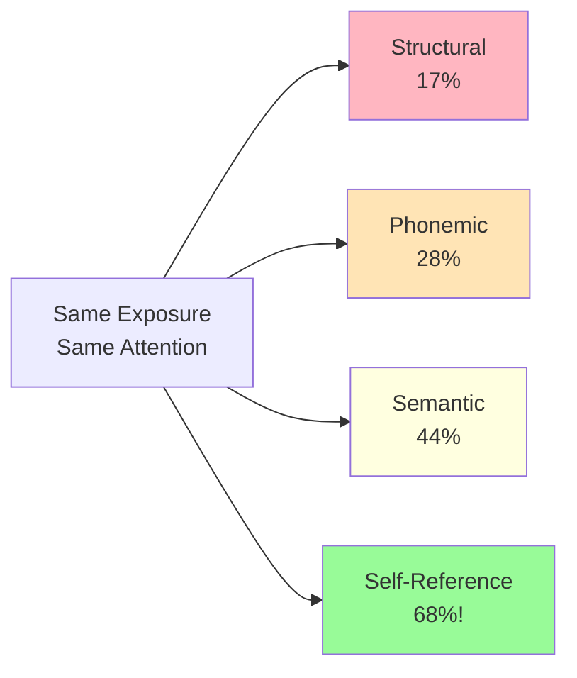

# The Self-Reference Effect in Memory

## Introduction: When "Me" Creates the Best Memory

In 1977, Timothy Rogers, Nicholas Kuiper, and W. S. Kirker published a groundbreaking study that extended Craik and Lockhart's levels-of-processing framework in a surprising direction: **processing information in relation to oneself produces memory superior to any other encoding strategy**.

This discovery—known as the **self-reference effect (SRE)**—demonstrated that the self functions as a powerful organizing schema in memory, creating exceptionally rich and durable memory traces.

:::tip The "Narcissistic Trait"
We might call this the "narcissistic trait" of memory: we remember best what relates to us! This isn't vanity—it's how our cognitive architecture is optimized.
:::

## The Original Experiment

### Research Design

Rogers and colleagues extended the standard levels-of-processing paradigm by adding a fourth, self-relevant condition.

**Four Encoding Tasks:**

1. **Structural:** "Is the word printed in capital letters?"
   - Example: GENEROUS → yes/no

2. **Phonemic:** "Does the word rhyme with CARING?"
   - Example: SHARING → yes/no

3. **Semantic:** "Does the word mean the same as FRIENDLY?"
   - Example: SOCIABLE → yes/no

4. **Self-Reference:** "Does this word describe you?"
   - Example: HONEST → yes/no

**Procedure:**
- Participants rated 40 personality trait adjectives
- One rating per word (between-subjects design for processing level)
- Surprise recall test afterwards (incidental learning)
- Measured both recall accuracy and response time

### Results: Self-Reference Dominates

**Recall Performance:**

| Encoding Task | Recall Accuracy | Processing Time |
|--------------|----------------|----------------|
| Structural | ~17% | Fastest |
| Phonemic | ~28% | Fast |
| Semantic | ~44% | Moderate |
| **Self-Reference** | **~68%** | **Slowest** |

**Critical Findings:**
1. Self-reference produced **40% better recall** than standard semantic processing
2. Self-reference took **longer processing time** (indicating deeper elaboration)
3. Effect was robust across multiple experiments
4. Both "yes" and "no" responses showed the benefit (it's about engaging self-concept, not just positive traits)

## Why Self-Reference Is So Powerful

### The Self as a Superordinate Schema

**Self-Schema:** A rich, complex, well-organized cognitive structure containing:
- Autobiographical memories
- Personality traits and characteristics
- Goals, values, and beliefs
- Emotional associations
- Social roles and relationships
- Extensive interconnections

**Why It Enhances Memory:**

1. **Maximum Elaboration**
   - Self-concept is the most elaborated structure in memory
   - Creates numerous associative links
   - Activates vast networks of related information
   - Provides multiple retrieval pathways

2. **Exceptional Distinctiveness**
   - Personal relevance makes information unique
   - Reduces interference from similar memories
   - Creates context-specific encoding
   - Stands out from generic semantic encoding

3. **Emotional Engagement**
   - Self-relevant information carries emotional weight
   - Emotion enhances consolidation
   - Increases attention and arousal
   - Strengthens memory traces

4. **Organizational Advantage**
   - Self provides ready-made organizational framework
   - Information automatically categorized
   - Coherent structure aids retrieval
   - Natural clustering occurs

### Neural Basis: Distinct Brain Activation

Modern neuroimaging reveals that self-referential processing activates distinct brain regions:

**Key Areas:**
- **Medial prefrontal cortex (mPFC)** - Self-reflection and self-knowledge
- **Posterior cingulate cortex (PCC)** - Autobiographical memory
- **Precuneus** - Self-consciousness and episodic memory
- **Temporal poles** - Personal semantic memory

**Finding:** Self-reference shows greater and more sustained activation in these regions compared to semantic processing, suggesting a qualitatively different encoding process.

## Extensions and Applications

### The Self-Reference Effect Across Ages

**Development:**
- Emerges by age 5-6 years
- Strengthens through childhood
- Robust in young adults
- **Remains strong in older adults** - one of the few encoding advantages preserved with aging!

**Clinical Significance:** The preserved SRE in aging suggests interventions using self-reference could help compensate for memory decline.

### Self-Reference in Education

**Practical Applications:**

1. **Relate Material to Personal Experience**
   - "When have you experienced cognitive dissonance?"
   - "How does this economic principle affect your family?"
   - "What examples from your life illustrate this concept?"

2. **Create Personal Examples**
   - Generate own examples rather than memorizing textbook cases
   - Connect abstract principles to personal situations
   - Use autobiography as memory framework

3. **Self-Testing with Personal Relevance**
   - "How would I use this information?"
   - "Why does this matter to me?"
   - "What would I tell someone about this?"

4. **Journaling and Reflection**
   - Write personal reflections on course material
   - Keep learning journals connecting concepts to life
   - Create personalized study notes

### Self-Reference vs. Other-Reference

**Important Distinction:** The effect specifically depends on **self-relevance**.

**Comparison Studies:**

| Reference Target | Recall Performance |
|-----------------|-------------------|
| Self | 68% |
| Close other (mother) | 55% |
| Familiar other (celebrity) | 48% |
| Semantic processing | 44% |
| Unknown other | 42% |

**Pattern:** The **closer the relationship** to self, the stronger the memory. Intimate others (family members) produce better recall than distant others, but still not as good as direct self-reference.

## Criticisms and Refinements

### Is Self-Reference "Special"?

**Debate:** Is self-reference a unique memory process, or just an extreme form of elaboration?

**Positions:**

1. **Special Mechanism View**
   - Self-schema is qualitatively different
   - Distinct neural activation patterns
   - Unique organizational properties
   - Cannot be reduced to general elaboration

2. **Elaboration View**
   - Self just happens to be most elaborated structure
   - Effect reflects general memory principles
   - Other well-elaborated structures (e.g., expertise domains) show similar benefits
   - No need for special self mechanism

**Current Consensus:** Self-reference likely represents both—it operates through general memory principles (elaboration, organization) but applied to a uniquely rich and well-developed knowledge structure.

### When Self-Reference Doesn't Help

**Limitations:**

1. **Procedural Memory**
   - Self-reference doesn't aid motor skill learning
   - Physical practice matters more than self-relevance

2. **Implicit Memory**
   - Perceptual priming unaffected by self-reference
   - Automatic processes don't benefit

3. **Overload**
   - Too much self-referencing can impair memory for source details
   - May confuse what you thought vs. what you read

4. **Negative Self-Schema**
   - In depression, negative self-referencing can enhance memory for negative information
   - Can maintain negative thought patterns

## Meta-Analysis Findings

Symons and Johnson (1997) analyzed 129 studies of the self-reference effect:

**Overall Effect Size:** d = 0.74 (large effect)

**Key Moderators:**
- Effect stronger for personality traits than concrete nouns
- Larger effects with incidental vs. intentional learning
- Robust across recall and recognition tests
- Maintained with delays up to one week

**Conclusion:** SRE is "robust and powerful"—one of the most reliable findings in memory research.

## Clinical and Applied Implications

### Memory Rehabilitation

**Applications:**
- Encourage patients to relate information to personal experiences
- Use autobiographical context for learning new information
- Leverage preserved self-schema in amnesia patients
- Create personalized memory aids

### Educational Technology

**Design Principles:**
- Adaptive learning systems that incorporate personal interests
- Prompts for personal examples and applications
- Customized practice problems using student's context
- Reflection activities connecting content to self

### Marketing and Persuasion

**Why It Works:**
- Personalized advertising more memorable
- Self-relevant messages better retained
- "What does this mean for you?" framing increases engagement
- Customer-specific examples enhance product memory

---

## Self-Assessment Questions

1. **Conceptual Understanding**  
   Explain why self-reference produces better memory than semantic processing, despite both involving meaning-based encoding.

2. **Research Design**  
   You want to test whether self-reference helps children learn math concepts. Design a study comparing self-referent vs. standard instruction.

3. **Practical Application**  
   You're studying for a biology exam. Describe three specific ways you could use the self-reference effect to improve retention of cell biology concepts.

4. **Critical Analysis**  
   Does the self-reference effect mean self-focused thinking is always beneficial for learning? Discuss potential limitations or situations where it might not help.

5. **Theory Integration**  
   How does the self-reference effect support or challenge Craik and Lockhart's levels-of-processing framework?

## Memory Aids

### **"SELF" Strategy**
- **S**ituate in your life (personal examples)
- **E**laborate with autobiography
- **L**ink to experiences
- **F**rame as self-relevant

### Quick Heuristic
**Before studying anything, ask:** 
- "How does this relate to ME?"
- "When have I experienced this?"
- "Why would I care about this?"

### The Personal Connection Rule
**If you can't relate it to yourself, you probably won't remember it.**

---

## Further Reading

### Foundational Research
- [Rogers, T. B., Kuiper, N. A., & Kirker, W. S. (1977). Self-reference and the encoding of personal information](https://pubmed.ncbi.nlm.nih.gov/909043/) - Original demonstration
- [Symons, C. S., & Johnson, B. T. (1997). The self-reference effect in memory: A meta-analysis](https://psycnet.apa.org/record/1997-06335-002) - Comprehensive review

### Theoretical Perspectives
- [Self-Reference Effect - Wikipedia](https://en.wikipedia.org/wiki/Self-reference_effect) - Historical context and theories
- [Klein, S. B., & Kihlstrom, J. F. (1986). Elaboration, organization, and the self-reference effect](https://psycnet.apa.org/record/1986-20830-001) - Mechanistic analysis

### Clinical Applications
- [Memory for Details with Self-Referencing - PMC](https://pmc.ncbi.nlm.nih.gov/articles/PMC3226761/) - Clinical implications and applications
- [Effects of Ageing on Self-Reference Effect](https://pubmed.ncbi.nlm.nih.gov/22702397/) - Preserved effects in older adults

### Neural Basis
- [Macrae et al. (2004). Medial prefrontal activity predicts memory for self](https://pubmed.ncbi.nlm.nih.gov/15016522/) - Neuroimaging evidence

---

**Source PDF**: 
- 📄 [Block-1/Unit-4.pdf - Pages 51-52](/pdfs/MPC-001%20Cognitive%20Psychology,%20Learning%20and%20Memory/Block-1/Unit-4.pdf)
- 📚 MPC-001 Cognitive Psychology, Learning and Memory