# Connectionist Model of Memory: Rumelhart and McClelland

## Introduction: Rethinking the Architecture of Mind

In 1986, David Rumelhart and James McClelland published their landmark two-volume work *Parallel Distributed Processing: Explorations in the Microstructure of Cognition*, introducing a revolutionary framework that fundamentally challenged how psychologists conceived of mental processes. Their **connectionist model** (also called **Parallel Distributed Processing** or **PDP**) proposed that cognition emerges from the massively parallel interactions of simple processing units—much like neurons in the brain.

This marked a profound shift from the dominant "computer metaphor" of mind (with its serial processing and stored symbols) to a **brain-inspired architecture** where knowledge consists of connection strengths between units distributed throughout a network.

:::tip Why It Matters
The PDP model not only transformed cognitive psychology but also laid the foundation for modern artificial intelligence, particularly deep learning and neural networks that power today's AI systems.
:::

## The Core Metaphor: Not a Computer, But a Brain

### The Problem with Traditional Models

**Traditional Cognitive Models (1960s-1980s):**
- **Serial processing** - one operation at a time
- **Symbolic computation** - manipulating discrete symbols
- **Localized storage** - specific locations for specific memories
- **Rule-based** - explicit algorithms and procedures

**Limitations:**
- Brittle - fails catastrophically with damage or noise
- Slow - sequential bottlenecks
- Doesn't capture brain-like properties (graceful degradation, generalization)
- Struggles with pattern recognition, context effects

### The PDP Alternative

**Connectionist/PDP Principles:**
- **Massively parallel** - thousands of operations simultaneously
- **Distributed representations** - knowledge spread across connections
- **Sub-symbolic** - processing below the level of conscious symbols
- **Learning through experience** - connection weights adjusted by exposure

**Inspiration:** The architecture of biological neural networks, where millions of neurons operate simultaneously, each influencing many others through excitatory and inhibitory connections.

## Basic Components of PDP Models

### 1. Processing Units

**Units** are the basic computational elements—simple processors that:
- Receive inputs from other units
- Compute an activation level
- Send output to connected units
- Analogous to neurons (but highly simplified)

**Key Properties:**
- Each unit has an **activation value** (typically 0-1 or -1 to +1)
- Activation represents the unit's current state or output strength
- Units can represent hypotheses, features, or microfeatures
- No unit "knows" what it represents—meaning emerges from patterns

```mermaid
graph TB
    subgraph "Simple Processing Unit"
    A[Input 1: 0.8] -->|Weight: 0.5| D[Σ Weighted Inputs]
    B[Input 2: 0.6] -->|Weight: -0.3| D
    C[Input 3: 0.4] -->|Weight: 0.7| D
    D --> E[Activation Function]
    E --> F[Output: 0.65]
    end
    style D fill:#FFE4B5
    style E fill:#98FB98
```

### 2. Connections and Weights

**Connections** link units together, each having a **weight** that determines influence strength:

- **Positive weight** → Excitatory connection (activating one unit increases activation in the other)
- **Negative weight** → Inhibitory connection (activating one unit decreases activation in the other)
- **Weight magnitude** → Strength of influence

**Critical Insight:** Knowledge resides in the **pattern of connection weights**, not in individual units or stored symbols!

### 3. Network Architecture

**Typical PDP Network Layers:**

- **Input Layer** - Receives external information
- **Hidden Layers** - Intermediate processing (extract features, patterns)
- **Output Layer** - Produces response or representation

### 4. Learning: Adjusting Connection Weights

**How PDP Networks Learn:**

Networks learn by adjusting connection weights based on experience. The most famous algorithm: **Backpropagation** (Rumelhart, Hinton, & Williams, 1986).

**Learning Process:**
1. Present input pattern
2. Network produces output based on current weights
3. Compare output to desired output (error calculation)
4. Adjust weights to reduce error
5. Repeat thousands of times with many examples

**Result:** Through experience, the network develops internal representations that capture regularities in the environment.

## Memory in PDP: Distributed Representations

### Content-Addressable Memory

**Key Feature:** PDP networks implement **content-addressable memory**—you can retrieve information based on *any* part of the pattern, not just a specific "address."

**Example: Remembering a Friend's Name**

You can recall your friend's name from:
- Their face (visual cue)
- Where they live (location cue)
- What they do (occupation cue)
- How you met (episodic cue)
- Their personality (trait cue)

**In PDP Terms:**
Each attribute activates some units in the network. These partially activated units then activate other connected units, eventually producing a pattern of activation corresponding to the person's name. The more cues you have, the stronger and more reliable the activation.

### Pattern Completion

**Phenomenon:** Present part of a pattern → network completes the rest

**Real-Life Example:**
- Hear first few notes of a song → immediately recognize the entire song
- See someone's silhouette → recognize who they are
- Read "Once upon a ___" → automatically expect "time"

**Mechanism:**
- Partial input activates subset of units
- These units activate connected units
- Activation spreads through network
- Eventually settles into stable pattern representing complete memory

### Graceful Degradation

**Critical Advantage:** PDP networks handle damage or noise robustly

**Traditional Systems:**
- Delete memory location → lose information completely
- Add noise → catastrophic failure

**PDP Networks:**
- Damage some connections → slight performance decline
- Remove some units → graceful performance degradation
- Add noise → still often retrieve correct pattern

**Why:** Information is **distributed** across many connections. No single connection is critical. The network uses collective constraint satisfaction.

## The Prototype Learning Example

Rumelhart and McClelland illustrated PDP memory with a famous example: **learning prototypical dogs**.

### The Scenario

A boy sees many different dogs, each only once, each with a different name:
- Fido (brown retriever)
- Spot (white terrier)
- Rex (black lab)
- Max (golden retriever)
- ... and so on

**Question:** What does the boy remember?

**Result:**
- **Individual names** → Mostly forgotten (each experienced only once)
- **Prototypical dog** → Strongly remembered (even though never seen!)

### PDP Explanation

**What Happens in the Network:**

1. **Each dog experience** creates a pattern of activation
2. **Similar features** (four legs, fur, tail, barks) appear in many patterns
3. **Connection weights** strengthen for common features
4. **Unique features** (individual names, specific colors) don't strengthen (presented once)

**Result:** The network develops strong representations of **common patterns** (prototype dog) while individual exceptions fade.

**Memory Trace:**
- The **prototype** = stable attractor state (sum of all experiences)
- **Individual instances** = weak, unstable states that decay

This elegantly explains **prototype effects** in categorization—we remember central tendencies better than specific instances.

## Advantages of PDP Models

### 1. Biological Plausibility

**Brain-Like Properties:**
- Parallel processing (like neurons)
- Distributed storage (like cortical networks)
- Graceful degradation (like brain lesions produce gradual deficits)
- Learning through experience (like synaptic plasticity)

### 2. Automatic Generalization

**Phenomenon:** Networks trained on examples automatically generalize to new cases

**Example:**
- Train network on dogs
- Show new, unseen dog
- Network correctly recognizes it as "dog"

**Why:** The network has learned underlying regularities, not just memorized specific instances.

### 3. Context Sensitivity

**Advantage:** Same input can produce different outputs based on context (prior activation)

**Example:**
- Word "bank" → Different meanings based on surrounding words
- "river bank" vs. "money bank"
- Network uses context (surrounding word activations) to disambiguate

### 4. Solves the "Brittleness" Problem

**Traditional AI:** Perfect performance until failure threshold → catastrophic breakdown

**PDP Networks:** Performance degrades gradually with increased damage or noise → robust to imperfection

## Criticisms and Limitations

### 1. The Symbol Processing Challenge

**Criticism:** Can PDP handle true symbol manipulation—the hallmark of human cognition?

**Examples of Symbolic Reasoning:**
- If A > B and B > C, then A > C (logical inference)
- Sentence understanding: "The boy the girl chased kissed the dog" (recursive syntax)
- Mathematical proof (formal manipulation)

**Concern:** PDP excels at pattern recognition but struggles with systematic, rule-like behavior that characterizes human thought.

### 2. Cat astrophic Interference

**Problem:** Learning new information can **catastrophically interfere** with old learning

**Example:**
- Train network to recognize dogs
- Then train on cats
- Earlier dog knowledge may be completely overwritten!

**Human Memory:** We don't forget dogs when we learn about cats. We maintain both.

**Partial Solutions:**
- Interleaved training (mixing old and new examples)
- Complementary learning systems (fast hippocampal vs. slow cortical learning)

### 3. Lack of Compositionality

**Criticism:** Human thought is **compositional**—we combine concepts systematically

**Example:**
- Understand "John loves Mary" → automatically understand "Mary loves John"
- Both sentences use same concepts, different structure
- PDP: Each pattern is unique; relationship not automatic

**Challenge:** How do PDP networks represent and manipulate structured knowledge?

### 4. Interpretability Problem

**Issue:** Connection weights are opaque—we can't easily understand *what* the network has learned

**Black Box Concern:**
- Network makes decisions
- We can't explain WHY
- Difficult to debug or verify
- Trust issues (especially for critical applications)

## Legacy and Impact

### Influence on Cognitive Psychology

**Paradigm Shift:**
- From static storage to dynamic processes
- From localized to distributed representations
- From explicit rules to emergent behavior
- From serial to parallel processing

**Research Areas Transformed:**
- Memory (distributed storage, retrieval as pattern completion)
- Language (statistical learning, word recognition)
- Perception (object recognition, feature integration)
- Learning (implicit statistical learning)

### Foundation for Modern AI

**Direct Descendants:**
- **Deep Learning** - Multi-layer neural networks (the basis of modern AI)
- **Convolutional Networks** - Visual processing (image recognition)
- **Recurrent Networks** - Sequential processing (language, time series)
- **Transformer Models** - Attention mechanisms (GPT, BERT)

**Historical Significance:**
The 1986 PDP volumes are among the most cited works in cognitive science and AI, directly inspiring the neural network renaissance of the 2010s-2020s.

## Contemporary Relevance

### Hybrid Models

**Current Approach:** Combine symbolic and connectionist processing

**Example:** Neural-symbolic AI
- Use neural networks for pattern recognition
- Use symbolic systems for reasoning
- Get benefits of both approaches

### Understanding Brain and Mind

**Neuroscience Applications:**
- Modeling brain areas (visual cortex, hippocampus)
- Understanding learning and memory consolidation
- Explaining neurological disorders and recovery

### Artificial Intelligence

**Modern Deep Learning:**
- GPT (language models) - Descendants of PDP
- Image recognition - Uses principles from 1986 PDP
- Reinforcement learning - Connectionist credit assignment

---

## Self-Assessment Questions

1. **Conceptual Understanding**  
   Explain how a PDP network can recognize a friend's face even when you've never seen them wearing glasses before. What property of PDP enables this?

2. **Model Comparison**  
   Compare how the Atkinson-Shiffrin model and the PDP model would explain forgetting. What are the fundamental differences in their explanations?

3. **Application**  
   Design a simple PDP network (specify units, connections, layers) that could learn to recognize handwritten digits. Explain how it would learn.

4. **Critical Analysis**  
   Discuss the "catastrophic interference" problem in PDP networks. Why is this a significant challenge, and how might it be addressed?

5. **Real-World Connection**  
   Explain how modern AI systems like ChatGPT are conceptual descendants of Rumelhart and McClelland's PDP framework. What key principles were inherited?

## Memory Aids

### **"PANDU" - PDP Key Concepts**
- **P**arallel processing (not serial)
- **A**ctivation patterns (not symbols)
- **N**etwork connections (knowledge in weights)
- **D**istributed (not localized)
- **U**nits (simple processors)

### Central Metaphor
**Traditional Model:** Mind = Computer (serial, symbolic, localized)
**PDP Model:** Mind = Brain (parallel, distributed, sub-symbolic)

### Key Insight
**"Knowledge is in the connections, not the units!"**

---

## Further Reading

### Foundational Works
- [Rumelhart, D. E., & McClelland, J. L. (1986). Parallel Distributed Processing, Vol. 1: Foundations](https://mitpress.mit.edu/9780262680530/parallel-distributed-processing/) - The original landmark publication
- [McClelland, J. L., & Rumelhart, D. E. (1986). Parallel Distributed Processing, Vol. 2: Psychological and Biological Models](https://mitpress.mit.edu/9780262631129/parallel-distributed-processing/) - Applications to cognition

### Overview and Context
- [The Appeal of Parallel Distributed Processing (Chapter 1)](https://stanford.edu/~jlmcc/papers/PDP/Chapter1.pdf) - Free PDF of seminal chapter
- [Amazon: PDP Volumes Overview](https://www.amazon.com/Parallel-Distributed-Processing-Explorations-Microstructure/dp/0262181231) - Classic status in AI and cognitive science

### Modern Extensions
- [McClelland's Work at Stanford](https://psych.stanford.edu/~jlm/) - Current research building on PDP
- [Deep Learning and Modern AI](https://www.deeplearningbook.org/) - How PDP principles evolved into modern AI

### Critical Perspectives
- Fodor & Pylyshyn (1988). "Connectionism and cognitive architecture" - Classic critique of PDP
- Marcus (2001). *The Algebraic Mind* - Symbols vs. connections debate

---

**Source PDF**: 
- 📄 [Block-1/Unit-4.pdf - Pages 52-54](/pdfs/MPC-001%20Cognitive%20Psychology,%20Learning%20and%20Memory/Block-1/Unit-4.pdf)
- 📚 MPC-001 Cognitive Psychology, Learning and Memory