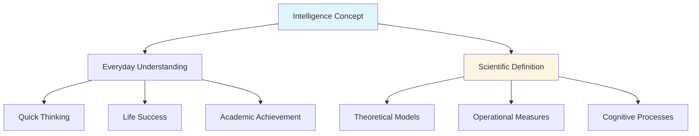
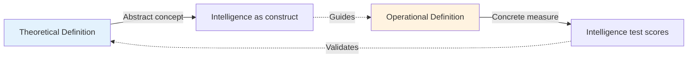

# The Nature of Intelligence and Its Definitions

## Introduction

Intelligence is one of the most debated concepts in psychology—everyone seems to know what it means, yet defining it precisely remains remarkably elusive. From ancient philosophical inquiries to modern neuroscientific investigations, the quest to understand human intelligence has shaped entire fields of research.

> **Indian Perspective**: In Indian systems of thought, **buddhi** (intellect) is defined as *nischayatmikabuddhih* (decision maker). It represents an inner instrument (*antahkarana*) that possesses wisdom, prudence, emotion, societal values, and relations—a holistic view that resonates with contemporary multidimensional models of intelligence.

This exploration examines how intelligence has been conceptualized across different eras, from Galton's anthropometric measures to contemporary cognitive theories. We'll discover why defining intelligence is so challenging and why this matters for education, assessment, and understanding human potential.

## The Challenge of Defining Intelligence

### Why Is Intelligence Hard to Define?

When people speak of intelligence in everyday conversation, they nod knowingly as if sharing a common understanding. However, their implicit definitions may vary dramatically:

- **For some**: Quick mental responses indicate intelligence
- **For others**: Life success demonstrates intelligence  
- **For students**: Academic achievement reflects intelligence
- **For employers**: Problem-solving ability signals intelligence

This diversity reflects a fundamental truth: intelligence is not a single, simple characteristic but a complex constellation of abilities that manifests differently across contexts.

## Historical Evolution of Intelligence Definitions

### The 1921 Symposium: Thirteen Experts, Thirteen Views

In a landmark symposium published in the *Journal of Educational Psychology* (1921), thirteen leading psychologists offered their definitions of intelligence. The results revealed startling diversity:

**Alfred Binet** (1890): "Intelligence, that is to say, reasoning, judgment, memory, and the power of abstraction"

**William Stern** (1914): "Intelligence is a general capacity of the individual consciously to adjust his thinking to new requirements"

**Lewis Terman** (1921): "An individual is intelligent in proportion as he is able to carry on abstract thinking"

**Charles Spearman** (1927): "Intelligence is the capacity of the organism to adjust itself to an increasingly complex environment"

### The 1986 Survey: 65 Years Later

When [Sternberg and Detterman (1986)](https://www.sciencedirect.com/topics/psychology/theories-of-intelligence) repeated this exercise, they found that **24 prominent scholars had 24 different definitions**. However, comparing the two surveys revealed evolving emphases:

| 1921 Survey Elements | 1986 Survey Elements |
|---------------------|---------------------|
| Higher-level abilities (reasoning, problem-solving) | Higher-level abilities |
| Ability to learn | Cultural valuation |
| Environmental adaptation | Executive processes |

**Key insight**: While core elements persisted, the 1986 survey reflected growing awareness of cultural context and cognitive mechanisms.

### The Snyderman-Rothman Study (1987)

Over 1,000 experts from psychology, sociology, education, and genetics rated 13 descriptive elements of intelligence. The results showed near-unanimous agreement on several core components:

| Intelligence Element | % Agreement |
|---------------------|-------------|
| Abstract thinking/reasoning | 99.3% |
| Problem-solving ability | 97.7% |
| Capacity to acquire knowledge | 96.0% |
| General knowledge | 88.3% |
| Memory | 80.5% |
| Environmental adaptation | 77.2% |
| Mental speed | 71.7% |
| Linguistic competence | 71.0% |
| Mathematical competence | 67.9% |
| Creativity | 59.6% |
| Achievement motivation | 18.9% |

**Source**: [Snyderman & Rothman (1987)](https://pubmed.ncbi.nlm.nih.gov/3325476/)

## Common Threads in Intelligence Definitions

Despite the diversity, several elements appear consistently across definitions:

### 1. **Adaptation**
The ability to modify behavior to meet environmental demands—whether physical, social, or intellectual challenges.

**Example**: A student who struggles with traditional lectures might adapt by using visual diagrams, peer study groups, or hands-on experiments to master the same material.

### 2. **Abstract Thinking**
The capacity to manipulate symbols, concepts, and relationships beyond concrete, immediate experience.

**Example**: Understanding mathematical principles (like algebra) requires moving beyond counting physical objects to manipulating abstract symbols representing quantities and relationships.

### 3. **Learning Capacity**
The ability to acquire new information and skills through experience.

**Example**: A child who quickly learns language grammar rules after hearing conversations demonstrates learning capacity, even without explicit instruction.

## Theoretical vs. Operational Definitions

### Theoretical Definitions

Theoretical definitions attempt to capture the *essential nature* of intelligence:

**David Wechsler (1944)**: "Intelligence, as a hypothetical construct, is the aggregate or global capacity of the individual to act purposefully, to think rationally and to deal effectively with his environment"

**Howard Gardner (1983)**: "A human intellectual competence must entail a set of skills of problem solving—enabling the individual to resolve genuine problems or difficulties that he or she encounters and when appropriate, to create an effective product—and must also entail the potential for finding or creating problems"

**Robert Sternberg (1997)**: "Intelligence comprises the mental abilities necessary for adaptation to, as well as shaping and selection of, any environmental context"

### Operational Definitions

Observing the definitional diversity, **Edwin Boring (1923)** proposed an operational approach:

> **"Intelligence is what intelligence tests measure"**

While this might seem circular, operational definitions serve an important scientific function: they provide concrete, measurable criteria that enable research to proceed despite conceptual ambiguities.

**Implications**:
- Enables systematic research and comparison across studies
- Allows practical applications in education and clinical settings
- Sidesteps (but doesn't solve) the conceptual puzzle
- Requires careful consideration of *what* tests actually measure

## Historical Development of Individual Differences Research

### Francis Galton: The Pioneer (1882)

Inspired by his cousin Charles Darwin's *Origin of Species*, **[Francis Galton](https://en.wikipedia.org/wiki/Francis_Galton)** founded the scientific study of individual differences:

**Key Contributions**:
1. **Coined the term "mental test"**
2. **Established the first test laboratory** (London, 1882)
3. **Developed correlation methods** (later refined by Karl Pearson)
4. **Pioneered anthropometric measures**

**Galton's Battery**:
- Height and weight
- Breathing power
- Strength of pull
- Hearing acuity
- Visual discrimination
- Color perception

**Critical evaluation**: While Galton's specific measures don't resemble modern intelligence tests, his systematic, quantitative approach revolutionized psychological measurement. He deserves the title **"Father of Psychological Testing and Individual Differences."**

### Alfred Binet: The Practical Turn (1905)

**The Challenge**: The French government commissioned Binet to identify mentally deficient children requiring special education.

**The Solution**: With Theodore Simon, [Binet developed the first practical intelligence test](https://www.simplypsychology.org/alfred-binet.html) (1905):

**Test Features**:
- 30 problems of increasing difficulty
- Tasks focused on understanding and reasoning
- Practical items related to everyday life
- Minimal reliance on learned school knowledge

**Revolutionary Concepts**:

1. **Mental Age (1908 revision)**: The chronological age at which most children can solve problems of a given difficulty level

2. **Intelligence Quotient - IQ** (William Stern, 1914):
   
   Mental Age / Chronological Age × 100

**Example**: A 10-year-old child who successfully completes tasks typically solved by 12-year-olds has:
- Mental Age = 12
- Chronological Age = 10  
- IQ = (12/10) × 100 = 120

**Lasting Impact**: All subsequent intelligence testing builds on Binet's foundation. His emphasis on reasoning, judgment, and adaptation to novel problems continues to shape contemporary assessment.

## Contemporary Perspectives

### Cultural Context Matters

Modern definitions increasingly recognize that intelligence cannot be understood apart from cultural context:

**Example**: [Indigenous Australian cultures](https://www.tandfonline.com/doi/abs/10.1080/09687599.2016.1166128) value spatial navigation, tracking, and ecological knowledge—abilities crucial for survival but not captured by standard Western intelligence tests.

**Research insight**: Studies comparing different cultural groups reveal that what counts as "intelligent behavior" varies significantly, challenging universal definitions.

### Neuroscientific Contributions

Recent brain imaging research illuminates the neural basis of intelligence:

- **Parieto-frontal integration theory**: Intelligence reflects efficient communication between parietal (information integration) and frontal (executive control) brain regions
- **Neural efficiency hypothesis**: More intelligent individuals show *less* rather than more brain activation for the same tasks
- **White matter integrity**: Intelligence correlates with quality of neural connections, not just gray matter volume

**Reference**: [Jung & Haier (2007). The Parieto-Frontal Integration Theory (P-FIT) of intelligence](https://www.ncbi.nlm.nih.gov/pmc/articles/PMC2668913/)

## Real-World Applications

Understanding intelligence matters practically:

### Education
- **Differentiated instruction**: Recognizing diverse ability profiles
- **Gifted education**: Identifying students needing enrichment
- **Special education**: Supporting students with learning difficulties

### Clinical Psychology
- **Diagnostic assessment**: Identifying cognitive strengths and weaknesses
- **Treatment planning**: Tailoring interventions to cognitive profiles
- **Rehabilitation**: Tracking recovery after brain injury

### Organizational Settings
- **Personnel selection**: Predicting job performance
- **Training design**: Matching instructional methods to learner abilities
- **Team composition**: Balancing diverse cognitive strengths

## Critical Considerations

### The "Reification" Problem

**Warning**: Treating intelligence as a concrete "thing" rather than a useful construct can lead to misunderstandings:

- Intelligence is not a physical entity located in the brain
- IQ scores are useful predictors but don't capture the full complexity of human cognitive abilities
- No single number can represent all aspects of intellectual functioning

### The Flynn Effect

Average IQ scores have increased approximately 3 points per decade throughout the 20th century—a phenomenon called the **[Flynn Effect](https://en.wikipedia.org/wiki/Flynn_effect)**. This challenges the notion of intelligence as a fixed, biological trait and highlights the role of:

- Educational improvements
- Nutrition and health
- Environmental complexity
- Test-taking familiarity

## Memory Aids

### Definition Mnemonic: **ALARAP**

- **A**daptation to environment
- **L**earning from experience
- **A**bstract thinking
- **R**easoning ability
- **A**cquisition of knowledge
- **P**roblem solving

### Historical Timeline Mnemonic: **"Great Big Spearman"**

- **G**alton (1882): Anthropometric testing begins
- **B**inet (1905): First practical intelligence test
- **S**pearman (1904): Two-factor theory and "g"

## Self-Assessment Questions

### Conceptual Understanding

1. **Why is intelligence difficult to define precisely? Provide at least three reasons.**

2. **Compare and contrast theoretical and operational definitions of intelligence. What are the advantages and limitations of each approach?**

3. **How did the elements emphasized in intelligence definitions change between the 1921 and 1986 surveys? What might explain these changes?**

### Application

4. **A school district is considering using a single IQ test to determine which students qualify for gifted education programs. What concerns might psychologists raise about this practice?**

5. **An employer wants to use an intelligence test to select job applicants. What factors should they consider to ensure fair and valid use of such testing?**

### Critical Thinking

6. **The Snyderman-Rothman study found 99.3% agreement that abstract reasoning is an important element of intelligence, but only 18.9% agreement on achievement motivation. Why might experts show such different levels of consensus on these two elements?**

7. **How might cultural differences affect both the definition and measurement of intelligence? Provide specific examples.**

## Exam-Style Long Answer Questions

1. **"Intelligence is what intelligence tests measure" (Boring, 1923). Critically evaluate this operational definition. (15 marks)**

2. **Trace the historical development of intelligence testing from Galton to Binet. How did their approaches differ and what lasting contributions did each make? (20 marks)**

3. **Analyze the common elements that appear across different definitions of intelligence. Why has it proven so difficult to achieve consensus on a single definition? (15 marks)**

---

**Source PDFs**:
- 📄 [Block-2/Unit-1.pdf - Pages 5-10](/pdfs/MPC-001%20Cognitive%20Psychology,%20Learning%20and%20Memory/Block-2/Unit-1.pdf)
- 📚 MPC-001 Cognitive Psychology, Learning and Memory

## Further Reading

### Essential Resources
- [Stanford Encyclopedia of Philosophy: Intelligence](https://plato.stanford.edu/entries/intelligence/)
- [APA Dictionary: Intelligence](https://dictionary.apa.org/intelligence)
- [Neisser et al. (1996). Intelligence: Knowns and Unknowns](https://www.gwern.net/docs/iq/1995-neisser.pdf) - Comprehensive review article

### Advanced Exploration
- Sternberg, R. J. (Ed.). (2020). *The Cambridge Handbook of Intelligence* (2nd ed.). Cambridge University Press
- Kaufman, S. B. (2013). *Ungifted: Intelligence Redefined*. Basic Books
- Deary, I. J. (2001). *Intelligence: A Very Short Introduction*. Oxford University Press

### Video Resources
- [CrashCourse Psychology: Intelligence Testing](https://www.youtube.com/watch?v=9xTz3QjcloI) - Engaging overview of intelligence measurement history
- [Yale Open Course: Intelligence](https://www.youtube.com/watch?v=SjJRxgLSKII) - Professor Paul Bloom's lecture on intelligence theories
