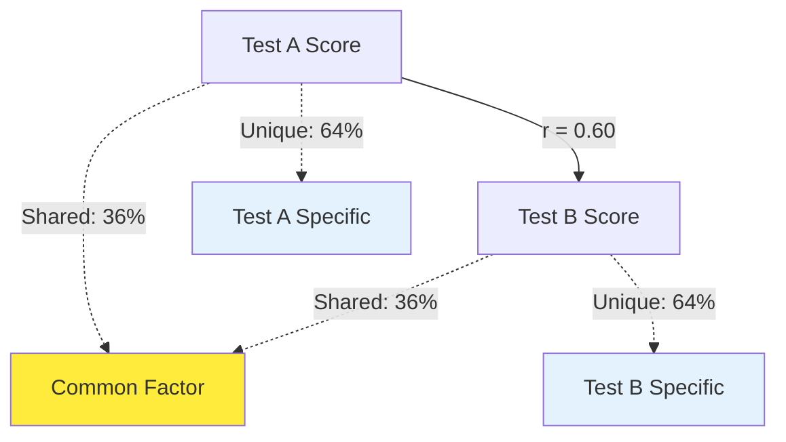
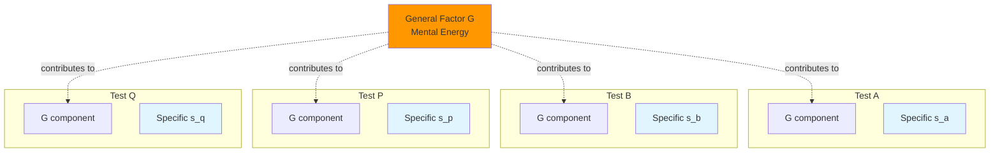
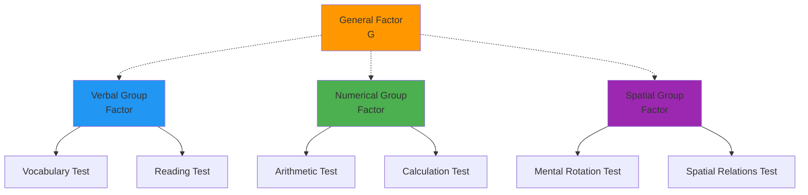

# Spearman's Two-Factor Theory of Intelligence

## Introduction

In 1904, Charles Spearman published what Guilford (1954) called "the most momentous event in the history of mental testing"—a study that introduced factor analysis and proposed that intelligence consists of two types of factors: a general factor (g) common to all mental tests, and specific factors (s) unique to particular tests.

This theory revolutionized psychological measurement by providing mathematical methods to test theories rather than merely quantify observations. Spearman's work laid the foundation for a century of intelligence research and continues to influence contemporary debates about the nature of cognitive abilities.

## Historical Context: The Need for Theory

### Pre-Spearman Intelligence Testing

Before Spearman's groundbreaking work, intelligence testing faced a critical limitation:

**[Binet and Simon's](https://www.simplypsychology.org/alfred-binet.html) approach (1905)**:
- Assembled diverse problems without theoretical justification
- No systematic method for selecting test items  
- Created a "hodgepodge" of tasks that happened to predict school performance
- Lacked understanding of what these tests actually measured

**Spearman's Innovation**: He insisted on testing **whether** a general factor existed before assuming it, and on weighting test items by their relationship to this factor.

## The Mathematical Foundation: Factor Analysis

### Correlation and Shared Variance

Spearman's insight emerged from studying **correlations between different intelligence tests**. When tests correlate, they share something in common—but what?

**Key Concept**: A correlation of 0.60 means tests share 36% of their variance (r² = 0.36). Spearman proposed this shared variance reflects a common general factor.

### Karl Pearson's Contribution

[Karl Pearson](https://en.wikipedia.org/wiki/Karl_Pearson), Spearman's contemporary, developed the **product-moment correlation coefficient** and matrix algebra techniques that Spearman adapted for factor analysis. This mathematical infrastructure enabled systematic investigation of the structure of human abilities.

## Core Elements of the Two-Factor Theory

### The General Factor (G)

**Spearman's "G" represents**:
- A common element present in every intellectual task
- What Spearman called "mental energy"
- Individual differences in overall cognitive capacity
- The primary source of correlation between diverse mental tests

**Characteristics of G**:

1. **Ubiquitous**: Present in all cognitive tasks, though to varying degrees
2. **Quantifiable**: Differs between individuals along a continuum
3. **Heritable**: Spearman believed g had biological roots
4. **Predictive**: Higher g predicts better performance across domains

**Test Saturation**: Tests vary in their "g-loading"—how much they depend on general intelligence:

| High G-Loading Tests | Low G-Loading Tests |
|---------------------|---------------------|
| Abstract reasoning | Simple reaction time |
| Novel problem-solving | Rote memory of facts |
| Complex analogies | Familiar procedures |
| Comprehension | Motor coordination |

### Specific Factors (S)

**S Factors represent**:
- Abilities unique to particular tasks
- Skills not shared across different tests
- The "remainder" after removing g's influence
- Specialized competencies (verbal, numerical, spatial, etc.)

**Important Distinction**: S factors are *numerous* and *task-specific*. There's no single "s"—instead, there are many specific factors (s₁, s₂, s₃, ... sₙ).

## The Two-Factor Model Visualized

Guilford (1953) provided an elegant graphic representation:

**Key Insight**: Tests correlate because they share g. The correlation strength depends on each test's g-loading. Tests a and b correlate highly because both have large g components. Tests a and c correlate weakly because one or both have small g components.

## The Method of Tetrad Differences

### Understanding the Criterion of Proportionality

Spearman needed a mathematical test for whether correlations could be explained by a single common factor. He developed the **tetrad difference equation**.

**The Tetrad Formula**:

Given four tests (1, 2, 3, 4) with six possible correlations:

**Tetrad Difference (Δ)** = (r₁₃ × r₂₄) - (r₁₄ × r₂₃)

**Crucial Prediction**: If all correlations result from a single general factor g, then Δ ≈ 0 for all possible tetrads.

### Spearman's (1927) Empirical Data

Spearman tested this prediction using seven subtests. Here's his correlation matrix:

| Subtest | 1 | 2 | 3 | 4 | 5 | 6 | 7 |
|---------|---|---|---|---|---|---|---|
| 1. Analogies | — | .50 | .49 | .55 | .49 | .45 | .48 |
| 2. Completion | .50 | — | .54 | .47 | .50 | .38 | .34 |
| 3. Understanding | .49 | .54 | — | .49 | .39 | .44 | .35 |
| 4. Opposites | .55 | .47 | .49 | — | .41 | .32 | .35 |
| 5. Instructions | .49 | .50 | .39 | .41 | — | .32 | .40 |
| 6. Resemblances | .45 | .38 | .44 | .32 | .32 | — | .35 |
| 7. Inferences | .48 | .34 | .35 | .35 | .40 | .35 | — |

**Testing the Two-Factor Theory**:

For tests 1, 2, 3, 4:
- Δ = (r₁₃ × r₂₄) - (r₁₄ × r₂₃)
- Δ = (.49 × .47) - (.55 × .54)
- Δ = .2303 - .2970 = -.0667

**Interpretation**: While not exactly zero, values close to zero support the existence of g. Departures from zero suggest additional factors.

## The Evolution: Group Factors

### The Hierarchical Expansion

As research progressed, Spearman recognized that correlations sometimes exceeded what g alone could explain. This led to acknowledging **group factors**—abilities common to several tests but not all.

**Recognized Group Factors**:
1. **Verbal ability**: Reading comprehension, vocabulary, analogies
2. **Numerical ability**: Arithmetic, calculation, numerical reasoning  
3. **Mechanical ability**: Understanding physical mechanisms
4. **Spatial ability**: Mental rotation, spatial visualization
5. **Mental speed**: Quick information processing
6. **Attention**: Sustained focus and concentration
7. **Imagination**: Creative ideation

**Hierarchical Structure**: G at the apex, group factors at an intermediate level, specific factors at the base.

## Historical Significance

### Scientific Contributions

**1. Factor Analysis Methodology**

Spearman pioneered the mathematical framework for investigating mental structure:
- Correlation matrices as data sources
- Extraction of common factors
- Quantitative hypothesis testing
- Influenced all subsequent multivariate analysis

**2. Scholarly Tradition**

Established intelligence research as a rigorous scientific discipline:
- Theory-driven investigation
- Mathematical precision
- Replicable methods
- Cumulative knowledge building

**Nunnally's (1978) Assessment**: "Spearman was concerned much more with understanding human abilities than with just measuring them. Spearman had many interesting theories about G, its biological basis, the influence of culture, the interaction of G with manifestations of abilities in daily life, and the relation of G to speed, fatigue, and other variables."

### Cognitive Theory Beyond Psychometrics

**Common Criticism**: Factor analysis is "merely psychometric" without cognitive theory.

**Sternberg and Frensch's (1990) Rebuttal**: Spearman proposed **qualitative principles of cognition**:

**The Principle of Relations**: "The presenting of any character together with any relation tends to evoke immediately the knowing of the correlative character"

**Example**: Given "hot is to cold" and "up is to ____", the mind automatically generates "down" through relational reasoning.

**Five Quantitative Principles**:
1. **Conative control**: Motivation directs cognitive resources
2. **Fatigue**: Mental effort depletes cognitive capacity
3. **Mental energy**: Limited resource allocated across tasks
4. **Primordial potencies**: Basic cognitive capabilities
5. **Retentivity**: Ability to maintain information over time

## Modern Validation

### Confirmatory Factor Analysis

[Jensen (1998)](https://psycnet.apa.org/record/1998-02389-000) used modern confirmatory factor analysis (CFA) to test Spearman's predictions across hundreds of studies. **Result**: The existence of g is consistently confirmed.

**Key Findings**:
- G accounts for approximately 40-50% of variance in cognitive test batteries
- Higher-level cognitive tasks show stronger g-loadings
- G predicts real-world outcomes (academic achievement, job performance, income)

### Carroll's Three-Stratum Theory

[John Carroll's (1993)](https://psycnet.apa.org/record/1993-97639-000) monumental factor-analytic survey of over 460 datasets confirmed a hierarchical structure:

| Stratum | Description | Examples |
|---------|-------------|----------|
| Stratum III | General Intelligence (g) | Spearman's g |
| Stratum II | Broad Abilities | Fluid reasoning, crystallized intelligence, memory, processing speed |
| Stratum I | Narrow Abilities | Specific skills and knowledge domains |

**Vindication**: Carroll's comprehensive analysis, using modern methods and vastly more data, essentially validated Spearman's core insight about g's existence and primacy.

## Contemporary Neuroscience

Recent brain imaging reveals neural correlates of g:

**[Parieto-Frontal Integration Theory (P-FIT)](https://www.ncbi.nlm.nih.gov/pmc/articles/PMC2668913/)**: General intelligence reflects efficient interaction between:
- **Frontal regions**: Planning, executive control, working memory
- **Parietal regions**: Spatial processing, attention, integration
- **Temporal regions**: Language processing, memory retrieval
- **Occipital regions**: Visual processing

**White Matter Integrity**: Recent studies show g correlates with:
- Quality of neural connections (measured by diffusion tensor imaging)
- Speed of neural transmission
- Efficiency of information transfer between brain regions

**Reference**: [Deary et al. (2010). The neuroscience of human intelligence differences](https://www.nature.com/articles/nrn2793)

## Real-World Implications

### Educational Applications

**Curriculum Design**:
- High-g tasks (abstract reasoning, problem-solving) transfer broadly
- Low-g tasks (rote learning, specific procedures) transfer narrowly
- Balance needed between general cognitive development and domain-specific skills

**Gifted Education**:
- High g-loading tests identify students who benefit from enrichment
- Students with high g learn faster and at higher levels of abstraction

### Clinical Assessment

**Neuropsychological Evaluation**:
- Pattern of scores reveals cognitive strengths/weaknesses
- Large discrepancies between g-estimate and specific abilities suggest focal impairments
- Brain injury often affects g-loaded tasks most severely

### Occupational Psychology

**Personnel Selection**:
- G predicts job performance across occupations (meta-analytic correlation ≈ 0.50)
- Prediction strength increases with job complexity
- Valid across cultures and organizations

**Reference**: [Schmidt & Hunter (1998). The validity and utility of selection methods in personnel psychology](https://onlinelibrary.wiley.com/doi/abs/10.1111/j.1744-6570.1998.tb00272.x)

## Critical Considerations

### What G Is Not

**Common Misconceptions**:

1. **G is not a "thing" in the brain**: It's a statistical construct representing common variance
2. **G is not the only important cognitive ability**: Specific skills matter for particular tasks
3. **G is not completely fixed**: Environmental factors influence its development and expression
4. **G is not destiny**: Motivation, personality, and opportunity also determine outcomes

### The Nature-Nurture Question

Spearman believed g was largely biological, but modern research reveals complexity:

**Genetic Influences**: Twin and adoption studies suggest g has 50-80% heritability

**Environmental Influences**:
- Nutrition, especially early in development
- Educational quality and duration
- Cognitive stimulation and enrichment
- Socioeconomic factors affecting brain development

**Gene-Environment Interaction**: Genetic potential requires appropriate environment for expression

## Memory Aids

### G-Factor Characteristics: **UPHP**

- **U**biquitous (present in all cognitive tasks)
- **P**redictive (forecasts performance across domains)
- **H**eritable (genetic component)
- **P**owerful (accounts for substantial variance)

### Specific Factor Features: **NUMTASK**

- **N**umerous (many different s factors)
- **U**nique (specific to particular tasks)
- **M**arginal (smaller than g's contribution)
- **TASK**-dependent (vary by test content)

### Tetrad Test Mnemonic: **"Delta to ZERO"**

**D**ifference (tetrad difference)
**E**quals (=)
**L**ess than or close to
**T**iny values
**A**pproximates

**ZERO** (supports single-factor explanation)

## Self-Assessment Questions

### Conceptual Understanding

1. **Explain what Guilford meant when he called Spearman's 1904 study "the most momentous event in the history of mental testing."**

2. **Describe the two-factor theory using a concrete example. How do g and s factors combine to determine performance on a vocabulary test?**

3. **Why did Spearman criticize Binet and Simon's approach to intelligence testing? What did he propose instead?**

### Application

4. **A student scores high on verbal reasoning, mathematical problem-solving, and spatial puzzles, but low on vocabulary and arithmetic facts. How would Spearman's theory explain this pattern?**

5. **A researcher finds that four cognitive tests produce correlations where tetrad differences average 0.35 rather than approaching zero. What does this suggest about the factor structure?**

### Critical Thinking

6. **Spearman initially proposed only g and s factors, but later acknowledged group factors. Does this evolution strengthen or weaken the theory? Defend your position.**

7. **Some critics argue that g is "merely a statistical artifact" with no psychological reality. How would you respond using evidence from modern neuroscience?**

### Advanced Analysis

8. **Compare Spearman's theoretical approach to Binet's practical approach. What are the advantages and limitations of each for advancing scientific understanding of intelligence?**

## Exam-Style Long Answer Questions

1. **"Spearman's two-factor theory revolutionized the study of human intelligence." Critically evaluate this statement with reference to both historical and contemporary perspectives. (20 marks)**

2. **Explain the mathematical foundation of Spearman's theory, including the method of tetrad differences. Why was this methodological innovation important? (15 marks)**

3. **Trace the evolution of Spearman's theory from the original two-factor model to the hierarchical model incorporating group factors. What evidence necessitated this evolution? (15 marks)**

4. **"Modern confirmatory factor analysis has vindicated Spearman's core insight about general intelligence." Evaluate this claim with reference to research by Jensen (1998) and Carroll (1993). (20 marks)**

---

**Source PDFs**:
- 📄 [Block-2/Unit-1.pdf - Pages 10-13](/pdfs/MPC-001%20Cognitive%20Psychology,%20Learning%20and%20Memory/Block-2/Unit-1.pdf)
- 📚 MPC-001 Cognitive Psychology, Learning and Memory

## Further Reading

### Essential Resources
- [Spearman's Original 1904 Paper](https://www.gwern.net/docs/iq/1904-spearman.pdf) - Groundbreaking original research
- [Wikipedia: G Factor (Psychometrics)](https://en.wikipedia.org/wiki/G_factor_(psychometrics)) - Comprehensive overview
- [Jensen (1998). The g Factor: Review](https://www.sciencedirect.com/science/article/pii/S0160289698000116)

### Contemporary Analysis
- Deary, I. J., Penke, L., & Johnson, W. (2010). The neuroscience of human intelligence differences. *Nature Reviews Neuroscience*, 11(3), 201-211
- Carroll, J. B. (1993). *Human Cognitive Abilities: A Survey of Factor-Analytic Studies*. Cambridge University Press

### Historical Context
- Fancher, R. E. (1985). *The Intelligence Men: Makers of the IQ Controversy*. W. W. Norton
- Bartholomew, D. J. (2004). *Measuring Intelligence: Facts and Fallacies*. Cambridge University Press

### Video Resources
- [The Bell Curve - Intelligence (Personality Lecture 12)](https://www.youtube.com/watch?v=jSo5v5t4OQM) - Jordan Peterson on g-factor
- [Introduction to Factor Analysis](https://www.youtube.com/watch?v=Oh7M3DlpkWs) - Statistical foundations explained
