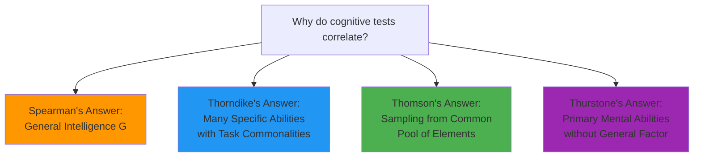
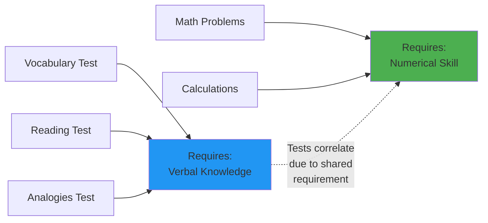
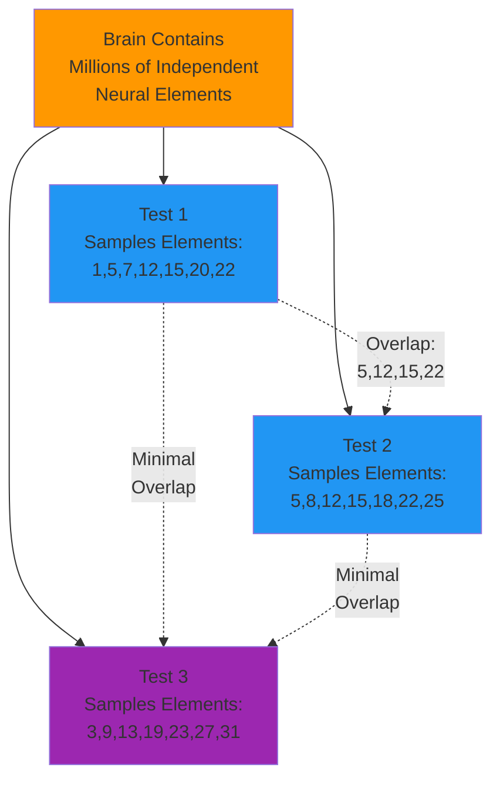
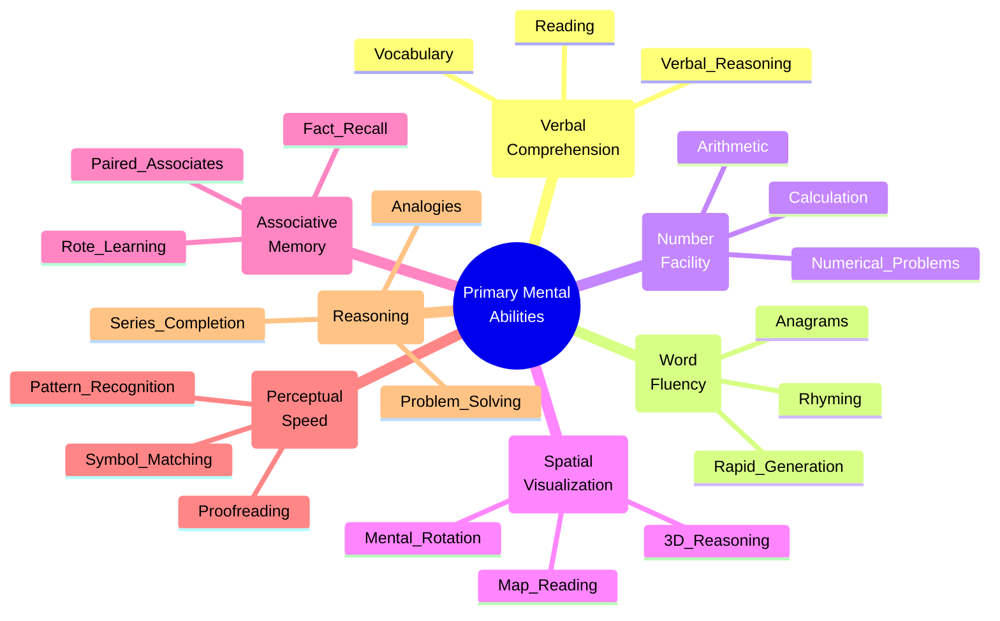
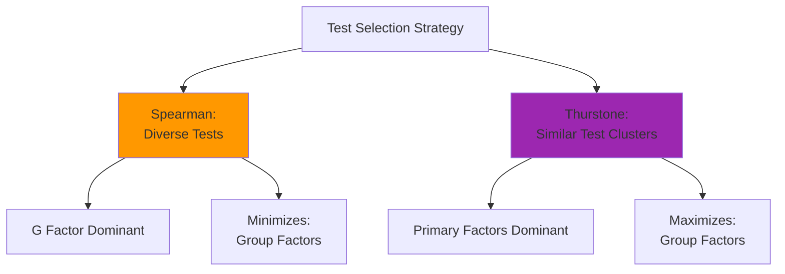
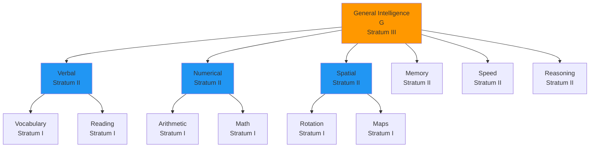

# Critical Appraisals of Spearman's Theory

## Introduction

Scientific progress thrives on challenge and debate. While Spearman's two-factor theory revolutionized intelligence research, it also sparked vigorous criticism that ultimately enriched our understanding of cognitive abilities. Three prominent psychologists—**E. L. Thorndike**, **G. H. Thomson**, and **L. L. Thurstone**—developed alternative frameworks that fundamentally questioned Spearman's assumptions.

These critiques weren't merely academic disagreements; they represented different philosophical approaches to understanding human cognition. Should we search for a general faculty underlying all thinking, or recognize a collection of independent abilities? Is intelligence one thing or many things? These debates continue to resonate in contemporary cognitive science and educational practice.

> **Key Question**: Does the observed correlation between cognitive tests reflect a single general factor, or could multiple specific abilities produce the same pattern of results?

## The Theoretical Landscape

Before examining each critique, let's understand the fundamental disagreement:

## E. L. Thorndike's Multifactorial Theory

### The Challenge to General Intelligence

**[Edward L. Thorndike](https://en.wikipedia.org/wiki/Edward_Thorndike)** (1926), the influential American psychologist, mounted a frontal assault on Spearman's concept of general intelligence. His critique operated at both empirical and conceptual levels.

### Empirical Criticism: The Correlation Problem

**Thorndike's First Objection**: The intercorrelations Spearman studied were too small to decisively test whether a common factor existed.

**Statistical Argument**:
- When correlations between tests are moderate (r = 0.30-0.60), multiple factor structures could fit the data
- Small sample sizes in early studies limited statistical power
- Measurement error could obscure true relationships

**Example**: Two tests correlating at r = 0.45:
- **Spearman's interpretation**: They share 20% variance through g
- **Thorndike's counter**: Perhaps they share 20% variance because both require numerical manipulation, not because of general intelligence

### Conceptual Criticism: Locating Intelligence

**Thorndike's Core Argument**: Intelligence doesn't reside in the individual as a general capacity—it resides in the **nature of the tasks** themselves.

**The Task Commonality Hypothesis**:

Tests correlate not because people have varying amounts of general intelligence, but because tests share **concrete requirements**:

| Task Feature | Tests Sharing Feature |
|--------------|----------------------|
| Verbal knowledge | Vocabulary, reading comprehension, analogies |
| Numerical operations | Arithmetic, calculation, quantitative reasoning |
| Spatial visualization | Mental rotation, map reading, geometric reasoning |
| Processing speed | Reaction time, perceptual comparison, rapid decision |

### Individual Differences in Thorndike's Model

Thorndike proposed two dimensions of ability:

**1. Altitude (Level)**
- How difficult a task can an individual perform?
- **Example**: Student A can solve simple equations; Student B can solve complex calculus problems

**2. Range (Breadth)**  
- How many different types of tasks can an individual perform?
- **Example**: Student A excels only in mathematics; Student B performs well in mathematics, literature, and science

**Critical Insight**: People don't vary along a single "general intelligence" dimension. They vary in:
- Maximum difficulty they can handle in specific domains
- Number of domains where they show competence

### Three Types of Intelligence

Thorndike classified intellectual activities into three categories:

#### 1. **Abstract Intelligence**
**Definition**: Ability to understand and manipulate ideas, symbols, and relationships

**Examples**:
- Solving mathematical problems
- Understanding philosophical arguments  
- Creating logical proofs
- Analyzing abstract concepts

#### 2. **Mechanical Intelligence**
**Definition**: Ability to understand and manipulate concrete objects and mechanisms

**Examples**:
- Repairing machinery
- Building structures
- Understanding how physical systems work
- Spatial reasoning with real objects

#### 3. **Social Intelligence**
**Definition**: Ability to understand and interact effectively with people

**Examples**:
- Reading social cues
- Predicting others' behavior
- Managing interpersonal relationships
- Navigating social situations

**Important Note**: These categories describe **types of tasks**, not underlying mental faculties. Thorndike avoided reifying intelligence as an entity.

### Evaluation of Thorndike's Theory

**Strengths**:
1. **Anticipated Modern Views**: Contemporary theories (Gardner's multiple intelligences, Sternberg's triarchic theory) echo Thorndike's pluralistic approach
2. **Practical Relevance**: Recognizing different types of competence has educational value
3. **Task Analysis**: Focusing on task requirements anticipated cognitive psychology's approach

**Limitations**:
1. **Overlapping Categories**: Abstract, mechanical, and social intelligence aren't completely independent—successful engineers need abstract and mechanical intelligence
2. **Doesn't Explain Correlations**: If abilities are truly separate, why do diverse tests correlate positively (the "positive manifold")?
3. **Measurement Challenges**: How do we separately assess "altitude" and "range"?

**Guilford's (1953) Assessment**: "There seems to be agreement that the types that interested Thorndike are essentially the same as the [group factors] which Spearman used in his correlation matrix."

**Interpretation**: Thorndike's types might represent **group factors** rather than completely independent abilities, suggesting his theory and Spearman's converge more than Thorndike acknowledged.

## G. H. Thomson's Sampling Theory

### The Mathematical Challenge

**[Godfrey H. Thomson](https://en.wikipedia.org/wiki/Godfrey_Hilton_Thomson)** (1939), a Scottish psychologist and statistician, proposed the most mathematically sophisticated alternative to Spearman. His "sampling theory" demonstrated that **patterns appearing to support general intelligence could arise from completely different underlying structures**.

### The Core Argument: Bonds, Not a Factor

**Thomson's Revolutionary Insight**: What if intelligence involves not a general factor, but a vast collection of independent "bonds" or "neural connections"?

**The Sampling Hypothesis**:
1. The brain contains innumerable independent neural elements (bonds)
2. Each cognitive task activates a **sample** of these elements
3. Tests correlate when they sample overlapping sets of elements
4. NO general factor exists—only statistical overlap from sampling

**Why Tests Correlate**: Tests 1 and 2 share many elements (5, 12, 15, 22), producing high correlation. Tests 1 and 3 share few elements, producing low correlation.

### Mathematical Equivalence

**Thomson's Bombshell**: Using factor analysis on correlation matrices, you **cannot distinguish** between:
- Spearman's model: One general factor + specific factors
- Thomson's model: Many independent elements sampled differently

**Both produce identical correlation patterns!**

**Implications**:
- Factor analysis reveals structure in correlations, not necessarily structure in the mind
- The existence of g as a statistical factor doesn't prove g exists as a psychological reality
- Alternative explanations remain viable even when factor analysis "supports" g

### The Hierarchical Approximation

Thomson acknowledged that when tests sample many common elements:

**"General Ability"** emerges as:
- A **statistical regularity**, not a basic entity
- The **constant combination** of frequently co-sampled elements
- An **approximation** of underlying complexity

**Similarly**:
- **Group factors**: Combinations of more limited element collections
- **Specific factors**: Elements appearing in single tests only

### Neurological Plausibility

Thomson grounded his theory in neural architecture:

**Anatomical Support**:
- Cortex contains billions of neurons with trillions of connections
- Complex tasks recruit distributed neural assemblies
- Different tasks activate overlapping but non-identical networks
- No single "intelligence center" exists in the brain

**Modern Neuroscience Confirmation**: [Contemporary brain imaging](https://www.ncbi.nlm.nih.gov/pmc/articles/PMC2668913/) shows:
- Intelligence involves distributed networks
- Different cognitive tasks activate overlapping brain regions
- Network efficiency (connectivity quality) predicts performance
- Supports element-sampling over single-factor models

### Evaluation of Thomson's Theory

**Strengths**:
1. **Parsimony**: Explains intelligence without postulating unmeasurable "mental energy"
2. **Biological Plausibility**: Consistent with neural network architecture
3. **Methodological Caution**: Highlights limits of factor analysis interpretation
4. **Predictive Equivalence**: Generates same predictions as Spearman's model

**Limitations**:
1. **Unfalsifiability**: If statistically indistinguishable from g-theory, how can we test it?
2. **Element Identification**: Guilford's (1953) critique: "There seems to be little likelihood of demonstrating experimentally the existence of the elements hypothesized"
3. **Group Factors**: Doesn't easily explain why certain abilities (verbal, spatial, numerical) consistently cluster

**Historical Verdict**: Thomson demonstrated that **factor-analytic results alone cannot reveal underlying mental architecture**. This epistemological insight remains relevant: correlation patterns consistent with multiple theories require additional evidence (behavioral, neural, genetic) to adjudicate.

## L. L. Thurstone's Primary Mental Abilities

### The Revolutionary Alternative

**[Louis L. Thurstone](https://en.wikipedia.org/wiki/Louis_Leon_Thurstone)** (1935) offered the most influential challenge to Spearman through sophisticated factor-analytic techniques that revealed **multiple independent factors** rather than a single general factor.

### Methodological Innovations

Thurstone advanced factor analysis beyond Spearman:

**Technical Improvements**:
1. **Multiple Factor Analysis**: Extracted several factors simultaneously
2. **Rotation Methods**: Repositioned factors to achieve "simple structure"
3. **Large-Scale Studies**: Used 57 tests on substantial samples
4. **Matrix Algebra**: Generalized and formalized Spearman's methods

### The Primary Mental Abilities (PMAs)

Thurstone identified **seven primary factors**:

| Ability | Symbol | Description | Example Tests |
|---------|--------|-------------|---------------|
| **Verbal Comprehension** | V | Understanding word meanings and relationships | Vocabulary, reading comprehension, verbal analogies |
| **Word Fluency** | W | Rapid word generation | Name words starting with 'S', rhyming words, anagrams |
| **Number Facility** | N | Speed and accuracy in arithmetic | Addition, multiplication, numerical reasoning |
| **Spatial Visualization** | S | Mental manipulation of shapes | Mental rotation, map reading, assembling puzzles |
| **Associative Memory** | M | Rote memorization | Paired associates, recall of facts, memorizing lists |
| **Perceptual Speed** | P | Rapid identification of similarities/differences | Finding matching symbols, proofreading, pattern recognition |
| **Reasoning** | R | Problem-solving and rule discovery | Number series, analogies, logical puzzles |

### Why Thurstone's Results Differed from Spearman's

**Two Critical Factors**:

#### 1. **Population Sampling**

| Spearman | Thurstone |
|----------|-----------|
| Random population samples (especially children) | University students only |
| Wide ability range | Restricted ability range |
| Large individual differences | Homogeneous group |

**Consequence**: In homogeneous groups, g becomes less apparent because everyone has relatively similar general ability. Specific abilities show through more clearly.

**Analogy**: 
- Measuring heights in general population: clear differences emerge
- Measuring heights in professional basketball players: minimal variation, other factors (speed, shooting) differentiate

#### 2. **Test Selection**

| Spearman | Thurstone |
|----------|-----------|
| Dissimilar tests | Groups of very similar tests |
| Avoids overlapping specifics | Intentionally includes similar items |
| Minimizes group factors | Maximizes group factors |

**Spearman's Warning**: Very similar tests cause s factors to overlap, creating additional correlations that emerge as separate factors.

**Thurstone's Strategy**: Deliberately used similar test clusters to bring out group factors more clearly.

### The Reconciliation: Hierarchical Structure

After extended debate, Thurstone acknowledged that **his primary abilities themselves correlated**, necessitating a higher-order factor—essentially Spearman's g.

**The Integrated Model**:

**Eysenck's (1972) Summary**: Thurstone eventually recognized "a hierarchical structure of intellect, with g at the top, and the 'primary abilities' (whose intercorrelations necessitated the postulation of g) at a lower level; the actual tests used would of course be at a lower level still."

### Contemporary Applications

**Educational Assessment**: Many modern intelligence tests (e.g., WISC-V, WAIS-IV) provide:
- **Full-Scale IQ**: Estimate of g
- **Index Scores**: Estimates of Thurstone-like primary abilities
- **Subtest Scores**: Specific skill assessments

**Career Counseling**: Primary abilities help identify:
- Relative cognitive strengths (e.g., high spatial, moderate verbal)
- Suitable career paths (e.g., engineering vs. law)
- Training needs (e.g., developing weaker areas)

### Evaluation of Thurstone's Theory

**Strengths**:
1. **Empirical Rigor**: Large-scale studies with advanced methods
2. **Practical Utility**: Differential ability profiles guide education and career decisions
3. **Theoretical Refinement**: Hierarchical model integrates Spearman's and Thurstone's insights
4. **Predictive Validity**: Primary abilities predict domain-specific performance

**Limitations**:
1. **Initial Overreach**: Claiming g didn't exist was contradicted by intercorrelations among PMAs
2. **Factor Instability**: Different rotation methods yield somewhat different factors
3. **Number of Factors**: Why seven? Other researchers found different numbers
4. **Measurement Reliability**: Some PMAs (especially M and W) proved difficult to measure reliably

**Modern Synthesis**: [Carroll's (1993)](https://psycnet.apa.org/record/1993-97639-000) comprehensive review validated both Spearman's g and Thurstone's broad abilities, positioning them at different levels of a hierarchy.

## Comparative Analysis

### Theoretical Comparison

| Aspect | Spearman | Thorndike | Thomson | Thurstone |
|--------|----------|-----------|---------|-----------|
| **Core Concept** | General factor + specifics | Multiple independent abilities | Sampled neural elements | Primary mental abilities |
| **Tests Correlate Because...** | They share g | They share task requirements | They sample common elements | Measurement artifact of range restriction |
| **Underlying Reality** | Mental energy | Task commonalities | Neural bonds | Independent cognitive processes |
| **Mathematical Approach** | Factor analysis | Qualitative analysis | Sampling theory | Multiple factor analysis |

### Strengths and Weaknesses

**Spearman**:
- ✅ Parsimony (single factor explains much variance)
- ✅ Predictive power (g predicts broad outcomes)
- ❌ Doesn't explain specialized talents
- ❌ Reifies statistical construct

**Thorndike**:
- ✅ Recognizes cognitive diversity
- ✅ Practical educational relevance
- ❌ Doesn't explain positive manifold
- ❌ Lacks quantitative precision

**Thomson**:
- ✅ Neurologically plausible
- ✅ Methodological sophistication
- ❌ Empirically indistinguishable from Spearman
- ❌ Elements cannot be identified

**Thurstone**:
- ✅ Comprehensive factor structure
- ✅ Differential assessment utility
- ❌ Initial rejection of g unsustainable
- ❌ Factor instability across studies

## The Modern Consensus

Contemporary intelligence research has largely **integrated** rather than chosen among these perspectives:

### The CHC Model

**[Cattell-Horn-Carroll (CHC) Theory](https://en.wikipedia.org/wiki/Cattell%E2%80%93Horn%E2%80%93Carroll_theory)** synthesizes:
- Spearman's g (general intelligence)
- Thurstone's broad abilities (Stratum II)
- Specific skills (Stratum I)

This hierarchical framework underlies most modern intelligence tests and reflects the cumulative wisdom from a century of debate.

### Neuroscience Contributions

Modern brain imaging suggests **all theories capture partial truths**:

- **Spearman was right**: Distributed brain networks show general efficiency differences
- **Thorndike was right**: Different task types activate different regions
- **Thomson was right**: Intelligence involves distributed, overlapping networks
- **Thurstone was right**: Broad domains (verbal, spatial, etc.) have distinct neural substrates

**Reference**: [Haier (2017). The Neuroscience of Intelligence](https://www.cambridge.org/core/books/neuroscience-of-intelligence/F66A7DC23A5606C0FE8E2676FE825AE7)

## Real-World Implications

### Educational Practice

**Lesson**: Both general cognitive development AND domain-specific skills matter

**Applications**:
- **General training**: Critical thinking, problem-solving, metacognitive strategies
- **Specific training**: Reading fluency, mathematical procedures, spatial skills
- **Individual differences**: Tailor instruction to cognitive profiles

### Clinical Assessment

**Integrated Approach**:
- Full-scale scores (g estimate) indicate overall level
- Index scores (broad abilities) reveal cognitive profile
- Subtest patterns guide intervention planning

### Talent Development

**Recognizing Multiple Pathways**:
- High g with balanced abilities: Academic careers
- High g with specific strength: Domain specialists (mathematicians, linguists)
- High specific ability with moderate g: Skilled trades, arts, athletics

## Memory Aids

### Critic Mnemonic: **"Three T's Challenge Spearman"**

- **T**horndike: Tasks not traits
- **T**homson: Sampling not single factor
- **T**hurstone: Primary abilities not general ability

### Thurstone's Seven PMAs: **"VW NSMPR"**

- **V**erbal comprehension
- **W**ord fluency
- **N**umber facility
- **S**patial visualization
- **M**emory
- **P**erceptual speed
- **R**easoning

### Resolution Mnemonic: **"HIERARCHY"**

**H**igher order: General factor (g)
**I**ntermediate level: Broad abilities (PMAs)
**E**ach factor: Has specific manifestations
**R**esearch confirms: Both levels exist
**A**ll critics: Contributed insights
**R**econciliation: Through hierarchical model
**C**ontemporary consensus: Integrated framework
**H**istorical debate: Enriched understanding
**Y**ields today: Sophisticated assessments

## Self-Assessment Questions

### Conceptual Understanding

1. **Explain how Thorndike's concept of "altitude" and "range" differs from Spearman's concept of general intelligence.**

2. **Thomson's sampling theory produces the same correlation patterns as Spearman's g-theory. Why does this matter for interpreting factor analysis results?**

3. **Why did Thurstone initially find seven primary factors while Spearman found one general factor? Explain the role of population sampling and test selection.**

### Application

4. **A student scores very high on verbal and spatial tests but average on numerical tests. How would each theorist (Spearman, Thorndike, Thurstone) explain this pattern?**

5. **Design a study that could distinguish between Thomson's sampling theory and Spearman's g-theory. What kind of evidence would support one theory over the other?**

### Critical Thinking

6. **Guilford stated that Thorndike's types are "essentially the same" as Spearman's group factors. If true, were Thorndike and Spearman really disagreeing? Analyze this claim.**

7. **Thurstone eventually acknowledged g's existence when his primary abilities correlated. Does this mean Spearman "won" the debate? Defend your position.**

### Synthesis

8. **Modern neuroscience shows both: (a) general network efficiency differences, and (b) specialized regional activations for different cognitive domains. Which historical theory does this support, or does it require a new framework?**

## Exam-Style Long Answer Questions

1. **"Thorndike's multifactorial theory and Spearman's two-factor theory represent fundamentally different conceptions of intelligence." Critically evaluate this statement. (20 marks)**

2. **Explain Thomson's sampling theory and evaluate whether his critique successfully undermines Spearman's concept of general intelligence. (15 marks)**

3. **Trace the evolution from Thurstone's initial rejection of g to his eventual acceptance of a hierarchical model. What implications does this have for understanding intelligence? (20 marks)**

4. **"The historical debate among Spearman, Thorndike, Thomson, and Thurstone was resolved through synthesis rather than victory." Assess this claim with reference to contemporary intelligence theory. (25 marks)**

---

**Source PDFs**:
- 📄 [Block-2/Unit-1.pdf - Pages 13-15](/pdfs/MPC-001%20Cognitive%20Psychology,%20Learning%20and%20Memory/Block-2/Unit-1.pdf)
- 📚 MPC-001 Cognitive Psychology, Learning and Memory

## Further Reading

### Essential Resources
- [Thurstone (1938). Primary Mental Abilities](https://psycnet.apa.org/record/1938-15020-000) - Original research monograph
- [Thomson (1919). The Hierarchy of Abilities](https://www.jstor.org/stable/1413642) - Sampling theory explained
- [Thorndike (1927). The Measurement of Intelligence](https://psycnet.apa.org/record/1927-00920-000)

### Contemporary Integration
- McGrew, K. S. (2009). CHC theory and the human cognitive abilities project. *Intelligence*, 37(1), 1-10
- Carroll, J. B. (1993). *Human Cognitive Abilities: A Survey of Factor-Analytic Studies*. Cambridge University Press

### Historical Analysis
- Jensen, A. R. (1998). *The g Factor: The Science of Mental Ability*. Praeger Publishers
- Deary, I. J. (2001). *Intelligence: A Very Short Introduction*. Oxford University Press

### Video Resources
- [Factor Analysis in Psychology](https://www.youtube.com/watch?v=Qkvgd1bqSUY) - Statistical foundations explained
- [History of Intelligence Testing](https://www.youtube.com/watch?v=TwmbfY8Pzys) - Theoretical evolution overview
