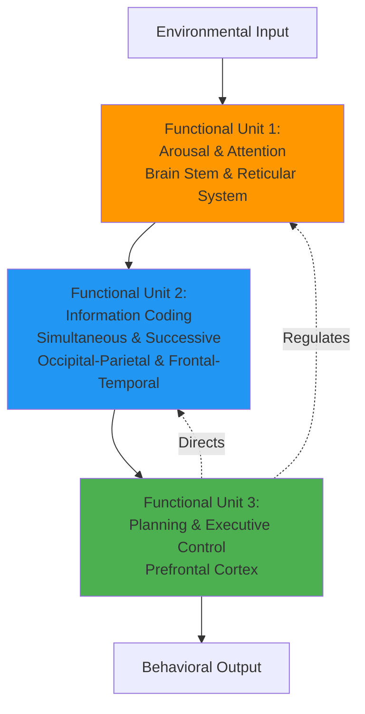
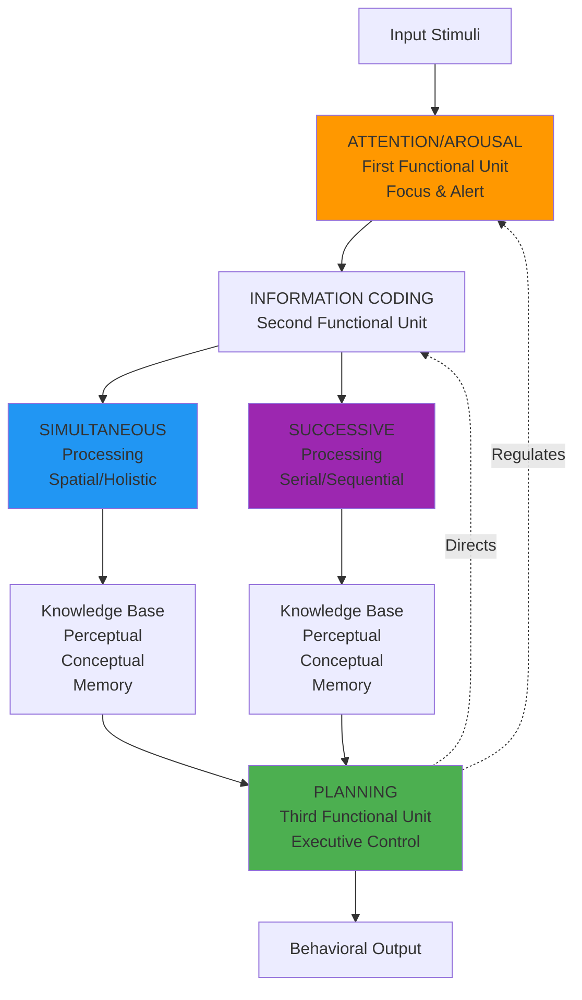
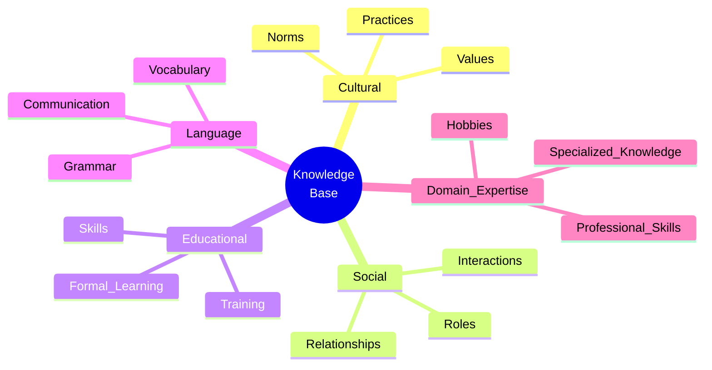

# PASS Theory of Intelligence

## Introduction

While Spearman, Thurstone, and others used **factor analysis** to identify intelligence components by studying test correlations, **J. P. Das**, **Jack A. Naglieri**, and **John R. Kirby** (1994) took a radically different approach. Their **PASS theory** builds intelligence from the ground up, integrating:

- **Neuropsychological research** (brain structure-function relationships)
- **Information processing** (how the mind handles information)
- **Cognitive psychology** (mental processes underlying behavior)

Rather than asking "What factors emerge when we analyze test scores?", PASS theory asks: "How does the brain actually process information to produce intelligent behavior?"

> **Revolutionary Shift**: From **psychometric** (statistical patterns in test scores) to **cognitive-neuropsychological** (brain-based processing mechanisms)

This integration of neuroscience, cognitive psychology, and assessment created a theory-driven framework that fundamentally changed how we understand and measure intelligence.

## Theoretical Foundation: Luria's Functional Systems

### Alexander Luria: Pioneer of Neuropsychology

**[Alexander R. Luria](https://en.wikipedia.org/wiki/Alexander_Luria)** (1902-1977), Soviet neuropsychologist, spent decades studying brain-damaged patients to understand brain-behavior relationships. His systematic observations revealed that:

1. **Different brain regions** support different cognitive functions
2. **Complex abilities** require coordination across brain regions
3. **Processing mechanisms** matter more than specific content
4. **Three functional units** work together to produce intelligent behavior

**Luria's Magnum Opus**:
- *The Working Brain* (1973)
- *Higher Cortical Functions in Man* (1980)
- *Human Brain and Psychological Processes* (1966)

### The Three Functional Units

Luria described cognition through three integrated brain systems:

#### **Functional Unit 1: Arousal and Attention**

**Location**: Brain stem, reticular activating system, thalamus

**Function**: Maintains optimal cortical tone and selective attention

**Luria's Description**: "Provides the brain with the appropriate level of arousal or cortical tone and directive and selective attention" (1973, p. 273)

**What It Does**:
- Regulates wakefulness and alertness
- Enables focused attention on relevant stimuli
- Inhibits responses to irrelevant stimuli
- Maintains vigilance during tasks

**Clinical Example**: Patients with damage to this region show:
- Drowsiness and reduced alertness
- Difficulty sustaining attention
- Inability to filter distractions
- Impaired task persistence

#### **Functional Unit 2: Information Coding**

**Location**: Posterior cortex (occipital, parietal, temporal lobes)

**Function**: "Receiving, analyzing, and storing information" through two distinct coding processes

**The Two Processing Modes**:

##### **Simultaneous Processing** (Occipital-Parietal)

**Essential Feature**: **Surveyability**—all elements are interrelated and can be apprehended as a whole

**Characteristics**:
- Integration of separate elements into unified groups
- Spatial relationships preserved
- Pattern recognition
- Holistic comprehension

**Example from Das (2004)**: 
> "Draw a triangle above a square that is to the left of a circle under a cross"

To execute this correctly, you must simultaneously hold all relationships in mind—the configuration is a **unified spatial pattern**, not a sequence.

**Other Examples**:
- Understanding a map (all locations related spatially)
- Recognizing a face (features form integrated pattern)
- Comprehending a sentence (words form meaningful whole)
- Solving visual analogies (relationships apprehended together)

##### **Successive Processing** (Frontal-Temporal)

**Essential Feature**: **Seriality**—each element is related to the next in specific order

**Characteristics**:
- Sequential integration of stimuli
- Temporal ordering preserved
- Step-by-step processing
- Chain-like structure

**Luria's Description**: "Each link integrated into a series can evoke only a particular chain of successive links following each other in serial order"

**Examples**:
- Decoding syntax (word order determines meaning)
- Following multi-step instructions
- Producing articulated speech (phonemes in sequence)
- Solving arithmetic problems (sequential operations)
- Remembering a phone number (ordered digits)

**Critical Distinction**:

| Simultaneous | Successive |
|--------------|------------|
| All-at-once | One-after-another |
| Spatial organization | Temporal organization |
| Surveyable relationships | Serial dependencies |
| Pattern-based | Sequence-based |

#### **Functional Unit 3: Planning and Executive Control**

**Location**: Prefrontal cortex (frontal lobes)

**Function**: Programming, regulation, and verification of behavior

**Luria's Key Insight**: "The frontal lobes synthesize information about the outside world and are the means whereby the behavior of the organism is regulated in conformity with the effect produced by its actions" (1980, p. 263)

**What Planning Entails**:
- **Goal formation**: Deciding what to accomplish
- **Strategy generation**: Creating action plans
- **Execution monitoring**: Tracking progress
- **Error detection**: Noticing when things go wrong
- **Plan revision**: Modifying approach based on feedback
- **Impulse control**: Inhibiting inappropriate responses

**Metacognitive Functions**:
- Self-monitoring
- Self-correction
- Strategic thinking
- Problem-solving flexibility

**Clinical Manifestation**: Frontal lobe damage produces:
- Difficulty initiating behavior
- Impulsive responding
- Perseveration (getting stuck on responses)
- Poor error correction
- Strategic deficits
- Loss of goal-directed behavior

## The PASS Model: Integrating Luria's Units

Das, Naglieri, and Kirby translated Luria's neuropsychology into a testable cognitive model:

### Operational Definitions of PASS Components

#### **Planning**

**Definition**: Decision-making, strategy formation, and self-monitoring processes used when a person:
- Determines **how** to solve a problem
- Generates and selects approaches
- Monitors effectiveness
- Modifies strategies as needed

**When Planning Is Required**:
- Task demands decisions about approach
- Multiple solution paths exist
- Strategy effectiveness must be evaluated
- Flexibility in execution is needed
- Self-regulation is necessary

**Example Tasks**:
- **Essay writing**: Generate plan, organize ideas, control presentation, examine product, revise for coherence
- **Mazes**: Anticipate dead-ends, plan route, monitor progress, backtrack when needed
- **Matching numbers**: Develop systematic scanning strategy, maintain it across trials

**Planning-Inhibiting Conditions**:
- Strict rules about how to perform task
- Single prescribed solution method
- External control of strategy
- No need for self-monitoring

**Neural Basis**: Prefrontal cortex, especially dorsolateral regions, with connections to:
- Parietal lobes (for information integration)
- Temporal lobes (for memory retrieval)
- Subcortical areas (for arousal and affect)

#### **Attention-Arousal**

**Components**:

**Arousal** (Alert State):
- General activation level
- Wakefulness and vigilance
- Readiness to respond
- **Neural basis**: Brain stem, reticular activating system

**Attention** (Selective Focus):
- Selective focus on relevant dimensions
- Inhibition of irrelevant stimuli
- Sustained concentration
- **Neural basis**: Frontal lobes + lower cortex

**Integrated Function**: Arousal keeps you alert; attention directs that alertness to appropriate targets

**Example Tasks**:
- **Multidimensional stimulus array**: Must select one dimension (e.g., color) while ignoring others (shape, size)
- **Sustained vigilance**: Detect rare signals over extended periods
- **Competing distractors**: Maintain focus despite interference

**Clinical Applications**: Assessing:
- ADHD (attention deficit)
- Traumatic brain injury (arousal impairment)
- Vigilance problems
- Distractibility

#### **Simultaneous Processing**

**Definition**: Integration of separate elements into unified wholes where each part is related to every other part

**Characteristics**:
- **Spatial**: Relationships have spatial configuration
- **Logical-grammatical**: Comprehension of relational terms
- **Gestalt**: Perception of patterns and groups

**Example from Das (2004)**:
> "Draw a triangle above a square that is to the left of a circle under a cross"

**Analysis**: You must simultaneously maintain:
- Triangle's position (above square)
- Square's position (left of circle)  
- Circle's position (under cross)
- All spatial relationships together

**Other Examples**:
- **Matrix reasoning**: See pattern relationships across rows and columns simultaneously
- **Reading comprehension**: Integrate sentence meaning while tracking story context
- **Raven's Progressive Matrices**: Apprehend pattern rules holistically

**Neural Basis**: Occipital-parietal regions

#### **Successive Processing**

**Definition**: Integration of stimuli into specific serial order where each element is related to the **next** in the chain

**Characteristics**:
- **Temporal**: Elements ordered in time
- **Sequential**: One-after-another structure
- **Chain-like**: Each link evokes the next

**Examples**:
- **Syntax decoding**: "The boy was chased by the dog" (word order crucial)
- **Speech articulation**: Phonemes must occur in precise sequence
- **Following instructions**: "First open the box, then remove the paper, finally assemble the parts"
- **Digit span**: Remember "7-4-9-2" in exact order

**Analysis**: The **sequence matters**. Rearranging elements destroys meaning/function:
- "Dog the by chased was boy the" is incomprehensible
- "2-9-4-7" is a different phone number
- Reversed assembly instructions produce failure

**Neural Basis**: Fronto-temporal regions

### Knowledge Base: The Foundation

**Critical Component**: All PASS processes operate within the individual's knowledge base

**What Knowledge Base Includes**:
1. **Cultural background**: Values, practices, norms
2. **Social experiences**: Interactions, relationships, roles
3. **Educational history**: Formal learning, skills training
4. **Language**: Vocabulary, grammar, pragmatics
5. **Domain expertise**: Specialized knowledge areas

**Role of Language**: Luria emphasized that children's use of language to analyze, generalize, and encode experience critically determines cognitive development. Mental processes cannot develop apart from appropriate forms of social life.

**Implication**: PASS processes aren't culture-free. They develop within and are shaped by the individual's sociocultural context.

### Output: Action and Behavior

**Final Component**: Observable performance resulting from PASS processing

**Forms of Output**:
- **Motor responses**: Actions, movements, gestures
- **Verbal responses**: Speech, writing, communication
- **Problem solutions**: Answers, products, creations

**Integration Principle**: Effective performance requires:
- Appropriate arousal and attention
- Correct coding process (simultaneous or successive, or both)
- Adequate planning and monitoring
- Relevant knowledge base access

## The Cognitive Assessment System (CAS)

Das, Naglieri, and Kirby (1994) operationalized PASS theory through the **Cognitive Assessment System**—a comprehensive individually-administered test battery.

### CAS Structure

**Four Scales** (corresponding to PASS components):
1. Planning Scale
2. Attention Scale
3. Simultaneous Processing Scale
4. Successive Processing Scale

**Age Range**: 5 to 17 years

**Purpose**: 
- Diagnosis of learning difficulties
- Educational planning
- Cognitive profiling
- Intervention design

### Sample Tasks by Scale

#### **Planning Scale**

**Matching Numbers**:
- Find and underline numbers matching target
- Strategy development required (systematic scanning vs. random)
- Self-monitoring of strategy effectiveness

**Planned Codes**:
- Fill in codes according to legend (A=OX, B=XX, etc.)
- Plan efficient order (row-by-row vs. code-by-code)
- Monitor and modify strategy

**Planned Connections**:
- Connect numbers in sequence (1-2-3...) or alternating numbers/letters (1-A-2-B-3-C...)
- Planning efficient path
- Anticipating connections

#### **Attention Scale**

**Expressive Attention**:
- Read words ("Red", "Blue", "Green") printed in conflicting colors
- Must focus on instructed dimension (word or color) while inhibiting other
- Stroop-like interference control

**Number Detection**:
- Underline specific numbers (e.g., all "5"s) in arrays
- Sustained vigilance
- Resist distraction from similar numbers

**Receptive Attention**:
- Identify pairs of pictures that are physically identical
- Ignore semantic similarity
- Focus on perceptual matching only

#### **Simultaneous Processing Scale**

**Nonverbal Matrices**:
- Visual-spatial pattern completion
- Relationship comprehension across dimensions
- Analogical reasoning

**Verbal-Spatial Relations**:
- Follow descriptions of spatial arrangements
- "Draw a circle above a square below a triangle"
- Simultaneous comprehension of multiple relationships

**Figure Memory**:
- Remember and reproduce geometric designs
- Holistic pattern encoding

#### **Successive Processing Scale**

**Word Series**:
- Repeat words in exact order ("Book-Car-Dog-Ball")
- Sequential verbal memory
- Serial recall

**Sentence Repetition**:
- Repeat sentences verbatim
- Syntactic structure preservation
- Ordered verbal information

**Speech Rate**:
- Rapid repetition of word series
- Articulation sequencing
- Temporal processing

### Interpretive Framework

**Full Scale**: Overall cognitive ability (similar to IQ but process-based)

**PASS Profile**: Relative strengths and weaknesses across four processes

**Examples**:

| Profile | Interpretation | Educational Implications |
|---------|----------------|-------------------------|
| High P, low A | Good planning but attention difficulties | Structure tasks to minimize distractors; teach self-monitoring |
| High Si, low Su | Strong spatial but weak sequential processing | Use visual aids; provide sequence organizers for multi-step tasks |
| Low P, high Si/Su | Weak planning with adequate coding | Teach explicit strategies; provide planning frameworks |

## Research Support and Applications

### Ronning's (2004) Taxonomic Study

**[Ronning's doctoral research](https://etd.ohiolink.edu/)** demonstrated PASS theory's utility for understanding reading and math difficulties:

**Sample**: 711 children (ages 8-17) from CAS standardization

**Method**: Cluster analysis integrating:
- CAS PASS scales
- Woodcock-Johnson Achievement Tests (reading and math)

**Results**: 
- **8 distinct reading profiles**
- **5 distinct mathematics profiles**

**Outcome**: Each profile type received targeted intervention recommendations based on PASS processing strengths/weaknesses

**Significance**: Demonstrated that PASS profiles meaningfully differentiate learners and guide intervention

### Reading Intervention Research

**PREP Program** (PASS Reading Enhancement Program):
- Targets simultaneous and successive processing
- Improves reading comprehension in struggling readers
- More effective than standard remediation for some profiles

**[Das (2009) meta-analysis](https://www.sciencedirect.com/science/article/abs/pii/S0160289608001013)**: Processing-based interventions matched to PASS profile show larger gains than generic interventions

### Cross-Cultural Validation

PASS theory has been validated across:
- India
- China  
- Japan
- Russia
- Various European countries
- Latin America

**Finding**: Four-factor PASS structure replicates across cultures, though specific task content may need cultural adaptation

## Theoretical Significance

### Three Major Contributions

#### 1. **Theory-Driven Assessment**

**Before PASS**: Intelligence tests consisted of tasks that historically predicted outcomes, without clear theoretical rationale

**PASS Innovation**: Each task designed to tap specific cognitive process based on neuropsychological theory

**Advantage**: When deficits appear, theory suggests *why* and *what* interventions might help

#### 2. **Process Focus**

**Traditional Approach**: "How much intelligence?" (quantitative)

**PASS Approach**: "How does the person process information?" (qualitative)

**Practical Impact**: 
- Two children with same IQ might have entirely different PASS profiles
- Different profiles require different educational approaches
- Process assessment guides intervention more effectively than single score

#### 3. **Integration of Disciplines**

PASS uniquely synthesizes:
- **Neuropsychology** (Luria's brain systems)
- **Cognitive psychology** (information processing mechanisms)
- **Assessment** (reliable, valid measurement)
- **Education** (intervention applications)

**Das (1998)**: "The PASS theory of intelligence (1) has given us tests to measure intelligence as a set of cognitive processes, (2) discusses what the major processes are, and (3) guides us in the remediation of processing difficulties."

## Critical Evaluation

### Strengths

**1. Neuropsychological Grounding**
- Built on extensive brain-behavior research (Luria's lifetime work)
- Each PASS component maps to specific brain regions
- Compatible with modern neuroscience

**2. Theoretical Parsimony**
- Four components elegantly capture major cognitive processes
- Neither too simple (g alone) nor too complex (many narrow factors)
- Hierarchical integration (processes work together)

**3. Practical Utility**
- Guides educational interventions
- Identifies specific processing deficits
- Predicts remediation effectiveness
- Applicable across age ranges and cultures

**4. Dynamic Conception**
- Emphasizes **how** thinking occurs, not just **how much**
- Recognizes knowledge base importance
- Accounts for developmental and cultural factors

**5. Empirical Validation**
- CAS shows good psychometric properties
- Predicts academic achievement
- Differentiates clinical populations
- Cross-cultural replication

### Limitations and Criticisms

**1. Complexity**
- Four processes more complex to assess than single IQ
- Profile interpretation requires expertise
- More time-consuming than traditional tests

**2. Process Independence Question**
- Are PASS components truly independent?
- Planning involves attention, simultaneous, and successive processing
- Correlations among scales suggest overlap (though less than traditional tests)

**3. Knowledge Base Ambiguity**
- Role of knowledge base described but not directly measured
- How much variance is process vs. knowledge?
- Cultural fairness claims difficult to evaluate

**4. Limited Lifespan Coverage**
- CAS primarily for children/adolescents (ages 5-17)
- Adult and elderly applications less developed
- Developmental changes in PASS processes not fully mapped

**5. Factor Structure Debates**
- Some studies find hierarchical structure with g above PASS components
- Questions whether PASS replaces or complements g-based theories
- Integration with CHC theory ongoing

## Contemporary Relevance

### Neuroscience Convergence

Modern brain imaging **validates Luria's insights**:

**[Duncan et al. (2000)](https://www.science.org/doi/10.1126/science.289.5478.457)**: Multiple-demand (MD) network in frontal and parietal cortex activates across diverse cognitive tasks
- Corresponds to Planning and Attention functions
- Supports domain-general cognitive control

**[Klingberg et al. (2005)](https://www.nature.com/articles/nn1497)**: Working memory training increases prefrontal activation
- Corresponds to strengthening Planning and Attention systems
- Demonstrates plasticity of PASS processes

**Diffusion tensor imaging**: Shows white matter connections between:
- Frontal (planning) and posterior (coding) regions
- Validates Luria's emphasis on inter-regional integration

### Integration with Other Theories

**PASS and CHC**: 
- PASS processes operate at intermediate level
- CHC provides content domains (verbal, quantitative, spatial)
- Combined: Process × Content frameworks emerging

**PASS and Executive Functions**:
- Planning overlaps with executive function concepts
- Provides neuropsychological grounding for EF research
- CAS Planning scale correlates with EF measures

**PASS and Educational Neuroscience**:
- Brain-based learning approaches draw on Luria/PASS
- Interventions targeting specific processes (e.g., working memory training)
- Understanding of learning disabilities benefits from process analysis

## Real-World Applications

### Educational Interventions

**Process-Specific Remediation**:

| PASS Deficit | Intervention Strategies |
|--------------|-------------------------|
| **Planning** | Teach strategy use explicitly; provide planning templates; practice self-monitoring |
| **Attention** | Reduce distractors; teach focusing techniques; build sustained attention gradually |
| **Simultaneous** | Use visual organizers; teach pattern recognition; emphasize relationships |
| **Successive** | Provide sequence organizers; teach step-by-step approaches; use memory strategies |

**PREP Curriculum**:
- Bridging tasks: Develop targeted PASS processes
- Transfer activities: Apply to academic content
- Strategy instruction: Metacognitive awareness

### Clinical Diagnosis

**Learning Disabilities**:
- **Reading disabilities**: Often show successive processing deficits
- **Math disabilities**: May involve simultaneous processing weaknesses
- **ADHD**: Characteristic attention-arousal profile

**Neuropsychological Assessment**:
- Brain injury: PASS profile reveals functional impact
- Developmental disorders: Process analysis guides intervention
- Intellectual disabilities: Understanding cognitive architecture

### Talent Development

**Identifying Strengths**:
- High planning: Executive leadership potential
- High simultaneous: Visual-spatial fields (engineering, architecture)
- High successive: Language arts, sequential reasoning domains
- Balanced PASS: Versatile cognitive abilities

## Memory Aids

### PASS Components: **"Please Always Study Successfully"**

- **P**lanning
- **A**ttention
- **S**imultaneous
- **S**uccessive

### Luria's Units Mnemonic: **"ACE"**

- **A**rousal/Attention (Unit 1)
- **C**oding: Simultaneous & Successive (Unit 2)
- **E**xecutive Planning (Unit 3)

### Simultaneous vs. Successive: **"SPACE vs. TIME"**

**SPACE** (Simultaneous):
- **S**patial relationships
- **P**attern integration
- **A**ll-at-once
- **C**onfiguration preserved
- **E**lements interrelated

**TIME** (Successive):
- **T**emporal ordering
- **I**n sequence
- **M**ust maintain order
- **E**ach-then-next

### Planning Functions: **"GSEMER"**

- **G**oal formation
- **S**trategy generation
- **E**xecution monitoring
- **M**odification as needed
- **E**rror detection
- **R**egulation of behavior

## Self-Assessment Questions

### Conceptual Understanding

1. **How does PASS theory differ fundamentally from factor-analytic approaches like Spearman's or Thurstone's?**

2. **Explain why "draw a triangle above a square to the left of a circle under a cross" requires simultaneous processing rather than successive processing.**

3. **Why is the knowledge base considered an integral component of PASS theory? How does it interact with the four processing components?**

### Application

4. **A child performs well on CAS Planning and Simultaneous scales but poorly on Successive and Attention scales. What academic strengths and difficulties might you predict? What instructional approaches would you recommend?**

5. **Design a task that requires primarily successive processing. Explain why your task requires serial rather than simultaneous processing.**

### Critical Thinking

6. **Some critics argue that PASS components show intercorrelations, suggesting an underlying g factor. Does this observation undermine PASS theory? Why or why not?**

7. **PASS theory emphasizes processes over content. What are the advantages and limitations of this process-focused approach compared to content-based theories?**

### Advanced Analysis

8. **Modern neuroscience shows both: (a) distributed networks for different PASS components, and (b) general network properties predicting overall intelligence. How should PASS theory address these findings?**

## Exam-Style Long Answer Questions

1. **Describe Luria's three functional units and explain how Das, Naglieri, and Kirby translated these into the PASS model of intelligence. (20 marks)**

2. **"PASS theory represents a paradigm shift from psychometric to cognitive-neuropsychological approaches to intelligence." Evaluate this claim with reference to both theoretical foundations and practical applications. (25 marks)**

3. **Compare and contrast simultaneous and successive processing. Provide detailed examples of tasks requiring each, and explain the neural bases for these two coding processes. (20 marks)**

4. **Critically evaluate PASS theory. What are its major strengths and limitations? How does it complement or compete with other intelligence theories? (25 marks)**

---

**Source PDFs**:
- 📄 [Block-2/Unit-1.pdf - Pages 15-22](/pdfs/MPC-001%20Cognitive%20Psychology,%20Learning%20and%20Memory/Block-2/Unit-1.pdf)
- 📚 MPC-001 Cognitive Psychology, Learning and Memory

## Further Reading

### Essential Resources
- [Das et al. (1994). Assessment of Cognitive Processes - Full Text](https://psycnet.apa.org/record/1994-97558-000) - Original PASS theory book
- [Luria (1973). The Working Brain](https://www.amazon.com/Working-Brain-Introduction-Neuropsychology/dp/0465092071) - Foundational neuropsychology
- [Naglieri & Das (1997). CAS Technical Manual](https://www.riverpub.com/products/cas2/index.html)

### Contemporary Research
- Das, J. P. (2009). Reading difficulties and dyslexia: An interpretation for teachers. Sage Publications
- Naglieri, J. A., & Otero, T. M. (2017). Essentials of CAS2 Assessment. Wiley
- Papadopoulos, T. C. (Ed.). (2001). *Intelligence: Theories and Practice*. Special Issue on PASS Theory

### Neuropsychological Context
- Goldberg, E. (2001). *The Executive Brain: Frontal Lobes and the Civilized Mind*. Oxford University Press
- Kolb, B., & Whishaw, I. Q. (2015). *Fundamentals of Human Neuropsychology* (7th ed.). Worth Publishers

### Educational Applications  
- Das, J. P., & Janzen, T. (2004). Learning disabilities and attention deficit hyperactivity disorder. *Encyclopedia of Applied Psychology*, 2, 473-480
- Kirby, J. R., & Williams, N. H. (1991). *Learning Problems: A Cognitive Approach*. Kagan & Woo

### Video Resources
- [Luria's Legacy in Neuropsychology](https://www.youtube.com/watch?v=WDKoTQTZQ9c) - Historical context
- [PASS Theory Overview](https://www.youtube.com/watch?v=gKJqDxYCm4E) - Das explaining the model
- [CAS Assessment Demonstration](https://www.youtube.com/results?search_query=cognitive+assessment+system+demo) - How tests are administered
