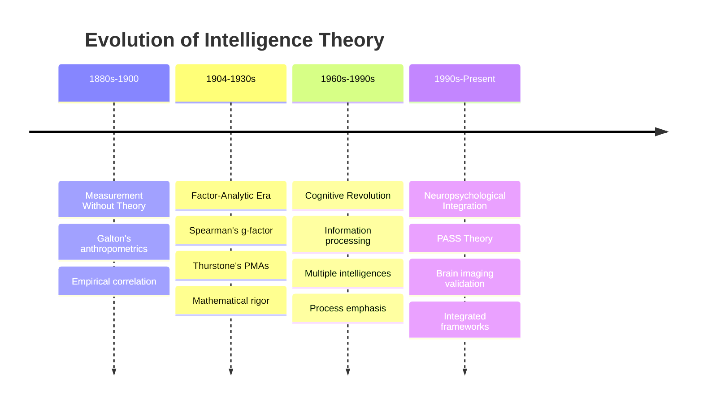
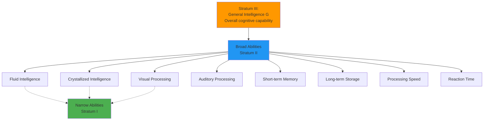

# Integration and Summary: Theories of Intelligence

## Introduction

We've journeyed through over a century of intelligence theory—from Galton's anthropometric measurements to Das's neuropsychologically-grounded PASS model. This final exploration integrates these diverse perspectives, examining how apparent disagreements often reflect complementary insights rather than irreconcilable contradictions.

> **Central Theme**: Intelligence theories have evolved from asking "How much?" to "What kind?" to "How does it work?"—each transition enriching rather than replacing earlier understandings.

## The Historical Arc: Three Paradigmatic Shifts

### Paradigm 1: Measurement Without Theory (1880s-1900)

**Key Figures**: Galton, Cattell, early Binet

**Approach**: Empirical testing without theoretical framework

**Assumption**: Whatever correlates with life success represents intelligence

**Tools**: Anthropometric measures, sensory discrimination, reaction time

**Limitation**: Lacked theoretical basis for test selection or interpretation

### Paradigm 2: Factor-Analytic Theories (1904-1960s)

**Key Figures**: Spearman, Thorndike, Thomson, Thurstone, Guilford

**Approach**: Mathematical analysis of test score correlations

**Question**: What is the structure of intelligence?

**Methods**: Factor analysis, correlation matrices, tetrad differences

**Achievement**: Identified both general and specific abilities

**Limitation**: Descriptive structure, not processing mechanisms

### Paradigm 3: Cognitive-Neuropsychological Synthesis (1970s-Present)

**Key Figures**: Luria, Das, Gardner, Sternberg

**Approach**: Understanding processes underlying intelligent behavior

**Question**: How does intelligence work?

**Methods**: Information processing analysis, brain imaging, cognitive tasks

**Achievement**: Process-based models with neural validation

**Strength**: Bridges description and mechanism

## Comparative Framework: Six Major Theories

| Theory | Core Concept | Structure | Methodology | Key Contribution |
|--------|--------------|-----------|-------------|------------------|
| **Spearman's Two-Factor** | General intelligence (g) + specifics (s) | Hierarchical | Factor analysis, tetrad differences | Established g-factor, mathematical rigor |
| **Thorndike's Multifactorial** | Many independent abilities | Flat (no hierarchy) | Qualitative task analysis | Recognized ability diversity |
| **Thomson's Sampling** | Common neural elements | Distributed network | Statistical modeling | Challenged reification of g |
| **Thurstone's PMAs** | Seven primary abilities | Initially flat, later hierarchical | Multiple factor analysis | Identified broad ability domains |
| **Guilford's Structure of Intellect** | 120-180 factors (operations × content × products) | Cubic model | Factor analysis | Comprehensive ability taxonomy |
| **PASS Theory** | Planning, Attention, Simultaneous, Successive | Hierarchical with integrated processes | Neuropsychological assessment | Process-based, brain-grounded |

## Theoretical Convergence: The Hierarchical Synthesis

Despite apparent conflicts, modern research reveals **convergence** toward hierarchical models:

### Carroll's Three-Stratum Theory (1993)

**[John Carroll's](https://en.wikipedia.org/wiki/John_Bissell_Carroll) monumental review** of over 460 datasets identified:

**Stratum III**: General intelligence (g)
- Accounts for correlations among broad abilities
- Predicts overall cognitive level
- Validates Spearman's core insight

**Stratum II**: 8-10 broad abilities
- Validates Thurstone's primary abilities
- Includes Cattell-Horn Gf-Gc distinction
- Represents major cognitive domains

**Stratum III**: 60-70 narrow abilities
- Specific skills and knowledge domains
- Task-specific competencies
- Detailed cognitive profile

**Historical Vindication**: Carroll's comprehensive analysis showed that **both Spearman and Thurstone were correct**—at different levels of abstraction.

### CHC Theory: Contemporary Standard

**[Cattell-Horn-Carroll (CHC) Theory](https://en.wikipedia.org/wiki/Cattell%E2%80%93Horn%E2%80%93Carroll_theory)** integrates:
- Spearman's g (though Horn questioned it)
- Cattell and Horn's Gf-Gc theory
- Thurstone's PMAs
- Carroll's comprehensive structure

**Current Status**: Most widely accepted framework; underlies modern tests (WISC-V, WAIS-IV, WJ-IV)

## Integrating Process and Structure

### Structure Theories (What)

**Spearman, Thurstone, Carroll, CHC**: Describe organization of abilities

**Strengths**:
- Empirically validated through factor analysis
- Reliable measurement
- Predict real-world outcomes
- Guide test development

**Limitations**:
- Don't explain how abilities work
- Descriptive rather than explanatory
- Limited intervention guidance

### Process Theories (How)

**PASS, Sternberg's Triarchic, Gardner's MI**: Explain mechanisms underlying intelligent behavior

**Strengths**:
- Process-focused intervention guidance
- Neuropsychological grounding
- Educational applications
- Developmental perspective

**Limitations**:
- Sometimes less psychometrically robust
- Measurement challenges
- Factor structure debates

### The Complementary Solution

**Modern Consensus**: Both structure AND process matter

| Question | Structure Answer | Process Answer |
|----------|------------------|----------------|
| Why do tests correlate? | They measure common g | They require common processes (attention, working memory, etc.) |
| Why do people differ? | They have different amounts of g and broad abilities | They differ in processing efficiency and strategies |
| How to assess? | Multi-level ability tests | Process-focused cognitive tasks |
| How to intervene? | Target weak ability areas | Train underlying processes |

**Synthesis**: Intelligence involves both:
1. **Capacity** (how much? measured by structure theories)
2. **Process** (how? explained by process theories)

## Seven Key Insights Across Theories

### 1. **The Positive Manifold Is Real**

**Phenomenon**: All cognitive tests correlate positively

**Explanations**:
- **Spearman**: Common g factor
- **Thomson**: Sampling overlapping neural elements
- **Modern neuroscience**: General network efficiency

**Implication**: Some aspect of general cognitive capability exists, however explained

### 2. **Abilities Form Hierarchies**

**Evidence**: From Spearman's recognition of group factors through Carroll's comprehensive analysis

**Structure**: 
- Broad capabilities at top
- Intermediate domains in middle
- Specific skills at bottom

**Educational Significance**: Can target intervention at appropriate level (general strategies vs. specific skills)

### 3. **Process Matters as Much as Product**

**PASS contribution**: Two people with same IQ score might achieve it through different processes

**Example**: 
- Person A: High planning, moderate coding
- Person B: Low planning, high coding
- Same score, different cognitive styles, different educational needs

### 4. **Context and Knowledge Are Integral**

**Cultural considerations**: Intelligence cannot be understood apart from context

**Knowledge base role**: PASS theory's inclusion of knowledge base acknowledges this

**Implication**: "Culture-free" tests are impossible; "culture-fair" is the realistic goal

### 5. **Multiple Abilities Are Both Independent and Related**

**Paradox resolution**: 
- Abilities have unique variance (specific factors, group factors)
- Abilities also share variance (g factor, common processes)
- **Both are true simultaneously**

**Statistical reality**: Correlation doesn't mean identity

### 6. **Neural Architecture Constrains and Enables**

**Modern imaging validates**:
- Luria's functional units (PASS foundation)
- Distributed networks (Thomson's sampling)
- Regional specialization (Thurstone's PMAs)
- General efficiency factors (Spearman's g)

**Brain-based perspective**: Intelligence reflects both:
- Specific regional capabilities
- Network integration efficiency

### 7. **Plasticity and Stability Coexist**

**Stability**: General cognitive capability shows moderate-to-high stability across lifespan

**Plasticity**: 
- Specific skills trainable
- Strategies learnable
- Processing efficiency improvable
- Environmental enrichment matters

**Practical implication**: While core capacity has limits, performance within that capacity is highly malleable

## Contemporary Debates and Open Questions

### Does G Exist as a Psychological Reality?

**Arguments For**:
- Consistently emerges in factor analyses
- Neural correlates identified (P-FIT theory)
- Predicts real-world outcomes
- Genetic evidence for general cognitive factor

**Arguments Against**:
- Statistical artifact (Thomson's sampling)
- Multiple intelligences framework (Gardner)
- Cultural specificity concerns
- Reification worries

**Current Consensus**: G exists as a useful statistical construct with neural correlates, but shouldn't be reified as a "thing" or sole explanation of intelligence

### How Many Intelligences?

**Positions**:
- **Spearman (original)**: 1 general + infinite specifics
- **Thurstone**: 7-13 primary abilities
- **Guilford**: 120-180 factors
- **Gardner**: 8-9 independent intelligences
- **Carroll/CHC**: 1 general + 8-10 broad + 70 narrow
- **PASS**: 4 processes + knowledge base

**Resolution**: Depends on level of analysis and purpose:
- **Practical assessment**: 4-10 major dimensions sufficient
- **Research**: More fine-grained distinctions useful
- **Theory**: Multiple levels simultaneously valid

### Can Intelligence Be Increased?

**Evidence for Malleability**:
- Flynn Effect (3 points/decade IQ increase)
- Successful interventions (early childhood education, cognitive training)
- Brain plasticity throughout lifespan
- Environmental enrichment effects

**Evidence for Stability**:
- High heritability (.50-.80 in adults)
- Limited transfer from training
- Rank-order stability over time
- Genetic constraints on maximum

**Nuanced View**: 
- **Core capacity**: Relatively stable but not fixed
- **Expression of capacity**: Highly influenced by environment, education, practice
- **Practical interventions**: Can significantly improve within genetic potential

## Practical Applications: An Integrated Approach

### Educational Assessment

**Use Multiple Perspectives**:

1. **Overall Level** (g-based): Indicates general learning capacity
2. **Ability Profile** (CHC broad factors): Identifies relative strengths/weaknesses
3. **Process Analysis** (PASS): Reveals how student approaches learning
4. **Contextual Factors**: Cultural background, prior learning, motivation

**Example Application**:
- Student has average Full-Scale IQ (g-estimate)
- Profile shows high visual-spatial (CHC Gv) but low processing speed (CHC Gs)
- PASS reveals strong simultaneous but weak successive processing
- **Intervention**: Use visual organizers (strength) and explicitly teach sequential strategies (weakness); provide extended time for processing speed limitations

### Clinical Diagnosis

**Integrated Assessment**:

| Component | Information Gained | Clinical Use |
|-----------|-------------------|--------------|
| G-estimate | Overall cognitive level | Severity determination, baseline |
| CHC profile | Ability pattern | Specific deficit identification |
| PASS processes | Processing strengths/weaknesses | Intervention planning |
| Achievement | Real-world performance | Discrepancy analysis |

**Learning Disability Example**:
- g-estimate: High average (no global impairment)
- CHC: Low auditory processing
- PASS: Weak successive processing
- Achievement: Reading decoding difficulties
- **Conclusion**: Specific learning disability in reading (phonological processing deficit)

### Workplace Applications

**Personnel Selection**: 
- G-loading of job predicts how much general intelligence matters
- Specific abilities needed vary by occupation
- Training potential requires adequate g
- Performance optimization requires matching abilities to tasks

**Team Composition**:
- Cognitive diversity beneficial for complex problems
- Process complementarity (strong planners + strong implementers)
- Ability balance across team members

### Intervention Design

**Process-Based Approaches** (from PASS):
- Target underlying cognitive processes
- Strategy instruction and metacognition
- Scaffolding for weak processes
- Leverage strong processes

**Content-Based Approaches** (from CHC):
- Build specific knowledge and skills
- Domain-specific practice
- Compensatory approaches for weak abilities
- Strength-based learning

**Integrated Model**: Combine both for optimal outcomes

## Future Directions

### Emerging Research Areas

**1. Precision Cognitive Assessment**
- Computer-adaptive testing
- Momentary assessment (daily functioning)
- Multi-modal measurement (behavioral + neural + genetic)

**2. Neuroscience Integration**
- Brain connectivity mapping
- Real-time neural feedback
- Brain stimulation interventions
- Genetic-neural-cognitive pathways

**3. Cultural and Contextual Models**
- Indigenous intelligence concepts
- Context-specific competencies
- Dynamic assessment approaches
- Cultural neuroscience perspectives

**4. Artificial Intelligence Insights**
- Machine learning algorithms paralleling human cognition
- AI performance on human intelligence tasks
- Hybrid human-AI cognitive systems

**5. Lifespan Development**
- Cognitive trajectories across lifespan
- Aging and cognitive change
- Developmental optimization
- Intergenerational transmission

## Exam Preparation Guide

### High-Yield Comparison Points

**Spearman vs. Thurstone**:
- Population sampling (random vs. university students)
- Test selection (dissimilar vs. similar clusters)
- Statistical method (tetrad differences vs. multiple factor analysis)
- Resolution (hierarchical model integrating both)

**Structure vs. Process Theories**:
- Structure: What abilities exist? (Spearman, Thurstone, Carroll)
- Process: How does intelligence work? (PASS, Sternberg, Gardner)
- Integration: Both needed for complete understanding

**G-Factor Debates**:
- Spearman: Real entity ("mental energy")
- Thomson: Statistical result of sampling
- Thurstone (early): Doesn't exist
- Thurstone (later): Emerges from correlated PMAs
- Modern: Useful construct with neural correlates

### Critical Analysis Framework

**For any intelligence theory, evaluate**:

1. **Theoretical basis**: What assumptions underlie it?
2. **Methodology**: How was it developed/validated?
3. **Empirical support**: What evidence supports/contradicts it?
4. **Practical utility**: What applications does it enable?
5. **Limitations**: What doesn't it explain?
6. **Integration**: How does it relate to other theories?

### Common Exam Questions

**Compare and Contrast**: Two theories (structure, methods, applications)

**Critical Evaluation**: Strengths and limitations of specific theory

**Historical Development**: Evolution from one theory to another

**Integration**: How different theories complement each other

**Application**: Using theory to solve practical problem

## Memory Aids for Integration

### Theory Evolution Mnemonic: **"GPTTN-C-P"**

- **G**alton: Measurement begins
- **P**earson: Statistics developed
- **T**wo-factor: Spearman's theory
- **T**horndike: Multifactorial challenge
- **N**europsychological: Luria's systems
- **C**arroll: Comprehensive synthesis
- **P**ASS: Process integration

### Key Theorist Contributions: **"Smart People Think Through Novel Cognitive Processes Differently"**

- **S**pearman: G-factor and factor analysis
- **P**earson: Correlation methods
- **T**horndike: Multiple abilities
- **T**homson: Sampling theory
- **N**otable: Factor debates
- **C**arroll: Three-stratum hierarchy
- **P**ASS: Process-based model
- **D**evelopment: Ongoing integration

### Integration Framework: **"SHIP"**

- **S**tructure theories (CHC hierarchy)
- **H**ow it works (Process theories like PASS)
- **I**ndividual differences (Both capacity and strategy)
- **P**ractical applications (Assessment and intervention)

## Self-Assessment Questions

### Comprehensive Understanding

1. **Trace the evolution of intelligence theory from Galton to PASS. What paradigmatic shifts occurred and why?**

2. **"The debate between Spearman and Thurstone was resolved through synthesis rather than victory." Explain this statement with reference to Carroll's three-stratum theory.**

3. **Compare factor-analytic approaches (Spearman, Thurstone) with neuropsychological approaches (PASS). What different questions does each answer?**

### Integration and Analysis

4. **A researcher finds that all their cognitive tests correlate positively. Provide three different theoretical explanations for this finding (from Spearman, Thomson, and a modern neuroscience perspective).**

5. **Design an assessment battery that integrates insights from both CHC theory and PASS theory. Justify your selection of tests.**

6. **Two students have identical Full-Scale IQ scores of 110 but very different PASS profiles. Explain how this is possible and what educational implications follow.**

### Critical Thinking

7. **"Intelligence tests measure what intelligence tests measure" (Boring, 1923). In light of contemporary theory and neuroscience, is this operational definition adequate? Defend your position.**

8. **Some cultures emphasize relational thinking and group harmony as signs of intelligence, while Western tests emphasize abstract reasoning and individual problem-solving. How do different theories handle this cultural variation?**

### Application

9. **A school psychologist must choose between a traditional IQ test (CHC-based) and the CAS (PASS-based) for assessing learning difficulties. What factors should guide this choice?**

10. **Design an intervention program for students with reading difficulties. Draw on insights from at least three different intelligence theories to justify your approach.**

## Conclusion: Unity in Diversity

The history of intelligence theory demonstrates that scientific progress often involves **integration rather than replacement**. Spearman didn't eliminate the value of specific abilities; Thurstone didn't disprove g; PASS doesn't invalidate factor analysis. Instead, each theoretical advance:

1. **Reveals new dimensions** of intelligence
2. **Enriches measurement** approaches  
3. **Expands practical applications**
4. **Raises new questions** for research

**The Contemporary View**: Intelligence is simultaneously:
- **One thing** (general cognitive capability)
- **Several things** (broad ability domains)
- **Many things** (specific skills and knowledge)
- **A process** (how cognition works)
- **Brain-based** (neural network properties)
- **Context-embedded** (cultural and environmental)

This multifaceted understanding, built through a century of research and debate, provides the foundation for effective assessment, education, and cognitive enhancement in the 21st century.

---

**Source PDFs**:
- 📄 [Block-2/Unit-1.pdf - Complete Unit](/pdfs/MPC-001%20Cognitive%20Psychology,%20Learning%20and%20Memory/Block-2/Unit-1.pdf)
- 📚 MPC-001 Cognitive Psychology, Learning and Memory

## Comprehensive Reading List

### Essential Foundational Works
- Spearman, C. (1904). General intelligence objectively determined and measured. *American Journal of Psychology*, 15, 201-292
- Thurstone, L. L. (1938). *Primary Mental Abilities*. University of Chicago Press
- Luria, A. R. (1973). *The Working Brain*. Basic Books

### Contemporary Syntheses
- Carroll, J. B. (1993). *Human Cognitive Abilities*. Cambridge University Press
- Jensen, A. R. (1998). *The g Factor*. Praeger
- Das, J. P., Naglieri, J. A., & Kirby, J. R. (1994). *Assessment of Cognitive Processes*. Allyn & Bacon

### Integrative Perspectives
- Sternberg, R. J., & Grigorenko, E. L. (Eds.). (2002). *The General Factor of Intelligence: How General Is It?* Erlbaum
- McGrew, K. S. (2009). CHC theory and the human cognitive abilities project. *Intelligence*, 37, 1-10
- Deary, I. J., Penke, L., & Johnson, W. (2010). The neuroscience of human intelligence differences. *Nature Reviews Neuroscience*, 11, 201-211

### Video Resources
- [The Neuroscience of Intelligence](https://www.youtube.com/watch?v=FfDXIJnH8WU) - Richard Haier
- [Intelligence: History and Debates](https://www.youtube.com/watch?v=jSo5v5t4OQM) - Comprehensive lecture series
- [PASS Theory in Practice](https://www.youtube.com/results?search_query=pass+theory+intelligence) - Educational applications
