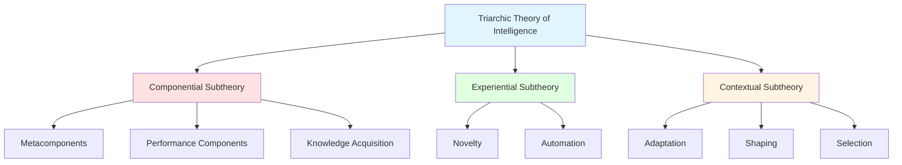
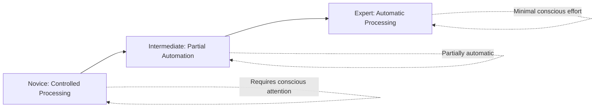

# Sternberg's Triarchic Theory of Intelligence

## Introduction

Robert Sternberg's **Triarchic Theory of Intelligence**, also known as the **Theory of Successful Intelligence**, represents one of the most comprehensive and contextually grounded approaches to understanding human cognitive abilities. Proposed in 1985, this theory argues that intelligence cannot be understood by examining test scores alone, but must be evaluated in terms of how effectively individuals adapt to, shape, and select their environments using three distinct yet interrelated types of abilities: **analytical, creative, and practical**.

Unlike theories that focus solely on academic problem-solving (IQ tests) or that fragment intelligence into multiple independent domains (Gardner's MI), Sternberg's theory provides an **integrated framework** that explains how intelligence operates in real-world contexts where academic, creative, and practical abilities work together to produce successful outcomes.

## Robert J. Sternberg: The Scholar

### Biographical Background

**Robert Jeffrey Sternberg** was born on **December 8, 1949** and has established himself as one of psychology's most influential scholars:

#### Academic Journey
- **B.A. Degree**: Yale University
- **Ph.D.**: Stanford University (supervisor: **Gordon Bower**)
- **Postdoctoral Work**: Extensive research on intelligence, creativity, wisdom

#### Professional Positions
- **IBM Professor of Psychology and Education** at Yale University
- **Dean of Arts and Sciences** at Tufts University
- **Provost** at Oklahoma State University
- **President** of the American Psychological Association

#### Academic Recognition
- **10 Honorary Doctorates**: From universities in North America, South America, and Europe
- **Honorary Professorate**: University of Heidelberg, Germany
- **Distinguished Associate**: The Psychometrics Centre, University of Cambridge

### Theoretical Motivation

Sternberg developed his theory because he felt that **previous theories were not incorrect, but incomplete**. Specifically:

1. **Psychometric Theories**: Focused too narrowly on test-taking abilities
2. **Gardner's Theory**: Identified multiple intelligences but didn't explain their interaction
3. **Information-Processing Theories**: Explained cognitive mechanisms but lacked real-world context
4. **Contextual Approaches**: Emphasized culture but neglected cognitive processes

Sternberg sought to **synthesize these perspectives** into a comprehensive theory that would:
- Explain the **mental processes** underlying intelligent behavior
- Account for the role of **experience** in intelligence
- Recognize the **cultural context** that defines what counts as intelligent

## The Triarchic Framework: Overview

The triarchic theory consists of **three interrelated subtheories**, each addressing a different aspect of intelligence:



### Integration of the Three Subtheories

According to Sternberg, **a complete explanation of intelligence** requires understanding:

1. **How intelligence is generated** (Componential Subtheory)
2. **When intelligent behavior is displayed** (Experiential Subtheory)
3. **What behaviors count as intelligent** (Contextual Subtheory)

These three aspects are **not separate intelligences** but different perspectives on a unified phenomenon. True intelligence involves the **coordinated operation** of all three subtheories.

## Componential Subtheory: Analytical Intelligence

### Definition

The **Componential Subtheory** addresses the **internal mental mechanisms** that underlie intelligent behavior. It focuses on:
- **How** we process information
- **What cognitive components** we use
- **How components work together** to solve problems

This aspect is often called **analytical intelligence** or **academic problem-solving ability**.

### The Three Types of Components

#### 1. **Metacomponents** (Executive Processes)

**Definition**: Higher-order control processes that plan, monitor, and evaluate cognitive performance.

**Functions**:
- **Problem Recognition**: Identifying that a problem exists
- **Problem Definition**: Clarifying the nature of the problem
- **Strategy Selection**: Choosing an approach to solve the problem
- **Resource Allocation**: Deciding how to distribute time and mental energy
- **Monitoring**: Tracking progress during problem-solving
- **Evaluation**: Assessing the effectiveness of strategies and solutions

**Real-World Example**: 
A student preparing for an exam:
- **Recognizes** the exam is challenging (metacognitive awareness)
- **Defines** which topics need the most attention
- **Selects** study strategies (flashcards vs. practice problems)
- **Allocates** more time to difficult topics
- **Monitors** understanding through self-testing
- **Evaluates** readiness and adjusts study plan

**Metacomponents as Executive Functions**: 
These are the "boss" of cognition—they tell the other components what to do but don't actually execute tasks themselves.

#### 2. **Performance Components** (Execution Processes)

**Definition**: The basic cognitive operations that actually execute the instructions of metacomponents.

**Functions**:
- **Encoding**: Perceiving and representing information
- **Inferring Relations**: Identifying connections between stimuli
- **Mapping**: Applying relationships to new situations
- **Application**: Using stored knowledge
- **Comparison**: Evaluating similarities and differences
- **Justification**: Selecting and defending an answer
- **Response**: Producing output

**Real-World Example**:
Solving an analogy problem ("Dog is to Puppy as Cat is to ___"):
1. **Encode** the terms (understand what dog, puppy, cat mean)
2. **Infer** the relationship (adult to offspring)
3. **Map** the relationship to the second pair
4. **Apply** knowledge to find the answer
5. **Compare** possible answers (kitten vs. tiger)
6. **Justify** the best answer (kitten)
7. **Respond** with the answer

**Performance Components as Workers**: 
These are the cognitive "laborers" that actually do the work of thinking.

#### 3. **Knowledge Acquisition Components** (Learning Processes)

**Definition**: Processes used to learn new information and store it in memory.

**Functions**:
- **Selective Encoding**: Filtering relevant from irrelevant information
- **Selective Combination**: Integrating relevant information into a coherent whole
- **Selective Comparison**: Relating new information to existing knowledge

**Real-World Example**:
Reading a textbook chapter:
- **Selective Encoding**: Recognizing key concepts while ignoring tangential details
- **Selective Combination**: Connecting the key ideas into a unified understanding
- **Selective Comparison**: Linking new concepts to previously learned material

**Knowledge Acquisition as Growth**: 
These components enable us to expand our cognitive capabilities over time.

### Integration of Component Types

**Critical Insight**: The three component types work together:

1. **Metacomponents** decide what strategy to use
2. **Performance components** execute the strategy
3. **Knowledge acquisition components** learn from the experience
4. **Feedback loops**: Results inform future metacomponent decisions

**Example: Learning to Drive**:
- **Metacomponents**: Decide to focus on steering, then shifting, then integration
- **Performance**: Actually steering, shifting, checking mirrors
- **Knowledge Acquisition**: Learning which cues indicate when to shift gears
- **Feedback**: Rough shifting indicates need to adjust timing

### Relationship to Traditional IQ

The componential subtheory corresponds most closely to what **traditional IQ tests measure**:
- Analytical reasoning
- Problem-solving speed
- Academic performance

However, Sternberg emphasizes this is **only one aspect of intelligence**, not intelligence itself.

## Experiential Subtheory: Creative Intelligence

### Definition

The **Experiential Subtheory** addresses intelligence in relation to **experience with tasks and situations**. It focuses on:
- How intelligence is applied to **novel tasks** (unfamiliar situations)
- How intelligence is demonstrated through **automation** (expert performance)

This aspect is often called **creative intelligence**.

### The Two Facets of Experience

#### 1. **Dealing with Novelty**

**Definition**: The ability to effectively handle new and unusual situations by generating insightful, creative solutions.

**Characteristics**:
- Thinking "outside the box"
- Seeing connections others miss
- Generating novel solutions
- Adapting to unfamiliar contexts
- Creative problem-solving

**Why Novelty Matters**:
Intelligence is most critically engaged when:
- Situations are **unfamiliar** (no routine response available)
- Problems require **creative insight** (standard solutions won't work)
- Tasks demand **flexible thinking** (rigid approaches fail)

**Real-World Examples**:

**Scientific Discovery**:
- Einstein's thought experiments (imagining riding on a light beam)
- Darwin's novel connection between species variation and environmental pressure
- Watson and Crick seeing DNA structure from X-ray patterns

**Everyday Novelty**:
- First day at a new job: figuring out unwritten social rules
- Unexpected car breakdown: improvising a temporary fix
- New technology: quickly learning to use an unfamiliar device

**Creative Arts**:
- Picasso's development of Cubism (novel artistic perspective)
- Jazz improvisation (creating new musical ideas in real-time)

**Assessment Challenge**: 
Traditional IQ tests often fail to measure this aspect because:
- Test items become familiar through practice
- "Correct" answers are predefined
- Creative responses may be marked wrong

#### 2. **Automation of Processing**

**Definition**: The ability to automatize well-learned tasks, freeing cognitive resources for other demands.

**Characteristics**:
- Efficient processing of familiar information
- Executing complex tasks with minimal conscious attention
- Parallel processing of multiple activities
- Expert performance

**Why Automation Matters**:
Intelligence is demonstrated when individuals:
- **Move from conscious to automatic processing** efficiently
- **Free cognitive resources** for higher-level thinking
- **Perform complex tasks** that overwhelm beginners

**The Learning Curve**:



**Real-World Examples**:

**Driving**:
- **Novice**: Consciously thinks about every action (checking mirrors, signaling, steering)
- **Expert**: Drives automatically while conversing, planning the day, or listening to podcasts

**Reading**:
- **Beginner**: Laboriously decodes each letter and word
- **Fluent Reader**: Automatically processes text, focusing on meaning rather than decoding

**Professional Expertise**:
- **Novice Chess Player**: Must consciously analyze each possible move
- **Chess Master**: Recognizes patterns automatically, instantly seeing strategic possibilities

**Medical Diagnosis**:
- **Medical Student**: Methodically works through diagnostic algorithms
- **Experienced Physician**: Automatically recognizes symptom patterns, quickly generating differential diagnoses

### The Relationship Between Novelty and Automation

**Key Insight**: These two facets exist on a **continuum of experience**:

1. **Novel Situation** → Requires conscious, creative problem-solving
2. **Intermediate Familiarity** → Mix of conscious and automatic processing
3. **Highly Familiar** → Automatic, efficient execution

**Independence of Skills**:
Being skilled in one facet doesn't guarantee skill in the other:

- **High Novelty, Low Automation**: Creative person who struggles to develop expertise
- **Low Novelty, High Automation**: Expert in familiar domain who struggles with new situations
- **Optimal Intelligence**: Both novelty handling AND efficient automation

**Practical Implications**:

**Education**:
- Need both exposure to **novel challenges** (creativity) and **practice for mastery** (automation)
- Balance between exploration and consolidation

**Career Performance**:
- **Innovation roles** require high novelty handling (R&D, entrepreneurship)
- **Expert roles** require high automation (surgery, air traffic control)
- **Many roles** require both (management, teaching)

## Contextual Subtheory: Practical Intelligence

### Definition

The **Contextual Subtheory** addresses intelligence in relation to the **external world**. It focuses on:
- How intelligence enables **adaptation** to real-world environments
- The role of **culture and context** in defining intelligent behavior
- Practical problem-solving in everyday life

This aspect is often called **practical intelligence** or **"street smarts."**

### The Three Processes of Contextual Intelligence

#### 1. **Adaptation**

**Definition**: Modifying oneself to fit the demands of the environment.

**When Adaptation Occurs**:
- Environment is generally satisfactory but requires adjustments
- Changing the environment is not feasible
- Leaving the environment is not desirable

**Characteristics**:
- Behavioral flexibility
- Learning from environment
- Adjusting strategies to context
- Cultural conformity (when appropriate)

**Real-World Examples**:

**Physical Environment**:
- Wearing warmer clothing when temperature drops
- Adjusting sleep schedule to new time zone
- Learning to navigate a new city's public transportation

**Social Environment**:
- Adopting communication styles of new workplace
- Learning unwritten rules of social group
- Adjusting behavior to cultural norms when traveling

**Academic Environment**:
- Identifying what each professor values in assignments
- Adapting study methods to different subject areas
- Learning to work within institutional requirements

**Cognitive Adaptation**:
- **Accommodating** new information that challenges existing beliefs
- **Assimilating** experiences into existing mental schemas

#### 2. **Shaping**

**Definition**: Modifying the environment to better suit one's needs, goals, and abilities.

**When Shaping Occurs**:
- Environment is changeable
- Individual has power to influence context
- Adaptation alone is insufficient
- Staying in environment is desired

**Characteristics**:
- Proactive change
- Environment modification
- Creating opportunities
- Leadership and influence

**Real-World Examples**:

**Workplace Shaping**:
- **Teacher** introduces new classroom rule (raising hands to speak) to minimize disruptions
- **Manager** restructures team workflow to increase efficiency
- **Employee** proposes flexible work schedule to accommodate personal needs

**Social Shaping**:
- **Family Member** establishes new household routines
- **Community Leader** organizes neighborhood improvement project
- **Friend** suggests new activities to reshape group dynamics

**Physical Shaping**:
- Rearranging office for better workflow
- Modifying home for accessibility needs
- Creating garden to transform outdoor space

**Institutional Shaping**:
- Advocating for policy changes
- Innovating new approaches to traditional problems
- Entrepreneurship (creating new business environments)

#### 3. **Selection**

**Definition**: Leaving an unsatisfactory environment and choosing or creating a new one.

**When Selection Occurs**:
- Current environment is fundamentally unsuitable
- Adaptation has failed or is impossible
- Shaping is not feasible or has been unsuccessful
- Alternative environments are available

**Characteristics**:
- Recognition of incompatibility
- Search for alternatives
- Decisive action
- Fresh start

**Real-World Examples**:

**Career Selection**:
- Leaving job that doesn't match skills or values
- Changing careers after realizing poor fit
- Seeking new position with better alignment

**Educational Selection**:
- Transferring to school that better matches learning style
- Changing majors to pursue true interests
- Seeking alternative educational pathways

**Geographic Selection**:
- **Immigration**: Leaving homeland for better economic/social opportunities
- **Migration**: Moving for climate, culture, or quality of life
- **Relocation**: Changing cities for career advancement

**Relationship Selection**:
- Ending toxic relationships
- Seeking new social groups
- Moving to be near supportive community

**Practical Consideration**: 
Selection requires:
- **Awareness** of environment-person mismatch
- **Courage** to make difficult changes
- **Resources** to enable transition
- **Viable alternatives**

### The Integrated Use of Adaptation, Shaping, and Selection

**Strategic Intelligence**: Knowing which approach to use when:

1. **Start with Adaptation** (least disruptive)
   - Try to adjust to environment first
   - Develop necessary skills or behaviors

2. **Progress to Shaping** (if adaptation insufficient)
   - Attempt to modify environment
   - Create better fit through change

3. **Resort to Selection** (if all else fails)
   - Recognize when situation is untenable
   - Find or create new environment

**Example: Unsatisfying Job**:
- **Adaptation**: Learn new skills, adjust attitude, change work style
- **Shaping**: Propose new projects, request role modification, improve team dynamics
- **Selection**: Seek new job or career change

**Cultural Intelligence**: 
The three processes look different across cultures:
- **Individualistic Cultures**: More emphasis on shaping and selection
- **Collectivistic Cultures**: Greater emphasis on adaptation

## The Theory of Successful Intelligence

### Defining Successful Intelligence

Sternberg's complete theory, often called the **Theory of Successful Intelligence**, proposes:

> "Intelligent behavior arises from a **balance** between analytical, creative, and practical abilities, functioning collectively to allow individuals to achieve success within particular sociocultural contexts."

### The Balance of Abilities

**Key Principles**:

1. **No Single Intelligence**: Success requires multiple abilities working together
2. **Individual Patterns**: People have different profiles of strengths
3. **Contextual Success**: "Success" is defined within specific cultural contexts
4. **Strategic Compensation**: Use strengths to compensate for weaknesses

### Profiles of Successful Intelligence

#### **High Analytical, Low Creative/Practical**
- **Strengths**: Academic performance, test-taking, logical analysis
- **Weaknesses**: Innovation, real-world application
- **Career Fit**: Research, analysis, traditional academics
- **Strategy**: Develop practical applications; seek creative partners

#### **High Creative, Low Analytical/Practical**
- **Strengths**: Innovation, novel ideas, artistic expression
- **Weaknesses**: Evaluation of ideas, implementation
- **Career Fit**: Arts, design, idea generation
- **Strategy**: Partner with analytical/practical collaborators

#### **High Practical, Low Analytical/Creative**
- **Strengths**: Real-world problem-solving, "street smarts"
- **Weaknesses**: Academic testing, innovation
- **Career Fit**: Skilled trades, sales, management
- **Strategy**: Value experiential learning; seek formal education when needed

#### **Balanced Profile**
- **Strengths**: Versatility across contexts
- **Approach**: Can analyze, create, and implement
- **Career Fit**: Leadership, entrepreneurship, complex roles
- **Advantage**: Adaptability to varied demands

### Achieving Success Through Intelligence

**Sternberg's Formula for Success**:

```
Successful Intelligence = 
  Analytical Ability (understand and evaluate) +
  Creative Ability (innovate and generate) +
  Practical Ability (implement and apply)
  ────────────────────────────────────────
  Applied in Appropriate Contexts
```

**Steps to Success**:

1. **Know Your Profile**: Identify your strengths and weaknesses
2. **Capitalize on Strengths**: Use strong abilities maximally
3. **Compensate for Weaknesses**: Develop strategies or seek support
4. **Choose Favorable Contexts**: Select environments that value your strengths
5. **Shape When Possible**: Modify environments to better fit your abilities
6. **Adapt When Necessary**: Develop weaker areas when context demands
7. **Select Strategically**: Change environments when truly necessary

### Implications for Education

**Traditional Education Problems**:
- Over-emphasizes analytical intelligence
- Neglects creative and practical abilities
- Values test performance over real-world success
- One-size-fits-all instruction

**Triarchic Instruction Recommendations**:

1. **Teach for All Three Intelligences**:
   - **Analytical**: Traditional analysis, compare/contrast, critique
   - **Creative**: Invent, design, imagine, suppose
   - **Practical**: Apply, use, implement, demonstrate

2. **Assess All Three**:
   - **Analytical Tests**: Traditional exams and essays
   - **Creative Products**: Projects, designs, innovations
   - **Practical Applications**: Real-world problem-solving, demonstrations

3. **Value Multiple Paths**:
   - Recognize different routes to understanding
   - Allow students to leverage strengths
   - Develop all three abilities in each student

**Example: Teaching American Revolution**:

| Intelligence Type | Learning Activity |
|------------------|-------------------|
| **Analytical** | Compare/contrast causes of revolution; evaluate historical arguments |
| **Creative** | Design alternative history scenarios; create revolutionary propaganda |
| **Practical** | Apply revolutionary principles to modern issues; demonstrate protest strategies |

## Comparison with Other Theories

### vs. Traditional IQ

| Aspect | IQ Tests | Triarchic Theory |
|--------|----------|------------------|
| **Focus** | Academic abilities | Analytical, Creative, Practical |
| **Assessment** | Standardized tests | Multiple methods including real-world performance |
| **Scope** | Narrow | Broad, contextual |
| **Prediction** | Academic success | Real-world success |

### vs. Gardner's MI Theory

| Aspect | Gardner | Sternberg |
|--------|---------|-----------|
| **Structure** | 9 independent intelligences | 3 interdependent facets |
| **Emphasis** | Domains of intelligence | Processes of intelligence |
| **Integration** | Intelligences often work together | Must work together |
| **Emotions** | Part of personal intelligences | Distinct from intelligence |

**Fundamental Difference**:
- **Gardner**: Intelligence is domain-specific (musical intelligence, bodily-kinesthetic intelligence, etc.)
- **Sternberg**: Intelligence is process-based (analyzing, creating, applying in any domain)

## Criticisms and Limitations

### 1. **Empirical Challenges**

**Linda Gottfredson (2003)**:
> Traditional intelligence tests show moderate correlation with income, especially at middle age. Sternberg's claim that they don't measure practical intelligence is absurd given this evidence.

**Concerns**:
- Practical intelligence may simply be **task-specific knowledge**
- Not a broad cognitive ability
- Domain-specific rather than general

### 2. **Measurement Difficulties**

**J.P. Das (2004)**:
> "The major difficulty in Sternberg's theory is in translating them to psychometric instruments for the measurement of cognitive abilities" (p. 12)

**Challenges**:
- Difficult to operationalize creative and practical intelligence
- Assessment instruments under development
- Less validated than traditional IQ tests

### 3. **Creativity as Separate?**

- Research questions whether creativity is truly independent of analytical intelligence
- High IQ correlates with creative achievement
- May be product of high analytical intelligence, not separate ability

### 4. **Practical Intelligence Debate**

**Questions**:
- Is "practical intelligence" just learned skills for specific contexts?
- Does it predict success beyond what IQ predicts?
- Is it intelligence or simply experience and knowledge?

### 5. **Complexity**

- Theory requires understanding three subtheories
- Each subtheory has multiple components
- May be difficult to apply in practice
- More complex than simpler models

## Strengths and Contributions

### 1. **Comprehensive Framework**

- Integrates **cognitive processes** (componential)
- Accounts for **experience** (experiential)
- Recognizes **context** (contextual)
- Provides complete picture of intelligence

### 2. **Real-World Relevance**

- Emphasizes **practical success**, not just test scores
- Recognizes **creativity** as crucial
- Values **adaptation** and problem-solving in context
- Predicts **life outcomes**, not just academic performance

### 3. **Educational Applications**

- Informs **curriculum design**
- Guides **instructional methods**
- Supports **differentiated assessment**
- Promotes **balanced development**

### 4. **Cultural Sensitivity**

- Recognizes **cultural definitions** of intelligence
- Emphasizes **contextual adaptation**
- Values diverse forms of success
- Reduces Western academic bias

### 5. **Bridges Research and Practice**

- Connects cognitive science to real-world functioning
- Integrates multiple research traditions
- Provides practical framework for assessment and intervention

## Contemporary Applications

### **Career Counseling**
- Assess analytical, creative, practical strengths
- Match profiles to career demands
- Guide professional development

### **Educational Reform**
- Develop balanced curricula
- Create diverse assessments
- Support varied learning pathways

### **Leadership Development**
- Identify different leadership styles
- Develop complementary abilities
- Build balanced teams

### **Organizational Psychology**
- Match employees to roles
- Design training programs
- Evaluate performance comprehensively

## Conclusion

Sternberg's **Triarchic Theory of Intelligence** represents a sophisticated, comprehensive approach to understanding human cognitive abilities. By integrating:
- **Internal cognitive processes** (componential subtheory)
- **Role of experience** (experiential subtheory)
- **Real-world contexts** (contextual subtheory)

The theory provides a **holistic framework** that captures intelligence as it actually functions in life, not just in testing situations.

While the theory faces legitimate challenges regarding empirical validation and measurement, its core insights remain valuable:
- Intelligence is **multifaceted** (analytical, creative, practical)
- Intelligence is **contextual** (culture and environment matter)
- Intelligence is **actionable** (can be developed and applied strategically)

The theory's greatest contribution may be shifting focus from "How smart are you?" to **"How are you smart, and how can you use your intelligence successfully?"**

As research continues, Sternberg's triarchic framework offers a promising pathway toward understanding intelligence not as an abstract test score, but as a **practical tool for achieving success** in the diverse contexts of human life.

---

## Key Takeaways

1. **Three Subtheories**: Componential (analytical), Experiential (creative), Contextual (practical)
2. **Componential**: Metacomponents, Performance components, Knowledge acquisition components
3. **Experiential**: Novelty handling and automation of processing
4. **Contextual**: Adaptation, shaping, and selection of environments
5. **Successful Intelligence**: Balance of analytical, creative, and practical abilities
6. **Real-World Focus**: Emphasis on practical success, not just test scores
7. **Educational Applications**: Teaching and assessing all three intelligences

---

**Source PDFs**: 
- 📄 [Block-2/Unit-2.pdf - Pages 33-40](/pdfs/MPC-001%20Cognitive%20Psychology,%20Learning%20and%20Memory/Block-2/Unit-2.pdf)
- 📚 MPC-001 Cognitive Psychology, Learning and Memory

---

## Self-Assessment Questions

1. **Componential Analysis**: Break down a complex task (like writing a research paper) into its metacomponents, performance components, and knowledge acquisition components.

2. **Experiential Reflection**: Identify a skill you've automated over time. Describe your progression from novice to expert.

3. **Contextual Strategy**: Think of a challenging situation you faced. Did you adapt, shape, or select? Why did you choose that strategy?

4. **Profile Assessment**: Based on Sternberg's framework, what is your profile of analytical, creative, and practical intelligence? Provide specific examples.

5. **Comparative Analysis**: How does Sternberg's triarchic theory differ from Gardner's multiple intelligences in explaining human cognitive abilities?

---

## Further Exploration

- **Wikipedia**: [Triarchic Theory of Intelligence](https://en.wikipedia.org/wiki/Triarchic_theory_of_intelligence)
- **Book**: Sternberg, R.J. (1985). *Beyond IQ: A Triarchic Theory of Human Intelligence*
- **Research**: Explore studies on successful intelligence in real-world contexts
- **Application**: Investigate triarchic instruction methods in education
