# Comparing Intelligence Theories: Guilford, Gardner, and Sternberg

## Introduction

The 20th century witnessed a profound shift in how psychologists conceptualize intelligence. Moving away from the **unitary view** (Spearman's g-factor) and **simple factorial models** (Thurstone's primary abilities), three theorists—**J.P. Guilford**, **Howard Gardner**, and **Robert Sternberg**—proposed comprehensive frameworks that recognize intelligence as **multifaceted and complex**.

This comparative analysis explores:
- **Common ground**: What do these theories share?
- **Critical differences**: How do they diverge?
- **Theoretical foundations**: What assumptions underlie each theory?
- **Practical implications**: How do they inform education and assessment?
- **Scientific status**: How well supported are they?
- **Integration possibilities**: Can insights from all three be synthesized?

## Overview of the Three Theories

### Quick Comparison Table

| **Aspect** | **Guilford's SOI** | **Gardner's MI** | **Sternberg's Triarchic** |
|------------|-------------------|------------------|---------------------------|
| **Year Proposed** | 1956 (revised 1977) | 1983 | 1985 |
| **Number of Components** | 150 abilities | 9 intelligences | 3 facets (subtheories) |
| **Theoretical Basis** | Factor analysis | Neuropsychology, culture, development | Information processing, context |
| **Structure** | 3D Cube (Contents × Operations × Products) | Independent domains | Integrated subtheories |
| **Focus** | Cognitive abilities and operations | Domains of competence | Processes and contexts |
| **Emphasis** | Divergent thinking, creativity | Multiple talents, cultural value | Successful real-world functioning |
| **Primary Application** | Psychometrics, cognitive assessment | Education, curriculum design | Practical success, real-world adaptation |

## Theoretical Foundations

### 1. **Core Philosophical Assumptions**

#### **Guilford's SOI Theory**

**Foundational Belief**: Intelligence consists of numerous **specific, relatively independent** cognitive operations that can be systematically mapped.

**Key Assumptions**:
- Intelligence is **multifactorial** (not a single g)
- Abilities are **orthogonal** (independent)
- Mental operations can be **categorized systematically**
- **Factor analysis** reveals structure of mind
- Intelligence is primarily **cognitive/mental**

**Metaphor**: The mind as a **three-dimensional matrix** or filing system with systematic organization.

#### **Gardner's MI Theory**

**Foundational Belief**: Intelligence is **domain-specific**; there are multiple distinct forms of intelligence, each with biological bases and cultural value.

**Key Assumptions**:
- Intelligences are **biologically based** (brain localization)
- Each intelligence has **evolutionary history**
- Intelligence is **culturally defined** (varies by context)
- Excellence comes in **multiple forms**, not just academic
- Intelligences are **relatively autonomous** but work together

**Metaphor**: The mind as a **toolkit** with different specialized tools for different problems.

#### **Sternberg's Triarchic Theory**

**Foundational Belief**: Intelligence is best understood as the ability to achieve **success in life** through a balance of **analytical, creative, and practical** abilities applied within specific contexts.

**Key Assumptions**:
- Intelligence is **multifaceted** but **integrated**
- Context determines what counts as **"intelligent"**
- Intelligence involves **mental processes** (not just domains)
- Real-world success requires **multiple abilities working together**
- Intelligence is **contextually adaptive**

**Metaphor**: The mind as an **adaptive problem-solving system** that analyzes, creates, and applies knowledge within environments.

### 2. **Methodology and Evidence Base**

#### **Guilford: Psychometric/Factor-Analytic**

**Primary Method**: **Factor analysis** of cognitive test performance

**Evidence**:
- Statistical relationships among test scores
- Empirical verification of over 100 factors
- Controlled laboratory testing

**Strengths**:
- Rigorous statistical methodology
- Quantifiable abilities
- Systematic framework

**Limitations**:
- Relied on restricted samples
- Used orthogonal rotation (assumed independence)
- Limited ecological validity

#### **Gardner: Neuropsychological/Cross-Cultural**

**Primary Methods**: 
- **Neuropsychological case studies** (brain damage, savants)
- **Cross-cultural analysis** of valued abilities
- **Developmental research** on skill acquisition
- **Evolutionary psychology**

**Evidence**:
- Brain localization studies
- Savant and prodigy cases
- Cultural anthropology
- Evolutionary precedents

**Strengths**:
- Converging evidence from multiple sources
- Biological grounding
- Cultural sensitivity

**Limitations**:
- Limited psychometric validation
- Difficult to measure independently
- More descriptive than predictive

#### **Sternberg: Information Processing/Contextual**

**Primary Methods**:
- **Cognitive task analysis** (reaction time, error patterns)
- **Real-world outcome studies** (career success, life adaptation)
- **Experimental manipulation** of task variables

**Evidence**:
- Component processing research
- Practical intelligence studies
- Real-world success prediction

**Strengths**:
- Integrates multiple approaches
- Real-world relevance
- Process-oriented

**Limitations**:
- Practical intelligence measurement challenges
- Complexity of assessment
- Some constructs overlap with IQ

## Detailed Comparisons

### Structure and Organization

#### **How Many "Intelligences"?**

```mermaid
graph TD
    A[Approaches to Multiple Intelligence] --> B[Guilford: 150 Abilities]
    A --> C[Gardner: 9 Intelligences]
    A --> D[Sternberg: 3 Facets]
    
    B --> B1[5 Contents × 5 Operations × 6 Products]
    C --> C1[Distinct domains - linguistic, musical, etc.]
    D --> D1[Analytical, Creative, Practical working together]
    
    style B fill:#ffe1e1
    style C fill:#e1ffe1
    style D fill:#e1f5ff
```

**Guilford**: **Maximally differentiated**
- 150 specific abilities
- Each defined by intersection of content, operation, and product
- Highly granular

**Gardner**: **Moderately differentiated**
- 9 broad intelligences
- Each represents a domain of competence
- Middle-level granularity

**Sternberg**: **Minimally differentiated**
- 3 broad facets
- Each represents different aspect of unified intelligence
- Emphasis on integration

**Question**: Is intelligence best understood as **many specific abilities** (Guilford), **several distinct competencies** (Gardner), or **few interrelated facets** (Sternberg)?

### Independence vs. Integration

#### **Guilford's Position: Relative Independence**

- Abilities are **orthogonally rotated** (statistically independent)
- Each factor represents distinct cognitive function
- Abilities may correlate but are conceptually separate

**Implication**: High ability in one area doesn't predict ability in another.

#### **Gardner's Position: Autonomous but Interactive**

- Intelligences are **relatively autonomous** (can be selectively impaired)
- Each has independent biological basis
- In practice, intelligences **work together** on complex tasks

**Implication**: Intelligences are distinct but collaborate in real-world activities.

#### **Sternberg's Position: Integrated Facets**

- Three facets are **interdependent**
- Success requires **balance** and **coordination**
- No clear boundaries between facets

**Implication**: The facets are different perspectives on unified intelligence, not separate entities.

**Critical Difference**: 
- **Guilford & Gardner**: Intelligence is **plural** (multiple intelligences)
- **Sternberg**: Intelligence is **singular but multifaceted** (one intelligence with multiple aspects)

### Domain-Specificity vs. Process-Generality

#### **Gardner: Domain-Specific**

Intelligence is tied to **specific content domains**:
- **Musical intelligence**: Operates in musical domain
- **Linguistic intelligence**: Operates with language
- **Spatial intelligence**: Operates with visual-spatial information

**Implication**: Being intelligent in one domain doesn't make you intelligent in others. A mathematical genius may have limited musical ability.

#### **Sternberg: Process-General**

Intelligence involves **general processes** applied across domains:
- **Analytical processes**: Can analyze music, language, or spatial problems
- **Creative processes**: Can create in any domain
- **Practical processes**: Can apply knowledge in any context

**Implication**: Analytical, creative, and practical abilities can be applied to any content area. The same person can analyze musical structure, mathematical proofs, or social situations.

#### **Guilford: Hybrid Approach**

- **Contents** are domain-specific (visual, auditory, semantic, etc.)
- **Operations** are process-general (cognition, memory, etc.)
- **Products** are structure-general (units, relations, systems, etc.)

**Implication**: Intelligence involves both content-specific processing and general operations.

**Example: Musical Ability**

| Theory | Explanation |
|--------|-------------|
| **Gardner** | Separate musical intelligence with unique biological basis |
| **Sternberg** | Analytical/creative/practical abilities applied to musical domain |
| **Guilford** | Cognition of auditory systems; memory for auditory relations; divergent production with auditory content |

### Creativity and Intelligence

#### **Guilford: Creativity as Divergent Production**

- **Divergent thinking** is one of five operations
- Distinct from **convergent production** (logical reasoning)
- Can occur with any content or product
- **Measurable** through tests like Alternate Uses Test

**Contribution**: First to systematically distinguish **divergent from convergent thinking**, revolutionizing creativity research.

#### **Gardner: Creativity Within Domains**

- Creativity manifests **within each intelligence**
- A mathematician shows creativity in logical-mathematical domain
- A dancer shows creativity in bodily-kinesthetic domain
- No separate "creative intelligence"

**Implication**: Creativity is domain-specific; creative in one area doesn't mean creative in all.

#### **Sternberg: Creativity as Experiential Facet**

- **Creative intelligence** is one of three main facets
- Involves handling **novelty** and **insight**
- Applies **across domains**
- Interacts with analytical and practical intelligence

**Implication**: Creativity is a general cognitive capacity, distinct from but interacting with analytical and practical abilities.

**Debate**: 
- Is creativity **domain-specific** (Gardner) or **domain-general** (Sternberg)?
- Is it an **operation** (Guilford), a **facet** (Sternberg), or **embedded in each intelligence** (Gardner)?

### Cultural and Contextual Factors

#### **Guilford: Culturally Neutral**

- Abilities are **universal cognitive operations**
- Factor structure assumed to be **the same across cultures**
- Cultural differences in **content** knowledge, not structure
- Minimal attention to cultural context

**Criticism**: May reflect Western cognitive biases; assumes universality without cross-cultural validation.

#### **Gardner: Culturally Defined**

- Intelligences are **valued differently** across cultures
- Cultural context determines which intelligences are developed
- Intelligence is **what a culture values**
- Explicit **cross-cultural perspective**

**Example**:
- **Western culture**: Values linguistic and logical-mathematical
- **Indigenous cultures**: May prioritize naturalistic and interpersonal
- **Traditional societies**: Emphasize bodily-kinesthetic and musical

**Contribution**: Recognizes that intelligence is not culturally neutral.

#### **Sternberg: Contextually Adaptive**

- **Contextual subtheory** explicitly addresses cultural context
- Intelligence involves **adaptation, shaping, and selection** relative to environment
- Success is **culturally defined**
- Emphasizes **practical intelligence** varies by context

**Example**: Street vendors in Brazil show high practical-mathematical intelligence in their work context, even without formal education.

**Contribution**: Intelligence is fundamentally about **successful adaptation** to specific cultural environments.

### Educational Implications

#### **Guilford's SOI: Ability-Specific Training**

**Approach**:
- Identify specific ability deficits (e.g., convergent production of semantic systems)
- Train targeted abilities through specific exercises
- Develop **divergent thinking** through creativity training

**Applications**:
- Diagnostic assessment of cognitive strengths/weaknesses
- Remedial programs targeting specific abilities
- Gifted education emphasizing creativity

**Limitation**: 150 abilities are too many to address individually; unclear which are most important for real-world success.

#### **Gardner's MI: Pluralistic Curriculum**

**Approach**:
- Recognize students have **different intelligence profiles**
- Teach using **multiple modalities** (linguistic, visual, kinesthetic, etc.)
- Provide **multiple entry points** to same concept
- Allow students to **demonstrate learning** through their strongest intelligence

**Example Lesson: The Solar System**
- **Linguistic**: Write report on planets
- **Logical-Mathematical**: Calculate orbital periods
- **Spatial**: Build scale model
- **Musical**: Create planetary symphony
- **Bodily-Kinesthetic**: Act out orbital mechanics
- **Naturalistic**: Compare to natural cycles

**Strength**: Validates diverse talents; makes learning accessible to all students.

**Criticism**: Time-consuming; may not all approaches be equally effective for all content.

#### **Sternberg's Triarchic: Balanced Instruction**

**Approach**:
- Teach for **analytical, creative, and practical** understanding
- Provide instruction and assessment in all three modes
- Help students **recognize and develop** all three abilities
- Promote **successful intelligence** in real-world contexts

**Example Lesson: The Civil War**
- **Analytical**: Compare Union and Confederate strategies
- **Creative**: Imagine alternative outcomes if key events changed
- **Practical**: Apply lessons to modern conflicts or leadership

**Strength**: Develops well-rounded abilities; prepares for real-world success.

**Criticism**: Requires teacher training; may be challenging to implement consistently.

### Assessment and Measurement

#### **Guilford: Psychometric Tests**

**Methods**:
- Factor-based cognitive tests
- Separate tests for each ability
- Emphasis on **divergent thinking tests** (e.g., Torrance Tests)

**Strengths**:
- Quantifiable scores
- Reliable measurement
- Statistical rigor

**Limitations**:
- Requires extensive testing time (150 abilities!)
- Limited predictive validity of narrow factors
- Primarily laboratory-based

#### **Gardner: Multiple Methods**

**Methods**:
- **Portfolio assessment**: Collections of work across domains
- **Performance demonstrations**: Show skills in authentic contexts
- **Observational assessment**: Teacher/parent observations
- **Domain-specific tests**: Music tests, spatial tests, etc.

**Strengths**:
- Authentic assessment
- Recognizes diverse talents
- Contextually valid

**Limitations**:
- Difficult to standardize
- Subjective evaluation
- Less psychometric rigor
- Questions about independence of intelligences

#### **Sternberg: Contextual Performance**

**Methods**:
- **Analytical tests**: Traditional problem-solving
- **Creative tasks**: Novel problem generation and solution
- **Practical assessments**: Real-world problem-solving scenarios
- **Success measures**: Life outcomes, career performance

**Strengths**:
- Balances different abilities
- Real-world relevance
- Predicts practical success

**Limitations**:
- Practical intelligence hard to measure
- Less developed assessment tools
- Context-specificity challenges

## Theoretical Critiques and Debates

### The "g" Factor Controversy

#### **Do These Theories Ignore General Intelligence?**

**Criticism**: All three theories **minimize or reject** the robust finding of **general intelligence (g)**—the observation that cognitive abilities are positively correlated.

**Response from Theorists**:

- **Guilford**: g emerges because tests are too similar and samples restricted; with proper methodology, independent factors appear
- **Gardner**: g reflects narrow academic abilities, not full range of human competence
- **Sternberg**: Doesn't deny g but argues it's insufficient—practical and creative abilities also matter

**Scientific Consensus**: 
- **g exists**: Well-supported by over a century of research
- **g matters**: Predicts academic, occupational, and life outcomes
- **But g isn't everything**: Multiple-intelligence theories correctly identify that other abilities matter too

**Possible Integration**: Hierarchical models like **CHC Theory** place g at the top, broad abilities (like Gardner's intelligences) in the middle, and narrow abilities (like Guilford's factors) at the bottom.

### Abilities vs. Intelligences vs. Talents

#### **Terminological Debate**

**Criticism**: Are these really "intelligences" or are they:
- **Abilities**: Specific capacities (e.g., musical ability)
- **Talents**: Domain-specific gifts (e.g., athletic talent)
- **Cognitive styles**: Preferences for processing (e.g., visual learning style)
- **Personality traits**: Non-cognitive attributes (e.g., interpersonal skills)

**Gardner's Response**: They meet strict criteria including:
- Brain localization
- Evolutionary history
- Core operations
- Distinct development

**Critics Counter**: 
- Criteria are subjective
- Brain localization unclear for some (e.g., existential)
- Calling them "talents" or "abilities" would be more accurate

**Practical Consideration**: The label may matter less than recognizing **human cognitive diversity**.

### Empirical Support and Prediction

#### **Which Theory Best Predicts Success?**

**Evidence**:

**Traditional IQ (not these theories)**:
- Predicts academic achievement (r = 0.50-0.70)
- Predicts job performance (r = 0.30-0.50)
- Predicts life outcomes (income, health, longevity)

**Guilford's SOI**:
- Divergent thinking moderately predicts creative achievement
- Narrow factors show weak prediction individually
- Better for understanding cognition than predicting outcomes

**Gardner's MI**:
- Limited predictive validity research
- Face validity for recognizing diverse talents
- More descriptive than predictive

**Sternberg's Triarchic**:
- Practical intelligence shows incremental validity beyond IQ
- Creative intelligence predicts some creative outcomes
- More research needed for comprehensive validation

**Conclusion**: While these theories offer richer descriptions of human abilities, **traditional IQ remains the best single predictor** of many real-world outcomes. However, these theories correctly identify that **multiple abilities matter**, especially for success in specific domains.

## Synthesizing Insights: Toward Integration

### Common Ground

Despite differences, all three theories share:

1. **Rejection of Monolithic Intelligence**: Intelligence is not a single entity
2. **Recognition of Diversity**: People have varied cognitive profiles
3. **Beyond Academic Ability**: Intelligence encompasses more than school learning
4. **Practical Relevance**: Theories aim to improve education and assessment
5. **Challenge to Traditional Testing**: IQ tests are insufficient

### Complementary Contributions

Each theory offers unique insights:

| **Theory** | **Unique Contribution** |
|------------|-------------------------|
| **Guilford** | Systematic mapping of cognitive operations; distinction between divergent and convergent thinking |
| **Gardner** | Recognition of domain-specific talents; cultural variation in valued abilities; biological bases |
| **Sternberg** | Integration of process, experience, and context; emphasis on real-world success; practical intelligence |

### Possible Integration: A Multi-Level Model

**Hierarchical Structure**:

**Explanation**:
- **Top Level**: General intelligence (g) - captures what's common to all cognitive tasks
- **Middle Level**: Broad abilities and facets
  - Sternberg's analytical, creative, practical
  - Gardner's domain-specific intelligences
- **Bottom Level**: Specific narrow abilities (Guilford's factors)

**Real-World Functioning**: Different levels matter in different contexts:
- **g**: Predicts general learning ability and novel problem-solving
- **Broad abilities**: Predict domain-specific performance
- **Narrow abilities**: Useful for diagnostic purposes and targeted training

### Practical Wisdom: Using All Three

**In Education**:
- Use **Guilford** to understand specific cognitive operations and teach creativity
- Use **Gardner** to recognize student strengths and provide multiple learning pathways
- Use **Sternberg** to balance analytical, creative, and practical instruction

**In Assessment**:
- Measure **general ability** (IQ) for overall cognitive capacity
- Assess **domain-specific talents** (Gardner) for specialized programs
- Evaluate **real-world competence** (Sternberg) for practical success

**In Career Guidance**:
- Consider **IQ** for academic/technical careers
- Identify **dominant intelligences** (Gardner) for field selection
- Assess **practical intelligence** (Sternberg) for leadership and entrepreneurship

## Conclusion: The Evolution of Intelligence Theory

The journey from **unitary** (Spearman) to **pluralistic** (Guilford, Gardner, Sternberg) conceptions of intelligence represents a **maturation of the field**. While debates continue about the precise structure and measurement of intelligence, several conclusions emerge:

### 1. **Intelligence is Complex**
A single number (IQ) cannot capture the full richness of human cognitive potential. The three theories reviewed here, despite their differences, converge on this fundamental insight.

### 2. **Multiple Perspectives are Valuable**
- **Guilford** reminds us to attend to **specific cognitive operations**
- **Gardner** reminds us to recognize **diverse talents**
- **Sternberg** reminds us that intelligence serves **practical adaptation**

### 3. **Context Matters**
Intelligence doesn't exist in a vacuum—it operates within:
- **Cultural contexts** that value different abilities
- **Developmental contexts** that shape ability growth
- **Situational contexts** that demand different cognitive skills

### 4. **Integration is Possible**
Rather than choosing one theory, we can recognize that:
- **General intelligence exists** but doesn't tell the whole story
- **Multiple abilities exist** at different levels of specificity
- **Success requires coordination** of various cognitive capacities

### 5. **Practical Applications Benefit from Pluralism**
Education, career counseling, and assessment improve when we:
- Recognize cognitive diversity
- Provide multiple pathways to success
- Assess competence in varied ways
- Value different forms of excellence

### The Future of Intelligence Theory

Moving forward, the field benefits from:
- **Continued empirical research** testing theoretical predictions
- **Neuroscientific investigation** of cognitive architecture
- **Cross-cultural studies** examining intelligence across contexts
- **Longitudinal research** tracking development and life outcomes
- **Integration efforts** synthesizing insights from multiple perspectives

Guilford, Gardner, and Sternberg have **transformed** how we think about intelligence. While questions remain and debates continue, their collective contribution is undeniable: **intelligence is multifaceted, culturally embedded, and practically consequential**. Understanding human cognitive potential requires attention to the **diversity, complexity, and contextual nature** of intelligent behavior.

As we continue to refine our theories and improve our practices, we honor these theorists' vision of a psychology that recognizes and nurtures the **full spectrum of human cognitive abilities**.

---

## Key Takeaways

1. **Three Major Theories**: Guilford (150 abilities), Gardner (9 intelligences), Sternberg (3 facets)
2. **Common Ground**: All reject monolithic intelligence; recognize diversity
3. **Key Differences**: Structure (how many components?), independence (separate or integrated?), domain-specificity (content-based or process-based?)
4. **Methodological Bases**: Factor analysis (Guilford), neuropsychology/culture (Gardner), information processing/context (Sternberg)
5. **Educational Impact**: All three have transformed teaching, curriculum, and assessment
6. **Scientific Status**: Face legitimate criticisms but offer valuable insights
7. **Integration Possible**: Can be synthesized within hierarchical multi-level models

---

**Source PDFs**: 
- 📄 [Block-2/Unit-2.pdf - Full Unit](/pdfs/MPC-001%20Cognitive%20Psychology,%20Learning%20and%20Memory/Block-2/Unit-2.pdf)
- 📚 MPC-001 Cognitive Psychology, Learning and Memory

---

## Self-Assessment Questions

1. **Comparative Analysis**: Create a table comparing how Guilford, Gardner, and Sternberg would explain why someone is excellent at mathematics but poor at music.

2. **Integration Challenge**: Design an intelligence assessment that incorporates elements from all three theories. What would you measure and how?

3. **Educational Application**: You're designing a curriculum for teaching history. How would you apply insights from each of the three theories?

4. **Critical Thinking**: Which theory do you find most convincing, and why? What evidence would you need to fully evaluate it?

5. **Practical Implications**: If you were a career counselor, how would you use insights from all three theories to help a client identify suitable career paths?

---

## Further Exploration

- **Wikipedia - Intelligence Theories**: [Theories of Intelligence](https://en.wikipedia.org/wiki/Intelligence#Theories)
- **Comparison Studies**: Research comparing predictive validity of different intelligence theories
- **CHC Theory**: Explore how hierarchical models integrate multiple perspectives
- **Contemporary Debates**: Read current discussions about intelligence theory in psychology journals
