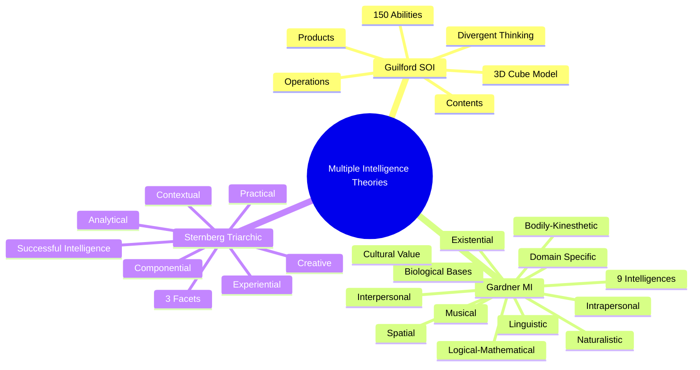

# Multiple Intelligence Theories: Summary and Integration

## Introduction

The evolution from **unitary intelligence** (Spearman's g-factor) to **multiple intelligence frameworks** represents one of the most significant paradigm shifts in psychology. This unit has explored three landmark theories that challenged traditional conceptions and expanded our understanding of human cognitive abilities:

1. **J.P. Guilford's Structure-of-Intellect (SOI) Theory** (1956)
2. **Howard Gardner's Theory of Multiple Intelligences (MI)** (1983)
3. **Robert Sternberg's Triarchic Theory of Intelligence** (1985)

This summary integrates key insights, evaluates their collective impact, and explores contemporary applications and future directions.

## Unified Summary of Key Concepts

### The Three Theories at a Glance

### Core Principles Shared Across Theories

Despite their differences, all three theories converge on several fundamental principles:

#### 1. **Intelligence is Multifaceted**

**Unitary View** (rejected): Intelligence is a single entity measurable by IQ

**Multiple Intelligence View** (accepted): Intelligence encompasses diverse cognitive abilities that cannot be captured by a single score

#### 2. **Beyond Academic Achievement**

Traditional IQ emphasizes:
- Verbal reasoning
- Mathematical problem-solving
- Abstract thinking

Multiple intelligence theories recognize:
- **Guilford**: Divergent thinking, creativity
- **Gardner**: Musical, bodily-kinesthetic, interpersonal talents
- **Sternberg**: Practical, real-world problem-solving

#### 3. **Individual Differences in Cognitive Profiles**

- People have **varied patterns of strengths and weaknesses**
- Excellence comes in **multiple forms**
- One-size-fits-all assessment is **inadequate**

#### 4. **Educational and Practical Implications**

All three theories:
- Inform **curriculum design**
- Guide **instructional methods**
- Shape **assessment practices**
- Support **talent development**

### Critical Distinctions

| **Dimension** | **Guilford** | **Gardner** | **Sternberg** |
|---------------|-------------|-------------|---------------|
| **What is emphasized?** | Cognitive operations | Content domains | Cognitive processes + context |
| **How many components?** | 150 specific abilities | 9 broad intelligences | 3 integrated facets |
| **Are they independent?** | Relatively independent | Autonomous but interactive | Interdependent |
| **Domain-specific or general?** | Hybrid (contents are specific, operations general) | Domain-specific | Process-general |
| **Primary evidence?** | Factor analysis | Neuropsychology, culture | Information processing, real-world success |
| **Focus of assessment?** | Cognitive tests | Performance in domains | Contextual problem-solving |

## Comprehensive Strengths and Limitations

### Collective Strengths

#### 1. **Theoretical Richness**
- Provide detailed frameworks for understanding cognitive diversity
- Go beyond simplistic IQ measurement
- Offer multiple lenses on intelligence

#### 2. **Educational Revolution**
- Transformed teaching practices worldwide
- Promoted differentiated instruction
- Validated diverse student talents
- Encouraged multiple assessment methods

#### 3. **Recognition of Creativity**
- **Guilford**: Distinguished divergent from convergent thinking
- **Sternberg**: Elevated creativity as core facet of intelligence
- Stimulated decades of creativity research

#### 4. **Cultural Sensitivity**
- **Gardner**: Explicit recognition of cultural variation
- **Sternberg**: Contextual adaptation as central
- Reduced Western academic bias

#### 5. **Practical Relevance**
- **Sternberg**: Emphasis on real-world success
- **Gardner**: Application to arts, sports, social domains
- Broader conception of human potential

### Collective Limitations

#### 1. **Empirical Validation Challenges**

**General Intelligence (g)**:
- Robust evidence for g factor (positive correlations among cognitive abilities)
- All three theories minimize or reject g
- May be **over-correcting** against unitary view

**Predictive Validity**:
- Traditional IQ predicts academic and occupational success well
- Multiple intelligence measures show **weaker prediction**
- Questions about practical utility beyond face validity

#### 2. **Measurement Difficulties**

**Guilford**:
- 150 abilities too many to assess practically
- Narrow factors have limited predictive power

**Gardner**:
- Difficult to measure intelligences independently
- Lack of standardized, validated instruments
- Questions about true independence of intelligences

**Sternberg**:
- Practical and creative intelligence hard to operationalize
- Assessment tools less developed than traditional IQ tests

#### 3. **Conceptual Clarity**

**Intelligences vs. Abilities vs. Talents**:
- Are these really "intelligences" or:
  - Cognitive abilities?
  - Talents or aptitudes?
  - Cognitive styles?
  - Personality traits?

**Overly Broad Definition**:
- Risk of making "intelligence" so broad it becomes meaningless
- Where do we draw the line?

#### 4. **Integration with Mainstream Research**

- Theories somewhat isolated from cognitive neuroscience
- Limited integration with working memory research
- Need for bridging with contemporary cognitive science

## Contemporary Perspectives and Integration

### Hierarchical Models: CHC Theory

The **Cattell-Horn-Carroll (CHC) Theory** represents an integration effort:

**Three Strata**:
1. **Stratum III**: General intelligence (g)
2. **Stratum II**: Broad abilities (e.g., fluid reasoning, crystallized intelligence, visual-spatial processing)
3. **Stratum III**: Narrow abilities (similar to Guilford's specific factors)

**How CHC Integrates Multiple Intelligence Theories**:
- **g factor**: Acknowledges general intelligence
- **Broad abilities**: Similar to Gardner's domains
- **Narrow abilities**: Like Guilford's specific factors
- **Process and context**: Can incorporate Sternberg's insights

### Neuroscience Perspectives

**Brain Imaging Research** reveals:

#### **Domain-Specific Networks** (supports Gardner)
- Language networks (Broca's, Wernicke's areas)
- Musical processing (right temporal lobe)
- Spatial processing (parietal lobes)
- Social cognition (medial prefrontal cortex, temporoparietal junction)

#### **Domain-General Networks** (supports Sternberg)
- Executive control (prefrontal cortex)
- Working memory (dorsolateral prefrontal cortex)
- Attention networks (parietal, frontal regions)

#### **Integrated Processing** (supports all three)
- Complex tasks recruit multiple brain networks
- Both specialized and general systems work together
- Supports idea of multiple but interconnected abilities

**Conclusion**: Neurological evidence supports **both** specialized abilities **and** general processes, suggesting need for **multi-level models**.

### Emotional and Social Intelligence

**Development Beyond the Three Theories**:

**Emotional Intelligence** (Goleman, Salovey & Mayer):
- Recognizing emotions
- Regulating emotions
- Motivating oneself
- Empathy
- Social skills

**Relationship to MI Theories**:
- **Gardner**: Overlaps with interpersonal and intrapersonal intelligence
- **Sternberg**: Part of practical intelligence
- **Guilford**: Could be seen as operations on behavioral content

**Evidence**:
- Predicts life outcomes beyond IQ
- Distinct from but related to cognitive intelligence
- Adds important dimension to multiple intelligence frameworks

### Cultural Intelligence

**Definition**: Capability to function effectively across cultures

**Components**:
- **Cognitive**: Cultural knowledge and thinking patterns
- **Metacognitive**: Awareness of cultural assumptions
- **Motivational**: Interest and confidence in cross-cultural situations
- **Behavioral**: Flexible behavior across cultures

**Relationship to Theories**:
- Extends **Sternberg's** contextual subtheory
- Aligns with **Gardner's** interpersonal intelligence
- Addresses real-world global demands

## Practical Applications: Synthesis

### In Education: Integrative Approach

**Optimal Practice** combines insights from all three theories:

#### **Assessment** (Multi-Method)
1. **Standardized Testing** (acknowledges g): Basic cognitive abilities
2. **Portfolio Assessment** (Gardner): Show diverse talents
3. **Performance Tasks** (Sternberg): Real-world problem-solving
4. **Creativity Measures** (Guilford): Divergent thinking tests

#### **Instruction** (Multi-Modal)
1. **Differentiated Instruction** (Gardner): Multiple entry points
2. **Analytical-Creative-Practical Activities** (Sternberg): Balanced curriculum
3. **Specific Skill Training** (Guilford): Target cognitive operations
4. **Metacognitive Strategies**: Develop awareness and control

#### **Curriculum Design** (Holistic)
- **Core Concepts** taught through multiple intelligences (Gardner)
- **Analytical, Creative, Practical** approaches to each topic (Sternberg)
- **Divergent and Convergent** thinking opportunities (Guilford)
- **Real-World Application** and contextual learning (Sternberg)

**Example: Teaching Climate Change**

| **Approach** | **Activity** | **Theory** |
|-------------|-------------|-----------|
| **Linguistic** | Read articles, write essays | Gardner |
| **Logical-Mathematical** | Analyze data, create models | Gardner |
| **Visual-Spatial** | Interpret graphs, create infographics | Gardner |
| **Naturalistic** | Study ecosystem impacts | Gardner |
| **Analytical** | Compare policy approaches, evaluate evidence | Sternberg |
| **Creative** | Propose innovative solutions, design campaigns | Sternberg |
| **Practical** | Implement school sustainability project | Sternberg |
| **Divergent** | Brainstorm multiple solutions | Guilford |
| **Convergent** | Select best approach based on criteria | Guilford |

### In Career Counseling

**Integrated Assessment Profile**:

1. **Cognitive Abilities** (IQ tests): General intellectual capacity
2. **Dominant Intelligences** (Gardner): Domain strengths (musical, spatial, etc.)
3. **Triarchic Profile** (Sternberg): Analytical vs. creative vs. practical strengths
4. **Specific Skills** (Guilford): Divergent thinking, specific operations

**Career Matching**:
- **High Analytical, High Practical, Moderate Creative** → Engineering, medicine
- **High Creative, Moderate Analytical, Moderate Practical** → Arts, design, innovation
- **High Practical, High Interpersonal, Moderate Analytical** → Sales, management, counseling
- **High Linguistic, High Intrapersonal** → Writing, research, scholarship
- **High Bodily-Kinesthetic, High Spatial** → Surgery, athletics, dance

### In Organizational Settings

**Talent Management**:
- **Hiring**: Assess relevant intelligence profile for each role
- **Placement**: Match employees to roles fitting their strengths
- **Training**: Develop both specialized and general abilities
- **Team Composition**: Balance analytical, creative, practical team members

**Leadership Development**:
- **Analytical Skills**: Strategic planning, problem analysis
- **Creative Skills**: Innovation, vision, change management
- **Practical Skills**: Implementation, people management
- **Interpersonal Intelligence** (Gardner): Team building, communication
- **Intrapersonal Intelligence** (Gardner): Self-awareness, emotional regulation

### In Clinical Settings

**Neuropsychological Assessment**:
- Use Guilford's framework to identify **specific cognitive deficits**
- Consider Gardner's intelligences for **strength-based rehabilitation**
- Apply Sternberg's practical intelligence to **adaptive functioning**

**Intervention Planning**:
- Target specific cognitive operations (Guilford)
- Leverage preserved intelligences (Gardner)
- Focus on real-world adaptation (Sternberg)

## Critical Thinking: Evaluating the Theories

### Questions for Reflection

#### **Conceptual Questions**

1. **Is intelligence singular or plural?**
   - Does one unified intelligence exist (g), or are there truly multiple intelligences?
   - Can both be true simultaneously (hierarchical model)?

2. **What counts as "intelligence" vs. "ability" or "talent"?**
   - Where should we draw the boundaries?
   - Does the label matter if frameworks are useful?

3. **Nature vs. nurture?**
   - Are these intelligences innate or developed?
   - How much can they be improved through training?

#### **Methodological Questions**

1. **How should intelligence be measured?**
   - Standardized tests? Performance assessments? Real-world outcomes?
   - Can multiple intelligences be assessed independently?

2. **What constitutes evidence?**
   - Factor analysis (Guilford)?
   - Neuropsychology and culture (Gardner)?
   - Information processing and life success (Sternberg)?
   - All of the above?

#### **Practical Questions**

1. **Which theory is most useful for education?**
   - Does it depend on educational goals?
   - Can insights from all three be integrated?

2. **Do these theories improve prediction beyond IQ?**
   - What outcomes are we trying to predict?
   - Are we gaining practical benefit or just face validity?

3. **How do we balance focus on strengths vs. developing weaknesses?**
   - Should education emphasize what students do well (Gardner)?
   - Or develop well-rounded abilities in all areas (Sternberg)?

## The Future of Intelligence Theory

### Emerging Directions

#### **1. Neuroscience Integration**

**Current Trends**:
- Connectomics: Mapping brain network connections
- Neuroimaging: Identifying neural correlates of abilities
- Brain plasticity: Understanding how abilities develop

**Future Promise**:
- Biological validation of intelligence constructs
- Understanding neural mechanisms underlying different abilities
- Targeted cognitive training based on brain function

#### **2. Artificial Intelligence and Machine Learning**

**Insights from AI**:
- Specialized vs. general AI mirrors intelligence debates
- Domain-specific algorithms (like Gardner's domains)
- Transfer learning (like Sternberg's processes)

**Questions Raised**:
- What is intelligence if machines can replicate it?
- What uniquely human intelligences remain?

#### **3. 21st Century Skills**

**New Competencies**:
- Digital literacy
- Systems thinking
- Cross-cultural competence
- Adaptive learning
- Collaboration

**Relationship to MI Theories**:
- How do these fit existing frameworks?
- Do we need new "intelligences" or are these applications of existing ones?

#### **4. Precision Education**

**Personalized Learning**:
- Technology enables individualized instruction
- Adaptive learning platforms
- Real-time assessment and feedback

**MI Theory Application**:
- Tailor instruction to intelligence profiles
- Provide multiple pathways to mastery
- Support diverse learning styles

### Unresolved Questions

1. **Can abilities be hierarchically organized** (general → broad → narrow)?
2. **How much do intelligences **overlap vs. truly independent?
3. **What is the role of domain knowledge** vs. general processes?
4. **How much can intelligences be **developed** through training?
5. **Are there other intelligences** not yet identified?
6. **How does intelligence relate to wisdom**, creativity, and expertise?

## Conclusion: Toward a Comprehensive View

### The Value of Multiple Perspectives

The theories of **Guilford**, **Gardner**, and **Sternberg** each offer valuable perspectives:

- **Guilford** provides a **systematic taxonomy** of cognitive operations
- **Gardner** recognizes **diverse domains** of human competence
- **Sternberg** emphasizes **processes, experience, and context**

Rather than viewing these as competing, we can see them as **complementary lenses** on the complex phenomenon of intelligence.

### Core Insights for Practice

From this unit, several practical insights emerge:

#### **For Educators**:
1. **Recognize diversity**: Students have varied cognitive strengths
2. **Teach using multiple modalities**: Provide varied entry points
3. **Balance abilities**: Develop analytical, creative, and practical skills
4. **Foster creativity**: Include divergent thinking opportunities
5. **Value all talents**: Excellence comes in many forms

#### **For Psychologists**:
1. **Use multi-method assessment**: No single test captures all abilities
2. **Consider context**: Intelligence is culturally situated
3. **Focus on strengths**: Build on what individuals do well
4. **Develop weaknesses**: Address deficits when necessary
5. **Define success broadly**: Academic achievement isn't everything

#### **For Individuals**:
1. **Know your profile**: Understand your cognitive strengths and weaknesses
2. **Leverage strengths**: Capitalize on what you do well
3. **Compensate for weaknesses**: Develop strategies or seek support
4. **Choose environments wisely**: Select contexts that value your abilities
5. **Keep developing**: All abilities can be improved with effort

### The Bottom Line

While debates continue about the **precise structure** and **measurement** of intelligence, the move toward **pluralistic conceptions** has been valuable:

✅ **Expanded our understanding** of human cognitive potential

✅ **Transformed educational practice** to be more inclusive

✅ **Validated diverse forms** of excellence beyond academic ability

✅ **Encouraged recognition** of individual differences

✅ **Promoted contextual thinking** about intelligence

The future likely lies not in choosing one theory, but in **integrating insights** from multiple perspectives while maintaining scientific rigor and practical utility.

Intelligence, in its fullness, encompasses:
- **General cognitive ability** (g)
- **Specialized competencies** (domains)
- **Creative capacities** (novelty handling)
- **Practical wisdom** (real-world adaptation)
- **Metacognitive awareness** (self-understanding)

By honoring this complexity, we move toward a psychology that truly recognizes and nurtures the **full spectrum of human potential**.

---

## Key Takeaways

1. **Three Major Theories**: Guilford (150 abilities), Gardner (9 intelligences), Sternberg (3 facets)
2. **Common Ground**: All reject monolithic intelligence; recognize diversity
3. **Complementary Strengths**: Each offers unique insights into human cognition
4. **Practical Impact**: Transformed education, assessment, and career guidance
5. **Integration Possible**: Hierarchical models can synthesize insights
6. **Ongoing Debates**: Questions remain about structure, measurement, and validity
7. **Future Directions**: Neuroscience, AI, precision education, 21st century skills

---

**Source PDFs**: 
- 📄 [Block-2/Unit-2.pdf - Full Unit](/pdfs/MPC-001%20Cognitive%20Psychology,%20Learning%20and%20Memory/Block-2/Unit-2.pdf)
- 📚 MPC-001 Cognitive Psychology, Learning and Memory

---

## Final Self-Assessment Questions

1. **Synthesis**: Design a comprehensive intelligence assessment that draws on all three theories. What would you measure and why?

2. **Critical Analysis**: Which criticisms of multiple intelligence theories do you find most compelling? How might theorists respond?

3. **Practical Application**: You're designing a new school. How would you incorporate insights from Guilford, Gardner, and Sternberg into your educational philosophy and practices?

4. **Personal Reflection**: Based on the theories covered, what is your personal intelligence profile? How has understanding these theories changed how you think about your own abilities?

5. **Future Thinking**: What emerging abilities or competencies do you think should be added to our conception of intelligence in the 21st century?

---

## Further Exploration

### **Books**
- Guilford, J.P. (1967). *The Nature of Human Intelligence*
- Gardner, H. (1983). *Frames of Mind: The Theory of Multiple Intelligences*
- Sternberg, R.J. (1985). *Beyond IQ: A Triarchic Theory of Human Intelligence*

### **Websites**
- [Project Zero at Harvard](https://www.pz.harvard.edu/) - Gardner's research center
- [Wikipedia - Intelligence](https://en.wikipedia.org/wiki/Intelligence) - Comprehensive overview
- [APA: Intelligence Research](https://www.apa.org/) - Latest research on intelligence

### **Contemporary Topics**
- CHC Theory and hierarchical models
- Emotional intelligence and its relationship to MI theories
- Neuroscience of cognitive abilities
- AI and machine intelligence
