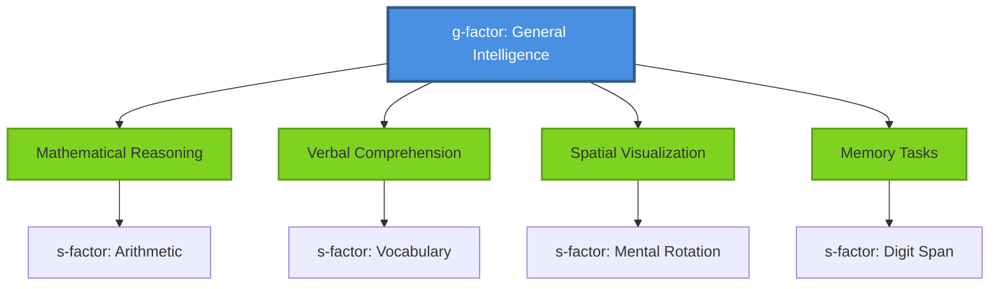
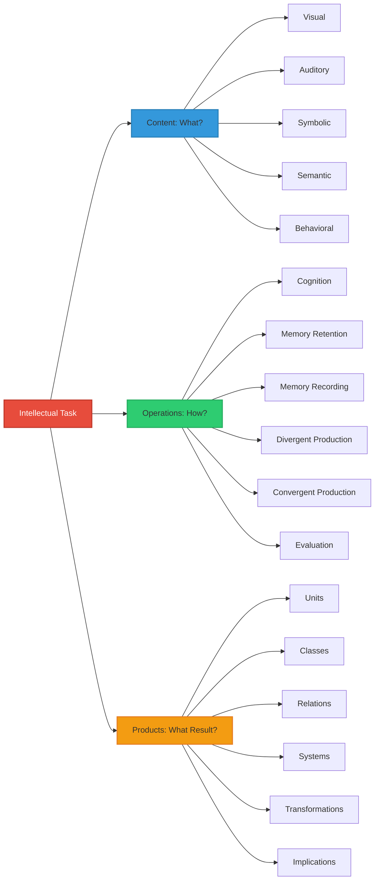
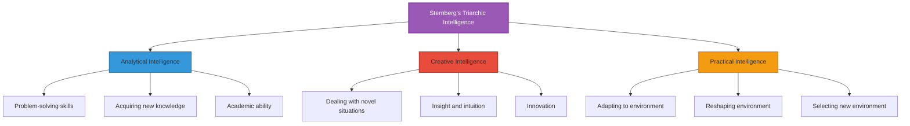
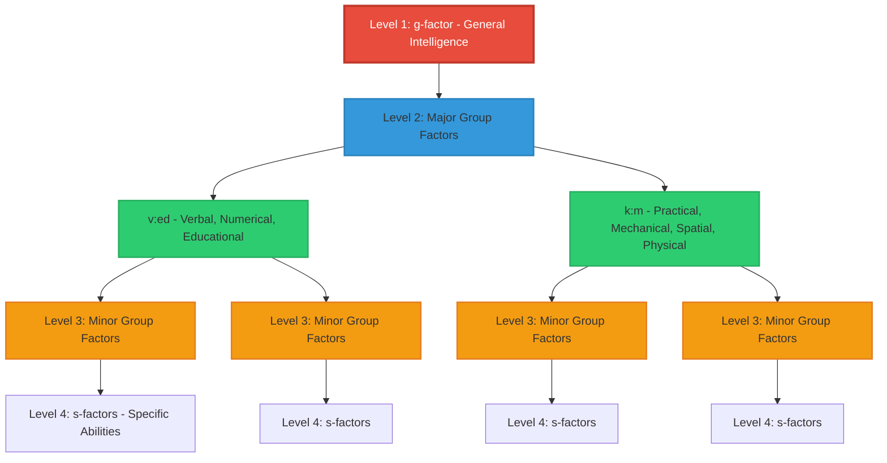

# Theoretical Background of Intelligence Measurement

## Introduction

Intelligence tests vary dramatically in their content, administration methods, and interpretation—differences that stem directly from their underlying theoretical foundations. Before exploring specific assessment tools, understanding these theoretical frameworks is essential. The fundamental question remains: Is intelligence a single, unified ability, or does it comprise multiple, independent capabilities?

This debate has shaped the entire field of psychological assessment, influencing everything from test construction to score interpretation to educational policy.

---

## General Factor Theories: The Case for Unified Intelligence

### Spearman's Two-Factor Theory

In 1904, British psychologist Charles Spearman introduced one of psychology's most influential concepts: the **general intelligence factor (g-factor)**. Through factor analysis of test scores, Spearman observed that performance across diverse cognitive tasks showed positive correlations—suggesting an underlying general ability.

**Spearman's model proposed:**
- **g-factor**: A general intellectual capacity common to all cognitive activities
- **s-factors**: Specific abilities required for particular tasks

According to Spearman, when two tests both measure g, they will show high positive correlation. Conversely, tests measuring only distinct s-factors should show zero correlation.

**Real-world implication**: This theory suggests that a person who excels in one cognitive domain (e.g., mathematics) is likely to perform well in others (e.g., verbal reasoning)—because they possess high general intelligence.

### Jensen's Advocacy and Controversy

Arthur Jensen (1998) championed Spearman's g-factor, arguing that it:
- Manifests in behavior through countless ways
- Can be measured by virtually unlimited test item varieties
- Allows completely different tests with distinct forms and content to measure the same underlying g

However, Jensen's claim that **g is largely inherited** and minimally influenced by environment sparked intense controversy. Critics argued this perspective:
- Oversimplifies complex gene-environment interactions
- Ignores substantial evidence for environmental influence on cognitive development
- Has troubling implications for educational and social policy

### Binet's Integrated Approach

Alfred Binet and Theodore Simon (1916) also conceptualized intelligence as a general capacity but took a different measurement approach. Rather than seeking a pure g-factor, they proposed measuring it through diverse test items assessing multiple discrete abilities.

**Binet identified five key components:**
1. **Abstract reasoning**: Thinking beyond concrete examples
2. **Comprehension**: Understanding complex information
3. **Clear direction of thought**: Focused, purposeful thinking
4. **Purposeful thinking**: Goal-oriented cognition
5. **Self-corrective judgment**: Recognizing and fixing errors

The integrated score from these abilities—the **Intelligence Quotient (IQ)**—would represent true general intelligence. This practical approach influenced test development for over a century.

---

## Multi-Factor Theories: Intelligence as Multiple Abilities

### Thurstone's Primary Mental Abilities (PMA)

Louis Thurstone challenged Spearman's g-factor by proposing that intelligence consists of several **independent primary mental abilities**. Each ability represents a distinct cognitive function with its own "unifying primary factor."

**Thurstone's Seven Primary Mental Abilities:**

| Ability | Symbol | Description | Example Task |
|---------|--------|-------------|--------------|
| **Number** | N | Rapid, accurate numerical calculations | Mental arithmetic, solving equations |
| **Verbal Comprehension** | V | Understanding language and word meanings | Reading comprehension, defining words |
| **Spatial** | S | Manipulating mental images in space | Mental rotation, map reading |
| **Memory** | M | Quick memorization ability | Recalling word lists, number sequences |
| **Word Fluency** | W | Generating words rapidly | Naming words starting with "S" in 1 minute |
| **Reasoning** | R | Identifying patterns and rules | Letter series completion, analogies |
| **Perceptual Speed** | P | Noting visual details quickly | Finding specific symbols in arrays |

Thurstone's **Test of Primary Mental Abilities (PMA)** was built on this framework, providing separate scores for each ability rather than a single IQ score.

**Impact on education**: This model suggested that students might excel in some areas while struggling in others—requiring differentiated instruction rather than treating intelligence as uniform.

### Guilford's Structure of Intellect (SI) Model

J.P. Guilford (1967) proposed the most elaborate multi-factor model, suggesting intelligence comprises **150 distinct abilities** (later expanded to 180). His three-dimensional Structure of Intellect cube categorizes every intellectual task along three dimensions:

**Example**: Solving a mathematical word problem involves:
- **Content**: Semantic (understanding the meaning)
- **Operation**: Convergent production (finding the one correct answer)
- **Product**: Relations (understanding how numbers relate)

**Criticism**: While theoretically comprehensive, Guilford's model proved too complex for practical test development and validation. Factor analytic studies often failed to confirm all 150 proposed abilities.

### Gardner's Theory of Multiple Intelligences

Howard Gardner (1983) revolutionized thinking about intelligence with his **Theory of Multiple Intelligences**, arguing that traditional IQ tests measure only a narrow range of human cognitive abilities.

**Gardner's Eight (Originally Seven) Intelligences:**

| Intelligence | Core Ability | Examples of High Function | Career Applications |
|--------------|--------------|---------------------------|---------------------|
| **Linguistic** | Words and language | Writers, poets, public speakers | Journalism, law, teaching |
| **Logical-Mathematical** | Numbers and logic | Scientists, mathematicians | Engineering, computer science |
| **Spatial** | Visual-spatial reasoning | Architects, navigators, artists | Architecture, graphic design |
| **Musical** | Musical patterns and sounds | Composers, musicians | Music performance, sound engineering |
| **Bodily-Kinesthetic** | Physical coordination | Athletes, dancers, surgeons | Sports, dance, surgery |
| **Interpersonal** | Understanding others | Therapists, salespeople, teachers | Counseling, management |
| **Intrapersonal** | Self-understanding | Introspective individuals | Psychology, philosophy |
| **Naturalistic** | Nature patterns (added 1995) | Biologists, environmentalists | Ecology, farming |

**Real-world application**: Schools using Gardner's framework offer diverse learning activities—allowing students to demonstrate understanding through various modalities (writing, building, performing, discussing).

**Controversies**:
- **Lack of empirical support**: Factor analytic studies don't clearly support eight independent intelligences
- **Conflating skills with intelligence**: Critics argue some "intelligences" are better classified as talents or skills
- **Difficult to measure reliably**: Unlike traditional IQ tests, MI theory lacks standardized assessment tools

### Sternberg's Triarchic Theory

Robert Sternberg (1985) proposed a **three-pronged** approach, arguing that complete intelligence assessment requires measuring three distinct types:

**1. Analytical Intelligence (Academic Ability)**
- Encoding, comparing, and analyzing information
- Traditional IQ tests primarily measure this type
- **Example**: Solving mathematical problems, analyzing literature

**2. Creative Intelligence (Innovation)**
- Coping with novel situations effectively
- Relating new situations to familiar ones (recognizing patterns)
- Automating processes through experience
- **Example**: Creating innovative solutions to unprecedented problems

**3. Practical Intelligence ("Street Smarts")**
- Adapting to environmental demands
- Reshaping environments to better suit needs
- Selecting optimal environments when needed
- **Example**: Navigating workplace politics, managing personal finances effectively

**Key insight**: Someone might score high on traditional IQ tests (analytical) but struggle with real-world problem-solving (practical) or innovation (creative)—and vice versa.

### Vernon's Hierarchical Model: Bridging the Gap

Philip Vernon proposed a **hierarchical structure** that reconciled general factor and multi-factor theories:

**Vernon's Four Levels:**
1. **Highest**: g-factor (explaining most variance between individuals)
2. **Major group factors**: Broad abilities like verbal-educational (v:ed) vs. practical-mechanical (k:m)
3. **Minor group factors**: More specific clusters within major groups
4. **Lowest**: Specific factors (s) for individual tasks

Vernon's later work (post-1969) focused on **nature vs. nurture**, concluding that:
- Individual differences in intelligence are approximately **60% genetic, 40% environmental**
- Both factors interact in complex ways throughout development

---

## Contemporary Perspectives: Integration and Neuroscience

### The Cattell-Horn-Carroll (CHC) Theory

Modern intelligence testing increasingly adopts the **CHC model**, which integrates:
- Cattell and Horn's fluid-crystallized distinction
- Carroll's three-stratum hierarchical model

**CHC identifies:**
- **Stratum III**: General intelligence (g)
- **Stratum II**: Broad abilities (8-10 factors including fluid reasoning, crystallized knowledge, processing speed)
- **Stratum I**: Narrow, specific abilities (70+ factors)

This framework guides contemporary tests like the Stanford-Binet 5th Edition and Woodcock-Johnson IV.

### Neuroscience Contributions

Recent research using **brain imaging** has identified neural correlates of intelligence:
- **Parieto-frontal integration theory**: Intelligence relates to efficiency of communication between parietal and frontal regions
- **Neural efficiency hypothesis**: Higher intelligence associates with less brain activation (more efficient processing)
- **2024 research** shows white matter integrity predicts g-factor performance (Nature Neuroscience)

---

## Practical Implications for Testing

### Test Selection Based on Theory

| Theoretical Orientation | Test Examples | Best Used For |
|------------------------|---------------|---------------|
| **g-factor emphasis** | Raven's Progressive Matrices | Culture-fair assessment, research |
| **Multiple broad abilities** | WAIS-IV, Stanford-Binet 5 | Comprehensive clinical evaluation |
| **Specific abilities** | Thurstone's PMA | Educational planning, identifying strengths/weaknesses |
| **Practical intelligence** | Sternberg's STAT | Real-world problem-solving assessment |

### Educational Applications

Different theories suggest different educational approaches:
- **g-factor view**: Enhance general reasoning ability through diverse cognitive challenges
- **Multiple intelligences**: Provide varied learning experiences matching different intelligences
- **Triarchic theory**: Develop analytical, creative, AND practical abilities—not just academic skills

---

## Critical Evaluation

### Strengths of General Factor Theories
- ✅ Strong statistical support for g across diverse tests
- ✅ Predicts academic and occupational success
- ✅ Parsimonious—explains much with simple concept

### Limitations of General Factor Theories
- ❌ May oversimplify cognitive complexity
- ❌ Doesn't capture creativity, practical intelligence, emotional intelligence
- ❌ Historical misuse for discriminatory purposes

### Strengths of Multi-Factor Theories
- ✅ Recognizes cognitive diversity and specialization
- ✅ More comprehensive view of human abilities
- ✅ Better guides educational interventions

### Limitations of Multi-Factor Theories
- ❌ Factors often intercorrelate, suggesting underlying g
- ❌ Some theories (e.g., Gardner's) lack empirical validation
- ❌ Complex models difficult to assess reliably

---

## Memory Aids

### 🎯 **Acronym: SMART Theories**
- **S**pearman: Single g-factor
- **M**ulti-factor: Thurstone's primaries
- **A**rchitect: Guilford's structure
- **R**eframe: Gardner's multiple intelligences
- **T**riarchic: Sternberg's three-part model

### 🧠 **Remember Thurstone's 7 PMAs: "NV SMART"**
- **N**umber
- **V**erbal
- **S**pace
- **M**emory
- **(Word Fluency)**
- **R**easoning
- **(Perceptual Speed)**

### 📊 **Sternberg's Three Types: "CAP Intelligence"**
- **C**reative
- **A**nalytical
- **P**ractical

---

## Self-Assessment Questions

### Question 1: Conceptual Understanding
**Explain why Spearman's observation of positive correlations between diverse cognitive tests led him to propose a g-factor. What assumption underlies this interpretation?**

View Answer

Spearman reasoned that if performance on different cognitive tasks correlates positively, there must be some common underlying factor. The assumption is that this correlation reflects a general cognitive ability (g) that influences all intellectual tasks, rather than factors like motivation, test-taking skills, or shared method variance.

Critics note this assumes correlation = causation and may overlook that correlations could reflect other shared factors like educational quality or test familiarity.

### Question 2: Application
**A student scores very high on mathematical reasoning but struggles significantly with verbal tasks. Which theory best explains this pattern, and what are the implications for educational planning?**

View Answer

**Thurstone's Primary Mental Abilities** or **Gardner's Multiple Intelligences** best explain this pattern—both propose relatively independent cognitive abilities.

**Educational implications:**
- Focus remedial efforts on verbal skills (reading, comprehension, vocabulary)
- Allow the student to demonstrate understanding through mathematical/visual methods when possible
- Don't assume the student has "low intelligence" overall—recognize domain-specific strengths
- Consider career paths leveraging mathematical strengths (engineering, computer science)

A pure g-factor theory would struggle to explain this significant discrepancy in abilities.

### Question 3: Critical Thinking
**Gardner's Theory of Multiple Intelligences has been widely adopted in education despite limited empirical support. Why might this be? Discuss both potential benefits and risks of this application.**

View Answer

**Why widely adopted despite limited evidence:**
- Intuitive appeal—matches teachers' observations that students learn differently
- Empowering—suggests all students are "intelligent" in different ways
- Practical—provides framework for varied instructional methods
- Challenges narrow definitions of intelligence

**Potential benefits:**
- Encourages diverse teaching methods
- Values non-academic abilities
- May boost student confidence and engagement
- Promotes individualized instruction

**Potential risks:**
- May lower academic expectations ("they're just not 'logical-mathematical'")
- Could inefficiently match students to teaching methods without evidence
- May misallocate educational resources
- Risk of pigeonholing students into limited domains

**Bottom line**: The theory's educational applications may have value even if the underlying theory of eight independent intelligences isn't fully validated—but applications should be evidence-based and not used to excuse poor academic performance.

### Question 4: Integration
**Vernon's hierarchical model attempts to reconcile g-factor and multi-factor theories. Explain how this model accommodates both perspectives and why this integration might be more accurate than either extreme.**

View Answer

**Vernon's integration:**
- **Accommodates g-factor**: Places general intelligence at the top of the hierarchy, explaining broad cross-task correlations
- **Accommodates multi-factor**: Recognizes distinct ability clusters at lower levels (major groups like verbal vs. practical; minor groups like vocabulary vs. comprehension)

**Why integration may be more accurate:**
- **Statistical evidence**: Factor analyses consistently show both a general factor and group factors
- **Intuitive validity**: Explains both "smart people tend to be good at many things" AND "people have specific strengths and weaknesses"
- **Practical utility**: Allows both general IQ scores and specific ability profiles
- **Developmental reality**: General capacity may set limits, but specific abilities can be developed within those limits

**Example**: A person with high g might have the *potential* for complex reasoning across domains, but specific abilities (verbal, spatial) are differentially developed through experience and interest. Vernon's model captures both the general capacity and the specialized development.

### Question 5: Research Evaluation
**Jensen claimed g is "largely inherited" while critics emphasize environmental influence. What kind of evidence would be needed to resolve this debate? Why has it been so difficult to obtain definitive answers?**

View Answer

**Evidence needed:**
- Twin and adoption studies comparing identical twins raised together vs. apart
- Intervention studies showing environmental changes significantly boost g
- Genomic studies identifying specific genes and their effect sizes
- Longitudinal studies tracking intelligence across environmental changes
- Cross-cultural studies controlling for opportunity differences

**Why difficult to resolve:**
- **Gene-environment correlation**: Genetic potential influences the environments people select and are selected into
- **Gene-environment interaction**: Genetic effects depend on environment and vice versa
- **Ethical limitations**: Can't randomly assign children to different environments for research
- **Measurement challenges**: Difficult to isolate "pure" genetic or environmental effects
- **Complex causation**: Multiple genes with small effects, multiple environmental factors interacting
- **Political sensitivity**: Results have been misused historically for discrimination
- **Dynamic changes**: Heritability varies by age and context

**Current consensus**: Most researchers accept that intelligence results from complex interactions between genetic predispositions and environmental opportunities, with typical estimates of 40-80% heritability (varying by population and environment). The debate continues not about whether both matter, but about their relative importance and how they interact.

---

## Further Resources

### 📚 **Wikipedia Articles**
- [Intelligence quotient](https://en.wikipedia.org/wiki/Intelligence_quotient) - Comprehensive overview of IQ concepts
- [G factor (psychometrics)](https://en.wikipedia.org/wiki/G_factor_(psychometrics)) - Detailed explanation of Spearman's theory
- [Theory of multiple intelligences](https://en.wikipedia.org/wiki/Theory_of_multiple_intelligences) - Gardner's framework and critiques

### 📖 **Key Research Papers**
- Spearman, C. (1904). "General intelligence, objectively determined and measured." *American Journal of Psychology, 15*, 201-293. (Original g-factor paper)
- Carroll, J. B. (1993). *Human Cognitive Abilities: A Survey of Factor-Analytic Studies.* Cambridge University Press. (Foundational CHC theory)
- Deary, I. J., et al. (2024). "Neural correlates of general intelligence: New evidence from resting-state fMRI." *Nature Neuroscience.* (Modern neuroscience perspective)

### 🎥 **Educational Videos**
- [The Bell Curve and IQ Testing - Crash Course Psychology](https://www.youtube.com/watch?v=Ii_xQ6DZv9w) - Accessible introduction to intelligence testing debates
- [Gardner's Multiple Intelligences Explained](https://www.youtube.com/watch?v=ATvDlNhGxJ0) - Visual explanation of MI theory

### 🔬 **Advanced Reading**
- [Cattell-Horn-Carroll Theory](https://www.apa.org/ed/schools/teaching-learning/assessment/intelligence) - APA resource on contemporary CHC model
- [Intelligence: Knowns and Unknowns](https://www.intelligence-humaine.com/wp-content/uploads/2020/06/Intelligence-Knowns-and-Unknowns-1996.pdf) - Comprehensive APA task force report (1996, still highly relevant)

---

**Source PDFs**: 
- 📄 [Block-2/Unit-3.pdf - Pages 41-58](/pdfs/MPC-001%20Cognitive%20Psychology,%20Learning%20and%20Memory/Block-2/Unit-3.pdf)
- 📚 MPC-001 Cognitive Psychology, Learning and Memory

---

*Next: [History of Intelligence Testing →](/mpc-001/block-2/history-intelligence-testing)*