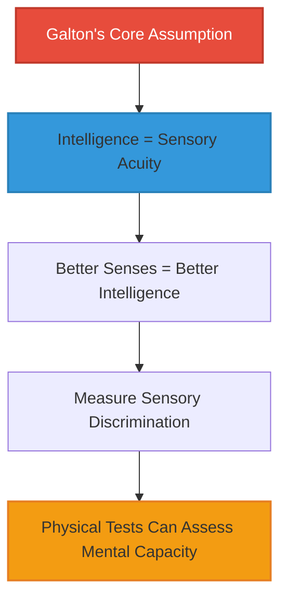
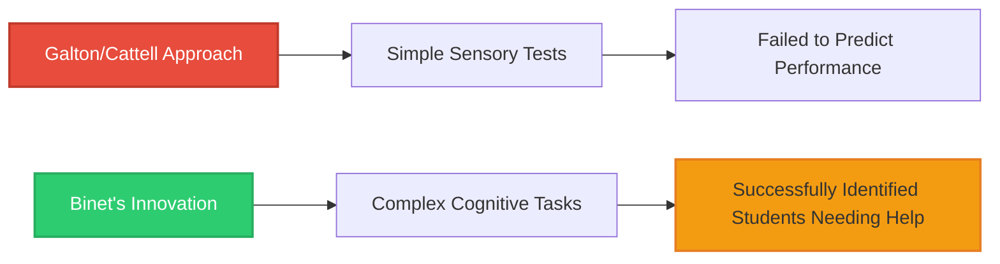
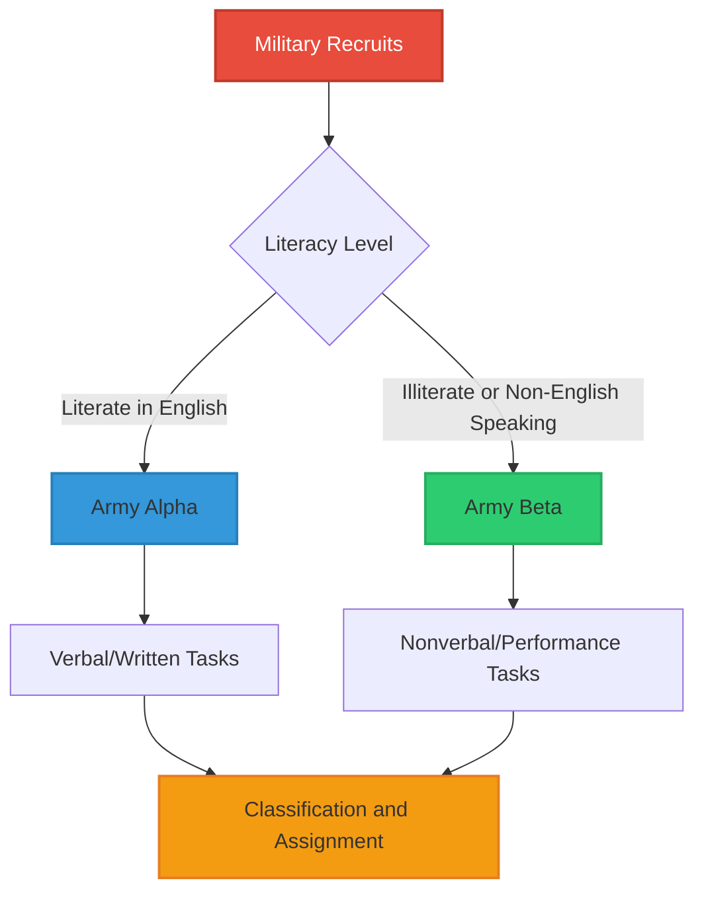
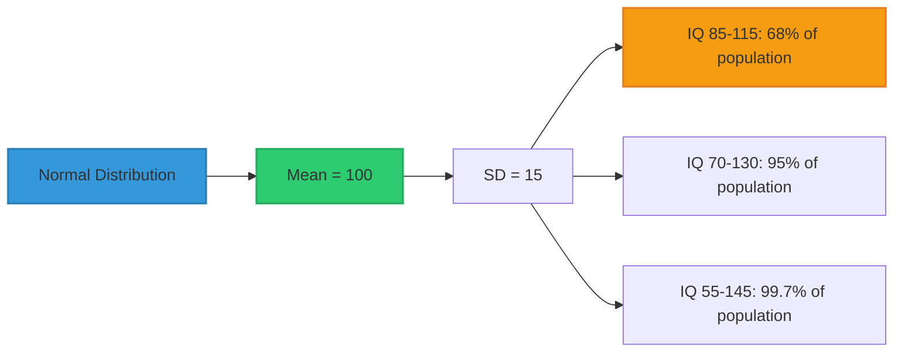

# History of Intelligence Testing

## Introduction

The measurement of individual differences in intelligence emerged relatively late in psychology's history. Early psychologists focused on discovering universal laws of human behavior rather than assessing variations between individuals. The shift toward measuring intelligence—now a cornerstone of psychological assessment—has a fascinating history shaped by societal needs, scientific innovations, and sometimes controversial applications.

This journey from measuring reaction time to administering sophisticated cognitive batteries reflects both psychology's maturation as a science and society's evolving understanding of human ability.

---

## Early Attempts: Galton and the Sensory Discrimination Approach

### Sir Francis Galton (1822-1911)

The British polymath **Sir Francis Galton** pioneered the institutional measurement of individual differences in the late 19th century. Influenced by his cousin Charles Darwin's work on evolution and natural selection, Galton believed intelligence was inherited and could be measured objectively.

**Galton's Measurement Approach:**
- **Visual discrimination**: Distinguishing between similar visual stimuli
- **Auditory acuity**: Determining the highest audible pitch
- **Kinesthetic sensitivity**: Detecting differences in weight and pressure
- **Reaction time**: Speed of response to stimuli
- **Physical measures**: Even included head size and strength measurements

**Galton's reasoning**: He theorized that sensory discrimination ability would distinguish intellectually gifted individuals from those with cognitive impairments. If someone could detect finer distinctions in sensory input, they should have more sophisticated mental processing.

**The Anthropometric Laboratory**: In 1884, Galton established the world's first testing laboratory at London's South Kensington Museum. For a small fee, visitors received measurements of their physical and sensory capabilities, contributing to Galton's data on human variation.

**Critical limitation**: While Galton pioneered quantitative approaches and statistical methods (including correlation), his assumption that sensory acuity reflects general intelligence proved incorrect. Later research showed minimal correlation between sensory discrimination and complex cognitive abilities like reasoning and problem-solving.

### James McKeen Cattell (1860-1944)

**James McKeen Cattell**, an American psychologist who studied under Wilhelm Wundt in Germany, brought Galton's ideas to the United States. Importantly, Cattell coined the term **"mental test"** in 1890—a phrase that would define an entire field.

**Cattell's Mental Tests (1890):**
1. **Muscular strength**: Grip strength, arm strength
2. **Speed of movement**: Reaction time to various stimuli
3. **Sensory acuity**:
   - Pain sensitivity threshold
   - Visual acuity (smallest discernible letters)
   - Auditory discrimination (pitch differentiation)
4. **Weight discrimination**: Detecting differences between similar weights
5. **Memory**: Immediate recall of letter sequences

**Innovation**: Cattell emphasized standardized procedures and quantifiable results, laying methodological groundwork for future testing. He administered these tests to students at Columbia University and the University of Pennsylvania.

**The fatal flaw**: In 1901, one of Cattell's own students, Clark Wissler, demonstrated that Cattell's mental tests showed virtually **no correlation with academic performance**. This finding devastated the sensory discrimination approach and revealed the need for tests measuring higher-level cognitive processes.

---

## The Breakthrough: Alfred Binet and the First Intelligence Scale

### The French Commission (1904)

The modern era of intelligence testing began with a practical problem. The French government, implementing universal public education, needed to identify children requiring special educational support. The Minister of Public Instruction appointed a commission including psychologist **Alfred Binet** to develop an objective diagnostic system.

**The challenge**: Distinguish between:
- Children with genuine intellectual disabilities who needed specialized instruction
- Children who were simply unmotivated, disruptive, or from disadvantaged backgrounds

Previous medical and observational methods proved unreliable. Binet needed an objective, quantifiable approach.

### Alfred Binet (1857-1911): Revolutionary Approach

Unlike Galton and Cattell, Binet recognized that intelligence involves **complex mental processes**—not just sensory acuity. He sought to measure:
- Memory and attention
- Comprehension and reasoning
- Judgment and problem-solving
- Imagination and aesthetic appreciation

**Partnership with Theodore Simon**: Working with physician Theodore Simon, Binet developed the **Binet-Simon Scale (1905)**—the first true intelligence test.

### The 1905 Binet-Simon Scale

**Structure:**
- **30 pass/fail items** arranged from simplest to most difficult
- Items sampled diverse mental abilities
- Administration required clinical interview (not just physical measurement)

**Sample items (paraphrased):**
1. Following simple commands (e.g., "Touch your nose")
2. Identifying body parts when named
3. Repeating a series of three digits
4. Comparing lengths of lines
5. Naming familiar objects from memory
6. Arranging weights in order
7. Defining common words
8. Finding rhymes

**Critical innovations:**
- **Age-graded norms**: Items calibrated to typical performance at different ages
- **Mental age concept**: A child's score could be expressed as the age level they functioned at intellectually
- **Rank-ordered difficulty**: Items progressed systematically from easier to harder
- **Breadth of abilities**: Sampled multiple cognitive domains, not just one aspect of functioning

**Example**: A 7-year-old who could pass items typically passed by 9-year-olds would be said to have a **mental age of 9**, suggesting advanced intellectual development.

### Revisions and Refinements

**1908 Revision:**
- Expanded age range
- Refined item placement based on empirical data
- Better standardization procedures

**1911 Revision (Final version by Binet before his death):**
- Extended through adulthood
- **Five items per age level** for improved reliability
- Included more complex reasoning tasks
- Better balance of verbal and non-verbal items

**Abilities targeted:**
- **Language**: Vocabulary, comprehension, verbal reasoning
- **Auditory processing**: Following oral instructions, auditory memory
- **Visual processing**: Visual discrimination, copying designs
- **Learning and memory**: Immediate and delayed recall
- **Problem-solving**: Practical reasoning, identifying absurdities

---

## The Intelligence Quotient (IQ): Quantifying Mental Age

### William Stern's Contribution (1912)

German psychologist **William Stern** introduced a revolutionary concept: the **Intelligence Quotient (IQ)**. Rather than just reporting mental age, Stern proposed comparing it to chronological age as a ratio.

**The Original IQ Formula:**

$$
\text{IQ} = \frac{\text{Mental Age}}{\text{Chronological Age}} \times 100
$$

**Example calculations:**

| Mental Age | Chronological Age | Calculation | IQ | Interpretation |
|------------|-------------------|-------------|-----|----------------|
| 10 | 10 | (10/10) × 100 | 100 | Average intelligence |
| 12 | 10 | (12/10) × 100 | 120 | Above average |
| 8 | 10 | (8/10) × 100 | 80 | Below average |
| 15 | 10 | (15/10) × 100 | 150 | Highly gifted |

**Why multiply by 100?** This eliminates decimal fractions, making scores easier to communicate and compare.

**Advantages of IQ over Mental Age:**
- **Age-independent**: Allows comparison across different chronological ages
- **Standardized metric**: Everyone can be compared on same scale
- **Intuitive interpretation**: 100 = average, higher = above average, lower = below average

### Lewis Terman and the Stanford-Binet (1916)

**Lewis M. Terman** of Stanford University brought Binet's work to America, creating the **Stanford-Binet Intelligence Scale (1916)**—which became the gold standard for decades.

**Terman's innovations:**
1. **Extensive standardization**: Tested 2,300 American children and adults
2. **Rigorous norming procedures**: Most scientifically rigorous of the era
3. **Comprehensive manual**: Detailed administration and scoring guidelines
4. **Adoption of IQ**: First major test to use Stern's IQ formula
5. **Teacher training**: Manual served as educational tool for understanding intelligence testing

**Impact**: The Stanford-Binet dominated intelligence testing through the 1960s and continues in use today (currently Stanford-Binet 5th Edition).

**Limitation of ratio IQ**: While elegant for children, the formula breaks down in adulthood. A 30-year-old with mental age 40 would have IQ = 133, but a 60-year-old with the same mental age 40 would have IQ = 67—despite identical cognitive abilities. This led to development of **deviation IQ** (discussed in next section).

---

## World War I: The Birth of Group Testing

### The Army Testing Program (1917-1918)

World War I created unprecedented demand for rapid personnel classification. The U.S. military needed to:
- Screen over 1.7 million recruits quickly
- Identify officer candidates
- Assign personnel to appropriate roles
- Detect severe intellectual disabilities

Individual testing like the Stanford-Binet was too time-consuming. The solution required **group administration**.

### Robert M. Yerkes and the Committee

The American Psychological Association, under **Robert M. Yerkes'** leadership, formed a committee of prominent psychologists including:
- Lewis Terman
- Henry Goddard
- Arthur Otis (who had already developed group testing methods)

**Mission**: Develop group intelligence tests for military use.

### Army Alpha and Army Beta

The committee created two complementary tests:

**Army Alpha (Verbal Group Test):**
- For literate English-speaking recruits
- Eight subtests including:
  - Analogies and opposites
  - Arithmetic problems
  - Number series completion
  - Synonym-antonym judgments
  - Practical judgment questions

**Army Beta (Performance Group Test):**
- For illiterates and non-English speakers
- Seven subtests using pictures and diagrams:
  - Maze navigation
  - Cube counting
  - Symbol-digit substitution
  - Geometric construction
  - Picture completion

**Administration:**
- Group format: 100+ examinees tested simultaneously
- Strictly timed
- Standardized instructions
- Trained examiners

**Results**: Over 1.7 million soldiers tested, producing:
- Vast normative database
- Evidence that intelligence testing could be scaled
- Model for future group tests
- Controversial findings about intelligence differences between groups (later criticized for cultural bias)

### Legacy of Army Testing

**Positive impacts:**
- Demonstrated feasibility of group intelligence testing
- Established testing as practical tool beyond academia
- Provided large normative sample
- Led to development of college entrance exams and employment tests

**Negative consequences:**
- Results misused to support discriminatory immigration policies
- Findings about racial differences (now known to reflect cultural bias, not innate ability) fueled eugenics movement
- Overconfidence in tests' ability to measure "pure intelligence"
- Insufficient consideration of language, education, and cultural factors

---

## Evolution of IQ: From Ratio to Deviation Scores

### The Problem with Ratio IQ

The original formula (Mental Age / Chronological Age × 100) had limitations:
1. **Adult performance plateaus**: Mental age doesn't increase linearly throughout life
2. **Statistical irregularities**: Standard deviation varies by age group
3. **Comparison difficulties**: Can't meaningfully compare IQ across widely different ages
4. **Ceiling effects**: Limited range at older ages

**Example problem**: A 4-year-old performing at a 6-year-old level (IQ=150) represents vastly different abilities than a 14-year-old performing at 21-year-old level (IQ=150).

### David Wechsler's Solution: Deviation IQ (1939)

**David Wechsler** introduced the **deviation IQ** with his Wechsler-Bellevue Intelligence Scale (1939)—the first of the famous Wechsler scales.

**Deviation IQ Concept:**
- Compare individual's score to scores of same-age peers
- Express comparison as **standard score**
- Mean = 100, Standard Deviation = 15 (Wechsler scales) or 16 (Stanford-Binet)

**Statistical approach:**
$$
\text{Deviation IQ} = 100 + 15 \times \frac{(\text{Raw Score} - \text{Mean Raw Score})}{\text{Standard Deviation}}
$$

**Advantages:**
- **Age-appropriate comparisons**: Always compare to same-age peers
- **Consistent meaning**: IQ 130 means same thing at all ages—top 2%
- **Statistical properties**: Known standard deviation allows precise interpretations
- **No ceiling effects**: Works equally well across lifespan

**Example**: An 8-year-old scoring one standard deviation above the mean of 8-year-olds receives IQ 115—same as a 40-year-old scoring one SD above the mean of 40-year-olds.

---

## From Binet to Today: Key Milestones

| Year | Milestone | Significance |
|------|-----------|--------------|
| **1884** | Galton's Anthropometric Laboratory | First systematic testing of individual differences |
| **1890** | Cattell coins "mental test" | Defines new field of assessment |
| **1905** | Binet-Simon Scale | First true intelligence test |
| **1912** | Stern proposes IQ formula | Standardizes interpretation |
| **1916** | Stanford-Binet published | Brings Binet's work to America |
| **1917-18** | Army Alpha/Beta | Demonstrates group testing feasibility |
| **1939** | Wechsler-Bellevue | Introduces deviation IQ |
| **1949** | WISC published | Extends Wechsler approach to children |
| **2003** | WISC-IV | Modern CHC-based assessment |
| **2024** | AI-enhanced assessment | Machine learning supplements traditional testing |

---

## Contemporary Reflections: Lessons from History

### What Worked
✅ **Moving from sensory to cognitive**: Binet's insight that intelligence involves complex reasoning
✅ **Age-graded norms**: Comparing individuals to appropriate reference groups
✅ **Standardization**: Rigorous procedures ensure reliable, comparable results
✅ **Multiple abilities sampling**: Comprehensive tests better than narrow measures

### What Didn't Work
❌ **Pure sensory discrimination**: Galton/Cattell's approach failed to predict real-world intelligence
❌ **Single-factor emphasis**: Early overemphasis on "g" missed important ability variations
❌ **Cultural ignorance**: Army tests and early IQ tests showed severe cultural bias
❌ **Misuse for discrimination**: Historical application to justify exclusionary policies

### Modern Implications

**Today's intelligence testing reflects lessons learned:**
1. **Cultural fairness**: Contemporary tests strive for cultural sensitivity
2. **Multiple abilities**: Modern batteries assess diverse cognitive functions
3. **Appropriate interpretation**: Scores considered alongside context, background, opportunity
4. **Ethical guidelines**: Professional standards govern test use and interpretation
5. **Neuropsychological integration**: Brain imaging complements behavioral assessment

---

## Memory Aids

### 🎯 **Timeline Mnemonic: "GCB-SWAY"**
- **G**alton (1884): Sensory measures
- **C**attell (1890): Mental tests
- **B**inet (1905): First intelligence scale
- **S**tern (1912): IQ formula
- **W**WI (1917): Army tests
- **A**lpha/Beta: Group testing
- **Y**erkes: Military classification

### 🧠 **Key Figures: "GCB-STW"**
- **G**alton: Sensory discrimination founder
- **C**attell: Coined "mental test"
- **B**inet: First real intelligence scale
- **S**tern: IQ formula
- **T**erman: Stanford-Binet
- **W**echsler: Deviation IQ

### 📊 **Evolution Pattern: "Sense → Think"**
- **Sense**: Galton/Cattell measured sensory abilities (failed)
- **Think**: Binet measured thinking/reasoning (succeeded)

---

## Self-Assessment Questions

### Question 1: Historical Analysis
**Why did Galton's and Cattell's sensory discrimination approach to measuring intelligence ultimately fail? What critical assumption was flawed?**

View Answer

**Core flawed assumption**: That sensory acuity directly reflects general intellectual capacity—i.e., that people with keener senses would automatically have superior reasoning, memory, and problem-solving abilities.

**Why it failed:**
- **No correlation with performance**: Wissler (1901) demonstrated that scores on Cattell's tests showed virtually no relationship with academic performance
- **Wrong level of analysis**: Intelligence involves higher-order cognitive processing (reasoning, abstraction, planning) not captured by sensory discrimination
- **Insufficient complexity**: Simple sensory tasks don't require the complex mental operations characteristic of intelligent behavior

**Historical significance**: This failure demonstrated that intuitive assumptions about intelligence must be empirically validated. It shifted psychology toward measuring complex cognitive processes rather than basic sensory functions—a fundamental methodological lesson that shaped the field.

### Question 2: Conceptual Understanding
**Explain the difference between mental age and IQ. Why was the IQ concept an improvement over simply reporting mental age?**

View Answer

**Mental Age** (Binet): The age level at which a person performs intellectually
- Example: A 7-year-old performing at 9-year-old level has mental age = 9

**IQ** (Stern): Ratio of mental age to chronological age, expressed as standard score
- Formula: (Mental Age / Chronological Age) × 100
- Same 7-year-old: (9/7) × 100 = 129 IQ

**Why IQ is an improvement:**
1. **Age-independent comparison**: IQ allows comparison across different chronological ages
   - A 5-year-old and 10-year-old can both have IQ 120, indicating both are similarly advanced relative to their age-mates
2. **Standardized interpretation**: 100 always means average, regardless of age
3. **Percentile information**: IQ scores map to percentiles (e.g., IQ 130 ≈ 98th percentile)
4. **Mathematical properties**: Allows statistical analysis and group comparisons

**Limitation**: Ratio IQ breaks down in adulthood when mental age stops increasing, leading to development of deviation IQ.

### Question 3: Application
**Imagine you were on Yerkes' committee in 1917 tasked with developing intelligence tests for the military. What specific challenges would you face, and how did the Army Alpha/Beta solution address them?**

View Answer

**Specific challenges:**
1. **Scale**: Need to test 1.7+ million recruits rapidly
2. **Literacy variation**: Many recruits couldn't read English; some couldn't read at all
3. **Cultural/linguistic diversity**: Immigrants from dozens of countries
4. **Time constraints**: War urgency required fast processing
5. **Personnel limitations**: Not enough trained psychologists for individual testing
6. **Classification needs**: Must differentiate officer candidates from those needing special training

**Army Alpha/Beta solutions:**
- **Group administration**: Test 100+ people simultaneously (addressed scale)
- **Two parallel forms**: 
  - Alpha for English-literate (addressed basic literacy)
  - Beta using only pictures/diagrams (addressed illiteracy/non-English)
- **Standardized procedures**: Trained examiners ensured consistency (addressed quality control)
- **Timed format**: Set time limits enabled processing large numbers (addressed time constraints)
- **Classification scores**: Results used for officer selection, unit assignment, discharge decisions (addressed military needs)

**Historical irony**: While the tests achieved their immediate military goals, their later misuse for immigration restriction and racial discrimination revealed serious cultural biases and ethical issues in test interpretation.

### Question 4: Critical Analysis
**Wechsler's deviation IQ replaced the ratio IQ. Explain why this was necessary and how deviation IQ solves the problems inherent in the ratio method.**

View Answer

**Problems with Ratio IQ:**
1. **Adult performance plateau**: Mental age stops increasing in adulthood while chronological age continues
   - A 30-year-old and 60-year-old might both have mental age 40
   - Ratio formula: 30-year-old = (40/30)×100 = 133; 60-year-old = (40/60)×100 = 67
   - Same abilities, vastly different IQ scores!
2. **Variable standard deviations**: SD differs across age groups, making comparisons invalid
3. **Ceiling effects**: Limited range at higher ages
4. **Statistical problems**: Violates assumptions needed for meaningful comparison

**Deviation IQ Solution:**
- **Peer comparison**: Always compare to same-age reference group
  - Both 30-year-old and 60-year-old with mental age 40 compared to their respective age peers
- **Constant meaning**: IQ 115 always means "one standard deviation above the mean for that age"
- **Fixed standard deviation**: Typically SD=15, consistent across ages
- **Normal distribution**: Scores follow predictable bell curve at all ages

**Practical example:**
- 8-year-old scoring at 68th percentile → IQ 108 (regardless of mental age)
- 45-year-old scoring at 68th percentile → IQ 108 (same interpretation)
- Both represent identical *relative performance* within their age groups

**Modern universality**: Virtually all contemporary intelligence tests use deviation scores, a testament to Wechsler's innovation's fundamental soundness.

### Question 5: Ethical Reflection
**The Army testing program had both positive scientific contributions and negative social consequences. Discuss both sides and what lessons modern psychologists should take from this history.**

View Answer

**Positive Scientific Contributions:**
- **Proof of concept**: Demonstrated group intelligence testing was feasible at scale
- **Methodology**: Established standardized administration procedures
- **Norms**: Provided large, diverse normative sample
- **Inspiration**: Led to development of college entrance exams, employment tests, diagnostic tools
- **Practical value**: Successfully served immediate military classification needs

**Negative Social Consequences:**
- **Immigration restriction**: Test results misused to support discriminatory 1924 Immigration Act
- **Racial pseudoscience**: Findings about race differences (actually reflecting education/opportunity disparities) used to justify segregation and eugenics
- **Cultural bias**: Tests assumed middle-class, English-speaking, American cultural knowledge
- **Oversimplification**: Single score treated as comprehensive measure of human worth
- **Ethical violations**: Tested individuals without informed consent; results used against them

**Key Lessons for Modern Psychologists:**

1. **Context matters**: Test scores reflect opportunity, education, and culture—not just innate ability
2. **Misuse potential**: Scientific findings can be weaponized; researchers must anticipate misapplication
3. **Cultural fairness**: Assessment tools must be validated across diverse populations
4. **Ethical guardrails**: Professional standards must govern test development, administration, interpretation
5. **Humility**: No single score captures human cognitive potential; interpret scores cautiously
6. **Advocacy responsibility**: Psychologists must speak out when tests are misused for discrimination
7. **Transparency**: Communicate limitations clearly; don't allow certainty to exceed evidence

**Bottom line**: The Army testing program powerfully demonstrates that technical success (large-scale testing) doesn't guarantee ethical success. Good science requires both methodological rigor AND ethical responsibility in application.

---

## Further Resources

### 📚 **Wikipedia Articles**
- [History of intelligence testing](https://en.wikipedia.org/wiki/History_of_IQ_testing) - Comprehensive historical overview
- [Francis Galton](https://en.wikipedia.org/wiki/Francis_Galton) - Pioneer of individual differences research
- [Alfred Binet](https://en.wikipedia.org/wiki/Alfred_Binet) - Creator of first intelligence scale
- [Intelligence quotient](https://en.wikipedia.org/wiki/Intelligence_quotient) - IQ concept and history

### 📖 **Key Historical Papers**
- Galton, F. (1883). *Inquiries into Human Faculty and Its Development.* London: Macmillan. (Original work on individual differences)
- Binet, A., & Simon, T. (1916). *The Development of Intelligence in Children.* Baltimore: Williams & Wilkins. (Original Binet-Simon scale translation)
- Yerkes, R. M. (Ed.). (1921). "Psychological examining in the United States Army." *Memoirs of the National Academy of Sciences, 15.* (Army testing results)

### 🎥 **Educational Videos**
- [The History of IQ Testing - Big Think](https://www.youtube.com/watch?v=W3oUqKUx2o0) - Engaging overview of intelligence testing evolution
- [Alfred Binet and Intelligence Testing - Khan Academy](https://www.youtube.com/watch?v=9xTz3QjcloI) - Accessible introduction to Binet's contributions

### 🔬 **Modern Perspectives**
- [Stanford-Binet Test History](https://www.verywellmind.com/history-of-intelligence-testing-2795581) - Evolution from Binet to modern versions
- [The Mismeasure of Man](https://www.stephenjaygould.org/library/gould_mismeasure.html) - Stephen Jay Gould's critique of intelligence testing history

---

**Source PDFs**: 
- 📄 [Block-2/Unit-3.pdf - Pages 44-47](/pdfs/MPC-001%20Cognitive%20Psychology,%20Learning%20and%20Memory/Block-2/Unit-3.pdf)
- 📚 MPC-001 Cognitive Psychology, Learning and Memory

---

*Previous: [← Theoretical Background](/mpc-001/block-2/theoretical-background-intelligence-measurement)*  
*Next: [Stanford-Binet Intelligence Scales →](/mpc-001/block-2/stanford-binet-intelligence-scales)*