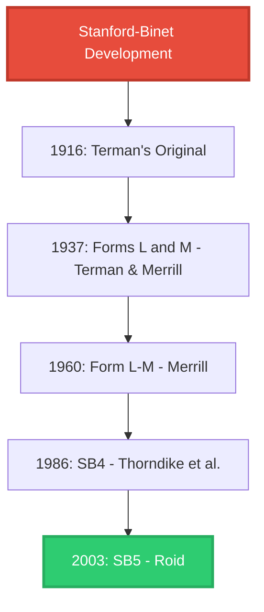
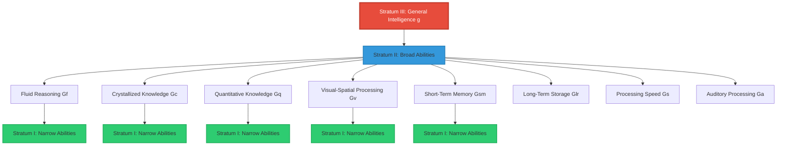
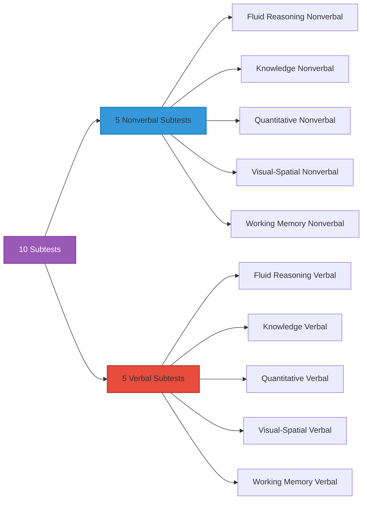
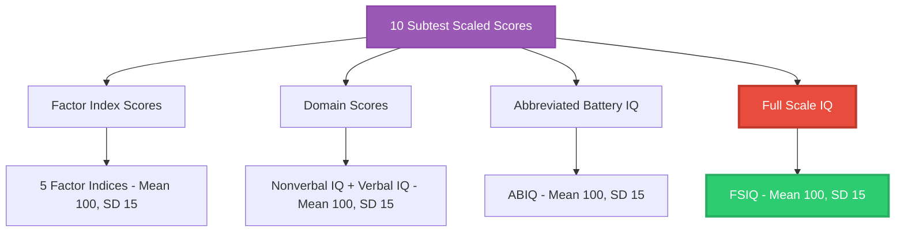

# Stanford-Binet Intelligence Scales

## Introduction

The Stanford-Binet Intelligence Scales represent the longest continuous lineage in psychological assessment, spanning over a century from Alfred Binet's original 1905 work to today's sophisticated fifth edition. This test has shaped intelligence assessment more profoundly than perhaps any other instrument, establishing fundamental concepts like mental age, IQ, and standardized administration that now seem self-evident but were revolutionary innovations.

Understanding the Stanford-Binet's evolution reveals not only the history of intelligence testing but also the changing theoretical understanding of cognitive abilities themselves.

---

## Historical Development: From Binet to Terman

### Lewis M. Terman: Bringing Binet to America

**Lewis Madison Terman** (1877-1956), a psychologist at Stanford University, recognized the potential of Binet's work and undertook its comprehensive adaptation for American use. His 1916 **Stanford-Binet Intelligence Scale** wasn't merely a translation but a complete reconceptualization.

**Terman's Key Contributions (1916):**

1. **Rigorous Standardization**
   - Tested **2,300 participants** (unprecedented sample size)
   - Included diverse ages, geographic regions, and backgrounds
   - Established American norms

2. **IQ Adoption**
   - First major test to use Stern's IQ formula: (MA/CA) × 100
   - Provided interpretation guidelines for IQ ranges
   - Made intelligence quotient the standard metric

3. **Comprehensive Manual**
   - Detailed administration instructions
   - Scoring guidelines with examples
   - Theoretical background
   - Served as teaching tool for test users

4. **Item Refinement**
   - Replaced, revised, and added items based on American context
   - Ensured items were appropriate and culturally relevant
   - Improved psychometric properties

**Impact**: The Stanford-Binet became the "gold standard" for individual intelligence testing, dominating the field for decades.

### The 1937 Revision: Forms L and M

**Terman and Maud Merrill** produced a major revision introducing two significant innovations:

**Dual Forms:**
- **Form L** (Lewis): 129 items
- **Form M** (Maud): 129 items
- Parallel forms allowed retesting without practice effects

**Extended Age Range:**
- Covered ages 2 through adult
- Better differentiation at extreme ranges
- Improved measurement of gifted individuals



### The 1960 Form L-M: Deviation IQ Era

**Maud Merrill** led the third revision after Terman's death, creating the **Form L-M** by selecting the best items from both previous forms.

**Major Innovation: Deviation IQ**
- **Mean = 100**
- **Standard Deviation = 16**
- Replaced problematic ratio IQ
- Allowed meaningful comparison across ages
- Maintained through all subsequent versions

**Item Selection:**
- **142 "best" items** from Forms L and M
- Chosen based on:
  - Psychometric properties (reliability, validity)
  - Discrimination at various ability levels
  - Age-appropriateness
  - Cultural fairness

### The 1986 Fourth Edition (SB4)

The **SB4** represented a theoretical breakthrough, moving from a purely psychometric to a **theory-driven** approach.

**Innovations:**
1. **Hierarchical Model**: Based on g-factor with specific abilities
2. **Point Scale Format**: Abandoned pure age-scale approach
3. **Routing Procedure**: Used Vocabulary subtest to establish starting point
4. **Composite Scores**: Provided domain-specific scores, not just overall IQ

**Four Main Areas Assessed:**
- Verbal Reasoning
- Abstract/Visual Reasoning
- Quantitative Reasoning
- Short-Term Memory

**Limitations:**
- Less flexible than Wechsler scales
- Some subtests poorly validated
- Limited nonverbal assessment
- Routing procedure sometimes problematic

---

## The Stanford-Binet Fifth Edition (SB5)

### Theoretical Foundation: CHC Theory

The **SB5** (Roid, 2003) marked a paradigm shift by adopting the **Cattell-Horn-Carroll (CHC) theory**—the most comprehensive and empirically supported model of cognitive abilities.

**CHC Theory Structure:**


**SB5 measures five CHC factors:**
1. **Fluid Reasoning (Gf)**: Novel problem-solving
2. **Knowledge (Gc)**: Acquired information and vocabulary
3. **Quantitative Reasoning (Gq)**: Mathematical thinking
4. **Visual-Spatial Processing (Gv)**: Mental manipulation of visual information
5. **Working Memory (Gsm)**: Temporary information storage and manipulation

### Revolutionary Dual-Domain Structure

The SB5's most distinctive feature: **Every factor assessed through both verbal and nonverbal domains**.



**Why this matters:**
- **Comprehensive assessment**: 50% of test is nonverbal—unique among major batteries
- **Language-impaired individuals**: Can still demonstrate abilities
- **Cross-cultural applicability**: Less language-dependent
- **Differential diagnosis**: Can identify verbal vs. nonverbal discrepancies

### Age Range and Applications

**Target Population**: Ages 2 to 89+ years

**Primary Uses:**
- Diagnosing intellectual disabilities
- Identifying giftedness
- Educational planning
- Neuropsychological assessment
- Forensic evaluation
- Research on cognitive development

---

## SB5 Structure and Subtests

### The Five CHC Factor Indices

Each factor index combines one verbal and one nonverbal subtest:

### 1. Fluid Reasoning (Gf)

**Nonverbal Domain: Object Series/Matrices**
- **Materials**: Pictured objects, geometric patterns
- **Task**: Identify sequences or complete matrix patterns
- **Skills assessed**:
  - Pattern recognition
  - Inductive reasoning
  - Rule inference
  - Figural reasoning

**Example item**: "Which shape completes this pattern: △ ○ △ ○ △ __?"

**Verbal Domain: Early Reasoning, Verbal Absurdities, Verbal Analogies**
- **Early Reasoning (ages 2-3)**: "Show me which one doesn't belong"
- **Verbal Absurdities (ages 4-5)**: "What's silly about: 'The boy brushed his teeth with soap'?"
- **Verbal Analogies (ages 6+)**: "Hot is to cold as up is to ____?"

**Skills assessed**:
- Deductive reasoning
- Identifying logical inconsistencies
- Relational thinking
- Cause-effect understanding

### 2. Knowledge (Gc)

**Nonverbal Domain: Procedural Knowledge, Picture Absurdities**
- **Procedural Knowledge**: Identify common actions, signals, objects from pictures
  - Example: Point to picture showing how to unlock a door
- **Picture Absurdities**: Identify missing or absurd elements in illustrations
  - Example: Picture of bicycle missing front wheel

**Skills assessed**:
- Visual recognition of common knowledge
- Understanding of everyday concepts
- Practical/procedural knowledge

**Verbal Domain: Vocabulary**
- **Format**: Define increasingly difficult words
- **Progression**:
  - Ages 2-3: Point to pictures (e.g., "Show me the dog")
  - Ages 4-5: Name pictures
  - Ages 6+: Define words (e.g., "What does 'ambitious' mean?")

**Skills assessed**:
- Accumulated vocabulary knowledge
- Verbal concept formation
- Language development
- Crystallized intelligence

### 3. Quantitative Reasoning (Gq)

**Nonverbal Domain: Nonverbal Quantitative Reasoning**
- **Materials**: Illustrated math concepts, manipulatives
- **Tasks**:
  - Pre-math concepts (more/less, bigger/smaller)
  - Counting illustrated objects
  - Number patterns with pictures
  - Basic arithmetic with visual aids

**Example**: Show picture with different numbers of objects: "Point to the group with more"

**Verbal Domain: Verbal Quantitative Reasoning**
- **Task Types**:
  - Counting verbally
  - Solving word problems
  - Mental arithmetic
  - Algebraic reasoning (older ages)

**Example items** (by difficulty):
- "Count from 1 to 10"
- "If you have 3 apples and get 2 more, how many do you have?"
- "A shirt costs $25 and is on sale for 20% off. What's the sale price?"

### 4. Visual-Spatial Processing (Gv)

**Nonverbal Domain: Form Board, Form Patterns**
- **Form Board**:
  - Materials: Puzzle pieces, board
  - Task: Fit pieces into board to match target shape
  - Ages: 2-5 years primarily

- **Form Patterns**:
  - Materials: Plastic geometric pieces
  - Task: Arrange pieces to match illustrated patterns
  - Difficulty increases with complexity and number of pieces

**Skills assessed**:
- Spatial visualization
- Mental rotation
- Part-whole relationships
- Visual-motor coordination

**Verbal Domain: Position and Direction**
- **Early items**: "Point to the object behind the chair"
- **Later items**: "Describe the route from A to B" (using map)
- **Advanced items**: Complex spatial direction problems

**Skills assessed**:
- Spatial vocabulary comprehension
- Mental mapping
- Left-right orientation
- Perspective taking

### 5. Working Memory (Gsm)

**Nonverbal Domain: Delayed Response, Block Span**
- **Delayed Response** (ages 2-3):
  - Hide object under one of several cups
  - Delay period with distraction
  - Child points to correct location

- **Block Span** (ages 4+):
  - Examiner taps sequence on blocks
  - Child reproduces sequence
  - Increasing length and complexity

**Skills assessed**:
- Visual-spatial short-term memory
- Working memory capacity
- Attention and concentration

**Verbal Domain: Memory for Sentences, Last Word**
- **Memory for Sentences**:
  - Examiner reads sentence
  - Examinee repeats verbatim
  - Increasing length and grammatical complexity

- **Last Word**:
  - Examiner reads series of questions
  - Examinee answers each, then recalls the last word of each question
  - Tests working memory with interference

**Skills assessed**:
- Auditory short-term memory
- Verbal working memory
- Storage and manipulation of information

---

## Administration and Scoring

### Routing Procedure

Unlike age-based entry, SB5 uses **functional level routing**:

1. **Start with routing subtests**:
   - Nonverbal Fluid Reasoning (Object Series/Matrices)
   - Verbal Knowledge (Vocabulary)

2. **Determine functional level** based on routing performance

3. **Administer remaining 8 subtests** at appropriate difficulty

**Advantages:**
- Individualized starting points
- Reduces frustration (not too easy or hard)
- More efficient testing
- Better floor and ceiling

### Basal and Ceiling Rules

**Basal**: Lowest level where examinee passes all items
- Ensures competence at foundational level
- Provides stable score base

**Ceiling**: Highest level where examinee fails specified number of items
- Prevents unnecessary frustration
- Defines upper limit of ability
- Typically: 3-4 consecutive failures

### Testing Time

**Complete Battery**: 45-75 minutes (varies by age and ability)

**Abbreviated Battery**: 15-20 minutes
- Uses only two routing subtests
- Provides quick screening
- Nonverbal Fluid Reasoning + Verbal Knowledge

---

## Scoring and Interpretation

### Raw Scores to Scaled Scores

**Process:**
1. Sum correct responses for each subtest → Raw Score
2. Convert using age-specific norms → Scaled Score (Mean=10, SD=3)
3. Combine scaled scores → Composite Scores

### Composite Score Types



### Score Ranges and Interpretation

| IQ Range | Classification | Percentile | Frequency |
|----------|----------------|------------|-----------|
| **145-160** | Very Gifted/Highly Advanced | 99.9+ | ~0.1% |
| **130-144** | Gifted/Very Advanced | 98-99.8 | ~2% |
| **120-129** | Superior | 91-97 | ~7% |
| **110-119** | High Average | 75-90 | ~16% |
| **90-109** | Average | 25-74 | ~50% |
| **80-89** | Low Average | 9-24 | ~16% |
| **70-79** | Borderline Impaired | 2-8 | ~7% |
| **55-69** | Mildly Impaired | 0.1-2 | ~2% |
| **40-54** | Moderately Impaired | &lt;0.1 | ~0.1% |

### Full Scale IQ (FSIQ)

**Calculation**: Combines all 10 subtest scaled scores

**Interpretation:**
- **Most reliable global estimate** of cognitive functioning
- **Standard Error of Measurement**: Approximately ±3-4 points
- **90% Confidence Interval**: FSIQ ± 5 points
- **95% Confidence Interval**: FSIQ ± 6 points

**Example**: If FSIQ = 115
- 90% confident true score is 110-120
- 95% confident true score is 109-121

### Factor Index Scores

Each combining one verbal + one nonverbal subtest:

**When to emphasize factor scores:**
- Significant variability across factors
- Specific learning disabilities suspected
- Differential diagnosis needed
- Educational planning requiring strength/weakness analysis

**Example Profile:**
- Fluid Reasoning: 125 (Superior)
- Knowledge: 105 (Average)
- Quantitative: 110 (High Average)
- Visual-Spatial: 120 (Superior)
- Working Memory: 95 (Average)

**Interpretation**: Strengths in novel problem-solving and spatial processing; average accumulated knowledge and memory—suggests high potential with learning disabilities affecting memory/acquisition.

### Domain Scores: Nonverbal IQ vs. Verbal IQ

**Nonverbal IQ (NVIQ)**:
- Combines 5 nonverbal subtests
- Less influenced by language facility
- Useful for English language learners
- Critical for hearing impairments

**Verbal IQ (VIQ)**:
- Combines 5 verbal subtests
- Emphasizes language-based reasoning
- Predicts academic achievement
- Sensitive to language disorders

**Discrepancy Analysis:**
- NVIQ-VIQ difference ≥12 points: clinically significant
- NVIQ > VIQ: May indicate language impairment, hearing loss, or limited English proficiency
- VIQ > NVIQ: May suggest visual-spatial processing deficits or motor difficulties

### Abbreviated Battery IQ (ABIQ)

**Composition**: Nonverbal Fluid Reasoning + Verbal Knowledge

**Uses:**
- **Screening**: Quick cognitive assessment
- **Research**: When comprehensive testing not needed
- **Progress monitoring**: Brief repeated assessments
- **Gatekeeping**: Initial evaluation before full battery

**Limitation**: Not comprehensive enough for diagnostic decisions

### Change-Sensitive Scores (CSS)

**Purpose**: Track cognitive growth over time using criterion-referenced scaling

**Scale**: Approximately 430 (2-year-old level) to 520 (adult level)

**Application:**
- **Longitudinal research**: Measuring cognitive development
- **Intervention evaluation**: Assessing treatment effects
- **Extreme performance**: When standard scores hit floor/ceiling
- **Age-equivalent scores**: Can be derived from CSS

**Advantage**: Unlike standard scores, CSS values increase with improving ability regardless of age-based norms.

---

## Psychometric Properties

### Reliability

**Internal Consistency (Split-Half):**
- FSIQ: .97-.98 (excellent)
- Factor Indices: .90-.92 (very good)
- Subtests: .84-.89 (good)

**Test-Retest Stability:**
- FSIQ: .93 (1-8 month interval)
- Remains stable across age groups

### Validity

**Convergent Validity:**
- **With WISC-IV FSIQ**: r = .84
- **With WAIS-III FSIQ**: r = .81
- **With previous SB4**: r = .90

**Predictive Validity:**
- **Academic achievement**: r = .70-.75
- **Occupational success**: r = .50-.60 (moderate, as expected)

**Clinical Validity:**
- Successfully differentiates:
  - Intellectual disabilities from average
  - Gifted from average
  - Learning disabilities (specific patterns)
  - ADHD (working memory weaknesses)

### Standardization Sample

**N = 4,800 individuals** (ages 2-85+)

**Stratification variables** (matched to U.S. Census):
- Age
- Gender
- Ethnicity/Race
- Geographic region
- Socioeconomic status (education level)

**Strength**: One of the most representative samples in psychological assessment

---

## Clinical Applications and Case Examples

### Case 1: Identifying Giftedness

**Background**: 6-year-old referred for advanced placement consideration

**SB5 Results:**
- FSIQ: 138 (Very Gifted)
- Fluid Reasoning: 145
- Knowledge: 135
- Quantitative: 140
- Visual-Spatial: 132
- Working Memory: 125

**Interpretation**: Consistently high performance across all domains, particularly in novel problem-solving. Qualifies for gifted programming.

**Educational recommendations**:
- Accelerated curriculum
- Enrichment in STEM subjects
- Challenge projects requiring creative problem-solving
- Social-emotional support for asynchronous development

### Case 2: Learning Disability Pattern

**Background**: 9-year-old struggling in school despite apparent intelligence

**SB5 Results:**
- FSIQ: 102 (Average)—but misleading
- Fluid Reasoning: 118 (High Average)
- Knowledge: 95 (Average)
- Quantitative: 105 (Average)
- Visual-Spatial: 120 (Superior)
- Working Memory: 78 (Borderline)

**Interpretation**: Significant working memory weakness (42-point gap from highest factor) suggests specific learning disability affecting memory and potentially reading/writing.

**Educational recommendations**:
- Formal evaluation for specific learning disability
- Accommodations: Extended time, reduced working memory load
- Explicit instruction in memory strategies
- Leverage visual-spatial strengths in instruction

### Case 3: Nonverbal vs. Verbal Discrepancy

**Background**: 7-year-old, English as second language, academic concerns

**SB5 Results:**
- FSIQ: 98 (Average)
- **Nonverbal IQ: 115 (High Average)**
- **Verbal IQ: 85 (Low Average)**
- 30-point NVIQ-VIQ discrepancy

**Interpretation**: Strong nonverbal reasoning abilities masked by language barrier. Cognitive potential much higher than verbal performance suggests.

**Educational recommendations**:
- English language support services
- Use visual and hands-on learning methods
- Don't assume low cognitive ability based on language difficulties
- Reassess after 1-2 years of English instruction

---

## Strengths and Limitations

### Major Strengths

✅ **Theoretical sophistication**: Strong CHC foundation
✅ **Nonverbal emphasis**: 50% nonverbal unique among major tests
✅ **Age range**: 2-89+ years, lifespan coverage
✅ **Psychometric quality**: Excellent reliability and validity
✅ **Standardization**: Large, representative sample
✅ **Flexibility**: Multiple score types for diverse purposes
✅ **Historical continuity**: Allows comparison across decades
✅ **CSS scores**: Enable longitudinal comparisons

### Limitations

❌ **Administration time**: Longer than some alternatives (45-75 min)
❌ **Complexity**: Requires extensive training for proper administration
❌ **Routing subtest dependency**: Performance on these affects rest of test
❌ **Motor demands**: Some subtests require fine motor skills
❌ **Practice effects**: Limited by parallel form availability
❌ **Cost**: Expensive test kit and continuing education requirements
❌ **Limited process information**: Doesn't capture *how* examinee solves problems as richly as some alternatives

---

## Comparison with Wechsler Scales

| Feature | Stanford-Binet 5 | WISC-V/WAIS-IV |
|---------|------------------|----------------|
| **Age range** | 2-89+ years | WISC: 6-16; WAIS: 16-90 |
| **Theoretical basis** | CHC theory | CHC theory |
| **Nonverbal testing** | 50% of battery | Limited |
| **Starting point** | Routing subtests | Fixed by age |
| **Item format** | More varied, visual | More verbal, paper-pencil |
| **Scoring** | Standard + CSS | Standard scores only |
| **Administration time** | 45-75 min | 65-80 min |
| **Best for** | Very young, very old, nonverbal emphasis | School-age, traditional academics |

**When to choose SB5:**
- Preschool children (ages 2-5)
- Elderly adults (85+)
- Language impairments or English learners
- Need for nonverbal assessment
- Extremely gifted (better ceiling)

**When to choose Wechsler:**
- School-age children (standard case)
- More process score information needed
- Integration with achievement tests (WIAT)
- Insurance/system requirements
- Clinician more familiar with this battery

---

## Memory Aids

### 🎯 **5 CHC Factors: "FKQVW"**
- **F**luid Reasoning
- **K**nowledge (Gc)
- **Q**uantitative
- **V**isual-Spatial
- **W**orking Memory

### 🧠 **SB5 Structure: "5 Factors × 2 Domains = 10 Subtests"**
- Each of 5 factors has verbal AND nonverbal subtest
- Total = 10 subtests

### 📊 **Score Types Pyramid:**
```
     FSIQ (Full Scale IQ)
        /        \
   NVIQ          VIQ
   /    \        /   \
Factor Index Scores (5)
         |
  Subtest Scaled Scores (10)
```

### 🔢 **Remember: Mean 100, SD 15**
- FSIQ, Factor Indices, Domain Scores
- Subtest Scaled Scores: Mean 10, SD 3

---

## Self-Assessment Questions

### Question 1: Historical Context
**How did the Stanford-Binet's evolution reflect changing theories of intelligence from Terman's 1916 version through the current SB5?**

<details>
<summary>View Answer</summary>

**1916 (Terman)**: Reflected Binet's practical atheoretical approach
- Focus: General mental ability (IQ)
- Method: Age-scale format
- Theory: Minimal theoretical grounding, pragmatic measurement

**1937 (Terman & Merrill)**: Maintained age-scale approach, added parallel forms
- Still focused on general intelligence
- Improved psychometrics but same conceptual framework

**1960 (Merrill)**: Introduced deviation IQ
- More sophisticated statistical approach
- Still age-scale format, minimal theory

**1986 (SB4)**: First major theoretical shift
- Hierarchical model (g + specific abilities)
- Point-scale format
- Four domain scores
- Theory-driven item selection

**2003 (SB5)**: Full adoption of CHC theory
- Five broad CHC abilities
- Nonverbal/Verbal distinction across all factors
- Sophisticated theoretical foundation
- Integration of contemporary cognitive science

**Overall trend**: From atheoretical pragmatism → basic hierarchical model → comprehensive CHC framework, reflecting psychology's theoretical maturation.
</details>

### Question 2: Clinical Application
**A 5-year-old child scores FSIQ = 85 with the following factor indices: Fluid Reasoning = 105, Knowledge = 75, Quantitative = 80, Visual-Spatial = 90, Working Memory = 100. Interpret this profile and suggest educational implications.**

<details>
<summary>View Answer</summary>

**Profile Analysis:**
- **FSIQ = 85**: Low Average, but significant scatter makes this less meaningful
- **Strengths**: 
  - Fluid Reasoning (105) = Average: Good problem-solving potential
  - Working Memory (100) = Average: Can hold information adequately
- **Weaknesses**:
  - Knowledge (75) = Borderline: Limited vocabulary and acquired information
  - Quantitative (80) = Low Average: Pre-math concepts underdeveloped
- **30-point spread**: Fluid Reasoning to Knowledge—clinically significant

**Interpretation:**
Strong cognitive potential (Fluid Reasoning intact) but limited knowledge acquisition, likely reflecting:
1. **Environmental factors**: Limited early learning opportunities, few books, minimal academic exposure
2. **Language experience**: Possibly limited verbal interaction
3. **Not intellectual disability**: Problem-solving ability is age-appropriate

**Educational Implications:**
- **Preschool enrichment program**: High priority
- **Language-rich environment**: Extensive vocabulary building
- **Explicit teaching**: Don't assume knowledge; teach systematically
- **Strengths-based approach**: Use problem-solving ability to build knowledge
- **Early intervention**: Prevent widening achievement gap
- **Optimistic prognosis**: With intervention, can likely reach average range

**NOT suggested**: Special education placement—this child needs enrichment, not remediation of cognitive abilities.
</details>

### Question 3: Assessment Choice
**When would you specifically choose the SB5 over the WISC-V for a school-age child? Provide three scenarios with rationale.**

<details>
<summary>View Answer</summary>

**Scenario 1: Suspected Extremely High Ability**
- **Age**: 7-year-old, academically advanced
- **Reason**: SB5 has higher ceiling (IQ up to 160+) than WISC-V (typically maxes ~145-150)
- **Benefit**: Better differentiation among gifted; more precise measurement at extreme high end
- **Rationale**: For gifted program placement decisions, need precise measurement

**Scenario 2: Significant Language Impairment or English Learner**
- **Age**: 8-year-old, hearing impaired or limited English proficiency
- **Reason**: SB5 has 50% nonverbal subtests across all domains; WISC-V more language-dependent
- **Benefit**: Can assess cognitive abilities without language confound
- **Rationale**: Obtain valid estimate of cognitive potential not masked by language limitations

**Scenario 3: Very Young Child at Lower End of WISC-V Range**
- **Age**: 6-year-old with developmental delays
- **Reason**: SB5 starts at age 2 with better floor at young ages; WISC-V starts at age 6
- **Benefit**: More appropriate items for developmental level; better differentiation at lower ability levels
- **Rationale**: More sensitive measurement when abilities below age expectations

**Additional scenario**: Need for Change-Sensitive Scores (CSS) for longitudinal tracking—unique to SB5.
</details>

### Question 4: Score Interpretation
**Explain the difference between Factor Index Scores, Domain Scores, and FSIQ. When would each be most clinically useful?**

<details>
<summary>View Answer</summary>

**Factor Index Scores (5 scores):**
- **What**: Each combines one verbal + one nonverbal subtest measuring one CHC ability
- **Examples**: Fluid Reasoning Index, Working Memory Index
- **Most useful when**:
  - Identifying specific cognitive strengths/weaknesses
  - Differential diagnosis (e.g., learning disabilities show specific patterns)
  - Educational planning (target intervention to weak areas)
  - Profile shows significant scatter (>15-20 points between factors)

**Domain Scores (2 scores: NVIQ and VIQ):**
- **What**: NVIQ = all 5 nonverbal subtests; VIQ = all 5 verbal subtests
- **Most useful when**:
  - Language impairment or hearing loss suspected (NVIQ shows "true" ability)
  - English learners (NVIQ less influenced by language proficiency)
  - Suspected language-based learning disability (VIQ lower than NVIQ)
  - Visual-spatial or motor deficits (NVIQ lower than VIQ)
  - Significant NVIQ-VIQ discrepancy (>12 points) suggests differential abilities

**Full Scale IQ (FSIQ):**
- **What**: Combines all 10 subtests—global cognitive ability estimate
- **Most useful when**:
  - No significant subtest scatter (relatively flat profile)
  - Overall cognitive level needed (e.g., intellectual disability diagnosis)
  - General screening or gatekeeping decisions
  - Comparing to population norms or cutoff scores (e.g., gifted programs)
  - Most reliable single score (highest reliability coefficient)

**Clinical Decision Rule**:
1. Always calculate FSIQ
2. If large factor-to-factor variability (>15 pts), emphasize Factor Indices over FSIQ
3. If NVIQ-VIQ discrepancy >12 pts, emphasize Domain Scores
4. If profile relatively flat, FSIQ is most meaningful summary
</details>

### Question 5: Psychometric Understanding
**A child receives FSIQ = 115. Explain what this score means using: (a) percentile, (b) confidence interval, (c) classification, and (d) comparison to population distribution.**

<details>
<summary>View Answer</summary>

**(a) Percentile:**
FSIQ = 115 corresponds to approximately the **84th percentile**
- Meaning: This child performs better than 84% of same-age peers
- Alternative: Only 16% of children this age score higher

**(b) Confidence Interval (90%):**
True score likely between **110-120**
- Calculation: 115 ± 5 (1.65 × SEM ≈ 3)
- Meaning: If we tested this child 100 times, 90 of those times the score would fall in this range
- Implication: Don't over-interpret small differences—115 vs. 118 likely not meaningful

**(c) Classification:**
**High Average** range (110-119)
- Above average but not quite "Superior" (which starts at 120)
- Solid cognitive abilities, likely to perform well academically
- Not qualifying threshold for gifted programs (typically 130+)

**(d) Population Distribution:**
```
|-------|-------|-------|-------|-------|-------|-------|
55     70      85     100    115    130    145
                         ↑
                      Child's score
```
- **One standard deviation above mean** (mean=100, SD=15, so 100+15=115)
- In a classroom of 30 students, approximately **5 students** would score at this level or higher
- **Within normal range** but toward the higher end
- Academic implications: Should handle grade-level work well; may benefit from accelerated pace or enrichment

**Important caveat**: This is a *sample* of cognitive abilities at one point in time, influenced by factors like motivation, anxiety, health, and environmental circumstances. Should be interpreted in context of other information (achievement, behavior, background).
</details>

---

## Further Resources

### 📚 **Wikipedia Articles**
- [Stanford-Binet Intelligence Scales](https://en.wikipedia.org/wiki/Stanford%E2%80%93Binet_Intelligence_Scales) - Comprehensive overview
- [Cattell-Horn-Carroll theory](https://en.wikipedia.org/wiki/Cattell%E2%80%93Horn%E2%80%93Carroll_theory) - Theoretical foundation
- [Lewis Terman](https://en.wikipedia.org/wiki/Lewis_Terman) - Developer of Stanford-Binet

### 📖 **Key Resources**
- Roid, G. H. (2003). *Stanford-Binet Intelligence Scales, Fifth Edition: Technical Manual.* Riverside Publishing. (Definitive technical reference)
- Roid, G. H., & Barram, R. A. (2004). *Stanford-Binet Intelligence Scales, Fifth Edition: Interpretive Manual.* (Clinical interpretation guide)

### 🎥 **Educational Videos**
- [Stanford-Binet V Overview](https://www.youtube.com/results?search_query=stanford+binet+5+overview) - Administration and interpretation
- [CHC Theory Explained](https://www.youtube.com/watch?v=1wjNx2LkVEo) - Theoretical foundation

### 🔬 **Advanced Reading**
- [Riverside Publishing SB5 Resources](https://www.hmhco.com/programs/stanford-binet) - Official publisher materials
- [CHC Theory Overview](http://www.thefreelibrarychorlton.com/chc-theory.html) - Detailed theoretical explanation

---

**Source PDFs**: 
- 📄 [Block-2/Unit-3.pdf - Pages 47-50](/pdfs/MPC-001%20Cognitive%20Psychology,%20Learning%20and%20Memory/Block-2/Unit-3.pdf)
- 📚 MPC-001 Cognitive Psychology, Learning and Memory

---

*Previous: [← History of Intelligence Testing](/mpc-001/block-2/history-intelligence-testing)*  
*Next: [Wechsler Intelligence Scales →](/mpc-001/block-2/wechsler-intelligence-scales)*