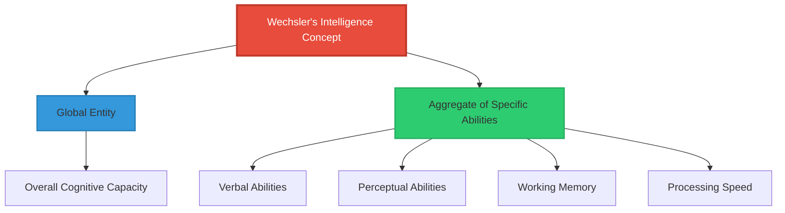
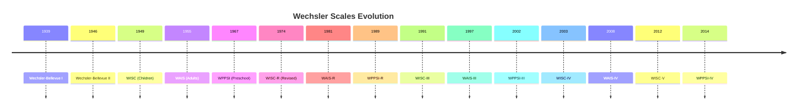
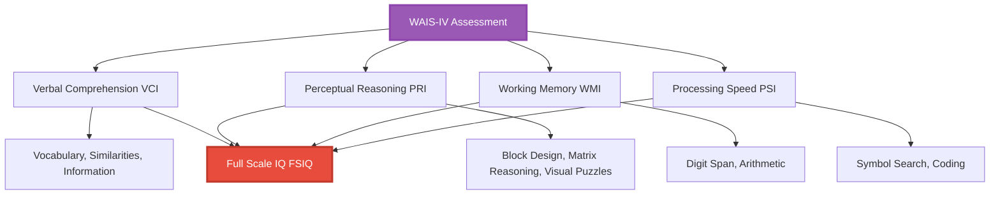
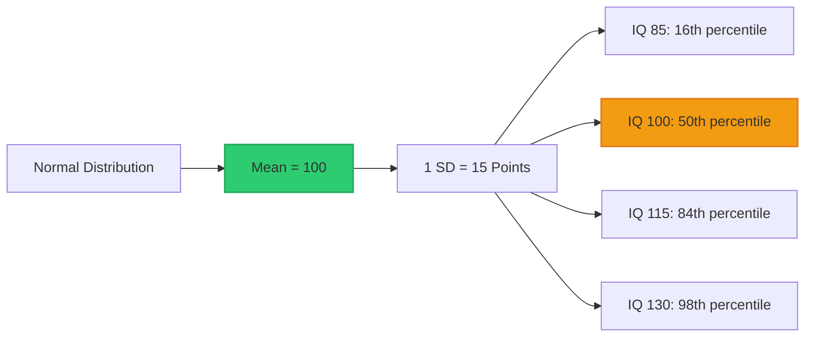

# Wechsler Intelligence Scales

## Introduction

The Wechsler intelligence scales represent the most widely used family of intelligence tests worldwide. Since David Wechsler's introduction of the Wechsler-Bellevue Intelligence Scale in 1939, these tests have dominated clinical and school psychology practice. Their popularity stems from practical design, strong psychometric properties, and comprehensive assessment of diverse cognitive abilities.

Understanding the Wechsler scales is essential for anyone working in psychological assessment, educational diagnosis, or clinical neuropsychology.

---

## David Wechsler: Revolutionary Practitioner

### Background and Philosophy

**David Wechsler** (1896-1981), a Romanian-American psychologist, worked at Bellevue Psychiatric Hospital in New York. His clinical experience revealed limitations in existing tests, particularly the Stanford-Binet, which:
- Was designed primarily for children
- Used mental age concept problematic for adults
- Emphasized verbal abilities
- Provided single IQ score without ability profile

### Wechsler's Definition of Intelligence

Wechsler (1944) defined intelligence as:

> "The aggregate or global capacity of the individual to act purposefully, to think rationally, and to deal effectively with the environment."

**Key aspects:**
- **Global**: Characterizes overall behavior
- **Aggregate**: Composed of specific, qualitatively distinct abilities
- **Purposeful action**: Goal-directed behavior
- **Rational thinking**: Logical reasoning
- **Environmental adaptation**: Real-world effectiveness

This definition influenced test construction, leading to diverse subtests sampling multiple ability domains.

---

## The Wechsler Family of Tests

Wechsler developed separate batteries for different age groups, recognizing that cognitive assessment requirements vary across the lifespan.

### Historical Development

### Current Wechsler Battery Suite

| Test | Full Name | Age Range | Primary Use |
|------|-----------|-----------|-------------|
| **WPPSI-IV** | Wechsler Preschool and Primary Scale of Intelligence-IV | 2½ - 7 years | Preschool cognitive assessment |
| **WISC-V** | Wechsler Intelligence Scale for Children-V | 6 - 16 years | School-age evaluation, educational planning |
| **WAIS-IV** | Wechsler Adult Intelligence Scale-IV | 16 - 90 years | Adult cognitive assessment, clinical diagnosis |

**Overlap strategy**: Provides continuity across lifespan while addressing age-specific needs.

---

## WAIS-IV: Structure and Composition

### Overview

The **Wechsler Adult Intelligence Scale-Fourth Edition (WAIS-IV)**, released in 2008, assesses adults aged 16-90 years. It represents the culmination of nearly 70 years of refinement.

**Key Innovation**: Removed traditional Verbal IQ/Performance IQ dichotomy, replacing it with four **index scores** based on contemporary cognitive theory.

### The Four Index Scores

### Index 1: Verbal Comprehension (VCI)

**Purpose**: Measures verbal reasoning, concept formation, and crystallized knowledge acquired through education and acculturation.

**Core Subtests:**

**1. Similarities** (Abstract Verbal Reasoning)
- **Format**: "In what way are X and Y alike?"
- **Examples**:
  - Easy: "In what way are an apple and a pear alike?" (Both fruit)
  - Medium: "In what way are a poem and a statue alike?" (Both art)
  - Hard: "In what way are praise and punishment alike?" (Both modify behavior)
- **Skills**: Abstract reasoning, categorical thinking, verbal concept formation
- **Scoring**: 0 (no/poor response), 1 (concrete), 2 (abstract/conceptual)

**2. Vocabulary** (Learned Word Knowledge)
- **Format**: "What does [word] mean?"
- **Example progression**:
  - Level 1: "What is a bicycle?" (Common object)
  - Level 2: "What does 'enormous' mean?" (Common adjective)
  - Level 3: "What does 'sanctuary' mean?" (Less common noun)
  - Level 4: "What does 'tirade' mean?" (Advanced vocabulary)
- **Skills**: Word knowledge, verbal fluency, crystallized intelligence
- **Scoring**: 0-2 based on definition quality

**3. Information** (General Knowledge)
- **Format**: Answer factual questions about general knowledge
- **Example questions**:
  - "How many months are in a year?"
  - "Who wrote Hamlet?"
  - "What is the capital of Egypt?"
  - "What causes tides?"
- **Skills**: Long-term memory, educational achievement, cultural learning
- **Note**: Some criticism for cultural bias; assumes Western education

**Supplemental Subtest:**

**4. Comprehension** (Practical Reasoning)
- **Format**: Answer questions about social conventions, proverbs, and practical problems
- **Examples**:
  - "Why do we have laws?"
  - "What does 'A rolling stone gathers no moss' mean?"
  - "Why is it important to vote?"
- **Skills**: Social judgment, practical reasoning, common sense

**VCI Interpretation:**
- **High VCI**: Strong verbal abilities, good vocabulary, well-educated, reads extensively
- **Low VCI**: Language difficulties, limited education, possible learning disability
- **Cultural note**: Highly influenced by educational and cultural opportunities

### Index 2: Perceptual Reasoning (PRI)

**Purpose**: Measures nonverbal reasoning, visual-spatial processing, and fluid intelligence (ability to solve novel problems).

**Core Subtests:**

**1. Block Design** (Visual-Spatial Construction)
- **Materials**: Nine red-and-white blocks
- **Task**: Arrange blocks to match displayed patterns
- **Timed**: Bonus points for speed
- **Skills**: Visual-spatial analysis, part-whole relationships, visual-motor coordination
- **Example**: Create checkerboard pattern, complex geometric designs
- **Clinical significance**: Sensitive to brain damage, especially right hemisphere

**2. Matrix Reasoning** (Nonverbal Abstract Reasoning)
- **Format**: Visual pattern completion
- **Task**: Select missing piece that completes a visual pattern or matrix
- **Example**: 3×3 grid with 8 pictures, find the 9th that completes the pattern
- **Skills**: Inductive reasoning, pattern recognition, abstract thinking
- **Advantage**: No time limit, minimal motor demands, culturally reduced

**3. Visual Puzzles** (Visual-Spatial Reasoning)
- **Format**: Mental puzzle completion
- **Task**: Select three options that combine to form a target puzzle
- **No manipulation**: Purely mental visualization
- **Skills**: Visual analysis, spatial visualization, mental rotation
- **Example**: View complete picture, identify which 3 pieces form it

**Supplemental Subtests:**

**4. Picture Completion**
- **Task**: Identify missing element in pictures
- **Example**: Clock with missing hand, bicycle without pedal
- **Skills**: Visual perception, attention to detail, visual memory

**5. Figure Weights** (Quantitative and Analogical Reasoning)
- **Format**: Balance scale problems
- **Task**: Determine which option balances the scale
- **Skills**: Quantitative reasoning, logical thinking, problem-solving
- **Example**: Scale with different shapes; which shape balances it?

**PRI Interpretation:**
- **High PRI**: Strong nonverbal reasoning, good visual-spatial abilities, effective problem-solving
- **Low PRI**: Visual-spatial deficits, difficulty with novel problems, possible right hemisphere dysfunction
- **Clinical pattern**: PRI < VCI may suggest nonverbal learning disability

### Index 3: Working Memory (WMI)

**Purpose**: Measures ability to temporarily hold, manipulate, and transform information in conscious awareness—critical for complex cognitive tasks.

**Core Subtests:**

**1. Digit Span** (Auditory Working Memory)

Three components administered in sequence:

**Digit Span Forward** (Short-term memory):
- Examiner reads number sequence
- Examinee repeats exactly as heard
- Example: "5-2-9-4" → Repeat "5-2-9-4"
- Increasing lengths (up to 9 digits)

**Digit Span Backward** (Working memory):
- Examiner reads sequence
- Examinee repeats in reverse order
- Example: "7-3-5" → Repeat "5-3-7"
- Requires mental manipulation

**Digit Span Sequencing** (Executive working memory):
- Examiner reads sequence
- Examinee repeats in ascending numerical order
- Example: "8-2-6-1" → Repeat "1-2-6-8"
- Most demanding, requires sorting

**Skills**: Attention, concentration, auditory short-term memory, working memory capacity

**2. Arithmetic** (Mental Arithmetic)
- **Format**: Orally presented word problems
- **Time-limited**: Must solve mentally without paper
- **Example questions**:
  - "If you have 3 apples and buy 2 more, how many do you have?"
  - "How many hours are in 2½ days?"
  - "A shirt costs $40 and is on sale for 25% off. What's the sale price?"
- **Skills**: Numerical reasoning, concentration, mental manipulation of information

**Supplemental Subtest:**

**3. Letter-Number Sequencing**
- **Format**: Mixed letters and numbers presented orally
- **Task**: Repeat numbers in ascending order, then letters in alphabetical order
- **Example**: Given "Q-1-B-3-J-2" → Respond "1-2-3-B-J-Q"
- **Skills**: Working memory, mental flexibility, dual-task processing

**WMI Interpretation:**
- **High WMI**: Good concentration, strong attention, effective mental manipulation
- **Low WMI**: Attention problems, difficulty with complex instructions, possible ADHD
- **Clinical significance**: Often impaired in ADHD, anxiety, depression, traumatic brain injury

### Index 4: Processing Speed (PSI)

**Purpose**: Measures speed of visual scanning, graphomotor speed, and cognitive efficiency in simple tasks.

**Core Subtests:**

**1. Symbol Search** (Visual Scanning Speed)
- **Format**: Target symbols and search group
- **Task**: Quickly determine if target symbol appears in search group
- **Time limit**: 120 seconds
- **Example**: Target: ▲ ○ | Search group: ● ■ ▲ ▼ → YES
- **Skills**: Visual perception speed, attention, cognitive efficiency

**2. Coding** (Visual-Motor Processing Speed)
- **Format**: Key showing number-symbol pairs
- **Task**: Fill in symbols corresponding to numbers as quickly as possible
- **Time limit**: 120 seconds
- **Example**: Key shows 1=▼, 2=○, 3=▲, etc. Given row of numbers, write symbols
- **Skills**: Processing speed, visual-motor coordination, learning ability, graphomotor speed

**Supplemental Subtest:**

**3. Cancellation**
- **Format**: Array of pictured objects
- **Task**: Cross out all target objects (e.g., all animals)
- **Two trials**: Random arrangement, then structured arrangement
- **Skills**: Visual-perceptual speed, attention, visual scanning

**PSI Interpretation:**
- **High PSI**: Quick mental processing, efficient performance, good visual-motor coordination
- **Low PSI**: Slow processing, may need extended time, possible motor difficulties
- **Clinical significance**: Often impaired in depression, brain injury, processing disorders
- **Age factor**: Processing speed declines with normal aging

---

## Full Scale IQ (FSIQ) and General Ability Index (GAI)

### Full Scale IQ (FSIQ)

**Composition**: Combines all four index scores

**Calculation**: Based on 10 core subtest scaled scores (3 from VCI, 3 from PRI, 2 from WMI, 2 from PSI)

**Interpretation:**
- **Most comprehensive** measure of overall cognitive ability
- **Most reliable** score (highest reliability coefficient ~.98)
- **Standard score**: Mean = 100, SD = 15

**When FSIQ is most meaningful:**
- Index scores relatively consistent (within 15 points)
- No significant subtest scatter
- General intellectual level needed (e.g., intellectual disability diagnosis)

**When FSIQ is less meaningful:**
- Large index score discrepancies (>23 points)
- Significant subtest scatter
- Processing speed significantly impaired (drags down overall score despite good reasoning)

### General Ability Index (GAI)

**Innovation**: Added to address limitations when processing factors impair FSIQ

**Composition**: VCI + PRI only (excludes WMI and PSI)

**Purpose**: Measures cognitive abilities less vulnerable to:
- Attention problems
- Processing speed deficits
- Working memory impairments
- Motor difficulties

**Clinical utility:**
- ADHD: GAI often significantly higher than FSIQ (working memory/processing speed drag down FSIQ)
- Depression: Processing speed slowed, GAI better reflects ability
- Brain injury: Processing deficits don't mask reasoning abilities
- Aging: Processing speed declines don't obscure intact reasoning

**Example:**
| Score | Value | Implication |
|-------|-------|-------------|
| VCI | 115 | High Average |
| PRI | 110 | Average |
| WMI | 85 | Low Average |
| PSI | 80 | Low Average |
| **FSIQ** | **97** | Average (but misleading) |
| **GAI** | **113** | High Average (better reflects ability) |

**Interpretation**: This person has strong reasoning abilities masked by slower processing and working memory weaknesses—GAI more accurately reflects cognitive potential.

---

## Administration and Scoring

### Standardized Procedures

**Critical requirements:**
1. **Verbatim instructions**: Read exactly as written
2. **Timing**: Use stopwatch for timed subtests
3. **Query procedures**: Follow guidelines for ambiguous responses
4. **Starting rules**: Age-appropriate starting points
5. **Discontinue rules**: Stop when specified failures reached
6. **Scoring criteria**: Apply detailed rubrics consistently

**Testing environment:**
- Quiet, well-lit room
- Minimal distractions
- Comfortable temperature
- Rapport building

**Typical administration time**: 65-80 minutes (core battery)

### Scaled Scores

**Raw scores → Scaled scores:**
- Each subtest converted using age-specific norms
- **Mean = 10, SD = 3**
- Range: 1-19 typically
- Allows comparison across subtests

**Scaled score interpretation:**

| Scaled Score | Classification | Percentile | Frequency |
|--------------|----------------|------------|-----------|
| **16-19** | Very Superior | 98-99.9 | ~2% |
| **13-15** | Superior | 84-97 | ~14% |
| **8-12** | Average | 25-75 | ~50% |
| **5-7** | Low Average | 5-16 | ~16% |
| **1-4** | Borderline/Low | <2 | ~2% |

### Index Scores and FSIQ

**Scaled scores → Index scores:**
- Sum relevant subtest scaled scores
- Convert using table to index score
- **Mean = 100, SD = 15**

**Standard error of measurement:**
- FSIQ: SEM ≈ 2-3 points
- Index scores: SEM ≈ 3-5 points
- **90% confidence interval**: ±5 points
- **95% confidence interval**: ±6-7 points

---

## Deviation IQ: Wechsler's Innovation

### The Deviation IQ Concept

Unlike ratio IQ (Mental Age / Chronological Age × 100), **deviation IQ** compares an individual to same-age peers.

**Formula concept:**
$$
\text{Deviation IQ} = 100 + 15 \times \frac{(\text{Individual's Score} - \text{Age Group Mean})}{\text{Standard Deviation}}
$$

**Key principle**: IQ 100 always means "average for your age group," regardless of what that age is.

### Advantages Over Ratio IQ

**1. Works across lifespan:**
- 16-year-old: Compared to 16-year-old norms
- 65-year-old: Compared to 65-year-old norms
- Both can have IQ 120 with same meaning (top 10%)

**2. Consistent standard deviation:**
- Always 15 points
- Percentiles always map same way
- Statistical analyses valid

**3. No ceiling problems:**
- Adult mental age doesn't plateau
- Can measure full range of ability at all ages

**4. Meaningful comparisons:**
- IQ 130 at age 20 and IQ 130 at age 70 both represent 98th percentile
- Can track stability or change over time

---

## Score Interpretation Guidelines

### IQ Classification

| IQ Range | Classification | Percentage | Implications |
|----------|----------------|------------|--------------|
| **130+** | Very Superior | 2.2% | Gifted, advanced educational placement |
| **120-129** | Superior | 6.7% | Above average, accelerated learning capability |
| **110-119** | High Average | 16.1% | Good academic potential |
| **90-109** | Average | 50% | Typical learning capacity |
| **80-89** | Low Average | 16.1% | May need learning support |
| **70-79** | Borderline | 6.7% | Significant learning challenges |
| **<70** | Extremely Low | 2.2% | Intellectual disability range |

### Index Score Discrepancy Analysis

**Significant discrepancies** suggest specific strengths/weaknesses:

**VCI vs. PRI:**
- **VCI > PRI** (≥12 points): Verbal strengths, possible nonverbal learning issues
- **PRI > VCI** (≥12 points): Visual-spatial strengths, possible language-based learning disability

**GAI vs. CPI (Cognitive Proficiency = WMI + PSI):**
- **GAI > CPI** (≥15 points): Strong reasoning despite attention/speed deficits (ADHD pattern)
- **CPI > GAI**: Unusual but possible in individuals with crystallized knowledge deficits

### Subtest Scatter Analysis

**Within-index scatter:**
- Examine individual subtest variability
- Differences >4-5 scaled points may indicate:
  - Specific skill deficits
  - Measurement error
  - Neurological issues
  - Attention fluctuations

**Example pattern in learning disability:**
| Subtest | Scaled Score | Index |
|---------|--------------|-------|
| Similarities | 12 | VCI |
| Vocabulary | 10 | VCI |
| Information | 7 | VCI (weakness) |
| **VCI** | **97** | |

Low Information despite adequate Similarities/Vocabulary suggests **acquired knowledge deficit** rather than reasoning problem.

---

## Clinical Applications

### Case Study 1: ADHD Pattern

**Background**: 24-year-old college student, attention concerns

**WAIS-IV Results:**
| Score Type | Value | Range |
|------------|-------|-------|
| VCI | 118 | High Average |
| PRI | 115 | High Average |
| WMI | 92 | Average |
| PSI | 88 | Low Average |
| **FSIQ** | **105** | Average |
| **GAI** | **117** | High Average |

**Interpretation:**
- **GAI significantly > FSIQ**: Strong reasoning abilities (117)
- **GAI-CPI discrepancy**: 29 points—highly significant
- **Pattern**: Strong reasoning, weak processing efficiency
- **Diagnosis support**: Consistent with ADHD (inattention affects WM/PS)
- **Academic impact**: Performs below ability level despite high potential

**Recommendations:**
- Accommodations: Extended time, reduced distractions
- Strategies: Break tasks into chunks, use external memory aids
- Consider ADHD assessment/treatment

### Case Study 2: Verbal Learning Disability

**Background**: 14-year-old, reading struggles despite effort

**WISC-V Results:**
| Score Type | Value | Range |
|------------|-------|-------|
| VCI | 88 | Low Average |
| PRI | 108 | Average |
| WMI | 95 | Average |
| PSI | 98 | Average |
| **FSIQ** | **97** | Average |

**Within VCI:**
- Similarities: 10 (Average)
- Vocabulary: 7 (Borderline)
- Information: 6 (Borderline)

**Interpretation:**
- **VCI < PRI**: 20-point discrepancy—verbal learning disability pattern
- **Within VCI**: Reasoning intact (Similarities 10), but acquired knowledge weak
- **Pattern**: Difficulty learning/retaining verbal information despite adequate reasoning
- **Diagnosis**: Language-based learning disability

**Recommendations:**
- Reading intervention: Structured literacy approach
- Accommodations: Audiobooks, extended time, oral testing options
- Leverage nonverbal strengths in instruction

### Case Study 3: Intellectual Disability

**Background**: 28-year-old, adaptive functioning concerns

**WAIS-IV Results:**
| Score Type | Value | Range |
|------------|-------|-------|
| VCI | 68 | Extremely Low |
| PRI | 72 | Borderline |
| WMI | 70 | Borderline |
| PSI | 75 | Borderline |
| **FSIQ** | **68** | Extremely Low |

**Adaptive Functioning**: Significantly below average in daily living skills, social skills, communication

**Interpretation:**
- **FSIQ < 70**: Meets intellectual functioning criterion
- **Consistent deficits**: All indices in borderline/low range
- **Adaptive functioning impaired**: Second criterion met
- **Diagnosis**: Mild intellectual disability

**Recommendations:**
- Supported employment services
- Life skills training
- Social skills development
- Vocational rehabilitation
- Disability services eligibility

---

## Comparison: WAIS-IV vs. Stanford-Binet 5

| Feature | WAIS-IV | Stanford-Binet 5 |
|---------|---------|------------------|
| **Age range** | 16-90 years | 2-89+ years |
| **Theoretical base** | Factor-analytic | CHC theory |
| **Structure** | 4 indices | 5 factors × 2 domains |
| **Nonverbal emphasis** | Limited | 50% of battery |
| **Starting point** | Fixed by age | Routing subtests |
| **Administration time** | 65-80 minutes | 45-75 minutes |
| **Best for** | Standard adult assessment | Very high/low ability, nonverbal needs |
| **Clinical integration** | Extensive research base | Newer, growing base |
| **Achievement links** | WIAT series | Multiple options |

---

## Memory Aids

### 🎯 **Four Indices: "VP-WP"**
- **V**erbal Comprehension
- **P**erceptual Reasoning
- **W**orking Memory
- **P**rocessing Speed

### 🧠 **VCI Subtests: "SVI + C"**
- **S**imilarities
- **V**ocabulary
- **I**nformation
- (+**C**omprehension supplemental)

### 📊 **Remember: Mean 100, SD 15**
- FSIQ, GAI, Index Scores: Mean 100, SD 15
- Subtest Scaled Scores: Mean 10, SD 3

### 🔢 **Percentile Key Scores:**
- **115**: 84th percentile (1 SD above)
- **130**: 98th percentile (2 SD above)
- **85**: 16th percentile (1 SD below)

---

## Self-Assessment Questions

### Question 1: Conceptual Understanding
**Explain why Wechsler replaced the Verbal IQ/Performance IQ structure with four index scores in the WAIS-IV. What advantages does this provide?**

View Answer

**Historical context:**
- **VIQ/PIQ structure** (WAIS-III and earlier): Based primarily on test format rather than cognitive theory
- **Four indices** (WAIS-IV): Based on factor analysis and contemporary cognitive science

**Reasons for change:**

1. **Better theoretical foundation**: Four indices align with well-validated cognitive constructs
2. **More specific diagnosis**: VIQ/PIQ too broad—four indices provide finer-grained analysis
3. **Reduced motor demands**: Old PIQ heavily weighted motor speed; new PRI focuses on reasoning
4. **Working memory distinct**: Previously buried in VIQ; now separate index
5. **Processing speed isolated**: Can identify processing deficits independent of reasoning

**Advantages:**

**Clinical utility:**
- Identify specific cognitive strengths/weaknesses more precisely
- Better differential diagnosis (e.g., ADHD shows specific WM/PS deficits)
- Target interventions to specific cognitive domains

**Neuropsychological assessment:**
- Processing Speed and Working Memory particularly sensitive to brain injury
- Can pinpoint frontal vs. temporal vs. parietal functioning

**Educational planning:**
- Perceptual Reasoning identifies nonverbal giftedness
- Working Memory deficits suggest need for accommodations
- Processing Speed informs appropriate pacing

**Example**: Under old structure, student with ADHD might show:
- VIQ = 100, PIQ = 95 → Appears average, no red flags

Under new structure:
- VCI = 115, PRI = 110, WMI = 85, PSI = 80 → Clear ADHD-consistent pattern visible

### Question 2: Clinical Interpretation
**A 35-year-old presents with depression. WAIS-IV scores: VCI=120, PRI=118, WMI=115, PSI=92, FSIQ=112, GAI=119. Interpret this profile and explain which score best represents this person's cognitive ability.**

View Answer

**Profile Analysis:**
- **VCI, PRI, WMI**: All in High Average/Superior range (115-120)
- **PSI**: Low Average (92)—significantly lower
- **FSIQ**: 112 (High Average) but masks discrepancy
- **GAI**: 119 (Superior)—excludes processing speed

**Key observations:**
1. **Reasoning abilities intact**: VCI, PRI, WMI all 115+
2. **Processing speed impaired**: PSI 27 points below VCI
3. **Depression effect**: Processing speed commonly slowed in depression (psychomotor retardation)

**Best estimate of ability:**
**GAI = 119 is most accurate** because:
- Reasoning abilities (VCI, PRI) unaffected by depression
- Processing speed slowed by depressive symptoms (not stable trait)
- GAI excludes depression-vulnerable components
- Once depression treated, processing speed likely improves

**Clinical implications:**
1. **Current functioning**: Performs below ability due to slowed processing
2. **Accommodations needed**: Extended time until depression improves
3. **Not intellectual decline**: Core abilities intact
4. **Treatment monitoring**: Retest PSI after treatment; should improve toward 115-120 range
5. **Work/academic**: Capable of high-level work but needs reduced pace currently

**What if PSI doesn't improve?**
- Consider neurological evaluation
- Possible comorbid attention issues
- May represent chronic processing deficit independent of depression

**Report phrasing:**
"This individual demonstrates superior reasoning abilities (GAI=119) currently masked by slowed processing speed (PSI=92), consistent with depressive symptomatology. Full Scale IQ of 112 underestimates cognitive potential due to depression-related processing deficits."

### Question 3: Differential Diagnosis
**Describe how WAIS-IV index score patterns can help differentiate between: (a) ADHD, (b) language-based learning disability, and (c) normal aging. What specific patterns characterize each?**

View Answer

**(a) ADHD Pattern:**
- **VCI**: Average to High (reasoning intact)
- **PRI**: Average to High (nonverbal reasoning intact)
- **WMI**: Low Average to Borderline (working memory deficit)
- **PSI**: Low Average to Borderline (processing speed deficit)
- **Key discrepancy**: GAI significantly > FSIQ (≥15 points)
- **Why**: Inattention impairs working memory and processing speed but not reasoning

**Example ADHD profile:**
VCI=115, PRI=110, WMI=88, PSI=85 → FSIQ=99, GAI=113 (14-point difference)

**(b) Language-Based Learning Disability Pattern:**
- **VCI**: Below Average to Low Average (verbal reasoning impaired)
- **PRI**: Average to Above Average (nonverbal strengths)
- **WMI**: Variable (often Average)
- **PSI**: Average
- **Key discrepancy**: VCI significantly < PRI (≥12-15 points)
- **Within VCI**: Vocabulary/Information low; Similarities may be average (reasoning > knowledge)

**Example LD profile:**
VCI=85, PRI=105, WMI=95, PSI=98 → FSIQ=95 (20-point VCI-PRI gap)

**(c) Normal Aging Pattern:**
- **VCI**: Average to Above Average (crystallized knowledge maintained)
- **PRI**: Average (some decline in novel problem-solving)
- **WMI**: Low Average (working memory declines)
- **PSI**: Low Average to Borderline (processing speed most affected by aging)
- **Key characteristic**: VCI highest; PSI lowest; gradual decline from VCI→WMI→PSI
- **Not pathological**: Expected pattern in healthy older adults

**Example aging profile (75-year-old):**
VCI=110, PRI=100, WMI=92, PSI=85 → FSIQ=97

**Distinguishing Features:**

| Characteristic | ADHD | Learning Disability | Normal Aging |
|----------------|------|---------------------|--------------|
| **Onset** | Childhood | School-age | Gradual, adult |
| **VCI-PRI** | Similar | VCI < PRI | VCI ≥ PRI |
| **PSI pattern** | Low throughout | Average | Progressive decline |
| **GAI-CPI** | Large gap | Minimal gap | Moderate gap |
| **History** | Attention issues | Reading struggles | Age-appropriate |

**Clinical decision-making:**
Must integrate test scores with history, observations, and other data. Test patterns support hypotheses but don't diagnose alone.

### Question 4: Score Interpretation
**A client receives FSIQ=98 with the following index scores: VCI=115, PRI=110, WMI=85, PSI=88. The client asks, "So I'm average intelligence?" How would you explain these results in an understandable, helpful way?**

View Answer

**Sample explanation:**

"The Full Scale IQ of 98 is mathematically 'average,' but that number doesn't tell your whole story. Let me explain what we found:

**Your cognitive strengths:**
Your verbal reasoning (VCI=115) and visual problem-solving (PRI=110) are actually in the High Average range. This means your ability to learn new concepts, solve problems, and think abstractly is quite good—better than about 75-85% of adults your age.

**Areas requiring more effort:**
Your working memory (WMI=85) and processing speed (PSI=88) are in the Low Average range. Think of working memory as your mental workspace—how much information you can hold in mind while working with it. Processing speed is how quickly you can take in and work with information.

**What this means practically:**
- **You're definitely NOT 'just average'** in overall ability
- **Your reasoning capacity is strong**—you CAN understand complex material
- **You may need more time** than others to complete tasks
- **You might struggle when**:
  - Information comes at you very quickly
  - You need to remember multiple things at once
  - Tasks require rapid processing

**Real-world analogy:**
Imagine you're a powerful computer processor (strong reasoning) but with limited RAM (working memory) and slightly slower processing speed. You can solve complex problems, but you work best when:
- Information is presented clearly and not rushed
- You can take notes or use external memory aids
- You have adequate time to process

**Recommendations:**
1. **In work/school**: Request extended time for complex tasks
2. **Strategies**: 
   - Write things down immediately
   - Break complex tasks into smaller steps
   - Use calendars, reminders, checklists
3. **Know**: Your difficulties aren't about intelligence—they're about processing efficiency

**The bottom line:**
Your thinking ability is strong. The challenges you experience aren't because you're not smart—they're because your brain needs to work a bit differently. With the right strategies and accommodations, you can absolutely succeed at challenging work."

**Key principles in this explanation:**
- ✅ Honest but hopeful
- ✅ Avoids jargon
- ✅ Explains numbers meaningfully
- ✅ Provides practical implications
- ✅ Validates experience
- ✅ Offers concrete strategies
- ✅ Emphasizes strengths first

### Question 5: Psychometric Understanding
**Explain the concept of deviation IQ and why it's superior to ratio IQ. Include a specific example showing where ratio IQ fails but deviation IQ works appropriately.**

View Answer

**Ratio IQ (Original concept):**
$$
\text{Ratio IQ} = \frac{\text{Mental Age}}{\text{Chronological Age}} \times 100
$$

**Example that shows the problem:**

Consider two adults with identical cognitive abilities:
- **Person A**: Age 30, Mental Age 40
- **Person B**: Age 60, Mental Age 40

**Using Ratio IQ:**
- Person A: (40/30) × 100 = **133** (Superior)
- Person B: (40/60) × 100 = **67** (Intellectually Disabled)

**The problem:** Same cognitive abilities → vastly different IQ scores!

**Why this happens:**
- Mental age plateaus in adulthood (~ age 20-25)
- Chronological age keeps increasing
- Creates artifact of declining IQ with age
- Can't meaningfully assess adults

**Deviation IQ Solution:**

**Concept**: Compare person to *same-age peers* rather than using absolute mental age.

**Key features:**
1. **Mean always = 100** (average for age group)
2. **SD always = 15** (standardized variability)
3. **Percentile constant**: IQ 115 = 84th percentile at ALL ages

**Same example with deviation IQ:**

Both Person A and Person B would be compared to their respective age norms:

If both perform at 84th percentile for their age:
- **Person A (age 30)**: Deviation IQ = **115**
- **Person B (age 60)**: Deviation IQ = **115**

**Same ability → same IQ** ✓

**Mathematical basis:**
$$
\text{Deviation IQ} = 100 + 15 \times \left(\frac{\text{Raw Score} - \text{Mean for Age}}{\text{SD for Age}}\right)
$$

**Additional advantages:**

1. **Statistical validity**: Normal distribution at all ages enables valid statistical comparisons
2. **Tracking change**: Can meaningfully assess whether someone's IQ increases or decreases over time
3. **Consistent interpretation**: IQ 130 always means "2 SD above mean" = 98th percentile, regardless of age
4. **Research utility**: Enables longitudinal studies of intelligence across lifespan

**Clinical example:**
- **Age 8**: IQ 120 (90th percentile for 8-year-olds)
- **Age 18**: IQ 120 (90th percentile for 18-year-olds)
- **Age 68**: IQ 120 (90th percentile for 68-year-olds)

All three scores mean the same thing: "superior cognitive ability relative to age-peers." This would be impossible with ratio IQ.

**Historical significance:**
Wechsler's introduction of deviation IQ (1939) was revolutionary. It's why Wechsler scales quickly overtook Stanford-Binet in popularity for adult assessment and why virtually all modern intelligence tests use deviation rather than ratio scoring.

---

## Further Resources

### 📚 **Wikipedia Articles**
- [Wechsler Adult Intelligence Scale](https://en.wikipedia.org/wiki/Wechsler_Adult_Intelligence_Scale) - WAIS overview
- [David Wechsler](https://en.wikipedia.org/wiki/David_Wechsler) - Creator biography
- [Working memory](https://en.wikipedia.org/wiki/Working_memory) - Understand WMI better

### 📖 **Professional Resources**
- Wechsler, D. (2008). *WAIS-IV Administration and Scoring Manual.* Pearson. (Official administration guide)
- Lichtenberger, E. O., & Kaufman, A. S. (2012). *Essentials of WAIS-IV Assessment.* Wiley. (Comprehensive interpretation guide)

### 🎥 **Educational Videos**
- [WAIS-IV Overview](https://www.youtube.com/results?search_query=WAIS-IV+overview) - Administration and interpretation videos
- [Understanding IQ Scores](https://www.youtube.com/watch?v=jSo5v5t4OQM) - Pearson clinical assessment channel

### 🔬 **Advanced Topics**
- [Pearson Clinical Assessments](https://www.pearsonassessments.com/store/usassessments/en/Store/Professional-Assessments/Cognition-%26-Neuro/Wechsler-Adult-Intelligence-Scale-%7C-Fourth-Edition/p/100000392.html) - Official publisher resources
- [GAI vs FSIQ interpretation](https://images.pearsonclinical.com/images/Assets/WAIS-IV/WAIS-IVTechReport_1.pdf) - Technical report on General Ability Index

---

**Source PDFs**: 
- 📄 [Block-2/Unit-3.pdf - Pages 50-53](/pdfs/MPC-001%20Cognitive%20Psychology,%20Learning%20and%20Memory/Block-2/Unit-3.pdf)
- 📚 MPC-001 Cognitive Psychology, Learning and Memory

---

*Previous: [← Stanford-Binet Intelligence Scales](/mpc-001/block-2/stanford-binet-intelligence-scales)*  
*Next: [Kaufman Assessment Scales →](/mpc-001/block-2/kaufman-assessment-scales)*