# Investment and Confluence Theory of Creativity

## Introduction

How do individuals achieve creative breakthroughs? What resources and conditions enable someone to generate truly novel and valuable ideas? **Robert Sternberg's Investment and Confluence Theory** provides a comprehensive framework for understanding the multifaceted nature of creative achievement.

The theory uses a financial metaphor: just as successful investors "buy low and sell high" by recognizing undervalued opportunities, creative individuals identify undervalued ideas or approaches, develop them, and eventually convince others of their worth. This process requires not just intellectual ability, but a complex constellation of resources working in harmony.

---

## The Core Concept: Confluence

### What is Confluence?

**Confluence** refers to the coming together or merging of multiple elements. In Sternberg's theory, creativity emerges not from a single factor but from the **intersection and interaction** of six distinct resources.

### The Investment Metaphor

Creative thinking involves:

1. **Buying Low**: Identifying ideas that are:
   - Currently undervalued or unpopular
   - Potentially valuable but unrecognized
   - Contrary to prevailing wisdom

2. **Developing the Idea**: Investing effort and resources to:
   - Refine and improve the concept
   - Demonstrate its value
   - Build supporting evidence

3. **Selling High**: Convincing others of the idea's value when:
   - The idea has been fully developed
   - Evidence supports its worth
   - Market/audience is receptive

This metaphor explains why creative individuals often face initial resistance—they champion undervalued ideas before consensus recognizes their merit.

---

## The Six Resources of Creativity

### 1. Intellectual Abilities

Creative thinking requires three distinct but complementary intellectual skills:

#### A. Synthetic Ability
- **Purpose**: Generate novel perspectives and escape conventional thinking
- **Function**: See problems in new ways, make unexpected connections
- **Example**: Einstein's thought experiments (imagining riding on a beam of light) that led to relativity theory
- **Without this**: Thinking remains conventional and derivative

#### B. Analytic Ability
- **Purpose**: Evaluate which ideas merit pursuit
- **Function**: Critically assess feasibility, recognize strengths and weaknesses
- **Example**: Scientists designing controlled experiments to test creative hypotheses
- **Without this**: Generate many ideas but pursue weak ones, waste resources on infeasible concepts

#### C. Practical-Contextual Ability
- **Purpose**: Persuade others of ideas' value
- **Function**: Present, market, and communicate innovative concepts effectively
- **Example**: Steve Jobs' ability to convince consumers they needed products they didn't know existed
- **Without this**: Brilliant ideas remain unrecognized and unimplemented

#### The Critical Balance

Sternberg emphasizes these abilities must work together:

| Combination | Result |
|-------------|--------|
| **Analytic only** | Powerful criticism, no new ideas |
| **Synthetic only** | Many unrefined, impractical ideas |
| **Practical only** | Acceptance of mediocre ideas through good presentation |
| **All three** | Generation, refinement, and successful implementation of novel ideas |

---

### 2. Knowledge

Knowledge presents a paradoxical relationship with creativity—it's both essential and potentially limiting.

#### The Positive Role of Knowledge

**Essential Foundation**:
- Understand current state of the field
- Recognize what has already been tried
- Build upon existing work effectively
- Identify genuine gaps and opportunities

**Example**: Marie Curie's revolutionary discoveries in radioactivity built upon thorough knowledge of chemistry and physics. She couldn't have advanced the field without understanding where it stood.

#### The Negative Role of Knowledge

**Potential Limitations**:
- Creates entrenched perspectives
- Reinforces conventional problem-solving approaches
- Generates functional fixedness
- Limits thinking to established paradigms

**Example**: Established experts sometimes resist innovations because their deep knowledge creates commitment to existing frameworks. The inventor of the transistor was initially told solid-state amplification was "impossible" by experts.

#### The Optimal Balance

Too little knowledge → Cannot recognize what would be novel 
Too much knowledge → Cannot think beyond existing frameworks 
**Optimal level** → Sufficient expertise without intellectual imprisonment

---

### 3. Thinking Styles

Thinking styles represent **preferred ways of deploying intellectual abilities**—choices about how to apply one's cognitive skills.

#### Legislative Style

**Characteristics**:
- Preference for creating own rules and approaches
- Comfort with ambiguity and uncertainty
- Desire to do things in new ways
- Focus on "why" and "how else" questions

**Creative Advantage**: Naturally inclined to question conventions and explore alternatives.

**Example**: Architects who prefer designing innovative structures rather than executing traditional plans.

#### Global vs. Local Thinking

**Global Thinking**:
- Focus on big picture and overarching patterns
- Recognize important vs. trivial questions
- Strategic perspective

**Local Thinking**:
- Focus on details and specific elements
- Ensure quality execution
- Tactical perspective

**Creative Achievement**: Requires ability to shift between global and local perspectives—seeing both forest and trees.

#### Distinguishing Ability from Preference

**Critical Distinction**: Thinking style ≠ Thinking ability

- Someone may **prefer** creative thinking but lack skill (high motivation, low ability)
- Someone may have **ability** for creative thinking but prefer conventional approaches (high ability, low motivation)
- Optimal creativity requires both preference and ability aligned

---

### 4. Personality Attributes

Research consistently identifies specific personality characteristics that facilitate creative achievement:

#### Willingness to Overcome Obstacles

**Significance**: Creative paths encounter resistance—from skeptics, resource limitations, technical challenges.

**Example**: Thomas Edison faced thousands of failures before successfully developing a practical light bulb. His perseverance transformed an initially undervalued idea into revolutionary technology.

**Creative Necessity**: Without persistence, novel ideas get abandoned at first obstacle.

#### Willingness to Take Sensible Risks

**Significance**: Creativity requires venturing into uncertainty—risking failure, criticism, and wasted effort.

**Sensible vs. Reckless**:
- **Sensible risk**: Calculated bets with potential payoff (changing careers to pursue artistic passion with safety net)
- **Reckless risk**: Impulsive decisions without consideration of consequences (quitting job without any plan or savings)

**Example**: Entrepreneurs who risk capital and reputation on innovative business concepts.

#### Willingness to Tolerate Ambiguity

**Significance**: Creative processes involve periods of uncertainty where solutions aren't clear.

**Challenge**: Most people experience discomfort with ambiguity and rush to premature conclusions.

**Example**: Scientists conducting exploratory research must tolerate months or years without clear results, maintaining faith in eventual breakthrough.

#### Self-Efficacy

**Definition**: Confidence in one's ability to successfully execute creative work.

**Impact**: Belief in creative capabilities enables:
- Persistence through difficulties
- Willingness to tackle ambitious projects
- Recovery from setbacks

**Example**: Artists who continue creating despite initial rejection, believing their work has value.

#### Defying the Crowd

**Core Requirement**: "Buying low and selling high" inherently means going against prevailing opinion.

**Challenge**: Social pressure toward conformity creates discomfort when thinking differently.

**Example**: Galileo's heliocentric model contradicted religious and scientific orthodoxy. His willingness to defy authority despite persecution enabled scientific progress.

#### Seeking Opposition

**Advanced Characteristic**: Some creative individuals actively seek opposing viewpoints to strengthen ideas.

**Function**: Opposition forces deeper thinking and refinement.

**Example**: Scientists inviting critical review of research, artists seeking honest critiques.

#### Malleability of Personality

**Key Insight**: Personality attributes aren't fixed—they represent decisions and habits that can be developed.

- **Overcoming obstacles**: Decision to persist rather than quit
- **Taking risks**: Decision to accept uncertainty for potential gains
- **Tolerating ambiguity**: Decision to remain open rather than forcing closure

---

### 5. Motivation

#### The Primacy of Intrinsic Motivation

**Amabile's (1983) Research**: Demonstrated intrinsic, task-focused motivation is essential for creative work.

**Intrinsic vs. Extrinsic Motivation**:

| Intrinsic | Extrinsic |
|-----------|-----------|
| Driven by interest, enjoyment, satisfaction | Driven by rewards, recognition, compensation |
| Focus on the work itself | Focus on outcomes and benefits |
| Sustained through challenges | Diminishes when rewards removed |
| Enhances creativity | Can undermine creativity |

#### Why Intrinsic Motivation Matters

**Deep Engagement**: Creative breakthroughs require sustained, deep thinking that only occurs when genuinely engaged with the work.

**Persistence Through Failure**: Creative processes involve many dead ends. Only love of the work sustains effort through repeated failures.

**Example**: Research scientists often spend decades on problems with uncertain outcomes, sustained by fascination with questions rather than guaranteed results.

#### Cultivating Motivation

**Agency in Motivation**: Motivation involves decisions about focus and interest allocation.

**Strategies for Developing Interest**:
1. **Reframing**: Find personally meaningful angles in required work
2. **Connection**: Link uninteresting tasks to interesting goals
3. **Autonomy**: Seek control over how (not just what) work gets done
4. **Mastery**: Focus on developing skill and competence

**Example**: Student required to write research paper on assigned topic finds an aspect connecting to personal interests, making the work intrinsically motivating.

---

### 6. Environment

Even with all internal resources, creativity requires environmental support and opportunities.

#### Components of Supportive Environments

**Forum for Expression**:
- Channels to propose and present ideas
- Audiences willing to consider novelty
- Mechanisms for idea dissemination

**Example**: Academic conferences, patent systems, innovation competitions, art galleries—all provide forums for creative expression.

**Resource Availability**:
- Time for exploration and experimentation
- Materials and tools needed for creation
- Access to knowledge and information

**Cultural Attitudes**:
- Tolerance for unconventional thinking
- Acceptance of productive failure
- Value placed on innovation

#### Environmental Barriers

**Hostile or Indifferent Environments**:
- Rigid hierarchies punishing deviation
- Risk-averse cultures penalizing failure
- Resource scarcity preventing experimentation

**Example**: Organizations with strict procedures and zero tolerance for mistakes suppress creative initiatives even from talented individuals.

#### Environmental Influence on Expression vs. Capacity

**Key Distinction**: Environment affects whether creativity is **displayed**, not whether capacity exists.

An individual might possess all internal creative resources but never express them without environmental support. Conversely, supportive environments can encourage creative expression from individuals still developing other resources.

---

## The Confluence: How Resources Interact

### More Than Simple Addition

Creativity ≠ Sum of individual resource levels

Instead, resources interact in complex ways:

### 1. Threshold Effects

**Concept**: Some resources require minimum levels for creativity to emerge.

**Example: Knowledge**
- Below threshold: Cannot recognize novel contributions
- Above threshold: Additional knowledge has diminishing returns
- Far above threshold: May actually inhibit creativity

### 2. Compensatory Effects

**Concept**: Strength in one resource can partially compensate for weakness in another.

**Example**:
- High **motivation** can partially compensate for moderate **intelligence**
- Strong **environmental support** can compensate for initially low **self-efficacy**

**Limitations**: Compensation is partial—severe deficiencies cannot be fully overcome.

### 3. Multiplicative Interactions

**Concept**: Some resources multiply each other's effects rather than simply adding.

**Example: Intelligence × Motivation**

| Intelligence | Motivation | Creative Output |
|--------------|-----------|----------------|
| High | Low | Moderate (unrealized potential) |
| Low | High | Moderate (effort without capacity) |
| High | High | Very High (synergistic enhancement) |
| Low | Low | Very Low (double limitation) |

#### Synergistic Enhancement

When multiple resources are simultaneously strong, they create effects greater than their sum:

- **Analytical skill + Personality resilience** → Sophisticated ideas developed despite criticism
- **Synthetic ability + Knowledge** → Novel connections within informed framework
- **Practical skill + Environmental support** → Rapid adoption and impact of innovations

---

## Practical Implications

### For Individuals Seeking to Enhance Creativity

1. **Assess your profile** across six resources—identify strengths and weaknesses
2. **Develop deficient areas** through deliberate practice and environmental changes
3. **Leverage strengths** strategically to compensate for limitations
4. **Make decisions** to deploy resources creatively (thinking styles, motivation, personality)

### For Educators and Organizations

1. **Recognize multifaceted nature** of creativity—don't assume intelligence alone suffices
2. **Create supportive environments** that tolerate risk and value novelty
3. **Encourage intrinsic motivation** rather than relying solely on external rewards
4. **Teach all three intellectual abilities**—synthetic, analytic, and practical
5. **Cultivate personality attributes** through modeling and reinforcement

### For Assessing Creative Potential

Traditional approaches (IQ tests, divergent thinking measures) capture only some resources. Comprehensive assessment should evaluate:
- All three intellectual abilities
- Domain knowledge levels
- Thinking style preferences
- Personality characteristics
- Motivational patterns
- Environmental factors

---

## Memory Aid: SIX CONFLUENT RESOURCES

**S**ynthetic-Analytic-Practical abilities (three-way balance) 
**I**ntrinsic motivation (love the work) 
**X**-factor personality (risk-taking, persistence, ambiguity tolerance)

**C**ombined thinking styles (legislative preference, global-local flexibility) 
**O**ptimal knowledge (enough to move forward, not too much to be trapped) 
**N**urturing environment (support, resources, forums) 
**F**usion of resources (thresholds, compensation, multiplication) 
**L**evels interact (not just additive) 
**U**ndervalued ideas (buy low, sell high) 
**E**valuation needed (recognize which ideas merit pursuit) 
**N**ovelty + Appropriateness (dual criteria) 
**T**hree abilities essential (missing any weakens creativity)

---

## Self-Assessment Questions

### Conceptual Understanding

1. **Explain the "investment metaphor" in Sternberg's theory. How does the concept of "buying low and selling high" apply to creative thinking?**

2. **Why does Sternberg propose six resources rather than one or two? What would be missing if we only considered intellectual abilities?**

3. **Distinguish between thinking style and thinking ability. Provide an example of someone with high creative ability but low preference for creative thinking.**

### Application and Analysis

4. **Analyze a creative achievement you admire (artistic, scientific, technological). Identify which of the six resources were most critical to that achievement. Which resources, if absent, would have prevented the achievement?**

5. **Consider your own creative strengths and weaknesses across the six resources. Which resources are strongest for you? Which need development? How might you compensate for weaker areas?**

### Critical Thinking

6. **Critique the Investment Theory: What does it explain well about creativity? What aspects of creativity might it overlook or underemphasize?**

7. **Discuss the paradox of knowledge in creativity—how can knowledge be both essential and limiting? How would you determine the "optimal" level of knowledge in a specific domain?**

8. **Explain why the theory proposes "confluence" rather than simple addition of resources. Provide an example of two resources showing synergistic interaction (multiplicative effect).**

---

## Mermaid Diagram: Investment and Confluence Theory

```mermaid
graph TB
    A[Creative Achievement] --> B[Confluence of Six Resources]
    
    B --> C[1. Intellectual Abilities]
    B --> D[2. Knowledge]
    B --> E[3. Thinking Styles]
    B --> F[4. Personality]
    B --> G[5. Motivation]
    B --> H[6. Environment]
    
    C --> C1[Synthetic: Generate novel perspectives]
    C --> C2[Analytic: Evaluate ideas critically]
    C --> C3[Practical: Persuade others effectively]
    
    D --> D1[Sufficient to move field forward]
    D --> D2[Not so much to be entrapped]
    
    E --> E1[Legislative preference]
    E --> E2[Global-Local flexibility]
    
    F --> F1[Overcome obstacles]
    F --> F2[Take sensible risks]
    F --> F3[Tolerate ambiguity]
    F --> F4[Self-efficacy]
    F --> F5[Defy crowd when needed]
    
    G --> G1[Intrinsic, task-focused]
    G --> G2[Sustained through challenges]
    
    H --> H1[Forum for expression]
    H --> H2[Resource availability]
    H --> H3[Cultural support]
    
    B --> I[Interactions]
    I --> I1[Threshold effects]
    I --> I2[Compensation]
    I --> I3[Multiplication]
    
    style A fill:#FFD700
    style B fill:#87CEEB
    style I fill:#98FB98
```

---

## External Resources

### Academic Sources

- 📄 [Wikipedia: Creativity](https://en.wikipedia.org/wiki/Creativity#Investment_theory_of_creativity) - Overview of Investment Theory
- 📄 [Wikipedia: Robert Sternberg](https://en.wikipedia.org/wiki/Robert_Sternberg) - Biography and theoretical contributions
- 📄 [Wikipedia: Intrinsic Motivation](https://en.wikipedia.org/wiki/Motivation#Intrinsic_and_extrinsic_motivation) - Motivation types and their effects

### Educational Videos

- 🎥 [Robert Sternberg on Creativity - Yale](https://www.youtube.com/results?search_query=robert+sternberg+creativity+theory) - Lectures by the theory's creator
- 🎥 [The Puzzle of Motivation - Dan Pink TED Talk](https://www.youtube.com/watch?v=rrkrvAUbU9Y) - Intrinsic vs. extrinsic motivation

### Research Papers

- 📚 Sternberg, R. J. (2006). The nature of creativity. *Creativity Research Journal, 18*(1), 87-98.
- 📚 Amabile, T. M. (1983). *The Social Psychology of Creativity*. New York: Springer-Verlag.
- 📚 Sternberg, R. J., & Lubart, T. I. (1995). *Defying the Crowd: Cultivating Creativity in a Culture of Conformity*. New York: Free Press.

### Practical Applications

- 🔗 [Mihaly Csikszentmihalyi on Flow and Creativity](https://www.ted.com/talks/mihaly_csikszentmihalyi_flow_the_secret_to_happiness) - Connection between motivation and creative engagement
- 🔗 [Harvard Business Review: Creativity Resources](https://hbr.org/topic/creativity) - Organizational applications

---

## Source PDFs

📄 **[Block-2/Unit-4.pdf - Pages 61-63](/pdfs/MPC-001%20Cognitive%20Psychology,%20Learning%20and%20Memory/Block-2/Unit-4.pdf)** 
📚 **MPC-001 Cognitive Psychology, Learning and Memory**

---

**Previous**: [← Creativity Fundamentals](/mpc-001/block-2/creativity-meaning-aspects-theories) 
**Next**: [Stages of Creativity →](/mpc-001/block-2/stages-of-creativity)
