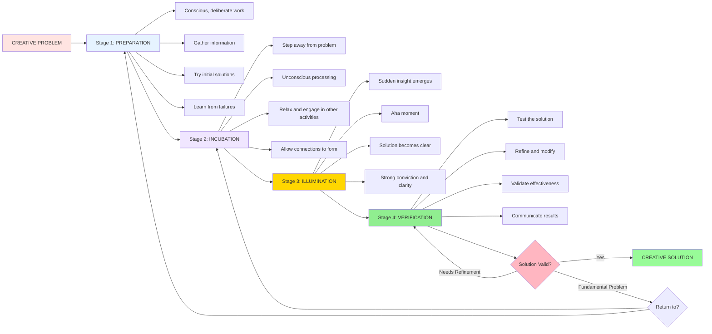

# Stages of Creativity: From Preparation to Verification

## Introduction

How do creative breakthroughs occur? Do novel ideas emerge fully formed, or do they develop through identifiable phases? **Graham Wallas (1926)** pioneered the systematic study of the creative process, proposing that creative thinking unfolds through four distinct stages. This framework has profoundly influenced both research on creativity and practical approaches to fostering innovation.

Understanding these stages helps demystify creativity—revealing it as a process that can be understood, facilitated, and enhanced rather than a mysterious gift available only to rare geniuses.

---

## Historical Context: Graham Wallas and the Birth of Process Models

### The Significance of Wallas's Contribution

Before Wallas, creativity was often viewed as:
- Mystical inspiration from external sources (muses, divine intervention)
- Inexplicable genius accessible only to exceptional individuals
- Random, unpredictable flashes of insight

**Wallas's Innovation**: Proposing that creativity follows predictable, identifiable stages that could be studied scientifically and facilitated systematically.

### The Four-Stage Model

Wallas identified four successive stages through which creative thinking typically progresses:

1. **Preparation**: Conscious problem analysis and information gathering
2. **Incubation**: Unconscious processing while attention shifts away
3. **Illumination**: Sudden emergence of insight or solution
4. **Verification**: Testing, refining, and validating the solution

---

## Stage 1: Preparation

### Definition and Purpose

**Preparation** involves conscious, deliberate work on understanding and defining the problem. This stage establishes the foundation for later creative breakthroughs.

### Core Activities

#### Information Gathering
- **Systematic research**: Reviewing existing knowledge and prior approaches
- **Observation**: Carefully examining the problem from multiple angles
- **Exploration**: Investigating seemingly tangential but potentially relevant information

**Example**: Edison's development of the electric light bulb began with exhaustive research into existing illumination methods, material properties, and failures of previous attempts.

#### Problem Definition
- **Clarifying objectives**: What exactly needs to be accomplished?
- **Identifying constraints**: What limitations must be respected?
- **Recognizing sub-problems**: Breaking complex challenges into components

**Example**: Architects preparing to design an innovative building spend weeks understanding site constraints, client needs, regulatory requirements, and user behaviors.

#### Initial Solution Attempts
- **Trial and error**: Testing obvious or conventional approaches
- **Learning from failures**: Understanding why standard methods don't work
- **Recognizing patterns**: Identifying what's been tried and what hasn't

### Characteristics of Preparation Stage

#### Conscious and Deliberate
Unlike later stages involving unconscious processing, preparation requires:
- Focused attention and concentrated effort
- Systematic, methodical approach
- Active engagement with problem elements

#### Potentially Frustrating
The preparation stage often involves:
- **Repeated failures**: Conventional approaches don't yield solutions
- **Growing complexity**: Understanding deepens but solutions remain elusive
- **Mounting frustration**: Conscious effort seems insufficient

**Critical Insight**: This frustration is productive—it signals that routine approaches are inadequate, preparing the mind to think differently.

### The Role of Domain Knowledge

**Essential Foundation**: Preparation establishes the knowledge base required for creative breakthroughs.

**Deep Immersion**: Genuine creative solutions require thorough understanding of:
- Current state of knowledge in the field
- Previous attempts and their limitations
- Fundamental principles and constraints
- Available resources and tools

**Example**: Marie Curie's discovery of radium followed years of preparation—mastering chemistry, physics, laboratory techniques, and understanding radioactivity's emerging science.

### Duration and Intensity

**Variable Length**: Preparation may last:
- Hours (for relatively simple creative challenges)
- Days or weeks (for moderate complexity problems)
- Months or years (for groundbreaking scientific or artistic work)

**Intensity Matters**: Quality of preparation affects later stages:
- Superficial preparation → Limited creative possibilities
- Deep, thorough preparation → Rich foundation for novel insights

### Advice for Maximizing Preparation

#### Learn Comprehensively
- Study the problem from all available angles
- Gather information even if relevance isn't immediately obvious
- Don't prematurely narrow focus

#### Embrace Productive Failure
- Systematically attempt obvious solutions to understand why they fail
- Document what doesn't work—this knowledge guides later creativity
- View failures as elimination of wrong paths rather than setbacks

#### Remain Open and Curious
- Avoid premature closure on problem definition
- Question assumptions about what the problem "really" is
- Explore connections to seemingly unrelated domains

---

## Stage 2: Incubation

### Definition and Purpose

**Incubation** involves stepping away from conscious problem-solving, allowing unconscious mental processes to work on the problem. The solution exists but remains unclear during this stage.

### The Paradox of Incubation

**Counterintuitive Principle**: Progress occurs by **not** working on the problem.

**Why This Works**:
1. **Unconscious processing**: Brain continues working on problem outside awareness
2. **Freed from mental set**: Stepping away breaks fixations on unsuccessful approaches
3. **Association formation**: Unconscious mind makes connections conscious mind missed
4. **Reduced pressure**: Removal of performance anxiety allows freer thinking

### Core Activities

#### Disengagement from Problem
- **Physical distancing**: Literally moving away from problem workspace
- **Mental shifting**: Directing attention to completely different activities
- **Relaxation**: Reducing cognitive load and stress

**What NOT to do**: Continue consciously working on the problem—this defeats incubation's purpose.

#### Engaging in Different Activities

**Optimal incubation activities**:
- **Low cognitive demand**: Walking, light exercise, routine tasks
- **Enjoyable and absorbing**: Activities that engage attention without strain
- **Different domain**: Completely unrelated to the problem

**Examples**:
- Taking a shower (famous "shower thoughts" phenomenon)
- Going for a walk in nature
- Listening to music
- Engaging in hobbies
- Sleeping (particularly powerful for incubation)

#### Reflection Without Forcing

**Gentle engagement**:
- **Allowing thoughts to drift** toward the problem naturally
- **Not forcing** solutions or focused analysis
- **Noticing** when problem-related ideas spontaneously emerge

**Example**: Archimedes reportedly discovered principles of displacement while bathing—his mind was relaxed, not strenuously focused on the problem.

### The Neuroscience of Incubation

#### Default Mode Network

Recent neuroscience research suggests incubation engages the **default mode network**—brain regions active during rest and mind-wandering:
- Makes unexpected associations
- Integrates information from disparate sources
- Simulates scenarios and possibilities

**Key Finding**: Some problem-solving benefits from default mode activation, not just focused executive function.

#### Sleep and Incubation

Research demonstrates that sleep particularly enhances incubation:
- **Memory consolidation**: Strengthens important information, weakens irrelevant
- **Pattern detection**: Unconscious identification of hidden patterns
- **Emotional regulation**: Reduces anxiety that blocks creative thinking

**Example**: Multiple scientists and artists report breakthroughs emerging from dreams—Kekulé's vision of the benzene ring structure, Mendeleyev's periodic table organization.

### Duration of Incubation

**Highly Variable**:
- Minutes to hours (brief breaks during problem-solving sessions)
- Days (sleeping on a problem)
- Weeks to months (setting aside major creative projects)

**Influencing Factors**:
- **Problem complexity**: More complex problems often require longer incubation
- **Preparation quality**: Thorough preparation enables more effective incubation
- **Individual differences**: Some people benefit from brief breaks, others from extended periods

### When Incubation Works Best

**Optimal conditions**:
1. **After thorough preparation**: Incubation ineffective without knowledge foundation
2. **When stuck or frustrated**: Signals that conscious effort has exhausted obvious paths
3. **With psychological safety**: Low anxiety allows freer unconscious processing
4. **For insight problems**: Especially effective for problems requiring novel perspectives

**Less effective for**:
- Problems requiring systematic computation
- Challenges with clearly defined algorithmic solutions
- Tasks benefiting from sustained focused attention

---

## Stage 3: Illumination (Insight)

### Definition and Purpose

**Illumination** is the sudden emergence of the solution or breakthrough insight. Often called the "Aha!" or "Eureka!" moment, this stage represents the conscious recognition of the solution developed unconsciously during incubation.

### Characteristics of Illumination

#### Suddenness
- **Appears abruptly**: Not gradual dawning but sudden realization
- **Unexpected timing**: Often occurs when not actively thinking about problem
- **Complete perception**: Solution appears whole, not piece-by-piece

**Example**: Newton's insight about gravity reportedly occurred when observing a falling apple—sudden connection between everyday observation and cosmic forces.

#### Conviction and Clarity
- **Certainty**: Strong feeling that this is the right solution
- **Coherence**: Previously confusing elements suddenly make sense
- **Simplicity**: Complex problem resolves into elegant solution

**Example**: Einstein described illumination of relativity theory as suddenly seeing that time itself could be relative—once recognized, it seemed obvious and inevitable.

#### Emotional Component
- **Excitement**: Often accompanied by joy, relief, or exhilaration
- **Energy surge**: Renewed motivation and enthusiasm
- **Desire to act**: Immediate urge to test and implement the insight

### The Phenomenology of "Aha!" Moments

#### Common Reports

Creative individuals across domains describe remarkably similar experiences:

**Poincaré** (mathematician): Insight occurred while stepping onto a bus—sudden recognition of mathematical relationship

**Coleridge** (poet): "Kubla Khan" reportedly came fully formed during an opium-induced dream state

**Kary Mullis** (biochemist): PCR technique insight while driving—sudden vision of solution to DNA amplification challenge (later won Nobel Prize)

#### Neural Correlates

Modern brain imaging reveals illumination involves:
- **Sudden increase** in gamma-band neural oscillations
- **Right hemisphere activation** (pattern recognition, holistic processing)
- **Anterior cingulate activation** (switching between cognitive strategies)

### What Happens During Illumination

#### Unconscious to Conscious Transition

The solution existed unconsciously during incubation but becomes accessible to conscious awareness during illumination.

**Process**:
1. Unconscious processing reaches viable solution
2. Neural threshold crossed—solution strong enough to enter consciousness
3. Conscious attention suddenly captures the solution
4. Cognitive resources reorganize around new understanding

#### Reformulation and Reorganization

Illumination often involves:
- **Reframing the problem**: Seeing it from entirely new perspective
- **Pattern recognition**: Detecting relationships previously invisible
- **Conceptual restructuring**: Mental model shifts to accommodate new understanding

**Example**: Kekulé's benzene ring insight involved recognizing that carbon chain could close into a ring—fundamentally different structural conception.

### Conditions Facilitating Illumination

#### Relaxed but Alert State
- Not strenuously focused on problem
- Not deeply engaged in demanding task
- Attention available but not forced

**Optimal mental states**:
- Transitional moments (waking, falling asleep)
- Enjoyable, absorbing activities
- Meditative or reflective states

#### Rich Preparation Foundation
- Illumination builds on thorough preparation
- Requires activated knowledge network
- Benefits from diverse information gathering

#### Appropriate Incubation Period
- Sufficient time for unconscious processing
- Not so long that problem representation decays
- Variable optimal duration by problem type

### Managing the Illumination Stage

#### Creating Receptive Conditions

**Strategies**:
- Schedule breaks and transitions during problem-solving
- Engage in activities known to facilitate insight (walks, showers)
- Maintain notebook for capturing fleeting insights
- Cultivate openness to unexpected moments

#### Capturing Insights

**Critical importance**: Illuminations can be fleeting—must be captured immediately.

**Best practices**:
- Keep recording tools always available (phone, notebook)
- Immediately write or sketch the insight
- Record while memory is fresh—details fade rapidly
- Note context and emotional state

**Example**: Many inventors and artists keep bedside notebooks to capture insights emerging during sleep or upon waking.

---

## Stage 4: Verification

### Definition and Purpose

**Verification** involves testing, refining, and validating the solution that emerged during illumination. This stage translates insight into practical, implementable solutions.

### Core Activities

#### Testing the Solution
- **Empirical validation**: Does the solution actually work?
- **Logical consistency**: Is the reasoning sound?
- **Comparative assessment**: How does it compare to existing approaches?

**Example**: After Mendeleev's illumination of the periodic table structure, years of verification involved testing predictions about undiscovered elements.

#### Refinement and Modification

Initial insights often require substantial development:
- **Identifying limitations**: Where does the solution break down?
- **Adjusting parameters**: Fine-tuning to handle edge cases
- **Expanding scope**: Extending solution to related problems

**Reality check**: Initial illumination may be:
- Partially correct but incomplete
- Correct in principle but impractical
- Valid for some cases but not all

#### Communicating Results

**External validation requires**:
- **Clear articulation**: Explaining insight to others
- **Evidence provision**: Demonstrating solution effectiveness
- **Responding to criticism**: Addressing objections and concerns

### Characteristics of Verification

#### Conscious and Active
Unlike incubation, verification demands:
- Sustained focused attention
- Systematic, methodical work
- Rigorous analytical thinking

#### Potentially Demanding
Verification often proves more labor-intensive than illumination:
- **Edison's famous quote**: "Genius is 1% inspiration, 99% perspiration"
- Initial insight may require months or years of development
- Multiple rounds of testing and refinement

### The Iterative Nature of Verification

#### Recursive Process

Verification often reveals the need to return to earlier stages:

**Discovery of flaws** → Return to **Preparation** (gather more information)
**Persistent problems** → Enter **Incubation** (allow new insights)
**New illuminations** → Multiple **Illumination** moments as problems are solved

**Example**: Scientific research involves countless cycles—initial hypothesis (illumination), testing (verification), problems discovered (preparation), new insights (illumination), refined experiments (verification).

### Duration and Effort

**Highly Variable**:
- Simple problems: Minutes to hours of verification
- Moderate complexity: Days to weeks
- Major innovations: Months to years (sometimes decades)

**Factors affecting duration**:
- **Solution complexity**: More intricate solutions require more testing
- **Stakes and consequences**: High-stakes applications demand thorough verification
- **Available resources**: Access to tools, collaborators, funding

### Verification Strategies

#### Systematic Testing
- Design experiments or trials
- Compare predictions to outcomes
- Document results methodically

#### Peer Review
- Share with knowledgeable others
- Invite critical evaluation
- Incorporate feedback

#### Iteration
- Expect multiple refinement cycles
- View criticism as improvement opportunity
- Maintain flexibility to modify solutions

### When Verification Reveals Fundamental Problems

**Possible outcomes**:
1. **Minor modifications** suffice to address issues
2. **Significant revision** needed but core insight remains valid
3. **Return to incubation** for substantially new insights
4. **Abandon solution** and recognize illumination was incorrect

**Example**: Many patent applications reflect years of verification—testing, refining, documenting, and proving that initial insights actually work reliably.

---

## The Non-Linear Reality of Creative Stages

### Flexibility in Stage Sequence

While Wallas proposed stages as successive, creative thinking often involves:

#### Stage Skipping
- **Bypassing preparation**: When deep prior knowledge exists, may move directly to incubation
- **Immediate insight**: Rare cases where illumination occurs without apparent incubation
- **Direct verification**: Simple insights may not require extended testing

#### Stage Reordering
- **Verification before illumination**: Sometimes testing eliminates wrong paths, leading to better insights
- **Incubation during verification**: May need to step away from verification challenges
- **Multiple illuminations**: Successive breakthroughs as problem is refined

#### Simultaneous Stages
- **Preparation + Verification**: Gathering information while testing
- **Incubation + Illumination**: Multiple insights emerging over time

### Individual Differences

**Variable stage experiences**:
- Some individuals require extensive preparation; others thrive on minimal groundwork
- Incubation periods vary dramatically (minutes vs. months)
- Illumination intensity differs—some report dramatic "Aha!" moments, others gradual dawning
- Verification approaches range from quick confirmation to exhaustive testing

**Example**: Mozart reportedly experienced illumination as complete compositions appearing whole, requiring minimal verification. Beethoven engaged in extensive preparation and iterative revision, with illumination emerging gradually.

---

## Practical Applications

### For Individual Creative Work

#### Optimize Each Stage

**Preparation**:
- Allocate sufficient time for thorough groundwork
- Gather diverse information, not just obvious sources
- Document what doesn't work—this guides later thinking

**Incubation**:
- Deliberately schedule breaks when stuck
- Engage in activities known to facilitate insight
- Sleep on difficult problems

**Illumination**:
- Maintain readiness to capture insights
- Create conditions conducive to breakthrough moments
- Trust the process—insights emerge when ready

**Verification**:
- Test rigorously but not prematurely
- Seek feedback from knowledgeable others
- Be prepared for iterative refinement

### For Teams and Organizations

#### Respect the Creative Cycle

**Organizational practices**:
- **Allow preparation time**: Don't demand immediate solutions to complex problems
- **Enable incubation**: Build breaks and reflection time into schedules
- **Capture illuminations**: Create systems for recording and sharing insights
- **Support verification**: Provide resources for thorough testing and refinement

#### Recognize Individual Variation

- Different team members may be in different stages
- Some individuals benefit from extended incubation, others from sustained effort
- Create flexibility for diverse creative processes

---

## Memory Aid: FOUR STAGES (WALLAS)

**F**ully prepare (gather information, try solutions) 
**O**ff the problem (incubate, let unconscious work) 
**U**nexpected insight (illumination, "Aha!" moment) 
**R**igorously verify (test, refine, validate)

**S**tages may overlap or recur 
**T**ime varies by problem complexity 
**A**lways start with thorough preparation 
**G**radual or sudden insights both valid 
**E**ach stage essential—can't skip preparation or verification 
**S**olution emerges through process, not magic

---

## Self-Assessment Questions

### Conceptual Understanding

1. **Describe each of Wallas's four stages of creativity. Why is each stage necessary? What would happen if you skipped preparation or verification?**

2. **Explain the apparent paradox of incubation—how does stepping away from a problem help solve it? What cognitive processes occur during incubation?**

3. **What distinguishes illumination from gradual problem-solving? Describe the phenomenology of "Aha!" moments based on historical examples.**

### Application and Analysis

4. **Reflect on a personal creative experience where you solved a challenging problem. Can you identify the four stages in your process? Were they sequential or did they overlap?**

5. **Consider a major scientific or artistic breakthrough (e.g., Einstein's relativity, Picasso's cubism). Research the creator's process and identify how the four stages manifested in that achievement.**

### Critical Thinking

6. **Wallas proposed that creative stages occur successively. Based on the discussion of non-linear reality, critique this linear model. When might stages overlap, repeat, or occur out of order?**

7. **Some creativity training programs focus primarily on ideation (illumination). Based on Wallas's model, why might this be insufficient? What stages do such programs potentially neglect?**

8. **Compare Wallas's stage model with modern neuroscience findings about default mode networks and sleep-based consolidation. How does contemporary research support or challenge Wallas's century-old model?**

---

## Mermaid Diagram: Stages of Creativity

---

## External Resources

### Academic Sources

- 📄 [Wikipedia: Wallas's Four Stages of Creativity](https://en.wikipedia.org/wiki/Creativity#Wallas'_model) - Overview of the classical model
- 📄 [Wikipedia: Incubation (psychology)](https://en.wikipedia.org/wiki/Incubation_(psychology)) - Detailed discussion of incubation effects
- 📄 [Wikipedia: Eureka effect](https://en.wikipedia.org/wiki/Eureka_effect) - The illumination phenomenon

### Educational Videos

- 🎥 [The Creative Process - MIT OpenCourseWare](https://www.youtube.com/results?search_query=MIT+creative+process+stages) - Academic perspective on creativity stages
- 🎥 [How to Have More Eureka Moments - Scientific American](https://www.youtube.com/results?search_query=scientific+american+eureka+moments+insight) - Neuroscience of insight

### Research Papers

- 📚 Wallas, G. (1926). *The Art of Thought*. New York: Harcourt, Brace.
- 📚 Sio, U. N., & Ormerod, T. C. (2009). Does incubation enhance problem solving? A meta-analytic review. *Psychological Bulletin, 135*(1), 94-120.
- 📚 Kounios, J., & Beeman, M. (2014). The cognitive neuroscience of insight. *Annual Review of Psychology, 65*, 71-93.

### Practical Applications

- 🔗 [The Science of Aha! Moments - Psychology Today](https://www.psychologytoday.com/us/basics/creativity) - Practical insights on creative breakthroughs
- 🔗 [Incubation and Creativity - Greater Good Science Center](https://greatergood.berkeley.edu/) - Evidence-based practices for enhancing creativity

---

## Source PDFs

📄 **[Block-2/Unit-4.pdf - Pages 64-65](/pdfs/MPC-001%20Cognitive%20Psychology,%20Learning%20and%20Memory/Block-2/Unit-4.pdf)** 
📚 **MPC-001 Cognitive Psychology, Learning and Memory**

---

**Previous**: [← Investment Theory](/mpc-001/block-2/investment-confluence-theory-creativity) 
**Next**: [Creativity and Intelligence →](/mpc-001/block-2/creativity-intelligence-relationship)
