# Creativity and Intelligence: The Complex Relationship

## Introduction

Are creative geniuses intellectually brilliant? Must someone be highly intelligent to make creative contributions? Does high IQ guarantee creative achievement? These questions have fascinated researchers for decades, yielding surprisingly complex and sometimes contradictory findings.

The relationship between creativity and intelligence represents one of psychology's most debated topics. While intuition suggests they should be strongly related—both involve sophisticated mental processes—empirical evidence presents a more nuanced picture. Understanding this relationship has profound implications for education, talent identification, and our conception of human potential.

---

## Historical Context: Early Assumptions

### Traditional View: Intelligence as Foundation

Early 20th-century psychology generally assumed:
- Intelligence encompasses all higher cognitive abilities
- Creative thinking represents a subset of intelligent thinking
- High IQ should predict creative achievement

**Rationale**: Both creativity and intelligence involve:
- Complex problem-solving
- Abstract reasoning
- Novel connection-making
- Mental flexibility

**Expectation**: Strong positive correlation between IQ scores and creative achievement.

---

## Terman's Groundbreaking Longitudinal Study

### The Genetic Studies of Genius

**Lewis Terman (1925)** launched one of psychology's most famous longitudinal studies to investigate the life outcomes of intellectually gifted individuals.

#### Study Design

**Participants**: 1,528 children with **mean IQ of 151**
- Selected from California schools (1920s)
- Represents top 1% of intellectual ability
- Followed throughout their lifespans (decades of data)

**Hypothesis**: These intellectually gifted children should become the creative leaders of their generation—scientists, artists, inventors, writers who transform their fields.

### Surprising Findings

#### Occupational Success
The "Termites" (as participants were called) generally achieved:
- **High occupational status**: Doctors, lawyers, professors, business executives
- **Financial success**: Above-average incomes
- **Educational achievement**: Most completed advanced degrees
- **Social adjustment**: Generally well-adjusted, happy lives

**Conclusion**: High IQ strongly predicts conventional success and achievement.

#### Creative Achievement
Despite high intelligence, the study revealed:
- **No individuals showed noteworthy creative achievement**
- **No major scientific discoveries** by any participant
- **No groundbreaking artistic works** produced
- **No revolutionary inventions** created

**Striking Contrast**: Contemporary individuals with **lower IQs** made historic creative contributions:
- **Physicists** (Einstein, Fermi) - Revolutionary theories
- **Artists** (Picasso, Dalí) - Transformed artistic paradigms
- **Inventors** (Wright Brothers) - Pioneering technologies

#### The Fundamental Insight

**Terman's study demonstrated**: High IQ is **insufficient** for creative achievement.

Intelligence may be necessary for **success within established systems**, but creativity requires additional qualities intelligence tests don't measure.

---

## Empirical Findings: Weak Correlation

### Meta-Analytic Evidence

**Torrance (1977)** analyzed **178 correlation coefficients** between IQ tests and the Torrance Tests of Creative Thinking (TTCT).

#### Results
**Median correlation: r = .20**

**Interpretation**:
- Only **4% of variance** in creativity explained by IQ (r² = .04)
- 96% of creativity variance **independent** of measured intelligence
- Relationship exists but is **weak and inconsistent**

### Factor Analytic Studies

**Research approach**: Administer both IQ tests and creativity tests to large samples, then use factor analysis to identify underlying dimensions.

#### Consistent Finding
Intelligence and creativity load on **separate factors**:

**Factor 1: Intelligence**
- Convergent thinking tasks
- Problem-solving accuracy
- Logical reasoning
- Verbal and mathematical abilities

**Factor 2: Creativity**
- Divergent thinking tasks
- Ideational fluency
- Originality
- Flexibility

**Implication**: Creativity and intelligence represent **distinct psychological constructs**, not merely different measurements of the same underlying ability.

---

## The Threshold Hypothesis

### Guilford's Influential Proposal

**J.P. Guilford (1967)** proposed the **threshold hypothesis** to reconcile conflicting findings about the creativity-intelligence relationship.

### Core Claims

#### 1. Minimum IQ Requirement

**Proposition**: Creativity requires a **minimum level of intelligence**, often arbitrary set at **IQ = 120**.

**Rationale**:
- Below threshold: Insufficient cognitive capacity for creative work
- Creative thinking demands certain intellectual capabilities
- Abstract reasoning, pattern recognition, memory capacity all necessary

**IQ 120 Significance**:
- Represents approximately **90th percentile** (top 10% of population)
- "Bright normal" or "superior" intelligence
- Above average but not genius level

#### 2. Necessity But Not Sufficiency

**Below threshold** (IQ < 120):
- Creative achievement essentially **impossible**
- Cognitive limitations prevent generating, evaluating, and implementing novel ideas
- Lack of intellectual capacity constrains creative possibilities

**Above threshold** (IQ ≥ 120):
- Intelligence **no longer predicts** creativity
- Other factors become determining influences
- Additional IQ points don't enhance creative potential

**Analogy**: Intelligence like height in basketball—you need minimum height to compete, but beyond that, skill, motivation, and other factors matter more.

### The Triangularity Prediction

**Visual representation**: Plotting IQ vs. creativity should produce **triangular scatter plot**:

```
Creativity
    ^
    |     * * *
    |   *   * * *
    | *   *   * * *
    | *   *   * * * *
    |   *   *   * * *
    |     *   *   * *
    |--------*------*---> IQ
   Low           120    High
```

**Key Features**:
- **No data points** in low IQ/high creativity quadrant (lower left)
- **Full range** of creativity at high IQ levels
- **Increasing variability** in creativity as IQ rises above threshold

**Alternative name**: "Triangularity hypothesis" due to predicted scatter plot shape.

### Empirical Support

#### Mixed Evidence

**Supporting findings**:
- Many studies show **weak or no correlation** between IQ and creativity above certain thresholds
- Creative achievers typically have **above-average** (but not necessarily exceptional) intelligence
- Gifted programs selecting purely on IQ don't necessarily identify creative individuals

**Disconfirming tendencies**:
- Some studies find **continued positive relationship** even at high IQ levels
- **No clear threshold** emerges consistently across studies
- Predicted triangular pattern **rarely observed** cleanly

**Research conclusion**: While plausible and intuitive, the threshold hypothesis lacks **strong empirical support**.

---

## Alternative Explanations

### Hayes's Certification Hypothesis

**John Hayes (1989)** proposed a sociological alternative to intrinsic psychological relationships.

#### Core Argument

**Claim**: The creativity-intelligence relationship is **artifactual**, created by social structures rather than cognitive necessity.

#### The Certification Process

**Observation**: Most opportunities to display recognized creativity require:
- **Formal education**: Advanced degrees (master's, PhD)
- **Professional credentials**: Licenses, certifications, memberships
- **Institutional access**: Universities, research labs, art schools, companies

**Mechanism**:
1. **Academic performance** correlates with IQ
2. **Educational attainment** gates access to creative opportunities
3. **Apparent IQ-creativity link** merely reflects educational/credentialing requirements

**Example**: Scientific creativity requires:
- PhD programs (select for high IQ)
- Research positions (require PhD)
- Therefore, scientists have high IQ not because creativity demands it, but because **access gates** do

#### Implications

**Denies intrinsic link**: Low-IQ individuals might be equally creative, but society **denies them opportunities** to demonstrate creativity in recognized forms.

**Testable prediction**: In domains **without formal education requirements** (folk arts, entrepreneurship, community innovation), IQ-creativity relationship should disappear.

**Policy implications**: Current selection systems may **waste creative potential** by filtering solely on intelligence.

---

## Contemporary Perspectives

### Domain-Specific vs. Domain-General Intelligence

Modern research recognizes creativity and intelligence each have:

**Domain-general components**:
- **Intelligence**: Working memory, processing speed, abstract reasoning (apply across contexts)
- **Creativity**: Openness, persistence, divergent thinking (relevant in many fields)

**Domain-specific components**:
- **Intelligence**: Math ability, verbal ability, spatial reasoning (vary independently)
- **Creativity**: Musical, artistic, scientific creativity (relatively independent)

**Implication**: The IQ-creativity relationship may **vary by creative domain**:
- **Scientific creativity**: May require higher intelligence (complex abstractions)
- **Artistic creativity**: May depend less on IQ (emotional expression, aesthetics)
- **Social creativity**: May require different cognitive profiles (empathy, cultural sensitivity)

### Dynamic vs. Static Relationships

**Traditional approach**: Treat intelligence and creativity as **stable traits** measured once.

**Contemporary view**: Both develop over time and interact dynamically:
- **Early development**: Intelligence may facilitate acquiring knowledge that later supports creativity
- **Expertise building**: Creative achievement requires domain mastery (involves intelligence)
- **Peak performance**: At high expertise levels, creativity becomes increasingly independent of IQ

**Example**: Child prodigies (high IQ) rapidly acquire skills but may or may not develop mature creative contributions. Conversely, some creators show gradual skill building followed by later creative flowering.

---

## Explaining the Weak Relationship

### Why Don't High IQ and High Creativity Strongly Correlate?

#### Different Cognitive Styles

**Convergent vs. Divergent Thinking**:

| Intelligence (Convergent) | Creativity (Divergent) |
|---------------------------|------------------------|
| Single correct answer | Multiple possible solutions |
| Evaluative, critical | Generative, exploratory |
| Follows logic and rules | Challenges assumptions |
| Efficiency valued | Novelty valued |
| Closed problems | Open-ended problems |

**Possibility**: Some high-IQ individuals develop **convergent thinking preferences** that actually **inhibit** divergent creative thinking.

#### Personality and Motivational Factors

**Creativity requires** (beyond cognitive ability):
- **Risk-taking**: Willingness to pursue unconventional ideas
- **Tolerance for ambiguity**: Comfort with uncertainty
- **Persistence**: Sustained effort despite setbacks
- **Intrinsic motivation**: Love of the work itself
- **Nonconformity**: Independence from social pressure

**High IQ alone** doesn't predict these personality characteristics. Indeed, some research suggests:
- **Highly intelligent individuals** may prioritize **conventional success** (using intelligence for academic/career advancement)
- **Creative achievers** often report **rebellious or unconventional** personalities

**Example**: Many highly intelligent people become successful physicians, lawyers, or executives—roles valuing convergent thinking and conventional success—rather than pursuing risky creative endeavors.

#### Environmental and Opportunity Factors

Creative achievement requires:
- **Access to resources**: Materials, technology, funding
- **Supportive environments**: Encouragement, tolerance for experimentation
- **Opportunity to develop**: Time, mentorship, community
- **Platform for recognition**: Venues to display work, audiences to appreciate it

**Intelligence doesn't guarantee these conditions**. Conversely, some individuals with moderate intelligence but **optimal environmental support** achieve creative breakthroughs.

#### Measurement Limitations

**IQ tests primarily measure**:
- Logical-mathematical reasoning
- Verbal comprehension
- Processing speed
- Working memory

**Don't measure well**:
- Imagination
- Aesthetic sensitivity
- Intuition
- Emotional intelligence
- Practical intelligence (Sternberg's "street smarts")

**Creativity tests also limited**:
- Brief, artificial tasks (vs. sustained creative work)
- Scoring challenges (originality subjective)
- May not predict real-world creative achievement

**Possibility**: Both measures **incompletely capture** the constructs they claim to assess, artificially weakening observed relationships.

---

## Integrated Perspective: When Intelligence Matters for Creativity

### Intelligence as Facilitating Rather Than Determining

**Most plausible conclusion**: Intelligence **facilitates but doesn't determine** creativity.

#### Intelligence Helps By:

1. **Rapid learning**: Quickly acquiring domain knowledge
2. **Pattern recognition**: Identifying connections and relationships
3. **Abstract reasoning**: Working with complex, theoretical concepts
4. **Evaluation**: Critically assessing which ideas merit pursuit
5. **Communication**: Effectively articulating and defending novel ideas

#### Creativity Requires Beyond Intelligence:

1. **Divergent thinking**: Generating multiple possibilities
2. **Openness to experience**: Willingness to consider unconventional ideas
3. **Aesthetic sensitivity**: Recognizing beauty, elegance, appropriateness
4. **Intrinsic motivation**: Sustained engagement for its own sake
5. **Courage**: Willingness to challenge conventions and risk failure
6. **Domain passion**: Deep love for the field itself

### The "Necessary But Not Sufficient" Model

**Refined understanding**:

**Very Low Intelligence** (IQ < 85):
- Creative achievement in most domains genuinely difficult
- Cognitive limitations constrain complexity of possible contributions

**Below Average to Average** (IQ 85-115):
- Creative achievement **possible** but may be limited to specific domains
- May require **exceptional** motivation and opportunity

**Above Average** (IQ 115-130):
- Creative achievement across domains becomes **accessible**
- Intelligence no longer primary limiting factor

**Superior and Above** (IQ > 130):
- Additional IQ points provide **minimal additional creative advantage**
- Other factors become determining

**Analogy**: Intelligence like fuel capacity in cars—need minimum to go anywhere, but beyond that, driver skill, road conditions, and destination choice matter more than extra tank size.

---

## Practical Implications

### For Education

#### Don't Equate Giftedness with Creativity

**Current practice**: Many gifted programs select primarily on IQ.

**Problem**: May identify intellectually advanced but **conventionally-minded** students while missing creative but **moderately intelligent** students.

**Better approach**:
- **Multiple criteria**: Include creativity assessments, portfolio reviews, teacher nominations
- **Different tracks**: Separate programs for intellectual advancement vs. creative development
- **Flexible selection**: Recognize different profiles of exceptionality

#### Nurture Creativity Independently

**Recommendation**: Explicitly teach and reward creative thinking at all ability levels.

**Strategies**:
- Open-ended problems and projects
- Encourage questioning and experimentation
- Value original thinking, not just correct answers
- Create psychologically safe environments for risk-taking

### For Talent Identification

#### Recognize Different Types of Exceptional Ability

**Intelligence**: Rapid learning, abstract reasoning, complex problem-solving
**Creativity**: Novel ideation, original contributions, paradigm-challenging work

**Both valuable** but represent **different contributions** to society.

#### Look Beyond Test Scores

**For identifying creative potential**, consider:
- **Portfolio review**: Actual creative products
- **Divergent thinking assessments**: Fluency, flexibility, originality
- **Personality measures**: Openness, risk-taking, persistence
- **Domain passion**: Intrinsic interest and motivation
- **Biographical indicators**: History of creative pursuits

### For Organizations

#### Diverse Hiring and Team Composition

**Innovation requires**:
- **High-IQ analysts**: Critically evaluate ideas, identify flaws, ensure rigor
- **Highly creative thinkers**: Generate novel possibilities, challenge assumptions
- **Diverse perspectives**: Different cognitive profiles complement each other

**Avoid**: Selecting solely for intelligence may create analytically strong but creatively limited teams.

---

## Memory Aid: IQ-CREATIVITY GAP

**I**ntelligence measured narrowly (logic, memory)<br/>
**Q**uestioning not rewarded in IQ tests

**C**onvergent vs. divergent thinking styles<br/>
**R**isk-taking personality matters<br/>
**E**nvironment provides opportunity<br/>
**A**chievement requires more than ability<br/>
**T**erman's termites succeeded but didn't create<br/>
**I**ntrinsic motivation essential<br/>
**V**ery weak correlation (.20 median)<br/>
**I**ndependent factors in factor analysis<br/>
**T**hreshold hypothesis (IQ 120) lacks strong support<br/>
**Y**ielding vs. crystallized perspectives

**G**uilford proposed minimum (not proven)<br/>
**A**bove threshold, IQ doesn't predict creativity<br/>
**P**ersonality, motivation, environment determine creative achievement

---

## Self-Assessment Questions

### Conceptual Understanding

1. **Describe Terman's longitudinal study and its surprising findings regarding intelligence and creativity. What did this study reveal about the sufficiency of high IQ for creative achievement?**

2. **Explain the threshold hypothesis in detail. What does it predict about the relationship between IQ and creativity? Why is it sometimes called the "triangularity hypothesis"?**

3. **Compare and contrast the threshold hypothesis with Hayes's certification hypothesis. Which provides a more compelling explanation for the observed weak relationship between IQ and creativity?**

### Application and Analysis

4. **Consider historical creative geniuses (Einstein, Picasso, Virginia Woolf, Marie Curie). Based on biographical information, how would you characterize their intelligence levels? Did they succeed primarily due to high IQ or other factors?**

5. **Examine a gifted education program in your area (or research one online). How does it select students? Based on the research discussed, what are the strengths and limitations of its selection criteria?**

### Critical Thinking

6. **Construct an argument for why intelligence and creativity show such a weak correlation despite both involving sophisticated cognitive processes. Which explanation do you find most persuasive?**

7. **Design a study to test the threshold hypothesis. What measures would you use? What pattern of results would support vs. falsify the hypothesis? What confounding variables would you need to control?**

8. **Debate the following proposition: "Gifted programs should select students based on creativity rather than (or in addition to) IQ." What are the arguments for and against this approach? What practical challenges would it present?**

9. **If you were advising parents of a highly intelligent child (IQ 145) who shows little creative thinking, what would you recommend to foster creativity? Conversely, how might you support a moderately intelligent child (IQ 110) who displays exceptional creativity?**

---

## Mermaid Diagram: Theories of IQ-Creativity Relationship

```mermaid
graph TB
    A[IQ-CREATIVITY RELATIONSHIP] --> B[Extreme Position 1: Totally Independent]
    A --> C[Threshold Hypothesis]
    A --> D[Certification Hypothesis]
    A --> E[Integrated View]
    
    B --> B1[Intelligence doesn't influence creativity]
    B --> B2[Creativity accessible to everyone]
    B --> B3[Only domain knowledge matters]
    B --> B4[Empirical problem: Weak but non-zero correlation]
    
    C --> C1[Minimum IQ required IQ≥120]
    C --> C2[Below threshold: creativity impossible]
    C --> C3[Above threshold: IQ doesn't predict creativity]
    C --> C4[Predicts triangular scatter plot]
    C --> C5[Evidence: Mixed support]
    
    D --> D1[No intrinsic link between IQ and creativity]
    D --> D2[Apparent link due to credentialing]
    D --> D3[Educational requirements gate access]
    D --> D4[Society denies low-IQ individuals opportunity]
    D --> D5[Testable: Check domains without credentials]
    
    E --> E1[Intelligence facilitates but doesn't determine]
    E --> E2[Necessary but not sufficient]
    E --> E3[Multiple factors interact]
    E --> E4[Intelligence + Personality + Motivation + Environment]
    
    F[Key Evidence]
    F --> F1[Terman Study: High IQ ≠ Creative achievement]
    F --> F2[Torrance: Median r = .20]
    F --> F3[Factor analysis: Separate factors]
    F --> F4[Creative achievers: Above average but not genius IQ]
    
    style A fill:#FFD700
    style C fill:#87CEEB
    style D fill:#DDA0DD
    style E fill:#98FB98
    style F fill:#FFB6C1
```



---

## External Resources

### Academic Sources

- 📄 [Wikipedia: Creativity and Intelligence](https://en.wikipedia.org/wiki/Creativity#Creativity_and_intelligence) - Overview of relationship theories
- 📄 [Wikipedia: Threshold Theory](https://en.wikipedia.org/wiki/Threshold_theory_(creativity)) - Detailed explanation of Guilford's hypothesis
- 📄 [Wikipedia: Genetic Studies of Genius](https://en.wikipedia.org/wiki/Genetic_Studies_of_Genius) - Terman's landmark longitudinal study

### Educational Videos

- 🎥 [Intelligence vs. Creativity - Yale Courses](https://www.youtube.com/results?search_query=yale+intelligence+creativity+relationship) - Academic lectures on the distinction
- 🎥 [Why Smart People Aren't Always Creative - Big Think](https://www.youtube.com/results?search_query=big+think+intelligence+creativity) - Accessible explanations

### Research Papers

- 📚 Terman, L. M. (1925). *Genetic Studies of Genius (Vol. I): Mental and Physical Traits of a Thousand Gifted Children*. Stanford University Press.
- 📚 Guilford, J. P. (1967). *The Nature of Human Intelligence*. New York: McGraw-Hill.
- 📚 Kim, K. H. (2005). Can only intelligent people be creative? A meta-analysis. *Journal of Secondary Gifted Education, 16*(2-3), 57-66.
- 📚 Jauk, E., et al. (2013). The relationship between intelligence and creativity: New support for the threshold hypothesis. *Intelligence, 41*(4), 212-221.

### Historical Context

- 🔗 [Lewis Terman Biography - Stanford](https://psychology.stanford.edu/) - Background on pioneering researcher
- 🔗 [The Termites Study - Longitudinal Research](https://www.psychologytoday.com/us/basics/intelligence) - Follow-up on study participants

---

## Source PDFs

📄 **[Block-2/Unit-4.pdf - Pages 65-66](/pdfs/MPC-001%20Cognitive%20Psychology,%20Learning%20and%20Memory/Block-2/Unit-4.pdf)**<br/>
📚 **MPC-001 Cognitive Psychology, Learning and Memory**

---

**Previous**: [← Stages of Creativity](/mpc-001/block-2/stages-of-creativity)<br/>
**Next**: [Measurement of Creativity →](/mpc-001/block-2/measurement-creativity-ttct)
