# Measurement of Creativity: Tests and Assessments

## Introduction

Can creativity be measured? If so, how do we assess something as complex and multifaceted as creative potential? While intelligence testing has a century-long history with well-established instruments (Stanford-Binet, Wechsler scales), creativity assessment presents unique challenges.

Unlike intelligence, where "correct answers" exist, creativity values originality, novelty, and divergent thinking—qualities that resist simple quantification. Despite these challenges, psychologists have developed systematic approaches to assess creative potential, with the **Torrance Tests of Creative Thinking (TTCT)** emerging as the field's gold standard.

---

## The Challenge of Measuring Creativity

### Why Creativity Assessment Is Difficult

#### Subjectivity of Originality
- **What counts as original?** Depends on cultural context, historical moment, comparison group
- **Scorer interpretation**: Different raters may judge novelty differently
- **Developmental considerations**: What's creative for a child may be common for adults

#### Divergent vs. Convergent Nature
- **Traditional tests** assume single correct answers (convergent thinking)
- **Creativity** involves multiple possible solutions (divergent thinking)
- **Scoring challenge**: How to evaluate multiple valid responses?

#### Product vs. Process vs. Potential
- **Creative products**: Actual innovations, artworks (observable but may not reflect potential)
- **Creative processes**: Thinking strategies (difficult to observe directly)
- **Creative potential**: Latent capacity (what assessment aims to capture)

#### Domain Specificity
- Creativity may manifest differently across domains (artistic, scientific, social)
- **General creativity** tests may miss domain-specific talents
- **Trade-off**: Broad assessment vs. domain depth

---

## The Torrance Tests of Creative Thinking (TTCT)

### Historical Development

**E. Paul Torrance (1966)** developed the TTCT building on **Guilford's Structure of the Intellect (SOI)** battery, which included measures of divergent thinking.

#### Evolution of the Test

**1966**: Original TTCT developed
**1974**: First revision and re-norming
**1984**: Second revision
**1990**: Third revision with significant changes to scoring
**1998**: Fourth revision with updated norms

**Geographic spread**: Translated into 30+ languages, used internationally

---

### Test Structure

The TTCT consists of two parallel forms with different content:

#### TTCT-Verbal (Language-Based)

**Format**: Written responses to verbal prompts

**Example tasks**:
- **Ask Questions**: Generate questions about a picture
- **Improve a Product**: Suggest improvements to a toy
- **Unusual Uses**: List creative uses for common objects
- **Just Suppose**: Imagine consequences of improbable scenarios
- **Product Improvement**: Enhance existing products

#### TTCT-Figural (Visual-Based)

**Format**: Drawing-based responses

**Example tasks**:
- **Picture Construction**: Build a picture from a curved shape
- **Picture Completion**: Complete incomplete figures
- **Lines/Circles**: Create drawings from repeated lines or circles

**Administration**: Approximately 30-45 minutes per form

---

### Scoring Dimensions

The TTCT originally measured four dimensions based on Guilford's divergent thinking framework. The 1990 revision modified this to five dimensions:

#### 1. Fluency

**Definition**: The total number of relevant ideas, responses, or figural images produced.

**What it measures**: Generative capacity—ability to produce many responses

**Scoring**: Count all relevant responses (irrelevant responses excluded)

**Example (Unusual Uses for a Brick)**:
- Building material
- Paperweight
- Doorstop
- Weapon for self-defense
- Heat-retaining object for warming
- Art canvas
- Exercise weight

**Score**: 7 responses = Fluency score of 7

**Interpretation**:
- **High fluency**: Productive, generates many ideas rapidly
- **Low fluency**: May be perfectionistic, self-censoring, or have retrieval difficulties

---

#### 2. Flexibility

**Definition**: Number of different categories or perspectives represented in responses.

**What it measures**: Cognitive adaptability—ability to shift between different approaches

**Scoring**: Count distinct categories represented

**Example (Same "Unusual Uses for a Brick")**:

| Response | Category |
|----------|----------|
| Building material | Construction |
| Paperweight | Office/organizational tool |
| Doorstop | Household utility |
| Weapon | Self-defense/protection |
| Heat retention | Thermal application |
| Art canvas | Artistic medium |
| Exercise weight | Fitness equipment |

**Score**: 7 categories = Flexibility score of 7

**Alternative scenario with less flexibility**:
- Building material (Construction)
- Foundation support (Construction)
- Wall component (Construction)
- Paving material (Construction)

**Score**: Only 1 category despite 4 responses = Flexibility score of 1

**Interpretation**:
- **High flexibility**: Versatile thinking, multiple perspectives
- **Low flexibility**: May fixate on single approach despite generating many responses

**Important note**: Flexibility and fluency often correlate (more responses = more opportunity for diverse categories), which led to its removal in later TTCT revisions.

---

#### 3. Originality

**Definition**: Statistical infrequency of responses—how uncommon or unique ideas are compared to normative sample.

**What it measures**: True novelty and uniqueness of thinking

**Scoring**:
- **0 points**: Common response (appears frequently in normative data)
- **1 point**: Uncommon/unique response (appears rarely)

**Example (Unusual Uses for a Brick)**:
- "Building material" → 0 points (very common response)
- "Microscopic art canvas" → 1 point (rare, unique response)
- "Time capsule container" → 1 point (unusual)
- "Musical instrument" → 1 point (uncommon)

**Originality score**: Sum of points across all responses

**Challenge**: Requires **country-specific norms** because cultural context affects what's considered common vs. rare.

**Example of cultural specificity**:
- In Western samples: "Meditation tool" might be uncommon (1 point)
- In Asian samples: Same response might be common (0 points)

**Interpretation**:
- **High originality**: Thinks outside conventional patterns, generates truly novel ideas
- **Low originality**: Relies on common associations and conventional thinking

---

#### 4. Elaboration

**Definition**: Number of details, embellishments, or extensions added to basic responses or drawings.

**What it measures**: Ability to develop and expand initial ideas, adding richness and complexity

**Scoring**: Count additional details beyond minimal requirement

**Example (Figural task: Complete a simple curved line into a drawing)**:

**Minimal elaboration** (Score: 1):
- Simple face outline using the curve as a smile

**Moderate elaboration** (Score: 3):
- Face with eyes, nose, smile (the curve), and ears

**High elaboration** (Score: 7+):
- Detailed portrait with:
  - Facial features (eyes with pupils and eyelashes, nose with nostrils, ears with detail)
  - Hair texture and style
  - Clothing or accessories
  - Background elements
  - Shading and depth
  - Expression details

**Interpretation**:
- **High elaboration**: Develops ideas fully, adds depth and detail, doesn't settle for superficial solutions
- **Low elaboration**: Minimalist approach, may lack patience for development, or prefer conceptual over detailed thinking

---

#### 5. Abstractness of Titles

**Definition**: Degree to which titles move beyond concrete, literal labeling to capture essence, meaning, or deeper concept.

**What it measures**: Abstract thinking and conceptual sophistication

**Added in 1990 revision**: Based on recognition that creativity requires abstraction

**Scoring scale**: 0-3 points per title
- **0 points**: Simple, obvious label
- **1 point**: Descriptive title
- **2 points**: Implies meaning or story
- **3 points**: Abstract, conceptual, captures essence

**Example (Drawing of person carrying heavy load)**:

| Title | Score | Rationale |
|-------|-------|-----------|
| "A Man Carrying Boxes" | 0 | Literal description, no abstraction |
| "Moving Day" | 1 | Describes situation, slight interpretation |
| "Life's Burdens" | 2 | Metaphorical, implies meaning |
| "The Weight of Responsibility" | 3 | Highly abstract, captures essence beyond literal |

**Interpretation**:
- **High abstractness**: Conceptual thinker, sees beyond surface to underlying meaning
- **Low abstractness**: Concrete, literal thinking; may be detail-oriented but miss big picture

---

#### 6. Resistance to Premature Closure

**Definition**: Psychological openness—ability to delay closure and keep processing information, considering multiple possibilities before deciding.

**What it measures**: Tolerance for ambiguity, open-mindedness, willingness to keep exploring

**Added in 1990 revision**: Recognizes that creative individuals remain open longer before settling on solutions

**Scoring (Figural tasks)**: Based on how long person keeps figures "open" before closing them, how much negative space is kept, how complex the processing appears.

**Example (Picture completion task with incomplete circles)**:

**Low resistance** (quick closure):
- Immediately closes circles into simple, complete shapes (faces, balls, plates)
- Minimal use of empty space
- Simple, conventional interpretations

**High resistance** (delayed closure):
- Keeps shapes open or partially open
- Incorporates empty space meaningfully
- Complex, integrated compositions
- Resists obvious interpretations

**Interpretation**:
- **High resistance**: Comfortable with ambiguity, explores thoroughly before deciding, creative risk-taker
- **Low resistance**: Seeks certainty quickly, may miss creative possibilities by settling too soon

---

### Changes in 1990 Revision

#### Flexibility Removed

**Rationale**: Flexibility correlated too highly with fluency (r > .90)
- Measuring essentially the same construct
- Redundant scoring
- Not adding unique information

**Result**: Streamlined to five dimensions

#### New Dimensions Added

**Abstractness of Titles** and **Resistance to Premature Closure** added to capture:
- Conceptual sophistication
- Psychological openness
- Cognitive complexity

These additions recognized that creativity involves more than idea quantity and novelty—it requires **abstract thinking** and **tolerance for ambiguity**.

---

### Scoring Complexity

#### Training Required

**TTCT scoring is not intuitive** and requires:
- Formal training in administration and scoring
- Practice with scoring guides
- Reliability checks between scorers
- Understanding of norm tables

**Time investment**: Scoring a single TTCT can take 15-30 minutes per examinee

#### Country-Specific Norms

**Critical requirement**: Must use **norms from the appropriate country/culture**

**Why norms matter**:
- **Originality scoring** depends on frequency in reference population
- **Cultural values** affect what's considered creative
- **Educational systems** influence typical response patterns

**Available norms**:
- **1998 manual**: U.S. norms (grade and age-related)
- **Research norms**: Available for multiple countries (varying comprehensiveness)

**Example of norm differences**:
- What's original in collectivist cultures may differ from individualist cultures
- Technical vs. artistic orientations vary by educational emphasis

---

## Other Creativity Assessments

### Wallach and Kogan Tests

**Michael Wallach and Nathan Kogan (1965)** developed an alternative divergent thinking battery emphasizing:

**Key differences from TTCT**:
- **Untimed administration**: Removes speed pressure
- **Game-like atmosphere**: Reduces test anxiety
- **Less structured**: More naturalistic responses

**Tasks include**:
- **Alternate Uses**: Generate uses for common objects
- **Pattern Meanings**: Interpret abstract visual patterns
- **Similarities**: Find connections between disparate concepts
- **Line Meanings**: Create interpretations of simple lines

**Rationale**: Creativity flourishes in **relaxed, non-evaluative** contexts; timed tests may disadvantage reflective thinkers.

---

### The Guilford Battery

**J.P. Guilford's Structure of the Intellect (SOI)** battery includes numerous divergent thinking measures:

**Subtests include**:
- **Consequences**: Imagine outcomes of hypothetical scenarios
- **Plot Titles**: Generate titles for story plots
- **Product Improvement**: Suggest improvements to common objects
- **Unusual Uses**: Alternative applications for objects
- **Remote Associations**: Connect seemingly unrelated concepts

**Characteristics**:
- **Comprehensive**: 120+ subtests in full SOI battery
- **Factor-analytically derived**: Based on systematic factor analysis
- **Research tool**: More commonly used in research than applied settings

---

### Limitations Common to Divergent Thinking Tests

#### Measurement Challenges

**1. Ecological Validity**
- **Artificial tasks**: Brief, decontextualized activities
- **Real creativity**: Extended engagement with meaningful problems
- **Questionable transfer**: Do scores predict real-world creative achievement?

**2. Scoring Reliability**
- **Interrater agreement**: Different scorers may disagree
- **Originality subjectivity**: What counts as "rare" can vary
- **Cultural bias**: Norms may not generalize across contexts

**3. Predictive Validity**
- **Weak long-term prediction**: Limited evidence that childhood scores predict adult creative achievement
- **Domain generality**: Do general tests predict domain-specific creativity?

**4. Test-taking Effects**
- **Practice effects**: Performance improves with repeated testing
- **Response sets**: Some examinees adopt strategies (generate many simple responses for high fluency)
- **Motivation**: Performance highly influenced by engagement level

---

## Criticisms of the TTCT

**Houtz and Krug (1995)** and subsequent researchers identified four main criticisms:

### 1. Response Set Effects

**Problem**: **Order of presentation** affects performance

**Research findings**:
- Presenting tasks in different sequences yields **different scores**
- Early tasks may prime certain thinking styles affecting later responses
- Fatigue effects as testing progresses

**Example**: If "Unusual Uses" comes first, may set divergent thinking mindset helping later tasks. If rote tasks come first, may reduce creative readiness.

**Implication**: Standardization crucial but may not eliminate order effects

---

### 2. Administration Context Effects

**Problem**: Testing **conditions** significantly influence performance

**Influential factors**:
- **Instructions**: Emphasizing creativity vs. speed yields different responses
- **Time pressure**: Timed vs. untimed administration affects both quantity and quality
- **Atmosphere**: Formal testing vs. relaxed environment
- **Evaluative threat**: Knowing responses will be judged inhibits some test-takers

**Research finding**: **Same individual** produces different scores under different conditions

**Implication**: TTCT measures **actual performance** (influenced by context) not just **potential capacity**

---

### 3. Scorer Reliability

**Problem**: Raters may assign **considerably different scores** to the same responses

**Sources of disagreement**:
- **Originality judgment**: Subjectivity in rare vs. common classification
- **Elaboration counting**: Different standards for what constitutes "detail"
- **Title abstraction**: Varied interpretation of conceptual depth

**Research findings**:
- Interrater reliability varies widely across studies (.60-.95)
- Training improves agreement but doesn't eliminate disagreement
- Some dimensions (fluency) more reliable than others (originality)

**Attempted solutions**:
- Extensive scoring manuals
- Training programs
- Criterion examples
- Still remains challenging

---

### 4. Structural Inadequacy

**Problem**: Test structure itself may be **fundamentally flawed**

**Concerns**:
- **Too brief**: 30-45 minutes can't capture complex creative capacity
- **Artificial tasks**: Don't reflect real creative challenges
- **Divergent focus**: Overemphasizes idea generation, neglects idea development, evaluation, and implementation
- **Domain-general**: May miss domain-specific creative abilities

**Philosophical question**: Can **any** short test adequately assess creativity, which typically manifests in extended engagement with complex, meaningful problems?

**Alternative approaches**:
- **Portfolio assessment**: Evaluate actual creative products over time
- **Performance tasks**: Extended projects in realistic contexts
- **Multiple methods**: Combine tests, observations, products, biographical data

---

## Despite Criticisms: Why TTCT Remains Dominant

### Practical Advantages

**1. Standardization**
- Clear administration procedures
- Established scoring protocols
- Norm tables for comparison

**2. Efficiency**
- 30-45 minute administration
- Group testing possible
- Practical for large-scale assessment

**3. Research Base**
- Decades of research
- Most extensive reliability and validity data
- International usage facilitates comparison

**4. Accessibility**
- Available in 30+ languages
- Training materials accessible
- Widely recognized and accepted

### Predictive Validity Evidence

Despite limitations, **TTCT shows modest predictive validity** for:
- Creative achievement in school (stronger prediction than IQ alone)
- Adult creative accomplishments (though weaker than hoped)
- Career choices in creative fields

**Meta-analyses**: Suggest **r = .30-.40** between TTCT scores and creative achievement criteria—modest but significant.

---

## Alternative and Complementary Approaches

### Portfolio Assessment

**Concept**: Evaluate **actual creative products** over time

**Advantages**:
- Authentic work samples
- Shows sustained creative engagement
- Demonstrates skill development
- Domain-specific

**Challenges**:
- Time-intensive evaluation
- Subjective judgment of quality
- Difficulty comparing across individuals
- Resource demands

---

### Biographical Inventories

**Concept**: Past creative behaviors predict future creative potential

**Examples**: Creative Achievement Questionnaire (CAQ), Creative Behavior Inventory (CBI)

**Rationale**: Track record of creativity may outperform tests

**Limitations**:
- Depends on opportunity (advantaged backgrounds have more chances)
- Self-report bias
- May miss emerging talent with limited past opportunities

---

### Multiple Method Approaches

**Recommendation**: Combine multiple assessment methods:
- **Divergent thinking tests** (TTCT) for ideational fluency
- **Portfolio review** for domain-specific products
- **Personality measures** for creative traits (openness, persistence)
- **Biographical data** for creative behaviors
- **Teacher/expert ratings** for observed creativity

**Rationale**: Creativity is **multifaceted**—no single measure adequate

---

## Memory Aid: TTCT SCORING (1990+)

**T**itles abstractness (0-3 scale) 
**T**hinking fluently (count relevant responses) 
**C**losure resistance (tolerance for ambiguity) 
**T**op-tier elaboration (add details and depth)

**S**tatistical infrequency = Originality (0 or 1) 
**C**ountry-specific norms required 
**O**penness and flexibility matter 
**R**equires training to score 
**I**nternational use (30+ languages) 
**N**eed Verbal AND Figural forms 
**G**uilford inspired original development

**Memory tip**: TTCT originally had **FOUR** dimensions (Fluency, Flexibility, Originality, Elaboration), but **1990 revision** removed Flexibility, added Abstractness and Resistance = **FIVE** dimensions now.

---

## Self-Assessment Questions

### Conceptual Understanding

1. **Describe the five scoring dimensions of the current TTCT (post-1990). For each dimension, explain what it measures and provide an example.**

2. **Why was flexibility removed from the TTCT in the 1990 revision? What two dimensions were added, and what do they contribute to creativity assessment?**

3. **Explain why originality scoring requires country-specific norms. Provide an example of how cultural context affects what's considered original.**

### Application and Analysis

4. **Take an unusual uses task yourself (e.g., "List creative uses for a paper clip"). Generate responses and score yourself on fluency, originality, and elaboration. What do your scores reveal about your creative strengths?**

5. **Compare the TTCT with the Wallach and Kogan tests. What philosophical differences underlie their different approaches? Which might better capture creative potential, and why?**

### Critical Thinking

6. **Evaluate the four main criticisms of the TTCT (response set, administration context, scorer reliability, structural inadequacy). Which criticism do you find most compelling? Which seems most addressable through improved procedures?**

7. **Despite significant limitations, the TTCT remains the most widely-used creativity assessment. Explain this apparent paradox. What would an ideal creativity assessment look like, if you could design one without practical constraints?**

8. **Discuss the fundamental challenge of measuring creativity: Can a brief, standardized test adequately assess a capacity that typically manifests in extended engagement with complex, personally meaningful problems?**

---

## Mermaid Diagram: TTCT Structure and Scoring

```mermaid
graph TB
    A[TTCT: Torrance Tests of Creative Thinking] --> B[Two Forms]
    
    B --> C[TTCT-Verbal]
    B --> D[TTCT-Figural]
    
    C --> C1[Ask Questions]
    C --> C2[Improve Product]
    C --> C3[Unusual Uses]
    C --> C4[Just Suppose]
    
    D --> D1[Picture Construction]
    D --> D2[Picture Completion]
    D --> D3[Lines/Circles]
    
    A --> E[Five Scoring Dimensions 1990+]
    
    E --> F[1. Fluency: Count all relevant responses]
    E --> G[2. Originality: Statistical infrequency 0 or 1]
    E --> H[3. Elaboration: Count added details]
    E --> I[4. Abstractness: Title conceptual depth 0-3]
    E --> J[5. Resistance to Closure: Openness, ambiguity tolerance]
    
    E --> K[Removed in 1990]
    K --> L[Flexibility: Too correlated with fluency]
    
    A --> M[Criticisms]
    M --> M1[Response set effects]
    M --> M2[Context sensitivity]
    M --> M3[Scorer reliability]
    M --> M4[Structural inadequacy]
    
    A --> N[Strengths]
    N --> N1[Most researched]
    N --> N2[Standardized procedures]
    N --> N3[International use]
    N --> N4[Modest predictive validity]
    
    style A fill:#FFD700
    style E fill:#87CEEB
    style M fill:#FFB6C1
    style N fill:#98FB98
```

---

## External Resources

### Academic Sources

- 📄 [Wikipedia: Torrance Tests of Creative Thinking](https://en.wikipedia.org/wiki/Torrance_Tests_of_Creative_Thinking) - Overview and history
- 📄 [Wikipedia: Divergent Thinking](https://en.wikipedia.org/wiki/Divergent_thinking#Assessment) - Assessment approaches
- 📄 [Wikipedia: E. Paul Torrance](https://en.wikipedia.org/wiki/Ellis_Paul_Torrance) - Biography of test creator

### Educational Videos

- 🎥 [Measuring Creativity - Research Methods](https://www.youtube.com/results?search_query=measuring+creativity+TTCT+assessment) - Academic perspectives on creativity measurement
- 🎥 [The Torrance Tests Explained](https://www.youtube.com/results?search_query=torrance+creative+thinking+test+explained) - Practical demonstrations

### Research Papers

- 📚 Torrance, E. P. (1966). *Torrance Tests of Creative Thinking*. Personnel Press: Princeton.
- 📚 Kim, K. H. (2006). Can we trust creativity tests? A review of the Torrance Tests of Creative Thinking (TTCT). *Creativity Research Journal, 18*(1), 3-14.
- 📚 Cramond, B., et al. (2005). A report on the 40-year follow-up of the Torrance Tests of Creative Thinking. *Gifted Child Quarterly, 49*(4), 283-291.

### Practical Applications

- 🔗 [Scholastic Testing Service - TTCT Publisher](https://ststesting.com/gift-creativity/) - Official test information and resources
- 🔗 [Creative Education Foundation](https://www.creativeeducationfoundation.org/) - Creativity development and assessment resources

---

## Source PDFs

📄 **[Block-2/Unit-4.pdf - Pages 66-67](/pdfs/MPC-001%20Cognitive%20Psychology,%20Learning%20and%20Memory/Block-2/Unit-4.pdf)** 
📚 **MPC-001 Cognitive Psychology, Learning and Memory**

---

**Previous**: [← Creativity and Intelligence](/mpc-001/block-2/creativity-intelligence-relationship) 
**Next**: [Problem Solving Fundamentals →](/mpc-001/block-2/problem-solving-fundamentals)
