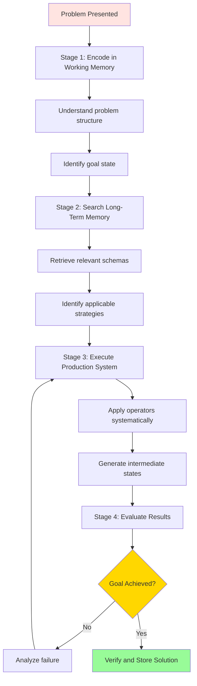
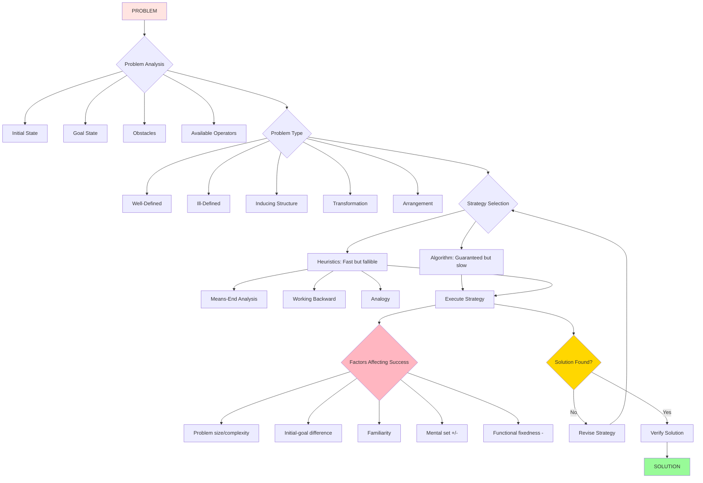

# Problem Solving: Comprehensive Guide

## Introduction

Problem solving represents one of human cognition's most essential and complex abilities—the capacity to overcome obstacles between current reality and desired goals. From mundane daily challenges (finding lost keys) to revolutionary scientific breakthroughs (discovering vaccines), problem solving underlies human achievement and progress.

This comprehensive guide explores the cognitive processes, strategies, and factors that determine problem-solving success, drawing on classic research from Gestalt psychology and contemporary cognitive science.

---

## Defining Problem Solving

### Core Definition

**Problem solving** is the thought process involved in removing obstacles that prevent achieving a goal state. It represents directed thinking aimed at transforming an unsatisfactory initial situation into a desired outcome.

### Essential Components of Every Problem

#### 1. Initial/Original State
**Definition**: The current situation—where the problem-solver begins

**Characteristics**:
- Current configuration of problem elements
- Available resources and information
- Existing constraints and limitations

**Example**: Kohler's chimpanzee experiment
- **Initial state**: Hungry chimpanzee in cage, bananas hanging from roof, three boxes scattered on floor

#### 2. Goal/End State
**Definition**: The desired outcome—what the problem-solver wants to achieve

**Characteristics**:
- Defined properties and features
- Success criteria
- May be precisely specified or loosely defined

**Example**: Kohler's experiment
- **Goal state**: Chimpanzee possessing and eating the bananas

#### 3. Obstacles
**Definition**: Barriers preventing direct transformation from initial to goal state

**Types**:
- Physical constraints
- Knowledge gaps
- Resource limitations
- Rule restrictions

**Example**: Kohler's experiment
- **Obstacle**: Bananas hanging beyond reach; cannot directly access

#### 4. Operator/Problem-Solver
**Definition**: The person (or entity) attempting to solve the problem

**Capabilities**:
- Manipulates problem elements
- Uses internal representations (symbols, images, concepts)
- Applies skills and knowledge
- Implements strategies

**Example**: Kohler's experiment
- **Operator**: The chimpanzee with its cognitive abilities, physical capabilities, and past experiences

---

### Problem Space: The Mental Representation

**Problem space** integrates all elements—initial state, goal state, possible operators, and transformation rules—into a coherent mental model.

#### Requirements for Successful Problem Space Understanding

**1. Coherence**
- Elements connected meaningfully
- Relationships between components clear
- Logical structure apparent

**2. Correspondence**
- Internal representation matches actual problem elements
- No elements unmatched or mismatched
- Accurate mapping between mental model and reality

**3. Relationship to Background Knowledge**
- Connection to relevant prior knowledge
- Activation of appropriate schemas
- Transfer of useful strategies from similar problems

**Example**: Tower of Hanoi puzzle
- **Problem space**: Mental model including all disc positions, legal moves, intermediate states, and path from start to goal
- **Success**: Requires understanding constraints (one disc at a time, no larger on smaller) and envisioning move sequences

---

### Rules: Constraints on Problem-Solving

**Rules** define permissible operations for transforming problem states toward the goal.

**Types of rules**:
- **Explicit**: Clearly stated (game rules, instructions)
- **Implicit**: Must be inferred (social conventions, natural laws)
- **Domain-specific**: Apply only in particular contexts
- **Universal**: Apply broadly across problems

**Example**: Chess
- **Explicit rules**: How each piece moves
- **Implicit rules**: Strategic principles (control center, protect king)

---

## Classic Example: Kohler's Insight Experiments

### Experimental Setup

**Wolfgang Kohler (1927)** conducted groundbreaking experiments demonstrating problem-solving in non-human primates.

**Scenario**:
- **Operator**: Hungry chimpanzee (Sultan)
- **Initial state**: Chimp in cage, bananas hanging from roof, three boxes on floor
- **Goal state**: Obtain and eat bananas
- **Obstacle**: Bananas beyond reach
- **Rule**: Can only reach bananas by stacking all three boxes vertically

### Observed Behavior

**Initial phase**: 
- Random, trial-and-error behaviors
- Jumping toward bananas
- Moving boxes aimlessly
- Showing frustration

**Sudden transformation**:
- Pause in activity
- Apparent contemplation
- Sudden purposeful action—stacking boxes systematically
- Climbing stacked boxes to reach bananas

### Theoretical Significance: Insight

**Gestalt psychologists** (Kohler, Wertheimer, Koffka) interpreted this as **insight**—sudden reorganization of the problem space leading to solution recognition.

**Characteristics of insight**:
- Sudden rather than gradual
- Accompanied by "Aha!" experience
- Involves restructuring problem representation
- Solution appears complete, not piecemeal
- Often occurs after period of incubation

**Explanation**: During apparent inactivity, **unconscious processing** reorganized problem elements into coherent structure revealing solution path.

---

## Types of Problems

### Well-Defined vs. Ill-Defined Problems

#### Well-Defined Problems

**Characteristics**:
- **Clear initial state**: Starting configuration completely specified
- **Explicit goal state**: Success criteria unambiguous
- **Definite operators**: Available actions identified
- **Explicit rules**: Constraints and procedures clearly stated
- **Verifiable solution**: Can determine definitively if goal achieved

**Examples**:
- **Algebra problems**: Given equations, defined operations, clear solution
- **Chess**: Every piece position known, rules explicit, goal (checkmate) clear
- **Crossword puzzles**: Grid structure defined, clues given, completion verifiable
- **Tower of Hanoi**: Initial configuration, legal moves, goal state all specified

**Cognitive advantages**:
- Can use systematic approaches
- Algorithms applicable
- Progress measurable
- Multiple solvers can verify correctness

---

#### Ill-Defined Problems

**Characteristics**:
- **Unclear initial state**: Starting situation ambiguous or incompletely understood
- **Vague goal state**: Success criteria subjective or undefined
- **Uncertain operators**: Available actions unclear
- **Implicit rules**: Constraints must be discovered
- **Subjective evaluation**: Success judgment varies by evaluator

**Examples**:
- **Writing a novel**: How to begin? When is it "finished"? What makes it "good"?
- **Designing a building**: Infinite possible configurations, multiple competing goals (aesthetic, functional, cost)
- **Scientific discovery**: What question to ask? What methods to use? When have you found "the answer"?
- **Career planning**: What defines success? What paths available? How to evaluate progress?

**Cognitive challenges**:
- Require problem definition as part of solving
- Algorithmic approaches rarely applicable
- Progress difficult to assess
- Solutions often involve trade-offs

**Example analysis: Creating a painting**
- **Initial state**: Blank canvas (but infinite stylistic possibilities)
- **Goal state**: "Completed artwork" (but what makes it complete? Beautiful? Meaningful?)
- **Operators**: Painting techniques (but which to use when?)
- **Rules**: Artistic conventions (but can be intentionally violated)

---

### Problems of Inducing Structure

**Definition**: Determining relationships among elements to discover underlying patterns or structures.

**Core cognitive skill**: Pattern recognition and relationship identification

#### Example: Analogy Problems

**Format**: A : B :: C : ?

**Task**: Discover relationship between A and B, then apply to C to find matching D

**Example**: Bird : Sky :: Fish : **Water**

**Cognitive processes**:
1. **Attribute discovery**: Identify relevant features (bird flies, lives in sky)
2. **Encoding**: Represent attributes symbolically
3. **Comparison**: Evaluate similarities and differences
4. **Structure mapping**: Apply discovered relationship to new pair

**Real-world applications**:
- Scientific reasoning (analogies between domains)
- Legal reasoning (case-based analogies)
- Medical diagnosis (pattern recognition across symptoms)
- Mathematical reasoning (structural similarities between problems)

---

### Problems of Transformation

**Definition**: Finding a sequence of operations to transform initial state into goal state.

**Core cognitive skill**: Means-end analysis, planning, sequential thinking

#### Classic Example: Tower of Hanoi

**Setup**:
- Three pegs (A, B, C)
- Multiple discs of different sizes
- Initial state: All discs stacked on peg A (largest to smallest)
- Goal state: All discs moved to peg C

**Rules**:
1. Move only one disc at a time
2. Only move the top disc from any peg
3. Never place larger disc on smaller disc

**Modified version (from PDF)**:
- Three discs initially on peg A
- Move all to peg C following rules

**Solution strategy**: 
- **Subgoals**: Break into manageable steps
- **Working backward**: Sometimes helpful to think from goal
- **Recursive thinking**: Solution to n discs requires solving n-1 discs

**Real-world applications**:
- Logistics planning (sequential operations with constraints)
- Software development (transforming requirements into functioning code)
- Manufacturing processes (step-by-step product assembly)

---

### Problems of Arrangement

**Definition**: Rearranging problem elements according to a criterion (sometimes discovering the criterion is part of the problem).

**Core cognitive skill**: Pattern detection, hypothesis testing, systematic search

#### Example: Anagrams

**Task**: Rearrange scrambled letters to form meaningful word

**Example**: TAC → CAT

**Cognitive strategy**: **Constructive search**
- Systematically examine reasonable letter combinations
- Use knowledge of word patterns (common letter pairs, prefixes, suffixes)
- Eliminate impossible combinations
- Test hypotheses against vocabulary

**Complexity factors**:
- **Number of letters**: More letters = exponentially more combinations
- **Familiarity of word**: Common words easier than rare words
- **Letter commonness**: Unusual letter combinations harder

**Real-world applications**:
- Scheduling problems (arranging activities/people optimally)
- Resource allocation (arranging resource distribution)
- Organizational design (arranging people/departments effectively)

---

## Stages of Problem Solving

### Gestalt Psychology's Four Stages

Gestalt psychologists proposed problem solving follows the same stages as creative thinking (Wallas's model):

1. **Preparation**: Conscious analysis and initial attempts
2. **Incubation**: Stepping away; unconscious processing
3. **Illumination**: Sudden insight when solution emerges
4. **Verification**: Testing and confirming solution

(See Stages of Creativity file for detailed explanation of each stage)

---

### Polya's Four-Stage Model

**George Polya** proposed a practical problem-solving framework widely used in mathematics and beyond:

#### Stage 1: Understanding the Problem

**Activities**:
- **Identify**: What exactly is the problem?
- **Clarify**: What are we asked to find or prove?
- **Gather information**: What data/knowledge is available?
- **Represent**: Can we diagram or visualize the problem?

**Example**: Word problem in math
- Read carefully
- Identify knowns and unknowns
- Determine what relationships exist
- Sketch if helpful

---

#### Stage 2: Devising a Plan

**Activities**:
- **Explore strategies**: What approaches might work?
- **Consider similar problems**: Have we solved anything like this before?
- **Break into subproblems**: Can we divide it into manageable pieces?
- **Create flowchart**: Map solution sequence

**Example**: Complex calculation
- Identify sequence of operations needed
- Determine which formulas/techniques apply
- Plan order of steps

---

#### Stage 3: Carrying Out the Plan

**Activities**:
- **Execute**: Implement the planned solution strategy
- **Monitor**: Check each step for accuracy
- **Be flexible**: Adjust plan if approach isn't working
- **Document**: Keep clear record of steps

**Example**: Actually solving the math problem
- Perform calculations in planned order
- Check arithmetic at each step
- Verify intermediate results

---

#### Stage 4: Looking Back

**Activities**:
- **Verify**: Is this the problem we set out to solve?
- **Check**: Is the solution reasonable?
- **Evaluate**: Does it meet constraints and criteria?
- **Reflect**: What did we learn? Can we use this approach elsewhere?
- **Communicate**: Can we clearly explain our solution?

**Example**: After reaching answer
- Substitute back into original problem
- Verify answer makes sense (not negative where should be positive, etc.)
- Consider if similar method applies to related problems

---

### Information Processing Translation

Contemporary cognitive science translates Polya's stages into computational terms:



**Key concepts**:
- **Encoding**: Translating external problem into internal representation
- **Schema retrieval**: Accessing relevant knowledge structures
- **Production systems**: If-then rules governing operator application
- **Means-end analysis**: Reducing difference between current and goal state

---

## Problem-Solving Strategies

Even with requisite knowledge and skills, success requires **effective strategies**—systematic approaches guiding solution efforts.

### Definition

**Strategy**: A planned approach or set of procedures used to work toward problem solution; a systematic method for navigating problem space.

**Purpose**:
- Guide attention to relevant information
- Prevent wasted effort on unproductive paths
- Provide structure to solution attempts
- Increase efficiency of problem-solving

---

### Algorithms

#### Definition and Characteristics

**Algorithm**: A systematic procedure that **guarantees** correct solution if properly followed.

**Four essential properties**:

**1. Exactness**
- Each step precisely and unambiguously specified
- No room for interpretation
- Reproducible by anyone following procedure

**2. Termination**
- Process must end after finite steps
- Does not run indefinitely
- Produces result within bounded time

**3. Effectiveness**
- Procedure produces correct answer
- Solution valid for problem as stated
- Meets all requirements and constraints

**4. Generality**
- Works for every instance of problem type
- Not limited to specific examples
- Covers all possible cases within problem domain

#### Examples

**Anagram solution**: Systematically generate every possible letter permutation until meaningful word found
- Exhaustive search
- Guarantees finding solution (if exists)
- Extremely time-consuming for long words

**Mathematical algorithms**:
- Long division procedure
- Quadratic formula
- Algorithms for finding greatest common divisor

**Computational algorithms**:
- Sorting procedures (bubble sort, merge sort)
- Search algorithms (binary search)
- Shortest path algorithms (Dijkstra's)

#### Limitations for Human Problem-Solvers

**Why humans rarely use algorithms**:

**Time/Effort prohibitive**:
- Even moderate-size problems require astronomical steps
- Example: 10-letter anagram has 3,628,800 possible arrangements
- Example: Chess has ~10^120 possible games—more than atoms in universe

**Cognitive limitations**:
- Working memory cannot track all possibilities
- Attention fatigues during exhaustive search
- Error rates increase with complexity

**More efficient alternatives exist**:
- Heuristics often reach good solutions much faster
- Insight can bypass systematic search entirely

**When algorithms ARE used by humans**:
- Simple problems with few possibilities
- High-stakes situations requiring guaranteed solutions
- When following explicit procedures (recipes, assembly instructions)

---

### Heuristics

#### Definition and Characteristics

**Heuristics**: Rules of thumb, general guidelines, or "educated guesses" useful for solving problems but **not guaranteeing** correct solutions.

**Key features**:
- **Powerful**: Often reach solutions quickly and efficiently
- **General**: Many apply across diverse problem types
- **Fallible**: May fail; don't guarantee success
- **Multiple**: If one fails, can try another
- **Context-sensitive**: Effectiveness varies by problem type

#### Types of Heuristics

**General heuristics**: Apply across many domains (means-end analysis, working backward)
**Domain-specific heuristics**: Apply within specialized areas (chess principles, chemical analysis strategies)

---

#### Means-End Analysis

**Definition**: Systematically reduce difference between current state and goal state by identifying and eliminating obstacles.

**Procedure**:
1. **Compare** current state with goal state
2. **Identify** most significant difference/obstacle
3. **Find operator** to reduce that difference
4. **Apply operator** to transform state
5. **Repeat** until goal achieved

**Subgoal decomposition**: Break large problems into manageable pieces

**Example: Planning trip**
- **Main goal**: Be in Paris on June 1
- **Current state**: In New York on May 15
- **Difference**: Geographic distance, time availability
- **Subgoal 1**: Purchase plane ticket
- **Subgoal 2**: Arrange accommodation
- **Subgoal 3**: Plan itinerary
- **Subgoal 4**: Handle logistics (passport, money, packing)

Each subgoal treated as separate problem using means-end analysis

**Metacognition requirement**: Must monitor progress toward subgoals and overall goal
- Self-awareness of current activity
- Tracking of goal hierarchy
- Assessment of strategy effectiveness
- Flexibility to adjust approach

---

#### Working Backward

**Definition**: Start with goal state and work backward toward initial state.

**When useful**:
- **Goal state well-defined** but initial state unclear or complex
- **Multiple initial states** could lead to goal
- **Goal constraints** limited, making backward steps easier to identify

**Example: Paper-pencil maze**
- Starting from "exit" and working to "entrance" often easier
- Reduces wrong turns by focusing on paths leading TO goal

**Combined with means-end analysis**:
- Use both forward (from current state) and backward (from goal)
- Meet in middle
- Particularly effective for problems with clear goal states

**Example: Geometry proof**
- Work forward from givens
- Work backward from conclusion
- Connect intermediate steps

---

#### Analogical Reasoning

**Definition**: Apply strategies that worked for similar problems encountered previously.

**Procedure**:
1. **Recognize similarity** between current and past problems
2. **Retrieve solution** from previous problem
3. **Map elements** from old to new problem
4. **Adapt strategy** to fit current context
5. **Implement** modified approach

**Requirements**:
- **Memory** for past problems and solutions
- **Pattern recognition** to identify similarities
- **Abstraction** to see underlying structural similarities beyond surface features
- **Flexibility** to adapt strategies appropriately

**Example: Transfer in mathematics**
- Learned to solve linear equations
- Now facing quadratic equations
- Recognize similar structure (finding unknown values)
- Adapt techniques (quadratic formula, factoring) based on understanding linear methods

**Challenge: Surface vs. Structural similarity**
- **Surface similarity**: Superficial features (same objects, context, wording)
- **Structural similarity**: Underlying logical/mathematical relationships
- Humans often fixate on surface similarity, missing structurally similar problems
- Expertise involves recognizing deep structural patterns

---

## Factors Affecting Problem-Solving Effectiveness

Success in problem solving depends on multiple interacting factors—some inherent to the problem, others in the problem-solver.

### 1. Nature and Size of the Problem

#### Problem Magnitude

**Definition**: Complexity, scope, and scale of the problem

**Factors**:
- **Number of elements**: More elements = greater complexity
- **Relationships between elements**: More interactions = harder to track
- **Number of steps required**: Longer solution paths harder to find
- **Ambiguity**: Poorly defined problems harder than well-defined

**Example**: Anagrams
- 3-letter anagram: 6 possible arrangements (manageable)
- 10-letter anagram: 3,628,800 possibilities (overwhelming)

**Impact on problem-solving**:
- **Time required**: Increases non-linearly with size
- **Working memory load**: Larger problems exceed capacity
- **Error probability**: More steps = more opportunities for mistakes

---

### 2. Difference Between Initial and Goal States

**Principle**: Greater distance between start and finish reduces solution likelihood.

**Mechanism**:
- More disorganized problem space = more transformation steps needed
- Each additional step:
  - Increases time required
  - Adds cognitive load
  - Introduces error opportunities
- Difficult to envision complete path when states very different

**Example: Anagrams**
- **Small difference**: TEAM → MEAT (similar letter arrangements)
  - Can see relationship between configurations
  - Requires few rearrangements
  
- **Large difference**: LBAET → TABLE (completely scrambled)
  - No obvious similarity in arrangements
  - Many rearrangements needed
  - Path to solution unclear

**Implication**: Problems with smaller gaps between initial and goal states solve more easily, even with same number of elements.

---

### 3. Problem Familiarity and Frequency

**Principle**: Experience with similar problems facilitates solving.

**Mechanisms**:
- **Schema activation**: Familiar problem types activate relevant knowledge structures
- **Pattern recognition**: Experience enables seeing solutions faster
- **Strategic knowledge**: Learn which approaches work for problem type
- **Automated components**: Practiced elements require less conscious attention

**Example**:
- **First time** solving quadratic equation: Slow, effortful, requires consulting formula
- **After dozens**: Recognize structure immediately, solution approach automatic

**Implication**: Practice and exposure improve problem-solving speed and accuracy

---

### 4. Mental Set (Einstellung Effect)

#### Definition

**Mental set**: Tendency to perceive and respond to situations in fixed, stereotypical ways based on past experience.

**Einstellung**: German term meaning "set" or "attitude"; refers specifically to problem-solving rigidity from prior learning.

#### Formation

Mental set develops through:
- **Repeated successful use** of particular approach
- **Overlearning** of specific procedures
- **Reinforcement** for using certain methods
- **Environmental consistency** encouraging habitual responses

#### Facilitatory Effects

Mental set can **help** when:
- **New problem similar** to previous ones
- **Practiced approach** applies directly
- **Speed valued** over novelty

**Example**: Routine arithmetic
- Mental set for addition/subtraction operations
- Enables rapid calculation without deep thinking
- Facilitates solving similar problems efficiently

#### Inhibitory Effects

Mental set can **hinder** when:
- **New problem requires different approach**
- **Previous method no longer optimal**
- **Creative solution needed**
- **Situation changed but thinking hasn't**

**Example**: Classic demonstration
- Solve problems 1-5 using procedure X (establishes set)
- Problem 6 solvable using X but simpler method exists
- Most continue using X due to mental set
- Miss more efficient approach

**Example from text: Word pronunciation**
```
MACDONALDMACMOHANMACGREGORMACHINERY
```

If you pronounced last word as "MacHinery," mental set affected you—set established by three "Mac-" names led to misapplying pattern.

#### Overcoming Mental Set

**Strategies**:
- **Increase time between practice and test**: Reduces set strength
- **Explicit instructions**: Tell problem-solvers not to rely on previous methods
- **Introduce exceptions during learning**: Breaks rigid pattern formation
- **Encourage flexible thinking**: Reward multiple approaches
- **Metacognitive awareness**: Recognize when set operating

---

### 5. Functional Fixedness

#### Definition

**Functional fixedness**: Tendency to perceive objects only in terms of their customary, stereotypical uses.

**Broader concept**: Specific type of mental set affecting perception of objects and tools.

#### Classic Example: Candle Problem (Duncker, 1945)

**Task**: Attach candle to wall so it burns without dripping wax on floor

**Materials provided**:
- Candle
- Box of matches
- Box of thumbtacks

**Functional fixedness obstacle**:
- See matchbox and thumbtack box only as "containers"
- Don't recognize they can serve as "platforms" or "shelves"

**Solution**:
- Empty thumbtack box
- Tack box to wall (creates shelf)
- Place candle on box-shelf
- Light with matches

**Why difficult**: Functional fixedness prevents seeing box beyond its typical container function.

**Experimental variation**:
- **Condition 1**: Materials inside boxes (harder—boxes seen as containers)
- **Condition 2**: Materials outside boxes (easier—boxes not currently functioning as containers)

#### Real-World Examples

**Everyday situations**:
- Using shoe as hammer when tool unavailable (overcoming fixedness)
- Failing to use credit card to open locked door (fixedness present)
- Using clipboard as laptop stand (overcoming fixedness)

**Innovation**: Often involves overcoming functional fixedness
- New uses for existing technologies
- Repurposing materials in novel ways
- Seeing beyond conventional applications

#### Overcoming Functional Fixedness

**Strategies**:
- **Explicit instructions**: Encourage thinking about alternative uses
- **Varied experience**: Exposure to objects in multiple contexts
- **Creative mindset**: Prime flexibility and originality
- **Physical manipulation**: Handling objects in different ways
- **Analogical thinking**: Consider how object similar to other things

**Individual differences**:
- Creative individuals show **less** functional fixedness
- Domain expertise can **increase** fixedness (over-learned conventional uses)
- Children often show **less** fixedness than adults (less entrenched knowledge)

---

## Memory Aid: PROBLEM-SOLVING MASTERY

**P**roblem space (initial state, goal state, operators, rules)<br/>
**R**educe difference (means-end analysis)<br/>
**O**perational strategy selection (algorithm vs heuristic)<br/>
**B**ackward sometimes better (work from goal)<br/>
**L**arger problems harder (more elements, more steps)<br/>
**E**instellung effect (mental set from past)<br/>
**M**agnitude matters (size affects difficulty)

**S**ubgoal decomposition (break into pieces)<br/>
**O**bstacles between initial and goal (greater distance harder)<br/>
**L**ower fixedness improves flexibility (functional fixedness blocks)<br/>
**V**erify solutions (Polya's looking back)<br/>
**I**nsight follows incubation (Gestalt stages)<br/>
**N**o guarantee with heuristics (vs algorithms)<br/>
**G**eneralize from analogies (past problems inform current)

---

## Self-Assessment Questions

### Conceptual Understanding

1. **Define problem solving and identify the four essential components of any problem. Provide an original example (not from the text) and label each component.**

2. **Distinguish between well-defined and ill-defined problems. Give two examples of each and explain why they fit each category.**

3. **Compare algorithms and heuristics. When would you use each? Why do humans rarely use algorithms despite their guaranteed solutions?**

4. **Explain means-end analysis. Create a flowchart showing how you would use this heuristic to solve a complex problem of your choice.**

### Application and Analysis

5. **Choose a problem you recently solved (academic, personal, or professional). Analyze it using:**
   - Which problem type was it? (inducing structure, transformation, arrangement)
   - Which strategy did you use? (algorithmic, heuristic, insight)
   - Which factors affected your success or difficulty?

6. **Design a problem that would demonstrate functional fixedness. Describe:**
   - The task
   - The materials provided
   - The typical function creating fixedness
   - The solution requiring overcoming fixedness

### Critical Thinking

7. **Mental set can both help and hinder problem solving. Construct arguments for:**
   - When establishing mental sets is beneficial
   - When preventing mental sets is important
   - How educators can balance these competing considerations

8. **Compare Polya's four-stage model with the Gestalt four-stage model (preparation, incubation, illumination, verification). How are they similar? How do they differ? Which model is more useful for different types of problems?**

9. **Debate the following: "Heuristics are superior to algorithms for human problem-solving." What evidence supports this claim? What evidence contradicts it? Under what conditions might each be preferable?**

---

## Mermaid Diagram: Problem-Solving Framework



---

## External Resources

### Academic Sources

- 📄 [Wikipedia: Problem Solving](https://en.wikipedia.org/wiki/Problem_solving) - Comprehensive overview
- 📄 [Wikipedia: Heuristic](https://en.wikipedia.org/wiki/Heuristic) - Decision-making shortcuts
- 📄 [Wikipedia: Functional Fixedness](https://en.wikipedia.org/wiki/Functional_fixedness) - Cognitive bias in problem-solving
- 📄 [Wikipedia: Einstellung Effect](https://en.wikipedia.org/wiki/Einstellung_effect) - Mental set phenomenon

### Educational Videos

- 🎥 [Problem Solving - MIT OpenCourseWare](https://www.youtube.com/results?search_query=MIT+cognitive+psychology+problem+solving) - Academic lectures on problem-solving strategies
- 🎥 [Functional Fixedness - Khan Academy](https://www.youtube.com/results?search_query=khan+academy+functional+fixedness) - Clear explanation with demonstrations

### Research Papers

- 📚 Newell, A., & Simon, H. A. (1972). *Human Problem Solving*. Englewood Cliffs, NJ: Prentice-Hall.
- 📚 Duncker, K. (1945). On problem-solving. *Psychological Monographs, 58*(5), i-113.
- 📚 Polya, G. (1945). *How to Solve It*. Princeton University Press.

### Practical Applications

- 🔗 [Problem-Solving Strategies - Stanford d.school](https://dschool.stanford.edu/) - Design thinking approaches
- 🔗 [Cognitive Bias and Problem Solving - Psychology Today](https://www.psychologytoday.com/us/basics/problem-solving) - Practical insights

---

## Source PDFs

📄 **[Block-2/Unit-4.pdf - Pages 67-76](/pdfs/MPC-001%20Cognitive%20Psychology,%20Learning%20and%20Memory/Block-2/Unit-4.pdf)**<br/>
📚 **MPC-001 Cognitive Psychology, Learning and Memory**

---

**Previous**: [← Measuring Creativity](/mpc-001/block-2/measurement-creativity-ttct)<br/>
**Next**: [Unit Summary and Integration →](/mpc-001/block-2/unit-4-summary)
