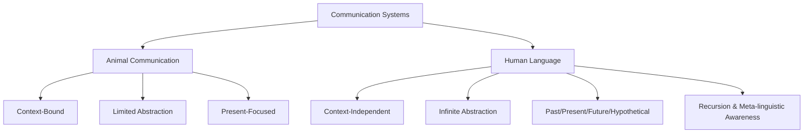

# Language and Cognition: Foundations and Relationship

## Introduction

Language represents one of the most remarkable achievements of the human mind. As you read these words, an extraordinary process is unfolding - cell assemblies in your brain are being permanently changed, new thoughts are forming, and you are being transformed by the very act of understanding language. This intimate connection between language and thought lies at the heart of cognitive psychology.

Language is fundamentally **a system of communication in which thoughts are transmitted by means of sounds (as in speech and music) or symbols (as in written words and gestures)**. When we use language, one mind influences another through an intricate dance of neural activity, semantic processing, and shared understanding.

## The Historical Context

### From Philosophy to Science

For centuries, the study of language and thought remained in the domain of philosophers and metaphysicians. The famous rationalist philosopher René Descartes articulated what became a foundational principle of Western philosophy: *"Cogito, ergo sum"* - "I think, therefore I am." This statement placed thinking at the very center of human existence.

However, cognitive psychology as a scientific discipline only emerged in the 1950s. Before this **cognitive revolution**, behaviorist psychologists dominated the field, believing that the scientific method could not be applied to processes as private and internal as thinking. They focused exclusively on observable behavior, treating the mind as a "black box" that couldn't be studied directly.

### The Cognitive Revolution

The 1950s brought a paradigm shift. Thanks to increasingly sophisticated tools for studying brain activity - including electroencephalography (EEG), and later functional magnetic resonance imaging (fMRI) and positron emission tomography (PET) scans - scientists could finally peer into the working mind. Cognitive psychology emerged as a thriving science, asking profound questions:

- How does language affect thought?
- Is it possible to create a "thinking" machine?
- Why are humans motivated to create art?
- What is the relationship between language and consciousness?

## Why Study Language in Cognitive Psychology?

The study of human language occupies a central position in cognitive psychology for several interconnected reasons:

### 1. **Language as Unique Abstraction**

Human language development represents a unique kind of abstraction that is fundamental to cognition. While other species have elaborate communication systems:

- **Bees** perform intricate waggle dances to communicate location of food sources
- **Birds** produce complex songs for territorial and mating purposes  
- **Dolphins** use sophisticated whistles and clicks for echolocation and social communication
- **Apes** can learn to use basic symbols and gestures

However, the **degree of abstraction** in human language far exceeds these systems. We can discuss abstract concepts like justice, infinity, consciousness, and even language itself - a level of recursive thinking unavailable to other species.

### 2. **Language in Information Processing**

Language processing is a crucial component of how we handle and store information. Consider these processes:

- **Encoding**: Translating experiences into linguistic representations
- **Storage**: Maintaining verbal and semantic information in memory
- **Retrieval**: Accessing stored linguistic information when needed
- **Manipulation**: Using language to reason and solve problems

The **dual-coding theory** proposed by Allan Paivio suggests that we process and store information in two distinct systems: a verbal system (language-based) and a non-verbal imagery system. These systems work together but can also operate independently.

### 3. **Language and Internal Cognition**

Many, if not most, forms of thinking and problem-solving are internal - occurring in the absence of external stimuli. When you work through a math problem in your head, plan your day, or contemplate a philosophical question, you're likely using language as a tool for thought.

**Example**: When faced with a complex puzzle, we often:
1. Describe the problem verbally to ourselves
2. Generate verbal hypotheses
3. Use language to evaluate potential solutions
4. Articulate our reasoning process

This process of **verbal mediation** allows us to manipulate abstract symbols mentally, making complex problem-solving possible.

### 4. **Language as Communication Gateway**

Language is the primary means through which humans exchange information. Through language, we can:

- **Transfer knowledge** across generations (cultural transmission)
- **Coordinate complex activities** requiring multiple individuals
- **Express emotions** and internal states
- **Build social bonds** and establish group identity
- **Preserve history** and cultural heritage

According to **Communication Accommodation Theory** (Giles, 1973), speakers adjust their language use to facilitate communication and express social relationships, highlighting language's role beyond mere information transfer.

### 5. **Language and Perception: A Two-Way Street**

The relationship between language and perception is one of **interdependency**:

#### Language Influences Perception (Linguistic Relativity)

The **Sapir-Whorf Hypothesis** suggests that the language we speak influences how we perceive and conceptualize the world. Research has shown:

- Speakers of languages with rich color vocabularies may distinguish colors more readily
- Languages that mark gender grammatically may lead speakers to attribute gender characteristics to inanimate objects
- Spatial language (absolute vs. relative directions) affects how people navigate and remember locations

#### Perception Influences Language

Conversely, language development is largely based on our perception of the world:

- Children learn words for objects they can perceive
- **Universal constraints** on color naming reflect human perceptual biology
- Sound symbolism (e.g., "boom," "whisper") directly reflects acoustic properties

This bidirectional relationship means language operates as a **cognitive window** - it both reveals and shapes our mental life.

## Neurological Foundations

### Brain Areas and Language

Modern neuroscience has identified specific cerebral areas dedicated to language processing:

#### Broca's Area (Frontal Lobe)
- Located in the left frontal cortex
- Critical for **speech production** and **grammatical processing**
- Damage results in **Broca's aphasia**: difficulty producing fluent speech while comprehension remains relatively intact

#### Wernicke's Area (Temporal Lobe)  
- Located in the left temporal lobe
- Essential for **language comprehension**
- Damage causes **Wernicke's aphasia**: fluent but meaningless speech with impaired comprehension

#### Arcuate Fasciculus
- White matter tract connecting Broca's and Wernicke's areas
- Enables coordination between comprehension and production
- Damage can result in **conduction aphasia**: difficulty repeating words despite intact comprehension and production

### Language Pathology and Cognitive Insights

The study of **aphasia** (language impairment due to brain damage) has provided invaluable insights into the cognitive architecture of language:

**Case Studies in Aphasia:**

- **Paul Broca's Patient "Tan"** (1861): Could only say "tan" but showed intact comprehension
- **Carl Wernicke's Patients** (1874): Produced fluent nonsense speech with impaired comprehension
- **Modern stroke victims**: Provide detailed mappings of language functions to brain regions

These cases demonstrate that language is not a unitary faculty but comprises multiple, partially independent subsystems that can be selectively impaired.

## Real-World Applications

### Clinical Applications

Understanding language-cognition relationships has practical implications:

1. **Speech-Language Therapy**: Targets specific language deficits based on cognitive models
2. **Assessment Tools**: Cognitive-linguistic batteries diagnose processing deficits
3. **Rehabilitation**: Uses spared cognitive capacities to compensate for language impairments
4. **Early Intervention**: Identifies language delays that may signal broader cognitive issues

### Educational Implications

The language-cognition connection informs educational practice:

1. **Literacy Instruction**: Understanding phonological awareness supports reading development
2. **Bilingual Education**: Recognizes cognitive benefits of multilingualism
3. **Special Education**: Addresses language impairments that affect academic learning
4. **Vocabulary Development**: Supports conceptual growth through language expansion

### Artificial Intelligence

The cognitive study of language has influenced AI development:

1. **Natural Language Processing (NLP)**: Models inspired by human language processing
2. **Machine Translation**: Attempts to capture semantic and pragmatic aspects of language
3. **Conversational AI**: Builds on understanding of human dialogue structure
4. **Voice Assistants**: Apply cognitive principles of speech recognition and production

## Critical Questions in Language-Cognition Research

### 1. **Does Language Determine Thought?**

This question, central to the **Sapir-Whorf Hypothesis**, continues to generate debate:

- **Strong Version** (Linguistic Determinism): Language determines thought
  - Largely rejected by modern cognitive science
- **Weak Version** (Linguistic Relativity): Language influences thought
  - Supported by research showing language effects on color perception, spatial reasoning, and time concepts

### 2. **Can We Think Without Language?**

Evidence suggests **yes**:
- Prelinguistic infants demonstrate sophisticated reasoning
- Deaf individuals without language access still think
- Visual-spatial thinking doesn't require language
- Mathematical and musical thinking can proceed non-verbally

However, language dramatically **enhances** certain types of thinking, particularly abstract reasoning and metacognition.

### 3. **Is Language Special?**

This question asks whether language uses domain-general cognitive mechanisms or specialized, language-specific ones:

- **Generalist View**: Language emerges from general learning and memory capacities
- **Modularist View**: Language involves specialized, innate cognitive mechanisms

Current evidence supports a **middle ground**: language involves both general cognitive processes and some degree of specialization.

## Memory Aids

### Mnemonic: CAPE for Why Study Language

- **C**ommunication - Primary means of information exchange
- **A**bstraction - Unique human capacity for symbolic thought  
- **P**erception - Influences how we see the world
- **E**ncoding - Central to information processing

### Key Distinctions to Remember

| Aspect | Language | General Cognition |
|--------|----------|-------------------|
| Modality | Primarily auditory-vocal | Multi-modal |
| Domain | Communication-specific | Domain-general |
| Development | Rapid, universal stages | Variable across domains |
| Impairment | Can be selectively damaged | Usually affects multiple areas |
| Uniqueness | Human-specific in full form | Present across species |

## Self-Assessment Questions

### Multiple Choice

1. **Which of the following best describes the relationship between language and perception according to the unit?**
   - a) Language has no effect on perception
   - b) Perception completely determines language
   - c) Language and perception influence each other bidirectionally
   - d) Language and perception are unrelated cognitive processes

Answer

**c) Language and perception influence each other bidirectionally**

The unit explicitly describes this as "interdependency" - language can influence how we perceive (Sapir-Whorf Hypothesis), while our perceptions also shape language development.

2. **What did the cognitive revolution of the 1950s accomplish?**
   - a) Proved that thinking cannot be studied scientifically
   - b) Demonstrated that only observable behavior matters
   - c) Enabled scientific study of internal mental processes
   - d) Eliminated the need to study language

Answer

**c) Enabled scientific study of internal mental processes**

The cognitive revolution, aided by new brain imaging technologies, allowed researchers to move beyond behaviorism's focus on external behavior and begin studying internal cognitive processes scientifically.

3. **According to the unit, what makes human language unique compared to animal communication?**
   - a) Humans can make more sounds than animals
   - b) The degree of abstraction in human language is much greater
   - c) Only humans use gestures to communicate
   - d) Animals cannot learn human languages

Answer

**b) The degree of abstraction in human language is much greater**

While many species have elaborate communication systems, human language is distinguished by its capacity for infinite abstraction, recursion, and discussion of hypothetical, past, and future events.

### Short Answer

4. **Explain how studying language pathology (such as aphasia) provides insights into the cognitive architecture of language.**

Sample Answer

Studying aphasia reveals that language is not a single, unified system but consists of multiple, partially independent components. For example, Broca's aphasia impairs speech production while sparing comprehension, while Wernicke's aphasia does the opposite. These selective impairments demonstrate that language comprehension, production, and processing involve distinct neural systems that can be independently damaged, providing evidence for a modular organization of language in the brain.

5. **Describe the "interdependency" between language and perception mentioned in the unit.**

Sample Answer

The interdependency means language and perception mutually influence each other. On one hand, the language we speak can influence how we perceive and categorize the world (linguistic relativity) - for example, having more color terms may enhance color discrimination. On the other hand, language development is based largely on our perceptions - children learn words for objects they perceive, and universal constraints on language often reflect human perceptual biology. Neither completely determines the other; instead, they continuously interact.

### Essay Question

6. **Discuss why language occupies a central position in cognitive psychology. In your answer, address at least three of the five reasons provided in the unit.**

Discussion Points

A strong answer would:
- Identify language as unique human abstraction enabling recursive, hypothetical thinking
- Explain language's role in information processing (encoding, storage, retrieval)
- Discuss how internal problem-solving often uses verbal mediation
- Address language as the primary communication channel for cultural transmission
- Explore the bidirectional relationship between language and perception
- Provide specific examples or research findings
- Connect these reasons to broader questions in cognitive science

---

## Further Exploration

### Recommended Readings

1. **Pinker, S. (1994).** *The Language Instinct*. - Accessible introduction to language as a cognitive adaptation
2. **Jackendoff, R. (2002).** *Foundations of Language: Brain, Meaning, Grammar, Evolution*. - Comprehensive treatment of language in cognitive science
3. **Clark, H. H. (1996).** *Using Language*. - Emphasizes social-communicative aspects of language use
4. **Tomasello, M. (2003).** *Constructing a Language*. - Presents usage-based approach to language acquisition

### Online Resources

- [MIT OpenCourseWare: The Human Brain](https://ocw.mit.edu/courses/9-00sc-introduction-to-psychology-fall-2011/pages/brain-i/) - Excellent lectures on neuroscience of language
- [TED Talk: Steven Pinker on Language and Thought](https://www.ted.com/talks/steven_pinker_what_our_language_habits_reveal) - Engaging overview
- [Linguistic Society of America: FAQs](https://www.linguisticsociety.org/resource/faq-what-linguistics) - Answers common questions about language science

### Research Topics for Further Study

1. The neural basis of bilingualism and multilingualism
2. Language processing in real-time (psycholinguistics experiments)
3. Computational models of language acquisition
4. Cross-linguistic differences in cognitive processing
5. The relationship between sign language and cognitive development in deaf individuals

---

**Source PDFs**: 
- 📄 [Block-3/Unit-1.pdf - Pages 1-4](/pdfs/MPC-001%20Cognitive%20Psychology,%20Learning%20and%20Memory/Block-3/Unit-1.pdf)
- 📚 MPC-001 Cognitive Psychology, Learning and Memory

## External Resources

### Wikipedia Articles
- [Cognitive Psychology](https://en.wikipedia.org/wiki/Cognitive_psychology) - Overview of the field
- [Psycholinguistics](https://en.wikipedia.org/wiki/Psycholinguistics) - Language and cognition
- [Linguistic Relativity](https://en.wikipedia.org/wiki/Linguistic_relativity) - Sapir-Whorf Hypothesis
- [Aphasia](https://en.wikipedia.org/wiki/Aphasia) - Language impairments

### Educational Videos
- [Crash Course Psychology #16: Language](https://www.youtube.com/watch?v=s9shPouRWCs) - Overview of language psychology
- [The Linguistic Genius of Babies - Patricia Kuhl](https://www.ted.com/talks/patricia_kuhl_the_linguistic_genius_of_babies) - TED Talk on infant language learning

### Research Articles
- Kuhl, P. K. (2004). Early language acquisition: cracking the speech code. *Nature Reviews Neuroscience*, 5(11), 831-843.
- Fedorenko, E., & Thompson-Schill, S. L. (2014). Reworking the language network. *Trends in Cognitive Sciences*, 18(3), 120-126.
