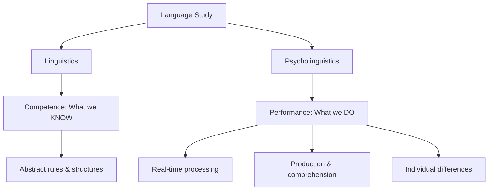
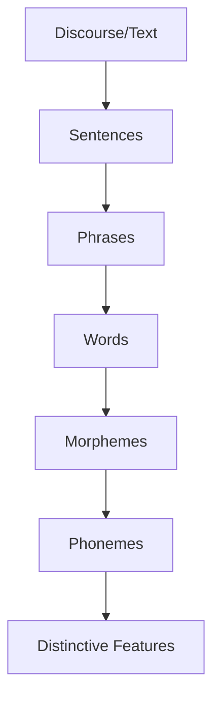
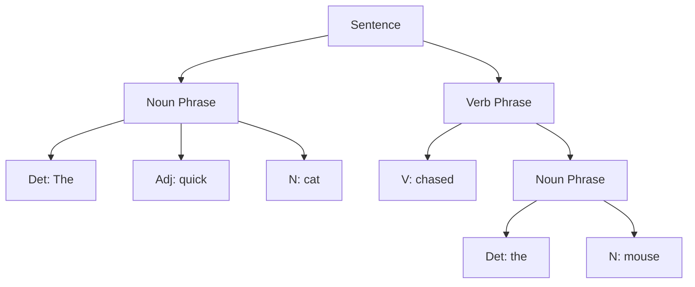

# Linguistics and Language Structure: Building Blocks of Communication

## Introduction

Language is not just a collection of words randomly strung together. It is a highly organized, hierarchical system with specific rules and structures that allow humans to generate and understand an infinite number of novel utterances. Understanding the formal structure of language - how sounds combine into words, words into sentences, and sentences into discourse - is essential for grasping how we communicate and think.

## Linguistics vs. Psycholinguistics

### Linguistics: The Science of Language Structure

**Linguistics** is the formal description of the structure of language, including speech sounds, meanings, and grammar. Linguists study language **competence** - the ideal, abstract knowledge that a speaker-listener has about their language. This includes:

- What sentences are grammatically correct
- How sounds pattern in the language
- How meanings are structured and related
- What rules govern word formation

### Psycholinguistics: Language in Action

**Psycholinguistics** examines language **performance** - how humans actually use language in real-time. Psycholinguistics investigates:

- How we process speech as we hear it
- How we produce utterances fluently
- What happens when language breaks down
- How children acquire language
- How we understand ambiguous sentences

The discipline integrating both approaches is called **psycholinguistics** - it bridges the gap between abstract linguistic knowledge and actual language behavior.

## Criteria for a System of Communication to be a Language

Not every system of communication qualifies as a full language. According to linguistic theory, a true language must meet these criteria:

### 1. **Symbolic**

A language uses **symbols** - sounds, gestures, or written characters that represent objects, actions, events, and ideas. These symbols are:

- **Arbitrary**: The connection between symbol and meaning is conventional, not inherent
  - Example: There's nothing inherently "dog-like" about the sound sequence /dɔg/
  - Different languages use different sounds: perro (Spanish), chien (French), inu (Japanese)

- **Displaceable**: Symbols can refer to things not present in time or space
  - We can discuss dinosaurs that lived millions of years ago
  - We can plan events that will happen in the future
  - We can describe hypothetical situations that may never occur

### 2. **Meaningful**

A language conveys meanings that can be understood by other users of that language. This requires:

- **Shared conventions**: Speakers must agree on what symbols mean
- **Compositionality**: The meaning of complex expressions derives from the meanings of parts and how they're combined
- **Context-sensitivity**: Meanings can vary based on situational context

### 3. **Generative**

Language is **generative** (or productive), meaning symbols can be combined to produce an infinite number of messages. This is perhaps the most remarkable property of human language.

**Example of Generativity:**
- From just 44 phonemes in English and basic grammatical rules, we can produce sentences never before uttered:
  - "The purple elephant philosophized about quantum mechanics while juggling seventeen pineapples."
- This sentence is novel yet perfectly comprehensible to any English speaker

This property distinguishes human language from most animal communication systems, which have a fixed repertoire of signals.

### 4. **Rule-Governed**

A language has **rules** (grammar) that govern how symbols can be arranged. These rules:

- Define which combinations are permissible (grammatical)
- Allow people to understand novel messages
- Operate at multiple levels: sound patterns, word formation, sentence structure

**Example:**
- "The cat chased the mouse" - Grammatical
- "Cat the mouse chased the" - Ungrammatical (violates English word order rules)
- Yet both use the same words - the difference is in their arrangement

## The Building Blocks of Language: Hierarchical Organization

Language is organized **hierarchically**, from the smallest units of sound to complete meaningful utterances.

### Level 1: Phonemes - The Smallest Sound Units

**Phonemes** are the smallest distinguishable sound units in a language. Importantly:

- Phonemes are **distinctive sounds** - they change meaning when substituted
- Different languages have different phoneme inventories
- English has approximately 44 phonemes (number varies by dialect)

#### Understanding Phonemes

**Consonant Examples:**
- /t/, /p/, /m/ - Single phonemes in English
- /c/, /g/ - Can correspond to multiple phonemes depending on context
  - "cat" /k/ vs. "cent" /s/
  - "get" /g/ vs. "gem" /dʒ/

**Vowel Examples:**
- The letter 'o' represents different phonemes in:
  - "bone" /oʊ/
  - "woman" /ʊ/
  - "move" /u/

**Phoneme Combinations:**
- Some phonemes correspond to letter combinations:
  - "ch" as in "church" /tʃ/
  - "sh" as in "ship" /ʃ/
  - "th" as in "thin" /θ/ or "this" /ð/

#### Minimal Pairs

Linguists identify phonemes through **minimal pairs** - words that differ by only one sound:

| Word 1 | Word 2 | Different Phoneme |
|--------|--------|-------------------|
| bat | cat | /b/ vs. /c/ |
| ship | sip | /ʃ/ vs. /s/ |
| thin | tin | /θ/ vs. /t/ |

This demonstrates that /b/, /k/, /ʃ/, /s/, /θ/, and /t/ are distinct phonemes in English because substituting one for another changes the word's meaning.

### Level 2: Morphemes - The Smallest Meaningful Units

**Morphemes** are the smallest meaningful units in a language. While phonemes carry no meaning themselves, morphemes are the first level where meaning appears.

#### Types of Morphemes

**Free Morphemes:**
- Can stand alone as words
- Examples: cat, run, happy, book

**Bound Morphemes:**
- Must attach to other morphemes
- Examples: -s (plural), -ed (past tense), -ing (progressive), un- (negation)

#### Morpheme Example: "disliked"

The word "disliked" contains three morphemes:
1. **dis-** (bound morpheme: negation/reversal)
2. **lik** (free morpheme root: the verb stem)
3. **-ed** (bound morpheme: past tense)

#### Morpheme Types and Functions

| Morpheme Type | Function | Examples |
|---------------|----------|----------|
| Root | Core meaning | walk, happy, beauty |
| Prefix | Modifies beginning | un-, re-, pre-, dis- |
| Suffix | Modifies end | -s, -ed, -ing, -ly, -ness |
| Inflectional | Grammatical function | -s (plural/3rd person), -ed (past) |
| Derivational | Creates new words | -ness (noun), -ify (verb), -less (adjective) |

#### Single-Letter Morphemes in English

English has very few single-letter morphemes:
- **I** - first person pronoun
- **a** - indefinite article
- **s** - plural marker (bound)

### Level 3: Words - Combinations of Morphemes

Words are formed by combining morphemes according to language-specific rules. English allows extensive word formation:

**Example: "unbelievability"**
- un- (not) + believe (root) + -able (capable of) + -ity (quality of)
- This demonstrates how complex words are built from simpler morphemic units

### Level 4: Syntax - The Rules of Sentence Structure

**Syntax** is the system of rules governing how words can be meaningfully arranged to form phrases and sentences. Syntax determines:

- Word order (which varies across languages)
- Agreement (subjects and verbs must match in number)
- Dependencies (how words relate to each other structurally)
- Constituency (which words group together as units)

#### Basic English Syntactic Rules

**Rule Example 1: Article Placement**
- Correct: "Read the book"
- Incorrect: "Read book the"
- **Rule**: Articles precede nouns in English

**Rule Example 2: Subject-Verb Agreement**
- Correct: "She runs" / "They run"
- Incorrect: "She run" / "They runs"
- **Rule**: Singular subjects take singular verb forms; plural subjects take plural forms

#### Phrase Structure

Syntax organizes words into hierarchical phrases:

This tree structure shows that "The quick cat" forms a constituent (noun phrase) that functions as a unit.

### Level 5: Semantics - Meaning

**Semantics** concerns the meaning of linguistic expressions:

- **Lexical semantics**: Word meanings
- **Compositional semantics**: How meanings combine
- **Pragmatics**: Meaning in context

## Cross-Linguistic Variation

While all languages share these hierarchical levels, they vary considerably in their specific implementations:

### Phonological Variation

- **Phoneme Inventories**: Range from 11 phonemes (Rotokas, Papua New Guinea) to over 100 (some Khoisan languages with click sounds)
- **Tonal Languages**: Chinese, Thai, Yoruba use pitch to distinguish word meanings
- **Phonotactics**: Rules for permissible sound combinations vary (Japanese doesn't allow consonant clusters like "str-" in English)

### Morphological Variation

- **Isolating Languages** (e.g., Mandarin Chinese): Words typically consist of single morphemes
- **Agglutinative Languages** (e.g., Turkish, Finnish): Words formed by chaining many morphemes
- **Fusional Languages** (e.g., Spanish, Russian): Morphemes convey multiple grammatical categories simultaneously

### Syntactic Variation

**Word Order Patterns:**

| Language | Basic Word Order | Example |
|----------|-----------------|---------|
| English | Subject-Verb-Object (SVO) | "She reads books" |
| Japanese | Subject-Object-Verb (SOV) | "She books reads" |
| Irish | Verb-Subject-Object (VSO) | "Reads she books" |

Despite surface differences, all languages can express the same meanings - **universal translatability** suggests underlying cognitive universals.

## Real-World Applications

### Language Education

Understanding language structure helps in:
- Teaching foreign languages more effectively
- Designing curriculum that progresses from simpler to more complex structures
- Identifying and remediating specific language impairments

### Speech Recognition Technology

Modern speech-to-text systems must:
- Identify phonemes from acoustic signals
- Recognize word boundaries (morphological processing)
- Parse syntactic structure for disambiguation
- Apply semantic and pragmatic knowledge for accuracy

### Natural Language Processing

AI systems like chatbots and translation programs use linguistic principles:
- Tokenization (identifying morphemes and words)
- Part-of-speech tagging (syntactic analysis)
- Parsing (building syntactic trees)
- Semantic analysis (understanding meaning)

### Clinical Applications

Speech-language pathologists use linguistic analysis to:
- Assess phonological disorders
- Identify morphological and syntactic impairments
- Design targeted interventions for specific linguistic levels
- Distinguish language disorders from speech disorders

## Memory Aids

### Mnemonic: PSMS for Language Levels

Remember the hierarchy from smallest to largest:
- **P**honemes - sounds
- **S** (skip to) Morphemes - smallest meaning units
- **M** (skip to) words (Morphology)
- **S**yntax - sentence structure

### Key Principle: Discrete Infinity

Language demonstrates **discrete infinity**:
- **Discrete**: Composed of distinct, separable units (phonemes, morphemes, words)
- **Infinite**: These units can be recombined in unlimited ways

This principle explains how finite neural and articulatory resources generate unbounded expressive capacity.

## Self-Assessment Questions

### Multiple Choice

1. **What is the key difference between phonemes and morphemes?**
   - a) Phonemes are written; morphemes are spoken
   - b) Phonemes carry meaning; morphemes are just sounds
   - c) Phonemes are sounds with no meaning; morphemes are the smallest meaningful units
   - d) There is no difference; they are synonyms

Answer

**c) Phonemes are sounds with no meaning; morphemes are the smallest meaningful units**

This is a crucial distinction: phonemes like /b/ or /t/ don't mean anything by themselves, but morphemes like "cat" or "-ed" have meaning.

2. **Which of the following demonstrates the generative property of language?**
   - a) Using the same greeting every day
   - b) Creating a sentence never before spoken
   - c) Memorizing vocabulary words
   - d) Following grammatical rules

Answer

**b) Creating a sentence never before spoken**

Generativity refers to the ability to produce infinite novel utterances from finite elements - this is most clearly demonstrated by creating new sentences.

3. **In the word "unhappiness," how many morphemes are there?**
   - a) One
   - b) Two
   - c) Three
   - d) Four

Answer

**c) Three**

- un- (prefix meaning "not")
- happy (root)
- -ness (suffix creating abstract noun)

### Short Answer

4. **Explain why the word order "Cat the the chased mouse" is ungrammatical in English, using your knowledge of syntax.**

Sample Answer

This sequence violates multiple English syntactic rules: (1) the determiner "the" should precede, not follow, the noun "cat"; (2) two determiners cannot appear sequentially without a noun between them ("the the"); and (3) the verb "chased" should appear between the subject noun phrase and the object noun phrase. The grammatical order would be "The cat chased the mouse," following the SVO (Subject-Verb-Object) word order typical of English.

5. **How do minimal pairs help linguists identify phonemes in a language?**

Sample Answer

Minimal pairs are words that differ by only one sound but have different meanings (e.g., "bat" vs. "cat"). When changing one sound changes the meaning, this proves that the two sounds represent distinct phonemes in that language. This method helps linguists systematically identify the complete phoneme inventory of a language and distinguish meaningful sound contrasts from mere phonetic variation.

### Essay Question

6. **Discuss how the hierarchical organization of language (from phonemes to sentences) demonstrates both structure and creativity in human communication.**

Discussion Points

A strong answer would:
- Explain each level of the hierarchy (phonemes, morphemes, words, phrases, sentences)
- Discuss how rules at each level constrain possibilities (structure)
- Explain how combinations across levels create infinite possibilities (creativity)
- Provide specific examples of how finite elements generate infinite expressions
- Connect to the concepts of discrete infinity and generativity
- Consider how this organization enables both systematic teaching/learning and creative language use

---

## Further Exploration

### Recommended Readings

1. **Fromkin, V., Rodman, R., & Hyams, N. (2018).** *An Introduction to Language* (11th ed.). - Comprehensive linguistics textbook
2. **Pinker, S. (1999).** *Words and Rules: The Ingredients of Language*. - Accessible account of morphology and syntax
3. **Crystal, D. (2010).** *The Cambridge Encyclopedia of Language* (3rd ed.). - Reference work covering all aspects of linguistics

### Wikipedia Articles
- [Phoneme](https://en.wikipedia.org/wiki/Phoneme) - Detailed explanation with examples from many languages
- [Morpheme](https://en.wikipedia.org/wiki/Morpheme) - Comprehensive coverage of morphological concepts
- [Syntax](https://en.wikipedia.org/wiki/Syntax) - Overview of syntactic theory
- [Generative Grammar](https://en.wikipedia.org/wiki/Generative_grammar) - Chomsky's influential approach

### Educational Videos
- [The Ling Space: Phonetics vs. Phonology](https://www.youtube.com/watch?v=BpMp_Y0YqKw) - Clear explanation of sound systems
- [Crash Course Linguistics #2: Morphology](https://www.youtube.com/watch?v=MZ7RRMRlOhM) - Engaging overview of word structure
- [MIT OpenCourseWare: Introduction to Linguistics](https://ocw.mit.edu/courses/24-900-introduction-to-linguistics-fall-2012/) - Complete course materials

### Research Articles
- Ladefoged, P., & Johnson, K. (2014). *A Course in Phonetics* (7th ed.). - Standard reference for phonetics and phonology
- Aronoff, M., & Fudeman, K. (2011). *What is Morphology?* (2nd ed.). - Modern treatment of morphological theory

---

**Source PDFs**: 
- 📄 [Block-3/Unit-1.pdf - Pages 4-6](/pdfs/MPC-001%20Cognitive%20Psychology,%20Learning%20and%20Memory/Block-3/Unit-1.pdf)
- 📚 MPC-001 Cognitive Psychology, Learning and Memory
