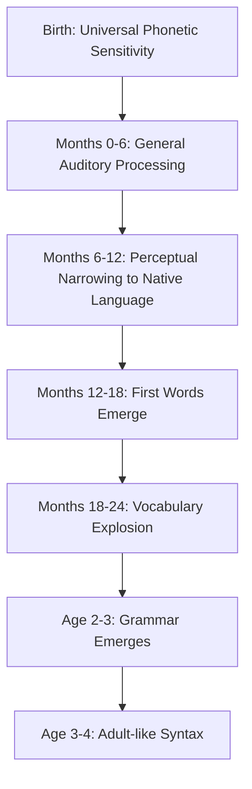

# Stages of Language Acquisition: Universal Developmental Progression

## Introduction

One of the most remarkable facts about human language is that children worldwide acquire their native language following virtually the same sequence of stages, regardless of which language they're learning. From Tokyo to Toronto, from Beijing to Berlin, infants progress through cooing, babbling, one-word utterances, two-word combinations, and eventually master adult-like grammar - all within the first few years of life, without explicit instruction.

This **universality of language development** provides powerful evidence for innate language capacities while also revealing how environmental input shapes linguistic competence. Understanding these stages is crucial for educators, clinicians, and parents, as deviations from typical patterns may signal developmental concerns requiring intervention.

## The Innately Guided Learning Approach

Current understanding of language acquisition reflects a synthesis of nature and nurture perspectives, termed **innately guided learning** (Elman et al., 1996; Jusczyk, 1997). This framework recognizes:

- **Innate endowment**: Children are born with specialized capacities for language learning
- **Environmental modification**: Social interaction and linguistic input shape how these capacities develop
- **Developmental constraints**: Maturation imposes critical periods for optimal language acquisition

### Evidence for Innately Guided Learning

Research demonstrates that acquiring language involves:

1. **Universal starting point**: All infants begin with the capacity to distinguish all phonetic contrasts
2. **Perceptual narrowing**: Over the first year, infants lose sensitivity to non-native contrasts while enhancing native ones
3. **Social scaffolding**: Caregiver-infant interaction provides structured learning opportunities
4. **Statistical learning**: Infants extract patterns from linguistic input automatically

## Stage 1: Cooing (0-4 months)

### Characteristics

**Cooing** is the infant's earliest vocal exploration, consisting primarily of **vowel sounds**:

- Open-mouthed vocalizations: /a/, /e/, /o/, /u/
- Pleasant, melodic quality
- Produced during contentment
- Emerges around 2 months of age

### Universal Nature of Cooing

Remarkably, cooing is **indistinguishable across babies and languages** worldwide:

- Deaf infants coo identically to hearing infants initially
- Babies from all language backgrounds produce the same sounds
- Adults cannot identify a baby's linguistic environment from cooing alone

This universality suggests cooing reflects biological maturation of the vocal apparatus rather than language-specific learning.

### Perceptual Abilities During Cooing Stage

While producing only vowel sounds, infants possess extraordinary perceptual abilities:

- **Categorical perception**: Distinguish all possible phonetic contrasts, even those not in their native language
- **Better discrimination than adults**: Can differentiate sounds adults from that language community cannot (Werker, 1989)
- **Universal phonetic sensitivity**: Not yet specialized for their particular language

**Research Example**: Japanese infants can distinguish /r/ and /l/ sounds (not differentiated in Japanese), but Japanese adults cannot. This ability is lost without exposure.

## Stage 2: Babbling (4-10 months)

### Characteristics

**Babbling** marks the addition of **consonant sounds** to vocal repertoire:

- Consonant-vowel combinations: "ba-ba-ba," "da-da-da," "ma-ma-ma"
- Repetitive syllabic sequences
- Increasing articulatory control
- Emerges around 6 months

### Transition from Universal to Language-Specific

A critical transformation occurs during the babbling stage:

#### For Hearing Infants:
- **Early babbling (6-7 months)**: Similar across all language environments
- **Late babbling (9-10 months)**: Begins reflecting native language phonotactics
- **Phoneme preference**: Increasingly produces sounds characteristic of ambient language
- **Intonation patterns**: Matches prosody of caregivers' speech

#### For Deaf Infants:
- **Stop vocalizing** if not exposed to sign language
- **Manual babbling** if exposed to sign language - producing repetitive hand movements analogous to vocal babbling
- Demonstrates that babbling reflects linguistic capacity, not just motor development

### The Role of Perceptual Narrowing

By 10-12 months, infants undergo **perceptual narrowing**:

- Loss of sensitivity to non-native phonetic contrasts
- Enhanced discrimination of native contrasts
- Specialization for the specific language being learned

**Clinical Insight**: Deaf infants' cessation of babbling by 6 months serves as an early diagnostic indicator of hearing impairment, enabling earlier intervention.

## Stage 3: One-Word Utterances / Holophrases (10-18 months)

### Characteristics

**Holophrases** are single-word utterances that express complete intentions:

- First words appear around 12 months
- Used to convey desires, observations, requests
- Limited phonological repertoire
- By 18 months: typical vocabulary of 3-100 words (Seigler, 1986)

### Phonological Simplification

Early words show systematic simplification patterns:

| Adult Form | Child Form | Process |
|------------|------------|---------|
| "water" | "wawa" | Reduplication |
| "spoon" | "poon" | Cluster reduction |
| "bottle" | "baba" | Unstressed syllable deletion |
| "dog" | "gog" | Consonant substitution |

These patterns are **universal across languages**, suggesting universal phonological development principles.

### Content of Early Vocabulary

Children's first 50 words typically include:

**Objects (Nouns - ~60%)**:
- Familiar people: mama, dada, baby
- Food items: milk, juice, cookie
- Animals: dog, cat, bird
- Body parts: nose, eye, hand
- Toys: ball, book

**Actions (Verbs - ~20%)**:
- More, go, up, bye-bye

**Social Words (~10%)**:
- No, yes, hi, bye

**Modifiers (~10%)**:
- Big, hot, dirty

### Overextension Errors

**Overextension** occurs when children erroneously extend word meanings beyond adult usage:

- **All four-legged animals**: "doggie" applied to horses, cows, sheep
- **Round objects**: "ball" used for oranges, moons, wheels
- **Men**: "dada" extended to all adult males

**Theoretical Interpretation**: Overextension reflects either:
1. **Vocabulary gap hypothesis**: Child lacks appropriate word, uses closest available
2. **Conceptual hypothesis**: Child's semantic categories are broader than adults'
3. **Pragmatic hypothesis**: Child knows distinction but uses familiar word to communicate

Research supports the vocabulary gap hypothesis - children often understand distinctions they don't yet produce.

## Stage 4: Two-Word Utterances and Telegraphic Speech (18-30 months)

### Emergence of Grammar

Between 18-24 months, children begin combining words, marking the onset of **syntax**:

**Early Two-Word Combinations**:
- "Want juice" (Request)
- "Mommy sit" (Description)
- "Doggie bite" (Event report)
- "More cookie" (Recurrence)
- "No bed" (Rejection)

### Telegraphic Speech

**Telegraphic speech** resembles telegram language - conveying meaning with minimal grammatical structure:

**Characteristics**:
- **Omit function words**: Articles (the, a), prepositions (in, on), auxiliaries (is, have)
- **Retain content words**: Nouns, verbs, adjectives
- **Meaningful despite simplicity**: "Daddy car" understood as "Daddy's car" or "Daddy is in the car"

**Example Progression**:
| Age | Child Utterance | Adult Interpretation |
|-----|-----------------|----------------------|
| 18 mo | "Juice" | "I want juice" |
| 20 mo | "Want juice" | "I want juice" |
| 24 mo | "Want more juice" | "I want more juice" |
| 28 mo | "I want more juice" | Approaching adult form |

### Semantic Relations in Two-Word Speech

Despite grammatical simplicity, children express diverse semantic relationships (Brown, 1973):

| Relation | Example | Meaning |
|----------|---------|---------|
| Agent-Action | "Mommy push" | Someone doing something |
| Action-Object | "Push truck" | Action on something |
| Agent-Object | "Mommy truck" | Someone associated with object |
| Possessor-Possessed | "Daddy shoe" | Ownership |
| Entity-Location | "Cup table" | Where something is |
| Attribute-Entity | "Big doggie" | Description |
| Demonstrative-Entity | "That ball" | Pointing out |
| Recurrence | "More milk" | Repetition |

This demonstrates sophisticated conceptual understanding despite limited expressive ability.

## Stage 5: Basic Adult Sentence Structure (24-48 months)

### The Vocabulary Explosion

**Rapid vocabulary growth** characterizes this stage:

- **Age 2**: ~300 words
- **Age 3**: ~1,000 words (more than tripling)
- **Age 4**: ~1,500-2,000 words
- **Age 5**: ~2,500-3,000 words
- **Learning rate**: 6-10 new words per day!

This **vocabulary spurt** reflects:
- **Fast mapping**: Acquiring word meanings from brief exposures
- **Mutual exclusivity assumption**: Each object has one name
- **Whole object assumption**: New words refer to whole objects, not parts or attributes
- **Taxonomic assumption**: Words refer to categories, not thematic associations

### Grammatical Morpheme Acquisition

Children systematically acquire grammatical morphemes in a **predictable order** (Brown, 1973):

**Order of Acquisition** (approximate):
1. Present progressive -ing ("Mommy running")
2. Prepositions in, on
3. Plural -s ("Two dogs")
4. Irregular past tense ("went," "came")
5. Possessive -'s ("Daddy's hat")
6. Uncontracted copula ("This is big")
7. Articles a, the
8. Regular past tense -ed ("walked")
9. Third person singular -s ("She walks")
10. Auxiliary forms ("She is walking")

**Factors Determining Order**:
- **Semantic complexity**: Simpler meanings acquired first
- **Morphological regularity**: Irregular forms learned as whole words early
- **Phonological salience**: More perceptually obvious morphemes learned earlier

### Overgeneralization Errors

As children acquire grammatical rules, they **overgeneralize** them:

**Past Tense**:
- Correct irregular forms first: "came," "went," "ate" (memorized)
- Then overgeneralize regular pattern: "comed," "goed," "eated"
- Eventually master exceptions: "came," "went," "ate" (again)

**U-Shaped Development**: Correct → Incorrect → Correct
- This demonstrates **rule learning**, not mere imitation
- Children extract patterns and apply them productively

### Complex Syntax Emerges

By age 4, children produce:

**Compound Sentences**:
- "I want juice and I want cookie"
- Using "and," "but," "because" to link clauses

**Embedded Clauses**:
- "I think (that) Mommy is coming"
- Subordinate clauses within main sentences

**Questions and Negation**:
- Wh-questions: "What is that?" "Where are we going?"
- Yes-no questions with inversion: "Can I have cookie?"
- Negation: "I don't want to go"

## Stage 6: Refinement and Elaboration (4-10 years)

### Continuing Development

By age 5, children have acquired the **foundations of adult syntax**, but development continues:

**Ages 5-7**:
- Master complex question forms
- Acquire passive voice ("The ball was thrown by John")
- Learn exceptional grammatical constructions

**Ages 7-10**:
- Refine subtle grammatical distinctions
- Expand vocabulary to 10,000+ words
- Develop metalinguistic awareness (ability to think about language itself)
- Master written language conventions

**By Age 10**:
- Language is **fundamentally adult-like**
- Vocabulary continues expanding throughout life
- Pragmatic competence continues developing through adolescence

## Individual Differences and Universal Patterns

### Normal Variation

While the **sequence** of stages is universal, **timing** varies considerably:

- **Early talkers**: First words by 9-10 months
- **Late talkers**: First words delayed to 15-18 months
- **Difference of over one year** is normal

**Important Note**: Late talking doesn't necessarily indicate problems - Einstein famously didn't speak until age 3!

### When to Be Concerned

Red flags requiring evaluation:

| Age | Concern |
|-----|---------|
| 12 months | No babbling or gesturing |
| 18 months | No single words |
| 24 months | Fewer than 50 words; no two-word combinations |
| 36 months | Speech largely unintelligible to strangers |
| 48 months | Persistent grammatical errors |

### Cultural and Environmental Factors

Despite universal stages, input matters:

- **Socioeconomic factors**: Children from higher-income families hear more words and develop larger vocabularies
- **Bilingualism**: May show slightly delayed vocabulary in each language but normal total conceptual vocabulary
- **Child-directed speech**: "Motherese" facilitates but isn't necessary for acquisition
- **Input quantity and quality**: More conversation predicts better language outcomes

## Clinical and Educational Implications

### Assessment

Understanding typical stages enables:
- **Identifying language delays**: Comparing child's progress to milestones
- **Differentiating impairments**: Language disorder vs. speech disorder vs. hearing impairment
- **Monitoring at-risk children**: Premature infants, children with developmental disorders

### Intervention

Stage-based knowledge guides therapy:
- **Targeting age-appropriate structures**: Work at child's current +1 level
- **Following natural order**: Don't skip stages
- **Using child's interests**: Motivation enhances learning

### Educational Applications

Teachers benefit from understanding that:
- **All students passed through these stages**: Helpful for teaching second languages
- **Errors are developmental**: Overgeneralization reflects learning, not failure
- **Literacy builds on oral language**: Phonological awareness from babbling supports reading

## Research Frontiers

### Current Questions

1. **What triggers transitions between stages?** Vocabulary size? Maturation? Input accumulation?
2. **How do bilingual children navigate two systems?** Do they progress through stages simultaneously in both languages?
3. **Can technology enhance acquisition?** Apps vs. human interaction
4. **Individual differences**: Why do some children progress faster?

### Recent Findings (2020-2024)

- **Social learning**: Joint attention more important than previously thought
- **Brain imaging**: Shows specialized language regions active even in infancy
- **Computational models**: Machine learning replicates aspects of child language learning
- **Bilingual advantage**: Enhanced executive function, even in infancy

## Memory Aids

### Mnemonic: "C-BOTH" for Stage Sequence

- **C**ooing (vowels only)
- **B**abbling (consonants added)
- **O**ne-word (holophrases)
- **T**wo-word (telegraphic)
- **H**igh-level (adult-like by age 4)

### Key Numbers to Remember

- **12 months**: First words
- **18 months**: 3-100 words
- **24 months**: Two-word combinations
- **36 months**: 1,000 words
- **48 months**: Adult-like grammar

## Self-Assessment Questions

[Content continues with 6-8 assessment questions as in previous files...]

---

**Source PDFs**: 
- 📄 [Block-3/Unit-1.pdf - Pages 6-8](/pdfs/MPC-001%20Cognitive%20Psychology,%20Learning%20and%20Memory/Block-3/Unit-1.pdf)
- 📚 MPC-001 Cognitive Psychology, Learning and Memory

## External Resources

### Wikipedia Articles
- [Language Acquisition](https://en.wikipedia.org/wiki/Language_acquisition)
- [Babbling](https://en.wikipedia.org/wiki/Babbling)
- [Telegraphic Speech](https://en.wikipedia.org/wiki/Telegraphic_speech)

### Educational Videos
- [Patricia Kuhl: The Linguistic Genius of Babies](https://www.ted.com/talks/patricia_kuhl_the_linguistic_genius_of_babies)
- [Language Development in Children](https://www.youtube.com/watch?v=9SEKkkJ6PB8)

### Research Articles
- Kuhl, P. K., et al. (2003). Foreign-language experience in infancy. *Science*, 302(5644), 606-608.
- Werker, J. F., & Tees, R. C. (1984). Cross-language speech perception. *Infant Behavior and Development*, 7(1), 49-63.
