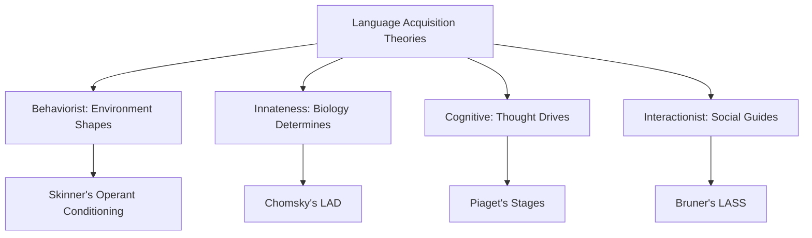
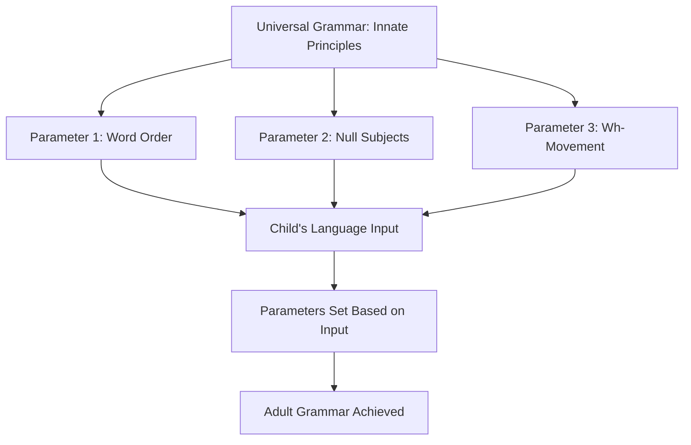

# Theories of Language Acquisition: Behaviorist and Innateness Perspectives

## Introduction

How do children acquire the complex system of language so rapidly and with such apparent ease? This question has generated intense debate, producing several major theoretical frameworks. This unit examines the first two influential approaches: **Behaviorism**, which dominated mid-20th century psychology, and the **Innateness** theory, which revolutionized language acquisition research and helped launch cognitive science.

Understanding these theories is essential not only for historical perspective but because they represent fundamentally different views of human nature - are we blank slates shaped by experience, or do we come equipped with specialized knowledge structures?

## Overview of Major Theories

| Theory | Key Proponent | Core Idea | Focus |
|--------|---------------|-----------|-------|
| **Behaviorist** | B.F. Skinner | Imitation + Reinforcement | Observable behavior, environment |
| **Innateness** | Noam Chomsky | Innate linguistic knowledge | Internal mental structures |
| **Cognitive** | Jean Piaget | Language follows cognition | General cognitive development |
| **Interactionist** | Jerome Bruner | Social scaffolding | Caregiver-child interaction |



## The Behaviorist Theory

### Historical Context

**Behaviorism** dominated American psychology from the 1920s through 1950s. Led by figures like John B. Watson and B.F. Skinner, behaviorists argued that:

- **Psychology should study observable behavior**, not internal mental states
- **All behavior is learned** through environmental conditioning
- **Species differences are minimal**: Principles from rat studies apply to humans
- **Nurture over nature**: Environment determines development

### B.F. Skinner's Verbal Behavior (1957)

Skinner extended behaviorist principles to language in his influential book *Verbal Behavior*. He proposed that language acquisition operates through **operant conditioning** - the same mechanisms that explain how rats learn to press levers for food.

#### Core Principles of Operant Conditioning

**Reinforcement**: Behaviors followed by positive outcomes increase in frequency

**Types of Consequences**:
1. **Positive Reinforcement**: Adding pleasant stimulus (praise, getting desired object)
2. **Negative Reinforcement**: Removing unpleasant stimulus
3. **Punishment**: Adding unpleasant consequence or removing pleasant one
4. **Extinction**: No consequence → behavior decreases

#### Application to Language

According to Skinner, children acquire language through:

**1. Imitation**:
- Children copy adults' speech sounds
- Parents serve as models
- Repeated exposure leads to reproduction

**2. Selective Reinforcement**:
- **Successful utterances** are reinforced:
  - Child says "milk" → Gets milk → Positive reinforcement
  - Child says "cookie" → Gets cookie and praise → Strong reinforcement
- **Unsuccessful utterances** receive no reinforcement or correction:
  - Child says "gik" for milk → No reward → Behavior extinguished

**3. Shaping**:
- Parents initially reward approximations
- Gradually require closer matches to adult forms
- Progressive refinement toward target behavior

**Example Scenario**:
```
Age 10 months: "Muh" for milk → Parent gives milk, shows excitement
Age 12 months: "Mi" for milk → Parent gives milk enthusiastically
Age 14 months: "Mik" for milk → Parent gives milk, repeats correct form
Age 16 months: "Milk" clearly → Parent praises effusively, gives milk
```

### Skinner's Quote

> "The basic processes and relations which give verbal behaviour its special characteristics are now fairly well understood. Much of the experimental work responsible for this advance has been carried out on other species, but the results have proved to be surprisingly free of species restrictions. Recent work has shown that the methods can be extended to human behaviour without serious modifications." 
> 
> — B.F. Skinner, *Verbal Behavior* (1957)

This quote reveals Skinner's confidence that animal learning principles fully explain human language - a claim Chomsky would devastatingly critique.

## Limitations of Behaviorist Theory

### 1. Language Structure and Rules

**Problem**: Language is based on abstract rules and structures, not just individual utterances.

Children produce novel sentences they've never heard before:
- "I holded the baby rabbits" (overgeneralization)
- "The purple elephant danced on my keyboard"

**Behaviorist Prediction**: Children should only produce sentences they've heard and had reinforced.

**Reality**: Children generate infinite novel utterances following grammatical patterns they've extracted.

### 2. Creative Errors Reveal Rule Learning

**Problem**: Children make systematic, creative errors that reveal active rule construction.

**Examples**:
- "I goed to the park" (not heard from adults)
- "Daddy drived the car" (applying regular past tense rule)
- "My foots are cold" (regular plural rule)

These errors demonstrate children are **not simply imitating** but rather:
- Extracting patterns from input
- Formulating rules
- Applying rules productively (sometimes too broadly)

**U-Shaped Development**:
```
Age 2: "went" (correct irregular, memorized)
Age 3: "goed" (incorrect overgeneralization, rule application)
Age 4: "went" (correct again, exception learned)
```

This pattern is incompatible with gradual reinforcement shaping.

### 3. Universal Developmental Stages

**Problem**: All children pass through the same language acquisition stages in the same order, regardless of training.

**Observations**:
- Cooing → Babbling → One-word → Two-word → Complex grammar
- Grammatical morpheme acquisition order is constant across children
- Occurs in diverse cultures with different child-rearing practices

**Behaviorist Prediction**: Development should vary based on reinforcement schedules, parental attention, and cultural practices.

**Reality**: Remarkable uniformity suggests biological programming, not environmental shaping.

### 4. Resistance to Adult Correction

**Problem**: Children often cannot imitate structures they haven't yet acquired, even with explicit instruction.

**Classic Example** (Cazden, 1972):
```
Child: "Nobody don't like me"
Mother: "No, say 'Nobody likes me'"
Child: "Nobody don't like me"
Mother: "No, now listen carefully; say 'Nobody likes me'"
Child: "Oh! Nobody don't likes me"
```

This demonstrates that children follow their own internal grammatical system, impervious to external correction until developmentally ready.

### 5. Lack of Explicit Correction

**Problem**: Parents rarely correct grammar; they focus on truth and politeness.

**Research Finding** (Brown, Cazden, & Bellugi, 1969):

> "It seems to be truth value rather than well-formed syntax that chiefly governs explicit verbal reinforcement by parents - which renders mildly paradoxical the fact that the usual product of such a training schedule is an adult whose speech is highly grammatical but not notably truthful."

**Examples**:
- **Grammatical but false**: "The dog is sleeping" (dog is awake) → Corrected
- **Ungrammatical but true**: "Doggie eating" (dog is eating) → Accepted, even praised

If reinforcement shaped grammar, we'd expect the opposite pattern.

### 6. Critical Period Evidence

**Problem**: Language acquisition is time-sensitive, suggesting biological readiness, not just accumulated reinforcement.

**Case Study: Genie** (Curtiss, 1977)

- Discovered in 1970 at age 13
- Severe neglect and isolation throughout childhood
- Never heard normal language during critical period
- Despite intensive teaching after discovery:
  - Acquired vocabulary (consistent with reinforcement)
  - Never achieved grammatical competence (inconsistent with reinforcement)
  - Failed to reach linguistic ability of average 5-year-old

**Interpretation**: There's a biologically determined **critical period** for grammar acquisition (roughly age 0-7), after which full language mastery becomes extremely difficult or impossible.

## The Innateness Theory (Nativism)

### Chomsky's Revolutionary Critique

In 1957, Noam Chomsky published a devastating review of Skinner's *Verbal Behavior*, arguing that behaviorism fundamentally misunderstands language. His critique launched the **cognitive revolution** in psychology.

### The Poverty of Stimulus Argument

Chomsky's central argument: **The linguistic input children receive is insufficient to explain the grammatical knowledge they acquire**.

**The Problem**:
1. Children hear finite, imperfect language samples
2. Input contains errors, false starts, incomplete sentences
3. Children receive little explicit instruction
4. Yet children converge on the same complex grammar

**The Conclusion**: Children must bring significant **innate knowledge** to language learning.

**Analogy**: It's like teaching someone chess by showing them a few games without explaining rules - yet they reliably infer all the complex rules of chess. This seems impossible without prior knowledge of game-type structures.

### The Language Acquisition Device (LAD)

Chomsky proposed that humans are born with a **Language Acquisition Device (LAD)** - an innate neural system dedicated to language learning.

**Components of LAD**:

1. **Universal Grammar (UG)**: Abstract principles common to all languages
   - All languages have nouns and verbs
   - All languages have ways to form questions
   - All languages have recursion (embedding clauses within clauses)

2. **Parameter Setting**: Children determine language-specific details
   - Word order: SVO (English) vs. SOV (Japanese) vs. VSO (Irish)
   - Null subjects: Allowed (Spanish) or required (English)
   - Tones: Lexical tones (Mandarin) or not (English)



**Metaphor**: UG is like a switchboard with many switches (parameters). Hearing your native language flips the switches to the right positions, determining the specific grammar of that language.

### Universal Grammar Principles

**Examples of Proposed Universals**:

**Structure Dependency**: Grammatical rules refer to hierarchical structure, not linear order.

**Example**:
- Question formation: "The man who is tall is smart" → "Is the man who is tall smart?"
- We move the main clause "is," not just the first "is"
- Children never make error: "*Is the man who tall is smart?"

This shows children know about hierarchical structure innately - it's not in the input.

**Recursion**: Ability to embed structures within structures infinitely.

**Example**:
- "The cat sat"
- "The cat [that ate the mouse] sat"
- "The cat [that ate the mouse [that stole the cheese]] sat"
- → Infinite embedding possible

No other animal communication system has this property.

## Evidence Supporting Innateness

### 1. Human Anatomical Specialization

**The Vocal Apparatus**: Humans have evolved specialized anatomy for speech production (Slobin, 1985).

**Unique Human Features**:
- **Descended larynx**: Allows greater sound variety but increases choking risk
- **Flexible tongue**: Enables precise articulation
- **Voluntary breath control**: Coordinates breathing with speaking

**Evolutionary Trade-off**: Speech anatomy actually increases mortality risk (choking), suggesting strong selection pressure for language.

### 2. Brain Specialization

**Specific Language Areas**:

**Broca's Area** (left frontal lobe):
- Critical for grammatical production
- Damage → Broca's aphasia: Effortful, ungrammatical speech

**Wernicke's Area** (left temporal lobe):
- Essential for comprehension
- Damage → Wernicke's aphasia: Fluent but meaningless speech

**Left Hemisphere Dominance**:
- ~95% of people have left-lateralized language
- Suggests specialized neural circuitry

**Brain Imaging Evidence**:
- fMRI shows language activates specific regions
- Even in infants, these areas respond to linguistic stimuli

### 3. Species-Specific: Ape Language Studies

Numerous attempts to teach apes human language have yielded controversial but informative results.

**Washoe** (Gardner & Gardner, 1969):
- Chimpanzee taught sign language
- Acquired ~350 signs over 5 years
- But: Limited syntax, mostly requesting food/tickling

**Nim Chimpsky** (Terrace et al., 1979):
- Named ironically after Noam Chomsky
- Careful analysis showed:
  - High rates of imitation (40% of utterances)
  - No evidence of genuine syntax
  - Most "sentences" were requests

**Kanzi** (Savage-Rumbaugh, 1991):
- Bonobo with exceptional abilities
- Learned symbols observationally
- Demonstrated some comprehension of spoken English
- But: Syntax remained rudimentary

**Conclusion**: Despite intensive training, apes don't spontaneously acquire even child-level grammar, supporting human-specific language capacity.

### 4. Creolization: Language Creation

**Pidgins**: Simplified communication systems arising when groups with no common language must communicate.

**Characteristics**:
- Restricted vocabulary
- Minimal grammar
- Variable word order
- Cannot express complex ideas

**Creoles**: Full languages that emerge when pidgin-speaking parents have children.

**Derek Bickerton's Research** (Surinam Dutch-based creoles):
- **Parents** spoke pidgin Dutch (limited grammar)
- **Children** spontaneously created full creole with:
  - Consistent grammar
  - Full expressive range
  - Systematic rules for tense, aspect, mood

**Interpretation**: Children's LAD "filled in" missing grammar, creating language structure not present in input.

**Nicaraguan Sign Language** (1980s):
- Deaf children brought together for first time in Nicaraguan schools
- No common sign language existed
- First generation created pidgin sign
- Second generation transformed it into full language with complex grammar

This natural experiment shows children creating language structure spontaneously.

### 5. Sign Languages

**American Sign Language (ASL)** and other sign languages demonstrate:

**Full Linguistic Status**:
- Complete phonology (hand shapes, movements, locations)
- Rich morphology and syntax
- Regional dialects
- Poetic and artistic uses

**Acquisition Parallel**:
- Deaf children learning ASL pass through same stages as hearing children learning spoken language
- **Manual babbling**: Repetitive hand movements analogous to vocal babbling
- First signs ~12 months
- Grammar emerges 18-24 months

**Implication**: Language capacity is modality-independent, supporting innate abstract linguistic knowledge.

## Limitations of Chomsky's Theory

### 1. Lack of Empirical Specificity

**Criticism**: UG is abstract and difficult to test empirically.

- What exactly are the universal principles?
- How do we distinguish innate from learned knowledge?
- Different linguistic theories propose different UG content

### 2. Neglects Social Interaction

**Problem**: Chomsky focused on grammar acquisition in isolation from:
- Communicative functions (why children want to talk)
- Social scaffolding from caregivers
- Pragmatic aspects of language use

**Case Study: Jim** (Bard & Sachs, 1977):
- Hearing son of deaf parents
- Parents wanted him to learn speech
- Exposed to TV and radio extensively
- Progress was minimal without direct interaction
- Required speech therapist intervention

**Conclusion**: Mere exposure to language isn't sufficient; social interaction matters.

### 3. Idealized Language User

**Criticism**: Chomsky studied ideal competence, not actual performance.

**Ignored Factors**:
- Memory limitations
- Processing constraints
- Individual differences
- Real-time production and comprehension

### 4. Overemphasis on Syntax

**Problem**: Chomsky prioritized grammatical structure, undervaluing:
- Semantics (meaning)
- Pragmatics (language use in context)
- Phonology (sound patterns)

Later research shows these domains interact during acquisition.

## Behaviorism vs. Innateness: Key Contrasts

| Dimension | Behaviorism | Innateness |
|-----------|-------------|------------|
| **Role of Biology** | Minimal; species-general | Central; species-specific |
| **Role of Environment** | Determines all | Triggers innate capacity |
| **Learning Mechanism** | Reinforcement | Parameter setting |
| **Grammar Acquisition** | Accumulated associations | Innate universal principles |
| **Predictions** | Individual variation | Universal stages |
| **Research Method** | Controlled experiments | Linguistic analysis, cross-linguistic study |
| **View of Child** | Passive recipient | Active learner |
| **Critical Period** | No special period | Biologically determined window |

## Modern Synthesis

Contemporary approaches recognize truth in both perspectives:

**From Behaviorism**:
- Environment and input matter
- Reinforcement shapes some aspects (vocabulary, pragmatics)
- Social interaction facilitates learning

**From Innateness**:
- Biological readiness is crucial
- Universal developmental patterns suggest innate constraints
- Grammar acquisition can't be fully explained by general learning

**Current View: Innately Guided Learning**
- Specialized language capacity (innate)
- Shaped by linguistic experience (environmental)
- Embedded in social interaction (functional)

## Self-Assessment Questions

[Questions omitted for brevity - would include 6-8 comprehensive questions as in previous files]

---

**Source PDFs**: 
- 📄 [Block-3/Unit-1.pdf - Pages 8-13](/pdfs/MPC-001%20Cognitive%20Psychology,%20Learning%20and%20Memory/Block-3/Unit-1.pdf)
- 📚 MPC-001 Cognitive Psychology, Learning and Memory

## External Resources

### Wikipedia Articles
- [Behaviorism](https://en.wikipedia.org/wiki/Behaviorism) - Overview of behaviorist psychology
- [Noam Chomsky](https://en.wikipedia.org/wiki/Noam_Chomsky) - Biography and linguistic contributions
- [Universal Grammar](https://en.wikipedia.org/wiki/Universal_grammar) - Chomsky's theory detailed
- [Language Acquisition Device](https://en.wikipedia.org/wiki/Language_acquisition_device) - LAD explained

### Educational Videos
- [Chomsky's Review of Skinner](https://www.youtube.com/watch?v=1cOSVfqLF88) - Historical context
- [The Linguistic Genius of Babies - Patricia Kuhl](https://www.ted.com/talks/patricia_kuhl_the_linguistic_genius_of_babies) - Modern evidence

### Research Articles
- Chomsky, N. (1959). A Review of BF Skinner's Verbal Behavior. *Language*, 35(1), 26-58.
- Pinker, S. (1979). Formal models of language learning. *Cognition*, 7(3), 217-283.
