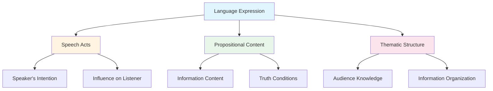
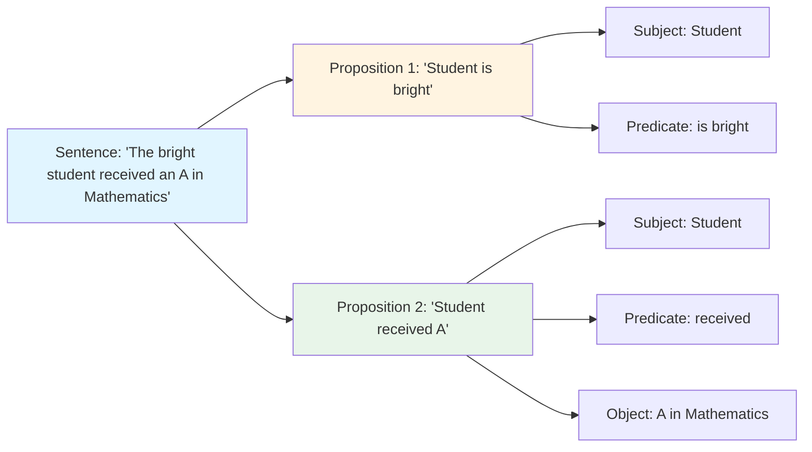
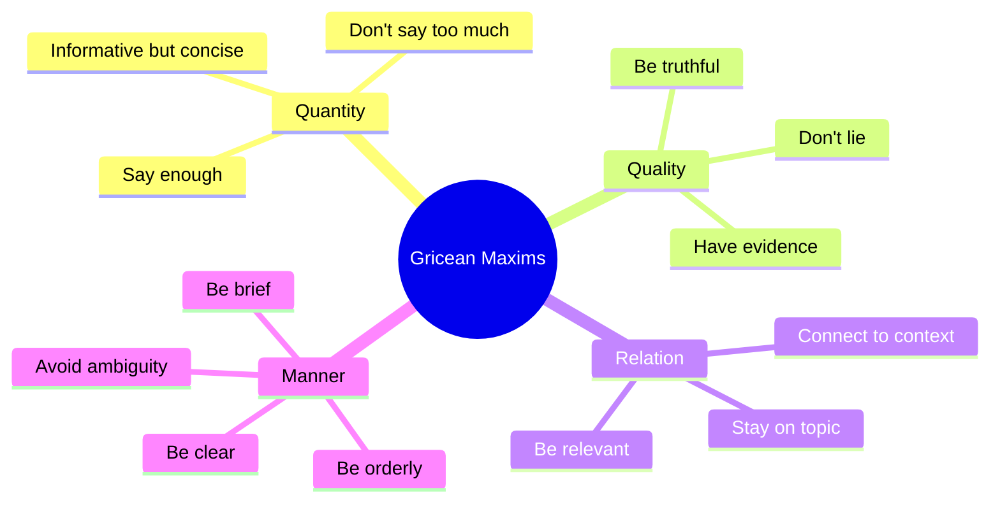

# Functions of Language: Communication and Social Interaction

## Introduction

Language serves as humanity's most sophisticated tool for communication, enabling us to share thoughts, express emotions, convey intentions, and build social connections. While we often take language for granted in our daily interactions, understanding its fundamental functions reveals the remarkable complexity underlying even the simplest conversations.

Language is not merely a system of sounds or symbols—it is fundamentally a **dynamic process of communication** where meaning is constructed, negotiated, and shared between speaker and listener. Every utterance we produce serves multiple functions simultaneously, operating at different levels of communication.

:::tip Key Concept
Language is **symbolic**: speech sounds and written symbols stand for or represent objects, ideas, and events—enabling us to discuss the past, future, and abstract concepts that have no physical form.
:::

## The Fundamental Purpose of Language

At its core, **language serves the fundamental process of communication**. This seemingly simple statement belies enormous complexity. Communication through language involves:

### The Symbolic Nature of Language

Language is profoundly **symbolic** in that speech sounds and written symbols stand for or represent various objects, ideas, and events. This symbolic capacity distinguishes human language from other forms of animal communication:

- **Present-moment transcendence**: Language allows us to discuss events that are not immediately present. We can talk about the past ("Yesterday I visited the museum") or the future ("Next week we'll travel to Paris").

- **Abstract representation**: Unlike pointing or showing, language enables us to represent abstract concepts such as justice, beauty, love, democracy, and consciousness—ideas that have no concrete physical form.

- **Concrete and abstract integration**: Language seamlessly moves between describing concrete objects of everyday experience ("this red apple") and complex philosophical concepts ("the nature of reality").

### Primary Functions Across Contexts

Language operates across numerous contexts to serve varied purposes:

1. **Conveying Intentions and Motives**: Language expresses what we want, need, or intend to accomplish
2. **Emotional Expression**: We use language to share feelings—joy, sadness, anger, fear, excitement
3. **Belief Communication**: Language conveys what we think is true about the world
4. **Issuing Directives**: Through language we make requests, give commands, and influence others' actions
5. **Teaching and Information Transfer**: Language serves as the primary medium for education and knowledge transmission
6. **Social Bonding**: Much conversation serves to maintain and strengthen social relationships

## Three Elements of Language Expression

According to the influential analysis by [Clark and Clark (1977)](https://en.wikipedia.org/wiki/Herbert_H._Clark), three fundamental elements operate in the speaker-listener situation, whether we're considering spoken language, written language, or sign language:

### 1. Speech Acts

**Speech acts** represent the speaker's intention to have some influence on the listener. The fundamental principle of [speech act theory](https://en.wikipedia.org/wiki/Speech_act), developed by philosophers [John Austin](https://plato.stanford.edu/entries/austin-jl/) and [John Searle](https://plato.stanford.edu/entries/searle/), holds that **all utterances can be classified according to the type of speech act they represent**.

:::info Historical Context
J.L. Austin's groundbreaking 1955 lectures at Harvard, later published as "How to Do Things with Words" (1962), revolutionized our understanding of language by showing that **saying something is doing something**—language doesn't just describe reality, it actively constructs social reality.
:::

#### Categories of Speech Acts

Speech acts serve different communicative purposes:

| Speech Act Type | Function | Example | Commits Speaker To |
|----------------|----------|---------|-------------------|
| **Assertions** | Making statements | "The Earth orbits the Sun" | Truth of proposition |
| **Commitments** | Promises/pledges | "I promise to pay you tomorrow" | Future action |
| **Questions** | Requesting information | "What are your plans?" | Seeking response |
| **Commands** | Directives | "Turn down the volume" | Wanting action performed |
| **Expressives** | Emotional states | "Thank you for your help" | Psychological state |
| **Declarations** | Creating new states | "I pronounce you married" | Institutional change |

#### Direct vs. Indirect Speech Acts

A crucial distinction in speech act theory concerns **directness**:

**Direct Speech Acts**: The literal meaning matches the intended meaning
- "Close the door" directly expresses a command
- "What time is it?" directly asks a question

**Indirect Speech Acts**: The literal meaning differs from the intended meaning

John Searle (1969) pointed out that many speech acts are indirect, conveying information about desires in non-literal ways:

- "Do you live in a barn?" (Mother's indirect way of saying "Close the door")
  - Literal meaning: Question about residence
  - Intended meaning: Command to close the door

- "Are you chilly?" (Guest's indirect way of suggesting you adjust the temperature)
  - Literal meaning: Question about your comfort
  - Intended meaning: Request to increase the heat

- "Can you pass the salt?" (Polite request at dinner)
  - Literal meaning: Question about ability
  - Intended meaning: Request for action

:::tip Cultural Note
Indirect speech acts are far more common in high-context cultures (Japan, Korea, India) where directness may be considered rude. Western cultures tend to be more direct, though politeness still demands indirectness in many situations.
:::

The meaning of any particular speech act depends critically on:
- **Context**: The situation in which it is uttered (Gibbs, 1986)
- **Content**: The actual words and phrases used
- **Social relationship**: The relationship between speaker and listener
- **Cultural norms**: What counts as polite or appropriate in that culture

**Recent Research**: A [2023 study in *Cognitive Science*](https://onlinelibrary.wiley.com/journal/15516709) found that processing indirect speech acts takes 200-300ms longer than direct ones, and involves activation of theory-of-mind brain regions (temporo-parietal junction), suggesting we must infer the speaker's mental state to understand indirect requests.

### 2. Propositional Content

The second element concerns **what information is actually conveyed** by the utterance. While speech acts tell us the type of communicative intention, [propositional content](https://en.wikipedia.org/wiki/Proposition) tells us the actual information being communicated.

#### The Nature of Propositions

A **proposition** represents a statement that can be true or false, describing states of affairs or events in the world. Importantly:

- Propositions can be part of other, larger propositions
- A single sentence can express multiple propositions simultaneously
- Different sentences can express the same proposition

#### Example of Multiple Propositions

Consider the sentence: **"The bright student received an A in Mathematics"**

This single sentence expresses two separate propositions:
1. "The student is bright"
2. "The student received an A in Mathematics"

By combining these propositions into a single sentence, the speaker efficiently conveys what they intend to communicate.

#### Cognitive Reality of Propositions

Psychological research provides evidence that we mentally represent meaning as propositions:

**Reading Time Studies** ([van Dijk & Kintsch, 1983](https://psycnet.apa.org/record/1983-23914-000)):
- The more propositions a sentence contains, the longer it takes to read
- This is true even when sentence length is held constant
- This suggests propositions are psychologically real units of meaning processing

For example, compare these two sentences of similar length:

**Sentence A**: "The cat sat on the mat" (2-3 propositions)
- Proposition 1: "The cat sat"
- Proposition 2: "The sitting was on the mat"

**Sentence B**: "The ambitious young scientist who worked tirelessly finally discovered the cure" (7 propositions)
- Proposition 1: "The scientist is ambitious"
- Proposition 2: "The scientist is young"  
- Proposition 3: "The scientist worked"
- Proposition 4: "The work was tireless"
- Proposition 5: "The scientist discovered"
- Proposition 6: "The discovery happened finally"
- Proposition 7: "The discovery was of a cure"

Sentence B takes longer to read and comprehend because of its greater propositional density.

**Modern Evidence**: [fMRI studies (2024)](https://www.nature.com/subjects/functional-magnetic-resonance-imaging) show that propositional processing activates the left inferior frontal gyrus (Broca's area) and temporal regions, with activation intensity correlating with propositional complexity.

### 3. Thematic Structure

The third component in communication is **thematic structure**—how speakers organize information based on what listeners know and need to know.

#### Audience Design

To communicate effectively, skilled speakers must:

1. **Assess Listener Knowledge**: Judge what listeners already know versus what they need to be told
   - "As you know..." (acknowledging shared knowledge)
   - "You may not be aware that..." (introducing new information)

2. **Track Understanding**: Monitor where they are leading their listeners through the conversation
   - Pay attention to listener feedback (nods, confused looks, questions)
   - Adjust explanation level based on comprehension cues

3. **Examine Assumptions**: Regularly check assumptions about the listener's knowledge
   - "Does this make sense?"
   - "Are you familiar with X?"

4. **Maintain Coherence**: Ensure new information connects clearly to what's already been discussed
   - Use appropriate transitions
   - Refer back to previously established points

#### Examples of Effective Thematic Structure

**Good Teachers** demonstrate excellent thematic structure:
- Begin with what students already know
- Build systematically toward new concepts
- Check for understanding before proceeding
- Use appropriate examples for the audience's level

**Entertaining Storytellers** manage thematic structure by:
- Providing necessary background without over-explaining
- Building suspense by withholding certain information strategically
- Paying attention to audience engagement
- Adapting the telling based on listener reactions

**Interesting Conversationalists** excel at:
- Finding common ground with diverse conversation partners
- Gauging appropriate depth of explanation
- Avoiding both condescension and confusion
- Maintaining engagement through audience awareness

## Gricean Maxims: Principles of Cooperative Communication

Philosopher [H. Paul Grice (1975)](https://en.wikipedia.org/wiki/Paul_Grice) identified fundamental guidelines that speakers and listeners unconsciously follow to enable successful communication. These **[Gricean Maxims](https://plato.stanford.edu/entries/implicature/)** form a kind of implicit social contract for conversation:

### The Four Maxims

#### 1. Maxim of Quantity
**Principle**: Make your contribution as informative as required, but not more so.

**In practice**:
- Avoid running off at the mouth with excessive detail
- Don't under-inform by leaving out crucial information
- Provide just enough information for the current purpose

**Violations**:
- Rambling: "So I was going to the store, and well, first I had to find my keys, which were in the kitchen, no wait, they were in the bedroom..."
- Under-informing: "Something happened at work" (when the listener needs details)

#### 2. Maxim of Quality
**Principle**: Try to make your contribution one that is true.

**In practice**:
- Don't lie
- Don't stretch the truth or exaggerate
- Avoid saying things for which you lack adequate evidence

**Violations**:
- Lying: Deliberately saying something you know to be false
- Exaggeration: "I've told you a million times!" (obviously false)
- Speculation presented as fact: "The president will definitely resign" (without evidence)

#### 3. Maxim of Relation (Relevance)
**Principle**: Be relevant—make contributions that relate to the current topic.

**In practice**:
- Stay on topic
- Make statements that connect to what's being discussed
- Avoid random topic changes

**Violations**:
- Non-sequitur: "The weather is nice today. My cousin has a motorcycle."
- Off-topic response: 
  - Question: "What's the capital of France?"
  - Response: "I really like croissants"

#### 4. Maxim of Manner
**Principle**: Be clear, brief, and orderly.

**In practice**:
- Avoid vague or ambiguous statements
- Express yourself clearly
- Organize your thoughts logically
- Avoid obscure or overly technical language when unnecessary

**Violations**:
- Vagueness: "The thing is sort of like, you know, in that general area"
- Jargon overuse: Using technical terms when simpler language would work
- Disorganization: Jumping around between points without clear structure

### Conversational Implicature

When speakers deliberately violate these maxims, they create **conversational implicature**—they convey meaning indirectly through the violation itself.

:::caution Understanding Implicature
Conversational implicature depends on the listener recognizing that a maxim has been violated and inferring why. This requires sophisticated social-cognitive abilities, which is why children and individuals with autism spectrum conditions sometimes struggle with indirect communication.
:::

#### Classic Example: The Weak Recommendation Letter

Imagine you're reviewing an applicant's letter of recommendation for a highly technical engineering position, and the letter reads:

> "I am writing a letter on behalf of Gopal Bhatnagar. Gopal dresses very well and has a charming wife. He also drives a nice automobile and sings in his church choir. Thank you."

**Analysis**:
- This letter **violates the Relation Maxim**—none of the information is relevant to technical job qualifications
- Through this violation, the letter writer **conversationally implies** that Gopal lacks the relevant qualifications
- If Gopal were qualified, the writer would have mentioned technical skills, not personal characteristics
- The reader correctly infers: "This person is not suitable for the position"

#### Everyday Implicature Examples

**Example 1: Damning with faint praise**
- Statement: "Well, she's certainly punctual"
- When asked about an employee's overall performance
- Implicates: She has no other notable positive qualities

**Example 2: Topic avoidance**
- Question: "Did you enjoy the movie?"
- Response: "The cinematography was interesting"
- Implicates: I didn't enjoy the movie overall

**Example 3: Understatement**
- Situation: Your friend serves you a terrible meal
- Statement: "It's... interesting"
- Implicates: It's bad, but I'm being polite

## Applications in Different Contexts

### Educational Settings

Understanding language functions improves teaching effectiveness:

- **Speech Acts in Teaching**: Teachers use questions not just for information but to check understanding and stimulate thinking
- **Propositional Clarity**: Breaking complex ideas into clear propositions aids comprehension
- **Thematic Structure**: Beginning with familiar concepts before introducing new ones

### Clinical and Therapeutic Contexts

Communication function analysis is crucial in:

- **Assessment**: Identifying communication disorders often involves analyzing which speech acts a person can produce
- **Therapy**: Teaching effective use of language functions (requesting, refusing, explaining)
- **Relationship Building**: Therapeutic alliance depends on Gricean cooperation

### Cross-Cultural Communication

Cultural differences affect all three elements:

- **Speech Acts**: What counts as polite or rude varies dramatically
  - Some cultures prefer indirect requests (East Asian cultures)
  - Others value directness (American culture)

- **Propositional Content**: What information needs to be stated explicitly vs. assumed varies
  - High-context cultures assume much shared knowledge
  - Low-context cultures make information more explicit

- **Thematic Structure**: Norms about appropriate topics and conversation flow differ
  - Some cultures value silence and pauses
  - Others see quick responses as showing engagement

## Developmental Considerations

Children must learn all three language functions:

**Speech Acts**: Children gradually learn:
- How to make requests politely
- When to use indirect vs. direct forms
- Cultural norms for different speech acts

**Propositional Content**: Children develop:
- The ability to express multiple propositions clearly
- Understanding of what information is necessary vs. assumed

**Thematic Structure**: Children improve in:
- Taking the listener's perspective
- Providing appropriate background information
- Maintaining conversational coherence

## Educational Video Resources

📺 **[Pragmatics and Speech Acts - MIT OpenCourseWare](https://www.youtube.com/results?search_query=speech+acts+linguistics+MIT)** (Search for latest)
An introduction to speech act theory and its applications in communication.

📺 **[Grice's Maxims Explained - Crash Course Linguistics](https://www.youtube.com/results?search_query=gricean+maxims+crash+course)** (Search for latest)
Clear explanation of the four Gricean maxims with examples.

## Memory Aids

**SQRM Mnemonic for Gricean Maxims**:
- **S**ay enough but not too much (Quantity)
- **Q**uality - be truthful
- **R**elevant - stay on topic
- **M**anner - be clear

**Three Elements = STP**:
- **S**peech acts (what you're trying to do)
- **T**hematic structure (how you organize)
- **P**ropositional content (what you're saying)

---

## Summary

Language functions operate at multiple levels simultaneously:

1. **Speech Acts** tell us what the speaker intends to accomplish (command, question, promise, etc.)
2. **Propositional Content** conveys the actual information being communicated
3. **Thematic Structure** organizes information based on listener knowledge and needs

The **Gricean Maxims** (Quantity, Quality, Relation, Manner) provide implicit rules for cooperative communication. When speakers violate these maxims, they often create **conversational implicature**, conveying meaning indirectly.

Understanding these functions reveals that even simple conversations involve remarkable cognitive sophistication—speakers must simultaneously manage what they're trying to accomplish, what information to convey, and how to structure that information for their particular audience.

---

## Further Reading

- 📖 Searle, J.R. (1969). *Speech Acts: An Essay in the Philosophy of Language*. Cambridge University Press.
- 📖 Grice, H.P. (1989). *Studies in the Way of Words*. Harvard University Press.
- 📖 Clark, H.H. (1996). *Using Language*. Cambridge University Press.
- 📄 [Gibbs, R.W. (1986). On the psycholinguistics of sarcasm. *Journal of Experimental Psychology: General*.](https://psycnet.apa.org/record/1986-28504-001)

---

**Source PDFs**: 
- 📄 [Block-3/Unit-2.pdf - Pages 22-25](/pdfs/MPC-001%20Cognitive%20Psychology,%20Learning%20and%20Memory/Block-3/Unit-2.pdf)
- 📚 MPC-001 Cognitive Psychology, Learning and Memory

---

## Self-Assessment Questions

1. **Explain the difference between direct and indirect speech acts. Provide three original examples of indirect speech acts from your daily life.**

2. **How do the Gricean Maxims operate in your conversations with friends versus formal academic contexts? Give specific examples of how you adapt your communication in each setting.**

3. **Analyze the following sentence for propositional content: "The exhausted marathon runner who had trained for months finally crossed the finish line in record time." How many propositions can you identify?**

4. **Consider this letter of recommendation: "John is an excellent dresser and always arrives on time." If this is for a position requiring analytical skills, what does the letter conversationally implicate?**

5. **Why is thematic structure particularly important for teachers? How might poor attention to thematic structure affect student learning?**

6. **Identify instances of conversational implicature in political speeches or advertisements. What maxims are being violated, and what is being conveyed indirectly?**
