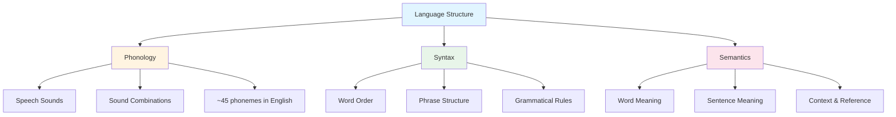
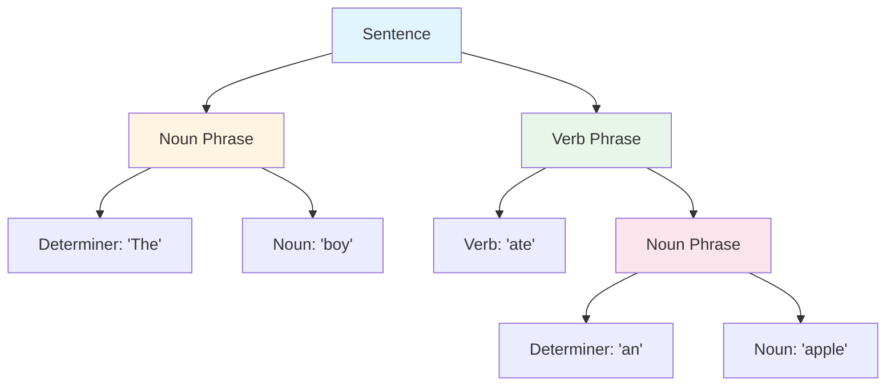
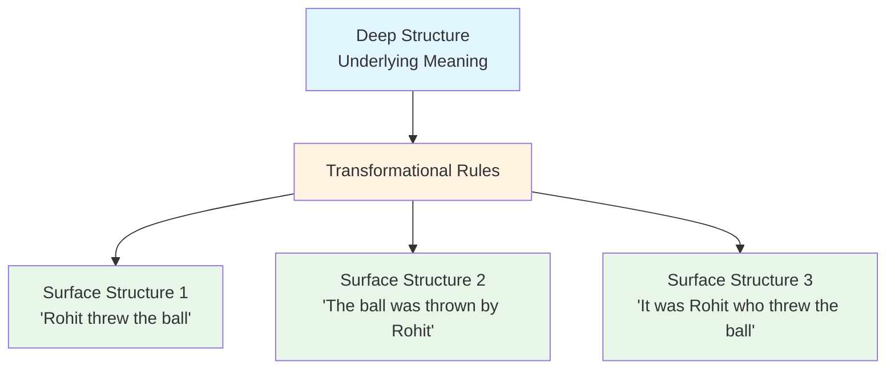

# Structure of Language: Phonology, Syntax, and Semantics

## Introduction

To understand how we produce and comprehend language requires examining its underlying **structure**—the systematic organization of sounds, words, and meanings that enables human communication. Language is not a random collection of sounds and symbols but rather a highly organized hierarchical system with rules operating at multiple levels.

Think about what happens when you understand a sentence. You must first recognize individual speech sounds, group them into meaningful units, organize words into phrases, and finally extract the intended meaning. This multi-level processing happens so rapidly and automatically that we're rarely aware of the complexity involved.

:::tip Key Insight
Language structure operates hierarchically: **phonemes** → **morphemes** → **words** → **phrases** → **sentences** → **discourse**. Each level has its own organizational principles and rules.
:::

## The Three Pillars of Language Structure

Language can be fundamentally divided into three interconnected domains, each with its own structure and rules:

### 1. Phonology: The Sound System

**[Phonology](https://en.wikipedia.org/wiki/Phonology)** concerns the rules for pronunciation of speech sounds and how sounds combine in particular languages. This is the acoustic foundation of spoken language.

### 2. Syntax: The Grammatical System  

**[Syntax](https://en.wikipedia.org/wiki/Syntax)** (or grammar) deals with the way words combine to form phrases and sentences. It governs word order and grammatical relationships.

### 3. Semantics: The Meaning System

**[Semantics](https://en.wikipedia.org/wiki/Semantics)** focuses on the meaning of words, phrases, and sentences—how linguistic forms map onto concepts and ideas.

:::caution Important Note
These three components cannot be fully separated in actual language use. To understand any utterance requires simultaneously processing phonological, syntactic, and semantic information. They work together as an integrated system.
:::

## Basic Units of Language: Phonemes and Morphemes

### Phonemes: The Building Blocks of Sound

**[Phonemes](https://en.wikipedia.org/wiki/Phoneme)** are the smallest units of sound that can change the meaning of a word. They are the basic building blocks from which all spoken language is constructed.

#### Key Facts About Phonemes

- **Human capacity**: Adult human beings can produce approximately **100 distinct phonemes**
- **English phonemes**: The English language uses about **45 phonemes**
- **Cross-linguistic variation**: Languages vary dramatically, ranging from as few as **15 phonemes** (Rotokas, Papua New Guinea) to as many as **85 phonemes** (Ubykh, extinct Caucasian language)
- **Not letters**: Phonemes are sounds, not letters. The letter "c" in "cat" and "city" represents different phonemes

#### Examples of English Phonemes

| Phoneme | Example Words | Description |
|---------|--------------|-------------|
| /p/ | **p**at, ha**pp**y | Voiceless bilabial stop |
| /b/ | **b**at, ro**b** | Voiced bilabial stop |
| /t/ | **t**op, hi**t** | Voiceless alveolar stop |
| /k/ | **c**at, ba**ck** | Voiceless velar stop |
| /f/ | **f**at, lau**gh** | Voiceless labiodental fricative |
| /θ/ | **th**in, ba**th** | Voiceless dental fricative |
| /ð/ | **th**is, ba**the** | Voiced dental fricative |
| /s/ | **s**at, mi**ss** | Voiceless alveolar fricative |

#### The Challenge of Learning Foreign Languages

One major reason why learning foreign languages is difficult for adult learners is that **different languages use different phonemes**:

- **Germanic languages** (German, Dutch) contain phonemes never used in English, such as the guttural /χ/ sound in "Bach"
- **Slavic languages** (Russian, Polish, Czech) include palatalized consonants and complex consonant clusters
- **Tonal languages** (Mandarin Chinese, Thai) use pitch variation phonemically—the same sound at different pitches creates different words
- **Click languages** (Xhosa, Zulu) employ click consonants not found in most world languages

:::tip Language Learning Insight
Children can distinguish all human phonemes until about 10-12 months of age, after which they become specialized for the phonemes of their native language(s). This "perceptual narrowing" makes it harder for adults to hear and produce non-native phonemes.
:::

**Recent Research**: A [2024 study in *Nature Neuroscience*](https://www.nature.com/neuro/) used machine learning to decode imagined speech from brain activity, successfully distinguishing between different phonemes based on neural patterns in auditory cortex, demonstrating the neural reality of phonemic representations.

### Morphemes: The Smallest Units of Meaning

While phonemes are units of sound, **[morphemes](https://en.wikipedia.org/wiki/Morpheme)** are the smallest units of meaning in language. A morpheme cannot be broken into smaller meaningful parts.

#### Types of Morphemes

**Free Morphemes**: Can stand alone as words
- Examples: *cat, run, book, happy, the, and*

**Bound Morphemes**: Must attach to other morphemes
- **Prefixes**: *un-*happy, *re-*write, *pre-*view
- **Suffixes**: play*-ed*, quick*-ly*, book*-s*
- **Infixes** (rare in English): Expletive infixation: *abso-bloody-lutely*

#### Examples of Morpheme Analysis

| Word | Morphemes | Analysis |
|------|-----------|----------|
| cats | cat + -s | Free morpheme + plural suffix |
| unhappiness | un- + happy + -ness | Prefix + free morpheme + suffix |
| rewriting | re- + write + -ing | Prefix + free morpheme + suffix |
| teachers | teach + -er + -s | Free morpheme + agent suffix + plural |

**The word "unbreakable"**:
- un- (bound morpheme: negation)
- break (free morpheme: root verb)
- -able (bound morpheme: capable of being)

Total: 3 morphemes expressing the meaning "not capable of being broken"

## Higher Levels of Linguistic Analysis

Beyond phonology and morphology, psychologists and linguists analyze language at more global levels: **lexical**, **syntactic**, and **semantic**.

### Lexical Analysis

**Lexical analysis** examines the vocabulary content of language: which words are used and how frequently.

#### Applications of Lexical Research

The groundbreaking work by Thorndike and Lorge catalogued word frequencies in English, which proved invaluable for:

- **Predicting learning difficulty**: High-frequency words are learned more easily than low-frequency words
- **Reading comprehension**: Text difficulty partly depends on word frequency
- **Memory research**: Word frequency affects recognition and recall
- **Language acquisition**: Children learn high-frequency words first

**Modern Applications**: Contemporary [computational linguistics](https://en.wikipedia.org/wiki/Computational_linguistics) uses massive text corpora to analyze lexical patterns, informing everything from search engines to language learning apps.

### Syntactic Analysis

**Syntax** focuses on the arrangement or ordering of words to form phrases and sentences. The fundamental question: **How is this phrase (or sentence) structured?**

#### The Grammar Question

The set of rules indicating how language elements may be combined to make intelligible sentences is called a **[grammar](https://en.wikipedia.org/wiki/Grammar)**. Linguists have proposed numerous grammars, including:

- **Transformational-generative grammar** ([Chomsky, 1957](https://en.wikipedia.org/wiki/Syntactic_Structures))
- **Lexical-functional grammar**
- **Generalized phrase structure grammar**
- **Construction grammar**

:::info Chomsky's Revolution
[Noam Chomsky's](https://en.wikipedia.org/wiki/Noam_Chomsky) transformational-generative grammar (1957) revolutionized linguistics by proposing that grammar rules are **productive**—a finite set of rules can generate an infinite number of grammatical sentences. This suggested humans possess innate language capacity.
:::

Despite decades of research, there remains little consensus about the necessary features of an adequate grammar, highlighting the complexity of syntax.

### Semantic Analysis

**Semantic analysis** examines the meaning of linguistic expressions, asking:
- What does this passage communicate?
- What is the meaning of this sentence?
- How do word meanings combine to create sentence meaning?

#### Theories of Word Meaning

**Feature Theory**: Words are defined by bundles of semantic features
- Example: "bird" = [+animate, +feathered, +winged, +flying, -human]
- Problem: Doesn't capture typicality effects (robins are "better" birds than penguins)

**Prototype Theory** ([Lakoff, 1987](https://en.wikipedia.org/wiki/Prototype_theory)): Word meaning centers on prototypical examples
- Categories have central, prototypical members and peripheral members
- "Bird" prototype might be robin or sparrow, not penguin or ostrich
- Better explains category judgment times and learning patterns

**Contemporary View**: Word meaning results from interaction between semantic features and contextual matching with prototypical and non-prototypical instances.

#### The Active Role of Comprehension

Modern semantic theories view the listener/reader as an **active participant** who:

1. **Formulates hypotheses** about subsequent input based on context
2. **Uses linguistic constraints** (grammar rules) to predict upcoming words
3. **Applies world knowledge** to interpret ambiguous or incomplete information
4. **Constructs mental models** of described situations

This contrasts sharply with earlier **passive views** where comprehenders simply waited for input before processing.

## Phrase Structure of Sentences

Sentences have **hierarchical organization**—they're not just linear strings of words but structured groupings of phrases.

### Basic Phrase Structure

According to phrase structure analysis, sentences decompose into nested constituents:

**A sentence consists of**:
- **Noun Phrase (NP)**: The subject and associated modifiers
- **Verb Phrase (VP)**: The verb and its complements

**These phrases further decompose** into:
- Determiners (the, a, this)
- Nouns (boy, apple)
- Verbs (ate, ran)
- Adjectives (bright, red)
- Additional noun phrases, prepositional phrases, etc.

### Phrase Structure Trees

Linguists represent phrase structure using **tree diagrams** that show hierarchical relationships:

**Example: "The boy ate an apple"**

This simple sentence breaks down as:
- **Sentence** = NP + VP
- **Noun Phrase 1** = Determiner ("The") + Noun ("boy")
- **Verb Phrase** = Verb ("ate") + NP
- **Noun Phrase 2** = Determiner ("an") + Noun ("apple")

### Phrase Boundaries and Speech Pauses

Pauses in natural speech typically reflect underlying phrase structure:

**Likely pattern**: "The boy... ate... an apple"
- Pauses after major phrase boundaries

**Unlikely pattern**: "The... boy ate... an apple"
- Pauses break up coherent phrases

:::tip Practical Application
Understanding phrase structure helps with:
- **Reading aloud**: Placing pauses appropriately
- **Language teaching**: Helping learners group words meaningfully
- **Speech synthesis**: Creating natural-sounding computer voices
:::

While speakers may alter pauses when searching for words, listeners still parse speech according to underlying phrase structure, demonstrating its psychological reality.

## Surface Structure and Deep Structure

One of Noam Chomsky's most influential contributions was distinguishing between a sentence's **surface structure** and its **deep structure**.

### Surface Structure

**[Surface structure](https://en.wikipedia.org/wiki/Surface_structure_and_deep_structure)** is the actual sequence of words and phrases in a sentence as spoken or written. It reflects the phonological realization of the underlying linguistic structure.

### Deep Structure

**Deep structure** refers to the underlying semantic representation that includes:
- The relevant string of linguistic units
- Grammatical requirements for word selection
- Grammatical relations between words
- The core meaning of the sentence

The deep structure specifies how both surface structure and meaning are derived.

### The Relationship Between Surface and Deep Structure

### Synonymy: Same Deep Structure, Different Surface Structures

Consider these sentences:
1. "Rohit threw the ball"
2. "The ball was thrown by Rohit"

**Analysis**:
- **Different surface structures**: Active vs. passive voice
- **Same deep structure**: Same meaning, same semantic relationships
- **Same truth conditions**: Both are true in exactly the same situations
- **Synonymous**: Express the same propositional content

Sentences with essentially the same deep structure but different surface structures are **synonymous**.

### Ambiguity: Same Surface Structure, Different Deep Structures

Consider the sentence: **"The lamb is ready to eat"**

**Interpretation 1**:
- Deep structure: The lamb is prepared to be eaten (lamb as food)
- Meaning: Someone will eat the lamb

**Interpretation 2**:
- Deep structure: The lamb is prepared to eat food (lamb as agent)
- Meaning: The lamb is hungry and will eat

**Same surface structure, different deep structures = AMBIGUOUS**

#### More Examples of Structural Ambiguity

Analyze these ambiguous sentences:

1. **"Visiting relatives can be a nuisance"**
   - Interpretation A: Going to visit relatives is annoying
   - Interpretation B: Relatives who come to visit are annoying

2. **"The corrupt police can't stop drinking"**
   - Interpretation A: Corrupt police officers cannot stop drinking alcohol
   - Interpretation B: Police who are corrupt cannot prevent drinking (by others)

3. **"I saw the man with the telescope"**
   - Interpretation A: I used a telescope to see the man
   - Interpretation B: I saw the man who has a telescope

:::tip Exam Hint
Understanding surface vs. deep structure is crucial for analyzing ambiguous sentences and explaining how different meanings arise from the same word sequence.
:::

### Transformational Rules

**[Transformational rules](https://en.wikipedia.org/wiki/Transformation_(linguistics))** specify how deep structures map onto surface structures. Chomsky proposed various transformations:

**Passive Transformation**:
- Deep: [NP1 - Verb - NP2]
- Surface: [NP2 - be + Verb(past participle) - by + NP1]
- Example: "John hit the ball" → "The ball was hit by John"

**Question Transformation**:
- Deep: [You - will - go - where]
- Surface: [Where - will - you - go]

**Negative Transformation**:
- Deep: [She - can - sing]
- Surface: [She - can - not - sing]

## Memory Storage and Sentence Complexity

Transformational grammar has important implications for memory:

### Storage of Simple Sentences

For **simple sentences**, listeners may store features of the **surface structure**:
- The actual words heard
- The specific word order
- Surface grammatical features

### Storage of Complex Sentences

For **complex sentences**, listeners store:
- An **underlying base structure** or schema (the deep structure)
- One or more **"footnotes"** or tags specifying transformations needed to regenerate the original surface form

**Example**: Passive sentence "The ball was thrown by John"
- **Store**: Base structure [John threw ball] + [passive tag]
- **Reconstruct**: Apply passive transformation when recalling

This explains why:
- People often remember the **meaning** (deep structure) better than exact **wording** (surface structure)
- Paraphrases with the same meaning are often confused with original sentences
- Active and passive versions may be confused in memory

### Syntactic Chunks in Memory

Research by Marschark (1979) and others shows that information in linguistic messages tends to be:

1. **Comprehended in syntactically defined chunks** (phrases, clauses)
2. **Sometimes remembered** in syntactic units
3. **Also chunked semantically** depending on task demands

This demonstrates that **phrase structure plays an important organizational role** in language processing at a fundamental level (Ferreira & Clifton, 1986).

## Integrating Phonology, Syntax, and Semantics

Understanding language requires simultaneous processing at all levels:

**Interactive Processing**: Modern theories emphasize that language comprehension involves:
- **Bottom-up processing**: Building from sounds to meanings
- **Top-down processing**: Using context and expectations to guide perception
- **Parallel processing**: Multiple levels operating simultaneously
- **Feedback loops**: Higher levels influencing lower-level processing

## Applications Across Domains

### Language Disorders

Understanding language structure helps diagnose and treat disorders:

- **Phonological disorders**: Difficulty producing or perceiving speech sounds
- **Morphological deficits**: Problems with word forms (past tense, plurals)
- **Syntactic impairments** (agrammatism): Difficulty with sentence structure
- **Semantic deficits**: Problems with word meanings

### Natural Language Processing

Computational linguistics applies structural knowledge to:
- **Speech recognition**: Converting sound to text
- **Machine translation**: Mapping structures across languages
- **Text-to-speech**: Generating natural prosody
- **Information extraction**: Finding meaning in text

### Language Education

Explicit teaching of structure improves:
- **Second language learning**: Understanding target language patterns
- **Reading comprehension**: Recognizing sentence structure
- **Writing quality**: Varying sentence structures effectively

## Educational Video Resources

📺 **[Syntax and Tree Diagrams - MIT OpenCourseWare](https://www.youtube.com/results?search_query=syntax+tree+diagrams+MIT+linguistics)** (Search for latest)
Introduction to syntactic analysis and phrase structure trees.

📺 **[Chomsky's Universal Grammar - Crash Course Linguistics](https://www.youtube.com/results?search_query=chomsky+universal+grammar+linguistics)** (Search for latest)
Overview of transformational grammar and deep vs. surface structure.

## Memory Aids

**Three Levels Mnemonic - PSS**:
- **P**honology - sounds
- **S**yntax - structure
- **S**emanics - meaning

**Surface vs. Deep**:
- **Surface** = what you **SEE** (or hear)
- **Deep** = what you **MEAN**

**Remember Ambiguity**:
- Same **Surface** → Different **Deep** = **AMBIGUOUS**
- Same **Deep** → Different **Surface** = **SYNONYMOUS**

---

## Summary

Language structure operates hierarchically from sounds to meanings:

1. **Phonology** governs sound systems (phonemes combine according to language-specific rules)
2. **Syntax** organizes words into phrases and sentences (phrase structure, transformations)
3. **Semantics** maps linguistic forms onto meanings (word meanings combine compositionally)

Chomsky's distinction between **surface structure** (actual word sequence) and **deep structure** (underlying meaning) explains:
- How different sentences can express the same meaning (synonymy)
- How the same sentence can have multiple meanings (ambiguity)
- How we store and retrieve sentences from memory

Understanding language structure reveals the remarkable complexity underlying effortless everyday communication.

---

## Further Reading

- 📖 Chomsky, N. (1965). *Aspects of the Theory of Syntax*. MIT Press.
- 📖 Lakoff, G. (1987). *Women, Fire, and Dangerous Things*. University of Chicago Press.
- 📄 [Ferreira, F., & Clifton, C. (1986). The independence of syntactic processing. *Journal of Memory and Language*.](https://www.sciencedirect.com/journal/journal-of-memory-and-language)
- 📄 [Marschark, M. (1979). Sentence processing in linguistic and semantic contexts. *Memory & Cognition*.](https://link.springer.com/journal/13421)

---

**Source PDFs**: 
- 📄 [Block-3/Unit-2.pdf - Pages 25-27](/pdfs/MPC-001%20Cognitive%20Psychology,%20Learning%20and%20Memory/Block-3/Unit-2.pdf)
- 📚 MPC-001 Cognitive Psychology, Learning and Memory

---

## Self-Assessment Questions

1. **What is the difference between phonemes and morphemes? Why can't the word "cat" be broken down into smaller meaningful units?**

2. **Draw a phrase structure tree for the sentence "The happy child played in the garden." Identify the major constituents.**

3. **Explain why "The old men and women sat on the bench" is ambiguous. What are the two different deep structures?**

4. **Why is learning a foreign language difficult for adults from a phonological perspective? Use the concept of "perceptual narrowing" in your answer.**

5. **How does the distinction between surface and deep structure explain why we often remember the meaning of sentences but not their exact wording?**

6. **Provide three examples of sentences that are synonymous (same deep structure, different surface structures). Explain what transformational rules link them.**
